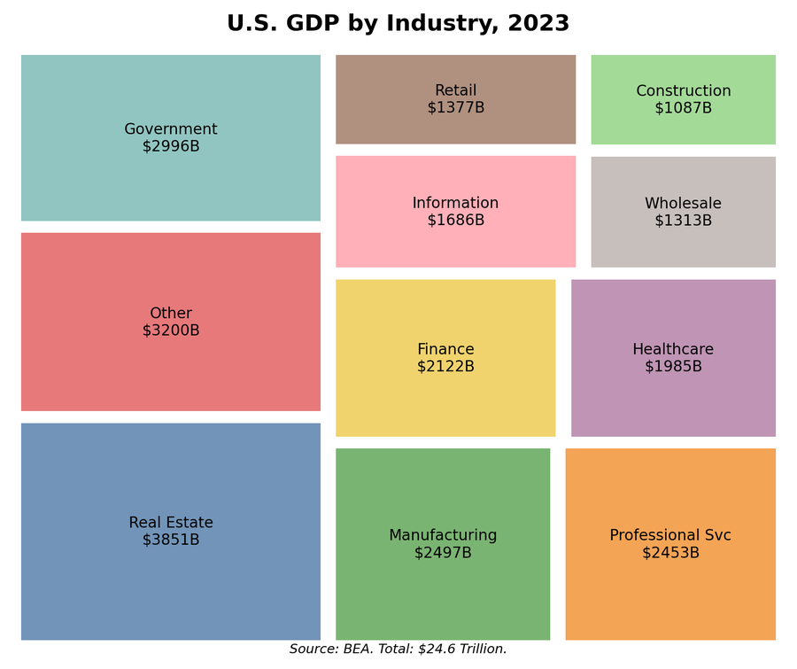
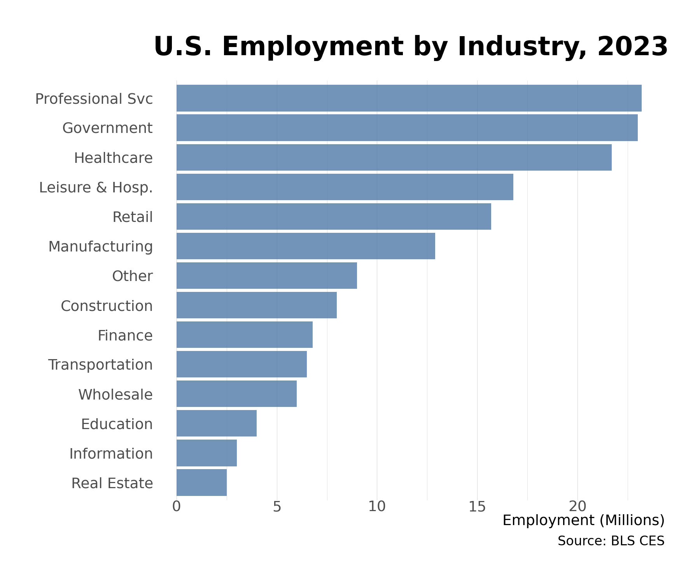

# 1. The American Economy in Numbers

The American economy produces $27 trillion worth of goods and services each year. To put that in perspective: the New York metropolitan area alone has a larger economy than Canada. California's output exceeds that of India. Texas produces more than Russia. The United States, with about 4% of the world's population, accounts for roughly a quarter of global GDP.

But what does a $27 trillion economy actually look like? Who works in it, what do they produce, and where? This chapter provides the basic map---the statistical portrait that frames everything that follows.

## The Big Picture

**Gross Domestic Product (2023):** $27.4 trillion

This single number captures the total value of goods and services produced within U.S. borders in a year. It's the most commonly cited measure of economic size, though as we'll see, it has important limitations.

To grasp the scale: if you stacked $27 trillion in $100 bills, the pile would reach to the moon and back---twice. Every day, the American economy produces about $75 billion in value. Every hour, about $3 billion.

**Employment:** 157 million nonfarm workers

These are people on payrolls---employees who show up to a workplace (or log on remotely) and receive a wage or salary. It doesn't include the self-employed, agricultural workers, or the military, but it captures the vast majority of the workforce.

**Establishments:** 8 million businesses with employees

From corner stores to corporate headquarters, the American economy comprises about 8 million distinct places of business that employ at least one person. Add in businesses without employees (solo proprietorships, freelancers), and the count rises to over 30 million.

### How America Compares

The United States remains the world's largest economy by conventional measures, though China has closed the gap dramatically:

| Economy | GDP (2023) |
|---------|-----------|
| United States | $27.4 trillion |
| China | roughly $18 trillion |
| European Union | roughly $18.6 trillion |
| Japan | $4.2 trillion |
| Germany | $4.5 trillion |
| India | $3.7 trillion |

What makes America distinctive isn't just size but productivity. American workers produce about $140,000 in output per year on average---among the highest in the world. This reflects a combination of capital investment, technology, skills, and the sectoral mix of the economy.

## What Gets Produced: GDP by Industry

Where does $27 trillion come from? The answer may surprise you: the largest industries aren't the ones that dominate headlines.

### The Composition of Output

| Industry | Share of GDP | Value Added |
|----------|-------------|-------------|
| Professional & Business Services | 13% | $3.6 trillion |
| Real Estate | 12% | $3.3 trillion |
| Government | 12% | $3.3 trillion |
| Manufacturing | 11% | $3.0 trillion |
| Healthcare & Social Services | 9% | $2.5 trillion |
| Finance & Insurance | 8% | $2.2 trillion |
| Retail Trade | 6% | $1.6 trillion |
| Information (Tech/Media) | 6% | $1.6 trillion |
| Wholesale Trade | 6% | $1.6 trillion |
| Construction | 4% | $1.1 trillion |
| Transportation & Warehousing | 3.5% | $960 billion |
| Other | roughly 10% | $2.7 trillion |

Several patterns stand out:

*Figure 1.1: GDP composition by industry. Professional services, real estate, and government together account for more than a third of U.S. economic output. Source: BEA (2023)*


**Interactive Version:** Explore the GDP treemap below. Hover over sectors for details, use the dropdown to switch between GDP value, share, employment, and productivity views.


<iframe src="../../_interactive/gdp-treemap.html" width="100%" height="750" frameborder="0" style="border-radius: 8px; box-shadow: 0 2px 8px rgba(0,0,0,0.1);"></iframe>

**Services dominate.** The goods-producing sectors---manufacturing, construction, mining, agriculture---together account for less than 20% of GDP. The remaining 80%+ comes from services: professional services, healthcare, finance, retail, government, real estate. This is sometimes called the "post-industrial" economy, though it's more accurate to say we've shifted what we produce rather than stopped producing.

**Real estate is huge.** The real estate sector's 12% share includes the imputed rent that homeowners "pay" themselves, but it also reflects genuine economic activity: property management, real estate services, and the housing market's central role in the economy.

**Professional services lead.** The largest private-sector contributor isn't manufacturing or tech---it's the sprawling category of professional and business services: law firms, accounting practices, consulting, engineering, advertising, staffing agencies, and corporate headquarters functions.

**Manufacturing still matters.** Despite decades of relative decline, manufacturing produces $3 trillion in value---more than the entire GDP of the United Kingdom. The sector has become more capital-intensive: it produces more output with fewer workers than ever before.

### What GDP Measures (and Doesn't)

GDP counts market production---goods and services exchanged for money. This creates some well-known quirks:

- If you hire a housekeeper, their work counts toward GDP. If you clean your own house, it doesn't.
- Pollution cleanup adds to GDP; the pollution itself doesn't subtract.
- The illegal economy (drugs, off-the-books work) is mostly excluded.
- Unpaid caregiving---raising children, caring for elderly parents---doesn't appear.

GDP is also a flow, not a stock. It measures what's produced each year, not the accumulated wealth of the nation. A country could have enormous GDP while running down its natural resources, degrading its infrastructure, or accumulating unsustainable debt.

Despite these limitations, GDP remains the standard measure because it's comprehensive, consistent, and comparable across time and countries. Just remember what it captures: the market value of final goods and services produced within a country's borders in a given period.

## Who Works: Employment by Sector

Employment tells a different story than GDP. Some industries are labor-intensive (lots of workers per dollar of output); others are capital-intensive (lots of machinery and technology per worker).

### Where Americans Work (2023)

| Sector | Employment | Share |
|--------|-----------|-------|
| Education & Health Services | 26.4 million | 17% |
| Government | 23.1 million | 15% |
| Professional & Business Services | 22.9 million | 15% |
| Leisure & Hospitality | 16.8 million | 11% |
| Retail Trade | 15.6 million | 10% |
| Manufacturing | 12.6 million | 8% |
| Financial Activities | 9.1 million | 6% |
| Construction | 8.1 million | 5% |
| Transportation & Warehousing | 6.2 million | 4% |
| Wholesale Trade | 6.1 million | 4% |
| Other Services | 5.9 million | 4% |
| Information | 2.9 million | 2% |
| Mining & Utilities | 1.2 million | 1% |

*Figure 1.2: Employment by sector. Education and healthcare employ the most Americans, followed by government and professional services. Source: BLS CES (2023)*


**Interactive Version:** Use the chart below to sort by different metrics, compare GDP vs employment shares, and visualize the productivity gap between sectors.


<iframe src="../../_interactive/employment-chart.html" width="100%" height="850" frameborder="0" style="border-radius: 8px; box-shadow: 0 2px 8px rgba(0,0,0,0.1);"></iframe>

### The GDP-Employment Gap

Compare these rankings with GDP share, and you'll notice striking divergences:

**Healthcare and education** employ more people than any other sector (17% of the workforce) but produce 9% of GDP. These are labor-intensive services where productivity gains are difficult. You can't automate a nursing home visit or a kindergarten class the way you can automate a factory.

**Manufacturing** contributes 11% of GDP but employs only 8% of workers. Each manufacturing worker produces about $240,000 in value annually---far above the economy-wide average. Automation, technology, and capital investment have made factories extraordinarily productive.

**Leisure and hospitality** employs 11% of workers but produces only about 4% of GDP. Restaurants, hotels, and entertainment venues pay relatively low wages for work that's hard to automate.

**Information/tech** shows the reverse: 2% of employment but 6% of GDP. Tech workers are among the most productive (and highly paid) in the economy.

*Figure 1.3: The GDP-employment gap by sector. Manufacturing and tech produce far more output per worker than healthcare or leisure services. This divergence drives wage inequality and shapes automation's impact. Source: BEA, BLS (2023)*

These gaps explain much about wage inequality, regional divergence, and the political economy of trade and automation. Industries that can substitute capital for labor tend to have rising productivity, higher wages, and falling employment shares. Industries that can't---healthcare, education, personal services---absorb more workers but face persistent cost pressures.

## The Structure of Business

### Size Distribution

American business spans an enormous range of scales. At one extreme, a Fortune 500 company like Walmart employs 2.1 million people and generates $570 billion in revenue. At the other, millions of self-employed individuals---freelancers, consultants, gig workers---operate as one-person businesses.

The distribution is highly skewed:

| Firm Size | Share of Firms | Share of Employment |
|-----------|---------------|-------------------|
| Under 20 employees | 90% | 17% |
| 20-499 employees | 9.7% | 29% |
| 500+ employees | 0.3% | 54% |

Read that again: 0.3% of firms---about 20,000 large enterprises---employ more than half of all American workers. The American economy is, in an important sense, an economy of large corporations surrounded by millions of small businesses.

This matters for policy debates. Small businesses are celebrated as the engine of job creation, and it's true that new small businesses create most gross new jobs. But small businesses also destroy lots of jobs (through failure), and most employment at any given time is at large, established firms.

### The Fortune 500

The largest American corporations are staggeringly large. The Fortune 500's combined revenues approach $20 trillion---about 70% of GDP (though revenue and value-added aren't directly comparable). These 500 companies employ over 30 million people.

The composition of the Fortune 500 has shifted dramatically over decades:

- In 1955, the top 10 were dominated by industrial giants: GM, Exxon, U.S. Steel, GE.
- In 2024, the top 10 include Walmart (retail), Amazon (tech/retail), Apple (tech), and health insurers (UnitedHealth, CVS).
- Tech companies now dominate by market value, even if not always by revenue.

### Establishments vs. Firms

A distinction that matters: **firms** are legal entities (companies); **establishments** are physical locations (stores, factories, offices). A single firm may operate thousands of establishments. Walmart is one firm but operates over 10,000 establishments. Understanding this distinction matters when interpreting data: establishment counts tell you about the geographic footprint of business; firm counts tell you about corporate structure and concentration.

## How We Measure: The Statistical Infrastructure

The numbers in this chapter come from an elaborate statistical infrastructure built over more than a century. Three agencies do most of the heavy lifting:

### Bureau of Economic Analysis (BEA)

The BEA, part of the Commerce Department, produces the National Income and Product Accounts (NIPA)---the official measure of GDP and its components. Key products include:

- **GDP and components** (quarterly and annual)
- **GDP by industry** (value added by sector)
- **GDP by state and metro area** (regional accounts)
- **Input-output tables** (how industries buy from each other)
- **International transactions** (balance of payments)

When you hear that GDP grew 2.5% last year, that number comes from BEA.

### Bureau of Labor Statistics (BLS)

The BLS, part of the Labor Department, measures employment, unemployment, wages, and prices. Key products include:

- **Current Employment Statistics (CES)**: The monthly jobs report that moves markets, based on a survey of 670,000 establishments
- **Current Population Survey (CPS)**: The source of the unemployment rate, based on a household survey
- **Consumer Price Index (CPI)**: The main measure of inflation
- **Occupational Employment Statistics (OES)**: Detailed wage and employment data by occupation
- **Productivity statistics**: Output per hour worked

### Census Bureau

The Census Bureau, also part of Commerce, conducts the decennial population census but also produces detailed business statistics:

- **Economic Census** (every 5 years): A comprehensive count of all businesses, the foundation for industry statistics
- **County Business Patterns**: Annual data on establishments and employment by county
- **Statistics of U.S. Businesses (SUSB)**: Firm-level data by size and industry

### The NAICS System

All these agencies organize data using the North American Industry Classification System (NAICS), which categorizes every business establishment into a hierarchical code:

- 2-digit: Major sector (e.g., 31-33 = Manufacturing)
- 3-digit: Subsector (e.g., 336 = Transportation Equipment)
- 4-digit: Industry group (e.g., 3361 = Motor Vehicles)
- 5-digit: Industry (e.g., 33611 = Automobile Manufacturing)
- 6-digit: National industry (e.g., 336111 = Automobile Manufacturing)

Understanding NAICS codes matters for anyone working with economic data. The system replaced the older SIC codes in 1997 and is updated periodically to reflect economic change.

## Reading the Numbers

Statistics are only as useful as your ability to interpret them. A few principles:

**Levels vs. changes.** GDP of $27 trillion is a level; GDP growth of 2.5% is a change. Both matter, but they answer different questions. Levels tell you about size and scale; changes tell you about dynamics and momentum.

**Nominal vs. real.** Nominal figures are in current dollars; real figures adjust for inflation. A nominal GDP increase could reflect more production, higher prices, or both. Real GDP strips out the price effect to measure actual output growth. For comparing over time, always use real figures.

**Stocks vs. flows.** GDP is a flow (production per year); wealth is a stock (accumulated assets). Employment is a stock (people employed at a point in time); job creation is a flow (new jobs over a period).

**Seasonality.** Many economic series have regular seasonal patterns---retail sales spike in December, construction slows in winter. Seasonally adjusted figures remove these patterns to reveal underlying trends.

**Revisions.** Economic statistics are revised, sometimes substantially. The first estimate of GDP growth is often revised in subsequent months as more data arrives. Don't over-interpret preliminary numbers.

## What the Numbers Don't Show

This statistical portrait captures the formal, measured economy. It misses several important dimensions:

**The informal economy.** Cash transactions, under-the-table work, and illegal activity don't appear in official statistics. Estimates suggest the informal economy adds 5-10% to measured GDP.

**Household production.** Cooking, cleaning, childcare, and elder care performed without pay aren't counted. If these activities were valued at market rates, they'd add trillions to GDP.

**Quality improvements.** A smartphone today does far more than one from 2010, but GDP statistics struggle to capture quality improvements. This may mean we undercount actual economic progress.

**Distribution.** GDP tells you total output, not who receives it. The same GDP could reflect a society of widespread prosperity or extreme inequality. For distribution, you need separate data on income and wealth.

**Well-being.** GDP measures production, not welfare. More is not always better---if production degrades the environment, undermines health, or requires unsustainably long working hours, GDP rises while well-being may fall.

These limitations don't invalidate economic statistics, but they do counsel humility. The numbers provide a useful map of the economy, not the territory itself.

## Key Takeaways

1. **The American economy is enormous**: $27 trillion in GDP, 157 million workers, 8 million establishments. Only China approaches its scale.

2. **Services dominate**: Over 80% of GDP comes from services, not goods production. Professional services, real estate, healthcare, and finance are the largest sectors.

3. **Employment and output diverge**: Labor-intensive sectors (healthcare, leisure) employ disproportionately many workers; capital-intensive sectors (manufacturing, tech) produce disproportionately much output.

4. **Large firms employ most workers**: 0.3% of firms account for 54% of employment. The American economy is structurally concentrated despite millions of small businesses.

5. **Statistics require interpretation**: Understanding what GDP measures (and doesn't), the difference between nominal and real, and the sources of data is essential for informed analysis.

## Data Sources and Further Reading

### Key Data Sources

- **Bureau of Economic Analysis (bea.gov)**: GDP, industry accounts, regional data
- **Bureau of Labor Statistics (bls.gov)**: Employment, wages, prices
- **Census Bureau (census.gov)**: Business statistics, economic census
- **FRED (fred.stlouisfed.org)**: Federal Reserve database aggregating thousands of series

### Further Reading

- Diane Coyle, *GDP: A Brief but Affectionate History* (2014)---The best accessible history of national income accounting
- Bureau of Economic Analysis, *Concepts and Methods of the U.S. National Income and Product Accounts*---The technical reference for GDP measurement
- J. Steven Landefeld, "GDP: One of the Great Inventions of the 20th Century," *Survey of Current Business* (2000)
