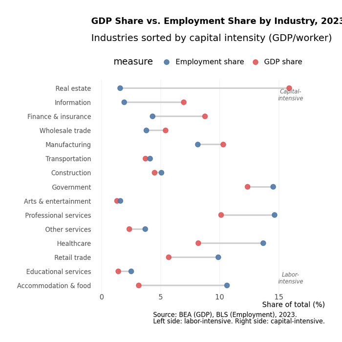

# Chapter 1: The American Economy in Numbers

The United States generates $27 trillion in annual output. New York's metropolitan area alone outproduces Canada. California exceeds India. Texas, Russia. Four percent of the world's population, one-quarter of its GDP.

What does a $27 trillion economy look like from the inside---who works in it, what they make, and where? The statistics that follow answer these questions and frame the chapters ahead.

## The Big Picture

**Gross Domestic Product (2023):** $27.4 trillion


**Gross Domestic Product (GDP)** measures the total market value of all final goods and services produced within a country's borders during a specific period. "Final" means goods sold to end users---not intermediate inputs that will be processed further.


GDP measures the total value of goods and services produced within U.S. borders over a year---the standard benchmark for economic size, though an imperfect one (it misses unpaid labor, ignores environmental costs, and conflates activity with welfare).

The daily output runs to $75 billion. Hourly, $3 billion. At any moment, the American economy produces wealth at a rate no other nation matches.

**Employment:** 157 million nonfarm workers


**Nonfarm Payroll Employment** counts workers on the payrolls of non-agricultural businesses. It excludes self-employed individuals, unpaid family workers, farm workers, and military personnel. This is the headline number in the monthly "jobs report."


These are people on payrolls---employees who show up to a workplace (or log on remotely) and receive a wage or salary. It doesn't include the self-employed, agricultural workers, or the military, but it captures the vast majority of the workforce.

**Establishments:** 8 million businesses with employees

From corner stores to corporate headquarters, the American economy comprises about 8 million distinct places of business that employ at least one person. Add in businesses without employees (solo proprietorships, freelancers), and the count rises to over 30 million.

### How America Compares

The United States remains the world's largest economy by conventional measures, though China has closed the gap dramatically:

**Table 1.0: Global GDP Comparison (2023)**

| Rank | Economy | GDP (2023) |
|:----:|---------|----------:|
| 1 | **United States** | **$27.4T** |
| 2 | European Union | $18.6T |
| 3 | China | $18.0T |
| 4 | Germany | $4.5T |
| 5 | Japan | $4.2T |
| 6 | India | $3.7T |

*Source: IMF World Economic Outlook, October 2023*

What makes America distinctive isn't just size but productivity. American workers produce about $175,000 in output per year on average---among the highest in the world. This reflects a combination of capital investment, technology, skills, and the sectoral mix of the economy.

## What Gets Produced: GDP by Industry

Where does $27 trillion come from? The answer may surprise you: the largest industries aren't the ones that dominate headlines.

### The Composition of Output

**Table 1.1: GDP by Major Industry (2023)**

| Industry | Share of GDP | Value Added |
|----------|------------:|------------:|
| Professional & Business Services | 13% | $3.6T |
| Real Estate | 12% | $3.3T |
| Government | 11% | $3.0T |
| Manufacturing | 11% | $3.0T |
| Healthcare & Social Services | 9% | $2.5T |
| Finance & Insurance | 8% | $2.2T |
| Information (Tech/Media) | 6% | $1.6T |
| Retail Trade | 6% | $1.6T |
| Wholesale Trade | 6% | $1.6T |
| Construction | 4% | $1.1T |
| Transportation & Warehousing | 3.5% | $960B |
| Other | ~10.5% | ~$2.9T |

*Source: Bureau of Economic Analysis, GDP by Industry (Table 1.5.5, 2023 annual data). Note: Shares sum to more than 100% due to rounding and the exclusion of some smaller sectors from the "Other" residual.*

Several patterns stand out:

<figure>

<figcaption>Figure 1.1: U.S. GDP composition by industry (2023). Services dominate, with professional services, real estate, and government each exceeding manufacturing. <a href="https://laurencehw.github.io/the-american-economy/book/_interactive/gdp-treemap.html" target="_blank">View interactive version</a>. Source: BEA</figcaption>
</figure>

**Services dominate.** The goods-producing sectors---manufacturing, construction, mining, agriculture---together account for less than 20% of GDP. The remaining 80%+ comes from services: professional services, healthcare, finance, retail, government, real estate. This is sometimes called the "post-industrial" economy, though it's more accurate to say we've shifted what we produce rather than stopped producing.

**Real estate is huge.** The real estate sector's 12% share includes the imputed rent that homeowners "pay" themselves, but it also reflects genuine economic activity: property management, real estate services, and the housing market's central role in the economy.

**Professional services lead.** The largest private-sector contributor isn't manufacturing or tech---it's the sprawling category of professional and business services: law firms, accounting practices, consulting, engineering, advertising, staffing agencies, and corporate headquarters functions.

**Manufacturing still matters.** Despite decades of relative decline, manufacturing produces $3 trillion in value---more than the entire GDP of the United Kingdom. The sector has become more capital-intensive: it produces more output with fewer workers than ever before.

### What GDP Measures (and Doesn't)

GDP counts market production---goods and services exchanged for money. This creates some well-known quirks:

- If you hire a housekeeper, their work counts toward GDP. If you clean your own house, it doesn't.
- Pollution cleanup adds to GDP; the pollution itself doesn't subtract.
- The illegal economy (drugs, off-the-books work) is mostly excluded.
- Unpaid caregiving---raising children, caring for elderly parents---doesn't appear.

GDP is also a flow, not a stock. It measures what's produced each year, not the accumulated wealth of the nation. A country could have enormous GDP while running down its natural resources, degrading its infrastructure, or accumulating unsustainable debt.


**Common Misconception**: GDP growth does not equal prosperity growth. A country can report rising GDP while depleting natural resources, accumulating debt, or concentrating gains among a small elite. GDP measures production, not well-being.


Despite these limitations, GDP remains the standard measure because it's comprehensive, consistent, and comparable across time and countries. Just remember what it captures: the market value of final goods and services produced within a country's borders in a given period.

## Who Works: Employment by Sector

Employment tells a different story than GDP. Some industries are labor-intensive (lots of workers per dollar of output); others are capital-intensive (lots of machinery and technology per worker).

### Where Americans Work (2023)

**Table 1.2: Employment by Sector**

| Sector | Employment | Share |
|--------|----------:|------:|
| Education & Health Services | 26.4M | 17% |
| Government | 23.1M | 15% |
| Professional & Business Services | 22.9M | 15% |
| Leisure & Hospitality | 16.8M | 11% |
| Retail Trade | 15.6M | 10% |
| Manufacturing | 12.6M | 8% |
| Financial Activities | 9.1M | 6% |
| Construction | 8.1M | 5% |
| Transportation & Warehousing | 6.2M | 4% |
| Wholesale Trade | 6.1M | 4% |
| Other Services | 5.9M | 4% |
| Information | 2.9M | 2% |
| Mining & Utilities | 1.2M | 1% |

*Source: Bureau of Labor Statistics, Current Employment Statistics (CES), December 2023*

<figure>

<figcaption>Figure 1.2: Employment by sector. Education and healthcare employ the most Americans, followed by government and professional services. <a href="https://laurencehw.github.io/the-american-economy/book/_interactive/employment-chart.html" target="_blank">View interactive version</a>. Source: BLS CES (2023)</figcaption>
</figure>

### The GDP-Employment Gap

Compare these rankings with GDP share, and you'll notice striking divergences:

**Healthcare and education** employ more people than any other sector (17% of the workforce) but produce 9% of GDP as measured by value added in the BEA industry accounts. (Note: total national health expenditure, a broader measure tracked by CMS, is roughly 18% of GDP---the difference reflects how healthcare spending flows through insurance, government programs, and employer contributions that appear in other sectors' value added.) These are labor-intensive services where productivity gains are difficult. You can't automate a nursing home visit or a kindergarten class the way you can automate a factory.

**Manufacturing** contributes 11% of GDP but employs only 8% of workers. Each manufacturing worker produces about $240,000 in value annually---far above the economy-wide average. Automation, technology, and capital investment have made factories extraordinarily productive.

**Leisure and hospitality** employs 11% of workers but produces only about 4% of GDP. Restaurants, hotels, and entertainment venues pay relatively low wages for work that's hard to automate.

**Information/tech** shows the reverse: 2% of employment but 6% of GDP. Tech workers are among the most productive (and highly paid) in the economy.

<figure>

<figcaption>Figure 1.3: The GDP-employment gap by sector. Manufacturing and tech produce far more output per worker than healthcare or leisure services. This divergence drives wage inequality and shapes automation's impact. Source: BEA, BLS (2023)</figcaption>
</figure>

These gaps explain much about wage inequality, regional divergence, and the political economy of trade and automation. Industries that can substitute capital for labor tend to have rising productivity, higher wages, and falling employment shares. Industries that can't---healthcare, education, personal services---absorb more workers but face persistent cost pressures.


**Deep Dive: The Baumol Effect**

Why do healthcare and education costs rise faster than inflation? Economist William Baumol identified a structural problem: some services resist productivity gains. A string quartet in 1850 required four musicians playing for 40 minutes. In 2024, it still does. Meanwhile, manufacturing productivity has increased 100-fold. Service sectors must raise wages to compete for workers, but can't offset costs with productivity---so prices rise. This explains much about the modern economy's cost structure.


## The Structure of Business

### Size Distribution

American business spans an enormous range of scales. At one extreme, a Fortune 500 company like Walmart employs 2.1 million people and generates $570 billion in revenue. At the other, millions of self-employed individuals---freelancers, consultants, gig workers---operate as one-person businesses.

The distribution is highly skewed:

**Table 1.3: Firm Size Distribution**

| Firm Size | Share of Firms | Share of Employment |
|-----------|---------------:|--------------------:|
| Under 20 employees | 90% | 17% |
| 20-499 employees | 9.7% | 29% |
| **500+ employees** | **0.3%** | **54%** |

*Source: Census Bureau, Statistics of U.S. Businesses (SUSB), 2021*

Read that again: 0.3% of firms---about 20,000 large enterprises---employ more than half of all American workers. The American economy is, in an important sense, an economy of large corporations surrounded by millions of small businesses.


**Common Misconception**: "Small businesses create most jobs." This is true only for *gross* job creation. Small businesses also destroy many jobs through failure. At any given time, most Americans work for large, established firms---not startups or small businesses.


### The Fortune 500

The largest American corporations are staggeringly large. The Fortune 500's combined revenues approach $20 trillion---about 70% of GDP (though revenue and value-added aren't directly comparable). These 500 companies employ over 30 million people.

The composition of the Fortune 500 has shifted dramatically over decades:

- In 1955, the top 10 were dominated by industrial giants: GM, Exxon, U.S. Steel, GE.
- In 2024, the top 10 include Walmart (retail), Amazon (tech/retail), Apple (tech), and health insurers (UnitedHealth, CVS).
- Tech companies now dominate by market value, even if not always by revenue.

### Establishments vs. Firms

A distinction that matters: **firms** are legal entities (companies); **establishments** are physical locations (stores, factories, offices). A single firm may operate thousands of establishments. Walmart is one firm but operates over 4,700 U.S. stores. Understanding this distinction matters when interpreting data: establishment counts tell you about the geographic footprint of business; firm counts tell you about corporate structure and concentration.


**Firm vs. Establishment**: A **firm** is a legal business entity (a company). An **establishment** is a single physical location where business is conducted. Always check which measure your data uses---the numbers can differ dramatically.


## How We Measure: The Statistical Infrastructure

The numbers in this chapter come from an elaborate statistical infrastructure built over more than a century. Three agencies do most of the heavy lifting:

### Bureau of Economic Analysis (BEA)

The BEA, part of the Commerce Department, produces the National Income and Product Accounts (NIPA)---the official measure of GDP and its components. Key products include:

- **GDP and components** (quarterly and annual)
- **GDP by industry** (value added by sector)
- **GDP by state and metro area** (regional accounts)
- **Input-output tables** (how industries buy from each other)
- **International transactions** (balance of payments)

When you hear that GDP grew 2.5% last year, that number comes from BEA.

### Bureau of Labor Statistics (BLS)

The BLS, part of the Labor Department, measures employment, unemployment, wages, and prices. Key products include:

- **Current Employment Statistics (CES)**: The monthly jobs report that moves markets, based on a survey of 670,000 establishments
- **Current Population Survey (CPS)**: The source of the unemployment rate, based on a household survey


**Deep Dive: Why Economic Data Gets Revised**

The BLS publishes employment data 3 weeks after each month ends. How? Surveys. The initial estimate samples 670,000 establishments. Over subsequent months, more responses arrive and benchmarks are applied. The "final" number may differ from the initial release by 100,000+ jobs. Markets react to the first number, but researchers should use revised data.

- **Consumer Price Index (CPI)**: The main measure of inflation
- **Occupational Employment Statistics (OES)**: Detailed wage and employment data by occupation
- **Productivity statistics**: Output per hour worked

### Census Bureau

The Census Bureau, also part of Commerce, conducts the decennial population census but also produces detailed business statistics:

- **Economic Census** (every 5 years): A comprehensive count of all businesses, the foundation for industry statistics
- **County Business Patterns**: Annual data on establishments and employment by county
- **Statistics of U.S. Businesses (SUSB)**: Firm-level data by size and industry

### The NAICS System

All these agencies organize data using the North American Industry Classification System (NAICS), which categorizes every business establishment into a hierarchical code:

- 2-digit: Major sector (e.g., 31-33 = Manufacturing)
- 3-digit: Subsector (e.g., 336 = Transportation Equipment)
- 4-digit: Industry group (e.g., 3361 = Motor Vehicles)
- 5-digit: Industry (e.g., 33611 = Automobile Manufacturing)
- 6-digit: National industry (e.g., 336111 = Automobile Manufacturing)

Understanding NAICS codes matters for anyone working with economic data. The system replaced the older SIC codes in 1997 and is updated periodically to reflect economic change.


**Reading NAICS Codes**: The more digits, the more specific. Code 31-33 covers all Manufacturing; 336 is Transportation Equipment; 336111 is specifically Automobile Manufacturing. When researching industries, start broad (2-digit) then narrow down.


## Reading the Numbers

Statistics are only as useful as your ability to interpret them. A few principles:

**Levels vs. changes.** GDP of $27 trillion is a level; GDP growth of 2.5% is a change. Both matter, but they answer different questions. Levels tell you about size and scale; changes tell you about dynamics and momentum.

**Nominal vs. real.** Nominal figures are in current dollars; real figures adjust for inflation. A nominal GDP increase could reflect more production, higher prices, or both. Real GDP strips out the price effect to measure actual output growth. For comparing over time, always use real figures.

**Stocks vs. flows.** GDP is a flow (production per year); wealth is a stock (accumulated assets). Employment is a stock (people employed at a point in time); job creation is a flow (new jobs over a period).

**Seasonality.** Many economic series have regular seasonal patterns---retail sales spike in December, construction slows in winter. Seasonally adjusted figures remove these patterns to reveal underlying trends.

**Revisions.** Economic statistics are revised, sometimes substantially. The first estimate of GDP growth is often revised in subsequent months as more data arrives. Don't over-interpret preliminary numbers.


**Data Caution**: Initial GDP and employment estimates are frequently revised---sometimes by full percentage points. The "advance" GDP estimate uses incomplete data. Wait for the "final" release (3 months later) before drawing firm conclusions.


## What the Numbers Don't Show

This statistical portrait captures the formal, measured economy. It misses several important dimensions:

**The informal economy.** Cash transactions, under-the-table work, and illegal activity don't appear in official statistics. Estimates suggest the informal economy adds 5-10% to measured GDP.

**Household production.** Cooking, cleaning, childcare, and elder care performed without pay aren't counted. If these activities were valued at market rates, they'd add trillions to GDP.

**Quality improvements.** A smartphone today does far more than one from 2010, but GDP statistics struggle to capture quality improvements. This may mean we undercount actual economic progress.

**Distribution.** GDP tells you total output, not who receives it. The same GDP could reflect a society of widespread prosperity or extreme inequality. For distribution, you need separate data on income and wealth.

**Well-being.** GDP measures production, not welfare. More is not always better---if production degrades the environment, undermines health, or requires unsustainably long working hours, GDP rises while well-being may fall.

These limitations don't invalidate economic statistics, but they do counsel humility. The numbers provide a useful map of the economy, not the territory itself.

## Key Takeaways

1. **The American economy is enormous**: $27 trillion in GDP, 157 million workers, 8 million establishments. Only China approaches its scale.

2. **Services dominate**: Over 80% of GDP comes from services, not goods production. Professional services, real estate, healthcare, and finance are the largest sectors.

3. **Employment and output diverge**: Labor-intensive sectors (healthcare, leisure) employ disproportionately many workers; capital-intensive sectors (manufacturing, tech) produce disproportionately much output.

4. **Large firms employ most workers**: 0.3% of firms account for 54% of employment. The American economy is structurally concentrated despite millions of small businesses.

5. **Statistics require interpretation**: Understanding what GDP measures (and doesn't), the difference between nominal and real, and the sources of data is essential for informed analysis.

## Data Sources and Further Reading

### Key Data Sources

- **Bureau of Economic Analysis (bea.gov)**: GDP, industry accounts, regional data
- **Bureau of Labor Statistics (bls.gov)**: Employment, wages, prices
- **Census Bureau (census.gov)**: Business statistics, economic census
- **FRED (fred.stlouisfed.org)**: Federal Reserve database aggregating thousands of series

### Further Reading

- Diane Coyle, *GDP: A Brief but Affectionate History* (2014)---The best accessible history of national income accounting
- Bureau of Economic Analysis, *Concepts and Methods of the U.S. National Income and Product Accounts*---The technical reference for GDP measurement
- J. Steven Landefeld, "GDP: One of the Great Inventions of the 20th Century," *Survey of Current Business* (2000)

## Exercises

### Review Questions

1. The United States produces roughly $27 trillion in GDP. Name the three largest sectors by GDP contribution and explain why their rankings might surprise someone unfamiliar with the economy.

2. Manufacturing contributes about 11% of GDP but only 8% of employment. Healthcare contributes about 9% of GDP but 17% of employment. What concept explains this divergence, and what are its implications for wages in each sector?

3. The text states that 0.3% of firms employ 54% of American workers. How does this challenge the common narrative that small businesses are the "backbone" of the economy? In what sense is the narrative still partially correct?

4. GDP measures the market value of final goods and services. List three economically important activities that GDP *fails* to capture, and explain why each omission matters for understanding true economic well-being.

5. Explain the difference between nominal and real GDP. Why would using nominal GDP to compare the economy in 2000 and 2023 be misleading?

6. What is the difference between a "firm" and an "establishment"? Why does this distinction matter when interpreting economic data? Give an example.

### Data Exercises

7. **Exploring NAICS codes**: Go to the Bureau of Labor Statistics Occupational Employment Statistics page (bls.gov/oes). Look up a 3-digit NAICS industry of your choice. What occupations does it include? What is the median annual wage for the industry's largest occupation? How does this compare to the economy-wide median?

8. **GDP by state**: Using the BEA's regional data (bea.gov/data/gdp/gdp-state), find the GDP of your home state. What share of national GDP does it represent? How does your state's per capita GDP compare to the national average? What industries drive the difference?

9. **Tracking revisions**: Go to FRED (fred.stlouisfed.org) and look up the series "GDPC1" (Real GDP). Compare the "advance" estimate for any recent quarter with the most recent revised figure. How large was the revision? What does this tell you about the reliability of first-release economic data?

### Deeper Investigation

10. The text notes that GDP "conflates activity with welfare." Research one alternative measure of economic well-being (such as the Genuine Progress Indicator, the Human Development Index, or the OECD Better Life Index). How does the United States rank on this measure compared to its GDP ranking? What does the gap reveal about the American economy?
