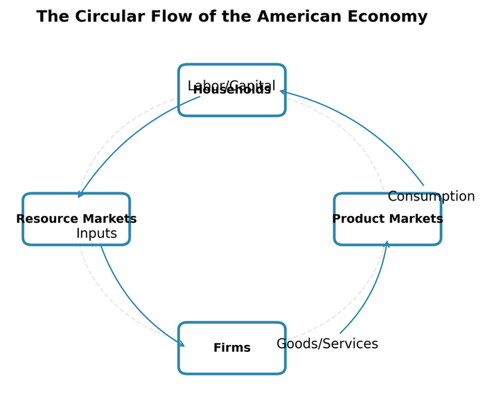
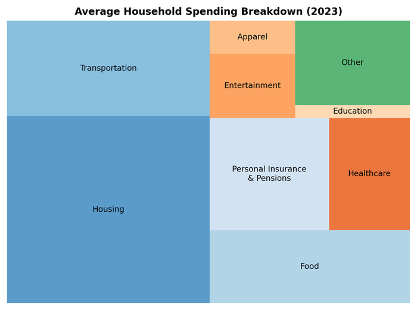

# 2. How It All Fits Together

The previous chapter presented the economy as a collection of sectors---manufacturing here, healthcare there, finance somewhere else. But the economy isn't a collection of independent silos. It's a vast network of buyers and sellers, inputs and outputs, where every industry depends on others and supplies others in turn.

A car doesn't emerge from an automobile factory alone. It requires steel from mills, which require iron ore from mines and coal for energy. It requires semiconductors from fabs, which require specialized chemicals and precision equipment. It requires rubber for tires, glass for windows, plastic for dashboards, aluminum for engine blocks. The factory itself needs electricity, insurance, legal services, advertising, trucking, and thousands of other inputs. And once the car is built, dealers need financing, consumers need auto loans, cities need roads.

This chapter maps these connections: how industries link together, how money flows through the economy, and how disruption in one sector ripples through others.

## The Input-Output Framework

### What Input-Output Tables Show

In 1936, economist Wassily Leontief published the first input-output tables for the U.S. economy, work that would later earn him a Nobel Prize. The idea was elegantly simple: track what each industry buys from every other industry.

An input-output table is a matrix. Each row shows what an industry sells---to other industries and to final consumers. Each column shows what an industry buys---from other industries and from primary factors (labor, capital). The whole economy becomes a web of transactions.

Consider a simplified example:

|  | Agriculture | Manufacturing | Services | Final Demand | Total Output |
|---|------------|---------------|----------|--------------|--------------|
| **Agriculture** | 10 | 30 | 5 | 55 | 100 |
| **Manufacturing** | 20 | 50 | 40 | 190 | 300 |
| **Services** | 15 | 40 | 30 | 215 | 300 |
| **Value Added** | 55 | 180 | 225 | - | 460 |
| **Total Input** | 100 | 300 | 300 | 460 | - |

<figure>

<figcaption>Figure 2.1: A simplified representation of inter-industry flows. Every sector buys from and sells to other sectors; the economy is a network, not isolated silos. Source: BEA I-O Accounts</figcaption>
</figure>

Reading this table:
- Agriculture sells $30 to manufacturing (grain for food processing, cotton for textiles), $5 to services, $55 to final consumers (food), and $10 to itself (seeds, feed).
- Manufacturing buys $30 from agriculture, $50 from itself (components, intermediate goods), $40 from services (business services, finance), plus $180 in value added (wages, profits).

### Why Input-Output Matters

This framework reveals several insights invisible in standard GDP statistics:

**Interdependence.** Every industry depends on others. Even "primary" sectors like agriculture require manufactured inputs (tractors, fertilizer) and services (financing, insurance). The economy is not divisible into independent pieces.

**Multiplier effects.** When final demand for cars increases by $1 million, the automobile industry needs to produce $1 million more---but that requires more steel, more semiconductors, more electricity, more trucking. Those industries need more of *their* inputs. The total economic impact ripples through the system, multiplying the initial shock.

**Vulnerability.** Supply chain disruptions cascade. When a pandemic shuts chip factories in Asia, American automakers can't build cars---not because of any problem in Detroit, but because a critical input vanished. Input-output analysis helps identify these chokepoints.

**Structural change.** The mix of inputs changes over time. In 1950, making a car required lots of steel and labor; in 2020, it requires more electronics, software, and robots. Input-output tables track this evolution.

### Upstream and Downstream

Economists use spatial metaphors to describe industry linkages:

**Upstream** industries provide inputs: mining extracts raw materials, agriculture grows crops, utilities generate power. They're "upstream" in the flow from raw materials to finished goods.

**Downstream** industries use those inputs: manufacturing transforms materials, retail sells finished products, services deliver them to consumers.

**Backward linkages** connect an industry to its suppliers. When auto production expands, it pulls resources from upstream: more steel, more glass, more semiconductors.

**Forward linkages** connect an industry to its customers. When steel production expands, it enables more cars, more buildings, more appliances downstream.

Some industries are hubs with dense connections in both directions. Energy is the classic example: nearly every industry requires electricity or fuel, making energy disruptions particularly damaging.

## Following the Money: Circular Flow

### The Basic Circuit

Money circulates through the economy in predictable patterns. The simplest model shows two sectors:

1. **Households** own factors of production (labor, capital) and consume goods and services.
2. **Businesses** hire factors, produce goods, and sell to households.

Money flows in a circle: businesses pay wages and profits to households; households spend on goods and services from businesses. GDP equals total spending equals total income---different ways of measuring the same circular flow.

<figure>

<figcaption>Figure 2.2: The circular flow of income and spending. Money flows from businesses to households as wages and profits, and from households to businesses as consumer spending. Government, finance, and foreign trade add complexity. Source: Author illustration</figcaption>
</figure>


**Interactive Version:** Click on the nodes below or use the step buttons to explore how money flows through the economy. Press "Play Animation" to see the complete circuit in action.


<iframe src="https://laurencehw.github.io/the-american-economy/book/_interactive/circular-flow.html" width="100%" height="850" frameborder="0" style="border-radius: 8px; box-shadow: 0 2px 8px rgba(0,0,0,0.1);"></iframe>

### Adding Complexity

The real economy has more moving parts:

**Government** collects taxes and purchases goods and services. Federal, state, and local governments together spend about $10 trillion annually---nearly 40% of GDP when you include transfer payments like Social Security.

**Financial institutions** intermediate between savers and borrowers. Households deposit savings in banks; banks lend to businesses and homebuyers. The financial sector doesn't produce goods, but it lubricates every transaction.

**The rest of the world** buys American exports and sells us imports. The U.S. runs a trade deficit---we import more than we export---meaning foreign money flows in to finance American consumption and investment.

## The Sectoral Balance Identity

### The Iron Law

One of the most powerful tools for understanding how the economy fits together is the **sectoral balance identity**. It derives from the national income identity but reveals something profound: the surpluses and deficits of different sectors must sum to zero.

Start with the familiar GDP equation:

$$
Y = C + I + G + (X - M)
$$

Rearranging to group by sector:

$$
(S - I) + (T - G) + (M - X) = 0
$$

Where:
- **(S - I)**: Private sector balance (household and business saving minus investment)
- **(T - G)**: Government balance (taxes minus spending)
- **(M - X)**: Foreign sector balance (imports minus exports, or the trade deficit)

**These three balances must sum to zero.** This isn't a theory or assumption---it's an accounting identity that holds by definition. One sector cannot run a surplus unless another runs a deficit.

### What the Balances Tell Us

This identity explains much of American economic history:

**The private sector** (households plus businesses) almost always runs a surplus---Americans save more than they invest domestically, on net.

**The government** almost always runs a deficit---spending exceeds tax revenue, requiring borrowing.

**The foreign sector** has been in surplus since the 1980s---foreigners accumulate claims on the U.S. because we import more than we export.

The policy implication is stark: if the government tries to reduce its deficit (raising T-G), either the private sector must save less (S-I falls) or the trade deficit must shrink (M-X falls). You cannot have government surplus *and* high private saving *and* a trade deficit simultaneously. The arithmetic forbids it.

This constraint explains why fiscal austerity often disappoints. When governments cut spending without a corresponding shift in private behavior or trade, GDP simply falls to make the identity hold.

## The Flow of Funds

### Tracking Who Owes What to Whom

While Kuznets was building GDP accounts to track production, economist Morris Copeland was asking a different question: where is the money going? In 1952, he published *A Study of Moneyflows in the United States*, arguing that to understand a capitalist economy, you must track the flow of funds---who is lending to whom.

The Federal Reserve adopted Copeland's framework, creating what are now called the **Financial Accounts of the United States** (the Z.1 release). These accounts track assets and liabilities for four main sectors:

1. **Households and Nonprofits**: The ultimate owners of wealth. They hold real assets (houses) and financial assets (deposits, stocks, bonds) and owe debt (mortgages, credit cards).

2. **Nonfinancial Business**: Firms that produce goods and services. They borrow to invest in capital.

3. **Government**: Federal, state, and local. The federal government is unique because it issues the currency that others use as safe assets.

4. **Rest of the World**: Foreign entities engaging with the U.S. A trade deficit means foreigners acquire U.S. assets.

### The Balance Sheet Picture

At any moment, the Z.1 accounts show the accumulated stocks:

| Sector | Assets | Liabilities | Net Worth |
|--------|--------|-------------|-----------|
| Households | roughly $175 trillion | roughly $20 trillion | roughly $155 trillion |
| Nonfinancial Business | roughly $55 trillion | roughly $35 trillion | roughly $20 trillion |
| Federal Government | roughly $5 trillion | roughly $35 trillion | -$30 trillion |
| Financial Sector | roughly $130 trillion | roughly $125 trillion | roughly $5 trillion |

Household net worth---about $155 trillion---is the most important number for financial stability. When asset prices rise, households feel wealthier and spend more (the "wealth effect"). When prices crash, as in 2008, consumption collapses.

### Flows vs. Valuations

A crucial distinction: changes in balance sheets come from both transactions (flows) and price changes (valuations).

$$
\Delta \text{Level} = \text{Flow} + \text{Valuation Change}
$$

In 2008, household net worth collapsed not primarily because people stopped saving, but because house and stock prices crashed. The flow of saving was actually positive; the valuation losses overwhelmed it. This is why crises often appear suddenly---balance sheets can deteriorate through price movements even when behavior hasn't changed.

### Why This Matters: The 2008 Lesson

For decades, the Flow of Funds accounts were a backwater, ignored by models that treated finance as a "veil" over the real economy. The main action was in GDP.

The 2008 financial crisis changed everything. Models based only on GDP failed to see the crisis coming because the leverage was hidden in balance sheets, not production flows. Household debt had risen from 60% of GDP in 1990 to 100% by 2007. Corporate leverage was elevated. The financial sector had built an elaborate shadow banking system. All of this was visible in the Z.1 accounts---but few were watching.

Economist Wynne Godley, using stock-flow analysis, warned repeatedly in the mid-2000s that the configuration was unsustainable. His 2006 paper at the Levy Economics Institute was remarkably prescient:

> "The growth in lending... has been so rapid in recent years that a host of pathologies have emerged... we remain skeptical that household borrowing can continue to be the main factor driving the U.S. economy."

When the crisis hit, the scenario Godley outlined played out almost exactly: household spending collapsed, government deficits exploded to absorb the private sector's shift to surplus, and the recession was deeper than any since the 1930s.

Today, "macro-finance" is the dominant paradigm, trying to reunite production accounts with financial accounts. The lesson: you cannot understand the economy by looking only at GDP. You must also track who owes what to whom.

## Value Chains: Three Examples

Abstract input-output tables become concrete when you trace specific value chains---the sequence of activities that transform raw materials into products consumers buy.

### From Farm to Fork: The Food System

Consider a loaf of bread on a grocery shelf. Its journey:

**Agriculture** (1% of GDP, 2 million workers): Wheat farmers in Kansas plant, fertilize, irrigate, and harvest. They buy seeds, tractors, fuel, fertilizer---inputs from manufacturing and chemicals. They sell to grain elevators and commodity traders.

**Food processing** (part of manufacturing): Mills grind wheat into flour. Commercial bakeries mix flour with other ingredients, bake, and package. These operations require equipment, energy, packaging materials, and food science expertise.

**Wholesale distribution** (6% of GDP): Sysco, US Foods, and other distributors buy from manufacturers and deliver to retailers. They operate vast warehouse networks and truck fleets.

**Retail** (6% of GDP): Kroger, Walmart, or your local grocery stocks shelves, employs cashiers, and sells to consumers. The store itself requires real estate, electricity, cleaning, security, and checkout systems.

**Support services** permeate every stage: banking provides financing, insurance covers risk, trucking moves goods, advertising builds brands, legal services handle contracts.

The consumer pays $3 for the bread. That $3 is divided among all these participants, with retail taking the largest share (margins), then processing, then agriculture. The farmer receives perhaps 15 cents.

### From Silicon to Smartphone: Electronics

A smartphone's value chain is global:

**Mining** (0.1% of U.S. GDP, but critical): Rare earth elements from China, cobalt from Congo, lithium from Australia, copper from Chile. American mining contributes some materials, but the supply chain is overwhelmingly international.

**Component manufacturing** spans dozens of countries:
- Semiconductors: designed in California, fabricated in Taiwan or South Korea
- Displays: produced in South Korea, Japan, or China
- Batteries: cells from China, Japan, or South Korea
- Memory chips: South Korea, Japan
- Cameras, sensors, connectors: Japan, China, Southeast Asia

**Assembly** happens mostly in China (Foxconn) or increasingly India and Vietnam. Assembly is labor-intensive but low-margin.

**Software and services** are increasingly where value concentrates. Apple captures about 30% of smartphone industry profits despite manufacturing nothing itself. The App Store, iCloud, and services generate high-margin revenue streams.

**Retail and distribution**: Apple Stores, carrier stores, Best Buy, Amazon.

This value chain shows how "American" products are really global assemblages. An iPhone is "designed in California, assembled in China"---but that understates the geographic complexity. Hundreds of suppliers in dozens of countries contribute.

### From Wellhead to Gas Tank: Energy

Gasoline's journey from underground to your car:

**Exploration and production** (upstream): Geologists identify reserves; drilling companies extract oil and gas. This happens in the Permian Basin of Texas and New Mexico, the Gulf of Mexico, North Dakota's Bakken, and elsewhere. It's capital-intensive---a single offshore platform costs billions.

**Transportation** (midstream): Pipelines, rail cars, and trucks move crude oil to refineries. The U.S. has 2.6 million miles of pipelines, a vast but mostly invisible infrastructure.

**Refining** (downstream): About 130 refineries transform crude oil into gasoline, diesel, jet fuel, and petrochemicals. Refining is concentrated on the Gulf Coast (Texas, Louisiana), with smaller clusters in California and the Midwest. It's one of the most capital-intensive industries.

**Distribution**: Refined products move by pipeline to storage terminals, then by truck to gas stations. The "rack price" at the terminal is the wholesale price; stations add their margin.

**Retail**: About 145,000 gas stations in the U.S., most owned by independent operators rather than oil companies. Average margin: about 10-15 cents per gallon.

This chain is strategically important because energy feeds into everything. Disruption at any point---a pipeline attack, a refinery fire, a hurricane in the Gulf---ripples through the entire economy.

## Where Households Spend

Input-output tables track industry-to-industry transactions. But ultimately, the economy serves households. Where does the money go?

### Consumer Expenditure

American households spend about $18 trillion annually. The breakdown reveals priorities:

| Category | Share | Annual Amount |
|----------|-------|---------------|
| Housing | 33% | $5.9 trillion |
| Transportation | 17% | $3.1 trillion |
| Food | 13% | $2.3 trillion |
| Insurance & Pensions | 12% | $2.2 trillion |
| Healthcare | 8% | $1.4 trillion |
| Entertainment | 5% | $0.9 trillion |
| Other | 12% | $2.2 trillion |

<figure>

<figcaption>Figure 2.3: Where household spending goes. Housing dominates, followed by transportation and food. Source: BLS Consumer Expenditure Survey (2023)</figcaption>
</figure>

**Housing** dominates. Rent or mortgage payments, utilities, furniture, maintenance---together they consume a third of household budgets. This explains real estate's outsize role in the economy and in household wealth.

**Transportation** is the second-largest category, reflecting America's car dependence. Vehicle purchases, fuel, insurance, maintenance, and repairs---plus public transit for urbanites.

**Food** splits between groceries (about 55%) and restaurants (45%). The restaurant share has grown steadily for decades as eating out has become more common.

**Healthcare** appears smaller here (8%) than in GDP accounts (18%) because much healthcare spending flows through employers and government, not directly from households. Out-of-pocket costs are just the visible tip.

### The Services Shift

Household spending has shifted dramatically toward services over the past century:

- In 1950, goods (durable + nondurable) were about 60% of consumption.
- In 2023, goods are about 35%; services are 65%.

This shift reflects both changing preferences (more healthcare, education, entertainment) and relative prices (goods have gotten cheaper through productivity gains and imports; services, especially labor-intensive ones, have gotten more expensive).

## Interdependence and Vulnerability

### Critical Infrastructure

Some sectors are critical nodes---their failure cascades through everything:

**Energy**: Every industry requires power. A grid failure doesn't just shut off lights; it stops manufacturing, spoils food, crashes computers, and grounds planes.

**Finance**: Modern commerce runs on credit and payments. When banks stopped lending in 2008, the entire economy seized up, even sectors with no direct connection to housing.

**Transportation**: Just-in-time supply chains require continuous movement. A port shutdown, trucker strike, or rail blockage creates shortages within days.

**Telecommunications**: Digital infrastructure is now as essential as physical infrastructure. An internet outage disrupts commerce, healthcare, and government services.

### Supply Chain Shocks

The COVID-19 pandemic and its aftermath revealed supply chain fragility:

**Semiconductors**: When pandemic demand shifted to electronics while fabs faced shutdowns, chip shortages halted auto production worldwide. Ford, GM, and others parked half-finished vehicles waiting for chips worth a few hundred dollars each.

**Shipping**: Container shipping costs spiked 10x as demand surged while port capacity didn't. Ships anchored for weeks outside Los Angeles waiting to unload.

**Labor**: Sudden shifts in labor demand created shortages in some sectors (trucking, nursing) while others (hospitality, travel) laid off millions.

These disruptions illustrated how concentrated, optimized supply chains are efficient in normal times but brittle under stress. The response---"reshoring," "friend-shoring," inventory building---trades efficiency for resilience.

## Shock Propagation Through I-O Linkages

### How Shocks Move Through the Economy

The input-output framework does more than describe static relationships---it explains how economic shocks propagate. When demand or supply changes in one sector, the effects ripple through backward and forward linkages, multiplying as they go.

Consider the sequence of effects from an initial shock:

**Direct effects** hit the sector experiencing the shock. An oil price collapse reduces drilling; a tariff reduces imports of targeted goods; a pandemic closes restaurants.

**Indirect effects** propagate through supply chains. Fewer drilling rigs means less demand for steel pipe, oilfield services, and trucking. Restaurant closures reduce demand for food service distributors, commercial landlords, and linen services.

**Induced effects** come from changes in household income. Laid-off oil workers spend less on cars, housing, and retail. That spending reduction affects those industries, which then reduce employment and spending further.

The total impact---direct plus indirect plus induced---is the **multiplier**. For most industries, the multiplier ranges from 1.5 to 2.5, meaning a $1 million shock ultimately affects $1.5 to $2.5 million in economic activity.

### Case Study: The 2014-2016 Oil Price Collapse

The oil price collapse of 2014-2016 provides a textbook example of shock propagation through I-O linkages.

<figure>

<figcaption>Figure 2.4: Brent crude oil fell from $115/barrel in June 2014 to $28/barrel in January 2016---a 75% collapse. Source: FRED</figcaption>
</figure>

**The initial shock**: Brent crude oil fell from $115/barrel in June 2014 to $28/barrel in January 2016. The causes were complex---Saudi Arabia's decision not to cut production, U.S. shale output growth, weakening global demand---but the effect was immediate.

**First-round effects (energy sector)**:
- The U.S. rig count dropped from 1,900 to 400---an 80% decline
- Energy sector employment fell by 200,000 jobs
- Capital expenditure by oil and gas companies collapsed

**Second-round effects (backward linkages)**:
- Steel pipe manufacturers lost orders as drilling stopped
- Oilfield service companies (Halliburton, Schlumberger) laid off tens of thousands
- Trucking firms serving drilling regions saw volumes plummet
- Hotels near oil fields emptied; Williston, North Dakota went from full to vacant

**Third-round effects (regional economies)**:

<figure>

<figcaption>Figure 2.5: Texas, North Dakota, and Oklahoma unemployment rose sharply during the oil collapse while the national rate continued falling. Source: BLS via FRED</figcaption>
</figure>

Texas unemployment rose from 4.2% to 5.4%; North Dakota's unemployment tripled from 2.7% to 4.0%. Houston office vacancy spiked as energy companies consolidated or closed. State government revenues, heavily dependent on severance taxes, collapsed---forcing budget cuts that further reduced economic activity.

**Offsetting effects (forward linkages)**:
Lower oil prices helped consumers and oil-importing industries. Gasoline savings left households with more to spend elsewhere. Airlines' fuel costs dropped. Chemical manufacturers using oil as feedstock saw input costs fall. These positive effects partially offset the damage to oil-producing regions---but the geography was different. Oil states lost while consuming states gained.

**The lesson**: I-O analysis reveals that a shock to one sector doesn't stay contained. The 2014-2016 oil collapse was an "oil sector" event, but its effects propagated through steel, trucking, hospitality, real estate, state governments, and ultimately into household spending patterns across energy-dependent regions.

## Key Takeaways

1. **The economy is a network.** Industries buy from each other and sell to each other. Disruption anywhere ripples everywhere.

2. **Input-output tables map the production structure.** Leontief's framework shows who supplies whom, enabling analysis of multiplier effects and supply chain vulnerabilities.

3. **Sectoral balances must sum to zero.** The private sector, government, and foreign sector surpluses/deficits are arithmetically linked. You cannot change one without affecting the others.

4. **Balance sheets reveal financial fragility.** The Flow of Funds accounts track who owes what to whom. The 2008 crisis was visible in rising household debt years before it hit---but few were watching.

5. **Value chains are global.** Most products involve inputs from many countries. "American" products often contain more foreign value than domestic.

6. **Households spend mostly on services.** Housing, transportation, food, and healthcare dominate budgets. The shift toward services has transformed the economy.

7. **Critical infrastructure creates systemic risk.** Energy, finance, transportation, and telecommunications are nodes whose failure cascades through everything.

## Data Sources and Further Reading

### Key Data Sources

- **BEA Input-Output Tables** (bea.gov): Annual and benchmark I-O accounts showing inter-industry flows
- **Federal Reserve Financial Accounts (Z.1)** (federalreserve.gov/releases/z1): Balance sheets and flows for all sectors
- **BLS Consumer Expenditure Survey** (bls.gov/cex): How households spend

### Further Reading

- Wassily Leontief, *Input-Output Economics* (1986)---The classic introduction by the field's founder
- Marc Levinson, *The Box* (2006)---How containerization transformed global supply chains
- Wynne Godley & Marc Lavoie, *Monetary Economics: An Integrated Approach to Credit, Money, Income, Production and Wealth* (2007)---The stock-flow consistent framework
- Claudio Borio, "The Financial Cycle and Macroeconomics: What Have We Learnt?" *Journal of Banking and Finance* (2014)---How balance sheet dynamics drive business cycles
- Christopher Mims, *Arriving Today* (2021)---A journalist traces a product's journey through modern logistics
