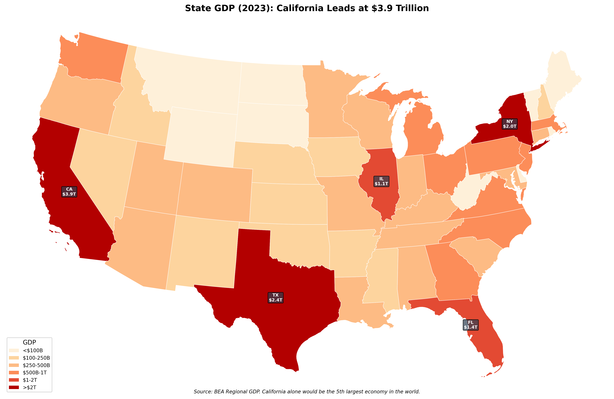
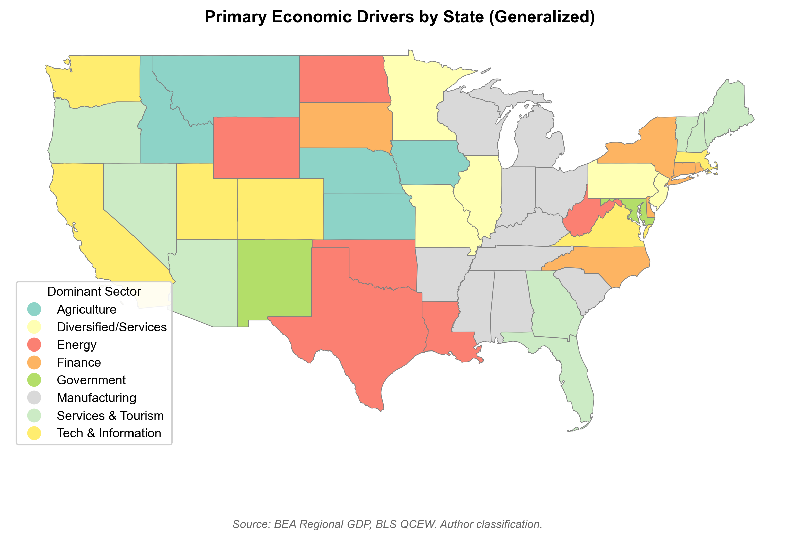
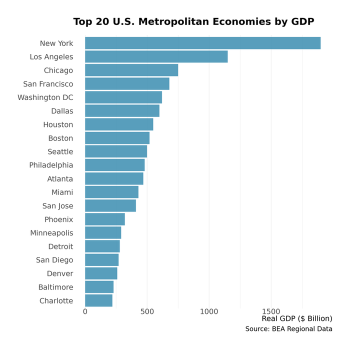
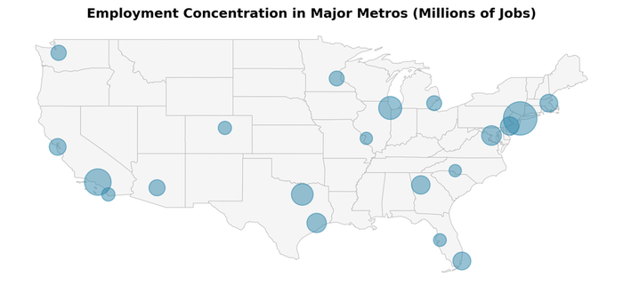
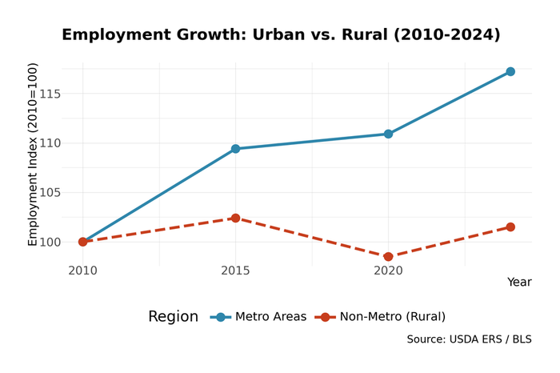

# 3. The Geography of Production

Economic activity clusters intensely. Five states---California, Texas, New York, Florida, and Illinois---produce half of U.S. GDP. The New York metro area alone outproduces all but a handful of nations. Meanwhile, vast rural stretches have bled population and jobs for decades.

This concentration determines policy, politics, and opportunity. Where you live dictates available jobs, wages, and life prospects. To understand America, start with geography.

## The State-Level Picture

### Economic Giants

| State | GDP (2023) | Share of U.S. | Population |
|-------|-----------|---------------|------------|
| California | $3.25 trillion | 12% | 39 million |
| Texas | $2.10 trillion | 8% | 30 million |
| New York | $1.79 trillion | 7% | 19 million |
| Florida | $1.29 trillion | 5% | 22 million |
| Illinois | $886 billion | 3% | 12 million |

*Source: Bureau of Economic Analysis, Regional Economic Accounts, 2023*

California's economy exceeds that of India or the United Kingdom. It would rank among the world's five largest countries. Texas has grown rapidly, riding oil production and business-friendly policies to become America's second-largest economy. New York punches above its population weight, reflecting the concentration of finance, media, and professional services in Manhattan.

<figure>

<figcaption>Figure 3.0: State GDP (2023). California dominates at nearly $4 trillion, followed by Texas and New York. The top five states produce half of national output. Source: BEA Regional GDP</figcaption>
</figure>

### The Productivity Divide

GDP per capita varies enormously across states:

**Highest:**
- Washington, D.C.: roughly $260,000 (distorted by small population and federal concentration)
- New York: $111,000
- Massachusetts: $105,000
- Washington State: $95,000
- California: $83,000

**Lowest:**
- Mississippi: roughly $30,000
- West Virginia: roughly $32,000
- Arkansas: roughly $35,000
- Alabama: roughly $37,000
- New Mexico: roughly $38,000

*Source: Bureau of Economic Analysis, Regional Economic Accounts, 2023*

The gap is striking: a worker in Massachusetts produces (on average) three times as much value as a worker in Mississippi. This reflects differences in industry mix, educational attainment, capital investment, and agglomeration effects.

### Regional Patterns

Broad regions show distinct economic characters:

**The Northeast** (New England plus Mid-Atlantic): High productivity, high costs, concentrated in finance, healthcare, education, and professional services. Population growth has stagnated but economic output remains strong.

**The Southeast**: Rapid growth, driven by migration from the Northeast and Midwest. Mix of legacy industries (auto transplants, textiles remnants) and new growth (logistics, tech outposts). Lower wages but lower costs.

**The Midwest**: The old manufacturing heartland, now more diversified. Agriculture remains important. Major metros (Chicago, Minneapolis, Columbus) thrive while small cities struggle.

**The Southwest**: Texas and Arizona drive growth, fueled by energy, migration, and business relocation. Water constraints loom as a long-term challenge.

**The West Coast**: Technology dominance in California and Washington. High productivity, high costs, severe housing constraints. Oregon combines tech (Portland) with resource industries.

**The Mountain West**: Low population density, resource extraction (mining, energy), tourism, and increasingly remote workers fleeing coastal costs. Colorado and Utah have diversified; Wyoming and Montana remain resource-dependent.

<figure>

<figcaption>Figure 3.1: The dominant economic sector varies across states. Coastal states rely heavily on professional services and finance, while interior states depend more on manufacturing, energy, or government. Source: BEA (2023)</figcaption>
</figure>

## Metropolitan Dominance

### The Metro Economy

Economic activity concentrates in metropolitan areas---urban cores plus surrounding suburbs. About 85% of U.S. GDP comes from the 384 metropolitan statistical areas (MSAs), even though they cover only about 3% of land area.


**Metropolitan Statistical Area (MSA)**: A Census Bureau designation for a core urban area of 50,000+ population plus adjacent counties with strong commuting ties. The 384 MSAs range from New York-Newark (20 million) to Carson City, NV (57,000). MSAs enable consistent economic comparison across metro regions.


At the top, concentration is extreme:

| Metro Area | GDP (2023) | Notable Industries |
|------------|-----------|-------------------|
| New York-Newark | $2.3 trillion | Finance, media, professional services |
| Los Angeles | $1.3 trillion | Entertainment, trade, aerospace |
| Chicago | $895 billion | Finance, manufacturing, logistics |
| San Francisco | $779 billion | Technology, biotech, finance |
| Dallas-Fort Worth | $745 billion | Corporate HQs, telecom, defense |
| Washington, D.C. | $715 billion | Government, defense, professional services |
| Houston | $697 billion | Energy, healthcare, petrochemicals |
| Boston | $610 billion | Healthcare, biotech, education, finance |

*Source: Bureau of Economic Analysis, Gross Domestic Product by Metropolitan Area, 2023*

The top eight metros produce nearly $8 trillion---about 30% of GDP. Add the next dozen, and you've accounted for half the economy.

<figure>

<figcaption>Figure 3.2: The top 20 metropolitan areas by GDP. New York alone produces more than most countries. Source: BEA Metropolitan GDP (2023)</figcaption>
</figure>

<figure>

<figcaption>Figure 3.3: Job concentration in major metros. Bubble size represents total employment. Economic activity clusters intensely in a handful of urban centers. Source: BLS QCEW (2023)</figcaption>
</figure>

### Why Cities?

Why the intense clustering? Four mechanisms---collectively called **agglomeration economies**---reward proximity:


**Agglomeration Economies**: The productivity benefits arising from geographic concentration: (1) Knowledge spillovers---ideas diffuse through informal contact; (2) Labor market pooling---deep specialist talent pools; (3) Input sharing---specialized suppliers nearby; (4) Matching efficiency---lower search costs for jobs, partners, capital.


**Knowledge spillovers**: Ideas spread faster when people interact. Silicon Valley engineers learn from each other across company lines. Wall Street traders share market intelligence. Academic researchers collaborate across institutions. These informal knowledge flows are hard to replicate at a distance.

**Labor market pooling**: Dense metros offer deep labor pools for specialized skills. A software company in San Francisco can find machine learning engineers; in rural Nebraska, it cannot. Workers benefit too---if one employer fails, others are nearby.

**Input sharing**: Specialized suppliers locate near customers. A biotech company in Boston can access contract manufacturers, specialty chemicals, regulatory consultants, and patent lawyers all nearby. In isolation, it would need to do everything in-house or ship inputs from far away.

**Matching**: Cities facilitate better matches between workers and jobs, between firms and suppliers, between ideas and capital. The friction of search declines when options are concentrated.

### The Superstar City Phenomenon

Some metros have pulled away from the pack. Economists Enrico Moretti, Chang-Tai Hsieh, and others have documented growing divergence among cities:

- In 1980, wages in San Francisco were about 20% above the national average. By 2020, the gap exceeded 50%.
- Productivity growth has concentrated in a handful of metros; most others have stagnated.
- The pattern is particularly stark in innovation: a few metros (San Francisco, San Jose, Seattle, Boston) account for most patents and venture capital investment.


**The Superstar City Divergence**

In 1980, wages in San Francisco were about 20% above the national average. By 2020, the gap exceeded 50%. This divergence reflects the concentration of high-productivity industries in a handful of metros—and the housing constraints that limit who can access these opportunities.


This concentration creates both opportunity and tension. Workers in superstar cities earn high wages but face crushing housing costs. Workers elsewhere enjoy affordability but limited job options. The divergence fuels political polarization between thriving metros and struggling hinterlands.

## Industry Location Patterns

### Measuring Specialization: Location Quotients

Economists measure geographic specialization using **location quotients (LQ)**. If an industry's share of employment in a region exceeds its national share, the region is specialized in that industry.

$$
LQ = \frac{\text{Industry share in region}}{\text{Industry share in nation}}
$$

An LQ of 1.0 means the region matches the national average. An LQ of 2.0 means the industry is twice as concentrated locally as nationally.

Examples:
- **Finance in New York**: LQ ≈ 2.5 (Wall Street concentration)
- **Entertainment in Los Angeles**: LQ ≈ 3.0 (Hollywood dominance)
- **Auto manufacturing in Michigan**: LQ ≈ 4.0 (Detroit's legacy)
- **Oil and gas in Houston**: LQ ≈ 8.0 (extreme concentration)

### Where Industries Cluster

Different industries have different geographic logic:

**Resource-bound industries** locate near natural endowments:
- Oil and gas: Permian Basin (TX/NM), Gulf Coast, Bakken (ND), Appalachia
- Mining: Nevada (gold), Arizona (copper), Wyoming (coal), Minnesota (iron ore)
- Agriculture: Great Plains (wheat), Midwest (corn/soybeans), California (fruits/vegetables)

**Market-oriented industries** locate near customers:
- Retail: distributed roughly proportional to population
- Hospitals: located in population centers
- Construction: follows population and investment

**Transport-oriented industries** locate at logistics nodes:
- Ports: Los Angeles/Long Beach, New York/New Jersey, Houston, Savannah
- Distribution centers: Inland Empire (CA), Memphis, Dallas, Chicago
- Refineries: Gulf Coast (near both oil supply and shipping)

**Knowledge-intensive industries** cluster for agglomeration benefits:
- Tech: Silicon Valley, Seattle, Austin, Boston
- Finance: New York, Chicago, Charlotte
- Biotech: Boston/Cambridge, San Francisco Bay Area, San Diego
- Entertainment: Los Angeles, New York

### Industry Clusters

Clusters are geographic concentrations of interconnected industries, suppliers, and institutions. Famous examples:

**Silicon Valley** (tech): The original and still dominant tech cluster. Stanford and Berkeley provide research and talent. Venture capital is concentrated nearby. A dense network of suppliers, service providers, and former colleagues enables rapid company formation and scaling.

**Wall Street** (finance): Lower Manhattan houses the New York Stock Exchange, major banks, hedge funds, and the infrastructure of American finance. Proximity to capital and to each other creates information advantages that resist dispersal despite modern communications.

**Detroit** (auto): Despite decades of decline, the Detroit area retains the densest concentration of automotive engineering talent, suppliers, and expertise. The Big Three maintain headquarters there; even foreign automakers locate design and engineering centers nearby.

**Houston** (energy): The headquarters of most major oil companies, plus the service companies, engineering firms, and legal practices that support them. When oil prices move, Houston's economy responds immediately.

**Research Triangle** (NC): A deliberate creation of three universities (Duke, UNC, NC State) plus corporate research parks. Biotech, pharma, and tech have built critical mass over decades.

## Urban vs. Rural

### The Rural Economy

Rural America faces persistent economic challenges:


**Defining Rural America**

Rural areas contain 20% of the U.S. population spread across 97% of the land. The economic base varies dramatically: resource extraction in the Mountain West, agriculture in the Plains, manufacturing legacy in Appalachia, and retirement communities in Florida.


**Population decline**: Most rural counties have lost population since 2010. Young people leave for education and opportunity; few return.

**Job losses**: Agriculture employs fewer workers each year as technology substitutes for labor. Manufacturing has declined. Mining booms and busts.

**Lower productivity**: Rural workers earn about 70% of urban wages on average. The gap has widened over time.

**Service deserts**: As population thins, services consolidate. Hospitals close. Schools consolidate. Main streets empty.

<figure>

<figcaption>Figure 3.4: The urban-rural divide in employment. Urban areas have diversified economies; rural areas depend more heavily on agriculture, mining, and government. Source: BLS (2023)</figcaption>
</figure>

Yet rural America is not monolithic:

**Resource-rich rural areas** (Permian Basin oil country, Bakken shale, productive farmland) can be prosperous, at least while resources last.

**Recreational rural areas** (mountain towns, beach communities, national park gateways) attract retirees and tourists, supporting service economies.

**Commuter rural areas** within reach of metros function as exurbs, with residents earning urban wages while enjoying rural amenities.

**Declining rural areas** far from metros and without distinctive resources face the toughest challenges. These are the places losing population, closing stores, and aging rapidly.

### The Remote Work Shift

The COVID-19 pandemic accelerated remote work adoption, potentially reshaping economic geography. If workers can do their jobs from anywhere, will they leave expensive metros for affordable rural areas or smaller cities?

Evidence so far is mixed:

- Some outmigration from expensive metros (San Francisco, New York) occurred, but population flows were modest compared to the hype.
- Mid-size cities and suburbs gained more than truly rural areas.
- Employers have increasingly called workers back to offices, limiting permanent dispersal.
- Industries most suited to remote work (tech, finance, professional services) were already concentrated in metros.

The long-term impact remains uncertain. Remote work has loosened but not severed the link between productive jobs and major metros.

## The Cost of Geography

### Housing Constraints

Housing costs mediate the relationship between productive places and opportunity. Workers would like to move to high-wage metros, but housing costs eat their wage gains.

San Francisco wages are 50%+ above the national average, but median home prices are 5x the national average. A worker who moves there earns more but spends more, potentially ending up worse off in living standards.

Research by Chang-Tai Hsieh and Enrico Moretti estimates that housing constraints in high-productivity metros have reduced U.S. GDP growth significantly. If workers could move freely to the most productive places, national output would be substantially higher. Instead, restrictive zoning, NIMBY opposition, and geographic constraints (San Francisco is surrounded by water on three sides) limit housing supply and force workers to less productive locations.

### Spatial Mismatch

Jobs and workers don't always align geographically:

**Within metros**: Jobs often concentrate in suburbs (corporate campuses, industrial parks) while affordable housing concentrates in urban cores. Workers without cars struggle to reach employment.

**Across regions**: Good jobs concentrate in coastal metros while affordable housing exists in the heartland. But those places have few good jobs.

**Skill mismatch**: Local jobs may not match local skills. A displaced factory worker in Ohio may have the wrong skills for growing healthcare or tech sectors---and those sectors may not exist locally anyway.

These mismatches reduce efficiency and opportunity. Workers who "should" move often don't, because of housing costs, family ties, home equity, or simple friction.

## The Political Economy of Place

Economic geography shapes political geography. The divergence between thriving metros and struggling rural areas maps onto partisan divisions:

- Urban counties voted Democratic by large margins in 2020; rural counties voted Republican by large margins.
- The counties producing the most GDP voted heavily Democratic; those producing least voted Republican.
- "Red" states often have "blue" metros (Austin in Texas, Atlanta in Georgia) that produce most of the state's economic output.

These patterns reflect real economic differences: urban voters tend to work in sectors (tech, professional services, education) that benefit from globalization and credentialing, while rural voters disproportionately work in sectors (manufacturing, extraction, agriculture) that have faced trade competition and technological displacement.

Economic policy debates---over trade, immigration, climate, taxation---often pit places against each other as much as classes or ideologies.

## Key Takeaways

1. **Economic activity is geographically concentrated.** Five states produce half of GDP. Eight metros produce 30%. Most rural counties are losing population and employment.

2. **Agglomeration economies explain clustering.** Knowledge spillovers, labor pooling, and input sharing make dense metros more productive---but also more expensive.

3. **Superstar cities have pulled away.** A handful of metros (New York, San Francisco, Boston, Seattle) capture disproportionate shares of innovation, productivity growth, and high-wage jobs.

4. **Rural America faces structural challenges.** Resource extraction and agriculture employ fewer workers; distance from metros limits opportunity. Some rural areas thrive, but many decline.

5. **Housing costs constrain mobility.** Workers can't easily move to productive places when housing is unaffordable. This reduces national productivity and opportunity.

6. **Geography shapes politics.** The divergence between prosperous metros and struggling hinterlands maps onto partisan divisions and policy debates.

## Data Sources and Further Reading

### Key Data Sources

- **BEA Regional Data** (bea.gov): GDP by state and metro area
- **BLS Quarterly Census of Employment and Wages** (bls.gov/qcew): Employment by county and industry
- **Census American Community Survey** (census.gov): Demographics, income, housing costs by geography
- **USDA Economic Research Service** (ers.usda.gov): Rural economy data and research

### Further Reading

- Enrico Moretti, *The New Geography of Jobs* (2012)---Essential reading on spatial divergence and brain hubs
- Edward Glaeser, *Triumph of the City* (2011)---Why cities make us richer and happier
- James Fallows and Deborah Fallows, *Our Towns* (2018)---A journalistic tour of smaller cities finding their way
- Chang-Tai Hsieh and Enrico Moretti, "Housing Constraints and Spatial Misallocation," *American Economic Journal: Macroeconomics* (2019)

## Exercises

### Review Questions

1. Five states produce roughly half of U.S. GDP. Name them and identify the dominant industry or economic driver in each. Why does economic activity concentrate so heavily rather than spreading evenly?

2. Define "agglomeration economies" and explain three mechanisms through which they operate. Why might a tech firm choose to locate in an expensive city like San Francisco rather than a low-cost city with available workers?

3. The text describes a "spatial mismatch" between jobs and workers. Explain three forms this mismatch takes (within metros, across regions, and by skill). What prevents the labor market from correcting these mismatches naturally?

4. Housing costs in San Francisco are roughly 5x the national average, while wages are roughly 1.5x the national average. Explain why a worker might be worse off moving to a "high-wage" city. What does Hsieh and Moretti's research suggest about the national economic cost of this dynamic?

5. How does the economic geography of the United States map onto its political geography? What economic factors help explain why urban areas tend to vote differently from rural areas?

6. The text distinguishes four types of rural areas: resource-rich, recreational, commuter, and declining. Give an example of each and explain why their economic prospects differ so dramatically.

### Data Exercises

7. **Your metro's economy**: Using the BEA's GDP-by-metropolitan-area data (bea.gov/data/gdp/gdp-metropolitan-area), find the GDP and top industries for the metro area nearest to you. How does its per capita GDP compare to the national average? What are the three largest industries by GDP share, and how do they compare to the national sectoral composition in Chapter 1?

8. **County-level analysis**: Using the BLS Quarterly Census of Employment and Wages (bls.gov/qcew), look up employment data for a rural county and an urban county in the same state. Compare: (a) total employment, (b) the share of employment in the three largest industries, and (c) average weekly wages. What structural differences do you observe?

9. **Population migration**: Using Census Bureau data or the IRS Statistics of Income migration data, find which counties or states gained and lost population in the most recent year. Do the patterns align with the economic geography described in this chapter? Are people moving toward or away from high-productivity areas?

### Deeper Investigation

10. Select a "declining rural area" (e.g., a county in Appalachia, the Great Plains, or the Mississippi Delta). Using Census and BLS data, build an economic profile: population trend, unemployment rate, median household income, top industries, and educational attainment. Based on the concepts in this chapter, what structural factors explain its decline? What, if anything, might reverse the trend?
