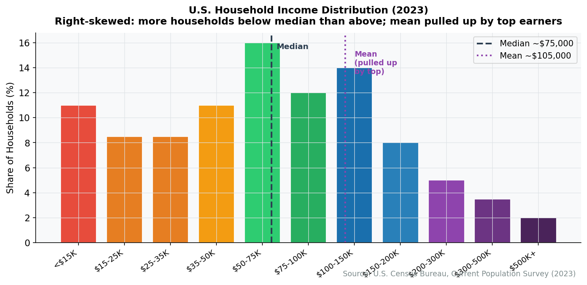
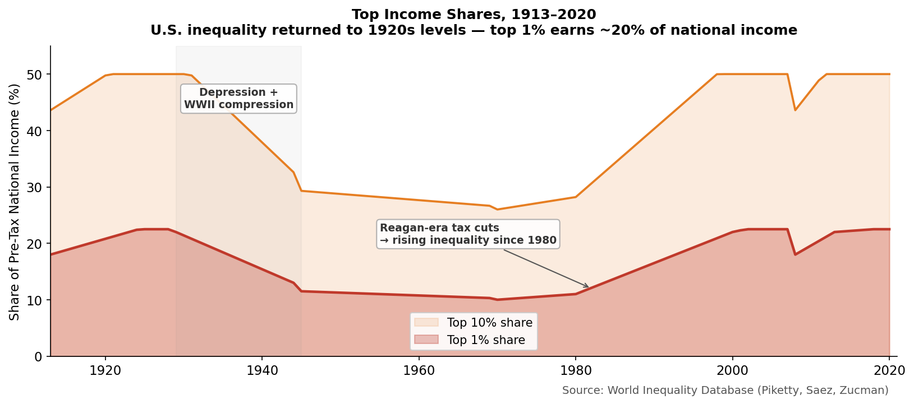
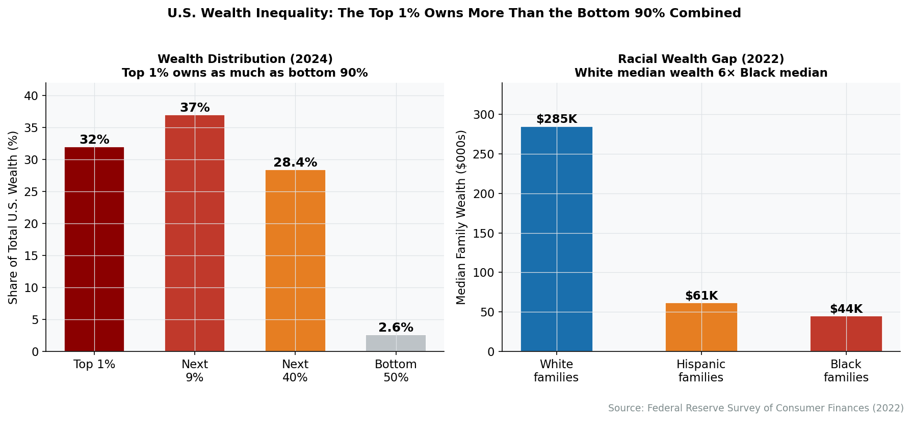
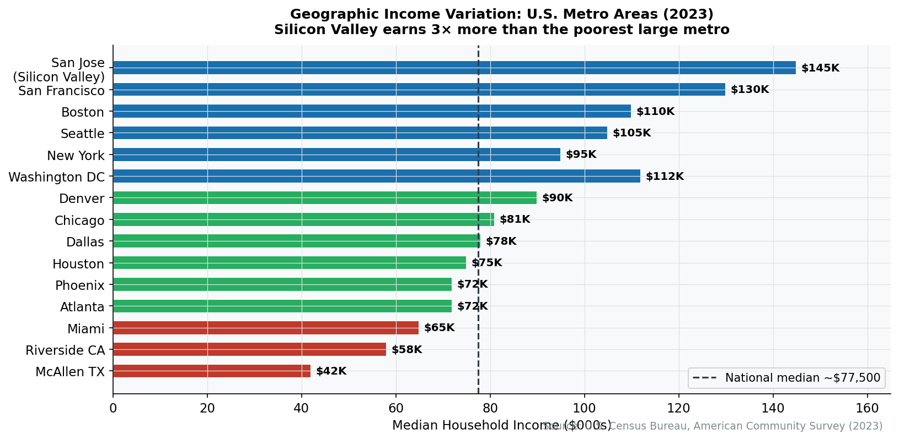
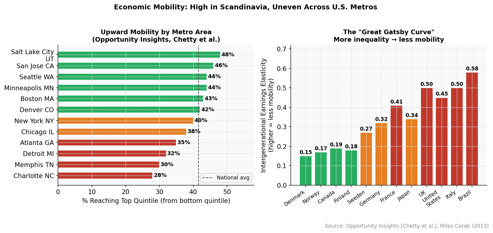

# Interlude: Who Benefits — Distribution and Inequality

The American economy produces $27 trillion in annual output. The preceding three chapters mapped *what* gets produced, *how* sectors interconnect, and *where* activity concentrates. This interlude asks a different question: *who captures the gains?*

The answer has changed dramatically over the past half century. In 1970, a male worker at the 50th percentile of the income distribution earned enough to support a family of four at a middle-class standard of living. His inflation-adjusted wages have barely budged since. Meanwhile, incomes at the top have roughly tripled. The American economy has grown enormously; the distribution of that growth has been extraordinarily uneven.

Understanding distribution is not a political aside---it is structural economics. Who earns what shapes consumer spending patterns, housing markets, political coalitions, educational investment, and health outcomes. A $27 trillion economy where the median household earns $75,000 functions very differently from one where the median earns $50,000, even if GDP is the same. The distribution *is* the economy, experienced from the inside.

## Income Distribution: The Basic Facts

### Household Income

Median household income in the United States was approximately $80,600 in 2023 (Census Bureau). This is the income level at which half of households earn more and half earn less. But the median conceals enormous dispersion:

| Percentile | Household Income (2023) | Context |
|------------|------------------------|---------|
| 10th | ~$17,000 | Below the poverty line for a family of two |
| 25th | ~$35,000 | Near-poverty; eligible for many means-tested programs |
| 50th (median) | ~$80,600 | The statistical "middle" |
| 75th | ~$135,000 | Comfortable; homeownership likely |
| 90th | ~$220,000 | Upper-middle class; professional dual-earner households |
| 95th | ~$310,000 | Top of the wage distribution for most occupations |
| 99th | ~$660,000 | Overwhelmingly capital income, business ownership, or elite professions |
| 99.9th | ~$3.4 million | Finance, corporate leadership, business owners |

*Source: Census Bureau, Current Population Survey, 2024 Annual Social and Economic Supplement; Congressional Budget Office income distribution data*


**Mean vs. Median**

The mean (average) household income is roughly $115,000---44% higher than the median. This gap is itself a measure of inequality: the distribution is heavily right-skewed, meaning a relatively small number of very high-income households pull the average far above what the typical household earns. Whenever you see "average income" cited, ask whether it's the mean or the median. The difference matters enormously.


<figure>

<figcaption>Figure I.1: U.S. household income distribution (2023). The distribution is sharply right-skewed: most households cluster between $30,000 and $120,000, while a long tail extends into the millions. The mean (average) is pulled far above the median by top earners. Source: Census Bureau CPS ASEC</figcaption>
</figure>

### The Top Pulls Away

The most important distributional trend of the past 50 years is the divergence at the top. Using data from tax returns, economists Thomas Piketty and Emmanuel Saez documented that:

- The **top 1%** captured roughly 10% of pre-tax national income in 1970. By 2023, their share had risen to approximately 20%.
- The **top 0.1%** (about 130,000 households) saw their share rise from 3% to roughly 10% of national income.
- The **bottom 50%** saw their share decline from approximately 20% to about 13%.

These shifts are not the result of population growth or demographic change. They reflect a genuine reallocation of economic gains from the broad middle to the top of the distribution.

<figure>

<figcaption>Figure I.2: Share of pre-tax national income going to the top 1% and bottom 50%, 1970-2023. The two lines crossed in the mid-1990s---the top 1% now receives a larger share of income than the entire bottom half of the population. Source: World Inequality Database (WID.world)</figcaption>
</figure>

### What Drives Income Inequality?

Income inequality has multiple structural causes, most of which connect to the sectoral analysis in Part II:

**The education premium**. Workers with a bachelor's degree earn roughly 65% more than those with only a high school diploma---up from about 40% in 1980. Graduate and professional degrees command even larger premiums. As the economy has shifted toward knowledge-intensive sectors (Chapter 7, Professional Services; Chapter 11, Technology), demand for educated workers has outpaced supply, driving up their wages relative to less-educated workers.

**The decline of mid-wage jobs**. Automation and offshoring have hollowed out the middle of the wage distribution. Manufacturing jobs (Chapter 9) that once paid $25-35/hour have been replaced by a combination of higher-paid technical jobs and lower-paid service jobs. The labor market has "polarized" into high-skill, high-wage work and low-skill, low-wage work, with less in between.

**The rise of winner-take-all markets**. In technology (Chapter 11), finance (Chapter 8), professional services (Chapter 7), and entertainment, top performers capture disproportionate rewards. Network effects, global markets, and scalable production mean that the best software engineer, fund manager, or athlete can serve a much larger market than their predecessors could---and capture a much larger share of the revenue.

**Institutional changes**. Union membership has fallen from 35% of private-sector workers in the 1950s to under 6% today (Chapter 30). The federal minimum wage has been $7.25 since 2009, losing roughly 30% of its purchasing power to inflation. Corporate governance has shifted toward maximizing shareholder value, which has directed more income to capital owners and top executives.

**Tax policy**. Top marginal income tax rates fell from 70% in 1980 to 37% today. Capital gains are taxed at lower rates than wage income. These policy choices amplify pre-tax inequality into even larger after-tax differences.


**Deep Dive: The China Shock and Regional Inequality**

Economists David Autor, David Dorn, and Gordon Hanson documented that regions most exposed to Chinese import competition after 2001 experienced sharply higher unemployment, lower wages, higher disability claims, and worse health outcomes. The effects were persistent: twenty years later, affected communities had not recovered. This research demonstrated that trade's costs are not spread evenly across the economy but concentrated in specific places and populations---contributing to both income inequality and the geographic divergence described in Chapter 3.


## Wealth Distribution: The Deeper Divide

Income inequality tells only part of the story. Wealth---the accumulated stock of assets minus debts---is far more unequally distributed than income.

### The Numbers

The Federal Reserve's Survey of Consumer Finances (SCF) provides the most comprehensive picture:

| Group | Share of Total Wealth (2022) | Median Net Worth |
|-------|------------------------------|------------------|
| Top 1% | 30% | ~$13.7 million |
| Top 10% | 67% | ~$3.8 million |
| 50th-90th percentile | 29% | ~$250,000 |
| Bottom 50% | 2.5% | ~$51,000 |

*Source: Federal Reserve, Survey of Consumer Finances, 2022; Federal Reserve Distributional Financial Accounts*

The bottom 50% of American households---roughly 65 million families---own 2.5% of the nation's wealth. The top 1%---about 1.3 million families---own 30%. This concentration is more extreme than at any point since the 1920s.

<figure>

<figcaption>Figure I.3: Distribution of household wealth in the United States (2022). The top 10% own two-thirds of all wealth; the bottom 50% own just 2.5%. Source: Federal Reserve, Distributional Financial Accounts</figcaption>
</figure>

### Why Wealth Is More Concentrated Than Income

Several mechanisms amplify wealth inequality beyond income inequality:

**Asset appreciation**. The wealthy hold their assets primarily in equities and real estate, which have appreciated dramatically. The S&P 500 returned roughly 10% annually over the past four decades. A family that owned $1 million in stocks in 1990 holds roughly $17 million today from appreciation alone---no additional saving required. Meanwhile, a family with $5,000 in a savings account earned negligible returns.

**Homeownership as the dividing line**. For middle-class families, home equity is the primary form of wealth. Homeownership rates vary dramatically by income, race, and geography. In high-cost metros (Chapter 3), rising home prices created enormous wealth for existing owners while locking out newcomers. For renters---disproportionately low-income, young, and minority---rising housing costs are a pure expense, building no wealth.

**Inheritance and intergenerational transmission**. Wealth is passed between generations. The Federal Reserve estimates that roughly $70 trillion will be transferred via inheritance over the next 25 years---overwhelmingly within already-wealthy families. This perpetuates inequality across generations independent of individual effort or talent.

**Debt as negative wealth**. Many low-income and young households have *negative* net worth: their debts (student loans, credit cards, auto loans) exceed their assets. The student debt burden alone stands at $1.75 trillion, disproportionately borne by younger, less-wealthy Americans.

## The Racial Wealth Gap

The most striking dimension of wealth inequality in America runs along racial lines.

| Group | Median Household Net Worth (2022) |
|-------|-----------------------------------|
| White households | $285,000 |
| Black households | $44,900 |
| Hispanic households | $61,600 |
| Asian households | $536,000 |

*Source: Federal Reserve, Survey of Consumer Finances, 2022*

The median white household holds roughly six times the wealth of the median Black household. This gap has persisted---and in some periods widened---despite decades of civil rights legislation, affirmative action, and educational attainment gains among Black Americans.


**Common Misconception: The Racial Wealth Gap Is About Income Differences**

Income differences explain only part of the racial wealth gap. Even at the same income level, Black households hold significantly less wealth than white households. The gap is driven by historical asset exclusion (redlining, denial of GI Bill benefits, exclusion from homeownership subsidies), lower rates of inheritance, lower homeownership rates, and differences in the type and return on assets held. Closing the income gap alone would not close the wealth gap.


The roots of the racial wealth gap are structural and historical:

- **Homeownership exclusion**: Redlining, racially restrictive covenants, and discriminatory lending systematically excluded Black Americans from the primary wealth-building vehicle of the 20th century. The effects compound: families denied homeownership in the 1950s missed decades of home price appreciation that white families captured.
- **Lower inheritance**: Because previous generations were excluded from wealth accumulation, today's Black families receive substantially less in intergenerational transfers.
- **Asset composition**: Black households that do have wealth hold it more heavily in housing (which appreciated less than equities) and less in stocks and retirement accounts.

## Geographic Inequality

As Chapter 3 documented, economic activity concentrates geographically. So do income and wealth.

**Metro divergence**: Per capita income in the San Francisco metro area exceeds $100,000; in the McAllen, Texas metro area, it's roughly $25,000. This 4:1 ratio within a single country is extraordinary by international standards.

**The cost-of-living adjustment**: High-income metros also have high costs, particularly housing. After adjusting for local prices, some high-income metros (San Francisco, New York) offer less purchasing power than lower-cost alternatives (Houston, Minneapolis). But the adjustment doesn't eliminate the gap---it merely narrows it.

**Rural-urban divergence**: Rural workers earn roughly 70% of urban wages. The gap has widened over time as knowledge-economy jobs concentrate in metros while rural areas depend on lower-productivity sectors (agriculture, extraction, government services).

<figure>

<figcaption>Figure I.4: Per capita income across U.S. metro areas. The highest-income metros (San Jose, San Francisco, New York) earn 3-4x more per capita than the lowest-income metros (McAllen, Brownsville). Source: BEA, Regional Economic Accounts</figcaption>
</figure>

## The Gender Pay Gap

Women working full-time earned approximately 84 cents for every dollar earned by men in 2023---a ratio that has improved from 60 cents in 1980 but has plateaued since roughly 2005.

The gap varies dramatically by occupation and sector:

- In healthcare (Chapter 6), women dominate nursing and allied health but are underrepresented among surgeons and specialists---the highest-paid positions.
- In finance (Chapter 8), women hold 50%+ of entry-level positions but less than 25% of C-suite and managing director roles.
- In technology (Chapter 11), women represent roughly 28% of the workforce, and the gap widens at senior levels.


**Explained vs. Unexplained Gap**

Economists decompose the gender pay gap into "explained" factors (differences in occupation, industry, hours worked, education, experience) and an "unexplained" residual. Roughly 55-60% of the gap is "explained" by these measurable differences; the remaining 40-45% persists after controlling for all observable characteristics. The unexplained portion is consistent with---though does not definitively prove---discrimination, negotiation differences, and unmeasured factors like willingness to relocate or work unpredictable hours.


A key structural factor is the **motherhood penalty**: women's earnings decline significantly after having children, while men's do not. Research by Henrik Kleven and colleagues shows that 10 years after a first birth, women earn roughly 40% less than comparable women without children. This reflects some combination of reduced hours, career interruptions, employer discrimination against mothers, and sorting into more flexible but lower-paying positions. The childcare infrastructure---or lack thereof---documented in Chapter 30 is central to this dynamic.

## Intergenerational Mobility

If inequality were temporary---if today's poor were tomorrow's middle class---distributional concerns would be less pressing. The evidence suggests otherwise.

Economist Raj Chetty and colleagues, using IRS tax records for millions of Americans, found that:

- A child born to parents in the bottom 20% of the income distribution has roughly a **7.5% chance** of reaching the top 20% as an adult.
- A child born to parents in the top 20% has roughly a **33% chance** of remaining there.
- Mobility varies dramatically by geography: Charlotte, NC has mobility rates comparable to developing countries; Salt Lake City's rates rival Denmark's.
- Mobility has declined over time: roughly 90% of children born in 1940 earned more than their parents; for children born in 1980, the figure is roughly 50%.

<figure>

<figcaption>Figure I.5: Intergenerational income mobility by commuting zone. Darker areas indicate higher upward mobility (greater chance of a child born to low-income parents reaching high income). Mobility is highest in the Upper Midwest and Mountain West; lowest in the Southeast and Rust Belt. Source: Opportunity Insights (opportunityinsights.org)</figcaption>
</figure>

The factors most strongly correlated with local mobility are: residential segregation (less segregation, more mobility), income inequality (less inequality, more mobility), school quality, family structure, and social capital. Many of these factors connect to the structural features examined throughout this book.

## How Distribution Connects to Structure

The distributional patterns described above are not separate from the sectoral and geographic analysis in the rest of this book. They *are* the structural economy experienced at the household level:

- **Sector determines wages**: A worker in information technology (Chapter 11) earns a median of $100,000+; a worker in leisure and hospitality (Chapter 17) earns a median of $22,000. Sectoral composition drives local income levels.
- **Geography determines opportunity**: Being born in San Jose versus McAllen correlates more strongly with adult income than most individual characteristics.
- **Financial architecture shapes wealth**: Access to the capital markets (Chapter 19) and homeownership (Chapter 5) determines which households build wealth and which do not.
- **Institutions set the rules**: Federal governance (Chapter 28), labor law (Chapter 30), tax policy, and regulatory choices determine how the gains from production are divided.

The economy described in the chapters ahead is not a neutral machine. It produces extraordinary abundance---and distributes it very unevenly. Keeping both facts in view is essential for understanding how America actually works.

## Key Takeaways

1. **Income inequality has risen sharply since 1970.** The top 1% now receives roughly 20% of national income, up from 10%. The bottom 50%'s share has declined from 20% to 13%.

2. **Wealth inequality is more extreme than income inequality.** The top 10% own 67% of all wealth; the bottom 50% own 2.5%. Wealth compounds through asset appreciation, inheritance, and differential access to financial markets.

3. **The racial wealth gap reflects structural history.** The median white household holds six times the wealth of the median Black household---a gap rooted in historical exclusion from homeownership, education, and capital accumulation.

4. **Geographic inequality is severe and growing.** Per capita income varies 4:1 across metro areas. Rural-urban divergence has widened as knowledge-economy jobs concentrate in major metros.

5. **Intergenerational mobility has declined.** A child born poor in the U.S. has a roughly 7.5% chance of reaching the top quintile---lower than in most peer nations. Mobility varies enormously by geography.

6. **Distribution is structural, not incidental.** Sector, geography, financial access, and institutional rules determine who benefits from economic growth. Understanding the economy requires understanding its distributional outcomes.

## Data Sources and Further Reading

### Key Data Sources

- **Census Bureau, Current Population Survey** (census.gov): Annual income and poverty data
- **Federal Reserve, Survey of Consumer Finances** (federalreserve.gov/econres/scfindex.htm): Wealth distribution every 3 years
- **Federal Reserve, Distributional Financial Accounts** (federalreserve.gov/releases/z1/dataviz/dfa): Quarterly wealth distribution estimates
- **World Inequality Database** (wid.world): Pre-tax income shares by percentile, international comparisons
- **Opportunity Insights** (opportunityinsights.org): Intergenerational mobility data by geography
- **Congressional Budget Office** (cbo.gov): Distribution of household income and federal taxes

### Further Reading

- Thomas Piketty, *Capital in the Twenty-First Century* (2014)---The landmark study of wealth concentration across centuries and countries
- Raj Chetty et al., "Where Is the Land of Opportunity?" *Quarterly Journal of Economics* (2014)---The foundational study of intergenerational mobility by geography
- William Darity Jr. and A. Kirsten Mullen, *From Here to Equality* (2020)---A systematic analysis of the racial wealth gap and the case for reparations
- Claudia Goldin, *Career and Family* (2021)---How the gender pay gap evolved and why it persists
- David Autor, "Work of the Past, Work of the Future," *AEA Papers and Proceedings* (2019)---Job polarization and the hollowing of the middle class

## Exercises

### Review Questions

1. The top 1% receives roughly 20% of national income while the bottom 50% receives roughly 13%. Explain three structural factors that drive this divergence. For each, identify which sector chapter(s) in Part II are most relevant.

2. The median white household holds six times the wealth of the median Black household. Why does controlling for income differences *not* eliminate this gap? Identify at least three historical and structural factors that contribute independently.

3. Explain the concept of "job polarization." How does it relate to the sectoral structure described in Part II---specifically, the decline of manufacturing employment (Chapter 9) and the growth of both professional services (Chapter 7) and leisure/hospitality (Chapter 17)?

4. The text states that roughly 50% of children born in 1980 earned more than their parents, compared to 90% of those born in 1940. What economic and structural changes over that period might explain this decline in absolute mobility?

5. Why is wealth more unequally distributed than income? Identify at least three mechanisms that cause wealth concentration to exceed income concentration.

6. The gender pay gap has plateaued at roughly 84 cents per dollar since about 2005. Using the concepts of "explained" and "unexplained" components, describe what structural changes might be needed to close the remaining gap.

### Data Exercises

7. **Exploring wealth data**: Go to the Federal Reserve's Distributional Financial Accounts page (federalreserve.gov/releases/z1/dataviz/dfa). Find the wealth share held by the top 1%, 50th-90th percentile, and bottom 50% for the most recent quarter. How do these compare to the figures in this chapter? Plot the top 1% share over the past 10 years---what trend do you observe?

8. **Mobility by geography**: Visit Opportunity Insights (opportunityinsights.org/data). Look up the mobility statistics for your home county or commuting zone. What is the probability that a child born to parents at the 25th percentile reaches the top quintile? How does your area compare to the national average? What local factors (segregation, school quality, inequality) might explain the difference?

9. **Income by sector**: Using the BLS Occupational Employment and Wage Statistics (bls.gov/oes), compare the median annual wage in three sectors discussed in Part II: professional and business services, manufacturing, and leisure and hospitality. Calculate the ratio between the highest and lowest. How does this sectoral wage dispersion contribute to overall income inequality?

### Deeper Investigation

10. Choose one dimension of inequality discussed in this chapter (income, wealth, racial, gender, or geographic). Using data from the sources listed above, construct a detailed profile of how that dimension of inequality has evolved over the past 30 years. What structural economic changes (sectoral shifts, policy changes, technological disruption, globalization) best explain the trend? What policy interventions have been proposed, and what does the evidence suggest about their effectiveness?
