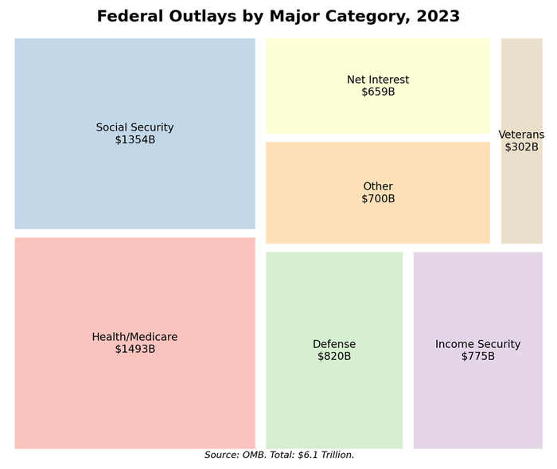
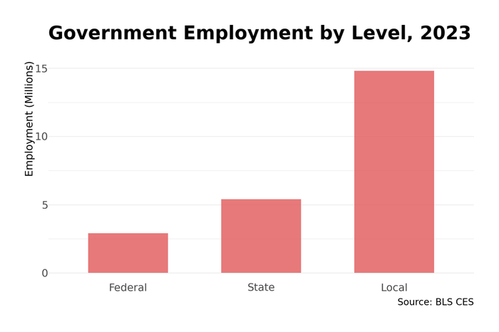
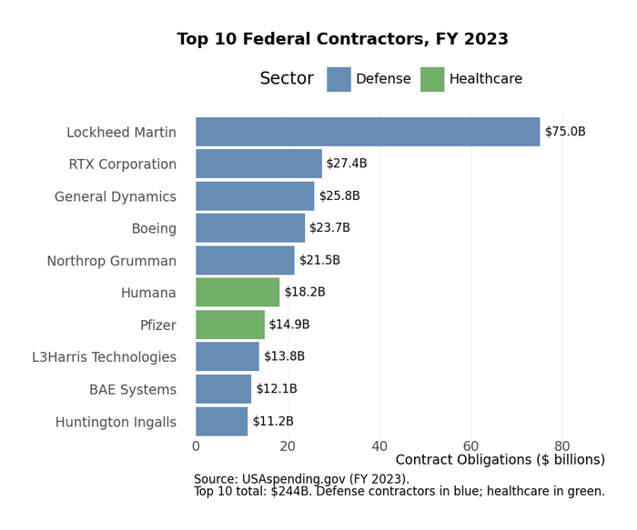

# Chapter 4. Government at All Levels

The federal government alone spends $6.5 trillion annually---more than the entire GDP of Japan or Germany. Add state and local governments, and total government spending reaches $10 trillion, roughly 40% of American GDP. Government is the largest purchaser in the economy, the largest employer after the private sector as a whole, and the regulator whose rules shape every other sector. Yet "the government" is not a single entity: it is 90,000 separate governments---one federal, 50 state, and roughly 90,000 local jurisdictions---each with its own budget, workforce, and functions.

## Overview

**Size and Scope**
- Total government spending: roughly $10 trillion (40% of GDP)
  - Federal: roughly $6.5 trillion
  - State and local: roughly $3.5 trillion (net of federal transfers)
- Government employment: roughly 23 million workers
  - Federal civilian: 2.2 million
  - Military (active duty): 1.3 million
  - State government: 5.2 million
  - Local government: 14.5 million
- Number of governments: roughly 90,000
  - 1 federal
  - 50 state
  - 3,000+ counties
  - 19,000+ municipalities
  - 13,000+ school districts
  - 37,000+ special districts

Government is simultaneously everywhere and fragmented. The federal government dominates defense, social insurance, and macroeconomic policy. State governments run universities, prisons, and highways. Local governments provide schools, police, fire protection, and water. The layers interact through grants, mandates, and shared programs---creating a system that is powerful but often incoherent.

## How Government Works as an Economic Actor

### Revenue: Where the Money Comes From

**Federal Revenue** (roughly $4.5 trillion, FY 2024):

| Source | Amount | Share |
|--------|--------|-------|
| Individual income tax | $2.2T | 49% |
| Payroll taxes (Social Security, Medicare) | $1.5T | 33% |
| Corporate income tax | $420B | 9% |
| Excise taxes | $75B | 2% |
| Other (customs, estate, fees) | $305B | 7% |

The federal government runs persistent deficits---spending exceeding revenue by $1-2 trillion annually since 2020. The difference is financed by borrowing (Treasury bonds), adding to the $35+ trillion national debt.

**State and Local Revenue** (roughly $4 trillion):

| Source | Amount | Share |
|--------|--------|-------|
| Federal grants | $900B | 23% |
| Property taxes | $600B | 15% |
| Sales taxes | $500B | 13% |
| Individual income taxes | $500B | 13% |
| Charges and fees | $700B | 18% |
| Other (corporate tax, lottery, etc.) | $800B | 18% |

State and local governments are generally required to balance their operating budgets (most state constitutions prohibit operating deficits), though they can borrow for capital projects.

### Spending: What Government Buys

**Federal Spending by Function** (roughly $6.5 trillion):

| Category | Amount | Share | Notes |
|----------|--------|-------|-------|
| Social Security | $1.4T | 22% | Mandatory |
| Medicare | $900B | 14% | Mandatory |
| Medicaid/CHIP | $600B | 9% | Mandatory (grants to states) |
| Defense | $850B | 13% | Discretionary |
| Interest on debt | $700B | 11% | Mandatory |
| Other mandatory | $700B | 11% | SNAP, UI, veterans, etc. |
| Non-defense discretionary | $800B | 12% | Education, transportation, R&D, etc. |
| Other | $550B | 8% | |

*Figure 4.1: Federal spending by function. Mandatory spending (Social Security, Medicare, Medicaid) dominates, while discretionary spending is squeezed. Source: OMB Budget (FY 2024)*

The critical distinction: **mandatory spending** (Social Security, Medicare, Medicaid, interest) happens automatically based on eligibility laws. **Discretionary spending** requires annual appropriations. Mandatory spending is roughly 70% of the budget and growing; discretionary is roughly 30% and squeezed.

**State and Local Spending by Function** (roughly $3.5 trillion net):

| Category | Share | Primary Level |
|----------|-------|---------------|
| Education (K-12 and higher) | 35% | Local/State |
| Public welfare (Medicaid) | 20% | State |
| Health and hospitals | 10% | State/Local |
| Police and corrections | 8% | State/Local |
| Transportation | 8% | State |
| Other | 19% | Various |

Education is by far the largest state/local function, accounting for over a third of spending and employing the largest share of state/local workers.

### Government as Employer

Government directly employs 23 million Americans---about 14% of total employment. The composition matters:

**Federal Civilian Workforce** (2.2 million):

| Department/Agency | Employment | Notes |
|-------------------|------------|-------|
| Defense (civilian) | 750,000 | Largest civilian employer |
| Veterans Affairs | 410,000 | Healthcare system |
| Homeland Security | 240,000 | Includes TSA, CBP, ICE, Coast Guard |
| Justice | 115,000 | FBI, prisons, prosecutors |
| Treasury | 95,000 | IRS is bulk |
| Agriculture | 90,000 | USDA programs, Forest Service |
| Interior | 65,000 | Parks, land management |
| HHS | 80,000 | FDA, CDC, NIH |
| All other | 355,000 | |

The federal civilian workforce has been roughly flat for 50 years despite enormous growth in federal spending---a result of contracting out, automation, and grants to states rather than direct federal employment.

**Military Personnel** (1.3 million active duty):

| Branch | Active Duty | Reserves/Guard |
|--------|-------------|----------------|
| Army | 450,000 | 520,000 |
| Navy | 340,000 | 100,000 |
| Air Force | 325,000 | 180,000 |
| Marine Corps | 175,000 | 95,000 |
| Coast Guard | 42,000 | 10,000 |
| Space Force | 10,000 | - |

Plus roughly 800,000 civilian DOD employees and millions of contractor employees.

**State Government Employment** (5.2 million):

| Function | Share |
|----------|-------|
| Higher education | 40% |
| Corrections | 10% |
| Highways | 8% |
| Hospitals | 12% |
| Public welfare | 5% |
| Other | 25% |

State employment is dominated by higher education---public university faculty, staff, and administrators.

**Local Government Employment** (14.5 million):

| Function | Share |
|----------|-------|
| K-12 education | 55% |
| Police | 7% |
| Fire | 2% |
| Hospitals | 5% |
| Other | 31% |

Local government employment is dominated by schools: teachers, administrators, and support staff account for over half of all local government workers.

*Figure 4.2: Government employment by level. Local governments employ far more workers than federal or state, with education dominating local payrolls. Source: BLS CES (2023)*

### Government as Purchaser

Beyond payroll, government purchases vast amounts of goods and services from the private sector:

**Federal Procurement** (roughly $700 billion annually):

| Category | Amount |
|----------|--------|
| Defense contracts | $450B |
| Civilian agency contracts | $250B |

Federal procurement is governed by the Federal Acquisition Regulation (FAR), a dense set of rules covering everything from competitive bidding to small business set-asides to labor standards.

**Major Federal Contractors** (by contract value):

| Rank | Company | FY2023 Contracts | Primary Business |
|------|---------|------------------|------------------|
| 1 | Lockheed Martin | $75B | Aerospace, defense systems |
| 2 | RTX (Raytheon) | $35B | Missiles, electronics |
| 3 | General Dynamics | $30B | Ships, IT, munitions |
| 4 | Boeing | $25B | Aircraft, satellites |
| 5 | Northrop Grumman | $20B | Aerospace, cyber |
| 6 | Leidos | $12B | IT, engineering |
| 7 | Huntington Ingalls | $10B | Shipbuilding |
| 8 | L3Harris | $8B | Electronics, communications |
| 9 | BAE Systems | $7B | Vehicles, electronics |
| 10 | Deloitte | $5B | Consulting, IT |

*Figure 4.3: Top 10 federal contractors by contract value. Defense dominates federal procurement, with Lockheed Martin alone receiving $75 billion annually. Source: USASpending.gov (FY 2023)*

The defense industrial base is concentrated: five companies (Lockheed, RTX, General Dynamics, Boeing, Northrop) receive over half of defense contract dollars. Consolidation since the 1990s reduced the number of prime contractors from dozens to a handful.

## Geographic Distribution

### Federal Employment Geography

Federal civilian employment is concentrated in several clusters:

**Washington, DC Metropolitan Area**: roughly 400,000 federal civilian employees (excluding military)---the largest concentration. Every cabinet department headquarters, most agencies, and Congress are here. The DC metro has the highest concentration of federal workers of any region.

**Military Installations**: Major bases shape regional economies:
- San Diego (Navy): 120,000+ military and civilian DOD
- Hampton Roads, VA (Navy): 100,000+
- San Antonio (Air Force, Army): 80,000+
- Fayetteville, NC (Fort Bragg/Army): 50,000+
- Colorado Springs (Air Force, Army): 50,000+

**Other Concentrations**:
- Sacramento (due to California's large population and federal land)
- Atlanta (CDC headquarters, regional offices)
- Denver (land management agencies)
- Baltimore (Social Security Administration, other agencies)

**Federal Presence by State** (federal employment per capita):

| Highest | Per 1,000 | Lowest | Per 1,000 |
|---------|-----------|--------|-----------|
| DC | 130 | Michigan | 4.5 |
| Virginia | 25 | Wisconsin | 4.5 |
| Maryland | 22 | Ohio | 5.0 |
| Hawaii | 18 | Minnesota | 5.0 |
| Alaska | 17 | Oregon | 5.5 |

States with military bases, federal lands, or proximity to DC have high federal employment; Midwest manufacturing states have low federal presence.

*Figure 4.4: Federal civilian employment by state. The Washington, DC metro dominates, with additional concentrations around military bases and federal lands. Source: OPM (2023)*

### State and Local Employment Geography

State and local employment reflects population and public service needs:

**Highest State/Local Employment** (per capita):
- Wyoming, Alaska, New Mexico: High due to large state roles in education, land management
- New York, California: Large state workforces despite private sector dominance

**Variation in Local Government Structure**:
- Fragmented metros (Chicago, St. Louis): Dozens of overlapping local governments
- Consolidated metros (Indianapolis, Louisville): City-county merger reduces fragmentation
- Special districts: Water, fire, transit, and other districts add complexity

## Industry Structure

### The Defense Industrial Base

Defense procurement creates a distinct industrial ecosystem:

**Prime Contractors**: Lockheed Martin, RTX, General Dynamics, Boeing, Northrop Grumman dominate major weapons systems. Each specializes:
- Lockheed: F-35 fighter, missiles, space systems
- RTX (Raytheon + Collins): Missiles, radar, avionics
- General Dynamics: Submarines, tanks, IT systems
- Boeing: Aircraft, satellites, tankers
- Northrop: Bombers, drones, cyber

**Subcontractor Networks**: Primes depend on thousands of suppliers. A single F-35 fighter involves 1,500+ suppliers across 46 states---a distribution deliberately structured to create Congressional support.

**Concentration Concerns**: Post-Cold War consolidation reduced competition. Some weapon categories have only one or two potential suppliers (nuclear submarines: Huntington Ingalls and General Dynamics; stealth bombers: Northrop). This reduces cost pressure and complicates acquisition.

**Foreign Dependence**: Some critical components (rare earth minerals, microchips, certain alloys) come from foreign sources, including potential adversaries. "Supply chain security" has become a major policy focus.

### Healthcare as Government Business

Government is the largest payer for healthcare:
- Medicare: $900 billion
- Medicaid (federal share): $600 billion
- Veterans Affairs healthcare: $100 billion
- Military healthcare (TRICARE): $50 billion
- Other (Indian Health Service, CHIP, etc.): $50 billion

Combined, government pays for roughly 45% of US healthcare spending. This makes HHS, CMS, and VA major economic actors whose payment rates shape provider behavior across the system.

### Education as Government Business

Public education spending (roughly $900 billion K-12, roughly $500 billion higher ed) creates enormous demand for:
- Construction (school buildings)
- Textbooks and curriculum (Pearson, McGraw-Hill)
- Technology (laptops, software, internet infrastructure)
- Transportation (school buses)
- Food service (school lunch programs)

## The Regulatory State

Beyond spending and employment, government shapes the economy through regulation:

### Major Regulatory Agencies

| Agency | Domain | Budget | Employees |
|--------|--------|--------|-----------|
| SEC | Securities markets | $2.2B | 5,000 |
| EPA | Environmental protection | $10B | 14,000 |
| FDA | Food and drug safety | $7B | 18,000 |
| FTC | Competition, consumer protection | $400M | 1,200 |
| FCC | Communications | $400M | 1,400 |
| OSHA | Workplace safety | $600M | 2,200 |
| CFPB | Consumer finance | $700M | 1,700 |
| FAA | Aviation | $20B | 45,000 |
| FERC | Energy | $500M | 1,500 |

Regulatory agencies are small relative to their economic impact. The SEC's 5,000 employees oversee capital markets with $50+ trillion in assets. The EPA's 14,000 employees enforce rules affecting virtually every manufacturer.

### Regulatory Cost and Benefit

Regulation imposes compliance costs on businesses---estimated at $2-3 trillion annually by some counts, though estimates vary wildly. Benefits (cleaner air, safer workplaces, financial stability) are harder to quantify but real.

The regulatory process is governed by the Administrative Procedure Act (1946), requiring notice-and-comment rulemaking, and by executive orders requiring cost-benefit analysis. Major rules face review by the Office of Information and Regulatory Affairs (OIRA) within OMB.

## The Budget Process (Abridged)

### The Annual Cycle

The federal budget follows a nominal cycle:
1. **President's Budget** (February): The administration's proposal
2. **Budget Resolution** (April target): Congress sets spending limits
3. **Appropriations** (before October 1): 12 bills fund agencies
4. **Fiscal Year** begins October 1

In practice, Congress rarely completes appropriations on time. Government operates on **continuing resolutions** (temporary extensions) and **omnibus bills** (giant packages passed at deadline). Government shutdowns occur when funding lapses.

### Mandatory vs. Discretionary

The crucial distinction:
- **Mandatory** (Social Security, Medicare, Medicaid, interest): Spending determined by eligibility rules, not annual appropriations. roughly 70% of budget.
- **Discretionary** (defense, education, transportation, R&D): Requires annual appropriations. roughly 30% of budget.

Mandatory spending grows automatically as the population ages and healthcare costs rise. Discretionary spending is squeezed---Congress can only appropriate what's left after mandatory obligations.

### Deficits and Debt

The federal government has run deficits in most years since 1970. Annual deficits of $1-2 trillion since 2020 have pushed the national debt above $35 trillion (roughly 120% of GDP). Interest costs (roughly $700 billion annually) are now larger than defense spending.

Debt sustainability depends on the relationship between interest rates (r) and economic growth (g):
- If r < g: Debt-to-GDP ratio can stabilize even with deficits
- If r > g: Primary surpluses required to stabilize debt

Rising interest rates since 2022 have shifted this calculus unfavorably.

## Recent Trends

### 1. The Contractor State

Direct federal employment has been flat for decades, but government's economic footprint has grown through contractors. Federal contract spending has doubled since 2000. Contractors perform functions once done by government employees---IT, logistics, security, even policy analysis.

This creates accountability challenges: contractors are less visible than employees, and the revolving door between government and contractors raises conflict-of-interest concerns.

### 2. State and Local Fiscal Stress

The 2020-2022 period saw unprecedented federal aid to state and local governments (American Rescue Plan provided $350 billion). As this aid exhausts, many jurisdictions face structural deficits---revenues that can't sustain pre-pandemic service levels plus inflation-driven cost increases.

Pension obligations are a particular concern: many states and cities have unfunded pension liabilities in the hundreds of billions, representing promises to retired workers that will strain budgets for decades.

### 3. The IRS Transformation

The Inflation Reduction Act (2022) provided $80 billion for IRS modernization over 10 years---the largest investment in tax administration in decades. Goals include improving taxpayer service, updating ancient IT systems, and increasing enforcement against high-income tax evaders.

This is the rare example of investment in government capacity, countering decades of erosion in administrative capability.

### 4. Climate and Industrial Policy

Recent legislation (Infrastructure Investment and Jobs Act, CHIPS Act, Inflation Reduction Act) represents a major expansion of federal industrial policy---government directing investment toward preferred sectors (semiconductors, clean energy, infrastructure).

This marks a shift from the post-Reagan consensus against "picking winners." Whether it succeeds will shape debates about government's economic role for decades.

### 5. Defense Spending Trajectory

After a post-Cold War "peace dividend" and sequestration cuts in the 2010s, defense spending has resumed growth. Great power competition (China, Russia) drives demand for military modernization. The defense budget is projected to reach $1 trillion within a decade.

## Profiles

### Department of Defense

> **Quick Facts**
> - Headquarters: The Pentagon, Arlington, VA
> - Budget: roughly $850 billion (FY 2024)
> - Employees: 2.9 million (1.3M active military, 750K civilian, 800K+ reserves/guard)
> - Secretary: Civilian, Cabinet rank

The Department of Defense is the largest employer in the world. Its budget exceeds the next several countries' defense spending combined. DOD manages:
- Four military departments (Army, Navy, Air Force, Marines) plus Space Force
- Nine unified combatant commands covering geographic regions and functions
- Defense agencies (DIA, NGA, DARPA, DISA, and many more)
- 4,800+ sites worldwide, including 750+ overseas bases

DOD procurement shapes entire industries. The F-35 program ($1.7 trillion lifetime cost) is the most expensive weapons program in history. Nuclear modernization will cost $1.5 trillion over 30 years. Shipbuilding sustains specialized yards that would otherwise not exist.

The department's size creates management challenges. GAO has kept DOD on its "high risk" list for financial management since 1995. DOD has never passed a clean financial audit.

### California State Government

> **Quick Facts**
> - Capital: Sacramento
> - Budget: roughly $310 billion (including federal funds)
> - Employees: roughly 240,000 state workers
> - Governor: Elected, 4-year term

California's state government, the largest of the 50 states, provides a window into state operations:

**Major functions**:
- Healthcare (Medi-Cal/Medicaid): roughly $150 billion, covering 15 million Californians
- Education (K-12 state aid + higher ed): roughly $100 billion
- Corrections: roughly $15 billion (operating the nation's largest state prison system)
- Transportation: roughly $15 billion

**The UC and CSU systems** employ roughly 200,000 people across 33 campuses, making higher education the largest state function by employment.

**Fiscal structure**: California relies heavily on income tax (especially capital gains), creating volatile revenues that surge in booms and crash in recessions. Proposition 13 (1978) capped property taxes, shifting school funding to the state and making revenue more dependent on income tax.

**Policy laboratory**: California often leads on policy---environmental regulation (CARB sets de facto national vehicle standards), minimum wage, climate policy, marijuana legalization. Its size means California policy affects national markets.

### New York City Government

> **Quick Facts**
> - Budget: roughly $110 billion
> - Employees: roughly 330,000
> - Mayor: Elected, 4-year term
> - Population: 8.3 million

New York City operates the largest municipal government in the United States, with a budget larger than most states:

**Major functions**:
- Public schools (NYC DOE): 1 million students, 75,000 teachers
- Police (NYPD): 35,000 officers---largest police force in the US
- Fire (FDNY): 11,000 firefighters
- Public hospitals (NYC Health + Hospitals): 11 hospitals, 70+ clinics
- Public housing (NYCHA): 175,000 units, 400,000 residents

**Revenue**: NYC has unusual taxing authority for a city---its own income tax, commercial rent tax, and hotel tax supplement property and sales taxes.

**Complexity**: The city government interacts with numerous independent authorities (MTA, Port Authority, CUNY), state mandates, and federal programs. The MTA (which runs subways and buses) is technically a state agency, not city-controlled, creating persistent governance tensions.

## Data Sources and Further Reading

### Key Data Sources

- **USASpending.gov**: Federal spending and contract data
- **BLS Quarterly Census of Employment and Wages**: Government employment by level and function
- **Census Bureau Government Finance Statistics**: State and local revenue and spending
- **Office of Personnel Management**: Federal workforce data
- **Federal Procurement Data System (FPDS)**: Contract awards
- **Congressional Budget Office**: Budget projections, cost estimates

### Further Reading

**Accessible**
- Wessel, David (2012). *Red Ink*. Accessible introduction to federal budget politics.
- Light, Paul (1999). *The True Size of Government*. Classic on contractor workforce.

**Intermediate**
- Schick, Allen (2007). *The Federal Budget: Politics, Policy, Process*. Standard budget process text.
- Oates, Wallace (1972). *Fiscal Federalism*. Foundational theory of federal-state-local structure.

**Government Reports**
- Congressional Budget Office. *Budget and Economic Outlook* (annual). Essential budget reference.
- GAO. *High Risk List* (biennial). Government management challenges.
- OMB. *Analytical Perspectives* (annual). Detailed budget background.

---

*Chapter 4 | Government at All Levels*
*The American Economy: A Structural Geography*
*Draft v1 --- January 2026*
