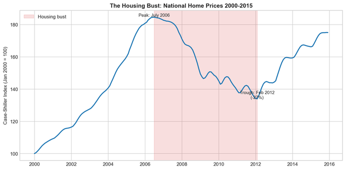

# Chapter 5. Real Estate, Rental, and Leasing

American housing wealth exceeds $50 trillion—more than the entire market capitalization of U.S. stocks. Unlike a stock portfolio, you cannot diversify this asset. You live in one place, work in one metro, and your largest holding sits immovable on a single plot of land. Every business requires premises. Every worker needs a home. For most households, housing plays a triple role—shelter, investment vehicle, retirement plan—creating dynamics found nowhere else in the economy. When prices rise, existing homeowners grow wealthier while aspiring buyers face exclusion. When prices fall, household balance sheets implode, as 2008 demonstrated with devastating clarity.

## Overview

**Size and Scope**

- **GDP Share:** 13–14% of GDP strictly defined; rising to 16–17% when including housing services and residential investment. Real estate is consistently the single largest sector of the American economy.
- **Asset Value:** The total value of the U.S. housing stock exceeds **$50 trillion** (2024)—a figure that dwarfs the capitalization of the entire U.S. stock market.
- **Commercial Real Estate:** An additional $20+ trillion in office, retail, industrial, and multifamily properties.
- **Employment:** Approximately 2.3 million workers in real estate activities proper (agents, property managers, appraisers), plus millions more in construction, mortgage finance, and related services.
- **Establishments:** Over 800,000 firms operate in the sector, ranging from accidental sole-proprietor landlords renting out a spare bedroom to multinational Real Estate Investment Trusts (REITs) with properties on four continents.

Real estate sits at the intersection of shelter, investment, and finance. For most American households, their home is simultaneously their largest expense, their primary asset, and their retirement plan. This triple role creates unique dynamics: when housing prices rise, existing homeowners grow wealthier while aspiring buyers are priced out. When they fall, household balance sheets implode, as 2008 demonstrated.


**Housing as Wealth Engine**

American households hold over $50 trillion in housing wealth—more than the combined value of all U.S. stocks. For most families, their home represents 60-70% of total wealth, making housing policy inseparable from wealth inequality.


## How the Industry Works

The real estate industry functions on a fundamental split between **residential** and **commercial** markets, each with distinct financing, operating models, and ownership structures.

### Residential Real Estate: The 30-Year Mortgage


**An American Anomaly**

The 30-year fixed-rate mortgage is a uniquely American product—virtually unknown elsewhere. This government-backed structure transfers all interest rate risk from borrowers to lenders (and ultimately to taxpayers). Private markets would never offer such terms. The entire system depends on Fannie Mae and Freddie Mac, which buy mortgages from lenders and package them for global investors.


The U.S. residential market is structurally unique due to the **30-year fixed-rate mortgage**. In most of the world, mortgages have variable rates or require refinancing every 5–10 years. A German homebuyer faces rate adjustments; a British borrower typically gets a 2–5 year fix. The American 30-year fixed loan is a peculiarly American, government-backed anomaly that transfers interest rate risk entirely from the borrower to the lender—and ultimately to the federal government.

This product exists only because of an elaborate federal infrastructure. Private lenders would never offer 30-year fixed rates on their own: the interest rate risk is too severe. Instead, the system depends on the Government-Sponsored Enterprises (Fannie Mae and Freddie Mac), which buy mortgages from lenders, package them into securities, and sell them to global investors with an implicit (now explicit) government guarantee.

**The Mortgage System: Originate-to-Distribute**

The "local bank" rarely holds the mortgage it issues. Instead, the industry operates on an **originate-to-distribute** (OTD) model that evolved from the 1980s onward:

1. **Origination:** A bank or non-bank lender (like Rocket Mortgage, formerly Quicken Loans) underwrites and funds a mortgage to a homebuyer.
2. **Sale:** Within days or weeks, the lender sells the mortgage to a Government-Sponsored Enterprise—primarily **Fannie Mae** or **Freddie Mac**.
3. **Securitization:** The GSEs bundle thousands of these mortgages into **Mortgage-Backed Securities (MBS)**.
4. **Distribution:** These MBS are sold to global investors—pension funds, sovereign wealth funds, insurance companies—who seek safe, steady yields backed by American housing.

This system achieves remarkable liquidity: a borrower in Iowa gets a 30-year fixed loan at rates competitive with Treasury bonds because global capital flows into the U.S. mortgage market. But it also creates critical **agency problems**. When originators don't hold loans, their incentive is volume, not quality. When servicers (who collect payments) have different interests than investors (who own the loans), troubled borrowers may face foreclosure rather than modification. The 2008 crisis exposed these frictions brutally.

**Ownership vs. Rental**

The homeownership rate in the United States hovers around **65%**, down from its 2004 peak of 69% but still high by international standards. The remaining 35% of households rent, primarily in multifamily buildings but increasingly in single-family homes.

The rental market operates on the **spread**: landlords profit when rents exceed their cost of capital (mortgage payments, property taxes, maintenance, management). Property management has professionalized, with large operators using yield management software to dynamically adjust rents based on occupancy, seasonality, and comparable properties—a practice that has recently drawn antitrust scrutiny.

### Commercial Real Estate (CRE)

Commercial real estate—office, retail, industrial, and multifamily buildings—operates on pure financial logic:

- **Net Operating Income (NOI):** Revenue (Rent) minus Operating Expenses.
- **Cap Rate:** The expected rate of return. A building with $1 million NOI selling at a 5% cap rate is worth $20 million ($1M / 0.05). Cap rates vary by property type and location: trophy offices in Manhattan command 4% caps; suburban strip malls might trade at 8%.
- **Leases:** Long-term contracts (5–15 years for commercial) with businesses, often with built-in rent escalations tied to inflation or fixed percentages.

The CRE market is dominated by institutional capital: pension funds, insurance companies, sovereign wealth funds, and REITs. Individual investors rarely own office towers directly but can access the asset class through publicly traded REITs or private real estate funds.

### The REIT Structure

Congress created **Real Estate Investment Trusts (REITs)** in 1960 to democratize real estate investment—allowing ordinary investors to own shares of income-producing properties the way they own shares of companies.

- **Tax Advantage:** REITs pay **zero corporate income tax** provided they distribute at least **90% of their taxable income** to shareholders as dividends.
- **Requirements:** At least 75% of assets must be real estate; 75% of income must come from rents or mortgage interest.
- **Impact:** This structure turned illiquid buildings into liquid stocks. Today, retail investors can own fractional shares of Manhattan office towers, data centers in Northern Virginia, or warehouses in the Inland Empire. The REIT market capitalization exceeds $1.3 trillion.

REITs trade like stocks but behave like bonds—their dividends are relatively stable, and their values fluctuate with interest rates. When rates rise, REIT prices typically fall, as their yields become less attractive relative to bonds.

<figure>

<figcaption>Figure 5.2: Top REITs by market capitalization. Digital infrastructure (data centers, cell towers) now commands higher valuations than traditional property types. Source: NAREIT (2024)</figcaption>
</figure>

## Industry Structure

The industry divides into those who build, those who own, and those who facilitate transactions. Each segment has distinct economics and market structure.

### Homebuilders: The Manufacturing Wing

Homebuilding has consolidated dramatically. The 2008 crash wiped out smaller builders who lacked access to capital markets, while large public companies like D.R. Horton and Lennar emerged stronger.

- **Market Concentration:** The top 10 homebuilders now control approximately **45% of new home sales**, up from 27% two decades ago.
- **Business Model:** Large builders function like manufacturing operations, not craftsmen. They buy land years in advance, developing "land pipelines" that ensure steady production. They use standardized floor plans, bulk purchasing, and vertical integration (some own mortgage and title companies) to minimize costs.

**Major Homebuilders (2024)**

| Rank | Company | Revenue | Homes Closed | Headquarters |
|------|---------|---------|--------------|--------------|
| 1 | D.R. Horton | $35B+ | roughly 90,000 | Arlington, TX |
| 2 | Lennar | $34B | roughly 73,000 | Miami, FL |
| 3 | NVR | $10B | roughly 24,000 | Reston, VA |
| 4 | PulteGroup | $16B | roughly 28,000 | Atlanta, GA |
| 5 | Toll Brothers | $10B | roughly 10,000 | Fort Washington, PA |

*Source: Company annual reports and investor filings, 2023-2024*

<figure>

<figcaption>Figure 5.1: Top 10 homebuilders by homes closed. D.R. Horton dominates the market, closing nearly 90,000 homes annually. Source: Company data (2024)</figcaption>
</figure>

The industry remains geographically fragmented—homebuilding is fundamentally local, dependent on land entitlements, labor markets, and municipal permitting. A Texas builder may not operate in California, and vice versa. But within regions, consolidation continues.

### Commercial Developers and REITs

Commercial owners are highly specialized. A warehouse operator has nothing in common with a hotel company except that both own buildings.

- **Industrial/Logistics:** **Prologis** dominates, owning nearly 1.2 billion square feet of logistics space globally—roughly 5% of the entire U.S. warehouse market. E-commerce has made Prologis a critical infrastructure provider; Amazon is among its largest tenants.
- **Office:** Fragmented and struggling post-COVID. Major owners include Boston Properties, SL Green (Manhattan-focused), and Brookfield.
- **Retail:** The "retail apocalypse" killed some REITs (CBL, Washington Prime went bankrupt) while leaders like Simon Property Group survived by owning Class A malls.
- **Digital Infrastructure:** **Equinix** (data centers) and **American Tower** (cell towers) now have higher market capitalizations than most traditional real estate companies. They are classified as REITs but function as technology infrastructure.
- **Multifamily:** The largest apartment landlords include AvalonBay, Equity Residential, and MAA (Mid-America Apartment Communities, focused on Sunbelt).

### Brokerages: The Transaction Gatekeepers

Residential real estate transaction costs in the U.S. are remarkably high—typically 5–6% total commission, split between buyer's and seller's agents. International comparisons suggest 1–2% is achievable. The culprit is the **Multiple Listing Service (MLS)** structure:

- **NAR and MLS:** The National Association of Realtors coordinates local MLSs, which serve as the primary database of homes for sale. Access requires NAR membership and adherence to compensation rules that historically required sellers to offer commissions to buyer's agents.
- **2024 Settlement:** A $418 million antitrust settlement, effective August 2024, prohibited listing agents from advertising buyer's agent compensation on the MLS and required buyer representation agreements specifying how buyer's agents would be paid. The theory was that "decoupling" would force negotiation and lower commissions. In practice, the impact has been muted: average buyer's agent commissions dropped briefly to 2.36% in Q3 2024 but rebounded to 2.40% by Q1 2025. Sellers' agents continue to communicate commission offers outside the MLS, and most sellers still pay buyer's agent commissions to facilitate sales. The revolution in transaction costs that some predicted has not materialized.

**Major Residential Brokerages**

- **Anywhere Real Estate:** The conglomerate behind Coldwell Banker, Century 21, Sotheby's International Realty, and Better Homes and Gardens Real Estate.
- **Compass:** Founded in 2012, grew rapidly by recruiting top agents with high commission splits and proprietary technology. Publicly traded but has struggled to achieve profitability.
- **eXp Realty:** A cloud-based brokerage with no physical offices, using a multi-level marketing style agent referral network.
- **Traditional Franchises:** Keller Williams, RE/MAX remain major players.

## Geographic Distribution

Real estate value is dictated by the first three rules of the industry: "location, location, location." But the logic of location varies systematically across markets.

### The Coastal vs. Interior Divide

The U.S. housing market is bifurcated by **supply elasticity**—how much new construction responds to rising prices.

**Inelastic Coastal Markets:** In cities like San Francisco, Boston, and New York, a combination of topography (water, mountains) and strict regulation limits supply. When demand rises—tech jobs flood into the Bay Area, finance concentrates in Manhattan—the housing stock barely grows. The only release valve is price. Median home prices in these markets are **5–10 times** higher than the Midwest median.

Economist Albert Saiz documented that geography sets a ceiling on growth (you can't build on San Francisco Bay), but regulation determines the actual elasticity. The **Wharton Residential Land Use Regulatory Index (WRLURI)** measures restrictiveness; high WRLURI scores correlate strongly with high prices.

**Elastic Interior Markets:** In cities like Houston, Dallas, Phoenix, and Atlanta, land is abundant and regulation looser. When demand rises, developers simply sprawl outward. Prices stay closer to construction costs. Houston has no zoning code at all—an outlier that has kept housing relatively affordable despite strong job growth.

**The Zoning Tax:** Economists Ed Glaeser and Joe Gyourko define this as the gap between the market price of a home and the cost of construction plus land at its unregulated value. In constrained cities, this "tax" represents 50% or more of the home's price—pure regulatory rent captured by existing homeowners.

### The Sunbelt Shift

The dominant geographic trend of the 2020s is migration of population and corporate headquarters to the "Smile States"—the Sunbelt arc from the Carolinas through Texas to Arizona.

- **Winners:** Austin, Phoenix, Raleigh, Nashville, Tampa have transitioned from low-cost destinations to "affordable luxury" markets for knowledge workers fleeing coastal costs.
- **Drivers:** Lower housing costs, lower taxes (no state income tax in Texas and Florida), COVID-era remote work, and business-friendly regulatory environments.
- **Construction Boom:** Texas and Florida now account for a disproportionate share of new home construction, while legacy Northeast metros stagnate.

### The Donut Effect

Post-COVID, the "Donut Effect" describes the hollowing out of dense city centers—particularly Central Business Districts with office towers—and the booming of inner-ring suburbs and exurbs.

- **Office Vacancies:** Downtown San Francisco, Chicago, and Washington have office vacancy rates of 25–35%, crushing property values and municipal tax bases.
- **Suburban Strength:** Single-family home prices in outer suburbs surged as remote workers fled density, then stabilized at elevated levels.

## The Workforce

### Agents and Brokers

There are approximately **1.5 million licensed Realtors** in the United States—more than the combined number of doctors and lawyers.

- **Tournament Market:** The field is extremely stratified. The top 10% of agents earn the vast majority of commissions; the median agent earns under $50,000 annually and often has a second job.
- **Independent Contractors:** Nearly all agents are classified as independent contractors, meaning they lack employer-provided benefits, job security, and wage protections.
- **Barriers to Entry:** Low—licensing requires a short course and exam. This encourages part-timers and keeps average productivity low.

### Property Management

Behind the passive income of investors is the active labor of property managers.

- **Role:** Management firms handle the "three Ts": Tenants, Toilets, and Trash. They screen applicants, collect rent, coordinate maintenance, and handle evictions.
- **Fee Structure:** Typically 3–8% of gross rents for residential properties.
- **Technology:** Large multifamily operators now use sophisticated revenue management software (RealPage, Yardi) to set rents dynamically. A 2022 ProPublica investigation alleged these tools facilitate algorithmic collusion, prompting antitrust lawsuits.

### Appraisers, Title Officers, and Escrow

The home purchase transaction requires a small army:
- **Appraisers:** Licensed professionals who estimate property value. Required by lenders; their shortage has been a bottleneck during housing booms.
- **Title Companies:** Ensure clear ownership and issue title insurance protecting against claims. This is a $20+ billion industry dominated by Fidelity National Financial and First American.
- **Escrow and Closing:** In most states, transactions close through escrow companies or attorneys who hold funds and execute transfers.

## Regulation and Policy

### The Federal Backstop: Fannie Mae and Freddie Mac

**Fannie Mae** (Federal National Mortgage Association) and **Freddie Mac** (Federal Home Loan Mortgage Corporation) effectively nationalize the risk of the U.S. housing market.

- **Scale:** Together they guarantee roughly $7.5 trillion in mortgages—about half of all outstanding mortgage debt.
- **Conservatorship:** Since September 2008, both GSEs have operated under federal conservatorship. They are technically private corporations but effectively government agencies.
- **Standard Setting:** They establish "conforming loan" standards: maximum loan sizes (currently around $750,000 in most markets, higher in expensive areas), credit score minimums, debt-to-income ratios. If a bank wants to sell a loan to Fannie, it must meet Fannie's rules. This makes the GSEs the de facto regulators of mortgage underwriting.

Other federal agencies provide additional support:
- **FHA (Federal Housing Administration):** Insures loans with low down payments (as low as 3.5%), targeting first-time and lower-income buyers.
- **VA (Veterans Administration):** Provides zero-down mortgages to veterans.
- **FHFA (Federal Housing Finance Agency):** The regulator overseeing Fannie, Freddie, and the Federal Home Loan Banks.

### Local Control: Zoning and Land Use

While mortgage finance is federal, construction is intensely local.

- **Euclidean Zoning:** The dominant framework, named after *Euclid v. Ambler* (1926), separates land uses (residential, commercial, industrial) and limits density.
- **Single-Family Zoning:** In many cities, 70–90% of residential land permits only detached single-family homes—no duplexes, no apartments. This creates artificial scarcity.
- **Height Limits, Setbacks, Parking Minimums:** Additional regulations that limit density and raise construction costs.

The cumulative effect is to make housing supply inelastic in precisely the places where demand is highest. Hsieh and Moretti estimate that housing constraints in San Francisco, San Jose, and New York alone lowered aggregate U.S. GDP growth by up to **36%** between 1964 and 2009 by preventing workers from moving to high-productivity cities.

### Fair Housing

The Fair Housing Act of 1968 prohibits discrimination in housing based on race, color, national origin, religion, sex, familial status, and disability.

- **Legacy of Redlining:** Federal mortgage programs from the 1930s–1960s explicitly refused to insure mortgages in Black neighborhoods ("redlined" areas). Although illegal since 1968, the wealth gap persists: median white household wealth is roughly 8–10 times median Black household wealth, largely due to differential homeownership and home appreciation.
- **Ongoing Discrimination:** Audit studies continue to find discrimination against Black and Hispanic renters and buyers—shown fewer properties, quoted higher prices, steered to certain neighborhoods.

## Trade Associations and Lobbying

Real estate is among the most politically active sectors in America. Property rights and development rules are decided at every level of government, making lobbying essential.

### Major Trade Associations

| Association | Members | Focus |
|-------------|---------|-------|
| **National Association of Realtors (NAR)** | 1.5 million agents | Homeownership promotion, MLS control, licensing standards |
| **Mortgage Bankers Association (MBA)** | Lenders and servicers | Mortgage finance policy, GSE reform |
| **National Association of Home Builders (NAHB)** | Builders and developers | Building codes, land use, labor |
| **Urban Land Institute (ULI)** | Developers, investors | Research, best practices in development |
| **NAREIT** | REITs | Tax policy, REIT structure preservation |

*Source: Trade association websites and public filings, 2024*

### Lobbying Activity

- **NAR:** Consistently among the top five lobbying spenders in Washington. Key priorities include preserving the mortgage interest deduction, protecting the MLS system, and opposing regulations that might reduce transaction volume.
- **NAHB:** Fights building code expansions, environmental regulations, and labor rules that increase construction costs.
- **Financial Industry:** Banks, mortgage servicers, and GSEs lobby intensely on mortgage regulation, particularly post-2008 rules under Dodd-Frank.

At the local level, homeowner associations, neighborhood groups, and NIMBY ("Not In My Backyard") organizations wield enormous influence over zoning and development decisions—often more than formal industry lobbies.

## When Housing Prices Collapse: The 2006-2012 Crisis

Real estate's role in household wealth makes housing price collapses uniquely destructive. Unlike stock market crashes, which affect the minority of Americans with substantial equity holdings, housing busts hit the middle class directly. The 2006-2012 housing crisis demonstrated how a shock originating in real estate could propagate through household balance sheets, the financial system, and the broader economy.

### The Boom and Bust

<figure>

<figcaption>Figure 5.4: The Case-Shiller Home Price Index fell 27% nationally from its 2006 peak, with some markets (Phoenix, Las Vegas, Miami) experiencing declines of 50-60%. Source: S&P/Case-Shiller</figcaption>
</figure>

The early 2000s saw the largest housing boom in American history. The Case-Shiller National Home Price Index roughly doubled between 2000 and 2006, fueled by low interest rates, loosened lending standards, and speculative fervor. Subprime mortgages—loans to borrowers with weak credit—grew from a marginal product to 20% of originations. "No-doc" loans required no income verification. Option ARMs let borrowers pay less than the interest due, with unpaid interest added to principal.

The boom masked fundamental mispricing. When prices stopped rising in 2006, the entire structure unraveled. Borrowers who had counted on refinancing or selling at higher prices found themselves underwater—owing more than their homes were worth. Default rates surged. By 2009, roughly one in four mortgages was underwater.

### Geographic Concentration

The crash devastated some regions far more than others:

**Sand States (Arizona, California, Florida, Nevada)**: Markets that had boomed the most crashed the hardest. Las Vegas prices fell 62% peak-to-trough. Phoenix fell 56%. Miami fell 51%. Entire subdivisions stood half-built and abandoned. "Ghost neighborhoods" dotted the Sunbelt.

**Industrial Midwest**: Ohio, Michigan, and Indiana, already reeling from manufacturing decline, faced foreclosure waves that accelerated population loss from struggling cities.

**Texas Exception**: Texas experienced only a 6% price decline—its elastic housing supply had prevented a boom, and the absence of a boom meant no bust. Strict home equity lending laws also limited the use of homes as ATMs.

**Northeast Resilience**: Supply-constrained markets like Boston and New York fell less (15-20%) and recovered faster, as fundamental demand remained strong.

### The Wealth Effect Transmission

The housing crash transmitted to the broader economy primarily through the **wealth effect** on household balance sheets:

- **$8 trillion in housing wealth destroyed**: American homeowners collectively lost roughly $8 trillion in home equity between 2006 and 2009—equivalent to half of annual GDP.
- **Consumption collapse**: Households that felt poorer spent less. Economists Atif Mian and Amir Sufi found that zip codes with larger house price declines experienced larger drops in consumer spending, particularly on durables like automobiles and appliances.
- **Construction employment**: Residential construction employment fell from 3.5 million (2006) to 2 million (2011). Construction workers, concentrated in the hardest-hit markets, faced mass unemployment.

### Financial Contagion

The housing shock became a financial crisis through the securitization chain examined in Chapter 18:

1. **Mortgage defaults** caused losses on mortgage-backed securities
2. **MBS holders** (banks, investment funds, insurance companies) faced writedowns
3. **Uncertainty** about who held toxic assets froze interbank lending
4. **Credit contraction** spread from housing to the entire economy

The result was the deepest recession since the 1930s. Unemployment peaked at 10%. The Federal Reserve cut interest rates to zero and launched unprecedented programs to support credit markets. The federal government bailed out Fannie Mae, Freddie Mac, AIG, and the banking system.


**The 2008 Collapse by the Numbers**

- Home prices fell 33% nationally (62% in Las Vegas, 56% in Phoenix)
- $8 trillion in housing wealth destroyed
- 10 million foreclosures
- Construction employment: 3.5M (2006) → 2M (2011)
- Unemployment peaked at 10%


### The Long Recovery

Housing prices did not return to 2006 levels until 2016-2018 in most markets—a decade of lost appreciation. For homeowners who bought at the peak, it meant a decade underwater. For those who lost homes to foreclosure, it meant destroyed credit and lasting financial trauma.

The crisis demonstrated several principles of shock transmission:

- **Leverage amplifies**: Households with 80-95% loan-to-value ratios faced devastating wealth destruction from modest price declines
- **Geographic concentration matters**: The Sand States bore disproportionate pain, creating localized depressions within a national recession
- **Financial linkages spread the impact**: Securitization meant that mortgage losses in Phoenix affected pension funds in Norway
- **Recovery is slow**: Unlike stock market crashes that often reverse within years, housing busts take a decade or more to heal

The scars remain visible in policy—the conservatorship of Fannie and Freddie, the post-crisis mortgage regulations, and the caution that kept housing construction depressed for years, contributing to today's affordability crisis.

## Recent Trends

### 1. The Affordability Crisis and "Lock-In" Effect

<figure>

<figcaption>Figure 5.3: Case-Shiller Home Price Index, 2000-2024. Prices surged 40% during the post-COVID boom, then stabilized at elevated levels as mortgage rates rose. Source: S&P/Case-Shiller (2024)</figcaption>
</figure>

The post-COVID era created a unique affordability crisis:

- **Price Surge:** Home prices rose roughly 40% from 2020 to 2022, driven by low rates, work-from-home demand, and constrained supply.
- **Rate Shock:** Mortgage rates jumped from 3% to 7%+ in 2022–2023, doubling monthly payments for new buyers.
- **Lock-In Effect:** Homeowners who secured 3% mortgages in 2020–2021 are unwilling to sell, as moving means taking on a 7% mortgage. This has strangled existing home supply, forcing buyers into the new construction market.
- **Cost Burden:** Over half of U.S. renters are now "cost-burdened" (spending more than 30% of income on rent).

### 2. Institutionalization of Single-Family Rental

Historically, rental homes were owned by "mom and pop" landlords. Post-2008, Wall Street entered:

- **The Players:** Firms like **Invitation Homes** (spun off from Blackstone) and **American Homes 4 Rent** bought tens of thousands of distressed homes after the crisis.
- **Current Scale:** Institutional investors own roughly 2–3% of the national single-family stock but are market-makers in specific Sunbelt submarkets (Phoenix, Atlanta, Tampa), where they may own 5–10% of homes.
- **Business Model:** Professional management, dynamic pricing, standardized renovation, and economies of scale in maintenance and leasing.

### 3. PropTech and the "Super App" Dream

Companies like **Zillow** are attempting to build a "housing super app" integrating search, touring, financing, and closing.

- **Zillow's Pivot:** After its $500+ million iBuying failure (Zillow Offers, shut down in 2021), Zillow pivoted back to its core advertising model while building Zillow Home Loans.
- **iBuying's Limits:** The failure demonstrated that algorithmically pricing homes is harder than tech companies assumed—real estate lacks the standardization of stocks or even used cars.
- **Opendoor:** The pure-play iBuyer continues operating but has struggled to achieve profitability, narrowing its geographic footprint.

### 4. The Office Apocalypse

Remote work has cratered demand for office space in many markets:

- **Vacancy Rates:** Major CBDs have vacancy rates of 20–35%, with older "Class B" buildings hit hardest.
- **Valuation Collapse:** Some office buildings have sold for 50–70% below their pre-COVID values.
- **Conversion Challenge:** Converting offices to apartments is technically difficult (floor plates, windows, plumbing) and financially marginal without subsidies.
- **Bifurcation:** Trophy buildings with amenities retain tenants; commodity space faces obsolescence.

### 5. The Property Insurance Crisis

A less-discussed threat to housing markets is the emerging insurance crisis. Property insurance is the invisible prerequisite for mortgage finance: no insurance, no mortgage; no mortgage, no sale at conventional prices.

- **Climate Losses**: Insured losses from natural disasters have risen from roughly $10 billion annually in the 1990s to $50-100 billion annually in the 2020s. Hurricanes, wildfires, and severe storms are straining the insurance model.
- **Insurer Retreat**: Major insurers are withdrawing from high-risk markets. State Farm and Allstate have stopped writing new homeowner policies in California. In Florida, several regional insurers have gone insolvent, and the state-backed Citizens Property Insurance has become the largest insurer by default.
- **The Mortgage-Insurance Link**: Fannie Mae and Freddie Mac require borrowers to maintain property insurance. If private insurance becomes unavailable or unaffordable, homeowners face a choice between sky-high premiums, inadequate state-backed plans, or losing access to conventional mortgages entirely.
- **Value Implications**: In areas where insurance costs have doubled or tripled, home values are effectively capped by what buyers can afford in total housing costs (mortgage + insurance + taxes). Some coastal Florida properties have seen 20-30% value declines attributable primarily to insurance cost increases.

The insurance crisis intersects with the housing crisis: if climate risk makes coastal and wildfire-prone areas uninsurable, the housing stock in those areas loses significant value, potentially triggering localized housing busts. This represents a slow-motion version of the 2008 geographic concentration—except instead of speculative excess, the underlying cause is physical climate risk. See Chapter 8 for more on the insurance industry's challenges.

### 6. The Rent Control Debate Returns

As affordability has worsened, rent control has resurfaced as a policy option.

- **Evidence:** Research by Diamond, McQuade, and Qian on San Francisco found that rent control helped incumbent tenants stay in place but reduced rental supply by 15% and increased market rents by 65%—harming future renters.
- **Political Appeal:** Despite economist skepticism, rent control remains popular because it delivers visible benefits to current renters while dispersing costs across future renters and property owners.

## Firm Profiles

### Blackstone Real Estate

> **Quick Facts**
> - **Headquarters:** New York, NY
> - **Type:** Private Equity / Alternative Asset Manager
> - **Real Estate Equity AUM:** $330+ billion
> - **Total AUM:** $1+ trillion

Blackstone is the world's largest real estate owner and the "smart money" bellwether for the sector. They treat real estate strictly as a tradable financial asset class, applying private equity's "buy it, fix it, sell it" playbook. Their portfolio shifts aggressively to follow macro themes: they exited shopping malls early (anticipating e-commerce disruption), piled into logistics warehouses (betting on Amazon and same-day delivery), and bought student housing and single-family rentals (betting on housing shortages and Millennial renting).

Blackstone's non-traded REIT, **BREIT**, accumulated over $70 billion in assets before facing significant redemption requests in 2022–2023—a reminder that "open-ended" real estate funds face liquidity mismatches when investors want out. The firm remains bullish on real estate's role in institutional portfolios but has evolved from pure opportunistic investing toward longer-duration "core plus" holds.

### Fannie Mae (Federal National Mortgage Association)

> **Quick Facts**
> - **Headquarters:** Washington, D.C.
> - **Status:** Government-Sponsored Enterprise in Conservatorship
> - **Book of Business:** roughly $4.2 trillion
> - **Net Income:** roughly $17 billion annually

Fannie Mae does not issue mortgages; it buys them. It is the invisible engine that allows a community bank in Iowa to lend $400,000 for 30 years at a fixed rate—the bank sells the loan to Fannie within weeks, freeing up capital for the next mortgage. By guaranteeing principal and interest on trillions of dollars of Mortgage-Backed Securities, Fannie Mae attracts global capital to U.S. housing at rates competitive with Treasury bonds.

Although highly profitable, Fannie Mae remains under government conservatorship since September 2008, sweeping nearly all profits to the Treasury. Shareholders (including hedge funds who bought stock hoping for release from conservatorship) have seen no dividends for 15+ years. The arrangement effectively socializes the catastrophic tail risk of the American housing market while privatizing nothing. Whether to release the GSEs from conservatorship remains a perennial policy debate with no resolution in sight.

### D.R. Horton

> **Quick Facts**
> - **Headquarters:** Arlington, TX
> - **Founded:** 1978
> - **Revenue:** roughly $35+ billion
> - **Homes Closed (2024):** roughly 90,000
> - **Employees:** roughly 13,000

D.R. Horton calls itself "America's Builder," and the title is earned through sheer volume. Founded by Donald R. Horton with a single lot in Fort Worth, the company grew by acquiring smaller builders and perfecting a high-volume, low-cost production model. They build in 33 states with a focus on the entry-level buyer—first-time homebuyers and move-up families seeking value over customization.

The company operates less like a traditional construction firm and more like a manufacturing operation. Standardized floor plans minimize design costs. Bulk purchasing of lumber, appliances, and finishes provides leverage with suppliers. Vertical integration into mortgage (DHI Mortgage) and title services captures additional margin. The model works in boom times (volume multiplies) and busts (they can cut land purchases and survive on lower volumes)—D.R. Horton emerged from 2008 stronger than almost any competitor. They are, in effect, the Walmart of homebuilding: winning on cost, scale, and logistics rather than luxury or craft.

## Data Sources and Further Reading

### Key Data Sources

- **S&P/Case-Shiller Home Price Indices:** The gold standard for tracking repeated-sales housing prices; available nationally and for 20 metro areas.
- **FHFA House Price Index:** Based on GSE-backed mortgages; broader geographic coverage than Case-Shiller.
- **U.S. Census Bureau Housing Vacancy Survey (HVS):** Homeownership rates and vacancy statistics.
- **American Community Survey (ACS):** Housing costs, tenure, and characteristics.
- **Zillow Research:** High-frequency, granular data on rents and list prices at ZIP code level.
- **CoStar:** The Bloomberg of commercial real estate; primary source for office, retail, and industrial vacancy and rent data (subscription required).
- **NAREIT:** Data on publicly traded REIT performance and market capitalization.
- **Mortgage Bankers Association (MBA):** Origination volume, delinquency rates, refinancing activity.

### Further Reading

- **Glaeser, Edward L. and Joseph Gyourko.** "The Economic Implications of Housing Supply." *Journal of Economic Perspectives* 32, no. 1 (2018): 3–30. [The definitive overview of supply constraints and the "zoning tax."]
- **Hsieh, Chang-Tai and Enrico Moretti.** "Housing Constraints and Spatial Misallocation." *American Economic Journal: Macroeconomics* 11, no. 2 (2019): 1–39. [Estimates that housing constraints reduced U.S. GDP by 36%.]
- **Saiz, Albert.** "The Geographic Determinants of Housing Supply." *Quarterly Journal of Economics* 125, no. 3 (2010): 1253–1296. [Seminal paper on topography vs. regulation.]
- **Diamond, Rebecca, Timothy McQuade, and Franklin Qian.** "The Effects of Rent Control Expansion on Tenants, Landlords, and Inequality." *American Economic Review* 109, no. 9 (2019): 3365–94. [The definitive study on rent control's tradeoffs.]
- **Desmond, Matthew.** *Evicted: Poverty and Profit in the American City.* Crown, 2016. [Pulitzer Prize-winning account of the rental affordability crisis.]
- **Green, Richard K. and Susan M. Wachter.** "The American Mortgage in Historical and International Context." *Journal of Economic Perspectives* 19, no. 4 (2005): 93–114. [Explains why the 30-year fixed mortgage is uniquely American.]

## Exercises

### Review Questions

1. The 30-year fixed-rate mortgage is described as "a uniquely American, government-backed anomaly." Explain why private lenders would never offer this product on their own. What roles do Fannie Mae, Freddie Mac, and the originate-to-distribute model play in making it possible? What risks does this system transfer to taxpayers?

2. The chapter contrasts "inelastic coastal markets" (San Francisco, New York, Boston) with "elastic interior markets" (Houston, Dallas, Phoenix). Using the concepts of supply elasticity and the Wharton Residential Land Use Regulatory Index, explain why a tech hiring boom in San Francisco raises housing prices while a similar boom in Houston primarily increases housing construction.

3. Hsieh and Moretti estimate that housing constraints in San Francisco, San Jose, and New York lowered aggregate U.S. GDP growth by up to 36% between 1964 and 2009. Through what mechanism does restricting housing construction in high-productivity cities reduce national economic output? Why don't workers simply move to where they can afford housing?

4. The 2024 NAR antitrust settlement prohibited listing agents from advertising buyer's agent compensation on the MLS. Yet average buyer's agent commissions dropped only briefly (from roughly 2.5% to 2.36%) before rebounding to 2.40%. Why has the expected "revolution in transaction costs" not materialized? What structural features of the brokerage industry resist commission reduction?

5. During the 2006--2012 housing crisis, Las Vegas prices fell 62%, Phoenix fell 56%, and Miami fell 51%, while Texas experienced only a 6% decline. The chapter attributes Texas's resilience to its elastic housing supply and strict home equity lending laws. Explain how the absence of a boom prevented a bust, and how lending regulations limited household leverage.

6. The chapter describes a post-COVID "lock-in effect": homeowners who secured 3% mortgages in 2020--2021 are unwilling to sell because moving means taking on a 7% mortgage. What are the consequences of this lock-in for existing home supply, housing market liquidity, labor mobility, and new construction?

7. Diamond, McQuade, and Qian found that San Francisco rent control reduced rental supply by 15% and increased market rents for non-controlled units by 65%. Explain the mechanism by which protecting incumbent tenants can raise rents for everyone else. Why does rent control remain politically popular despite this evidence?

### Data Exercises

8. Go to FRED (fred.stlouisfed.org) and pull the Case-Shiller National Home Price Index (series "CSUSHPISA") and a metro-level index for a city of your choice (e.g., "SFXRSA" for San Francisco, "PHXRSA" for Phoenix, "DAXRSA" for Dallas). Plot both from 2000 to the present. Did your metro experience a larger or smaller boom-bust cycle than the nation? How does this relate to the supply elasticity framework in the chapter?

9. Using the Census Bureau's American Community Survey via data.census.gov, find the homeownership rate, median gross rent, and median home value for two metropolitan areas---one coastal and one interior. Calculate the price-to-income ratio (median home value divided by median household income) for each. How large is the gap? What does this reveal about the "zoning tax" described by Glaeser and Gyourko?

10. Visit Zillow Research (zillow.com/research/data/) and download the Zillow Observed Rent Index (ZORI) for three Sunbelt metros (e.g., Austin, Phoenix, Tampa) and three legacy metros (e.g., New York, Chicago, San Francisco). Compare rent growth since January 2020. Do the trajectories support the chapter's description of the Sunbelt migration shift and the "donut effect"?

### Deeper Investigation

11. Research the emerging property insurance crisis in either Florida or California. How have rising climate-related losses affected insurance availability and premiums? What happens to housing markets when private insurers withdraw---as State Farm and Allstate have done in California? Analyze the connection between insurance availability, mortgage finance (Fannie and Freddie require insurance), and home values. Assess whether insurance-driven value declines could trigger a localized housing bust, and compare the transmission mechanism to the 2008 crisis described in the chapter.
