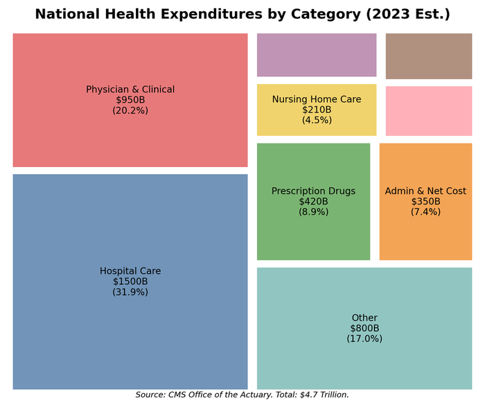
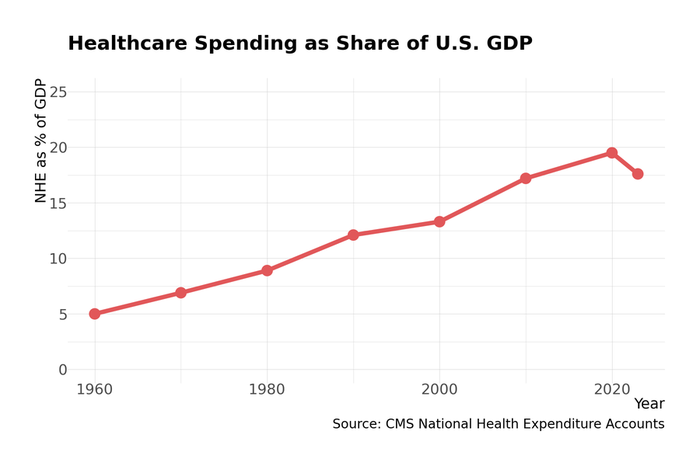
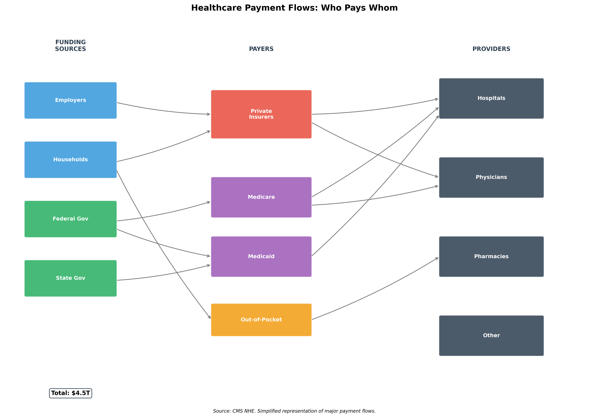

# Chapter 6: Healthcare

An MRI of your knee costs $3,000 in the United States. The same scan, on the same machine, costs $300 in Japan. That tenfold price gap for an identical service captures everything strange about American healthcare.

Americans spend more on healthcare than on anything else except housing: nearly $4.5 trillion in 2022, or 17% of GDP. More than 20 million people work in healthcare and social assistance, making it the largest private-sector employer in the country. By any measure, this is the largest healthcare system in the world.

Yet the money does not buy better outcomes. Americans die younger than citizens of peer countries. Infant mortality runs higher. Chronic disease runs rampant. The dollars flow through a byzantine maze of hospitals, insurers, pharmaceutical companies, and physician practices---each extracting value, each adding complexity.

The core problem is structural. When you visit a doctor, three parties sit at the table: you receive the care, an insurer pays the bill, and the physician decides what happens. None of the three faces the full consequences of their choices. This three-way split---patient, payer, provider---drives the economics of American healthcare.

## Overview


**Healthcare's Unique Structure**

In healthcare, the person receiving care (patient) differs from the person paying (insurer/employer) and the person deciding treatment (physician). This three-way split creates incentive problems that shape much of healthcare economics—and helps explain why the US spends nearly twice as much as peer countries without better outcomes.


### Size and Scope

- **National health expenditure (2022)**: $4.5 trillion
- **Share of GDP**: 17.3%
- **Employment**: 20.5 million (healthcare and social assistance)
- **Share of total employment**: 13%
- **Establishments**: Over 900,000 healthcare establishments

Healthcare spending has outpaced economic growth for decades. In 1960, healthcare claimed just 5% of GDP; by 1980, 9%; by 2000, 13%; today, nearly 18%. An aging population, technological advances, rising incomes, and perverse payment incentives all fuel this growth.

### Key Subsectors

The healthcare sector divides into several distinct segments, each with its own business logic:

| Subsector | Spending (2022) | Share |
|-----------|----------------|-------|
| Hospital care | $1.35 trillion | 30% |
| Physician and clinical services | $885 billion | 20% |
| Prescription drugs | $405 billion | 9% |
| Nursing care and continuing care | $215 billion | 5% |
| Dental services | $165 billion | 4% |
| Home health care | $130 billion | 3% |
| Other professional services | $130 billion | 3% |
| Medical devices and equipment | $100 billion | 2% |
| Government administration | $65 billion | 1% |
| Other | $1 trillion+ | 23% |

Source: CMS National Health Expenditure Accounts

<figure>

<figcaption>Figure 6.1: Healthcare spending by category. Hospital care dominates, followed by physician services and prescription drugs. Source: CMS NHE (2022)</figcaption>
</figure>

<figure>

<figcaption>Figure 6.2: Healthcare spending as share of GDP, 1960-2023. Healthcare has grown from 5% to nearly 18% of the economy over six decades. Source: CMS NHE</figcaption>
</figure>

## How the Industry Works


**The Three-Party Problem**

Unlike most markets, healthcare separates the consumer (patient), the payer (insurer or government), and the provider (hospital or physician). This three-party structure breaks normal price signals: patients rarely know costs upfront, providers bill insurers rather than patients, and insurers negotiate rates invisible to consumers.


### Revenue Streams: Where Does the Money Come From?

Healthcare spending flows through four main channels:

**1. Private health insurance (30%)**

Most working-age Americans get health insurance through their employers. Employers contract with insurers (UnitedHealth, Anthem, Cigna, Aetna, Humana, and others) who negotiate rates with healthcare providers. The employer typically pays most of the premium, with employees contributing through payroll deductions.

Employer-sponsored insurance covers about 155 million Americans. The average annual premium for family coverage is over $23,000, with employers paying roughly 73% and employees 27%.

**2. Medicare (21%)**

The federal Medicare program covers Americans over 65 and certain disabled individuals---about 65 million people. Medicare is funded through payroll taxes (the 2.9% Medicare tax split between employers and employees), general federal revenues, and beneficiary premiums.

Medicare operates through several parts:
- Part A (hospital insurance): covers inpatient hospital stays
- Part B (medical insurance): covers outpatient services and physician visits
- Part C (Medicare Advantage): private insurance plans that cover Parts A and B
- Part D (prescription drugs): covers outpatient medications

**3. Medicaid (18%)**

Medicaid is a joint federal-state program covering low-income Americans---about 85 million people. The federal government sets minimum requirements and provides matching funds; states administer their own programs with considerable variation in eligibility and benefits.

**4. Out-of-pocket (10%)**

Patients pay directly for some services---deductibles, copays, services not covered by insurance, and care for the uninsured. Out-of-pocket spending has declined as a share of total spending over time as insurance coverage has expanded.

**5. Other (21%)**

<figure>

<figcaption>Figure 6.3: Who pays for healthcare. Private insurance, Medicare, and Medicaid each cover roughly 20-30% of spending, with out-of-pocket and other sources making up the rest. Source: CMS NHE (2022)</figcaption>
</figure>

Other payers include the Veterans Administration, workers' compensation, charitable care, and other government programs.

<figure>

<figcaption>Figure 6.4: Healthcare payment flows: who pays whom. Money flows from employers and households through insurers (private, Medicare, Medicaid) to providers (hospitals, physicians, pharmacies). The complexity of these flows drives significant administrative costs. Source: CMS NHE</figcaption>
</figure>

### Cost Structure: Where Does the Money Go?

Healthcare providers face several major cost categories:

**Labor (50-60% of hospital costs)**

Healthcare is labor-intensive. Hospitals employ nurses, physicians, technicians, administrators, and support staff. Nursing in particular is a major cost center---the United States has about 4.5 million registered nurses.

**Supplies and drugs (15-20%)**

Medical supplies, pharmaceuticals, and equipment represent significant costs, particularly for hospitals performing complex procedures.

**Facilities and capital (10-15%)**

Healthcare facilities require significant capital investment in buildings and equipment. Medical imaging equipment (MRI, CT scanners), surgical suites, and hospital beds all require substantial upfront investment.

**Administration (15-25%)**

The complexity of the American payment system creates substantial administrative costs. Providers must bill multiple insurers with different rules; insurers must process claims and manage networks. Estimates suggest administrative costs consume 15-30% of total healthcare spending.

### Business Models

**Fee-for-service (traditional)**

Historically, most American healthcare operated on fee-for-service: providers bill for each service rendered. This model creates incentives to provide more services, potentially leading to overutilization.

**Capitation and managed care**

Under capitation, providers receive a fixed payment per patient per month, regardless of services used. This shifts financial risk to providers and creates incentives to limit unnecessary care. Health maintenance organizations (HMOs) popularized this model in the 1990s.

**Value-based care (emerging)**

Newer payment models tie reimbursement to quality metrics and outcomes rather than volume. Accountable Care Organizations (ACOs) under Medicare exemplify this approach.

## Industry Structure

### Hospitals

The hospital sector includes roughly 6,100 hospitals in the United States:

- **Community hospitals**: roughly 5,100 (non-federal, short-term general hospitals)
- **Federal hospitals**: roughly 200 (VA, military, Indian Health Service)
- **Psychiatric hospitals**: roughly 400
- **Long-term care hospitals**: roughly 350

**Ownership**

- **Non-profit**: 58% of community hospitals
- **For-profit**: 24% of community hospitals
- **Government (state/local)**: 18% of community hospitals

**Concentration**

Hospital markets have consolidated significantly over the past two decades. The largest health systems now operate dozens or hundreds of hospitals across multiple states.

| System | Hospitals | Beds | Revenue | Headquarters |
|--------|-----------|------|---------|--------------|
| HCA Healthcare | 182 | 47,000 | $60B | Nashville, TN |
| CommonSpirit Health | 140 | 25,000 | $35B | Chicago, IL |
| Ascension | 139 | 22,000 | $28B | St. Louis, MO |
| Trinity Health | 88 | 14,000 | $21B | Livonia, MI |
| Providence | 52 | 12,000 | $28B | Renton, WA |

*Source: American Hospital Association and company filings, 2023*

Most hospital markets are highly concentrated. A typical metropolitan area has 2-4 major hospital systems competing for patients and contracts with insurers.

### Health Insurance

The health insurance market divides into several segments (see Chapter 8 for a broader examination of the insurance industry's structure and economics):

**Employer-sponsored insurance**

The largest segment by enrollment. Major national carriers include:
- UnitedHealth Group (largest by revenue, roughly $370B)
- Elevance Health (formerly Anthem)
- Cigna
- Aetna (owned by CVS Health)
- Humana

**Medicare Advantage**

Private insurers contract with Medicare to provide Part C coverage. This market has grown rapidly; about 50% of Medicare beneficiaries now choose Medicare Advantage plans. UnitedHealth and Humana dominate this segment.

**Individual market**

The Affordable Care Act created exchanges for individual coverage. About 16 million people purchase coverage through these exchanges, often with subsidies.

**Medicaid managed care**

States increasingly contract with private insurers to manage Medicaid benefits. Centene and Molina Healthcare specialize in this market.

### Pharmaceuticals

The pharmaceutical industry involves several distinct segments:

**Drug manufacturers**

Large pharmaceutical companies (Pfizer, Johnson & Johnson, Merck, AbbVie, Bristol-Myers Squibb) develop, manufacture, and market brand-name drugs. The U.S. is the largest pharmaceutical market in the world.

**Generic manufacturers**

Generic drugs account for about 90% of prescriptions dispensed but only about 20% of drug spending. Major generic manufacturers include Teva, Viatris, and Sandoz.

**Pharmacy Benefit Managers (PBMs)**

PBMs are intermediaries that negotiate drug prices with manufacturers on behalf of insurers and employers. The three largest PBMs (CVS Caremark, Express Scripts, OptumRx) control about 80% of the market.

**Pharmacies**

Drug dispensing occurs through retail pharmacies (CVS, Walgreens, Walmart), mail-order pharmacies, and specialty pharmacies for high-cost drugs.

### Physicians

The United States has approximately 1 million active physicians. Physician practices have consolidated significantly:

- **Hospital-employed physicians**: Now the majority (>50%) of physicians work for hospitals or health systems, up from roughly 25% in 2000
- **Large physician groups**: Multi-specialty groups and private equity-backed practices have grown
- **Solo/small practices**: Declining but still significant, particularly in primary care in some regions

## Geographic Distribution

Healthcare employment is distributed across the country roughly in proportion to population, but with notable variations.

### Regional Patterns

**High healthcare employment share:**
- **Northeast corridor**: Boston, New York, Philadelphia have major academic medical centers
- **Upper Midwest**: Cleveland, Rochester (MN), Indianapolis are regional healthcare hubs
- **Texas Medical Center**: Houston hosts the world's largest medical center complex

**Major health system headquarters:**
- Nashville, TN: HCA, Community Health Systems
- St. Louis, MO: Ascension, Centene
- Minneapolis, MN: UnitedHealth Group
- Indianapolis, IN: Anthem (Elevance), Eli Lilly

### State Variation in Healthcare Spending

Healthcare spending varies substantially by state, reflecting differences in prices, utilization, and population health:

- **Highest spending per capita**: Alaska, Massachusetts, Connecticut
- **Lowest spending per capita**: Utah, Arizona, Georgia

These differences partly reflect regional price variation---healthcare is much more expensive in high-cost-of-living areas---and partly reflect population demographics and health status.

## The Workforce

### Employment

Healthcare and social assistance employs about 20.5 million workers, divided roughly as:

- **Hospitals**: 5.3 million
- **Ambulatory care (physician offices, outpatient centers)**: 8.5 million
- **Nursing and residential care**: 3.0 million
- **Social assistance**: 3.5 million

### Key Occupations

| Occupation | Employment | Median Wage |
|------------|------------|-------------|
| Registered nurses | 3.1 million | $81,000 |
| Nursing assistants | 1.4 million | $35,000 |
| Home health aides | 3.6 million | $31,000 |
| Medical assistants | 740,000 | $38,000 |
| Physicians | 1.0 million | $220,000+ |
| Pharmacists | 320,000 | $128,000 |

*Source: Bureau of Labor Statistics, Occupational Employment and Wage Statistics, 2023*

Healthcare employs workers across the wage spectrum, from low-wage home health aides to high-earning specialist physicians.

### Workforce Challenges

- **Nursing shortages**: An aging nursing workforce and pandemic-related burnout have created shortages in many regions
- **Physician distribution**: Rural areas face chronic physician shortages; specialists concentrate in urban areas (see Chapter 15 for how medical education pipelines shape workforce supply)
- **Wage pressure**: Low-wage healthcare workers (aides, assistants) face difficult working conditions

## Regulation and Policy

Healthcare is among the most heavily regulated sectors of the economy, shaped by a web of federal and state agencies (see Chapter 28 for how these regulatory bodies fit within the broader federal governance framework).

### Key Regulatory Agencies

**Federal:**
- **CMS** (Centers for Medicare & Medicaid Services): Sets Medicare reimbursement rates, Medicaid policies
- **FDA** (Food and Drug Administration): Approves drugs and medical devices
- **FTC**: Reviews healthcare mergers, polices anti-competitive behavior
- **HHS** (Department of Health and Human Services): Umbrella agency for health policy

**State:**
- State insurance commissioners regulate health insurers
- State medical boards license physicians
- Certificate-of-need laws (in some states) regulate hospital expansion

### Major Regulatory Frameworks

- **Medicare payment systems**: Prospective payment for hospitals, fee schedules for physicians
- **HIPAA**: Health insurance portability and patient privacy
- **Affordable Care Act**: Insurance market reforms, coverage expansions
- **340B Drug Pricing Program**: Discounted drugs for safety-net hospitals
- **Anti-kickback statutes**: Prevent improper referral arrangements

## Trade Associations and Lobbying

Healthcare is one of the most heavily lobbied industries in America. Major trade associations include:

| Association | Represents | Focus |
|-------------|------------|-------|
| AMA (American Medical Association) | Physicians | Scope of practice, reimbursement |
| AHA (American Hospital Association) | Hospitals | Medicare payments, regulations |
| PhRMA | Brand pharmaceutical companies | Drug pricing, IP protection |
| AHIP | Health insurers | Insurance regulations, ACA |
| ANA (American Nurses Association) | Nurses | Staffing ratios, scope of practice |

*Source: Trade association websites and public filings, 2023*

The healthcare sector consistently ranks as the largest lobbying spender in Washington, spending over $700 million annually on federal lobbying.

The sheer scale of this spending reflects the direct financial stakes: government programs account for nearly 40% of all healthcare revenue, so every payment rule change means billions gained or lost. The AHA's lobbying operation shapes hospital economics through its influence over Medicare payment rate updates. Each year, CMS proposes adjustments to the Inpatient Prospective Payment System, and the AHA mobilizes member hospitals---often the largest employers in their congressional districts---to pressure lawmakers against reductions. The result is that Medicare hospital payment rates have consistently exceeded what MedPAC, the independent advisory commission, recommends.

The AMA exercises a different kind of structural power. Through its control of the Liaison Committee on Medical Education (LCME), the AMA effectively controls medical school accreditation, limiting the number of physicians trained each year. This supply constraint keeps physician incomes elevated---a dynamic economists have documented for decades but policymakers have been unable to break.

PhRMA's lobbying proved decisive for years in blocking Medicare from directly negotiating drug prices, preserving the "noninterference clause" in the 2003 Medicare Part D law that prohibited government negotiation. It took nearly two decades---and $4.8 billion in cumulative pharmaceutical lobbying---before the Inflation Reduction Act of 2022 finally authorized limited Medicare drug price negotiation, and even then, the provision was restricted to a small number of drugs phased in over several years. AHIP, the insurance trade group, shaped the ACA's marketplace design by successfully lobbying for risk corridors and reinsurance provisions that reduced insurer exposure in the exchanges' early years, ensuring carrier participation in a market that might otherwise have collapsed from adverse selection.

## Recent Trends

**1. Vertical integration**

Insurers, providers, and pharmacy companies are merging. CVS acquired Aetna; UnitedHealth owns both Optum (a large provider network) and OptumRx (a PBM). This integration promises efficiency but raises concerns about market power.

**2. Hospital consolidation**

Hospital mergers continue, creating larger regional systems. Research suggests consolidation raises prices without consistent quality improvements.

**3. Private equity in healthcare**

Private equity firms have invested heavily in physician practices, nursing homes, and other healthcare businesses, raising concerns about cost-cutting and quality.

**4. Shift to outpatient care**

Technological advances allow more procedures to be performed in outpatient settings, shifting volume away from hospitals.

**5. Value-based payment**

Medicare and private insurers are gradually shifting from fee-for-service toward payment models that reward quality and efficiency.

## Firm Profiles

### Kaiser Permanente

> **Quick Facts**
> - Headquarters: Oakland, California
> - Founded: 1945
> - Revenue: $95 billion (2022)
> - Members: 12.5 million
> - Employees: 300,000+

Kaiser Permanente is America's largest integrated health system---meaning it combines insurance and care delivery. Kaiser members receive care primarily from Kaiser facilities and physicians. This integration allows Kaiser to coordinate care and manage costs more effectively than fragmented fee-for-service systems.

Kaiser originated during World War II, when industrialist Henry Kaiser established health plans for workers at his shipyards. The model---prepaid group practice---was controversial at the time (the AMA opposed it) but proved efficient and popular.

Today Kaiser operates in eight states plus the District of Columbia, with particular strength in California (where it covers about 40% of the commercially insured market). Its integrated model is often cited as a potential model for healthcare reform, though its geographic concentration limits broader applicability.

### HCA Healthcare

> **Quick Facts**
> - Headquarters: Nashville, Tennessee
> - Founded: 1968
> - Revenue: $60 billion (2022)
> - Hospitals: 182
> - Employees: 275,000

HCA is the largest for-profit hospital operator in the United States. Founded by the Frist family (including future Senate Majority Leader Bill Frist's father), HCA pioneered the modern hospital corporation model---acquiring community hospitals, implementing standardized management practices, and achieving economies of scale.

HCA went through a leveraged buyout in 2006 (at the time, the largest LBO in history) and returned to public markets in 2011. The company operates primarily in high-growth Sunbelt markets---Texas, Florida, and Tennessee account for over half of its hospitals.

HCA's for-profit model remains controversial. Critics argue that profit motive conflicts with healthcare's mission; supporters contend that HCA demonstrates that well-run hospitals can be both profitable and provide quality care.

### CVS Health

> **Quick Facts**
> - Headquarters: Woonsocket, Rhode Island
> - Founded: 1963 (as Consumer Value Stores)
> - Revenue: $322 billion (2022)
> - Employees: 300,000
> - Retail locations: 9,000+

CVS exemplifies healthcare's vertical integration trend. What began as a retail pharmacy chain has become a diversified healthcare company combining:
- **CVS Pharmacy**: roughly 9,000 retail pharmacies
- **CVS Caremark**: One of the three largest PBMs
- **Aetna**: Major health insurer (acquired 2018)
- **MinuteClinic**: Retail health clinics

CVS's strategy bets that integrating pharmacy, insurance, and primary care can improve outcomes and reduce costs. The company is positioning its retail locations as healthcare destinations, not just pharmacies.

## Data Sources and Further Reading

### Key Data Sources

- **CMS National Health Expenditure Accounts**: Comprehensive data on healthcare spending by category and payer
- **BLS Quarterly Census of Employment and Wages**: Healthcare employment by subsector and geography
- **AHA Hospital Statistics**: Detailed data on hospitals
- **KFF (Kaiser Family Foundation)**: Accessible analysis of health policy data

### Further Reading

- Paul Starr, *The Social Transformation of American Medicine* (1982) --- Classic history of American medicine's development
- Uwe Reinhardt, *Priced Out: The Economic and Ethical Costs of American Health Care* (2019) --- Health economist's analysis of the U.S. system
- Elisabeth Rosenthal, *An American Sickness* (2017) --- Journalist's investigation of healthcare pricing
- Atul Gawande, "The Cost Conundrum," *The New Yorker* (2009) --- Influential article on geographic variation in healthcare spending

## Exercises

### Review Questions

1. The chapter opens with a tenfold price gap for an MRI between the United States ($3,000) and Japan ($300) on identical machines. What structural features of the American healthcare system---the three-party payment structure, lack of price transparency, provider market power, or administrative complexity---best explain this price differential? Why don't competitive forces push the American price toward international levels?

2. Explain the "three-party problem" in healthcare: the patient receives care, the insurer pays, and the physician decides treatment. How does this separation break normal price signals? Compare this to a market where the consumer both chooses and pays for a service (e.g., a restaurant meal). What specific distortions does the three-party structure create?

3. Healthcare spending has grown from 5% of GDP in 1960 to nearly 18% today. The chapter identifies four drivers: an aging population, technological advances, rising incomes, and perverse payment incentives. Which of these drivers is most amenable to policy intervention? Which is least? Explain your reasoning.

4. The three largest Pharmacy Benefit Managers---CVS Caremark, Express Scripts (Cigna), and OptumRx (UnitedHealth)---control about 80% of the market. What role do PBMs play between drug manufacturers, insurers, and pharmacies? Why has this level of concentration drawn antitrust and regulatory scrutiny?

5. Over 50% of physicians now work for hospitals or health systems, up from roughly 25% in 2000. What economic forces drive this consolidation? What are the implications for healthcare costs (hospital "facility fees" on previously independent practices), physician autonomy, and the availability of care in rural areas?

6. The chapter describes three payment models: fee-for-service, capitation, and value-based care. Fee-for-service incentivizes volume; capitation incentivizes limiting care; value-based care ties payment to outcomes. Why has the transition away from fee-for-service been so slow, despite decades of policy support for alternatives?

7. Kaiser Permanente integrates insurance and care delivery, covering 12.5 million members primarily through its own facilities and physicians. The chapter notes this model is "often cited as a potential model for healthcare reform." Why hasn't the Kaiser model spread more widely across the country? What limits its geographic applicability?

### Data Exercises

8. Go to the CMS National Health Expenditure data (cms.gov/data-research/statistics-trends-and-reports/national-health-expenditure-data) and download the "NHE by Type of Service" tables. Compare the share of spending going to hospital care versus physician/clinical services in 2000 and the most recent year available. Has the "shift to outpatient care" the chapter describes shown up in the aggregate spending data? What might explain any discrepancy between the trend and the data?

9. Using the Kaiser Family Foundation's State Health Facts (kff.org/statedata), compare healthcare spending per capita, Medicaid enrollment, and the uninsured rate for two states---one that expanded Medicaid under the ACA and one that did not. How do the states differ on these measures? What does this suggest about the effects of Medicaid expansion?

10. Go to the BLS Occupational Employment and Wage Statistics (bls.gov/oes) and look up wages for registered nurses (SOC 29-1141) and home health aides (SOC 31-1011) in three different metropolitan areas. How much does pay vary geographically for each occupation? How does the ratio of nurse wages to home health aide wages compare across metros? What does this reveal about the healthcare workforce's wage structure?

### Deeper Investigation

11. Research the role of private equity investment in one specific healthcare subsector: emergency medicine staffing (Envision, TeamHealth), nursing homes, dental practices (Heartland Dental, Aspen Dental), or dermatology clinics. What is the private equity business model in that subsector---how do firms generate returns? What evidence exists on the effects of PE ownership on prices, service quality, staffing levels, and patient outcomes? Assess whether the growth of private equity in healthcare represents efficiency improvement or value extraction.
