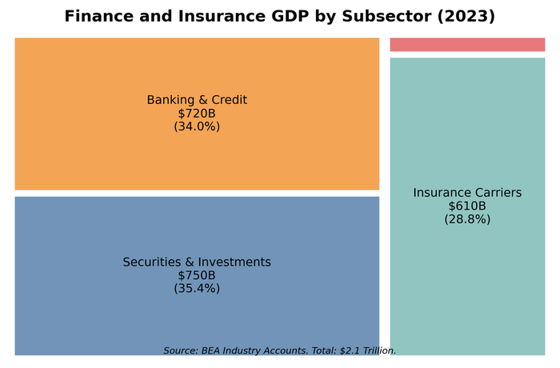
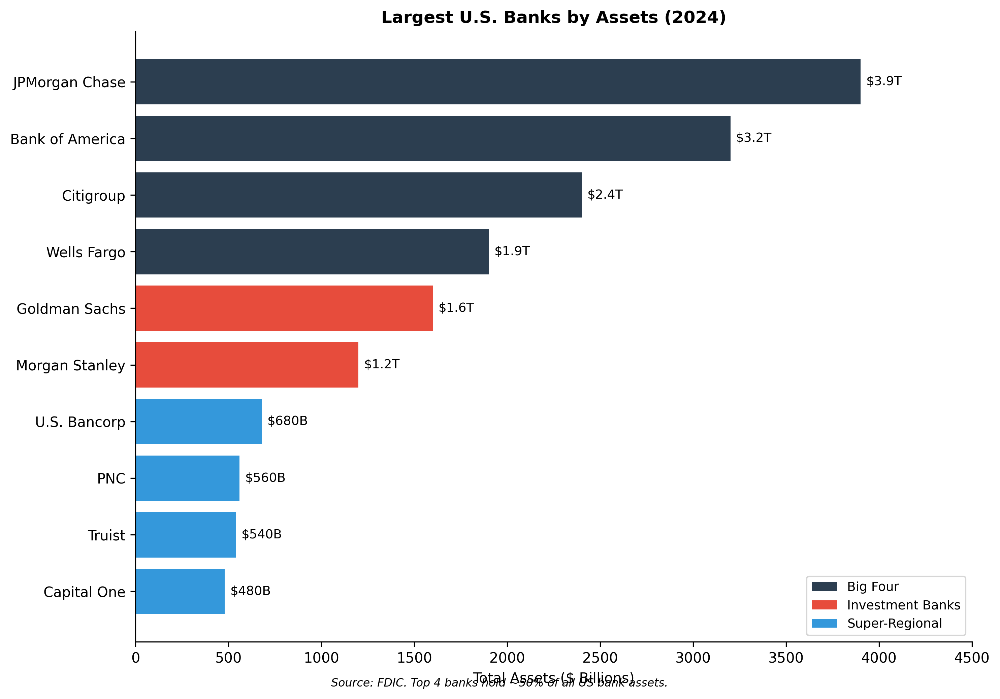
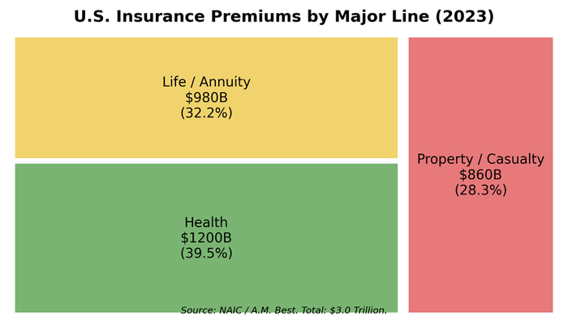
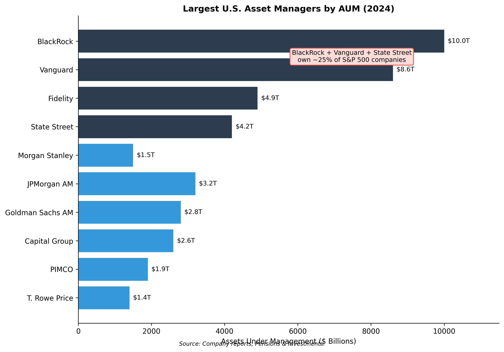

# Chapter 8. Finance and Insurance

The four largest American banks hold more assets than the annual GDP of Japan. BlackRock manages $10 trillion---more than the GDP of every country except the United States and China. The finance and insurance sector accounts for only 8% of GDP but touches every transaction in the economy: mortgages that fund housing, loans that capitalize businesses, insurance that makes risk manageable, and the payment systems that enable commerce. American finance is both remarkably concentrated at the top and remarkably fragmented at the bottom, with a handful of global giants coexisting with 4,500 community banks serving small towns across the country.

## Overview

**Size and Scope**
- GDP contribution: roughly $1.8 trillion (8% of GDP)
  - Banking: roughly $900 billion
  - Insurance: roughly $600 billion
  - Securities and investment: roughly $300 billion
- Employment: roughly 6.5 million workers
- Establishments: roughly 500,000 (including insurance agencies, bank branches, investment offices)
- Key subsectors: Commercial banking, investment banking, insurance (life, property/casualty, health), asset management, private equity, payments

Finance and insurance is the fifth-largest sector of the American economy by GDP, smaller than real estate, healthcare, or professional services, but wielding influence far beyond its size. The sector intermediates the flow of funds from savers to borrowers, transforms risk through insurance, and operates the payment infrastructure that enables economic activity.

<figure>

<figcaption>Figure 8.1: Finance and insurance GDP by subsector. Banking dominates, followed by insurance and securities. Source: BEA (2023)</figcaption>
</figure>

The sector has consolidated dramatically since the 1990s. Deregulation (the Gramm-Leach-Bliley Act of 1999, which repealed Glass-Steagall's separation of commercial and investment banking) enabled the creation of financial supermarkets. The 2008 crisis accelerated consolidation as failing institutions were absorbed by survivors. Today, the four largest banks control nearly half of all US banking assets.

## How the Industry Works

### Commercial Banking: The Core Business

Banks perform **maturity transformation**: they borrow short (deposits that can be withdrawn on demand) and lend long (30-year mortgages, multi-year business loans). This is socially valuable---it funds long-term investment while providing liquidity to savers---but inherently fragile.

**The bank balance sheet:**

| Assets | Liabilities |
|--------|-------------|
| Cash and reserves: 10% | Deposits: 80% |
| Securities: 20% | Wholesale funding: 10% |
| Loans: 65% | Equity capital: 10% |
| Other: 5% | |

Banks make money on the **net interest margin (NIM)**---the spread between what they earn on loans and what they pay on deposits. Historical NIM for US banks has declined from 4-4.5% in the 1990s to 2.5-3.5% today, reflecting lower interest rates, competition from fintech, and regulation requiring more liquid (low-yield) assets. For a deeper explanation of how banks actually create money and how the payment system works, see Chapter 18.

### Revenue Streams

**Commercial banking:**
- Net interest income (loan yields minus deposit costs)
- Fee income (overdraft fees, ATM fees, account maintenance)
- Service charges (wire transfers, foreign exchange)
- Wealth management fees

**Investment banking:**
- Advisory fees (M&A, restructuring)
- Underwriting fees (IPOs, bond issuance)
- Trading revenue (market-making, proprietary positions)
- Asset management fees

**Insurance:**
- Premiums collected
- Investment income on "float" (premiums held before claims paid)
- Underwriting profit (premiums minus claims minus expenses)

**Asset management:**
- Management fees (typically 0.1-2% of assets under management)
- Performance fees (hedge funds, private equity: "2 and 20")
- Distribution fees (12b-1 fees, loads)

### The Shadow Banking System

Beyond traditional banks, a parallel system of credit intermediation operates with less regulation and no deposit insurance. Money market funds (roughly $6 trillion), repo markets (roughly $5 trillion), and private credit (roughly $1.5 trillion) perform bank-like functions without bank-like protections. The 2008 crisis was fundamentally a run on shadow banking. For detailed treatment of how shadow banking works and its role in financial crises, see Chapter 18.

## Industry Structure

### Commercial Banking: Concentration at the Top

The US banking system is simultaneously concentrated and fragmented:

**The Big Four** (by total assets, 2024):

| Rank | Bank | Total Assets | Deposits | US Branches |
|------|------|--------------|----------|-------------|
| 1 | JPMorgan Chase | $3.9 trillion | $2.4T | 4,700 |
| 2 | Bank of America | $3.2 trillion | $1.9T | 3,800 |
| 3 | Citigroup | $2.4 trillion | $1.3T | 650 |
| 4 | Wells Fargo | $1.9 trillion | $1.4T | 4,600 |

<figure>

<figcaption>Figure 8.2: The Big Four banks by total assets. JPMorgan Chase dominates, with assets approaching $4 trillion. Source: FDIC (2024)</figcaption>
</figure>

These four banks hold approximately 45% of all US banking assets. Add the next four (Goldman Sachs, Morgan Stanley, US Bancorp, PNC), and eight banks control over 60%.

**The long tail**: Below the giants:
- roughly 20 "super-regional" banks ($100B-$500B assets): Truist, Capital One, TD Bank, Fifth Third
- roughly 100 regional banks ($10B-$100B): Huntington, Regions, M&T, Zions
- roughly 4,500 community banks (<$10B): Serving local markets, often focused on small business and agricultural lending

Community banks hold only roughly 12% of industry assets but operate roughly 30% of branches and provide the majority of small business loans in rural areas.

### Investment Banking: The Bulge Bracket

Investment banking is dominated by a handful of global firms:

| Rank | Firm | 2023 Revenue | Primary Business |
|------|------|--------------|------------------|
| 1 | JPMorgan | $50B (IB segment) | Full service |
| 2 | Goldman Sachs | $46B | Trading, advisory |
| 3 | Morgan Stanley | $54B | Wealth management, trading |
| 4 | Bank of America | $22B (IB segment) | Underwriting, advisory |
| 5 | Citigroup | $20B (IB segment) | Global markets |

The traditional "bulge bracket" (Goldman, Morgan Stanley, JPMorgan, Bank of America, Citi) dominates M&A advisory, securities underwriting, and institutional trading. Boutique advisory firms (Evercore, Lazard, Centerview, PJT) have gained share in M&A but lack the capital markets capabilities of the giants.

### Insurance: Three Distinct Markets

**Life Insurance** (roughly $900 billion in premiums):

| Rank | Company | Premiums | Business Focus |
|------|---------|----------|----------------|
| 1 | MetLife | $68B | Group and individual life |
| 2 | Prudential | $64B | Retirement, life |
| 3 | New York Life | $35B | Mutual (policyholder-owned) |
| 4 | Northwestern Mutual | $33B | Mutual, wealth management |
| 5 | Lincoln Financial | $18B | Annuities, life |

**Property & Casualty Insurance** (roughly $800 billion in premiums):

| Rank | Company | Premiums | Business Focus |
|------|---------|----------|----------------|
| 1 | State Farm | $90B | Auto, home (mutual) |
| 2 | Berkshire Hathaway | $85B | Geico, reinsurance |
| 3 | Progressive | $62B | Auto |
| 4 | Allstate | $55B | Auto, home |
| 5 | Liberty Mutual | $50B | Commercial, personal |

**Health Insurance** (roughly $1.3 trillion in premiums):

| Rank | Company | Premiums | Enrollment |
|------|---------|----------|------------|
| 1 | UnitedHealth | $320B | 50M+ |
| 2 | Elevance (Anthem) | $160B | 45M |
| 3 | CVS/Aetna | $130B | 35M |
| 4 | Cigna | $120B | 20M |
| 5 | Humana | $100B | 20M |

<figure>

<figcaption>Figure 8.3: Insurance premiums by segment. Health insurance dominates, followed by life and property/casualty. Source: NAIC, company data (2023)</figcaption>
</figure>

Health insurance is increasingly dominated by vertically integrated conglomerates (UnitedHealth owns Optum; CVS owns Aetna and pharmacies; Cigna merged with Express Scripts). This integration raises antitrust concerns but also enables care coordination.

### Asset Management: The Passive Revolution

Asset management has been transformed by the shift from active to passive (index) investing:

| Rank | Firm | AUM | Business Model |
|------|------|-----|----------------|
| 1 | BlackRock | $10.0T | Index funds, ETFs, active |
| 2 | Vanguard | $8.6T | Index funds (mutual structure) |
| 3 | Fidelity | $4.5T | Active and index, brokerage |
| 4 | State Street | $4.1T | ETFs (SPDRs), institutional |
| 5 | Capital Group | $2.5T | Active (American Funds) |

The "Big Three" (BlackRock, Vanguard, State Street) collectively manage roughly $23 trillion and are the largest shareholders in most S&P 500 companies. This concentration raises governance questions: these firms vote the shares they manage, giving them enormous influence over corporate decisions.

<figure>

<figcaption>Figure 8.4: Largest U.S. asset managers by assets under management. BlackRock and Vanguard together manage nearly $20 trillion—more than the GDP of every country except the U.S. and China. Source: Company reports, Pensions & Investments (2024)</figcaption>
</figure>

**Alternative asset managers** (private equity, hedge funds, real estate):

| Rank | Firm | AUM | Primary Strategy |
|------|------|-----|------------------|
| 1 | Blackstone | $1.0T | Private equity, real estate |
| 2 | Apollo | $650B | Credit, private equity |
| 3 | KKR | $550B | Private equity, infrastructure |
| 4 | Carlyle | $420B | Private equity, credit |
| 5 | Bridgewater | $125B | Hedge fund (macro) |

Private equity has grown from a niche strategy to a major force, with implications across the economy. PE firms own companies employing millions of workers, from hospital systems to retail chains to single-family rental homes.

**The Roll-Up Strategy**: Beyond headline acquisitions, PE has quietly consolidated thousands of small businesses in fragmented industries. The playbook is straightforward: buy a "platform" company in a fragmented sector, then aggressively acquire smaller competitors ("add-ons"), achieving economies of scale while extracting synergies. Examples span the economy:

- **Healthcare**: Dental practices (Heartland Dental, Aspen Dental), dermatology clinics, veterinary practices (Mars Petcare owns 2,500+ clinics), emergency rooms (Envision, TeamHealth)
- **Home Services**: HVAC contractors, plumbing companies, pest control, lawn care
- **Professional Services**: Accounting firms, engineering consultancies, IT service providers
- **Consumer Services**: Car washes, funeral homes, self-storage facilities

For a dentist or plumber who sells to PE, the exit provides liquidity and retirement funds. For consumers, the consolidation often means higher prices, standardized service, and corporate rather than owner-operator management. For workers, it can mean new management pressure on wages and staffing levels. The roll-up wave has transformed industries that were historically fragmented into surprisingly concentrated markets—often without the antitrust scrutiny that large horizontal mergers attract, since each individual acquisition is small.

### Fintech and Neobanks

Digital-native financial companies have disrupted traditional banking:

**Payments:**
- PayPal/Venmo: $1.4 trillion payment volume
- Square/Block: $200 billion payment volume
- Stripe: Dominant in online merchant processing

**Consumer banking:**
- Chime: 15+ million accounts (no-fee banking)
- SoFi: Student loans, banking, investing
- Robinhood: Commission-free trading, crypto

**Business lending:**
- Kabbage (American Express): Small business loans
- OnDeck: Small business lending
- Various "buy now pay later" providers (Affirm, Klarna)

Most fintechs operate through bank partnerships (chime uses Bancorp Bank's charter) rather than obtaining their own banking licenses. This creates regulatory complexity and raises questions about consumer protection.

## Geographic Distribution

### Money Center: New York

New York is the undisputed capital of American finance:
- Headquarters of JPMorgan, Citigroup, Goldman Sachs, Morgan Stanley, BlackRock
- NYSE and NASDAQ (though NASDAQ is technically in DC)
- roughly 330,000 finance and insurance employees in NYC metro
- roughly $70 billion in annual wages in finance

The concentration reflects agglomeration economics: proximity to clients, counterparties, regulators, and talent. Despite remote work, New York's dominance has persisted.

### Regional Banking Hubs

**Charlotte, NC**: Second-largest banking center
- Bank of America headquarters
- Truist headquarters (BB&T + SunTrust merger)
- Wells Fargo East Coast hub
- roughly 75,000 banking employees

Charlotte's rise reflects deliberate strategy: North Carolina's banking laws were permissive, allowing NCNB (later NationsBank, then Bank of America) to grow through acquisition.

**San Francisco Bay Area**: Fintech and venture
- Wells Fargo headquarters
- Charles Schwab headquarters (relocated from SF to Dallas)
- Visa, Stripe headquarters
- Dominant in fintech venture capital

**Hartford, CT**: Insurance capital
- Historical headquarters of major insurers
- The Hartford, Travelers, Aetna (now CVS-owned) roots
- Decline as consolidation moved headquarters elsewhere

**Des Moines, IA**: Life insurance hub
- Principal Financial headquarters
- Major operations for Athene, Sammons
- roughly 25,000 insurance employees

### State-Level Variation

Banking presence varies dramatically by state:

| High Concentration | Finance % of State GDP |
|--------------------|----------------------|
| New York | 19% |
| Delaware | 14% (credit card banks) |
| Connecticut | 11% |
| South Dakota | 9% (credit card banks) |

| Low Concentration | Finance % of State GDP |
|-------------------|----------------------|
| Wyoming | 3% |
| Montana | 3% |
| West Virginia | 4% |

Delaware and South Dakota host major credit card operations due to favorable usury laws (no interest rate caps), illustrating how state regulation shapes financial geography.

## The Workforce

### Employment by Segment

| Segment | Employment | Avg Wage | Trend |
|---------|------------|----------|-------|
| Commercial banking | 1.9 million | $75,000 | Declining (automation) |
| Insurance carriers | 1.5 million | $85,000 | Stable |
| Insurance agencies | 1.1 million | $60,000 | Growing |
| Securities/commodities | 950,000 | $180,000 | Growing |
| Other finance | 1.0 million | $90,000 | Growing |

### Occupational Mix

**Front office (client-facing, revenue-generating):**
- Investment bankers, traders, portfolio managers
- Highest compensation (often 50%+ of revenue as comp)
- New York-concentrated

**Middle office (risk, compliance, operations):**
- Risk managers, compliance officers, operations analysts
- Growing rapidly due to post-2008 regulation
- More geographically dispersed

**Back office (processing, support):**
- Transaction processing, IT, HR
- Subject to automation and offshoring
- Increasingly located in lower-cost centers (Tampa, Jacksonville, India)

### Compensation Patterns

Finance is notorious for extreme compensation:
- Average Goldman Sachs comp: roughly $400,000 (including bonus)
- Average JPMorgan comp: roughly $160,000
- Average community bank comp: roughly $65,000

The gap reflects both skill premiums and rent extraction. Top performers in trading and investment banking can earn $1-10 million annually; back-office workers earn middle-class wages.

**Bonus culture**: Investment banking and trading compensation is heavily weighted toward year-end bonuses (often 50-200% of base salary), creating volatility and encouraging risk-taking.

## Regulation and Policy

### The Regulatory Alphabet Soup

American financial regulation is notoriously fragmented:

**Banking regulators:**
- **Federal Reserve**: Supervises bank holding companies, systemically important institutions
- **OCC (Office of the Comptroller of the Currency)**: Charters and supervises national banks
- **FDIC**: Insures deposits, resolves failed banks
- **State banking departments**: Charter and supervise state-chartered banks

A bank may be supervised by multiple regulators depending on its charter and structure.

**Securities regulators:**
- **SEC**: Securities markets, investment advisers, broker-dealers
- **FINRA**: Self-regulatory organization for broker-dealers
- **CFTC**: Derivatives markets (futures, swaps)

**Insurance regulators:**
- **State insurance commissioners**: Primary regulators (no federal insurance regulator)
- **NAIC**: Coordinates state regulation (not a regulator itself)

**Consumer protection:**
- **CFPB (Consumer Financial Protection Bureau)**: Consumer lending, created post-2008
- **FTC**: Broader consumer protection, some financial overlap

### Post-2008 Regulatory Framework

The Dodd-Frank Act (2010) reshaped financial regulation:

**Capital requirements**: Banks must hold more equity (10-15% vs. 6-8% pre-crisis)

**Liquidity requirements**: Banks must hold liquid assets to survive 30 days of stress (Liquidity Coverage Ratio)

**Stress testing**: Annual Fed tests assess whether banks can survive hypothetical crises

**Resolution planning**: Large banks must submit "living wills" showing how they could fail without bailouts

**Volcker Rule**: Limits proprietary trading by banks

**Systemically important designation**: Large banks and some non-banks face enhanced supervision

### The "Too Big to Fail" Problem

The 2008 crisis revealed that some institutions are "too big to fail"---their failure would damage the broader economy, forcing government bailouts. Despite Dodd-Frank reforms, this problem persists:

- The largest banks are larger than before 2008
- The March 2023 crisis (SVB, Signature, First Republic) showed regulators still extend implicit guarantees
- Market discipline is weakened when creditors expect bailouts

## Trade Associations and Lobbying

### Major Trade Associations

| Association | Members | Focus |
|-------------|---------|-------|
| American Bankers Association | Banks of all sizes | Banking industry interests |
| Bank Policy Institute | Large banks | Regulatory advocacy |
| Independent Community Bankers | Community banks | Small bank interests |
| SIFMA | Securities firms | Capital markets |
| American Council of Life Insurers | Life insurers | Life/annuity industry |
| American Property Casualty Insurance | P&C insurers | Property/casualty |

### Lobbying Activity

Financial services is among the largest lobbying spenders:
- roughly $600 million annually in federal lobbying
- Major issues: Capital requirements, CFPB oversight, cryptocurrency regulation, ESG requirements
- Finance PACs are major campaign contributors to both parties

The industry's lobbying success is evident in its ability to weaken or delay post-2008 regulations, though the political environment has become more skeptical post-2016.

## Recent Trends

### 1. The March 2023 Banking Stress

The failures of Silicon Valley Bank, Signature Bank, and First Republic revealed vulnerabilities in regional banking:

**SVB's problem**: The bank invested deposits in long-duration bonds when rates were low. When the Fed raised rates, these bonds lost value---but losses were hidden by accounting rules (held-to-maturity classification). When depositors learned the bank needed to raise capital, a social-media-accelerated run withdrew $42 billion in a single day.

**Lessons**: Uninsured deposits are vulnerable; interest rate risk can destroy capital; digital banking and social media accelerate runs; regulators will extend implicit guarantees to prevent contagion.

### 2. Private Credit Explosion

Private credit---direct lending by funds rather than banks---has grown from under $500 billion (2015) to over $1.5 trillion (2024). Companies that previously borrowed from banks now borrow from Apollo, Ares, and other alternative managers. This shift moves credit risk outside the regulated banking system, creating potential systemic blind spots.

### 3. Fee Compression in Asset Management

The shift to passive investing has crushed fees:
- Average equity mutual fund fee: 0.44% (down from 0.99% in 2000)
- Index fund fees: Often <0.10%
- Active managers have lost $5 trillion in assets to passive over 15 years

Winners: Vanguard, BlackRock, low-cost providers
Losers: Traditional active managers, stock pickers

### 4. Fintech Maturation and Consolidation

After explosive growth (2015-2021), fintech faces headwinds:
- Higher interest rates reduce lending profitability
- Regulatory scrutiny increasing (Chime, Synapse issues)
- Consolidation: M&A activity rising
- "Embedded finance": Banks partnering with fintechs rather than being disrupted

### 5. Insurance Market Stress

Property insurance is in crisis in some regions:
- Climate-related losses rising (hurricanes, wildfires)
- Insurers withdrawing from California, Florida
- State Farm, Allstate non-renewing policies
- Insurance becoming unaffordable or unavailable in high-risk areas

This has implications for housing markets, migration patterns, and government disaster relief.

## Firm Profiles

### JPMorgan Chase

> **Quick Facts**
> - Headquarters: New York, NY
> - Founded: 2000 (merger); predecessor firms date to 1799
> - Revenue: roughly $160 billion (2023)
> - Employees: roughly 300,000
> - CEO: Jamie Dimon (since 2005)

JPMorgan Chase is the largest bank in the United States and among the largest in the world. The firm resulted from a series of mergers: Chemical Bank and Manufacturers Hanover (1991), Chemical and Chase Manhattan (1996), Chase and J.P. Morgan (2000), and JPMorgan Chase and Bank One (2004). The 2008 crisis added Bear Stearns (fire-sale purchase arranged by the Fed) and Washington Mutual (largest bank failure in history, acquired from FDIC).

The firm operates across all major financial services:
- **Consumer and Community Banking**: 4,700 branches, 85 million customers, Chase credit cards
- **Corporate and Investment Bank**: Top-3 in M&A advisory, securities underwriting, trading
- **Commercial Banking**: Middle-market lending
- **Asset and Wealth Management**: roughly $3 trillion in client assets

JPMorgan's scale creates advantages (cheap funding, technology investment capacity) and challenges (regulatory intensity, "too big to manage" risk). Under CEO Jamie Dimon, the bank has generally outperformed peers, navigating the 2008 crisis and 2020 pandemic better than competitors.

The bank exemplifies the "universal bank" model that emerged after Glass-Steagall repeal: commercial banking, investment banking, asset management, and payments under one roof.

### Berkshire Hathaway Insurance Operations

> **Quick Facts**
> - Headquarters: Omaha, NE
> - Founded: 1839 (as textile company); insurance from 1967
> - Insurance Revenue: roughly $85 billion in premiums
> - Float: roughly $165 billion
> - CEO: Warren Buffett (since 1965)

Berkshire Hathaway is technically a conglomerate, but insurance is its engine. Warren Buffett's insight was that insurance generates "float"---premiums collected before claims are paid---that can be invested for decades. If underwriting breaks even, the float is essentially free leverage.

Berkshire's insurance operations include:
- **Geico**: Second-largest auto insurer, known for direct-to-consumer model and gecko advertising
- **Berkshire Hathaway Primary Group**: Commercial insurance
- **Berkshire Hathaway Reinsurance**: One of the world's largest reinsurers, insuring other insurance companies against catastrophic losses
- **General Re**: Global reinsurance

The combined float (roughly $165 billion) funds Berkshire's investments in stocks, entire companies (BNSF railroad, Precision Castparts, Dairy Queen), and cash reserves. This structure is difficult to replicate: it requires exceptional underwriting discipline and investment skill sustained over decades.

Succession planning is underway: Greg Abel (non-insurance operations) is designated as Buffett's successor, with Ajit Jain running insurance. How Berkshire's unique culture survives Buffett's eventual departure is one of corporate America's most-watched questions.

### BlackRock

> **Quick Facts**
> - Headquarters: New York, NY
> - Founded: 1988
> - AUM: roughly $10 trillion
> - Employees: roughly 20,000
> - CEO: Larry Fink (co-founder)

BlackRock is the world's largest asset manager, having grown from a fixed-income shop in 1988 to a financial industry titan. Key growth drivers:

**iShares acquisition (2009)**: BlackRock bought Barclays Global Investors, gaining the iShares ETF platform. iShares is now the largest ETF provider (roughly $3 trillion), making BlackRock the primary beneficiary of the passive investing revolution.

**Aladdin platform**: BlackRock's risk management technology, originally built for internal use, is now licensed to other asset managers, insurers, and pensions. Over $20 trillion in assets are analyzed on Aladdin, giving BlackRock unparalleled visibility into global financial markets.

**Institutional relationships**: Pension funds, sovereign wealth funds, and central banks use BlackRock for outsourced asset management.

BlackRock's scale creates influence beyond pure asset management. The firm is among the top shareholders of most large public companies, creating governance power. CEO Larry Fink's annual letters on ESG and stakeholder capitalism shape corporate behavior---and generate controversy from both left (insufficient action) and right (overreach beyond fiduciary duty).

The firm also advises governments: BlackRock helped the Fed design its corporate bond-buying programs in 2020, raising questions about conflicts of interest.

## Data Sources and Further Reading

### Key Data Sources

- **FDIC**: Bank financial data (call reports), failed bank list, deposit insurance statistics
- **Federal Reserve**: Flow of Funds (Z.1), bank holding company data, stress test results
- **SEC**: Investment company data, Form 13F holdings, broker-dealer FOCUS reports
- **NAIC**: Insurance industry data (by state)
- **BLS**: Employment by industry (QCEW, OES)
- **S&P Global Market Intelligence**: Bank and insurance company data (subscription)

### Further Reading

**Accessible**
- Admati, Anat, and Martin Hellwig (2013). *The Bankers' New Clothes*. Why banks should hold more capital---clearly argued.
- Lewis, Michael (2010). *The Big Short*. The 2008 crisis told through characters who saw it coming.

**Intermediate**
- Gorton, Gary (2010). *Slapped by the Invisible Hand*. The 2008 crisis as a shadow banking run---essential.
- Lowenstein, Roger (1995). *Buffett: The Making of an American Capitalist*. How Berkshire Hathaway was built.
- Bernanke, Ben (1995). "Inside the Black Box: The Credit Channel of Monetary Policy." *Journal of Economic Perspectives*. How banking transmits monetary policy.

**Industry**
- Financial Stability Board. *Global Monitoring Report on Non-Bank Financial Intermediation*. Annual report on shadow banking worldwide.
- Federal Reserve. *Financial Stability Report*. Semi-annual assessment of systemic risks.
- McKinsey Global Banking Annual Review. Industry trends and performance benchmarking.

---

*Chapter 8 | Finance and Insurance*
*The American Economy: A Structural Geography*
*Draft v1 --- January 2026*
