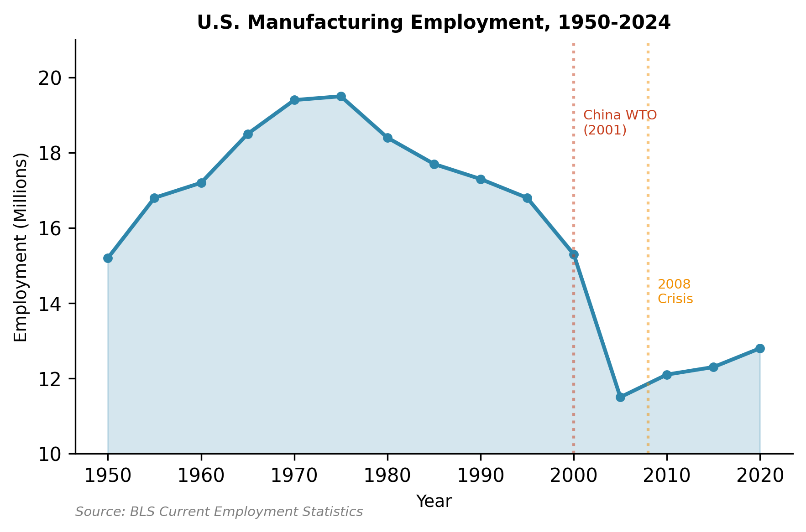
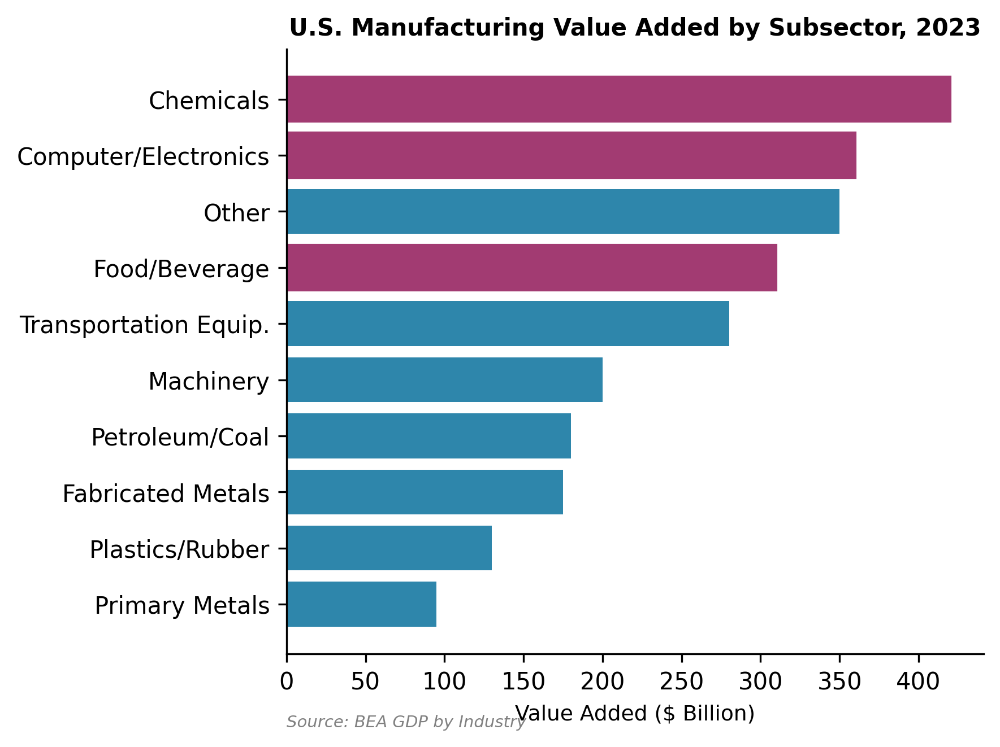
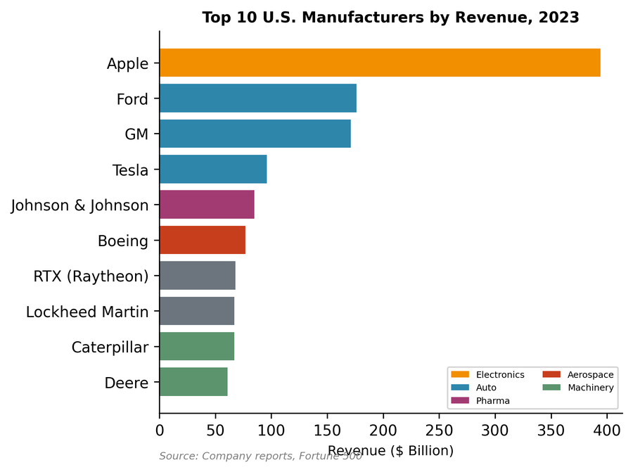
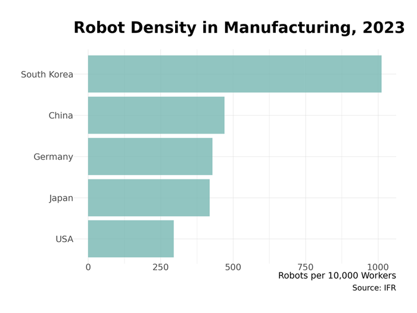
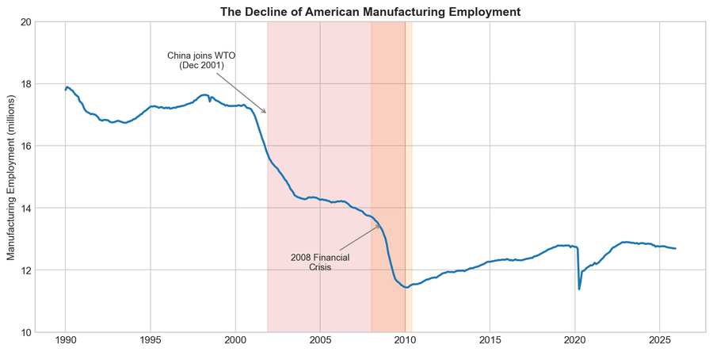

# Chapter 9: Manufacturing

American manufacturing occupies a paradoxical position in the national imagination. Politicians of both parties invoke factory jobs as the backbone of the middle class, yet manufacturing employment has declined relentlessly for decades. Commentators lament "deindustrialization," yet American factories produce more output than ever before. The manufacturing sector commands policy attention far exceeding its share of employment—roughly 8% of the workforce—because of its perceived strategic importance, its geographic concentration in politically pivotal states, and nostalgia for an era when a high school graduate could support a family on assembly-line wages. This chapter examines manufacturing as it actually exists: a high-productivity sector that generates substantial economic value with an ever-shrinking workforce, concentrated in specific subsectors and regions, and increasingly subject to industrial policy intervention.

## Overview: Size and Scope

Manufacturing contributed approximately $2.3 trillion to GDP in 2023—about 10% of the total economy. This share has declined from roughly 25% in the 1960s, but the decline primarily reflects the faster growth of services, not an absolute contraction of industrial output. Real manufacturing output has roughly doubled since the 1980s. American factories produce more aircraft, pharmaceuticals, chemicals, and vehicles than they did a generation ago.

The employment picture tells a different story. Manufacturing employed approximately 12.8 million workers as of early 2024—down from 17.3 million in 2000 and 19.4 million at the 1979 peak. This represents roughly 8% of total nonfarm employment, compared to 22% in 1970. The decline has been persistent across business cycles: manufacturing employment briefly recovered after the 2008-2009 recession and again after the pandemic disruption, but the long-term trajectory remains downward.

*Figure 9.1: Manufacturing employment, 1970-2024. Employment has declined relentlessly from 19 million to 13 million, even as output doubled. Source: BLS CES*

The divergence between rising output and falling employment represents manufacturing's central economic fact: extraordinary productivity growth. Output per worker has increased dramatically as automation, computerization, and process improvements enabled factories to produce more with fewer hands. A modern automobile assembly plant requires a fraction of the labor that similar facilities needed in the 1970s. Pharmaceutical manufacturing, semiconductor fabrication, and food processing have undergone similar transformations. This productivity growth is economically valuable—it means more goods at lower real cost—but it also means that manufacturing will not return as a mass employer regardless of trade policy, reshoring efforts, or industrial subsidies.

## How the Industry Works

### The Production Network

Manufacturing encompasses an extraordinarily diverse set of activities united only by the physical transformation of materials into products. The sector spans petrochemical refineries processing crude oil, pharmaceutical plants synthesizing complex molecules, food processing facilities converting agricultural inputs into packaged goods, and electronics factories assembling components into devices. These industries share some common features—capital intensity, quality control requirements, supply chain complexity—but differ enormously in their economics, workforce requirements, and competitive dynamics.

Modern manufacturing is characterized by fragmented production networks rather than vertically integrated facilities. The automobile industry exemplifies this structure: a single vehicle contains approximately 30,000 parts sourced from hundreds of suppliers across multiple tiers. Original equipment manufacturers (OEMs) like General Motors or Toyota assemble final vehicles, but the majority of value-added occurs upstream in the supply chain. Tier 1 suppliers provide major systems (transmissions, electronics modules), which themselves incorporate components from Tier 2 and Tier 3 suppliers. This structure extends globally: a "American-made" vehicle may contain engines from Mexico, transmissions from Japan, and electronics from multiple Asian countries.

This production network model emerged from the pursuit of efficiency and specialization. Suppliers develop expertise in specific components, achieving scale economies across multiple customers. OEMs focus on design, assembly, and brand management rather than component manufacturing. Just-in-time inventory systems minimize working capital requirements. The system works remarkably well under normal conditions but proved fragile during disruptions: the COVID-19 pandemic, the 2011 Japanese tsunami, and various supply chain crises demonstrated how single-point failures could cascade through interconnected networks.

### Business Models

Manufacturing business models vary enormously by subsector:

**Process manufacturing** (chemicals, petroleum refining, pharmaceuticals) involves continuous or batch production of materials and compounds. These industries are capital-intensive, with high fixed costs and significant scale economies. A world-scale petrochemical facility or pharmaceutical manufacturing plant requires billions in investment. Companies compete on process efficiency, feedstock costs, and capacity utilization. Geographic advantages—access to cheap natural gas for petrochemicals, proximity to agricultural inputs for food processing—strongly influence plant location.

**Discrete manufacturing** (vehicles, machinery, electronics) produces countable units through assembly operations. These industries combine components into finished products, with value creation distributed across design, component sourcing, assembly, and distribution. Business models range from pure assembly (importing components for final assembly) to vertical integration (manufacturing key components in-house). Apple exemplifies the former: the company designs products in California but contracts manufacturing almost entirely to Asian suppliers, primarily Foxconn in China. Boeing represents more integration, manufacturing aircraft structures and assembling aircraft at company-owned facilities while sourcing engines and avionics from suppliers.

**Contract manufacturing** has grown as brand-name companies outsource production. Electronics manufacturing services (EMS) companies like Foxconn, Flex, and Jabil assemble products for multiple brands. This model allows brand owners to focus on design and marketing while contractors achieve scale across customers. The arrangement works well for standardized products but creates dependency on manufacturing partners with their own strategic interests.

## Industry Structure

### Subsector Composition

Manufacturing's $2.3 trillion GDP contribution distributes unevenly across subsectors:

*Figure 9.2: Manufacturing value added by subsector. Chemicals (including pharmaceuticals) lead, followed by computers/electronics and food products. Source: BEA (2023)*

**Chemical products** (including pharmaceuticals) constitute the largest subsector by value-added, contributing approximately $420 billion. This category spans industrial chemicals (basic organic and inorganic compounds), specialty chemicals (catalysts, additives), and pharmaceuticals. The petrochemical industry clusters along the Gulf Coast, exploiting cheap natural gas as feedstock. Pharmaceutical manufacturing concentrates in New Jersey, Massachusetts, and North Carolina, near research universities and biotechnology clusters. Major players include Dow, DuPont (now separate companies after a merger and re-split), BASF's American operations, and pharmaceutical giants like Pfizer, Johnson & Johnson, Merck, and AbbVie.

**Computer and electronic products** contribute approximately $360 billion in value-added. This category includes semiconductor manufacturing, computer and peripheral equipment, communications equipment, and navigational instruments. Despite offshoring of final assembly to Asia, substantial design and some fabrication remain domestic. Intel operates major fabs in Oregon, Arizona, and New Mexico. The CHIPS Act has catalyzed new investments: TSMC is building facilities in Arizona, Samsung in Texas, and Intel is expanding in Ohio. Defense electronics manufacturing remains largely domestic for security reasons.

**Food and beverage products** contribute approximately $310 billion. This essential industry processes agricultural outputs into consumer products—meat packing, dairy processing, beverage manufacturing, grain milling, and packaged foods. The industry is geographically dispersed, located near both agricultural inputs and consumer markets. Major players include Tyson Foods, JBS USA (Brazilian-owned), Cargill (privately held), PepsiCo, and Kraft Heinz.

**Transportation equipment** (vehicles, aerospace, ships) is the largest manufacturing employer, though not the highest in value-added. The automobile industry remains centered in Michigan, with assembly plants extending through the Midwest and increasingly into Southern states. The "Detroit Three"—General Motors, Ford, and Stellantis (formed from the Fiat Chrysler-PSA merger)—compete with transplant operations from Toyota, Honda, Hyundai, BMW, and others. Aerospace manufacturing clusters in the Seattle area (Boeing commercial aircraft), Southern California (defense contractors), and South Carolina (Boeing's second 787 line, now primary). Defense contractors Lockheed Martin, RTX (formerly Raytheon), Northrop Grumman, and General Dynamics operate facilities nationwide, located near military customers and test facilities.

**Machinery** encompasses agricultural equipment (Deere, AGCO, CNH Industrial), construction equipment (Caterpillar, Komatsu's American operations), and industrial machinery. These industries concentrate in the Midwest, near both agricultural customers and the historical manufacturing belt. Caterpillar, headquartered in Texas after relocating from Illinois, remains the iconic American machinery manufacturer.

**Primary and fabricated metals** include steel production, aluminum smelting, and metal parts manufacturing. Once-dominant American steel has contracted dramatically, with integrated steel mills largely replaced by electric arc furnace "mini-mills" that recycle scrap. Nucor pioneered this model and remains the largest domestic producer. Fabricated metal products—stamped parts, forgings, castings—serve as inputs to other manufacturing industries.

### Concentration and Competition

Manufacturing concentration varies dramatically by subsector. Commercial aerospace is essentially a duopoly: Boeing and Airbus divide the large commercial aircraft market, with smaller competitors (Embraer, Bombardier's former operations) serving regional jets. Defense contracting concentrates among five "primes" (Lockheed Martin, RTX, Northrop Grumman, Boeing, General Dynamics) that win major contracts and manage subcontractor networks.

Automobiles exhibit moderate concentration with intense competition. The Detroit Three collectively hold roughly 40% of the American market, competing with Asian (Toyota, Honda, Hyundai-Kia) and European (Volkswagen, BMW, Mercedes) manufacturers. Tesla has disrupted the industry, growing from niche producer to America's most valuable automaker by market capitalization.

Pharmaceuticals combine brand-name concentration with generic competition. Major pharmaceutical companies possess temporary monopolies through patents, but face generic entry upon expiration. The industry has consolidated through mergers (Pfizer-Warner Lambert-Pharmacia, Bristol-Myers Squibb-Celgene), leaving a handful of large diversified pharmaceutical companies competing with biotechnology specialists.

Food processing varies by category. Meat packing has consolidated into an oligopoly: four companies (Tyson, JBS, Cargill, National Beef) control over 80% of beef processing. Beverage production concentrates in Coca-Cola, PepsiCo, and Anheuser-Busch InBev. Packaged foods remain more fragmented, with large players (Kraft Heinz, General Mills, Kellogg) competing with private-label manufacturers and specialty producers.

### Major Manufacturers

The largest American manufacturers by revenue (excluding pure energy companies):

| Company | Sector | 2023 Revenue | Notes |
|---------|--------|--------------|-------|
| Apple | Electronics | $383B | Design in US, manufacturing contracted to Asia |
| Ford | Automobiles | $176B | Detroit Three; EV transition underway |
| General Motors | Automobiles | $171B | Detroit Three; Ultium battery investments |
| Tesla | Automobiles | $96B | EV-native; Fremont, Austin, Nevada plants |
| Johnson & Johnson | Pharma/Medical | $85B | Diversified healthcare company |
| Boeing | Aerospace | $77B | Commercial and defense aircraft |
| RTX | Defense | $68B | Formed from Raytheon-United Technologies merger |
| GE Aerospace | Aerospace | $68B | Spun off from General Electric |
| Lockheed Martin | Defense | $67B | Largest defense contractor; F-35 program |
| Caterpillar | Machinery | $67B | Construction and mining equipment |
| Deere & Co | Machinery | $61B | Agricultural equipment |
| Pfizer | Pharmaceuticals | $58B | Largest pharma; COVID vaccine producer |
| Intel | Semiconductors | $54B | Leading US chip manufacturer |
| Dow | Chemicals | $45B | Commodity and specialty chemicals |

*Figure 9.3: Top U.S. manufacturers by revenue. Apple leads by a wide margin, though its manufacturing is contracted out. Source: Company data (2023)*

Apple's position at the top illustrates manufacturing's complexity: the company designs products in California and captures enormous value through brand, design, and software, but contracts virtually all physical manufacturing to Asian suppliers. Whether Apple is a "manufacturer" depends on definition.

## Geographic Distribution

Manufacturing employment concentrates in specific regions, shaped by historical path dependence, resource endowments, and policy choices.

### The Manufacturing Belt

The traditional manufacturing belt stretches from the Upper Midwest through the Great Lakes states: Michigan, Ohio, Indiana, Wisconsin, and Illinois. This region developed during the late nineteenth and early twentieth centuries, combining access to iron ore (via Great Lakes shipping), coal (from Appalachia), and agricultural inputs. Detroit emerged as the automobile capital; Chicago as a machinery and food processing center; the steel industry clustered around Pittsburgh, Cleveland, and Gary.

This region has experienced substantial employment decline but remains the country's manufacturing heartland. Michigan alone hosts over 600,000 manufacturing workers, concentrated in automotive suppliers and assembly plants. Ohio, Indiana, and Wisconsin each employ over 400,000 in manufacturing. The workforce has aged and shrunk, but the industrial ecosystem—suppliers, skilled workers, engineering universities—persists.

The region is now pivoting toward electric vehicle production. General Motors' Ultium battery joint ventures have established facilities in Ohio and Michigan. Ford's investments concentrate in Michigan and Kentucky. The hope is that EV transition will revitalize rather than further erode Midwestern manufacturing, though battery production requires fewer workers than engine and transmission manufacturing.

### Southern Growth

The most dynamic manufacturing growth has occurred in the Southeast, stretching from South Carolina through Georgia, Alabama, Tennessee, and Kentucky. Foreign automakers established this "Southern Auto Corridor" beginning in the 1980s, attracted by lower labor costs, right-to-work laws limiting union power, and generous state incentives.

BMW's Spartanburg, South Carolina plant is now the company's largest globally. Mercedes-Benz manufactures SUVs in Tuscaloosa, Alabama. Hyundai-Kia operates plants in Alabama and Georgia. Toyota and Nissan built Tennessee facilities. Volkswagen chose Chattanooga for its American assembly plant. These transplants developed their own supplier networks, creating an alternative automotive cluster outside Detroit's traditional orbit.

The South has captured the majority of recent manufacturing investment announcements. Ford's $11 billion BlueOval City complex in Tennessee will produce electric trucks and batteries. Hyundai's new Georgia EV plant represents a $7.6 billion investment. SK Battery is building facilities in Georgia. This "Battery Belt" extends the Southern advantage into the EV era.

The Southern manufacturing model relies on lower labor costs—manufacturing wages average 15-20% below Midwestern levels—and the absence of unions. The United Auto Workers has repeatedly failed to organize Southern transplants, most recently losing a high-profile campaign at Volkswagen's Chattanooga plant in 2019 before finally succeeding in 2024. Whether unionization will spread through the Southern auto industry remains uncertain.

### Aerospace Clusters

Aerospace manufacturing concentrates in distinct clusters:

**Seattle/Puget Sound** hosts Boeing's commercial aircraft operations, though the company has diversified production. The 737 assembles in Renton; the 777 and remaining 787 production in Everett. Boeing's headquarters relocated to Chicago (later Virginia), but engineering and production remain substantially in Washington.

**Southern California** houses the historical aerospace-defense complex. Northrop Grumman, Lockheed Martin's Skunk Works, and numerous suppliers cluster in Los Angeles County. SpaceX manufactures rockets in Hawthorne.

**South Carolina** gained Boeing's second 787 line, a controversial decision driven partly by labor relations conflicts in Washington. The Charleston facility has become Boeing's primary 787 production site.

**Wichita, Kansas** remains the center of general aviation manufacturing. Spirit AeroSystems (formerly Boeing's structures division) produces fuselages and components. Textron Aviation manufactures Cessna and Beechcraft aircraft.

### Pharmaceutical Geography

Pharmaceutical manufacturing clusters along the Northeast Corridor and in specific inland locations:

**New Jersey** earned the nickname "Medicine Chest of the World" in the early twentieth century. Johnson & Johnson, Merck, and numerous smaller companies headquartered there, establishing research and manufacturing facilities. The cluster has shrunk as companies consolidated and offshored some production, but substantial capability remains.

**Boston/Cambridge** has emerged as the biotechnology capital, hosting Moderna, Biogen, and research facilities for most major pharmaceutical companies. Manufacturing often follows R&D, with biologics production requiring proximity to scientific talent.

**Research Triangle (North Carolina)** combines research universities (Duke, UNC, NC State) with pharmaceutical manufacturing. GSK, Pfizer, and Merck operate significant facilities.

**Indiana** hosts Eli Lilly's headquarters and manufacturing complex in Indianapolis, along with substantial pharmaceutical supply chain operations.

## The Workforce

### Employment Characteristics

Manufacturing workers earn above-average wages—median hourly earnings of approximately $23 compared to $21 for all workers—but the premium has eroded over time. The historical manufacturing wage advantage reflected union bargaining power, now largely diminished, and the concentration of manufacturing in higher-wage regions.

The manufacturing workforce has transformed from predominantly production workers to a more diverse occupational mix. Modern factories require engineers, technicians, programmers, quality specialists, and logistics coordinators alongside traditional assembly and machine operator roles. Educational requirements have increased: many manufacturing jobs now require post-secondary training or certification, though four-year degrees remain less common than in professional services.

Manufacturing employment skews male (approximately 70%) and older (median age above 44) compared to the overall workforce. This demographic profile reflects both the historical composition of industrial work and recruitment challenges as younger workers pursue other occupations.

### The Productivity Paradox

Manufacturing productivity has grown faster than most other sectors, a trend economists generally celebrate. Higher productivity means more output per worker, enabling higher wages, lower prices, or both. Yet productivity growth has been manufacturing's employment curse: as each worker produces more, fewer workers are needed to meet any given level of demand.

International comparisons reveal that American manufacturing productivity leads most competitors, undermining the narrative that manufacturing decline reflects competitive weakness. American factories produce roughly twice as much output per hour worked as those in China, a gap that persists despite Chinese wage increases. The challenge is not that American manufacturing is unproductive but that productivity reduces labor demand.

### Automation and Robots

Industrial robots represent the most visible face of manufacturing automation. The United States has approximately 295 robots per 10,000 manufacturing workers—a substantial deployment but below leaders like South Korea (1,000), Singapore, Japan, and Germany (all above 400). China has rapidly increased robot density to 470 per 10,000 workers, surpassing the United States.

Automotive manufacturing has the highest robot penetration, with welding, painting, and material handling extensively automated. Electronics assembly increasingly uses robots, though the dexterity required for complex assembly still exceeds robot capabilities for many tasks. Pharmaceutical manufacturing is highly automated but with specialized equipment rather than general-purpose robots.

*Figure 9.4: Industrial robot density (robots per 10,000 manufacturing workers). The U.S. lags South Korea and Germany; China has surpassed U.S. density. Source: IFR (2023)*

The automation trajectory suggests continued manufacturing employment pressure. Advances in robotics, machine vision, and artificial intelligence expand the range of automatable tasks. Collaborative robots ("cobots") that work alongside humans, rather than in caged workcells, enable automation of tasks previously requiring human flexibility. While alarmist predictions of mass technological unemployment have repeatedly proven premature, manufacturing employment will continue its long-term decline.

### The China Shock and Its Aftermath

While automation provided steady pressure on manufacturing employment, the period from 2000 to 2010 delivered a concentrated blow that economists now call "the China shock." China's accession to the World Trade Organization in December 2001 provided permanent normal trade relations with the United States, eliminating the annual uncertainty over tariff renewal that had constrained Chinese exports. What followed was an import surge of unprecedented speed and scale.

*Figure 9.5: Manufacturing employment fell sharply from 17.3 million in 2000 to 11.5 million in 2010—a loss of 5.8 million jobs in a single decade. The China shock contributed substantially to this decline. Source: BLS*

Between 2000 and 2010, American manufacturing employment fell from 17.3 million to 11.5 million—a loss of 5.8 million jobs, or one-third of the manufacturing workforce. While automation and the 2008 financial crisis contributed, economists David Autor, David Dorn, and Gordon Hanson demonstrated that import competition from China accounted for a substantial share—perhaps 2 to 2.4 million jobs directly displaced by Chinese imports, with additional losses through supply chain linkages.

The transmission mechanism worked through product market competition. As Chinese factories scaled up production of labor-intensive manufactured goods—furniture, textiles, apparel, toys, electronics assembly—American producers faced a stark choice: match Chinese costs (impossible given wage differentials), automate (capital-intensive and not always feasible), shift to higher-value products (requiring capabilities not all firms possessed), or exit. Many exited. The furniture industry in North Carolina, textile mills in the Southeast, and electronics assembly facilities across the country shuttered as Chinese imports captured market share.

**Geographic Concentration**: The shock did not fall evenly. Communities that had specialized in the goods China now produced suffered disproportionately. The research by Autor, Dorn, and Hanson documented that commuting zones with industries more exposed to Chinese import competition experienced larger employment losses, slower wage growth, and higher rates of disability enrollment, food stamp uptake, and mortality. The pain concentrated in:

- **Appalachian furniture corridor**: North Carolina, Virginia, and Tennessee communities built around furniture manufacturing saw plant closures cascade through the 2000s
- **Rust Belt manufacturing**: Ohio, Michigan, Indiana communities already stressed by automotive restructuring faced additional pressure
- **Textile South**: South Carolina, Georgia, and Alabama textile towns that had survived earlier competitive pressures succumbed to Chinese competition
- **Electronics assembly**: California, Texas, and other hubs of circuit board assembly and component manufacturing

**Labor Market Transmission**: Perhaps most striking was how poorly labor markets absorbed the displaced workers. Economic theory predicted workers would transition to other sectors or regions. In practice, many displaced manufacturing workers never found comparable employment. They withdrew from the labor force, took lower-paying service jobs, applied for disability benefits, or moved into long-term unemployment. The adjustment mechanisms that had smoothed earlier trade shocks—geographic mobility, sectoral reallocation, retraining—proved inadequate for a shock of this magnitude and speed.

**Long-Run Consequences**: The China shock reshaped not just the economy but American politics. The communities most exposed to import competition showed significant shifts in voting patterns, contributing to the populist turn in trade policy that culminated in the 2018 tariffs. The bipartisan consensus favoring trade liberalization fractured. The shock demonstrated that "adjustment costs" economists had treated as temporary frictions could in fact be permanent and geographically concentrated.

The China shock has largely run its course—Chinese wages have risen substantially, and the most trade-sensitive industries have already adjusted or disappeared. But its legacy shapes contemporary industrial policy. The emphasis on supply chain resilience, the skepticism toward free trade agreements, and the willingness to deploy subsidies and tariffs all reflect lessons drawn from the 2000-2010 experience.

## Regulation and Trade

### Regulatory Environment

Manufacturing faces a complex regulatory environment spanning environmental protection, worker safety, product standards, and trade policy.

**Environmental regulation** significantly affects manufacturing operations. The Clean Air Act regulates emissions from industrial facilities. The Clean Water Act governs discharges to waterways. The Resource Conservation and Recovery Act controls hazardous waste management. These regulations impose compliance costs but have substantially reduced industrial pollution over the past fifty years. Critics argue regulations disadvantage American manufacturers relative to foreign competitors with weaker environmental standards; advocates counter that environmental protection is worth its cost and that a "race to the bottom" benefits no one.

**Occupational safety** regulation through OSHA establishes workplace safety standards. Manufacturing workplaces have become dramatically safer over time, with injury rates falling roughly 80% since OSHA's 1971 creation, though the sector remains more hazardous than services.

**Product standards** vary by industry. Food and Drug Administration regulation governs pharmaceuticals and medical devices, imposing lengthy approval processes and manufacturing quality requirements. Consumer product safety standards apply broadly. Industry-specific standards (automotive safety, aviation certification) create additional compliance requirements.

### Trade Policy

Manufacturing lies at the center of trade policy debates. The United States runs large trade deficits in manufactured goods—approximately $1.06 trillion in 2023—importing more manufactured products than it exports. China, Mexico, and the European Union are the largest sources of manufactured imports.

Trade economists generally view this deficit as reflecting macroeconomic factors (American consumption exceeding production, financed by capital inflows) rather than unfair trade practices. Manufacturing advocates argue that trade agreements disadvantaged American workers, that currency manipulation and subsidies distort competition, and that strategic industries require protection.

Trade policy has shifted toward protection under both Trump and Biden administrations. Tariffs on Chinese goods, imposed starting in 2018, remain largely in place. The Biden administration added targeted tariffs on strategic goods (semiconductors, batteries, electric vehicles, solar panels) while maintaining the broader Trump-era tariffs. The USMCA agreement (replacing NAFTA) tightened automotive content requirements, aiming to increase North American production.

Whether protectionist policies will increase manufacturing employment remains uncertain. Tariffs raise input costs for downstream manufacturers, potentially destroying more jobs than they create. Reshoring requires years of investment to develop domestic supply chains. The most optimistic case is that strategic investments (CHIPS Act, IRA) combined with trade protection will establish competitive domestic industries; the pessimistic case is that protection raises costs for consumers and businesses without reviving employment.

## Industrial Policy and Strategic Investment

The Biden administration marked a dramatic shift toward active industrial policy after decades of bipartisan consensus favoring market-driven outcomes. Three major legislative initiatives—the Bipartisan Infrastructure Law, the CHIPS and Science Act, and the Inflation Reduction Act—channeled hundreds of billions toward manufacturing investment.

### The CHIPS and Science Act

The CHIPS Act committed $52.7 billion to semiconductor manufacturing and research, responding to concerns about American dependence on Asian chip fabrication. The United States had invented the integrated circuit but watched fabrication capacity migrate to Taiwan (TSMC), South Korea (Samsung), and increasingly China. By 2020, the U.S. share of global semiconductor manufacturing had fallen to roughly 12%, down from 37% in 1990.

The CHIPS Act provides grants and tax credits for domestic semiconductor fabrication. Major commitments include:
- **Intel**: $8.5 billion in direct grants supporting expansions in Arizona, Oregon, Ohio, and New Mexico
- **TSMC**: $6.6 billion supporting Arizona fab construction
- **Samsung**: $6.4 billion supporting Texas expansion
- **Micron**: $6.1 billion supporting facilities in New York and Idaho

Industry announcements claim over $200 billion in private investment catalyzed by CHIPS Act incentives. Whether these investments will restore American semiconductor leadership remains uncertain. Leading-edge fabrication requires not just facilities but the entire ecosystem of equipment suppliers, materials providers, and skilled workers that has developed in Asia over decades.

### The Inflation Reduction Act

Despite its name, the IRA is primarily climate and industrial policy legislation. The act provides extensive tax credits for clean energy manufacturing, electric vehicles, and renewable energy deployment. Manufacturing-relevant provisions include:

- **Advanced Manufacturing Production Tax Credit (45X)**: Credits for domestic production of solar cells, battery cells, and critical minerals processing
- **Advanced Energy Project Credit (48C)**: Grants for clean energy manufacturing facilities
- **Electric Vehicle Credits**: Consumer credits conditioned on North American assembly and battery content requirements

These provisions have catalyzed substantial manufacturing investment announcements—over $86 billion in the first year—concentrated in battery manufacturing for electric vehicles. The "Battery Belt" from Georgia through Tennessee reflects both IRA incentives and state-level subsidies.

### Supply Chain Resilience

The COVID-19 pandemic exposed vulnerabilities in global supply chains, generating bipartisan support for "reshoring" and "friendshoring" critical manufacturing. Personal protective equipment shortages, semiconductor shortages disrupting automobile production, and pharmaceutical supply concerns all highlighted dependence on foreign production.

The December 2024 Quadrennial Supply Chain Review documented administration efforts to strengthen supply chains in critical sectors: semiconductors, batteries, critical minerals, pharmaceuticals, and defense. The report claimed over $1 trillion in announced private investment since 2021, with $796 billion specifically in manufacturing.

Yet supply chain vulnerabilities persist. China dominates critical mineral processing, battery component production, and many pharmaceutical ingredients. Developing alternative supply chains requires years of investment and may never achieve cost parity with established Asian producers. The tension between supply chain resilience and cost efficiency will shape manufacturing policy for decades.

## Recent Trends

### The Manufacturing Construction Boom

Manufacturing construction spending has surged since 2021, roughly doubling to an annualized rate exceeding $225 billion. This boom reflects CHIPS Act semiconductor investments, IRA-supported clean energy manufacturing, and broader reshoring efforts. The construction activity is real: new facilities are rising in Ohio (Intel), Arizona (TSMC, Intel), Georgia (SK Battery, Hyundai), Tennessee (Ford), and elsewhere.

Whether this construction translates into sustained manufacturing employment growth is less clear. Semiconductor fabs are highly automated, employing perhaps 3,000 workers in facilities costing $20 billion. Battery plants similarly require fewer workers than historical manufacturing facilities of equivalent investment. The manufacturing employment boost may prove modest relative to the investment scale.

### Electric Vehicle Transition

The automotive industry's transition to electric vehicles represents the most significant manufacturing shift in decades. Traditional automakers are converting plants from internal combustion to EV production while Tesla and new entrants build EV-native facilities. The transition favors the Battery Belt over the traditional auto industry heartland, though substantial investment is flowing to Michigan and Ohio as well.

EV manufacturing requires different supply chains than internal combustion vehicles. Battery cells replace engines as the critical component. Electric motors replace transmissions. The shift advantages companies with battery manufacturing relationships (often Korean and Chinese suppliers) over traditional powertrain suppliers. Employment effects remain uncertain: battery and EV assembly may require fewer workers than traditional auto manufacturing, potentially accelerating long-term employment decline even as production volumes grow.

### The Jobs Question

Manufacturing has regained jobs lost during the pandemic, with employment roughly flat at 12.8 million. The Biden administration cited 700,000 manufacturing jobs added since January 2021, though this substantially reflects pandemic recovery rather than structural employment growth.

The fundamental employment trajectory remains downward. Productivity growth, automation, and global competition constrain manufacturing employment regardless of policy intervention. Industrial policy may create or preserve jobs at the margin—semiconductor fabs, battery plants, and reshored production will employ some workers—but manufacturing will not return as a mass employer. The sector's importance lies in its output, its strategic value, and its role in specific communities, not in aggregate employment.

---

## Firm Profiles

### Caterpillar: The Machine in the Garden

Caterpillar is America's iconic machinery manufacturer, producing the yellow construction and mining equipment visible at job sites worldwide. Founded in 1925 from the merger of Holt Manufacturing and C.L. Best Tractor, the company built its reputation on tracked vehicles (the "Caterpillar" name derives from how tracked machines crawl) and expanded into a full range of heavy equipment.

Caterpillar generated $67 billion in revenue in 2023, selling equipment across construction, mining, energy, and transportation markets. The company operates a global manufacturing network but maintains substantial American production, with major facilities in Illinois (historically) and expanding operations in Texas, where the company relocated its headquarters in 2022.

The company exemplifies manufacturing's strategic and cyclical nature. Caterpillar equipment builds infrastructure worldwide; demand rises and falls with commodity prices and construction cycles. The company has navigated decades of global competition, particularly from Komatsu of Japan, maintaining technological leadership while managing manufacturing across multiple countries. Labor relations have been contentious, with extended strikes in the 1990s and ongoing tension over wages and benefits.

**Headquarters**: Irving, Texas (relocated from Peoria, Illinois)
**Employees**: 114,000 globally
**Key products**: Excavators, bulldozers, wheel loaders, mining trucks, diesel engines

---

### Pfizer: The Pharmaceutical Giant

Pfizer is America's largest pharmaceutical company by revenue and among the world's largest, generating $58 billion in 2023 (down from pandemic-era peaks when COVID-19 vaccines boosted revenue dramatically). Founded in 1849 in Brooklyn as a chemicals manufacturer, Pfizer evolved into a pharmaceutical powerhouse through internal research and aggressive acquisition.

The company's portfolio spans cardiovascular drugs, vaccines, oncology, and rare disease treatments. Pfizer's COVID-19 vaccine, developed in partnership with Germany's BioNTech, demonstrated pharmaceutical manufacturing's potential for rapid scale-up: the company manufactured billions of doses within months of approval. Beyond vaccines, the company produces treatments generating billions in annual revenue (Eliquis, Prevnar, Ibrance).

Pharmaceutical manufacturing differs from other industrial sectors in its regulatory intensity, intellectual property dependence, and high margins. Pfizer operates manufacturing facilities worldwide, with significant American production in Michigan, New York, and Puerto Rico. The company's future depends on its R&D pipeline and patent estate: blockbuster drugs eventually face generic competition, requiring continuous innovation to maintain revenue.

**Headquarters**: New York City
**Employees**: 83,000 globally
**Key products**: Eliquis (anticoagulant), Prevnar (vaccine), COVID-19 vaccine

---

### Deere & Company: Farming the Data

Deere & Company, universally known as John Deere, dominates agricultural equipment manufacturing with approximately 60% of the North American tractor market. Founded in 1837 by blacksmith John Deere, who developed a steel plow suitable for Midwestern prairie soils, the company evolved into a comprehensive agricultural equipment manufacturer.

Deere generated $61 billion in revenue in 2023, benefiting from strong agricultural commodity prices that enabled farmers to invest in new equipment. The company manufactures tractors, combines, planters, and specialized equipment for every stage of agricultural production. Beyond agriculture, Deere produces construction and forestry equipment, competing with Caterpillar in some categories.

The company has transformed from pure equipment manufacturer to technology company embedded in equipment. Modern John Deere machines incorporate GPS guidance, yield monitors, soil sensors, and data analytics. The company's precision agriculture platform generates detailed field data, enabling optimized planting, fertilization, and harvesting. This technological shift has made Deere equipment increasingly sophisticated—and expensive—while creating new revenue streams from data services and software subscriptions.

Deere has sparked controversy over its equipment software policies, with farmers arguing that restrictions on repair access violate traditional ownership rights. The "right to repair" movement has targeted Deere specifically, leading to some policy concessions and ongoing legislative battles.

**Headquarters**: Moline, Illinois
**Employees**: 83,000 globally
**Key products**: Tractors, combines, planters, precision agriculture technology

---

## Data Sources and Further Reading

### Government Sources
- Bureau of Economic Analysis, GDP by Industry
- Bureau of Labor Statistics, Current Employment Statistics
- Census Bureau, Annual Survey of Manufactures
- Federal Reserve, Industrial Production Index
- White House, Quadrennial Supply Chain Review (December 2024)

### Academic Sources
- Helper, Susan, and Rebecca Henderson. "Management Practices, Relational Contracts, and the Decline of General Motors." *Journal of Economic Perspectives* 28, no. 1 (2014): 49-72.
- Autor, David H., David Dorn, and Gordon H. Hanson. "The China Shock: Learning from Labor-Market Adjustment to Large Changes in Trade." *Annual Review of Economics* 8 (2016): 205-240.
- Pierce, Justin R., and Peter K. Schott. "The Surprisingly Swift Decline of US Manufacturing Employment." *American Economic Review* 106, no. 7 (2016): 1632-1662.

### Industry Data
- International Federation of Robotics, World Robotics Report
- Semiconductor Industry Association, State of the Industry Report
- National Association of Manufacturers, Industry Statistics

### Books
- Vaclav Smil, *Made in the USA: The Rise and Retreat of American Manufacturing*. Cambridge: MIT Press, 2013.
- Louis Uchitelle, *The Disposable American: Layoffs and Their Consequences*. New York: Knopf, 2006.
- Steven Rattner, *Overhaul: An Insider's Account of the Obama Administration's Emergency Rescue of the Auto Industry*. Boston: Houghton Mifflin, 2010.
