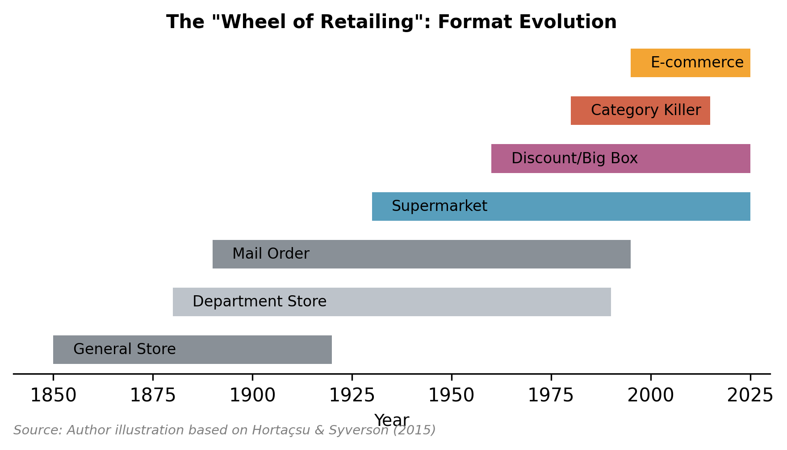
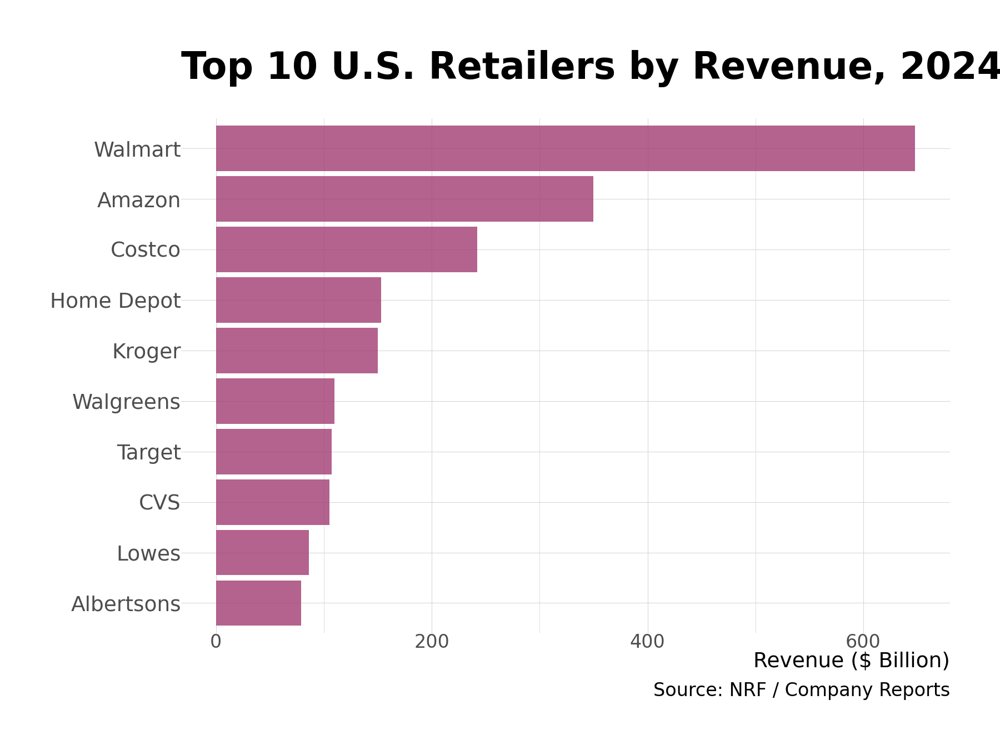
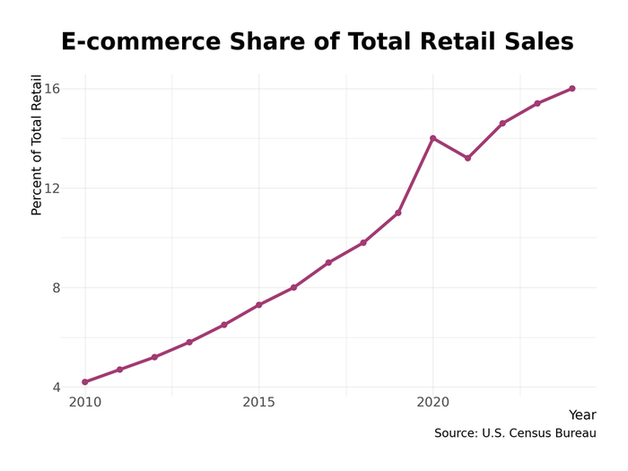

# Chapter 10. Retail and Wholesale Trade

*"The consumer is boss."* — Sam Walton

Retail is the visible face of the economy—the point where production meets consumption. It is where the abstract supply chains of the global economy materialize into a gallon of milk, a smartphone, or a pair of jeans. But behind the storefront lies a vast, often invisible wholesale infrastructure that acts as the circulatory system of commerce. Together, these sectors employ over 20 million Americans and dictate not just what we buy, but how our cities are organized, how labor markets function, and how value is distributed across the supply chain. This chapter examines the mechanics of this massive distribution engine, from the "wheel of retailing" to the algorithmically optimized fulfillment centers of the digital age.

## Overview

**Size and Scope**

- **Retail Sales:** Approximately **$7.26 trillion** (2024)
- **Wholesale Sales:** Approximately **$11.4 trillion**
- **Retail Employment:** ~15.5 million workers
- **Wholesale Employment:** ~6.1–6.3 million workers
- **Total Sector Employment:** ~21.5 million (roughly 14% of US employment)

It is a structural curiosity that wholesale revenue exceeds retail revenue; this reflects the "double counting" inherent in intermediate goods as products change hands multiple times before reaching the final consumer. A bottle of aspirin might be sold by the manufacturer to a pharmaceutical wholesaler to a drugstore chain's distribution center to an individual store before finally reaching you.

Retail is the nation's largest private employer sector, though its dominance is fragmenting. Wholesale trade, while employing fewer people, generates immense turnover and acts as the critical logistical bridge between manufacturers (who make things) and retailers (who sell them). Without the wholesale infrastructure—the drug distributors, food service companies, industrial suppliers—the retail shelves would be empty.

## How the Industry Works

Retail is not static; it is a relentless evolutionary struggle described by the **"Wheel of Retailing"** concept. New formats enter the market as low-status, low-margin, low-price discounters. As they succeed, they upgrade their facilities and services, adding cost and price, eventually becoming vulnerable to the next wave of lean discounters. Sears rose on mail-order efficiency, added expensive department stores, and was killed by Walmart's warehouse stores. Walmart, in turn, is now fighting Amazon's even leaner e-commerce model.

### Format Evolution

The trajectory of American retail is a history of disruption, each wave driven by productivity improvements and scale economies:

1. **General Stores (Pre-1900):** The mom-and-pop establishments serving local markets with limited selection.
2. **Department Stores (1880s–1960s):** The "cathedrals of consumption" (Macy's, Marshall Field's, Wanamaker's) that aggregated categories under one roof in urban centers.
3. **Mail Order (1890s–1970s):** Sears and Montgomery Ward brought consumption to rural America through catalogs—the original "e-commerce."
4. **Supermarkets (1930s–):** Self-service grocery stores replaced clerks fetching items, dramatically cutting labor costs.
5. **Suburban Big-Box (1960s–2000s):** Category killers (Toys "R" Us, Circuit City, Borders) and mass merchants (Walmart, Target) colonized suburban sprawl with massive footprints and parking lots.
6. **E-commerce (1995–):** The digital iteration of mail order, turbocharged by search costs approaching zero. Why drive to three stores when you can compare prices in seconds?

*Figure 10.3: The wheel of retailing: format evolution over a century. Each wave entered as low-cost disruptor before maturing and becoming vulnerable to the next innovation. Source: Author compilation*

Research by Hortaçsu and Syverson (2015) demonstrates that this format evolution, not e-commerce specifically, is the primary story of retail. The shift from small, inefficient retailers to large, productive chains accounts for nearly all productivity growth in the sector. E-commerce is simply the latest chapter.

### The Economic Model

The retailer's fundamental equation is the **Gross Margin**: the difference between the cost of goods sold (COGS) and the selling price.

- **Buy Low, Sell Higher:** Success depends on purchasing leverage. Walmart's size allows it to dictate terms to suppliers, widening its margin without raising consumer prices. A supplier that loses Walmart loses access to 25% of the American consumer market.
- **Inventory Turnover:** Inventory is capital trapped on a shelf. The goal is to turn it over as fast as possible. Costco turns inventory about 12 times per year; a typical department store manages 3–4 turns.
- **Private Label vs. National Brands:** Retailers increasingly bypass branded manufacturers to sell their own "private label" goods (Costco's Kirkland Signature, Amazon Basics, Target's Good & Gather). This captures the brand margin for the retailer and builds customer loyalty that can't be arbitraged away to competitors.
- **Real Estate:** For physical retailers, location is both strategy and cost structure. Owning versus leasing stores dramatically affects balance sheets and flexibility.

### The Omnichannel Revolution

The distinction between "online" and "offline" is evaporating. Stores now function as forward fulfillment centers. **Walmart** ships approximately 50% of its online orders directly from its 4,700 stores rather than from dedicated warehouses, leveraging its proximity to 90% of the US population to beat Amazon on speed and cost. **Target** does the same with its Drive Up and same-day delivery services. Amazon, meanwhile, bought **Whole Foods** in 2017 precisely to get physical locations closer to customers.

The winning formula is **omnichannel**: seamless integration of digital discovery, physical experience, and flexible fulfillment. Pure-play e-commerce retailers (other than Amazon) have struggled; pure-play physical retailers have struggled more.

### Wholesale: The Invisible Infrastructure

Wholesale trade is the unglamorous backbone of retail. Wholesalers aggregate products from thousands of manufacturers, maintain inventory, extend credit, and deliver to retailers who couldn't possibly manage direct relationships with every supplier.

**Key Wholesale Sectors:**

- **Pharmaceutical Distribution:** A near-oligopoly. **McKesson** ($276B revenue), **AmerisourceBergen** ($238B), and **Cardinal Health** ($205B) together distribute roughly 90% of all pharmaceuticals in America. They are the hidden pipes connecting drug manufacturers to your local pharmacy.
- **Food Service:** **Sysco** ($76B) and **US Foods** ($35B) supply restaurants, hospitals, and cafeterias across America.
- **Industrial Distribution:** **Grainger** ($16B), **HD Supply**, and **Fastenal** supply the nuts, bolts, tools, and safety equipment that keep American industry running.
- **Electronics:** **Ingram Micro** and **Tech Data** move computer hardware and consumer electronics from Asian factories to American stores.

Wholesale margins are thin (typically 1–3% net), but volumes are enormous. These are logistics businesses, not merchandising businesses—they compete on delivery reliability, inventory depth, and supply chain technology.

## Industry Structure

The retail landscape is bifurcated: a handful of colossal "power retailers" dominate, while thousands of smaller players fight for niches.

### The Big Four (2024 US Sales)

| Rank | Company | US Revenue | Market Position |
|------|---------|------------|-----------------|
| 1 | **Walmart** | $569B | 37% of US online grocery market |
| 2 | **Amazon** | $274B | ~37.6% of all US e-commerce |
| 3 | **Costco** | $183B | 54% of warehouse club segment |
| 4 | **Target** | $107B | "Upscale discount" positioning |

*Figure 10.1: Top 10 retailers by US revenue. Walmart dominates, with nearly twice Amazon's retail revenue. Source: Company data (2024)*

These four firms together account for over $1.1 trillion in US retail sales—roughly 15% of the total market. Their scale advantages in logistics, technology, and purchasing power are nearly insurmountable for smaller competitors.

### Other Major Segments

**Grocery:** A brutally low-margin business (1–2% net margins typical) dominated by scale. **Kroger** ($150B), the largest traditional grocer, operates regional banners (Ralphs, Fred Meyer, Harris Teeter). **Albertsons** ($79B) owns Safeway, Vons, and Jewel-Osco. Strong regional chains persist: **Publix** (Florida-based, $54B, employee-owned), **H-E-B** (Texas, privately held, cult following), **Wegmans** (Northeast, smaller but beloved).

**Home Improvement:** An effective duopoly. **Home Depot** ($157B) and **Lowe's** ($86B) together control roughly 80% of the market. Both benefited enormously from pandemic home improvement spending.

**Pharmacy/Drugstore:** **CVS Health** and **Walgreens** dominate but are struggling as front-of-store retail (cosmetics, snacks, household goods) declines. Their future is healthcare services, not retail.

**Dollar Stores:** The fastest-growing physical format of the past two decades. **Dollar General** operates 19,500+ stores, often the only retail presence in rural towns. **Dollar Tree** (which owns Family Dollar) operates 16,000+ stores. These are the retail equivalents of cockroaches—thriving where larger retailers won't go.

**Department Stores:** A sector in terminal decline. **Macy's**, **Nordstrom**, **Kohl's**, and **JCPenney** (now restructured) have shrunk steadily as they've lost traffic to e-commerce and specialty retailers. The department store's role as the mall anchor tenant has become a liability as malls themselves struggle.

**Concentration:** The top 10 retailers control approximately **35%** of total retail sales, up from roughly 25% two decades ago. Scale economies in logistics, technology, and supplier negotiations increasingly punish smaller competitors.

## Geographic Distribution

Retail geography reveals American settlement patterns, class stratification, and the uneven geography of opportunity.

### Walmart's Empire

With 4,700+ US stores, Walmart dominates rural and suburban geographies. In many counties, it is simultaneously the primary grocer, general merchant, pharmacist, and employer. Walmart strategically saturated small towns before competitors arrived, creating local monopolies. A map of Walmart store density is essentially a map of non-metropolitan America.

### Amazon's Archipelago

Amazon operates 1,000+ fulfillment centers, sortation centers, and delivery stations in the US. These facilities cluster near major metropolitan areas to enable same-day and next-day delivery. The geography is dictated by logistics: proximity to airports, highway intersections, and population density. Amazon's physical footprint is now larger than Walmart's by square footage—it's just not visible to consumers.

### Regional Grocery Strongholds

Unlike general merchandise, grocery retailing remains stubbornly regional:
- **Publix:** Dominates Florida and the Southeast
- **H-E-B:** A Texas institution, beloved with cult-like loyalty
- **Wegmans:** Commands devotion in the Northeast and Mid-Atlantic
- **Meijer:** A Midwest supercenter chain predating Walmart
- **WinCo, Grocery Outlet:** West Coast discount grocers

These regional players survive by knowing their local markets intimately—local products, local tastes, local real estate relationships—better than national chains.

### The Mall Crisis

The American mall, that cathedral of 20th-century consumerism, is bifurcating:
- **Class A Malls:** Properties in wealthy suburbs with high-end tenants (Apple, Lululemon, luxury brands) are thriving, with occupancy rates above 95%.
- **Class B/C Malls:** Properties in middle-market and secondary areas are dying. The department store anchors that sustained them (Sears, JCPenney, Macy's) have closed locations en masse. Many are being demolished or repurposed as fulfillment centers, medical facilities, or housing.

### Dollar Stores as Infrastructure

In rural towns and low-income urban neighborhoods where full-service grocers won't operate, **Dollar General** often stands alone. It has become de facto essential infrastructure—the only place within 30 miles to buy milk, diapers, or canned goods. Critics note these stores offer limited fresh food options, potentially exacerbating "food desert" problems. Defenders note that without Dollar General, some communities would have no retail at all.

## The Workforce

### Employment Scale

Retail employs approximately **15.5 million workers**—roughly 10% of total US employment. Add wholesale, and the distribution sector employs over 21 million Americans. Retail is the classic "entry job"—the first formal employment for millions of teenagers and the fallback for workers displaced from other sectors.

### Wage Dynamics

Retail was historically a minimum-wage sector. That floor has shifted dramatically:
- **Amazon's 2018 Move:** Amazon raised its minimum wage to $15/hour, forcing competitors to respond. Research found this created 2.3–4.7% wage spillovers at nearby non-Amazon employers.
- **Current Floor:** In competitive labor markets (urban areas, tight labor markets), the effective floor is now **$17–18/hour**.
- **Costco Exception:** Costco's average hourly wage exceeds $28/hour, demonstrating that high-wage retail is possible (though Costco's membership model generates higher revenue per worker).

### Working Conditions

The industry is characterized by:
- **High Turnover:** Annual turnover rates of 60–100% are common, especially in quick-service retail.
- **Unpredictable Scheduling:** "Just-in-time" scheduling algorithms optimize labor costs for employers but create income volatility and work-life conflict for employees. Regulatory pushback (predictive scheduling laws in some cities) has emerged.
- **Part-Time Prevalence:** Many retailers keep workers below full-time thresholds to avoid benefit obligations.

### Warehousing vs. Store Work

Amazon's fulfillment center work is distinct from traditional retail:
- **Physical Intensity:** Workers walk 10+ miles per shift, facing algorithmic pressure to hit pick-and-pack rates.
- **Higher Pay:** FC jobs typically pay $2–4/hour more than comparable store positions.
- **Injury Rates:** Amazon's injury rates are roughly double the warehouse industry average, attracting regulatory and union attention.

### Automation Pressure

The push to decouple revenue from headcount is relentless:
- **Self-Checkout:** Now ubiquitous, though theft rates are higher than traditional checkout.
- **Warehouse Robotics:** Amazon's Kiva robots (acquired for $775M in 2012) are the model. Competing systems are proliferating.
- **Store Automation:** Automated inventory tracking, electronic shelf labels, and "smart cart" checkout systems are in various stages of deployment.

## Regulation and Policy

Retail is subject to a patchwork of state and federal regulations, many of which shape market structure in ways consumers don't perceive.

### Alcohol Laws

The US is divided into **control states** (18 states where government entities operate liquor stores) and **license states** (private sales with various restrictions). These archaic post-Prohibition laws determine whether you can buy wine at Costco or must visit a state-run store. Liberalization has been slow and politically contentious.

### Pharmacy Regulation

Strict licensing requirements protect incumbent pharmacy chains and complicate the entry of new players. Amazon's 2020 acquisition of PillPack and launch of Amazon Pharmacy represents a slow-motion challenge to CVS/Walgreens, but regulatory barriers remain significant.

### Auto Dealer Franchise Laws

Perhaps the most protectionist retail regulation in America. State laws, fiercely defended by the **National Automobile Dealers Association (NADA)**, prohibit manufacturers from selling directly to consumers. **Tesla's** ongoing battles to sell cars without dealers—winning in some states, losing in others—represents a direct challenge to this century-old carve-out. In August 2024, Tesla won a major appeals court victory in Louisiana; it is actively suing Wisconsin and North Dakota.

### Antitrust

The regulatory climate has shifted. The FTC's decision to **block the Kroger-Albertsons merger** in December 2024 signaled a new skepticism toward grocery consolidation. The $24.6 billion deal was rejected on grounds that it would reduce competition in local grocery markets and harm workers. Albertsons is now suing Kroger for breach of contract. The ruling effectively freezes the grocery market structure: giants (Walmart, Costco, Amazon) vs. struggling regional chains who lack the capital to compete on technology and logistics.

### Blue Laws

Sunday closing laws have mostly vanished, though remnants affect car sales and alcohol purchases in some states (looking at you, Bergen County, New Jersey).

## Trade Associations and Lobbying

### Major Associations

| Association | Focus |
|-------------|-------|
| **National Retail Federation (NRF)** | "Voice of retail"—lobbies on taxes, labor laws, trade policy, shrinkage |
| **Food Marketing Institute (FMI)** | Grocery and food retailers |
| **National Grocers Association (NGA)** | Independent and regional grocers |
| **National Automobile Dealers Association (NADA)** | Auto dealers—extremely powerful at state level |
| **Retail Industry Leaders Association (RILA)** | Large retail companies |

### Political Influence

Retail lobbying focuses on:
- **Labor Policy:** Opposition to minimum wage increases, predictive scheduling mandates, union organizing rules
- **Trade Policy:** Generally pro-free-trade (retailers benefit from cheap imports)
- **Taxation:** Opposition to online sales tax (historically) and retail-specific taxes
- **Shrinkage/Theft:** Increasingly vocal advocacy for prosecuting retail theft, especially organized retail crime

NADA deserves special mention as one of the most effective state-level lobbies in America. Auto dealers are typically prominent local businesspeople with political connections and campaign contribution capacity, making them formidable defenders of the franchise system against direct sales.

## Recent Trends

### 1. The E-commerce Plateau

*Figure 10.2: E-commerce as a share of retail sales, 2010-2024. Growth has plateaued near 16%, far below predictions of physical retail's demise. Source: Census Bureau*

Contrary to early predictions, physical stores did not die. E-commerce penetration has plateaued at around **16%** of Census-defined retail sales (broader definitions, excluding autos, gas, and restaurants, put it near **22.7%**). The growth curve has flattened. For many categories—grocery, apparel, home goods—consumers still prefer to see, touch, and try before buying.

### 2. The "Retail Apocalypse" Myth

While headlines trumpet store closures, the sector is churning, not dying. Though 7,000+ stores closed in 2024, retail vacancy remains at historic lows (**4.1%**). Why? Almost no new retail space has been built since 2008, and construction costs have risen 30–40%. When a Bed Bath & Beyond closes, the space is immediately leased by TJ Maxx, a gym, or a grocer—often at higher rent. Bad retailers fail; retail itself endures.

### 3. Kroger-Albertsons: The Blocked Merger

With the $24.6 billion merger blocked, the grocery industry structure is set: a battle of titans (Walmart, Costco, Amazon) against a fragmented tier of regional grocers who lack the capital to compete on technology and logistics. Kroger and Albertsons will need to find other strategies—likely accelerated technology investment and store optimization.

### 4. The Dollar Store "Correction"

After years of explosive growth (Dollar General opened 1,000+ stores annually for a decade), the segment is facing headwinds. Dollar Tree/Family Dollar is closing ~1,000 stores; Dollar General is closing ~140. But the footprint remains massive, and Dollar General is still opening 575 new stores in 2025. This is optimization, not decline.

### 5. Omnichannel Convergence

Pure-play models are dead. Amazon bought Whole Foods; Walmart weaponized its stores as fulfillment centers. Target's same-day services (Drive Up, Shipt) generate billions. The winner is whoever can offer the most flexible fulfillment: ship to home, buy online pickup in store (BOPIS), same-day delivery, curbside pickup.

### 6. The Returns Crisis

Free returns were the drug used to hook consumers on e-commerce. Now, the bill is due. Returns are massively costly to process—estimated at $800+ billion in 2023 across the industry. Retailers are increasingly charging for returns (Zara, H&M) or shortening return windows. The "buy five sizes, return four" model is economically unsustainable.

## Firm Profiles

### Walmart

> **Quick Facts**
> - **Headquarters:** Bentonville, AR
> - **Revenue:** $648B total (~$569B US, 2024)
> - **Employees:** 2.1 million (largest private employer in the world)
> - **Stores:** 4,700+ US, 10,500+ global

Walmart is the definitional firm of late 20th-century American capitalism. From Sam Walton's single store in Rogers, Arkansas (1962), it grew into a logistics empire built on the "Everyday Low Price" (EDLP) model. Walton's insight was that consistent low prices—made possible by relentless cost discipline and supplier pressure—would generate sufficient volume to compensate for thin margins. He was right.

In the 1980s and 1990s, Walmart's expansion crushed regional retailers and mom-and-pop stores across the American heartland. Research by Neumark et al. found that each Walmart opening reduced county-level retail employment by roughly 2.7% and payrolls by 1.5%—each Walmart worker replaced approximately 1.4 traditional retail workers. The company drove down consumer prices but also drove down wages.

Today, Walmart has pivoted to survive the Amazon era. Its massive store network—once seen as a liability against asset-light e-commerce—is now a strategic weapon. With 90% of Americans living within 10 miles of a Walmart, the stores function as the densest fulfillment network in the country. **Walmart+** (launched 2020) is building a subscription ecosystem to rival Prime, offering free delivery, fuel discounts, and streaming through a Paramount+ partnership. Walmart now captures 37% of the US online grocery market.

### Amazon (Retail Operations)

> **Quick Facts**
> - **Headquarters:** Seattle, WA
> - **Revenue:** $575B total (2023)—includes AWS, advertising, retail
> - **Employees:** 1.5 million
> - **Fulfillment Facilities:** 1,000+ US

Started as an online bookstore in Jeff Bezos's garage (1994), Amazon became the "everything store" through relentless expansion, loss-tolerant investors, and a willingness to sacrifice profit for growth. Its genius was not just selling goods, but building the infrastructure to move them. The fulfillment network—warehouses, sortation centers, last-mile delivery—is a moat so wide that few can cross it.

**Prime membership** (200M+ subscribers globally, ~170M in the US) creates a powerful lock-in effect. Once you pay $139/year, Amazon becomes the default. Prime members spend roughly $1,400/year on Amazon versus $600 for non-members. The program transforms occasional shoppers into habitual users.

Crucially, Amazon's **Third-Party Marketplace** now accounts for 60% of units sold on the platform. Amazon is often the landlord of commerce rather than the merchant—collecting fees (advertising, fulfillment, referral) while third parties bear the inventory risk. This platform model generates margins far above traditional retail.

Physical retail experiments have been mixed. **Amazon Go** (cashierless convenience stores) was scaled back. **Amazon Fresh** grocery stores have struggled. But the 2017 **Whole Foods** acquisition ($13.7B) remains a key anchor, providing premium grocery access and physical pickup/return locations.

### Costco

> **Quick Facts**
> - **Headquarters:** Issaquah, WA
> - **Revenue:** $254B (FY2024)
> - **Employees:** 316,000
> - **Warehouses:** 600+ US, 900+ global
> - **Members:** 130+ million cardholders

Costco is the "anti-Walmart"—proof that a high-wage, high-loyalty retail model can succeed spectacularly. The business runs on membership fees ($65 for basic, $130 for Executive), which generate ~$4.6 billion annually with renewal rates exceeding 90%. This membership revenue effectively *is* the profit; Costco's merchandise margins are intentionally low (capped at roughly 14% gross margin).

While Walmart stocks 100,000+ SKUs, Costco carefully curates just **~4,000 items**. This creates massive buying power per item—when Costco commits to selling a product, suppliers get enormous volume. In exchange, Costco demands the lowest possible price. If suppliers won't deliver, Costco develops the item under its **Kirkland Signature** private label, which has become a $60+ billion brand rivaling Coca-Cola in sales.

The stores deliberately avoid optimization. Costco doesn't tell you where things are; the "treasure hunt" experience—wandering, discovering unexpected deals on kayaks or designer jeans—is the point. It transforms shopping from chore into entertainment for its affluent suburban customer base.

Costco's treatment of workers is famously generous by retail standards. Average wages exceed $28/hour; benefits are comprehensive; turnover is a fraction of industry norms. The company's co-founder, Jim Sinegal, argued that happy, productive workers more than pay for themselves. The stock market has agreed: Costco's share price has consistently outperformed competitors.

## Data Sources and Further Reading

### Key Data Sources

- **US Census Bureau:** Monthly Retail Trade Survey and Annual Wholesale Trade Survey provide the official sales figures.
- **Bureau of Labor Statistics:** Employment data by retail subsector (NAICS codes 44-45 for retail, 42 for wholesale).
- **National Retail Federation (NRF):** Annual rankings, industry statistics, forecasts.
- **Company Filings (10-Ks):** SEC filings provide detailed financial and operational data for public companies.
- **Euromonitor / IBISWorld:** Commercial market research with detailed category breakdowns.

### Further Reading

- **Hortaçsu, Ali, and Chad Syverson.** "The Ongoing Evolution of US Retail: A Format Tug-of-War." *Journal of Economic Perspectives* 29, no. 4 (2015): 89–112. [The definitive academic treatment of retail format evolution and productivity.]
- **Neumark, David, Junfu Zhang, and Stephen Ciccarella.** "The Effects of Wal-Mart on Local Labor Markets." *Journal of Urban Economics* 63, no. 2 (2008): 405–430. [The seminal paper on Walmart's labor market effects—displacing workers while lowering prices.]
- **Goldmanis, Maris, et al.** "E-commerce and the Market Structure of Retail Industries." *NBER Working Paper* 14166 (2008). [How e-commerce forces high-cost producers out while shifting share to efficient giants.]
- **Basker, Emek.** "The Causes and Consequences of Wal-Mart's Growth." *Journal of Economic Perspectives* 21, no. 3 (2007): 177–198. [Comprehensive overview of Walmart's economic impact.]
- **Stone, Brad.** *The Everything Store: Jeff Bezos and the Age of Amazon.* Little, Brown, 2013. [The definitive journalistic account of Amazon's rise.]
