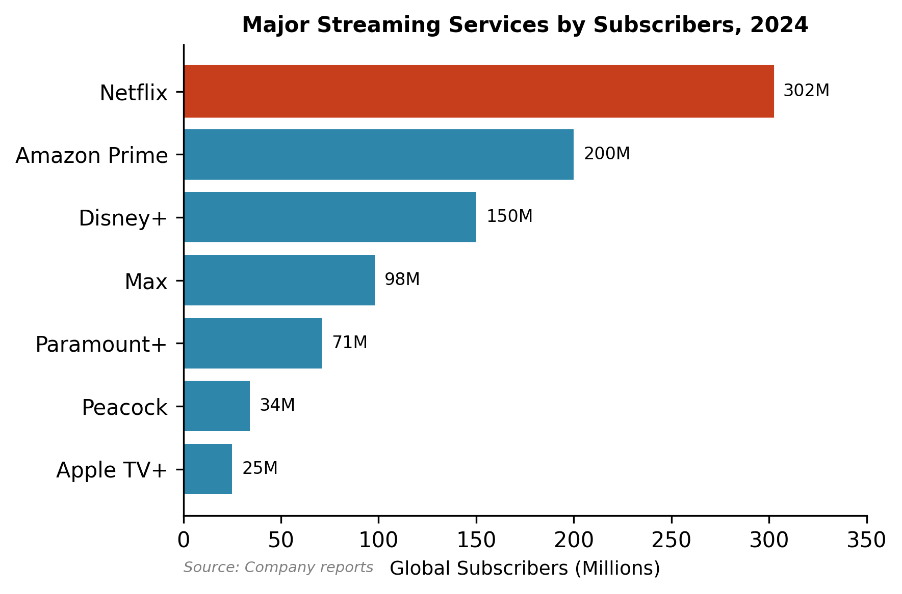
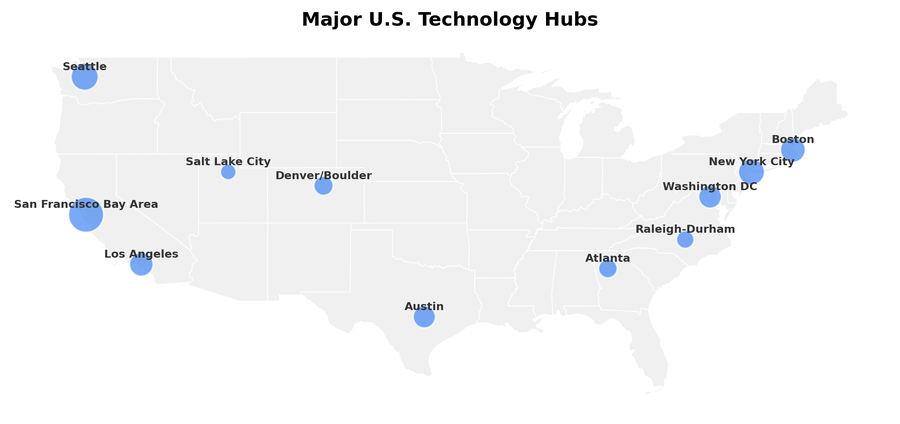

# Chapter 11: Information, Technology, and Media

The information sector occupies a peculiar position in the American economy: relatively small in employment but enormous in market capitalization, geographically concentrated yet ubiquitous in daily life, and governed by regulatory frameworks designed for technologies that no longer exist. This chapter examines the economic structure of technology, telecommunications, and media—industries that have reshaped how Americans work, shop, communicate, and consume entertainment.

## Overview: Size and Scope

The Bureau of Economic Analysis classifies the information sector as NAICS 51, encompassing publishing, motion pictures, broadcasting, telecommunications, and data processing. By this narrow definition, the sector contributes roughly $1.8 trillion to GDP—about 6% of the total economy—and employs approximately 3 million workers. But these official statistics dramatically understate the sector's economic footprint. Amazon, classified as retail, derives growing revenue from cloud computing. Financial services firms employ armies of software engineers. The "tech sector" as commonly understood sprawls across multiple NAICS codes.

A more revealing metric is market capitalization. As of late 2024, the five largest American companies by market value were all technology firms: Apple ($3.0 trillion), Microsoft ($2.8 trillion), Alphabet ($1.8 trillion), Amazon ($1.6 trillion), and Meta ($900 billion). Together, these five companies—sometimes called "Big Tech" or the "Magnificent Seven" (adding Nvidia and Tesla)—account for roughly 25% of the S&P 500's total value. No other sector comes close to this concentration of market power in so few hands.

*Figure 11.1: Big Tech market capitalization, 2024. Apple, Microsoft, and the rest of the "Magnificent Seven" account for roughly 25% of S&P 500 market value. Source: Company data*

The information sector's economic significance lies not just in its direct output but in its role as infrastructure for everything else. Cloud computing powers businesses from startups to Fortune 500 firms. Digital advertising enables the "free" internet. Telecommunications networks carry commerce, entertainment, and increasingly, work itself. Understanding this sector requires examining several distinct but interconnected industries.

## How the Industry Works: Business Models

### The Advertising Model

The dominant business model of the consumer internet is advertising. Google and Meta (Facebook, Instagram) together capture roughly 50% of all digital advertising spending in the United States—over $150 billion annually. This advertising is qualitatively different from traditional media advertising: it is targeted based on user data, sold through automated auctions that occur in milliseconds, and measured with precision impossible in print or broadcast.

Google's search advertising works on a pay-per-click model: advertisers bid on keywords, and Google charges only when users click. The average cost per click varies enormously by industry—legal services and insurance keywords can cost $50 or more, while less competitive terms cost pennies. Google's search advertising revenue exceeded $175 billion in 2023.

Meta's advertising model relies on the detailed user data collected through Facebook and Instagram. Advertisers can target users by demographics, interests, behaviors, and "lookalike audiences" similar to existing customers. Meta generated $132 billion in advertising revenue in 2023, virtually all of its total revenue.

*Figure 11.2: Digital advertising revenue by platform. Google and Meta together capture roughly 50% of the $300+ billion market. Source: eMarketer (2023)*

Amazon has emerged as the third major digital advertising platform, generating over $45 billion from ads displayed in search results and product pages. Unlike Google and Meta, Amazon's advertising appears at the point of purchase, making it especially valuable for consumer products.

### The Subscription Model

Streaming video represents the clearest example of subscription-based media. Netflix pioneered the model, disrupting both traditional television and the DVD rental business. By late 2024, the streaming landscape had consolidated into several major players:

- **Netflix**: 302 million global subscribers, the clear leader
- **Amazon Prime Video**: roughly 230 million (bundled with Prime membership)
- **Disney+**: 125 million (excluding Hotstar in India)
- **Max** (HBO): 117 million
- **Paramount+**: 78 million
- **Peacock**: 36 million

*Figure 11.3: Streaming video subscribers by service. Netflix leads globally, but Amazon Prime Video's bundle gives it comparable reach. Source: Company data (2024)*

The economics of streaming remain challenging. Content costs are enormous—Netflix spent over $17 billion on content in 2023—and subscriber growth in mature markets has slowed. The initial promise of streaming was "cord-cutting": consumers would save money by dropping cable. Instead, many households now subscribe to multiple services, collectively approaching or exceeding cable costs. The streaming services have responded by cracking down on password sharing, introducing ad-supported tiers, and raising prices.

Music streaming follows a similar model. Spotify dominates with roughly 600 million users (250 million paying subscribers), followed by Apple Music and Amazon Music. The economics favor the platforms over artists: Spotify pays roughly $0.003-0.005 per stream, meaning a song needs millions of plays to generate meaningful revenue.

### The Hardware Ecosystem Model

Apple's business model combines hardware sales with an ecosystem of services that lock in customers. The iPhone generates roughly half of Apple's $383 billion in annual revenue, but the services segment—App Store commissions, Apple Music, iCloud storage, Apple TV+—has grown to over $85 billion and carries much higher profit margins.

The App Store's 30% commission on digital purchases (15% for small developers) has drawn antitrust scrutiny. Epic Games challenged this "Apple tax" in court, arguing it constituted anticompetitive behavior. While Epic lost the central monopoly claim, Apple was required to allow developers to direct users to external payment systems—a small but significant crack in the walled garden.

### The Cloud Infrastructure Model

Cloud computing represents the most important technological shift in enterprise IT since the personal computer. Rather than maintaining their own data centers, businesses rent computing power, storage, and services from cloud providers. The market is dominated by three players:

- **Amazon Web Services (AWS)**: roughly 32% market share, roughly $90 billion annual revenue
- **Microsoft Azure**: roughly 23% market share
- **Google Cloud Platform**: roughly 10% market share

Cloud computing is capital-intensive—data centers cost billions to build—but generates recurring revenue with high margins once established. AWS, initially an internal project to improve Amazon's retail operations, now generates the majority of Amazon's operating profit despite representing a smaller share of revenue.

### The Telecommunications Model

Telecommunications remains a capital-intensive network business. Wireless carriers invest tens of billions annually in spectrum licenses, cell towers, and network equipment. The business model is straightforward: charge monthly fees for voice, data, and increasingly, bundled services like streaming video.

*Figure 11.4: Wireless carrier market share. T-Mobile narrowly leads after its Sprint acquisition. Source: Company data (2024)*

The wireless industry has consolidated to three national carriers: AT&T, Verizon, and T-Mobile (which acquired Sprint in 2020). T-Mobile's aggressive pricing and network investment have made it the market share leader at 35%, narrowly ahead of Verizon (34%) and AT&T (27%).

Wireline broadband is dominated by cable companies exploiting their existing infrastructure. Comcast (32 million subscribers) and Charter/Spectrum (31 million) together control more than half the market. AT&T and Verizon have largely retreated from DSL in favor of fiber, which offers faster speeds but requires expensive buildout. AT&T's fiber network has grown to 8.3 million subscribers, concentrated in urban and suburban areas where the economics are favorable.

## Industry Structure: The Giants and the Rest

### Big Tech

The technology industry exhibits extreme concentration at the top. Five companies—Alphabet (Google), Amazon, Apple, Meta, and Microsoft—dominate their respective markets and increasingly compete with each other across market boundaries.

**Alphabet/Google** ($307 billion revenue, 190,000 employees) controls approximately 90% of the global search market, a position the Department of Justice found to be an illegal monopoly in August 2024. Google achieved this dominance partly through product quality but also through billions in payments to be the default search engine on Apple devices and web browsers—payments that effectively foreclosed competition. Google also dominates online video (YouTube), mobile operating systems (Android, 70% global market share), web browsers (Chrome, 65%), and digital maps. The remedies phase of the antitrust case may require structural changes to this interconnected empire.

**Apple** ($383 billion revenue, 161,000 employees) is the world's most valuable company, built on the iPhone's success and the ecosystem surrounding it. Apple's profit margins are exceptionally high for a hardware company because the company captures value across the entire stack: designing its own chips, controlling the operating system, and taking commissions on software sales. The App Store generated an estimated $85 billion in gross revenue in 2023, with Apple keeping $25-30 billion after its 15-30% commission.

**Amazon** ($575 billion revenue, 1.5 million employees) straddles multiple industries. Its e-commerce marketplace hosts over 60% of its retail sales from third-party sellers, from whom Amazon collects fees averaging 15-20% of sale price plus fulfillment fees. The FTC's ongoing antitrust case alleges Amazon uses its dual role as platform and retailer to self-preference its own products and extract excessive fees. AWS remains Amazon's profit engine, generating over $20 billion in annual operating income.

**Microsoft** ($228 billion revenue, 221,000 employees) has reinvented itself from a Windows/Office company to a cloud-first enterprise. Azure's growth has driven Microsoft's stock price from $40 in 2014 to over $400 by 2024. Microsoft's $13 billion investment in OpenAI positioned it at the center of the generative AI boom, integrating AI capabilities into Office, Bing search, and Azure services.

**Meta** ($135 billion revenue, 67,000 employees) is the smallest of Big Tech by revenue but dominates social media with Facebook (3 billion monthly users), Instagram (2 billion), WhatsApp (2 billion), and Messenger. Meta's advertising business remains highly profitable despite Apple's iOS privacy changes, which initially disrupted targeting capabilities. The company's $10+ billion annual investment in "Reality Labs"—virtual and augmented reality—has yet to generate significant revenue. The FTC's attempt to force divestiture of Instagram and WhatsApp failed in November 2025, with the court finding insufficient evidence of monopoly power.

### Telecommunications

The wireless industry's consolidation has created a stable oligopoly. The T-Mobile/Sprint merger in 2020, approved over DOJ objections, reduced national carriers from four to three. Competition has not collapsed—T-Mobile's aggressive network investment and pricing forced responses from AT&T and Verizon—but the industry's pricing power has increased.

**AT&T** (headquartered in Dallas) is the largest telecommunications company by revenue, combining wireless service, fiber broadband, and business services. AT&T's ill-fated acquisition of Time Warner in 2018 was reversed in 2022 when it spun off WarnerMedia to merge with Discovery, taking a massive loss and refocusing on its core telecommunications business.

**Verizon** (headquartered in New York) has historically positioned itself as the premium wireless carrier, though T-Mobile's 5G investment has challenged this positioning. Verizon's fiber-to-the-home service, Fios, serves 7 million subscribers in the Northeast.

**T-Mobile** (headquartered in Bellevue, Washington) emerged from its Sprint acquisition as the industry's growth leader, using spectrum assets acquired from Sprint to build out 5G faster than competitors. T-Mobile's customer growth has come partly from price-conscious consumers and partly from rural areas where its network has improved.

**Comcast** (headquartered in Philadelphia) is the largest cable company and broadband provider. Beyond connectivity, Comcast owns NBCUniversal (broadcast and cable television, film studio, theme parks) and streams content through Peacock. Comcast's broadband business benefits from limited competition—in many markets, cable is the only high-speed option.

### Media and Entertainment

Legacy media has undergone wrenching consolidation as streaming disrupted traditional business models.

**The Walt Disney Company** owns ABC, ESPN, the Disney Channel, Pixar, Marvel, Lucasfilm, and 20th Century Studios, plus theme parks and cruise lines. Disney+ launched in 2019 and grew quickly but has struggled to reach profitability. Disney's streaming losses exceeded $4 billion before cost-cutting measures began showing improvement in 2024.

**Warner Bros. Discovery** was created from the 2022 merger of WarnerMedia (spun off from AT&T) and Discovery. The combined company owns HBO, CNN, Warner Bros. film studio, and cable channels including Discovery, HGTV, and Food Network. The merger has been troubled: massive debt, write-downs, and content cost-cutting have damaged morale and quality.

**Paramount Global** (formerly ViacomCBS) owns CBS, Paramount Pictures, MTV, Nickelodeon, and the streaming service Paramount+. The company has explored mergers and sales as it struggles to compete at scale with larger rivals.

**NBCUniversal** (owned by Comcast) includes NBC broadcast, cable channels (USA, Bravo, MSNBC), Universal Pictures, and theme parks. Peacock streaming has lagged competitors despite carrying valuable content.

**Netflix** stands alone as a pure-play streaming company, having successfully transitioned from DVD-by-mail to streaming dominance. Netflix's content strategy emphasizes volume and global appeal—it produces content in dozens of countries—over the prestige programming that defined early streaming. After subscriber declines in early 2022 sparked fears of market saturation, Netflix rebounded through password-sharing crackdowns and ad-supported tiers.

### Music

The recorded music industry is dominated by three major labels:

- **Universal Music Group** (French-owned, publicly traded): roughly 32% market share
- **Sony Music Entertainment** (Japanese-owned): roughly 22%
- **Warner Music Group**: roughly 16%

Together, the majors control roughly 70% of the recorded music market. Independent labels and artists have gained share through streaming, which removed the physical distribution barriers that once advantaged majors. But the majors retain power through extensive back catalogs, artist development infrastructure, and radio/playlist promotion capabilities.

Streaming has transformed music economics. Industry revenue, which collapsed from $14 billion in 1999 to $7 billion in 2014, has recovered to approximately $17 billion. But revenue flows primarily to platforms (Spotify, Apple Music) and catalog holders (often the labels, not artists themselves). A hit song might generate millions of streams but only thousands of dollars for the performer.

### Newspapers and Local Media

The newspaper industry has experienced one of the most dramatic declines in American business history. Employment fell from 455,000 in 1990 to under 100,000 today. Daily newspaper circulation has declined from 62 million in 1990 to under 20 million. The Los Angeles Times, which once employed 1,200 journalists, now has fewer than 300.

The business model collapse was sudden and severe. Classified advertising—newspapers' most profitable segment—migrated to Craigslist, then to specialized sites like Indeed (jobs) and Zillow (real estate). Display advertising followed readers to digital platforms, where Google and Facebook captured the growth.

Local television news has proven more resilient than print, benefiting from retransmission fees paid by cable companies and continued advertiser interest in reaching local audiences. But ownership has consolidated into a handful of station groups—Sinclair, Nexstar, Gray Television—that have cut staff and centralized operations.

The "local news crisis" has created information deserts in many communities. Counties without local newspapers—"news deserts"—have lower voter turnout, less government accountability, and higher municipal borrowing costs. Nonprofit and philanthropic models have emerged (The Texas Tribune, Baltimore Banner) but have not achieved scale sufficient to replace the old advertising-supported model.

## Geographic Distribution

The technology industry is extraordinarily concentrated geographically. Five metropolitan areas—San Francisco-San Jose, Seattle, New York, Boston, and Austin—account for roughly half of all software development employment.

*Figure 11.5: Major technology employment hubs. Silicon Valley dominates, but Seattle, Austin, and Boston have grown as secondary centers. Source: BLS QCEW*

**Silicon Valley** (San Jose-San Francisco metropolitan area) remains the undisputed center of the technology industry despite decades of predictions about its decline. The region hosts the headquarters of Alphabet, Apple, Meta, and thousands of smaller companies. Stanford University and UC Berkeley provide both research and talent pipelines. Venture capital is heavily concentrated: Sand Hill Road in Menlo Park hosts the largest concentration of VC firms in the world. The region's dysfunction—housing costs that make $200,000 salaries feel inadequate, traffic congestion, homelessness—has not displaced its network effects.

**Seattle** hosts the headquarters of Amazon and Microsoft, plus major engineering offices for Google, Meta, and others. The region's slightly lower cost of living (relative to the Bay Area) and strong engineering culture at the University of Washington have attracted talent. Seattle's tech employment has grown faster than Silicon Valley's in recent years.

**New York City** is the center of media, advertising, and financial technology. While lacking the density of pure technology companies found in Silicon Valley or Seattle, New York hosts engineering offices for most major tech firms plus a vibrant startup scene. The city's traditional media companies—news organizations, publishing houses, advertising agencies—have become technology companies whether they admit it or not.

**Austin** has emerged as a technology hub through deliberate strategy. Texas's lack of state income tax, lower housing costs, and business-friendly regulation attracted companies including Dell (headquartered in nearby Round Rock), Tesla (relocated from California), and Oracle (relocated from California). Austin's tech scene retains a more relaxed culture than Silicon Valley, though growth has strained housing and infrastructure.

**Boston/Cambridge** combines world-class research universities (MIT, Harvard) with strength in biotechnology and enterprise software. The Route 128 corridor was actually Silicon Valley's original competitor in the 1970s and 1980s before losing the personal computer wars.

Telecommunications geography differs from pure technology. AT&T is headquartered in Dallas, having relocated from San Antonio in 2008. Verizon is headquartered in New York City. T-Mobile is headquartered in Bellevue, Washington (a Seattle suburb), a legacy of its German parent company's acquisition of a Pacific Northwest wireless carrier. Comcast's Philadelphia headquarters reflects its founding as a local cable system.

Media remains bicoastal. Film and television production is centered in Los Angeles, though tax incentives have dispersed some production to Georgia, New York, and other states. Television news operations cluster in New York City. The music industry's major labels are headquartered in New York and Los Angeles, though Nashville dominates country music.

## The Workforce

Technology companies employ approximately 3 million workers directly, with millions more in technology roles at non-technology companies. The sector's workforce characteristics differ markedly from other industries.

**Compensation**: Technology workers earn far more than the national average. Software engineer salaries at major technology companies routinely exceed $200,000, with senior engineers at Google or Meta earning $500,000 or more including equity. This compensation reflects both genuine skill scarcity and the industry's profit margins. Technology companies can afford to pay more because their businesses require relatively little labor per dollar of revenue.

**Immigration**: The technology industry relies heavily on immigrant labor, particularly through the H-1B visa program. Indian-born workers constitute roughly 70% of H-1B recipients, with technology companies as the largest sponsors. Critics argue H-1B suppresses wages for American workers; supporters argue it addresses genuine talent shortages. The debate continues even as technology companies have embraced remote work, which theoretically expands the domestic talent pool.

**Contractors and gig workers**: Beyond highly paid employees, technology companies employ large numbers of contractors, temporary workers, and gig workers. Amazon's warehouse workforce—1.5 million globally—earns far less than software engineers. Uber and Lyft drivers are classified as independent contractors, not employees, a distinction that has survived legal challenges in most states. The contrast between highly paid software engineers and precarious gig workers reflects the industry's bimodal labor market.

**Layoffs**: The technology industry experienced significant layoffs in 2022-2023 as pandemic-era hiring proved excessive. Amazon, Meta, Google, and Microsoft each cut over 10,000 employees. The layoffs, while painful for those affected, represented a small fraction of each company's workforce and were followed by resumed hiring, particularly for AI-related roles.

**Media employment decline**: The media sector has experienced sustained employment losses. Newspaper employment has fallen by over 75% since 2000. Magazine employment has declined nearly as sharply. Television news has maintained employment better but has consolidated into fewer owners with less local coverage. The workers displaced from media have not generally found equivalent employment elsewhere—journalism skills do not translate easily to technology jobs.

## Regulation and Policy

The regulatory framework for technology and telecommunications remains incomplete and contested. Agencies designed for twentieth-century industries struggle to address twenty-first-century business models.

### Federal Communications Commission

The FCC regulates communications by wire and radio, which historically meant telephone service and broadcasting. The agency allocates spectrum licenses, sets technical standards, enforces ownership limits on broadcast stations, and regulates common carriers.

The FCC's role in internet regulation has fluctuated with political leadership. Under the Obama administration, the FCC classified broadband providers as common carriers subject to net neutrality rules—requiring them to treat all internet traffic equally. The Trump administration's FCC reversed this classification, eliminating federal net neutrality rules. Biden's FCC has attempted to restore net neutrality, though implementation remains contested.

Spectrum allocation represents the FCC's most consequential and least visible function. The electromagnetic spectrum is a finite public resource: only so many radio frequencies exist, and interference occurs when too many users occupy the same band. The FCC conducts auctions for commercial spectrum licenses, raising tens of billions of dollars for the Treasury while allocating valuable resources. The shift from administrative allocation to auctions—championed by economists including Paul Milgrom, who won the 2020 Nobel Prize partly for this work—represented a rare triumph of economic policy design.

### Section 230

Section 230 of the Communications Decency Act (1996) provides that "No provider or user of an interactive computer service shall be treated as the publisher or speaker of any information provided by another information content provider." This twenty-six-word provision enables the modern internet. Without it, platforms could be sued for user-generated content, making social media, search engines, and review sites legally untenable.

Section 230 faces criticism from both political directions. Conservatives argue platforms use their moderation authority to suppress right-wing viewpoints; progressives argue platforms fail to moderate harmful content aggressively enough. Various reform proposals have emerged—limiting immunity for algorithmic amplification, requiring platforms to follow stated policies, creating transparency requirements—but no legislation has passed.

### Antitrust Enforcement

The most significant regulatory action against technology companies has come through antitrust enforcement. The Department of Justice and Federal Trade Commission have brought major cases against all of the Big Tech companies:

- **Google**: The DOJ's case against Google for search monopoly maintenance resulted in a liability finding in August 2024. Judge Amit Mehta found that Google's payments to Apple and others to be the default search engine illegally foreclosed competition. The remedies phase will determine whether Google must change its business practices or face structural remedies (such as divesting Chrome or Android).

- **Apple**: The Epic Games case challenged Apple's App Store practices. While Apple won on the core monopoly question, it must allow developers to direct users to alternative payment methods. The DOJ has filed a separate antitrust case against Apple, still in early litigation stages.

- **Amazon**: The FTC's case against Amazon alleges the company uses its marketplace dominance to disadvantage third-party sellers while self-preferencing its own products. A trial is scheduled for October 2026.

- **Meta**: The FTC's attempt to unwind Meta's acquisitions of Instagram and WhatsApp failed in November 2025, with the court finding insufficient evidence that Meta possessed monopoly power in social networking.

### State Regulation

States have emerged as important technology regulators, particularly regarding privacy. California's Consumer Privacy Act (CCPA) and its successor, the California Privacy Rights Act (CPRA), create data privacy rights that effectively set national standards—companies find it simpler to comply nationwide than to offer different experiences by state.

Texas and Florida have enacted laws targeting social media moderation practices, requiring platforms to explain content removal decisions and limiting their ability to remove certain political content. These laws face constitutional challenges on First Amendment grounds.

## Trade Associations and Lobbying

Technology companies have become major political players, collectively spending over $100 million annually on federal lobbying.

**TechNet** represents large technology companies including Apple, Google, Meta, Amazon, and Microsoft on policy issues from immigration to taxation.

**The Computer and Communications Industry Association (CCIA)** advocates for technology companies on intellectual property, free trade, and internet policy. CCIA has been a strong defender of Section 230.

**The Information Technology Industry Council (ITI)** focuses on hardware and enterprise technology issues.

**BSA | The Software Alliance** represents enterprise software companies on intellectual property and trade issues.

Telecommunications lobbying is dominated by industry-specific groups:

**CTIA – The Wireless Association** represents wireless carriers and equipment manufacturers.

**USTelecom – The Broadband Association** represents wireline telecommunications providers.

**NCTA – The Internet & Television Association** represents cable companies.

Media lobbying groups include the **National Association of Broadcasters (NAB)**, the **Motion Picture Association (MPA)**, and the **Recording Industry Association of America (RIAA)**.

Technology lobbying has become controversial as public attitudes toward Big Tech have soured. Companies that once enjoyed bipartisan goodwill now face skepticism from both parties—Democrats concerned about market power and misinformation, Republicans concerned about perceived anti-conservative bias. Yet lobbying spending continues to grow as regulatory threats intensify.

## Recent Trends

### The AI Boom

Generative AI has transformed the technology landscape since ChatGPT's November 2022 launch. Every major technology company has rushed to develop or deploy large language models:

- **Microsoft** invested $13 billion in OpenAI and integrated GPT models into Office products, Bing search, and Azure cloud services.
- **Google** developed its Gemini family of models, competing with OpenAI while scrambling to defend its search monopoly.
- **Meta** released the open-source Llama models, betting on openness as a competitive strategy.
- **Amazon** invested $8 billion in Anthropic, the safety-focused AI lab founded by former OpenAI researchers.
- **Apple** has been notably slower to deploy consumer-facing AI, announcing "Apple Intelligence" features in 2024 that relied partly on external models.

The AI boom has concentrated capital and talent at the largest companies. Training frontier models requires hundreds of millions of dollars in computing costs, favoring companies with cloud infrastructure and deep pockets. Whether AI will ultimately disrupt Big Tech incumbents or entrench them remains unclear.

### Streaming Consolidation

The streaming wars have entered a mature phase characterized by consolidation, price increases, and profitability pressure. The era of easy subscriber growth has ended in developed markets. Services have responded by:

- **Password-sharing crackdowns**: Netflix led the industry in requiring separate payments for households sharing passwords, adding millions of paying subscribers.
- **Advertising tiers**: Every major streaming service now offers a lower-priced ad-supported option, reversing the initial promise of ad-free streaming.
- **Bundling**: Disney offers a bundle combining Disney+, Hulu, and ESPN+. Verizon and T-Mobile bundle streaming services with wireless plans. The industry is recreating cable's bundle economics in streaming form.
- **Content cuts**: Warner Bros. Discovery infamously removed completed content from Max to cut costs, while Disney reduced production volume at Marvel and other studios.

### The TikTok Question

TikTok, the short-video app owned by Chinese company ByteDance, has become both a cultural phenomenon and a national security concern. With over 170 million American users, TikTok has disrupted both social media (challenging Meta's Instagram) and entertainment (especially among younger users).

Congressional legislation in 2024 required ByteDance to divest TikTok's American operations or face a ban. As of early 2025, legal challenges continue while potential American buyers evaluate the asset. The TikTok situation exemplifies broader concerns about technology competition between the United States and China—and the difficulty of disentangling globally interconnected technology platforms.

### Local News Collapse

The collapse of local journalism has accelerated. Newspaper bankruptcies, hedge fund ownership, and advertising declines have gutted newsrooms across the country. Between 2020 and 2024:

- Over 130 newspapers closed entirely
- Thousands of journalists were laid off
- Many surviving papers became "ghost newspapers"—still publishing but with skeletal staffs incapable of meaningful accountability journalism

The consequences for democracy are significant. Research has documented that loss of local news correlates with lower voter turnout, less competitive local elections, and higher costs of municipal borrowing (as investors demand premiums for reduced transparency).

---

## Firm Profiles

### Alphabet/Google: The Advertising Machine

Alphabet, Google's parent company, is the world's largest advertising company—a description that still surprises people who think of Google as a search engine. Of Alphabet's $307 billion in 2023 revenue, approximately $238 billion (78%) came from advertising across Google Search, YouTube, and the Google Display Network.

Google Search operates the most profitable advertising platform ever created. When users search for commercial terms—"car insurance," "personal injury lawyer," "credit cards"—Google displays ads at the top of results and charges advertisers when users click. The average cost-per-click varies enormously: legal and financial terms often exceed $50, while less competitive terms cost pennies. Google's search advertising margin exceeds 50%.

YouTube, acquired for $1.65 billion in 2006 (regarded as overpriced at the time), has become the world's dominant video platform. YouTube generated over $30 billion in advertising revenue in 2023, plus substantial subscription revenue from YouTube Premium and YouTube TV. The platform has become essential infrastructure for creators, musicians, educators, and increasingly, traditional media companies that post content to reach YouTube's 2 billion monthly users.

Google Cloud, the third-largest cloud computing platform, generated $33 billion in 2023 revenue. While dwarfed by AWS and trailing Microsoft Azure, Google Cloud has become profitable and represents Alphabet's clearest growth opportunity outside advertising.

The August 2024 antitrust verdict found that Google illegally maintained its search monopoly through default agreements—paying Apple approximately $20 billion annually to be the default search engine on iPhones and Safari, and similar payments to browser makers and wireless carriers. The remedies phase will determine whether Google faces behavioral restrictions or structural requirements that could fundamentally alter its business model.

**Headquarters**: Mountain View, California
**Employees**: 190,000
**Key executives**: Sundar Pichai (CEO), Ruth Porat (CFO)

---

### AT&T: The Surviving Bell

AT&T's history encapsulates American telecommunications. The original AT&T was the Bell System monopoly, broken up by antitrust consent decree in 1984 into seven Regional Bell Operating Companies (RBOCs) plus a rump long-distance company. Through a series of mergers, the current AT&T is essentially one of those RBOCs (Southwestern Bell) that acquired the AT&T name and reassembled much of the former monopoly.

Today AT&T operates three primary businesses: wireless service, fiber broadband, and business telecommunications. The wireless segment generates approximately 70% of revenue, serving roughly 200 million subscribers (including wholesale and prepaid). AT&T has invested heavily in 5G deployment, though its network coverage trails T-Mobile in independent assessments.

AT&T's strategic missteps illustrate the difficulty of media-telecommunications convergence. The company acquired DirecTV in 2015 for $49 billion, then watched satellite television subscribers evaporate. It acquired Time Warner in 2018 for $85 billion, creating an entertainment conglomerate—then spun off WarnerMedia in 2022 to merge with Discovery, essentially admitting defeat. AT&T took a $24 billion loss on the transaction and refocused on telecommunications.

The company has also dealt with legacy issues: lead-sheathed cables, particularly in the Northeast, have required remediation. A February 2024 network outage affected millions of customers and drew FCC scrutiny. AT&T's stock price has significantly underperformed the market over the past decade.

**Headquarters**: Dallas, Texas
**Employees**: 160,000
**Key executives**: John Stankey (CEO)

---

### Netflix: Streaming Pioneer

Netflix invented streaming video as a mass medium, then had to reinvent itself when competitors arrived. The company's strategic evolution—from DVD-by-mail to streaming aggregator to content studio to advertising platform—illustrates the technology industry's relentless pace of change.

Reed Hastings founded Netflix in 1997 as a DVD-by-mail service, undercutting Blockbuster's late fees and limited selection. The streaming service launched in 2007, initially offering a limited library of licensed content. As licensing costs rose and studios began withholding content for their own streaming services, Netflix pivoted to original content. *House of Cards* (2013) demonstrated that streaming-first series could achieve prestige television quality.

By 2024, Netflix had become the world's largest entertainment company by subscriber count, with 302 million paying subscribers globally. The company produces content on every continent, releasing local-language programming alongside global blockbusters. Netflix's content spending exceeded $17 billion in 2023, more than any traditional studio.

Netflix's 2022 subscriber decline—its first ever—prompted strategic recalibration. The company cracked down on password sharing, requiring additional payments for households outside the account holder's home. It launched an advertising-supported tier at $6.99 monthly, reversing its longstanding opposition to ads. Both initiatives succeeded: Netflix added tens of millions of subscribers through 2023-2024.

The company's challenges remain significant. Content costs continue rising. Competition from Disney+, Max, Amazon, and Apple TV+ has fragmented the market. Netflix carries no significant debt but generates modest free cash flow relative to its market capitalization. Yet no competitor has matched Netflix's global scale or algorithmic recommendation sophistication.

**Headquarters**: Los Gatos, California (Silicon Valley)
**Employees**: 13,000
**Key executives**: Ted Sarandos and Greg Peters (co-CEOs), succeeding Reed Hastings

---

## Data Sources and Further Reading

### Government Sources
- Bureau of Economic Analysis, GDP by Industry
- Bureau of Labor Statistics, Quarterly Census of Employment and Wages
- Federal Communications Commission, Communications Marketplace Report
- Securities and Exchange Commission, Company filings (10-K, 10-Q)

### Industry Data
- eMarketer/Insider Intelligence, Digital advertising forecasts
- Synergy Research Group, Cloud infrastructure market share
- Leichtman Research Group, Broadband subscriber data
- Ampere Analysis, Streaming subscriber estimates

### Academic Sources
- Rochet, Jean-Charles, and Jean Tirole. "Platform Competition in Two-Sided Markets." *Journal of the European Economic Association* 1, no. 4 (2003): 990-1029.
- Evans, David S., and Richard Schmalensee. "The Industrial Organization of Markets with Two-Sided Platforms." *Competition Policy International* 3, no. 1 (2007).
- Milgrom, Paul. "What the Seller Won't Tell You: Persuasion and Disclosure in Markets." *Journal of Economic Perspectives* 22, no. 2 (2008): 115-131.

### Books
- Wu, Tim. *The Attention Merchants: The Epic Scramble to Get Inside Our Heads*. New York: Knopf, 2016.
- Galloway, Scott. *The Four: The Hidden DNA of Amazon, Apple, Facebook, and Google*. New York: Portfolio, 2017.
- Srnicek, Nick. *Platform Capitalism*. Cambridge: Polity Press, 2017.
- Zuboff, Shoshana. *The Age of Surveillance Capitalism*. New York: PublicAffairs, 2019.

### Legal Documents
- United States v. Google LLC, Case No. 1:20-cv-03010 (D.D.C. 2024).
- Epic Games, Inc. v. Apple Inc., Case No. 4:20-cv-05640 (N.D. Cal. 2021).
- Federal Trade Commission v. Amazon.com, Inc., Case No. 2:23-cv-01495 (W.D. Wash. 2023).
