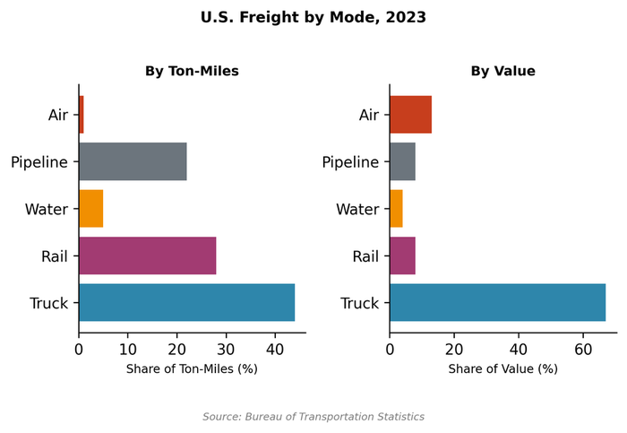
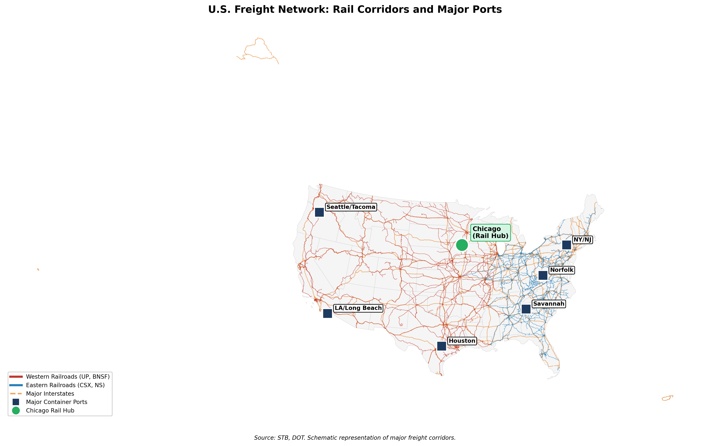
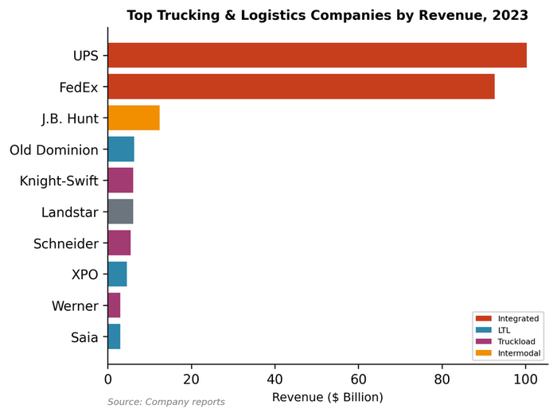
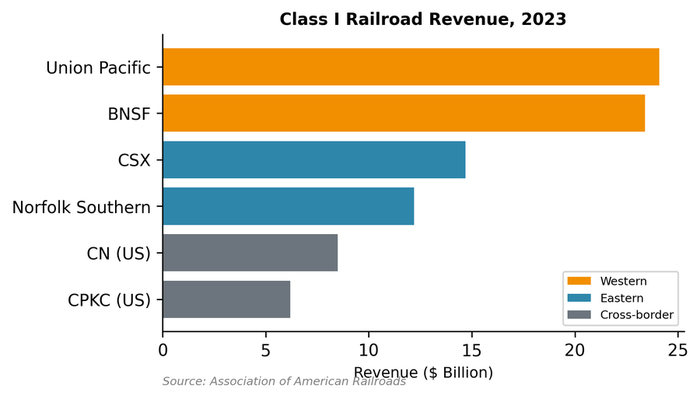
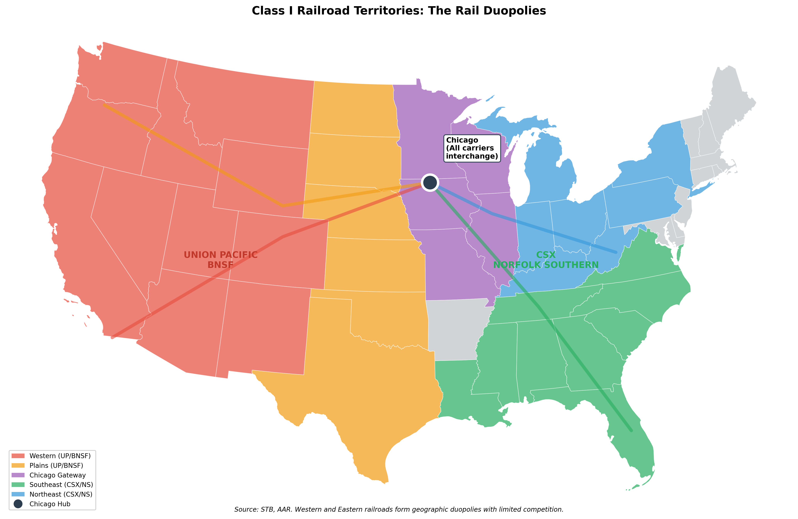
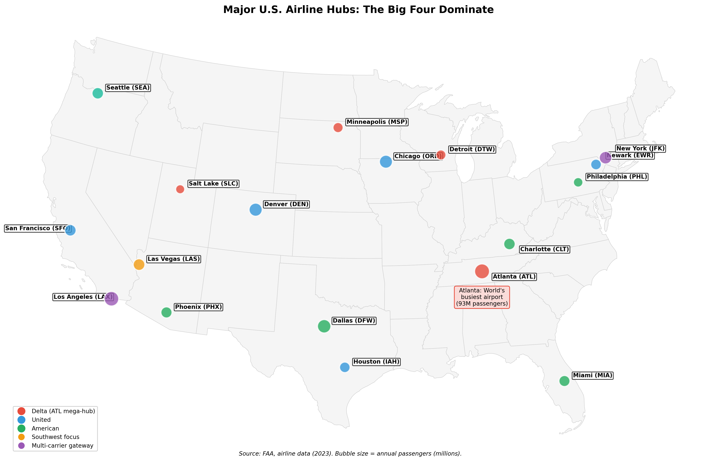
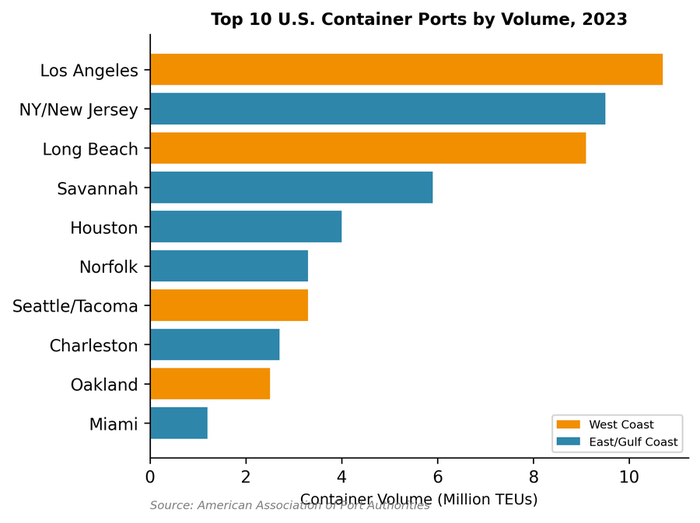
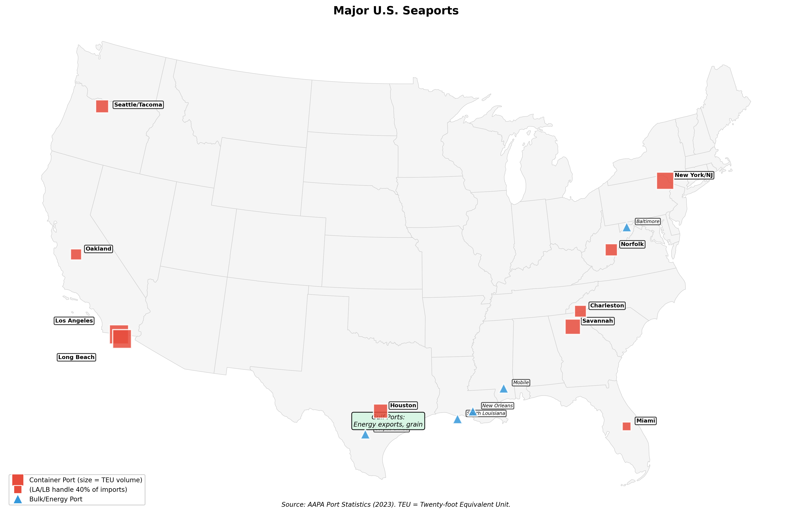
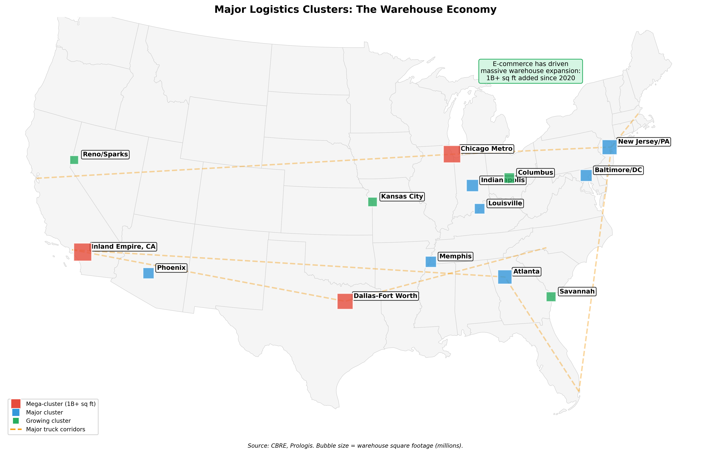

# 12. Transportation and Logistics

Every time you order something online and it arrives the next day, you're witnessing the culmination of a half-century revolution in American freight. The trucks, trains, planes, and ships that move goods across the country represent not just infrastructure but a complex industrial ecosystem that employs 6.5 million Americans and contributes nearly a trillion dollars to GDP. What makes American transportation remarkable isn't any single mode but how they interconnect: a container loaded in Shanghai can travel by ship to Long Beach, by rail to Chicago, and by truck to a warehouse in Ohio, with each handoff choreographed by logistics software that didn't exist a generation ago.

## Overview

**Size and Scope**
- GDP contribution: $935 billion (Transportation and Warehousing, NAICS 48-49)
- Broader economic footprint: roughly $1.8 trillion including private trucking fleets
- Employment: 6.58 million workers
- Freight moved: roughly 20 billion tons annually

The transportation sector is fundamentally shaped by two forces: geography and deregulation. American distances are vast---it's 2,800 miles from Los Angeles to New York, creating natural demand for long-haul freight that doesn't exist in smaller countries. And the regulatory reforms of 1978-1980, which deregulated airlines, trucking, and railroads in rapid succession, unleashed productivity gains that transformed how goods move.

<figure>

<figcaption>Figure 12.1: U.S. freight by mode (ton-miles). Trucking dominates for flexibility; rail excels at bulk and long-haul. Source: BTS (2023)</figcaption>
</figure>

The modal split reveals the logic of American freight. Trucking dominates, handling 44% of ton-miles and an even larger share by value, because trucks offer door-to-door flexibility that no other mode can match. Rail moves 19% of ton-miles but specializes in bulk commodities---coal, grain, chemicals, intermodal containers---where its cost advantage on long hauls is decisive. Air freight is negligible by weight (less than 1% of ton-miles) but moves high-value, time-sensitive goods: electronics, pharmaceuticals, e-commerce orders. Pipelines quietly move petroleum and natural gas, while ships handle international trade and some domestic bulk cargo.

## How the Industry Works

### The Freight Economy

Transportation is a derived demand---goods move because someone wants them somewhere else. This makes the sector acutely cyclical, rising and falling with economic activity. The 2021-2022 pandemic boom and subsequent 2023 softening illustrated this vividly: when consumers shifted spending to goods, freight rates soared; when inventory normalized, rates collapsed.

The business model varies dramatically by mode. Trucking is highly competitive with thin margins (5-10% operating margins for most carriers), because entry barriers are low---you can start a trucking company with one truck and a commercial driver's license. Rail is a capital-intensive oligopoly with high fixed costs but strong pricing power on routes where they face no competition. Airlines operate in a consolidated market where the Big Four can manage capacity to maintain yields. Logistics companies increasingly don't own trucks or planes at all---they're information businesses that match shippers with capacity.

### The Intermodal Revolution

The most important innovation in freight isn't a vehicle---it's the shipping container. Before containerization, loading a ship took weeks of manual labor; now it takes hours. The standardized container (20 or 40 feet long) can move from ship to rail to truck without unpacking, slashing handling costs and enabling global supply chains.

Intermodal freight---containers that move by multiple modes---has grown from a curiosity to a major segment. J.B. Hunt built a business model around trucking containers to and from rail yards, combining the line-haul efficiency of rail with the flexibility of trucks at each end. The economics work when the rail haul exceeds about 500 miles; below that, trucks are faster and cheaper door-to-door.

<figure>

<figcaption>Figure 12.2: The U.S. freight skeleton. Major rail corridors (Class I railroads), interstate highways, and container ports form the physical infrastructure of American commerce. Chicago serves as the critical hub where eastern and western rail networks meet. Source: STB, DOT</figcaption>
</figure>

## Trucking: The Dominant Mode

Trucking moves America. With over 900,000 registered motor carriers and 1.5 million drivers, trucking is both the largest freight mode and one of the most fragmented industries in the economy. A Walmart store might receive deliveries from dozens of different trucking companies in a single day.

### Industry Structure

The trucking industry divides into distinct segments:

**Truckload (TL):** Full trailers moving directly from shipper to consignee. Knight-Swift, Werner, and Schneider are major players, but even the largest TL carriers have single-digit market share in this fragmented market.

**Less-than-Truckload (LTL):** Consolidated shipments from multiple shippers sharing trailer space through hub-and-spoke networks. LTL is more concentrated because the network economics create barriers to entry. Old Dominion, XPO, and Saia dominate, with the top ten carriers controlling about 75% of the market.

**Private Fleets:** Many large companies---Walmart, PepsiCo, Sysco---operate their own trucks. Private fleets represent roughly 50% of all trucking activity by some measures, though they don't appear in for-hire trucking statistics.

**Owner-Operators:** Independent truckers who own their rigs and either lease to carriers or operate under their own authority. Owner-operators make up 11-16% of the driver workforce and represent the entrepreneurial dream of trucking---and its economic precarity.

| Rank | Company | 2023 Revenue | Segment |
|------|---------|--------------|---------|
| 1 | UPS | $100.3B | Integrated |
| 2 | FedEx | $92.6B | Integrated |
| 3 | J.B. Hunt | $12.4B | Intermodal/TL |
| 4 | Old Dominion | $6.3B | LTL |
| 5 | Knight-Swift | $6.1B | Truckload |
| 6 | XPO | $4.6B | LTL/Brokerage |
| 7 | Schneider | $5.5B | TL/Intermodal |
| 8 | Werner | $3.0B | Truckload |

<figure>

<figcaption>Figure 12.3: Top trucking companies by revenue. UPS and FedEx dominate through their integrated parcel networks. Source: Company data (2023)</figcaption>
</figure>

### The Driver Shortage

The trucking industry has complained about driver shortages for decades. The American Trucking Associations estimates the current shortage at around 60,000 drivers, down from a peak of 80,000 during the pandemic freight boom but still significant. The shortage is concentrated in long-haul trucking, where drivers may spend weeks away from home.

Why can't the industry attract more drivers? The answer is mostly economics. Long-haul trucking offers median pay around $50,000-60,000 for grueling work: irregular schedules, nights in truck stops, health problems from sedentary hours behind the wheel. As the labor market has tightened and competing jobs have become more attractive, trucking struggles to recruit and retain drivers.

The industry's response has been a mix of higher pay (especially signing bonuses during tight markets), improved working conditions, and technology investments. Some carriers have shifted toward regional and local routes that get drivers home more frequently. The long-term solution may be autonomous trucks---but that technology remains further away than its boosters claim.

## Freight Rail: The Duopoly

American freight rail is a remarkable success story hidden in plain sight. After decades of decline, the railroad industry was deregulated by the Staggers Act of 1980, allowing railroads to set market-based rates and abandon unprofitable lines. The result: an industry that went from bankruptcy's edge to consistent profitability, with productivity that roughly tripled over four decades.

### The Class I Railroads

Only seven "Class I" railroads (those with over $500 million in annual revenue) remain after decades of consolidation. The structure is a geographic duopoly:

**Western Duopoly:**
- **Union Pacific:** The larger of the two western carriers, operating 32,000 route miles across 23 states west of the Mississippi
- **BNSF Railway:** Owned by Berkshire Hathaway since 2010, operating 32,500 route miles with particular strength in intermodal and coal

**Eastern Duopoly:**
- **CSX:** Operating 20,000 route miles primarily east of the Mississippi
- **Norfolk Southern:** Operating 19,500 route miles with a strong intermodal network

| Railroad | 2023 Revenue | Owner | Geography |
|----------|--------------|-------|-----------|
| Union Pacific | $24.1B | Public | Western US |
| BNSF | $23.4B | Berkshire Hathaway | Western US |
| CSX | $14.7B | Public | Eastern US |
| Norfolk Southern | $12.2B | Public | Eastern US |

*Source: Association of American Railroads, 2024*

<figure>

<figcaption>Figure 12.4: Class I railroad revenue. Union Pacific and BNSF (Berkshire) dominate the West; CSX and Norfolk Southern split the East. Source: AAR (2023)</figcaption>
</figure>

<figure>

<figcaption>Figure 12.5: Class I railroad territories. The western duopoly (Union Pacific, BNSF) and eastern duopoly (CSX, Norfolk Southern) divide the country roughly at the Mississippi River. Chicago serves as the critical interchange point. Source: STB (2023)</figcaption>
</figure>

The Canadian carriers (Canadian National and Canadian Pacific Kansas City) also operate extensively in the US, and Kansas City Southern (now part of CPKC) provides the main rail link to Mexico.

### Precision Scheduled Railroading

The railroads' profitability has come partly from a controversial operational philosophy called Precision Scheduled Railroading (PSR). Pioneered by the late Hunter Harrison at Illinois Central and later Canadian National, PSR emphasizes running trains on fixed schedules (like a bus route) rather than waiting for cars to accumulate, reducing locomotive and crew needs, and cutting costs relentlessly.

PSR has delivered stunning financial results---operating ratios (expenses as a percentage of revenue) fell from the 80s to the low 60s---but critics argue it has degraded service reliability and cut safety margins. The workforce has shrunk by about 30% since 2011. The Surface Transportation Board, which regulates rail economics, has held hearings on whether rail service has deteriorated.

### The 2022 Labor Crisis

Rail's labor relations remain contentious. In 2022, a potential national rail strike threatened to shut down freight movement across the country. Congress intervened to impose a contract settlement in December 2022, but the resolution---which initially denied paid sick leave to workers---drew widespread criticism. Through 2023, individual railroads negotiated agreements to provide paid sick days, resolving the most inflammatory issue.

## Airlines: Consolidated Skies

The airline industry that deregulation created in 1978 has consolidated into a stable oligopoly dominated by four carriers: American, Delta, United, and Southwest. Together they control about 70% of domestic passenger traffic.

### The Big Four

| Airline | Domestic Share | Headquarters | Hubs |
|---------|---------------|--------------|------|
| Delta | 17.8% | Atlanta | ATL, MSP, DTW, SLC, SEA |
| American | 17.5% | Fort Worth | DFW, CLT, PHX, PHL, MIA |
| Southwest | 17.3% | Dallas | Point-to-point (major: DEN, LAS, PHX) |
| United | 16.0% | Chicago | ORD, DEN, IAH, SFO, EWR |

*Source: Department of Transportation, T-100 Domestic Market Data, 2024*

<figure>

<figcaption>Figure 12.6: Domestic airline market share. The Big Four control roughly 70% of passengers after decades of consolidation. Source: DOT (2024)</figcaption>
</figure>

<figure>

<figcaption>Figure 12.7: Major airline hub locations. Delta (blue) dominates Atlanta; American (red) hubs in Dallas and Charlotte; United (navy) in Chicago and Denver; Southwest (orange) operates point-to-point from multiple cities. Source: DOT (2024)</figcaption>
</figure>

The Big Four emerged from a wave of mergers: Delta absorbed Northwest (2008), United merged with Continental (2010), Southwest acquired AirTran (2011), and American combined with US Airways (2013). The result is a mature industry with disciplined capacity management and consistent profitability---a stark contrast to the boom-bust cycles of the 1990s and 2000s.

Southwest remains distinctive with its point-to-point network, single aircraft type (Boeing 737), and no-frills approach, though it has increasingly converged with legacy carriers on pricing. The ultra-low-cost carriers (Spirit, Frontier) compete on price in leisure markets but remain small.

### Air Cargo

Passenger airlines also carry significant cargo in their belly holds, but the air freight industry is dominated by integrators---companies that operate their own planes and delivery networks.

**FedEx** operates the world's largest cargo airline from its Memphis superhub, which handles over 40% of US air cargo by weight. FedEx essentially invented the overnight delivery business model in the 1970s.

**UPS** operates a comparable air network from its Louisville hub, integrated with its vast ground network.

**Amazon Air** has emerged as a major force, growing its fleet to over 90 aircraft. Amazon's logistics ambitions have fundamentally disrupted the parcel delivery market.

## Ports and Maritime Shipping

America's seaports are the gateways for international trade. Container ports handle the manufactured goods that stock retail shelves; bulk ports move grain, coal, and petroleum.

### Major Container Ports

| Port | 2023 TEUs | Key Trade Lane |
|------|-----------|----------------|
| Los Angeles | 10.7 million | Trans-Pacific (Asia) |
| New York/New Jersey | 9.5 million | Trans-Atlantic, Asia |
| Long Beach | 9.1 million | Trans-Pacific (Asia) |
| Savannah | 5.9 million | Asia, Atlantic |
| Houston | 4.0 million | Latin America, Gulf |

<figure>

<figcaption>Figure 12.8: Top U.S. container ports by TEUs. Los Angeles-Long Beach dominates trans-Pacific trade; Savannah has gained share since the 2021 congestion crisis. Source: AAPA (2023)</figcaption>
</figure>

The San Pedro Bay ports (Los Angeles and Long Beach) together form the nation's largest port complex, handling about 40% of containerized imports. Their dominance reflects proximity to Asia---the great circle route from Shanghai to LA is several days shorter than to East Coast ports via the Panama Canal.

The 2021-2022 port congestion crisis exposed the fragility of this concentration. Ships anchored for weeks waiting to unload, contributing to supply chain disruptions that raised prices nationwide. The crisis accelerated a shift toward East Coast and Gulf ports, with Savannah in particular gaining share.

<figure>

<figcaption>Figure 12.9: Major U.S. seaports. Container ports (red squares) cluster on coasts, with LA/Long Beach dominating Pacific trade. Bulk ports (blue triangles) along the Gulf handle grain and energy exports. Source: AAPA (2023)</figcaption>
</figure>

### The Jones Act

The Merchant Marine Act of 1920, known as the Jones Act, requires that goods shipped between US ports travel on ships that are American-built, American-owned, and American-crewed. The law was intended to maintain a domestic shipbuilding industry and merchant marine for national security.

The economic effects are substantial. American-built ships cost three to four times as much as foreign-built equivalents. The result: essentially no domestic container shipping and limited domestic tanker capacity. Hawaii, Alaska, and Puerto Rico bear the highest costs, paying more for goods that must arrive by sea.

Estimates suggest the Jones Act costs Puerto Rico about $1.4 billion annually. Yet the law persists, defended by domestic shipbuilders, maritime unions, and national security hawks who argue (with diminishing plausibility) that a domestic merchant marine is strategically essential.

## Logistics and Warehousing

The logistics industry has transformed from a back-office function to a strategic capability. Companies that can move goods faster, cheaper, and more reliably gain competitive advantage. This has fueled the growth of third-party logistics providers (3PLs) and a warehousing boom unprecedented in scale.

### Third-Party Logistics

The 3PL market reached approximately $247 billion in 2023. These companies offer services ranging from freight brokerage (matching shippers with carriers) to comprehensive supply chain management.

**C.H. Robinson** is the largest freight broker, connecting shippers with trucking capacity without owning trucks. **GXO Logistics** (spun off from XPO) operates warehouses and manages distribution for major retailers. **Kuehne+Nagel** and **DHL Supply Chain** bring global reach.

But the most disruptive force is Amazon. What started as a retailer's logistics department has become a competitor to traditional 3PLs and parcel carriers. Amazon Logistics now handles about 27% of US parcel volume, surpassing UPS (21%) and FedEx (15%) in package count. Amazon has built its own air cargo network, leases thousands of delivery vans, and operates a fleet of delivery partners who are nominally independent but largely Amazon-dependent.

### The Warehouse Boom

E-commerce has driven explosive growth in warehouse construction. Total industrial real estate reached approximately 17.7 billion square feet, with construction adding 3% to stock in 2023 alone---the fastest pace in 30 years.

The Inland Empire of Southern California (Riverside and San Bernardino counties) has become the "Warehouse of America," with hundreds of millions of square feet dedicated to processing imports from the LA/Long Beach ports. Similar warehouse clusters have grown around every major port and population center.

The warehousing workforce has grown from about 700,000 in 2010 to 1.4 million today. These jobs are physically demanding, often involve shift work, and increasingly require workers to keep pace with robotic systems. Amazon's fulfillment centers have drawn particular attention---and criticism---for their working conditions and injury rates.

## Geographic Patterns

### The Freight Corridors

American freight flows along predictable corridors shaped by population, ports, and history:

<figure>

<figcaption>Figure 12.10: Major freight corridors. Interstate highways, rail mainlines, and ports form an interconnected network with Chicago at the center. Source: BTS</figcaption>
</figure>

**East-West Trunk Routes:** I-80 and I-90 form the primary cross-country truck corridors, paralleled by Union Pacific and BNSF rail lines. These routes connect West Coast ports to Midwest distribution centers and Eastern markets.

**North-South Coastal Routes:** I-95 on the East Coast and I-5 on the West Coast move goods between population centers. The I-35 corridor connects Mexico through Texas to the Midwest.

**The Chicago Hub:** Chicago sits at the center of the American rail network. All major Class I railroads either serve Chicago directly or connect there, making it the crucial interchange point for transcontinental freight. This geographic centrality is why Chicago remains essential despite its congestion and operational complexity.

### Regional Logistics Centers

**Inland Empire (California):** The warehouse zone serving LA/Long Beach ports
**Memphis:** FedEx superhub plus major rail and truck crossroads
**Dallas-Fort Worth:** Central location serves national distribution
**Atlanta:** Southeast distribution hub with Norfolk Southern and CSX rail service
**Columbus, Ohio:** Emerging logistics center with good highway access

<figure>

<figcaption>Figure 12.11: Major logistics and warehouse clusters. The Inland Empire dominates as the gateway for trans-Pacific imports; Memphis, Dallas-Fort Worth, and Atlanta serve as major regional distribution hubs. Source: CBRE Industrial Report (2023)</figcaption>
</figure>

## Regulation and Policy

### The Deregulation Revolution

The late 1970s and early 1980s brought revolutionary changes to transportation regulation:

**Airlines (1978):** The Airline Deregulation Act eliminated the Civil Aeronautics Board's control over routes and fares. Airlines could now fly where they wanted and charge what they wanted. The result was lower fares, hub-and-spoke networks, and eventually the consolidation into today's Big Four.

**Trucking (1980):** The Motor Carrier Act of 1980 removed Interstate Commerce Commission restrictions on trucking routes and rates. Entry became essentially free---anyone with a truck could become a carrier. Competition intensified, rates fell, and the industry fragmented.

**Rail (1980):** The Staggers Rail Act gave railroads freedom to set rates, enter into contracts with shippers, and abandon unprofitable lines. This saved an industry on the brink of collapse. Conrail, the government-created consolidation of bankrupt Northeast railroads, was eventually privatized and split between CSX and Norfolk Southern.

### Current Regulatory Structure

**Department of Transportation (DOT):** Oversees transportation policy and houses modal administrations.

**Federal Motor Carrier Safety Administration (FMCSA):** Regulates trucking safety, including hours-of-service rules that limit drivers to 11 hours of driving within a 14-hour window after 10 hours off duty.

**Federal Railroad Administration (FRA):** Regulates rail safety, including track standards, crew size, and hazmat transport.

**Surface Transportation Board (STB):** Regulates rail economics---rates, service, and mergers. The STB has faced criticism for failing to address declining rail service.

**Federal Aviation Administration (FAA):** Regulates aviation safety and manages air traffic control.

**Federal Maritime Commission (FMC):** Regulates ocean shipping, with new authority under the Ocean Shipping Reform Act of 2022 to address carrier practices that contributed to the port congestion crisis.

## Trade Associations and Lobbying

| Association | Membership | Focus |
|-------------|------------|-------|
| American Trucking Associations | Trucking carriers | Safety regs, driver rules, infrastructure |
| Association of American Railroads | Class I railroads | Rail policy, Positive Train Control |
| Airlines for America (A4A) | Major airlines | Aviation policy, slots, taxes |
| American Association of Port Authorities | Seaports | Port development, dredging |
| Transportation Intermediaries Association | Freight brokers | Broker regulation |

The trucking lobby is particularly influential in state legislatures, fighting fuel taxes and defending against rail competition. The railroad lobby focuses on federal policy, including preserving the Staggers Act framework and limiting re-regulation. Airlines lobby intensively on slot allocation, international routes, and consumer protection rules.

## Recent Trends

### 1. E-Commerce Transformation

The rise of e-commerce has fundamentally changed freight patterns. Traditional retail supply chains were "push" systems: manufacturers shipped pallets to distribution centers, which shipped cases to stores, which sold to consumers. E-commerce requires "pull" systems: individual parcels moving directly to consumers.

This shift has massive implications. Parcel volumes have soared, putting pressure on UPS and FedEx while creating opportunity for Amazon. Warehouses have moved closer to population centers to enable faster delivery. The "last mile" from warehouse to doorstep has become the most expensive and competitive segment of logistics.

### 2. Amazon's Logistics Empire

Amazon has built a logistics network that rivals UPS and FedEx in scale while remaining technically a "shipper." Amazon Logistics now delivers more packages in the US than either traditional parcel carrier. The company operates its own air cargo fleet (Amazon Air, 90+ aircraft), its own sorting centers, and a network of delivery partners (independent contractors who operate fleets of Amazon-branded vans).

This vertical integration serves Amazon's e-commerce business while potentially threatening to handle freight for other shippers. Amazon has already begun offering fulfillment services to third-party sellers that compete with traditional 3PLs.

### 3. Autonomous Trucking

Self-driving trucks have been "five years away" for a decade, but the technology continues to advance. Companies like Aurora, Kodiak Robotics, and Waymo Via are conducting autonomous trucking operations on limited routes in the Southwest, where weather is favorable and highways are relatively simple.

The likely path is "hub-to-hub" autonomy: self-driving trucks handle the long-haul highway segment while human drivers manage pickup and delivery at each end. This could address the driver shortage on the least attractive long-haul routes while avoiding the complexity of urban driving.

Full autonomy remains distant. Regulatory frameworks are incomplete, edge cases are innumerable, and the trucking industry's fragmentation makes technology adoption slow. But some form of autonomous trucking will likely emerge within the decade.


**The 2021-2022 Supply Chain Crisis**

The supply chain disruptions of 2021-2022 demonstrated how transportation constraints cascade through the entire economy. At the peak, over 100 container ships anchored off the California coast waiting weeks to unload. Container shipping rates rose 10x. The semiconductor shortage alone cut auto production by 3.5 million units.


### 4. The 2021-2022 Supply Chain Crisis: A Shock Transmission Case Study

The supply chain disruptions of 2021-2022 demonstrated how transportation constraints can propagate through the entire economy. What began as a mismatch between pandemic-shifted demand and logistics capacity became a shock that raised prices, disrupted production, and sparked a fundamental rethinking of global supply chain design.

**The Initial Shock: Port Congestion**

The crisis began at the ports. When American consumers—stuck at home, flush with stimulus checks—shifted spending from services to goods, import volumes surged beyond anything the logistics system could handle. The San Pedro Bay ports (Los Angeles and Long Beach) became the bottleneck.

At the peak in late 2021, over 100 container ships anchored off the Southern California coast, waiting days or weeks to unload. The ports operated 24/7 but couldn't clear the backlog. Containers sat on docks for weeks instead of the normal 3-4 days. The entire logistics chain—trucks, chassis, rail connections, warehouses—was overwhelmed simultaneously.

**Price Transmission: Container Rates**

The scarcity of shipping capacity sent container rates into orbit. The cost to ship a 40-foot container from Shanghai to Los Angeles rose from roughly $1,500 pre-pandemic to over $15,000 at the peak—a 10x increase. Shipping lines like Maersk and MSC reported record profits while shippers scrambled for capacity at any price.

These costs passed through supply chains with a lag. The Producer Price Index for transportation and warehousing rose 15% in 2021 alone. Eventually, higher shipping costs contributed to the broader inflation surge, showing up in everything from furniture to electronics to food.

**The Semiconductor Shortage**

The most economically damaging element was the semiconductor shortage, which revealed the fragility of just-in-time supply chains in auto manufacturing. When COVID shut down chip foundries in early 2020, automakers canceled orders. When demand recovered faster than expected, they found themselves at the back of the queue behind smartphone and electronics companies.

The transmission was devastating for auto production:
- New vehicle production fell roughly 3.5 million units in 2021 due to chip shortages
- Auto plants idled workers for weeks at a time, waiting for semiconductors
- New car inventory collapsed to historically low levels
- Used car prices rose 40%+, contributing significantly to measured inflation
- Rental car companies, which had sold fleets during the pandemic, couldn't replenish them

**Geographic and Sectoral Impacts**

The shock's effects varied enormously by location and industry:

**Inland Empire (California)**: Warehouses filled beyond capacity as containers cleared the ports but couldn't move fast enough to final destinations. Trucking rates from LA to Midwest cities doubled.

**Auto Manufacturing (Midwest)**: Plants in Michigan, Ohio, and Indiana faced repeated production shutdowns. The supply chain shock became a demand shock for auto workers.

**Retailers**: Store shelves emptied of goods from toys to appliances. Major retailers like Walmart and Target chartered their own container ships—a dramatic departure from normal practice.

**I-O Linkages**: The disruptions cascaded through supply chains. A missing semiconductor idled an entire assembly line. A delayed container of components held up production of goods dependent on those parts.

**Policy Response and Structural Shift**

The crisis prompted government action. The Biden administration established a Supply Chain Disruptions Task Force, pressured ports to expand operations, and worked with trucking and rail operators to clear backlogs. The Ocean Shipping Reform Act of 2022 gave the Federal Maritime Commission new authority to address shipping line practices.

More fundamentally, companies began rethinking decades of supply chain optimization:

- **Inventory rebuilding**: After years of lean inventory, companies increased buffer stocks. The "just-in-case" model began supplementing "just-in-time."
- **Nearshoring**: Manufacturing investment in Mexico surged as companies sought to reduce dependence on trans-Pacific shipping.
- **Diversification**: Shippers spread volumes across more ports (Savannah and Gulf ports gained share) and more carriers.
- **Visibility investment**: Demand soared for supply chain visibility platforms that could track containers and predict disruptions.

**Lessons for Shock Transmission**

The supply chain crisis illustrated several principles:

- **Optimization creates fragility**: Systems designed for efficiency in normal times lack resilience to shocks
- **Bottlenecks amplify disruptions**: The LA/LB concentration meant a single point of congestion affected national supply chains
- **Transmission takes time but persists**: Shipping cost increases from 2021 showed up in consumer prices through 2022
- **Policy response matters but has limits**: Government intervention helped at the margin, but fundamentally, the system needed to work through the backlog

### 5. Sustainability Pressures

Transportation accounts for about 29% of US greenhouse gas emissions, the largest sector. Trucking and aviation are particularly challenging to decarbonize because batteries are heavy and energy-dense fuels are needed for long hauls.

Electric trucks are emerging for short-haul and urban delivery. Tesla's Semi has begun limited production; competitors include Freightliner (eCascadia) and Volvo. But long-haul trucking will likely require alternative fuels---hydrogen, renewable diesel, or synthetic fuels---given battery weight limitations.

Rail is already relatively efficient (about 4x more fuel-efficient than trucking per ton-mile), and electrification is technically feasible though capital-intensive. Airlines face the steepest challenge, with sustainable aviation fuel (SAF) the primary near-term option but production remaining tiny.

## Firm Profiles

### UPS (United Parcel Service)

> **Quick Facts**
> - Headquarters: Atlanta, Georgia
> - Founded: 1907
> - Revenue: $100.3 billion (2023)
> - Employees: roughly 500,000

UPS began as a Seattle messenger company and grew into the world's largest package delivery company. The "Big Brown" trucks and uniformed drivers are ubiquitous in American life. UPS delivers about 25 million packages daily worldwide.

The company's competitive advantage is its integrated network. UPS operates its own fleet of aircraft (the world's third-largest cargo airline) from its Louisville Worldport hub, which can sort 416,000 packages per hour. This air network connects to a ground fleet of over 125,000 vehicles and a workforce represented by the Teamsters union.

UPS faces existential pressure from Amazon. As Amazon has built its own delivery network, it has shifted packages away from UPS even as e-commerce volumes grew. UPS's response has been to focus on the profitable segments Amazon doesn't want: healthcare logistics, business-to-business delivery, and international trade. The company has invested heavily in automation and announced plans to cut 12,000 jobs in 2024.

The 2023 Teamsters contract negotiation nearly resulted in a strike that would have crippled the company. The eventual settlement included substantial wage increases, making UPS drivers among the best-paid in trucking. But the contract's cost, combined with volume losses to Amazon, has pressured UPS's historically strong margins.

### Union Pacific Railroad

> **Quick Facts**
> - Headquarters: Omaha, Nebraska
> - Founded: 1862 (Pacific Railroad Acts)
> - Revenue: $24.1 billion (2023)
> - Employees: roughly 32,000

Union Pacific traces its origins to the transcontinental railroad, completed in 1869 at Promontory Summit, Utah. Today it operates the largest railroad in North America by route miles, serving 23 western states from Chicago to the Pacific.

UP moves an astonishing variety of freight: intermodal containers from West Coast ports, grain from the Plains, chemicals from the Gulf Coast, coal from Wyoming's Powder River Basin (though this business is declining with coal plant retirements), and automobiles from assembly plants throughout its territory.

The railroad has embraced Precision Scheduled Railroading, delivering improved financial performance but facing criticism for service lapses. In 2022, the Surface Transportation Board held unprecedented hearings on rail service failures, and UP's CEO testified about plans to improve reliability.

UP's western duopoly with BNSF creates strong pricing power but limited competition. Shippers often have access to only one railroad, giving that carrier significant leverage. Proposals to increase rail competition---through "open access" rules or required trackage rights---have repeatedly failed, but shipper frustration continues to build.

### Amazon Logistics

> **Quick Facts**
> - Headquarters: Seattle, Washington (Amazon overall)
> - Launched: 2015
> - Parcel Volume: roughly 27% of US market
> - Employees: roughly 275,000 (delivery operations)

Amazon Logistics isn't a company---it's a division of Amazon that has grown into one of the largest delivery operations in the world. What began as an effort to reduce dependence on UPS and FedEx has become a competitive threat to both.

The network includes Amazon Air (90+ leased cargo aircraft), hundreds of sortation centers and delivery stations, and a fleet of approximately 100,000 delivery vans operated by Delivery Service Partners (DSPs). DSPs are nominally independent contractors but operate Amazon-branded vehicles, wear Amazon uniforms, and follow Amazon routing.

Amazon's logistics investment serves multiple purposes: it enables faster delivery (often same-day or next-day) that drives customer loyalty; it reduces shipping costs that had become Amazon's largest expense after fulfillment; and it creates strategic optionality to offer logistics services to other companies.

The model has drawn criticism for its treatment of workers. DSP drivers face intense time pressure, with algorithms monitoring their performance and routes optimized to minimize seconds per stop. Injury rates at Amazon fulfillment centers and among delivery drivers exceed industry averages. Amazon argues its pay (starting at $16-18/hour for drivers) exceeds competitors and notes ongoing safety investments.

Amazon's logistics ambitions extend beyond its own packages. The company offers fulfillment services to third-party sellers on its marketplace and has begun handling small amounts of external freight. Whether Amazon becomes a full-fledged 3PL competitor or remains focused on its own e-commerce remains to be seen.

## Data Sources and Further Reading

### Key Data Sources

- **Bureau of Transportation Statistics:** Freight volumes, modal splits, transportation statistics
- **American Trucking Associations:** Trucking industry data (though advocacy-oriented)
- **Association of American Railroads:** Rail traffic data, industry statistics
- **Federal Maritime Commission:** Port throughput, ocean shipping data
- **Port authorities:** Individual port volume statistics

### Further Reading

- Marc Levinson, *The Box: How the Shipping Container Made the World Smaller and the World Economy Bigger* (2006)---The definitive history of containerization
- Clifford Winston, "U.S. Industry Adjustment to Economic Deregulation," *Journal of Economic Perspectives* (1998)---Analysis of deregulation effects across industries
- Holmes and Singer, "The Logistics Revolution and Transportation System Efficiency" (2018)---Academic analysis of logistics transformation
- David Hummels, "Transportation Costs and International Trade in the Second Era of Globalization," *Journal of Economic Perspectives* (2007)---How falling transport costs enabled globalization
