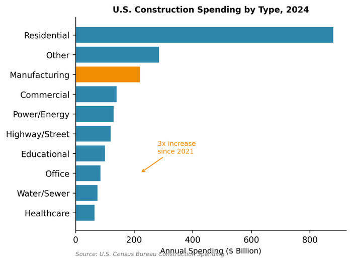
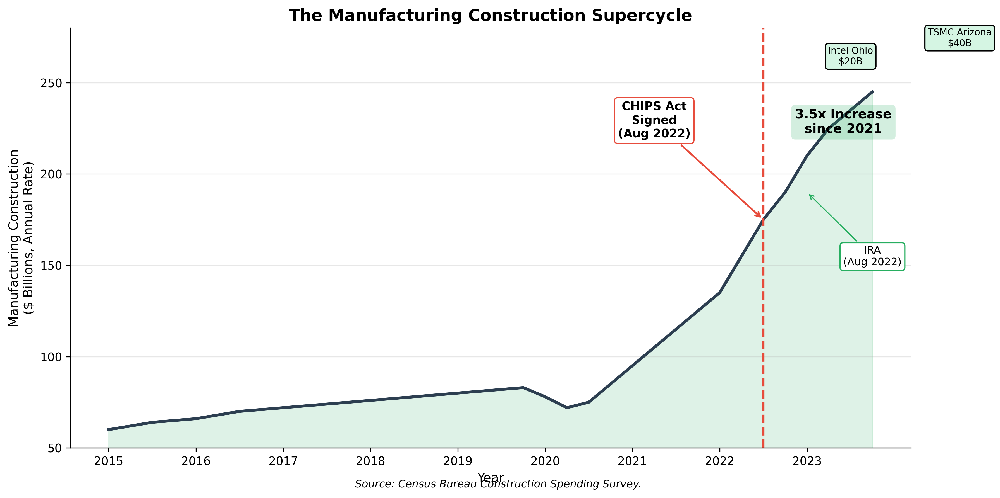

# Chapter 13. Construction

*"We used to build things in this country."*

Construction is the great American productivity puzzle. While manufacturing productivity has doubled, retail has been transformed by logistics and technology, and agriculture has achieved miracles of output per worker, construction has gone backwards. A house takes longer to build today than it did in 1970. A highway costs more per mile in real terms. The sector that literally builds America has somehow forgotten how to get better at building.

This is not a statistical artifact. Goolsbee and Syverson (2023) systematically tested whether the productivity decline was measurement error and rejected the hypothesis. Construction really has become less efficient, even as every other major industry has improved. Understanding why—fragmentation, regulation, the inherent challenges of project-based production—is essential to understanding why housing is expensive, why infrastructure takes so long, and why the industrial policy ambitions of the CHIPS Act and Inflation Reduction Act face serious execution risk.

## Overview

**Size and Scope**

- **GDP Contribution:** Approximately **$1.3 trillion** (4.5% of GDP)
- **Gross Output:** roughly $2.2 trillion annually (including intermediate inputs)
- **Employment:** roughly 8.3 million workers
- **Establishments:** roughly 800,000 firms, the vast majority with fewer than 10 employees
- **Value Put in Place:** $2.1 trillion annually in new construction (2024)

Construction is both cyclical and foundational. It builds the physical infrastructure of the economy—houses, offices, factories, roads, bridges, power plants—but its activity swings wildly with interest rates, credit availability, and economic confidence. In recessions, construction employment can fall 20-30%; in booms, labor shortages become acute within months.

**Key Subsectors:**

- **Residential:** Single-family homes, multifamily apartments, renovations (roughly 40% of total construction spending)
- **Commercial:** Offices, retail, hotels, healthcare facilities, data centers
- **Heavy Civil/Infrastructure:** Highways, bridges, airports, water systems, public transit
- **Industrial:** Manufacturing plants, refineries, power generation facilities

Each subsector operates differently. Residential is fragmented and local; heavy civil is dominated by a handful of giant engineering firms; industrial construction often involves specialized expertise (petrochemical, semiconductor fabs) concentrated in specific geographies.

## How the Industry Works

Construction is fundamentally different from manufacturing. You cannot build inventory. Each project is unique, produced at a specific site, subject to weather, local regulations, and the idiosyncrasies of the land. This project-based nature makes standardization difficult and scale economies elusive.

### The Project Lifecycle

**Design:** Architects and engineers create plans. This phase can take months for a house, years for a hospital or highway.

**Bidding:** Most commercial and public projects use competitive bidding. General contractors submit proposals based on plans; the lowest responsible bidder typically wins. This creates pressure to underestimate costs, leading to change orders and disputes later.

**Delivery Methods:**
- **Design-Bid-Build (DBB):** Traditional model. Design is completed, then contractors bid. Clear separation of responsibility, but slow and adversarial.
- **Design-Build (DB):** One entity handles both design and construction. Faster, but owner loses some control.
- **Construction Manager at Risk (CMAR):** A hybrid. CM provides input during design and guarantees a maximum price.

**Construction:** General contractors (GCs) manage the site but typically self-perform only 10-30% of the work. Everything else flows to **specialty subcontractors**: electrical, plumbing, HVAC, concrete, steel, drywall, roofing. A major commercial project might have 50+ subcontractors.

**Payment Chains:** Money flows down a long chain: Owner pays GC, GC pays subs, subs pay their suppliers and workers. Payment delays are endemic—60, 90, even 120 days is common. Mechanic's lien laws give unpaid contractors claims against the property, but collecting is difficult. Cash flow kills more contractors than lack of work.

### Bonding and Insurance

Public and major commercial projects require **surety bonds**:
- **Bid Bonds:** Guarantee the contractor will honor their bid
- **Performance Bonds:** Guarantee the work will be completed
- **Payment Bonds:** Guarantee subcontractors and suppliers will be paid

Bonding capacity is a major barrier to entry. A contractor can only take on projects up to their bonded limit, which depends on their financial strength and track record. This limits competition on large projects to established firms.

### Cyclicality

Construction is among the most cyclical sectors in the economy:
- **Interest Rate Sensitivity:** Residential construction is directly tied to mortgage rates. When rates rise, housing starts collapse.
- **Credit Dependence:** Developers finance projects with construction loans. When credit tightens, projects don't start.
- **Lag Effects:** Projects take 1-3 years to complete. Activity today reflects decisions made years ago.

The 2008-2009 crash saw construction employment fall from 7.7 million to 5.4 million—a 30% decline. Recovery took a decade.

## Industry Structure

### The Productivity Puzzle

Goolsbee and Syverson's (2023) research documented a remarkable fact: **construction productivity has declined since approximately 1970**, even as every other major sector has improved. Output per worker-hour in construction is lower today than 50 years ago.

They systematically tested potential explanations:
- **Measurement Error:** Rejected. Using multiple data sources and methodologies, the decline persists.
- **Quality Improvements:** Buildings are better (more code requirements, energy efficiency), but not enough to explain the decline.
- **Input Shifts:** The industry has shifted toward more intermediate inputs relative to labor, yet efficiency has dropped.

**Why has this happened?**

<figure>

<figcaption>Figure 13.2: The construction productivity puzzle. Output per worker has declined since 1970, unlike every other major sector. Source: Goolsbee and Syverson (2023)</figcaption>
</figure>

D'Amico, Glaeser, et al. (2024) point to **regulation and fragmentation**:
- Land-use regulations limit project sizes, preventing economies of scale
- If homebuilding firms had manufacturing's size distribution, productivity could be **60% higher**
- Small, fragmented firms cannot invest in technology, training, or process improvement
- Regional misallocation: construction activity has not shifted to high-productivity regions, suggesting regulatory frictions prevent efficient sorting

Allen (1985) identified another factor: **de-skilling**. The shift from large-scale commercial projects (built by skilled union crews) to smaller residential work (built by less-skilled labor) reduced average productivity. The workforce became less capable even as buildings became more complex.

### Market Structure

**General Contracting:** Extraordinarily fragmented. Of the 800,000 construction firms in America, most are tiny. The median construction company has fewer than 5 employees. Entry barriers are low (a truck, some tools, a contractor's license), and failure rates are high.

**Homebuilding:** Consolidating. The top 10 builders now control approximately **45% of new home sales**, up from 27% two decades ago. Large public builders (D.R. Horton, Lennar, PulteGroup) achieved scale through land acquisition, standardization, and vertical integration. They operate more like manufacturers than traditional builders.

**Heavy Civil/Engineering:** More concentrated. Megaprojects (airports, transit systems, LNG terminals) require capabilities that few firms possess: bonding capacity in the billions, specialized engineering talent, multi-year project management experience. A handful of firms dominate this space.

### Major Players

**Engineering and Heavy Civil**

| Company | Revenue | Specialty |
|---------|---------|-----------|
| **Bechtel** | roughly $18B | Energy, infrastructure, defense (private, family-owned) |
| **Fluor** | roughly $15B | Energy, chemicals, mining (public) |
| **Kiewit** | roughly $15B | Transportation infrastructure (employee-owned) |
| **Jacobs** | roughly $16B | Buildings, infrastructure, advanced facilities (public) |
| **AECOM** | roughly $14B | Design and construction management |

**Commercial Building**

| Company | Revenue | Market |
|---------|---------|--------|
| **Turner Construction** | roughly $16B | Commercial, healthcare, data centers (German-owned via Hochtief/ACS) |
| **Whiting-Turner** | roughly $10B | Commercial, institutional |
| **Skanska USA** | roughly $8B | Commercial, infrastructure (Swedish parent) |
| **Clark Construction** | roughly $6B | Government, commercial |

**Homebuilders**

| Company | Revenue | Homes/Year |
|---------|---------|------------|
| **D.R. Horton** | roughly $35B | roughly 90,000 |
| **Lennar** | roughly $34B | roughly 73,000 |
| **PulteGroup** | roughly $16B | roughly 28,000 |
| **NVR** | roughly $10B | roughly 24,000 |
| **Toll Brothers** | roughly $10B | roughly 10,000 |

<figure>

<figcaption>Figure 13.3: Top U.S. construction companies by revenue. Engineering giants (Bechtel, Fluor) differ from commercial builders (Turner, Whiting-Turner). Source: ENR (2024)</figcaption>
</figure>

Note that the largest American engineering contractors (Bechtel, Fluor, Kiewit) are essentially engineering firms that happen to build, while the largest commercial builders (Turner, Whiting-Turner) are project management operations that coordinate subcontractors. Neither model achieves the vertical integration that characterizes large homebuilders like D.R. Horton or global construction giants. This fragmentation reflects the industry's project-based nature: each job is custom, making standardization difficult.

**International Giants:** Global construction is increasingly dominated by European and Asian firms with scale American companies cannot match. **VINCI** (France, $70B revenue), **Grupo ACS** (Spain, $45B, owns Turner and Hochtief), and **Bouygues** (France, $45B) operate worldwide. Chinese state-owned enterprises (China State Construction, China Railway) are the world's largest but focus on Asia and Africa. The American absence from the global top tier reflects the domestic industry's fragmentation—no U.S. firm has achieved the scale or international reach of these foreign giants.

## Geographic Distribution

### The Sunbelt Boom

Construction activity has shifted dramatically toward the South and West:
- **Texas:** Dallas-Fort Worth and Houston are the nation's top markets for housing starts, industrial construction, and commercial development
- **Florida:** Tampa, Orlando, Jacksonville lead population-driven residential construction
- **Arizona:** Phoenix metro has seen explosive growth in both housing and industrial (semiconductor fabs)
- **Tennessee:** Nashville has emerged as a corporate relocation destination

This geographic concentration reflects population migration, business-friendly regulatory environments, lower land costs, and available labor. It also creates severe local labor shortages when multiple large projects compete for workers.

### Coastal Constraints

In contrast, construction in coastal metros (San Francisco, Los Angeles, New York, Boston) faces severe constraints:
- Permitting and environmental review can add years to project timelines
- Land costs are prohibitive, requiring higher-density projects that are more complex to build
- Union labor requirements raise costs (but also quality and safety)
- NIMBYism delays or kills projects entirely

The result: housing construction in high-demand coastal cities is a fraction of what market prices would suggest is needed.

### Specialty Clusters

Certain geographies have developed specialized construction expertise:
- **Houston:** Petrochemical and energy facility construction (refineries, LNG terminals)
- **Las Vegas:** Gaming and hospitality construction
- **Silicon Valley/Phoenix:** Semiconductor fab construction
- **Nuclear Regions:** A handful of firms with nuclear construction expertise concentrate where plants exist or are planned

## The Workforce

### Employment Profile

Construction employs approximately **8.3 million workers**, roughly 5.5% of total US employment. The workforce is distinctive:

- **Demographics:** 97% male (one of the most gender-skewed major industries); median age rising steadily
- **Education:** Most workers have high school education or less; formal credentials matter less than experience and skill
- **Immigrant Labor:** Approximately **30%** of construction workers are foreign-born, rising to **50%+** in specific trades (drywall, roofing, concrete) in states like Texas and California

### Unionization

Union density varies dramatically by geography and subsector:
- **National Rate:** 10.3% (2024)
- **High-Union Markets:** New York City, Chicago, Boston, San Francisco—building trades unions (IBEW, Carpenters, Laborers, Ironworkers) dominate commercial construction
- **Low-Union Markets:** Texas, Florida, Arizona—residential and much commercial construction is "open shop"

Union projects typically have higher wages, better safety records, and more formal training (apprenticeships). They also have higher costs, which is why developers often choose non-union contractors where possible.

### The Labor Crisis

The industry faces a structural labor shortage:
- **Aging Workforce:** For every 4 workers retiring, only 1 enters the trades
- **Image Problem:** Decades of "college for everyone" messaging stigmatized skilled trades
- **Immigration Policy:** Restrictions have tightened labor supply precisely when demand is surging
- **Competition:** Warehouse and logistics jobs (Amazon fulfillment centers) offer comparable pay with climate-controlled environments

The Associated General Contractors estimates the industry needs **500,000+ additional workers** to meet current demand. The gap is growing.

### Wages and Safety

**Wages** vary enormously by trade and geography:
- **Laborers:** $18-25/hour
- **Carpenters:** $22-35/hour
- **Electricians:** $28-45/hour
- **Ironworkers:** $30-50/hour
- **Union Premium:** Union workers earn roughly 20-30% more than non-union in comparable roles

**Safety:** Construction is one of the most dangerous industries. Falls are the leading cause of death, followed by struck-by incidents, electrocution, and caught-between accidents (the "Fatal Four"). OSHA heavily regulates the industry, but enforcement is challenging given the number of worksites and the prevalence of small firms and subcontracting.

## Regulation and Policy

### Building Codes

The **International Building Code (IBC)** and related codes (plumbing, electrical, mechanical, fire) provide a baseline national standard, but adoption and enforcement are local. States adopt the IBC with modifications; local jurisdictions add their own requirements. The result is a patchwork: what's permissible in Houston may be prohibited in San Francisco.

Code updates (typically every 3 years) ratchet requirements upward—more energy efficiency, seismic resilience, fire safety, accessibility. Each requirement adds cost. Builders argue codes have become excessive; safety advocates argue they save lives and reduce long-term costs.

### Permitting

Permitting is a local function with enormous variation:
- **Fast Markets:** Some Texas and Florida jurisdictions issue permits in days
- **Slow Markets:** California projects can spend years in permitting and environmental review
- **Discretionary Review:** Beyond code compliance, many jurisdictions require neighborhood approval, design review, or other discretionary processes that add time and uncertainty

CEQA (California Environmental Quality Act) is the poster child for regulatory delay. Intended to protect the environment, it has become a tool for project opponents to delay or kill development through litigation.

### Labor Regulation

- **Davis-Bacon Act (1931):** Requires "prevailing wages" (typically union scale) on federal construction projects over $2,000. Raises costs but supports union labor.
- **State Prevailing Wage Laws:** Many states have similar requirements for state-funded projects
- **Occupational Licensing:** Contractor licensing requirements vary by state, from minimal (Texas) to extensive (California)

### Zoning

Land-use regulation, covered in Chapter 5, is the dominant constraint on residential construction. Zoning determines what can be built where, and restrictive zoning in high-demand areas has created the housing affordability crisis.

## Trade Associations and Lobbying

### Major Associations

| Association | Membership | Focus |
|-------------|------------|-------|
| **Associated General Contractors (AGC)** | 27,000+ firms | General contractors; infrastructure, commercial |
| **National Association of Home Builders (NAHB)** | 140,000+ members | Residential builders; housing policy |
| **Associated Builders and Contractors (ABC)** | 23,000+ members | Open-shop/merit-shop contractors |
| **North America's Building Trades Unions (NABTU)** | 3 million workers | Union labor; prevailing wage, apprenticeship |

### Political Dynamics

The industry is politically divided:
- **NAHB:** Focuses on housing affordability, land-use deregulation, immigration (labor supply), lumber tariffs
- **AGC:** Infrastructure spending, workforce development, regulatory streamlining
- **ABC:** Opposes prevailing wage requirements and project labor agreements; promotes "merit shop" (non-union) construction
- **Building Trades:** Defends prevailing wage, promotes apprenticeship programs, supports project labor agreements on public work

Infrastructure spending attracts bipartisan support—everyone likes ribbon-cuttings on bridges. Housing policy is more contentious, with builders seeking deregulation while labor and community groups resist.

## Recent Trends

### 1. The Manufacturing Supercycle

<figure>

<figcaption>Figure 13.1: Construction spending by category. Manufacturing construction has tripled since 2021 due to CHIPS Act and IRA investments. Source: Census Bureau</figcaption>
</figure>

Construction spending on manufacturing facilities has **tripled** since 2021, driven by industrial policy:

- **CHIPS Act:** $52 billion in subsidies for domestic semiconductor production has triggered massive fab construction
  - Intel's Ohio fab: $20 billion project, 7,000 construction workers at peak
  - TSMC's Arizona fabs: $40 billion commitment
  - Samsung's Texas fab: $17 billion
  - Micron's New York fab: $100 billion over 20 years

- **Inflation Reduction Act:** Clean energy subsidies driving battery plant and EV factory construction
  - Battery plants across Georgia, Tennessee, Kentucky, Michigan
  - Solar and wind manufacturing facilities

<figure>

<figcaption>Figure 13.4: The manufacturing construction supercycle. CHIPS Act (August 2022) and IRA triggered a 3.5x increase in manufacturing construction spending, with major projects including Intel Ohio ($20B) and TSMC Arizona ($40B). Source: Census Bureau</figcaption>
</figure>

This manufacturing construction boom is unprecedented in a generation. It is also straining labor markets—workers are being pulled from housing construction, exacerbating affordability problems.

### 2. Infrastructure Investment (IIJA)

The Infrastructure Investment and Jobs Act (2021) committed **$1.2 trillion** over five years to:
- Highways and bridges
- Public transit
- Passenger and freight rail
- Airports
- Water infrastructure
- Broadband

Federal infrastructure dollars are now flowing at double-digit growth rates. Competition for heavy civil labor, equipment, and materials has intensified. Project costs are rising in part because everyone is building at once.

### 3. Cost Volatility

Construction costs have been exceptionally volatile:
- **Lumber:** Spiked 300%+ during COVID-19 pandemic (supply chain disruptions, DIY demand), then collapsed, now stabilized
- **Steel:** Tariffs and supply chain issues created price spikes
- **Electrical Equipment:** Switchgear and transformers have 18-24 month lead times due to data center demand
- **Concrete:** Steady price increases, regional shortages
- **Labor:** Wage inflation of 5-8% annually in hot markets

The "time to build" has increased significantly. Lead times for materials that used to take weeks now take months or years. Projects that might have broken ground immediately now wait for equipment.

### 4. Modular and Prefabrication

Off-site construction—building components in factories and assembling on-site—promises to address productivity problems:
- McKinsey estimates modular construction can **reduce timelines by 50%** and **costs by 20%**
- Factory-controlled environments improve quality and reduce weather delays
- Prefab is common in other countries (Sweden, Japan) but rare in the US

**Barriers:**
- Building codes written for site-built construction
- Financing: Lenders don't understand modular economics
- Transportation: Modules must fit on trucks
- Labor: Unions resist shifting work from jobsites to factories
- **Katerra Failure (2021):** The most ambitious modular construction startup raised $2 billion and collapsed, demonstrating how difficult disruption is in this industry

### 5. Technology Adoption

Construction technology ("ConTech") investment has surged, but adoption remains slow:
- **BIM (Building Information Modeling):** 3D digital models are now standard on large projects
- **Drones:** Used for site surveys and progress monitoring
- **Robotics:** Experimental bricklaying, rebar-tying, and concrete-pouring robots exist but are not widely deployed
- **Prefabrication:** Growing but still a small share of total construction
- **Software:** Project management, estimating, and scheduling software is improving but fragmented

The fundamental challenge is that each project is unique, making automation harder than in manufacturing.

## Firm Profiles

### Bechtel

> **Quick Facts**
> - **Headquarters:** Reston, VA
> - **Ownership:** Private, family-controlled since 1898
> - **Revenue:** roughly $18 billion
> - **Employees:** roughly 55,000

Bechtel is America's megaproject builder—the firm you call when the job is too big, too complex, or too strategically important for anyone else. The company built Hoover Dam, the San Francisco Bay Area's BART system, the Channel Tunnel (with partners), Boston's Big Dig, and countless refineries, power plants, and LNG terminals.

Family-controlled for five generations, Bechtel operates with a long-term orientation that public companies cannot match. It takes on projects others won't touch: nuclear cleanup at Hanford, post-war reconstruction in Iraq, infrastructure in developing countries where political risk is extreme.

The culture is conservative and engineering-driven. Bechtel doesn't seek publicity; it delivers projects. When something goes wrong on a major infrastructure project, Bechtel is often called in to fix it. The firm represents what American construction can do at its best—massive scale, technical excellence, project execution under difficult conditions.

### Turner Construction

> **Quick Facts**
> - **Headquarters:** New York, NY
> - **Parent Company:** Hochtief AG (Germany) / ACS (Spain)
> - **Revenue:** roughly $16 billion
> - **Employees:** roughly 10,000

Turner is the giant of American commercial building construction. The company built One World Trade Center, Madison Square Garden, Yankee Stadium, and countless hospitals, data centers, university buildings, and corporate headquarters.

Founded in 1902, Turner pioneered concrete construction techniques that made skyscrapers possible. The company went public in 1917, was acquired by German construction giant Hochtief in 1999, and is now ultimately owned by Spanish conglomerate ACS—illustrating how even iconic American builders have become subsidiaries of larger international firms.

Turner operates as a union contractor, dominant in the high-cost, high-complexity urban markets of New York, San Francisco, and other major cities. Its expertise is in managing the chaos of urban construction: tight sites, complex logistics, demanding schedules, union labor relations, and buildings that must meet exacting standards. Turner doesn't build tract houses; it builds the skyline.

### D.R. Horton

> **Quick Facts**
> - **Headquarters:** Arlington, TX
> - **Founded:** 1978
> - **Revenue:** roughly $35+ billion
> - **Employees:** roughly 13,000
> - **Homes Delivered:** roughly 90,000 annually

D.R. Horton is what construction could look like if the industry industrialized. While commercial contractors struggle with productivity, Horton has systematized homebuilding into something approaching manufacturing.

The model is relentless standardization. Horton offers limited customization—pick from a set of floor plans, a set of finishes, and a set of lots. This enables bulk purchasing (every house uses the same cabinets, the same appliances, the same fixtures), predictable scheduling, and efficient deployment of trade crews who repeat the same tasks across hundreds of homes.

Horton focuses on the entry-level buyer—first-time purchasers and move-up families seeking value over prestige. The company doesn't build McMansions; it builds the affordable end of new construction. By controlling land pipelines (buying land years in advance), integrating mortgage services (DHI Mortgage), and achieving scale economies, Horton can deliver homes at price points smaller builders cannot match.

The contrast with commercial construction is stark. D.R. Horton achieves productivity gains through standardization and scale. Commercial and infrastructure construction, bound by custom designs and local regulations, cannot.

## Data Sources and Further Reading

### Key Data Sources

- **Census Bureau:** Construction Spending Survey (monthly); Value of Construction Put in Place
- **Bureau of Labor Statistics:** Employment data by construction subsector (NAICS 23); Occupational Employment and Wage Statistics
- **Engineering News-Record (ENR):** Top 400 Contractors ranking; Top 500 Design Firms
- **National Association of Home Builders (NAHB):** Housing starts, builder sentiment surveys
- **Federal Reserve:** Construction lending data; housing market indicators

### Further Reading

- **Goolsbee, Austan, and Chad Syverson.** "The Strange and Awful Path of Productivity in the U.S. Construction Sector." *NBER Working Paper* No. 30845 (2023). [The definitive documentation of construction's productivity decline.]
- **D'Amico, Leonardo, Edward Glaeser, Joseph Gyourko, William Kerr, and Giacomo Ponzetto.** "Why Has Construction Productivity Stagnated? The Role of Land-Use Regulation." *NBER Working Paper* No. 33188 (2024). [Links regulatory fragmentation to productivity—if homebuilders had manufacturing's firm size distribution, productivity would be 60% higher.]
- **Allen, Steven G.** "Why Construction Industry Productivity Is Declining." *NBER Working Paper* No. 1555 (1985). [Foundational paper on de-skilling and the shift from commercial to residential work.]
- **Glaeser, Edward L., and Joseph Gyourko.** "The Economic Implications of Housing Supply." *Journal of Economic Perspectives* 32, no. 1 (2018): 3-30. [How supply constraints in construction create housing affordability problems.]
- **McKinsey Global Institute.** "Modular Construction: From Projects to Products." (2019). [The potential—and barriers—of off-site construction.]
- **Bernstein, Shai, Emanuele Colonnelli, Davide Malacrino, and Tim McQuade.** "Who Creates New Firms When Local Opportunities Arise?" *Journal of Financial Economics* (2022). [On construction entrepreneurship and local opportunity.]
