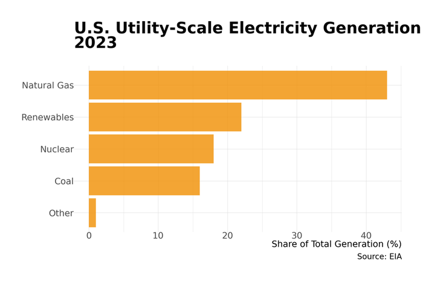

# Chapter 14: Energy

The United States consumes more energy than any country except China, burning through roughly 100 quadrillion BTUs annually---the equivalent of 20 million barrels of oil per day. This energy powers an $800 billion sector that spans oil fields in the Permian Basin, natural gas pipelines crisscrossing the continent, nuclear plants operating since the 1970s, wind farms across the Great Plains, and solar installations spreading across rooftops and deserts. The American energy system is simultaneously ancient (some coal plants date to the 1950s) and revolutionary (solar costs have fallen 90% in a decade). Understanding energy means understanding both the legacy infrastructure that still dominates and the transformation now underway.

## Overview

**Size and Scope**
- Total energy spending: $1.5 trillion annually
  - Electricity: about $450 billion (retail sales)
  - Petroleum products: approximately $600 billion
  - Natural gas (non-electric): around $150 billion
  - Other: some $300 billion
- GDP contribution: $500 billion directly (utilities, extraction, refining); $800 billion including related sectors
- Employment: 1.2 million direct (utilities, extraction, refining); 3 million including support services
- Key subsectors: Electric utilities, oil and gas extraction, petroleum refining, pipelines, renewable generation, energy services

Energy's direct share of GDP (3–4%) understates its importance. Energy is an input to every other sector: manufacturing, transportation, agriculture, and buildings all depend on reliable, affordable energy. Energy price shocks ripple through the economy; energy geography shapes regional development; energy policy drives some of the largest investment flows in the economy.

The sector is also unusually capital-intensive. A single nuclear plant costs $20-30 billion; a major offshore oil platform $1-5 billion; even utility-scale solar projects run hundreds of millions. This capital intensity creates long asset lives, path dependence, and high barriers to entry.

## How the Industry Works

### Electricity: Generation, Transmission, and Distribution

Electricity is unique among commodities: it cannot be economically stored at scale (yet), so supply must match demand instantaneously. This physical constraint shapes everything about how the industry operates.

**Generation** (about 4,200 TWh annually):

| Source | Share (2024) | Trend |
|--------|--------------|-------|
| Natural gas | 43% | Growing (replaced coal) |
| Coal | 16% | Declining rapidly |
| Nuclear | 18% | Stable (aging fleet) |
| Wind | 11% | Growing rapidly |
| Solar | 6% | Growing very rapidly |
| Hydro | 6% | Stable |

*Source: Energy Information Administration, Electric Power Monthly, 2024*

<figure>

<figcaption>Figure 14.1: U.S. electricity generation by source. Natural gas has replaced coal as the dominant fuel, while wind and solar have grown rapidly. Source: EIA (2024)</figcaption>
</figure>

The generation mix has transformed in 15 years. In 2008, coal provided 48% of US electricity; natural gas 21%. The shale revolution made gas cheap; environmental regulation made coal expensive. Coal's share has fallen by two-thirds.


**Three Separate Grids**

The US operates three largely separate electrical grids with limited interconnection between them. ERCOT (Texas) deliberately isolated itself from the national grid to avoid federal regulation—but this means Texas cannot import power during emergencies, as the deadly February 2021 freeze demonstrated.


**Transmission** moves power from generators to load centers over high-voltage lines (100-765 kV). The US has three largely separate grids:
- **Eastern Interconnection**: East of the Rockies (except Texas)
- **Western Interconnection**: West of the Rockies
- **ERCOT**: Texas only (deliberately isolated to avoid federal regulation)

Limited transmission between these interconnections constrains the ability to balance supply and demand across regions.

<figure>

<figcaption>Figure 14.2: U.S. electric grid: ISO/RTO territories. Wholesale electricity markets are managed by Independent System Operators in restructured regions (colored), while traditional utilities operate in gray areas. Texas (ERCOT) is the only state with its own isolated grid. Source: FERC, EIA</figcaption>
</figure>

**Distribution** delivers power from substations to end users over lower-voltage lines. Distribution utilities---often the same companies that own transmission---maintain local networks and handle customer billing.

**Retail Sales** ($450 billion):

| Customer Class | Share of Sales | Share of Revenue |
|----------------|----------------|------------------|
| Residential | 38% | 44% |
| Commercial | 36% | 35% |
| Industrial | 26% | 21% |

Residential customers pay the highest rates (about 15 cents/kWh national average); industrial customers the lowest (about 8 cents/kWh) due to volume and load characteristics.

### The Two Models: Regulated vs. Restructured

Electricity operates under two fundamentally different market structures:

**Regulated/Vertically Integrated** (roughly 30 states):
- A single utility owns generation, transmission, and distribution
- Utility earns a regulated rate of return on invested capital
- State Public Utility Commission (PUC) approves rates and investments
- No wholesale competition; utility must serve all load
- Dominant in the South, West, and much of the Midwest

**Restructured/Deregulated** (roughly 20 states + DC):
- Generation separated from transmission/distribution
- Competitive wholesale markets operated by Independent System Operators (ISOs)
- Retail choice: customers can buy from competing suppliers (in some states)
- Transmission and distribution remain regulated monopolies
- Dominant in the Northeast, Mid-Atlantic, Texas, and parts of the Midwest

The restructuring wave of the 1990s-2000s promised lower prices through competition. Results have been mixed: wholesale markets are more efficient, but retail prices in restructured states are generally *higher* than in regulated states (partly due to regional cost differences).

### Oil and Gas: From Wellhead to Pump

**Upstream (Exploration and Production)**:

US oil production collapsed from 10 million barrels/day (1970) to 5 million (2008), then surged back to 13+ million (2024)---making America the world's largest producer. The **shale revolution** unlocked tight oil and gas through horizontal drilling and hydraulic fracturing.

Key producing regions:
- **Permian Basin** (West Texas/New Mexico): Largest US oil field, about 6 million bbl/day
- **Eagle Ford** (South Texas): about 1 million bbl/day
- **Bakken** (North Dakota): around 1 million bbl/day
- **Appalachian Basin** (PA, WV, OH): Largest gas field (Marcellus/Utica shale)
- **Haynesville** (LA/TX): Major gas production

**Midstream (Transportation and Storage)**:

Oil and gas move through an extensive pipeline network:
- some 190,000 miles of oil pipelines
- approximately 320,000 miles of natural gas transmission pipelines
- over 2 million miles of natural gas distribution pipelines

Major pipeline companies: Energy Transfer, Kinder Morgan, Enterprise Products, Williams Companies. Pipelines are regulated as common carriers (must provide non-discriminatory access) but earn market-based returns.

**Downstream (Refining and Marketing)**:

US refining capacity: about 18 million barrels/day across some 130 refineries. Refining is concentrated on the Gulf Coast (Texas, Louisiana) due to proximity to oil production and port access.

Major refiners: Marathon Petroleum, Valero, Phillips 66, ExxonMobil, Chevron.

Refined products flow to retail through:
- Company-owned stations (declining)
- Branded franchises (Shell, ExxonMobil, BP stations owned by franchisees)
- Unbranded independents

### Renewables: The New Entrants

**Wind Power** (about 150 GW installed capacity):
- Concentrated in the Great Plains (Texas, Iowa, Oklahoma, Kansas)
- Utility-scale wind is now cost-competitive with gas in good wind areas
- Major developers: NextEra, Berkshire Hathaway Energy, Invenergy, AES

**Solar Power** (approximately 175 GW installed capacity):
- Utility-scale: California, Texas, Florida lead
- Distributed (rooftop): California dominates (around 40% of US rooftop solar)
- Costs have fallen 90% since 2010
- Major developers: NextEra, AES, Clearway, Array Technologies

**Battery Storage** (about 30 GW installed, growing rapidly):
- Paired with solar to provide dispatchable power
- Grid-scale batteries reaching 4+ hours duration
- California, Texas, Arizona leading deployment

The Inflation Reduction Act (2022) provides 10-year tax credits for wind, solar, and storage, accelerating deployment. Annual utility-scale solar installations are expected to reach 50+ GW by 2030.

## Industry Structure

### Electric Utilities

The electric utility industry is fragmented but consolidating:

**Investor-Owned Utilities (IOUs)**: some 170 companies, serving about 70% of customers
- Publicly traded, profit-seeking
- Largest by market cap: NextEra ($140B), Southern Company ($80B), Duke Energy ($75B)
- Subject to state PUC regulation

**Public Power**: about 2,000 entities, serving around 15% of customers
- Owned by municipalities, states, or federal government
- Tennessee Valley Authority (TVA): Largest public utility
- Los Angeles DWP, Sacramento Municipal Utility District, others
- Nonprofit; rates set by governing boards

**Cooperatives**: some 900 co-ops, serving about 15% of customers
- Member-owned, primarily rural
- Formed in 1930s-40s to electrify rural America
- National Rural Electric Cooperative Association represents the sector

**Largest US Electric Utilities** (by retail sales):

| Rank | Utility | Customers | States | Type |
|------|---------|-----------|--------|------|
| 1 | Duke Energy | 8.2M | NC, SC, FL, IN, OH, KY | IOU |
| 2 | Southern Company | 9.0M | GA, AL, MS | IOU |
| 3 | Dominion Energy | 7.0M | VA, NC, SC | IOU |
| 4 | Florida Power & Light (NextEra) | 5.8M | FL | IOU |
| 5 | Pacific Gas & Electric | 5.5M | CA | IOU |
| 6 | Xcel Energy | 3.8M | MN, CO, TX, WI, etc. | IOU |
| 7 | TVA | 10M (wholesale) | TN region | Federal |

*Source: Energy Information Administration, Form 861, 2023*

### Independent System Operators (ISOs/RTOs)

In restructured markets, ISOs/RTOs operate wholesale markets and manage the grid:

| ISO/RTO | Region | Load (TWh) | States |
|---------|--------|------------|--------|
| PJM | Mid-Atlantic | 800 | PA, NJ, MD, VA, OH, etc. |
| MISO | Midwest | 680 | IL, IN, MI, MN, etc. |
| ERCOT | Texas | 450 | TX only |
| ISO-NE | New England | 120 | MA, CT, NH, VT, ME, RI |
| NYISO | New York | 150 | NY |
| CAISO | California | 230 | CA |
| SPP | Great Plains | 250 | KS, OK, NE, etc. |

ISOs run day-ahead and real-time energy markets using **locational marginal pricing (LMP)**: prices vary by location based on generation costs and transmission constraints. They also run capacity markets (to ensure adequate generation) and ancillary service markets (for grid stability).

### Oil and Gas Companies

**Integrated Majors** (upstream, midstream, and downstream):

| Company | Market Cap | US Production | Focus |
|---------|------------|---------------|-------|
| ExxonMobil | $450B | 3.8M boe/day | Global integrated |
| Chevron | $280B | 3.0M boe/day | Global integrated |

**Large Independents** (primarily upstream):

| Company | Market Cap | US Production | Focus |
|---------|------------|---------------|-------|
| ConocoPhillips | $130B | 1.9M boe/day | E&P only |
| EOG Resources | $70B | 1.0M boe/day | Shale (Permian, Eagle Ford) |
| Pioneer Natural Resources | Acquired by Exxon | - | Was largest Permian pure-play |
| Occidental Petroleum | $50B | 1.2M boe/day | Permian, carbon capture |
| Devon Energy | $30B | 660K boe/day | Multi-basin shale |

*Source: Energy Information Administration, Petroleum Supply Monthly, 2024*

The Permian Basin has driven consolidation: ExxonMobil acquired Pioneer ($60B, 2024); Chevron acquired PDC Energy and attempted Hess; Occidental acquired Anadarko (2019).

**Oilfield Services** (equipment, drilling, completion):

| Company | Revenue | Business |
|---------|---------|----------|
| SLB (Schlumberger) | $35B | Drilling, reservoir |
| Halliburton | $23B | Completion, production |
| Baker Hughes | $27B | Equipment, digital |

### Renewable Developers

**Leading US Renewable Developers**:

| Company | Capacity | Business Model |
|---------|----------|----------------|
| NextEra Energy Resources | 32 GW | Utility subsidiary, wind/solar |
| Berkshire Hathaway Energy | 15 GW | Utility + merchant |
| AES Clean Energy | 12 GW | Independent developer |
| Invenergy | 10 GW | Private, wind/solar/storage |
| Clearway Energy | 8 GW | Public yieldco |

NextEra is the dominant player, having built more wind and solar than any other company. Its utility subsidiary (Florida Power & Light) provides stable cash flows to fund renewable development.

## Geographic Distribution

### Energy Production Geography

America's energy geography creates a fundamental divide between **producing states** and **consuming states**:

<figure>

<figcaption>Figure 14.2: Major energy production regions. The Permian Basin (oil) and Appalachian Basin (natural gas) dominate U.S. production. Source: EIA</figcaption>
</figure>

**Top Oil Producing States** (million bbl/day):
1. Texas: 5.5
2. New Mexico: 1.8
3. North Dakota: 1.1
4. Colorado: 0.4
5. Alaska: 0.4

**Top Natural Gas Producing States** (trillion cubic feet/year):
1. Texas: 11.0
2. Pennsylvania: 7.5
3. Louisiana: 4.0
4. West Virginia: 2.5
5. Oklahoma: 2.3

**Top Coal Producing States** (million short tons):
1. Wyoming: 230 (Powder River Basin)
2. West Virginia: 70
3. Pennsylvania: 40

**Wind Generation Leaders**:
1. Texas: 40 GW
2. Iowa: 12 GW
3. Oklahoma: 12 GW
4. Kansas: 8 GW

**Solar Generation Leaders**:
1. California: 40 GW
2. Texas: 20 GW
3. Florida: 10 GW
4. North Carolina: 8 GW

### Energy Consumption Geography

Energy consumption follows population and industrial activity:

**Highest Per Capita Energy Use**:
- Louisiana, Wyoming, Alaska, North Dakota: Industrial activity (refining, mining)
- Texas: Large state with heavy industry and hot climate

**Lowest Per Capita Energy Use**:
- California, New York, New England: Mild climates, service economies, efficiency policies

### The Grid Geography

The US grid reflects historical development rather than optimal design:

- **Eastern Interconnection**: 70% of US load, relatively well-interconnected
- **Western Interconnection**: Less interconnected internally; California imports from neighbors
- **ERCOT**: Deliberately isolated; Texas's 2021 blackout showed the risks

Transmission constraints limit the ability to move cheap renewable power (from windy Plains or sunny Southwest) to population centers (coasts, Midwest cities). Building new transmission faces permitting challenges, landowner opposition, and cost allocation disputes.

## The Workforce

### Employment by Segment

| Segment | Employment | Avg Wage | Trend |
|---------|------------|----------|-------|
| Oil and gas extraction | 150,000 | $100,000 | Cyclical |
| Mining support (drilling, services) | 300,000 | $65,000 | Cyclical |
| Electric utilities | 400,000 | $90,000 | Stable |
| Natural gas distribution | 100,000 | $80,000 | Stable |
| Petroleum refining | 60,000 | $95,000 | Declining |
| Pipeline transportation | 50,000 | $85,000 | Stable |
| Solar installation | 250,000 | $50,000 | Growing rapidly |
| Wind technicians | 15,000 | $60,000 | Growing |

**Total direct energy employment**: about 1.3 million
**Including indirect/induced**: around 3 million

### Workforce Characteristics

**Oil and gas**: Highly cyclical; hiring surges when oil prices rise, mass layoffs when they fall. The 2014-2016 and 2020 downturns each eliminated 100,000+ jobs. Workers must be mobile (go where the drilling is) and accept shift schedules.

**Utilities**: Stable but aging workforce. Many utility workers are 50+; retirements are creating succession challenges. Strong union presence (IBEW, UWUA).

**Solar**: Fastest-growing energy occupation, but jobs tend to be lower-wage than traditional energy. Installation is labor-intensive but doesn't require specialized credentials (unlike utility or oil/gas work).

**Geographic concentration**: Energy jobs concentrate in producing regions (Texas, Gulf Coast, Appalachia, Rockies). The energy transition implies job losses in some regions (coal communities) and gains in others (solar manufacturing, offshore wind ports).

## Regulation and Policy

### Federal Regulators

**Federal Energy Regulatory Commission (FERC)**:
- Regulates interstate electricity transmission and wholesale markets
- Regulates interstate natural gas pipelines
- Approves major infrastructure projects (LNG terminals, pipelines)
- Sets transmission rates and market rules
- Does NOT regulate retail electricity (state jurisdiction)

**Department of Energy (DOE)**:
- National laboratories and research
- Strategic Petroleum Reserve
- Energy efficiency standards (appliances, vehicles)
- Nuclear waste management
- Administers IRA clean energy programs

**Environmental Protection Agency (EPA)**:
- Air quality standards affecting power plants
- Greenhouse gas regulations (Clean Power Plan / Inflation Reduction Act)
- Vehicle emissions standards
- Refinery and pipeline regulations

**Nuclear Regulatory Commission (NRC)**:
- Licenses and regulates nuclear power plants
- Oversees nuclear waste storage

### State Regulators

**Public Utility Commissions (PUCs)**:
- Set retail electricity and gas rates
- Approve utility investments and power purchases
- Enforce reliability standards
- Implement renewable portfolio standards

State PUCs have enormous power over utility decisions. A PUC that denies cost recovery for a plant effectively kills the project. PUCs vary widely in approach: some prioritize low rates; others environmental goals; others utility financial health.

**State Environmental Agencies**:
- Implement federal environmental law
- May set stricter standards than federal (California)
- Permit power plants and refineries

### Key Policy Frameworks

**Renewable Portfolio Standards**: 30+ states require utilities to obtain a percentage of power from renewables. California: 100% clean by 2045. Texas: No RPS but strong market for renewables anyway.

**Inflation Reduction Act (2022)**: Largest US climate legislation ever:
- 10-year tax credits for wind, solar, storage, nuclear, hydrogen
- EV tax credits and charging infrastructure
- Manufacturing credits (solar panels, batteries, etc.)
- Estimated $370 billion in climate spending over 10 years

**Infrastructure Investment and Jobs Act (2021)**:
- Grid modernization funding
- EV charging network buildout
- Hydrogen hubs
- Carbon capture demonstrations

## Trade Associations and Lobbying

### Major Trade Associations

| Association | Members | Focus |
|-------------|---------|-------|
| Edison Electric Institute (EEI) | Investor-owned utilities | Utility industry interests |
| American Petroleum Institute (API) | Oil and gas companies | Oil/gas production, refining |
| American Gas Association | Natural gas utilities | Gas distribution |
| American Clean Power Association | Renewables developers | Wind, solar, storage |
| Solar Energy Industries Association | Solar companies | Solar policy |
| Nuclear Energy Institute | Nuclear operators | Nuclear power |
| National Rural Electric Cooperative Association | Electric co-ops | Rural electric interests |

### Lobbying Activity

Energy is among the most heavily lobbied sectors:
- Oil and gas: $125 million annually in federal lobbying
- Electric utilities: $100 million
- Renewable energy: $30 million (growing)

Key lobbying issues: Tax treatment, permitting, environmental regulation, grid rules, trade policy (tariffs on solar panels, LNG exports).

The industry contributes heavily to campaigns, particularly in energy-producing states. Texas, Louisiana, Oklahoma, and Wyoming politics are shaped by oil and gas interests.

## Beyond Electricity: Water, Gas, and Broadband Utilities

The electricity system dominates energy policy debates, but Americans depend on several other networked utility systems that share the same fundamental economics: natural monopoly structure, heavy capital requirements, regulated pricing, and aging infrastructure. These systems are less visible precisely because they work---until they fail.

### Water and Wastewater Systems

The United States has about 50,000 community water systems, but the sector's structure could hardly be more different from electricity. Most water systems are small and municipally owned: over 80% serve fewer than 3,300 people, and private ownership accounts for only about 15% of systems. This extreme fragmentation---tens of thousands of independent operators, many run by local governments with limited technical capacity---creates persistent challenges for maintenance, compliance, and capital investment.

The infrastructure gap is staggering. The American Society of Civil Engineers estimates a $600+ billion shortfall in water infrastructure investment over the next two decades. Pipes installed in the early twentieth century are reaching end of life simultaneously across thousands of systems. The crisis in Flint, Michigan, which exposed widespread lead contamination in 2014, was not an anomaly---the EPA estimates that 9.2 million lead service lines remain in use nationwide. The Bipartisan Infrastructure Law (2021) allocated $15 billion specifically for lead pipe replacement, but that covers only a fraction of the estimated $45-60 billion total cost.

PFAS contamination has emerged as the next major water crisis. These "forever chemicals," found in firefighting foam, nonstick coatings, and industrial processes, contaminate drinking water supplies serving an estimated 100+ million Americans. The EPA finalized enforceable PFAS limits in 2024, but compliance will cost water systems billions---costs that ultimately flow to ratepayers in a sector where many customers already struggle with affordability.

### Natural Gas Distribution

While electricity debates focus on generation and transmission, natural gas has its own "last mile" problem. About 77 million residential, commercial, and industrial customers receive gas through local distribution companies (LDCs)---the regulated utilities that operate the low-pressure pipeline networks running under streets and into buildings. These systems represent enormous sunk capital, and their future is increasingly contested.

The electrification movement poses an existential question for gas distribution. Several cities---including New York, San Francisco, and Seattle---have restricted or banned new natural gas hookups in buildings, arguing that electrification (heat pumps, induction stoves) is necessary to meet climate goals. The gas industry has responded by promoting hydrogen blending and "renewable natural gas" from landfills and dairy operations as pathways to decarbonize existing infrastructure. Critics argue these alternatives are expensive and unproven at scale.

Meanwhile, methane leaks from aging distribution infrastructure represent both a climate problem and a safety hazard. The EPA estimates that gas distribution systems leak an estimated 0.6 million metric tons of methane annually. Since methane is roughly 80 times more potent than CO2 as a greenhouse gas over a 20-year horizon, these leaks substantially undercut natural gas's climate advantage over coal for electricity generation.

### Broadband as Essential Utility

Broadband internet increasingly functions as essential infrastructure, yet it remains the least regulated major networked service. The FCC's broadband deployment data shows that an estimated 24 million Americans---disproportionately in rural areas and on Tribal lands---lack access to broadband meeting the current 100/20 Mbps standard. The digital divide is not purely a rural problem: low-income urban neighborhoods also face gaps in affordability and adoption.

The Broadband Equity, Access, and Deployment (BEAD) program, funded at $42.5 billion through the Bipartisan Infrastructure Law, represents the largest single investment in broadband infrastructure in American history. Each state received an allocation to fund last-mile deployment to unserved and underserved locations. Whether this investment closes the gap depends on execution---and on resolving the tension between municipal broadband advocates and incumbent providers.

Over 750 communities have built some form of municipal broadband network, often in response to inadequate private-sector service. The incumbent industry has fought back aggressively: some 18 states have laws restricting or prohibiting municipal broadband, passed largely through industry lobbying. The policy question---whether broadband should be regulated as a common-carrier utility, similar to electricity or water---remains unresolved, though the pandemic-era experience of remote work and school reinforced the argument that internet access is no longer optional.

### Common Themes Across Utility Systems


**Natural Monopoly Theory**

Water, gas, electricity, and broadband networks all exhibit natural monopoly characteristics: high fixed costs (pipes, wires, towers), low marginal costs of serving additional customers, and network duplication that is wasteful or physically impractical. This is why most utility services are provided by a single supplier in each territory, subject to price regulation rather than competition. The core regulatory bargain is simple: the utility gets an exclusive service territory (and protection from competition), and in exchange accepts an obligation to serve all customers at rates approved by a public commission. Rate cases---formal proceedings where regulators set prices---are the mechanism through which this bargain is enforced.


Several structural patterns recur across all utility sectors. Cross-subsidization is pervasive: urban customers, who are cheaper to serve due to density, effectively subsidize rural customers who require more infrastructure per connection. This cross-subsidy is a deliberate policy choice---universal service at uniform rates---but it creates tensions as costs rise and some customers seek alternatives (rooftop solar, private wells, satellite internet). Aging infrastructure is a shared crisis: the American Society of Civil Engineers gives the nation's infrastructure a C- overall, with water (C-), energy (C-), and broadband (C) all reflecting decades of deferred maintenance. And the political economy of rate-setting---where regulators must balance utility profitability, consumer affordability, and infrastructure investment---produces the same difficult tradeoffs whether the commodity flowing through the network is water, electrons, gas, or data.

## Oil Price Volatility and Regional Economies

Energy prices fluctuate more dramatically than prices in most sectors, and these fluctuations transmit directly to producing regions. No episode illustrates this better than the 2014-2016 oil price collapse—a shock that devastated energy-dependent communities while benefiting consumers everywhere else.

### The 2014-2016 Oil Shock

<figure>

<figcaption>Figure 14.3: Brent crude oil collapsed from $115/barrel in June 2014 to $28/barrel in January 2016—a 76% decline in 19 months. Source: FRED</figcaption>
</figure>

Brent crude oil traded above $100/barrel from early 2011 through mid-2014, supporting unprecedented investment in American shale production. The Permian Basin, Bakken, and Eagle Ford boomed. Oil-field services companies expanded aggressively. Workers flooded into West Texas, North Dakota, and South Texas, accepting harsh conditions for wages that could exceed $100,000 annually.

Then prices collapsed. OPEC, led by Saudi Arabia, decided to defend market share rather than prices, flooding an already oversupplied market. Brent fell from $115 in June 2014 to $28 in January 2016—a 76% decline.

**First-Round Effects: The Energy Sector**

The immediate impact devastated oil-dependent industries:

- **Rig counts collapsed**: Active US oil rigs fell from 1,600 (October 2014) to 316 (May 2016)—an 80% decline
- **Employment cratered**: The oil and gas extraction sector shed over 150,000 jobs; oilfield services lost even more
- **Capital investment froze**: Exploration and development spending fell by more than half
- **Bankruptcies surged**: Over 100 North American oil and gas producers filed for bankruptcy in 2015-2016

<figure>

<figcaption>Figure 14.4: Unemployment in oil-producing states spiked during the 2014-2016 oil shock. Texas unemployment rose modestly given its diversified economy; North Dakota unemployment tripled. Source: BLS</figcaption>
</figure>

**Geographic Concentration**

The pain concentrated in producing regions:

- **Permian Basin (West Texas/New Mexico)**: Midland unemployment jumped from 2.4% to 4.9%. Hotel occupancy collapsed. Real estate prices fell 20-30% in some markets.
- **Bakken (North Dakota)**: Williston, which had grown from 12,000 to 35,000 residents during the boom, saw workers depart as quickly as they had arrived. Unemployment tripled.
- **Eagle Ford (South Texas)**: Employment in the San Antonio-New Braunfels metro area slowed dramatically; smaller towns dependent on oil suffered worse.
- **Gulf Coast**: Houston's diversified economy provided some buffer, but the city still lost tens of thousands of energy jobs and office vacancy rates spiked.

**Second-Round Effects: The I-O Linkages**

The shock rippled outward through input-output linkages:

- **Steel pipe manufacturers** in Arkansas and Texas saw orders collapse
- **Trucking companies** serving the oil fields cut capacity and jobs
- **Hotels and restaurants** near drilling sites closed
- **Oilfield housing** (man-camps) emptied
- **Regional banks** with energy loan exposure faced mounting non-performing loans

State budgets suffered as well. Texas, which relies heavily on oil and gas severance taxes, faced revenue shortfalls. Oklahoma's budget crisis forced school districts to four-day weeks. North Dakota's sovereign wealth fund stopped growing.

**Third-Round Effects: Consumer Benefits**

For the broader economy, the oil shock was not entirely negative. Gasoline prices fell from nearly $4/gallon to below $2, delivering an effective tax cut to American households. Industries using petroleum as an input—chemicals, plastics, airlines—saw reduced costs. The net effect on national GDP was roughly neutral: losses in energy-producing regions offset gains elsewhere.

### Adjustment and Recovery

The industry adjusted through three mechanisms:

1. **Productivity improvements**: Surviving producers learned to produce more with less. Breakeven costs in the Permian fell from $70+/barrel to below $40/barrel through better technology and practices.

2. **Consolidation**: Weaker producers were acquired or liquidated. The number of independent producers shrank; survivors emerged stronger.

3. **Capital discipline**: Investors, burned by the boom-bust cycle, demanded returns over growth. The industry shifted from "drill baby drill" to sustainable cash flow generation.

By 2018, oil prices had recovered to $70+/barrel and production had resumed growth—but with far fewer workers. The industry had learned it could produce more oil with less capital and fewer people. This structural shift means that even when oil prices rise, employment in energy regions may not return to boom-era levels.

### Lessons for Shock Transmission

The oil price shock illustrates several principles of how disturbances propagate through the economy:

- **Geographic concentration amplifies pain**: Because oil production is geographically concentrated, the shock devastated specific communities rather than spreading thinly across the country.
- **I-O linkages extend the impact**: The shock affected not just drilling companies but the entire ecosystem of suppliers, services, and local businesses.
- **Adjustment takes time**: Workers who left Williston or Midland didn't immediately find equivalent employment elsewhere. The "adjustment costs" economists discuss can last years.
- **Structural change may follow**: The industry that emerged from 2016 was fundamentally different from the one that entered 2014—more efficient, more consolidated, and less labor-intensive.

These dynamics recur in energy-dependent regions during every price cycle. The current boom may create another bust; the question is not whether but when.

## Environmental Economics and the Energy Transition

The energy sector's economic geography cannot be separated from its environmental consequences. Climate change has moved from a scientific debate to an economic force---reshaping insurance markets, stranding capital, redirecting investment, and creating new industries. Understanding these dynamics requires treating environmental costs and policies as structural economic variables, not externalities to be footnoted.

For most of the 20th century, energy economics and environmental economics operated as separate fields. Energy economists studied markets, prices, and resource extraction; environmental economists studied pollution externalities, regulation, and valuation of non-market goods. The climate crisis has collapsed this distinction. Every major energy investment decision now incorporates---or must incorporate---assumptions about carbon constraints, regulatory trajectories, and physical climate risk. The result is a structural transformation that extends well beyond the energy sector into finance, real estate, agriculture, and public budgeting.

### Climate Risk as Economic Force

Climate-related economic losses have escalated sharply. NOAA counted 28 separate billion-dollar weather disasters in the US in 2023 alone, with total costs exceeding $90 billion. These are not abstract projections---they are balance sheet events that show up in insurance premiums, municipal bond ratings, mortgage risk models, and corporate capital allocation decisions.

**Physical risks** manifest through several channels:

- **Extreme weather costs**: Hurricane, wildfire, and flood damages now routinely exceed $100 billion annually. Insurers have withdrawn from entire markets: State Farm and Allstate stopped writing new homeowner policies in California; multiple carriers have exited Florida and Louisiana. When private insurance retreats, state-backed insurers of last resort absorb risk---effectively socializing climate costs. Florida's Citizens Property Insurance Corporation, originally designed as a backstop, has become the state's largest property insurer.
- **Agricultural disruption**: Drought in the West and Midwest, heat stress on crops, and shifting growing seasons impose direct costs on the $200+ billion agricultural sector. The federal crop insurance program paid out $19 billion in 2022. Longer-term, changing precipitation patterns threaten the viability of irrigated agriculture across the Colorado River Basin and the Ogallala Aquifer region.
- **Infrastructure degradation**: Extreme heat buckles roads and rail lines; rising sea levels threaten coastal infrastructure worth trillions; permafrost thaw undermines Arctic pipelines and foundations. The Army Corps of Engineers estimates that adapting US flood control infrastructure alone could cost $100+ billion over the next two decades.

The economic significance of these physical risks is increasingly priced into financial markets. The Federal Reserve has begun incorporating climate scenarios into bank stress tests. Municipal bond markets now assign risk premiums to coastal communities with high exposure. Real estate valuations in flood-prone and fire-prone areas have begun to diverge from comparable inland properties---a repricing that could accelerate as insurance costs rise further.

**Transition risks** arise from the shift away from fossil fuels. The central concern is **stranded assets**---capital investments in fossil fuel infrastructure that may lose value as the energy system decarbonizes.


**Stranded Assets**

Stranded assets are investments that lose value prematurely due to regulatory, market, or technological shifts. Estimates of fossil fuel assets at risk of stranding range from $1 trillion to $4 trillion globally, including oil reserves that may never be extracted, pipelines that may lose throughput, and refineries that may become uneconomic. Coal has already demonstrated this dynamic: the market capitalization of US coal companies fell over 90% between 2011 and 2020, destroying billions in shareholder value and pension assets. The question is whether---and how quickly---a similar repricing extends to oil and gas assets.

For producing regions like the Permian Basin or Appalachian coal country, stranded assets represent not just corporate losses but threats to regional tax bases, employment, and public services built around extraction revenue.


### Carbon Pricing: The Policy the US Hasn't Adopted

Economists across the political spectrum broadly agree that pricing carbon emissions is the most efficient way to reduce them. The logic is straightforward: if emitters pay for the damage their emissions cause, they will find the cheapest ways to reduce those emissions, and the market will allocate abatement effort more efficiently than any regulator could. In practice, the US has largely avoided explicit carbon pricing at the federal level---a choice that distinguishes it from virtually every other advanced economy.

Two mechanisms exist for pricing carbon:

**Cap-and-trade programs** set an emissions cap and let firms trade allowances:

- **Regional Greenhouse Gas Initiative (RGGI)**: Covers power plants in 12 Northeast and Mid-Atlantic states. Allowance prices have traded at $10-15/ton---low enough to avoid political backlash but too low to drive major fuel switching.
- **California Cap-and-Trade**: Broader in scope, covering about 80% of state emissions. Allowance prices have reached $30-40/ton. Linked with Quebec's system, it is the most ambitious North American program.

**Carbon taxes** have been proposed repeatedly at the federal level---by both conservative economists (the Climate Leadership Council) and progressive legislators---but none has been enacted. Political opposition from fossil fuel interests and consumer price sensitivity have blocked every proposal.

The contrast with peer economies is stark:

| Jurisdiction | Mechanism | Price/ton CO2 (2024) | Coverage |
|-------------|-----------|---------------------|----------|
| EU ETS | Cap-and-trade | $50-100 | Power, industry, aviation |
| Canada | Carbon tax + cap-and-trade | $50+ (rising to $135 by 2030) | Economy-wide |
| California | Cap-and-trade | $30-40 | ~80% of state emissions |
| RGGI (Northeast) | Cap-and-trade | $10-15 | Power sector only |
| US federal | None (tax credits via IRA) | N/A | N/A |

The **EU Emissions Trading System** prices carbon high enough to drive real changes in power generation and industrial processes. **Canada** has implemented a national carbon tax with a scheduled escalation to $135/ton by 2030---a price designed to make fossil fuels progressively uncompetitive. The US has instead opted for the **Inflation Reduction Act's** approach: tax credits and subsidies rather than explicit pricing. This is economically less efficient---subsidies cost the Treasury revenue while a carbon price raises it---but proved politically achievable where pricing could not. The IRA's production tax credit for wind ($26/MWh) and investment tax credit for solar (30%) function as implicit subsidies for low-carbon generation rather than penalties on high-carbon generation.


**The Hidden Carbon Price**

The absence of a formal carbon price does not mean carbon is unpriced in the US. Renewable portfolio standards, vehicle emissions rules, methane regulations, and IRA tax credits all impose implicit costs on carbon-intensive activities. Researchers estimate the effective implicit carbon price created by this patchwork ranges from $5 to $50/ton depending on sector and state---but it applies unevenly, creating economic distortions that a uniform price would avoid.


### Environmental Regulation as Economic Force

Environmental regulation has been a significant economic force since the 1970s, though its costs and benefits are often debated in ideological rather than empirical terms. The reality is more nuanced than either side acknowledges: environmental rules impose real compliance costs on energy producers while generating quantifiable public health and economic benefits that typically exceed those costs.

**The Clean Air Act** is the most studied case. EPA estimates that the Act's benefits from 1990 to 2020---reduced mortality, fewer hospitalizations, improved agricultural yields---totaled $2 trillion per year by 2020, against compliance costs of $65 billion per year. The roughly 30:1 benefit-cost ratio reflects the enormous health costs of air pollution, particularly fine particulate matter (PM2.5) and ground-level ozone. Critics argue these estimates overstate benefits by using high valuations for statistical lives saved, but even conservative recalculations show benefits exceeding costs by large margins. The Clean Air Act also demonstrates how regulation can drive innovation: the sulfur dioxide cap-and-trade program established in 1990 achieved its emissions targets at about one-quarter of projected costs, as utilities found cheaper abatement methods than regulators had anticipated.

**NEPA permitting** has become a critical infrastructure bottleneck. The National Environmental Policy Act (1970) requires environmental impact statements for major federal actions. Average completion time for an EIS now exceeds 4.5 years. This affects energy projects of all types: pipelines, transmission lines, wind farms, and solar installations all face NEPA review. The irony is acute: NEPA delays now impede both fossil fuel projects (pipelines, LNG terminals) and the clean energy infrastructure (transmission lines, offshore wind) needed to reduce emissions. Permitting reform has bipartisan support in principle but stalls over specifics---Democrats worry about weakening environmental protections; Republicans focus on fossil fuel project approvals. The Fiscal Responsibility Act of 2023 included modest NEPA reforms, but the fundamental bottleneck remains.

**EPA's evolving climate role** was constrained by the Supreme Court's 2022 decision in *West Virginia v. EPA*, which limited the agency's authority to impose sector-wide emissions caps on power plants. The ruling applied the "major questions doctrine," requiring clear Congressional authorization for regulations of vast economic significance. This effectively shifted climate policy power from EPA rulemaking to Congressional legislation---making the IRA's tax credit approach not just politically convenient but legally necessary. The decision left EPA with authority over individual source standards and technology-based rules, but removed the agency's most powerful lever for system-wide emissions reduction.

### The Green Transition as Structural Economic Shift

The Inflation Reduction Act's $370 billion in climate and energy spending is producing a geographically concentrated investment wave. This is not a gradual diffusion---it is a place-based industrial policy reshaping specific regions. The scale of capital reallocation is historically unusual: private sector clean energy investment in the US exceeded $300 billion in 2023, more than double the 2019 level.

The transition also has a supply chain dimension. The IRA includes domestic content requirements and manufacturing credits designed to build American clean energy supply chains. Solar panel, battery cell, and critical mineral processing facilities are being built or expanded domestically---reversing a decade-long trend of offshoring clean energy manufacturing to China. Whether these facilities remain competitive without subsidies is an open question.

**The "Battery Belt"**: Battery, EV, and solar manufacturing investments have clustered heavily in the Southeast and lower Midwest---Georgia, Tennessee, Kentucky, South Carolina, and Michigan. Since the IRA's passage, over $150 billion in announced clean energy manufacturing investments have targeted these states, drawn by right-to-work laws, lower costs, available land, existing automotive supply chains, and IRA bonus credits for energy communities. Georgia alone has attracted $20+ billion in battery and EV investments from Hyundai, Rivian, and SK Innovation. This geographic pattern is politically significant: much of the IRA's investment is flowing into Republican-represented districts, creating a constituency for clean energy subsidies even among legislators who voted against the law.

**Job creation vs. job displacement**: The clean energy economy already employs about 3.3 million workers across several categories:

- Energy efficiency (building retrofits, insulation, HVAC): about 2.1 million
- Renewable energy generation (solar, wind, hydro): some 500,000
- Clean vehicles (EV manufacturing, charging infrastructure): around 300,000
- Grid modernization and storage: some 400,000

By comparison, traditional fossil fuel extraction, generation, and refining employ about 1.1 million. But these numbers obscure a geographic mismatch: clean energy jobs are growing in the Sun Belt and industrial Midwest, while fossil fuel job losses concentrate in Appalachia, Wyoming's Powder River Basin, and parts of the Gulf Coast. A solar installer in Georgia does not help a displaced coal miner in West Virginia. Moreover, clean energy jobs on average pay less than the unionized fossil fuel positions they notionally replace---median solar installation wages run $25/hour versus $35-45/hour for experienced oil field or utility workers.

The **"just transition"** concept---ensuring that fossil fuel workers and communities are not left behind---has become a federal policy goal. The IRA includes bonus tax credits for projects in "energy communities" (areas with closed coal mines, retired coal plants, or high fossil fuel employment). The Appalachian Regional Commission and similar bodies administer transition funding. But the scale of federal investment in transition assistance remains modest relative to the economic disruption in affected communities. Historical precedent is not encouraging: Appalachian coal communities that began losing jobs in the 1980s still have not recovered economically, despite decades of federal and state aid programs.

### Environmental Justice

Environmental burdens are not distributed equally. Decades of industrial siting decisions, highway construction, and zoning practices have concentrated pollution exposure in low-income communities and communities of color. This pattern is not incidental---it reflects the political economy of facility siting, where communities with less political power bear disproportionate environmental costs.

The data is well-documented: communities near refineries, chemical plants, power plants, and waste facilities are disproportionately Black, Hispanic, and low-income. A 2021 EPA analysis found that Black Americans are 36% more likely to live in areas with high levels of particulate matter pollution, and Hispanic Americans are 39% more likely to live in counties that fail to meet air quality standards. In Louisiana's industrial corridor between Baton Rouge and New Orleans---commonly known as "Cancer Alley"---cancer rates in some census tracts are 50 times the national average, and the population is predominantly Black and low-income.

EPA's environmental justice initiatives---formalized through Executive Order 12898 (1994) and expanded under the Biden administration's Justice40 initiative (directing 40% of certain federal investment benefits to disadvantaged communities)---intersect directly with industrial permitting. New petrochemical facilities in Louisiana's Cancer Alley, LNG export terminals along the Gulf Coast, and pipeline projects through Indigenous lands all face heightened scrutiny under environmental justice frameworks. This creates real tensions: these projects bring jobs and tax revenue to economically distressed areas while imposing health and environmental costs on residents.

The energy transition itself raises environmental justice concerns. Lithium mining, battery manufacturing, and large-scale solar and wind installations create new siting conflicts. Tribal nations have raised concerns about mineral extraction on or near reservation lands. Rural communities in the Midwest and West have pushed back against large-scale wind and solar projects that alter landscapes and concentrate benefits with distant developers.

Ensuring that the clean energy economy does not replicate the environmental inequities of the fossil fuel era is a stated federal policy goal---but implementation depends on permitting decisions made at the project level, often under intense pressure from competing economic and political interests.

## Mining and Natural Resources Beyond Energy

The energy transition discussed above depends on something easy to overlook: physical materials dug out of the ground. Every solar panel requires copper and silicon, every EV battery requires lithium and nickel, every wind turbine requires rare earth magnets. Mining (NAICS 21, excluding oil and gas) employs roughly 200,000 workers and generates about $100 billion in annual output---small by GDP share but strategically vital and geographically concentrated in ways that shape regional economies from Arizona to Minnesota.

### Key Minerals and Their Geography

**Copper** is the backbone mineral of electrification. Arizona produces about 70% of U.S. copper, with the Morenci mine---the largest in North America---anchoring the state's mining economy. Copper is essential for electrical wiring, EV motors (which use 2--4 times more copper than internal combustion vehicles), and renewable energy infrastructure. Rising demand from electrification has made copper supply a binding constraint on the energy transition itself.

**Iron ore** feeds the steel industry from Minnesota's Iron Range and Michigan's Upper Peninsula, regions that have mined iron since the mid-nineteenth century. Cleveland-Cliffs dominates domestic production after acquiring ArcelorMittal USA, making it the largest flat-rolled steel producer in North America. Iron ore links the mining sector directly to manufacturing; see Chapter 25 (Midwest) for how the Iron Range shaped the industrial geography of the Great Lakes.

**Gold** production concentrates in Nevada, where Barrick and Newmont operate mines that account for about 75% of U.S. output. Gold mining employs thousands in remote Nevada communities where few alternative employers exist.

**Lithium**---the "white gold" of the battery age---has become the most strategically contested mineral in the American economy. Thacker Pass in northern Nevada was approved as the largest U.S. lithium mine, while experimental geothermal brine extraction at the Salton Sea in California promises a domestic supply from an unconventional source. Lithium is critical for the lithium-ion batteries that power EVs and grid storage, and the U.S. currently imports the vast majority of its processed lithium. See Chapter 26 (West) for how lithium is reshaping the rural economies of the Great Basin.

**Rare earth elements** present the starkest supply chain vulnerability. MP Materials' Mountain Pass mine in California is the only operating U.S. rare earth mine. China controls about 60% of global rare earth mining and some 90% of processing---a chokepoint that affects everything from EV motors to missile guidance systems. Rebuilding domestic processing capacity is a multi-year, multi-billion-dollar challenge.

**Coal** still employs about 40,000 miners across West Virginia, Wyoming, Pennsylvania, and Kentucky. The Powder River Basin in Wyoming produces about 40% of U.S. coal. Employment has declined sharply from its peak, but coal remains the economic anchor of communities that have few substitutes; the "just transition" challenges discussed in the environmental economics section above are most acute in coal country.

**Sand and gravel** is the unglamorous giant of the mining world---the largest mining sector by volume, essential for concrete, road construction, and land reclamation. As coastal sand supplies deplete and construction demand grows, sourcing aggregate has become increasingly contentious, particularly near growing metropolitan areas where NIMBY resistance meets insatiable infrastructure demand.

### Critical Minerals and Supply Chain Security


**Critical Minerals**

The U.S. Geological Survey maintains a list of 50 minerals deemed critical to economic and national security. For many of these---including gallium, germanium, graphite, manganese, and several rare earths---the U.S. depends on imports for more than 50% of consumption, often from a single dominant supplier. This import dependence has transformed mining policy from an obscure regulatory backwater into a national security priority.


The 2022 Inflation Reduction Act tied EV tax credits to critical mineral sourcing requirements: to qualify for the full $7,500 credit, a specified percentage of battery minerals must be extracted or processed in the U.S. or a free-trade-agreement partner country. This requirement is designed to redirect supply chains away from China, but it collides with a fundamental bottleneck: permitting. It takes 7--10 years to permit a new mine in the United States, compared to 2--3 years in Australia or Canada. The Defense Production Act has been invoked to accelerate battery mineral production, but regulatory timelines remain the binding constraint. The tension is acute---policymakers simultaneously demand supply chain reshoring and maintain environmental review processes that make rapid domestic mining expansion nearly impossible.

### The Resource Curse at the Local Level

Mining communities face a distinctive economic pathology: the boom-bust cycle. When commodity prices are high, mining wages crowd out other local industries---a regional-scale version of "Dutch disease." Workers leave lower-paying service and public-sector jobs for the mines; housing costs spike as mining workers bid up rents; local governments expand budgets on severance tax revenue. Then prices fall, deposits deplete, or policy shifts (as with coal), and the entire economic structure collapses. Communities that organized themselves around extraction find they have neither the diversified employment base nor the fiscal reserves to manage the transition.

Appalachian coal country is the definitive American case study. Counties in southern West Virginia and eastern Kentucky that were prosperous mining centers in the mid-twentieth century now rank among the poorest in the nation. Decades of federal and state aid---Appalachian Regional Commission programs, retraining grants, enterprise zones---have not reversed the decline. The pattern repeats in oil-patch towns (see the 2014--2016 shock analysis earlier in this chapter) and threatens to repeat in lithium and copper communities if extraction booms are not accompanied by deliberate economic diversification. Chapter 27 (Rural America) examines how resource dependence shapes the long-run trajectory of rural communities across the West and Appalachia.

## Recent Trends

### 1. The Shale Revolution Matures

US oil production peaked at 13 million bbl/day (2019), fell during COVID, and has recovered to near-record levels. But the industry is changing:

- **Capital discipline**: After burning through investor capital in the 2010s, shale producers now prioritize returns over growth
- **Consolidation**: Majors are acquiring independents (Exxon-Pioneer, Chevron-PDC)
- **Productivity plateau**: Well productivity gains are slowing; Tier 1 acreage is being depleted
- **Permian dominance**: The Permian Basin accounts for nearly half of US oil production

### 2. Coal's Collapse

Coal generation has fallen by two-thirds since 2008:
- 2008: 48% of US generation
- 2024: 16% of US generation

Coal plants are retiring faster than regulators expected. The remaining fleet is aging (average plant is 45+ years old), and economics favor gas and renewables. Some regions (Appalachia, Powder River Basin) face severe economic disruption.

### 3. The Renewable Buildout

Wind and solar now provide 17% of US electricity (up from 3% in 2010). The IRA has accelerated deployment:
- 2023: 32 GW of utility-scale solar added
- 2024: 40+ GW expected
- Battery storage growing 50%+ annually

Challenges remain: Grid interconnection queues are 5+ years long; permitting delays kill projects; supply chains face constraints.

### 4. Grid Reliability Concerns

Rapid change is straining grid reliability:
- **Texas (February 2021)**: Winter storm caused 4+ days of blackouts; 200+ deaths
- **California (rolling blackouts)**: Tight margins during heat waves
- **Interconnection backlogs**: New generation can't connect fast enough

Dispatchable generation (gas, nuclear) is retiring faster than storage and demand response can compensate. Grid operators warn of increasing reliability risks.

### 5. The Nuclear Question

The existing nuclear fleet (93 GW, 54 plants) provides 18% of US generation---all carbon-free. But:
- No new conventional plants since 2016 (Vogtle 3&4 in Georgia finally completed, massively over budget)
- Several plants have closed or announced closure (economics, not safety)
- Small modular reactors (SMRs) are years away from commercial deployment

Nuclear's future depends on whether it's valued for reliability and carbon-free generation. Some states (Illinois, New York, California) have subsidized plants to prevent closure.

### 6. Electrification and Load Growth

After decades of flat electricity demand, load growth is resuming:
- **EVs**: Each 1% EV penetration adds roughly 0.3% to electricity demand
- **Data centers**: AI/cloud computing driving massive data center construction
- **Electrification**: Heat pumps, industrial electrification
- **Hydrogen/manufacturing**: IRA incentives driving new industrial load

Utilities that planned for flat demand now face potential shortages. Load growth could reach 2-3% annually---rates not seen since the 1990s.

## Firm Profiles

### NextEra Energy

> **Quick Facts**
> - Headquarters: Juno Beach, FL
> - Market Cap: approximately $140 billion
> - Employees: about 16,000
> - CEO: John Ketchum

NextEra Energy is the world's largest generator of wind and solar power---and also Florida's largest electric utility. This combination of regulated utility (Florida Power & Light) and competitive renewables developer (NextEra Energy Resources) has made NextEra the most valuable utility in America.

**Florida Power & Light (FPL)**: Serves 5.8 million customer accounts (12 million people) across Florida. FPL is known for operational efficiency, low rates by Florida standards, and aggressive solar deployment (Florida's largest solar fleet).

**NextEra Energy Resources (NEER)**: The competitive subsidiary, operating 32 GW of wind, solar, and storage across North America. NEER pioneered utility-scale wind development in the 2000s and has maintained market leadership through scale, low cost of capital, and sophisticated power marketing.

The company's strategy: use FPL's regulated cash flows to fund NEER's growth, while maintaining investment-grade credit. NextEra has outperformed the utility sector for two decades.

Challenges: Rising interest rates (which affect all capital-intensive developers); Florida's hurricane exposure; regulatory risk in states skeptical of renewables.

### ExxonMobil

> **Quick Facts**
> - Headquarters: Spring, TX (Houston area)
> - Market Cap: approximately $450 billion
> - Employees: about 62,000
> - CEO: Darren Woods

ExxonMobil is the largest US oil company and one of the largest in the world, tracing its history to Standard Oil (broken up in 1911). The company operates across the petroleum value chain:

**Upstream**: Major positions in the Permian Basin (acquired Pioneer Natural Resources for $60B in 2024), Guyana (massive offshore discoveries), and global LNG. Production: about 3.8 million boe/day.

**Downstream**: Largest US refiner (4.6 million bbl/day capacity globally), major chemicals producer (polyethylene, polypropylene).

**Low Carbon Solutions**: Investing in carbon capture, hydrogen, and biofuels---though critics argue the pace is too slow. ExxonMobil has been more skeptical of the energy transition than European peers (Shell, BP, TotalEnergies).

ExxonMobil's strategy under CEO Darren Woods emphasizes maximizing returns from oil and gas rather than pivoting to renewables. The Pioneer acquisition doubled Permian production, betting on continued oil demand.

The company has faced climate litigation, shareholder activism, and reputational challenges. But ExxonMobil remains enormously profitable when oil prices are high, generating $50+ billion in net income in 2022.

### Duke Energy

> **Quick Facts**
> - Headquarters: Charlotte, NC
> - Market Cap: approximately $75 billion
> - Employees: about 27,000
> - CEO: Lynn Good

Duke Energy exemplifies the large regulated utility: predictable, capital-intensive, politically connected, and facing the challenges of energy transition.

Duke serves 8.2 million electric customers across six states (North Carolina, South Carolina, Florida, Indiana, Ohio, Kentucky), plus 1.6 million gas customers. The company operates as regulated monopolies in all service territories---no competitive markets.

**Generation portfolio**: Historically coal-heavy, Duke has been transitioning to gas and renewables. The company operates nuclear plants in the Carolinas and is exploring SMRs. Coal retirement timelines are contentious: North Carolina regulators push faster; Duke seeks gradual transition.

**Regulatory relationships**: Duke's business depends on PUC approval of investments and rates. The company maintains close relationships with state regulators and legislatures---critics say too close. Duke has faced criticism for coal ash cleanup costs, rate increases, and political influence.

**Clean energy transition**: Duke has committed to net-zero emissions by 2050, with interim targets. But execution faces challenges: grid reliability concerns, coal plant retirement schedules, and the need for massive transmission investment.

Duke illustrates the tensions facing traditional utilities: pressure to decarbonize, need to maintain reliability, desire to grow rate base, and exposure to regulatory and political risk.

## Data Sources and Further Reading

### Key Data Sources

- **Energy Information Administration (EIA)**: Comprehensive energy data---production, consumption, prices, international comparisons. The essential source.
- **FERC**: Wholesale market data, infrastructure filings, regulatory proceedings
- **ISO/RTO Market Data**: Real-time and historical electricity prices, generation mix
- **S&P Global / Platts**: Energy market intelligence (subscription)
- **Lazard's LCOE**: Annual levelized cost of energy analysis (free report)
- **BloombergNEF**: Clean energy market analysis (subscription)

### Further Reading

**Accessible**
- Yergin, Daniel (2011). *The Quest: Energy, Security, and the Remaking of the Modern World*. Comprehensive energy history and geopolitics.
- Gold, Russell (2014). *The Boom: How Fracking Ignited the American Energy Revolution*. The shale story.

**Intermediate**
- Jenkins, Jesse. ENE 522 course materials (Princeton). Excellent electricity sector primer.
- Borenstein, Severin, and James Bushnell (2015). "The US Electricity Industry after 20 Years of Restructuring." *Annual Review of Economics*.
- Joskow, Paul (2008). "Lessons Learned from Electricity Market Liberalization." *The Energy Journal*.

**Policy and Transition**
- Jenkins, Jesse, et al. (2018). "Getting to Zero Carbon Emissions in the Electric Power Sector." *Joule*.
- IEA *World Energy Outlook* (annual). Global energy scenarios and analysis.
- Princeton Net-Zero America study. Detailed US decarbonization pathways.

**Government Reports**
- EIA *Annual Energy Outlook*. Official US energy projections.
- FERC *State of the Markets*. Annual wholesale market assessment.
- DOE *Quadrennial Energy Review*. Comprehensive policy analysis.

## Exercises

### Review Questions

1. The chapter describes two fundamentally different market structures for electricity: regulated/vertically integrated utilities (roughly 30 states) and restructured/deregulated markets with competitive wholesale trading (roughly 20 states). Compare these models in terms of how electricity prices are set, who bears investment risk, and what role Independent System Operators (ISOs) play. The chapter notes that retail prices in restructured states are generally higher than in regulated states. Does this mean restructuring failed, or could other factors explain the difference?

2. ERCOT (Texas) deliberately isolated its grid from the Eastern and Western Interconnections to avoid federal regulation by FERC. The February 2021 winter storm caused 4+ days of blackouts and 200+ deaths. Using the chapter's discussion, explain the specific trade-off Texas made between regulatory independence and grid reliability. How could interconnection with the Eastern or Western grids have mitigated the crisis, and what political factors prevent Texas from joining a larger interconnection?

3. Coal's share of US electricity generation fell from 48% in 2008 to 16% in 2024. The chapter attributes this to the shale revolution making natural gas cheap and environmental regulation making coal expensive. Explain the economic mechanism by which cheap natural gas displaced coal in the electricity generation merit order. Why is this displacement difficult to reverse even if gas prices rise?

4. The 2014-2016 oil price collapse saw Brent crude fall from $115/barrel to $28/barrel. Active US oil rigs fell 80%; over 100 producers filed for bankruptcy; the Permian Basin town of Midland saw unemployment jump from 2.4% to 4.9%. Yet by 2018, production had recovered to near-record levels with far fewer workers. Explain the three adjustment mechanisms the chapter identifies---productivity improvements (breakeven costs falling from $70+ to below $40/barrel), consolidation, and capital discipline---and how they made the post-2016 industry structurally different.

5. NextEra Energy combines a regulated utility (Florida Power & Light, serving 5.8 million customers) with a competitive renewables developer (NextEra Energy Resources, 32 GW of wind, solar, and storage). Explain the strategic logic of this corporate structure: how does the regulated utility's predictable cash flow support the renewables business, and why has this combination made NextEra the most valuable utility in America at approximately $140 billion in market capitalization?

6. The Inflation Reduction Act (2022) provides 10-year tax credits for wind, solar, storage, nuclear, and hydrogen---the chapter calls this the "largest US climate legislation ever," with an estimated $370 billion in climate spending. Explain how long-duration, predictable tax credits affect investment decisions differently than short-term credits that Congress must repeatedly renew. Why does the 10-year horizon matter particularly for capital-intensive projects like offshore wind or battery manufacturing?

### Data Exercises

7. Using the Energy Information Administration's Electricity Data Browser (https://www.eia.gov/electricity/data/browser/), download monthly net electricity generation data by fuel source (natural gas, coal, nuclear, wind, solar, hydroelectric) for the most recent 5 years. Create a stacked area chart showing the generation mix over time. Has the displacement of coal by natural gas and renewables continued at the pace the chapter describes? Identify any months where wind and solar combined exceeded coal generation.

8. Using FRED, download the Brent crude oil price series (DCOILBRENTEU) and the BLS employment data for oil and gas extraction (series CES1021100001). Plot both on the same graph from 2010 to the present using dual y-axes. Does employment track oil prices with a lag, and if so, approximately how many months? How does the relationship between price recovery (post-2016) and employment recovery support the chapter's claim that the industry learned to "produce more oil with less capital and fewer people"?

9. Using the EIA's State Energy Data System (https://www.eia.gov/state/seds/), compare per-capita energy consumption across five states: Texas, California, Louisiana, New York, and Wyoming. Then, using EIA electricity price data, compare average retail electricity prices in these same states. Do high-consumption states pay lower prices per unit? What combination of factors---industrial mix, climate, energy policy, and production geography---explains the patterns you observe?

### Deeper Investigation

10. The chapter identifies grid interconnection queues (5+ years long) and transmission permitting as critical bottlenecks for the renewable energy buildout. Using PJM Interconnection's publicly available queue data (https://www.pjm.com/planning/services-requests/interconnection-queues), determine how many gigawatts of generation capacity are currently waiting to connect to PJM (the largest US wholesale electricity market). What is the approximate average wait time, and what share of projects in queue are withdrawn before completion? Compare the total capacity in queue to PJM's current installed generation. What reforms to interconnection study processes, cost allocation, and transmission permitting have been proposed by FERC, PJM, and state regulators, and what political obstacles do they face?

---

*Chapter 14 | Energy*
*The American Economy: A Structural Geography*
