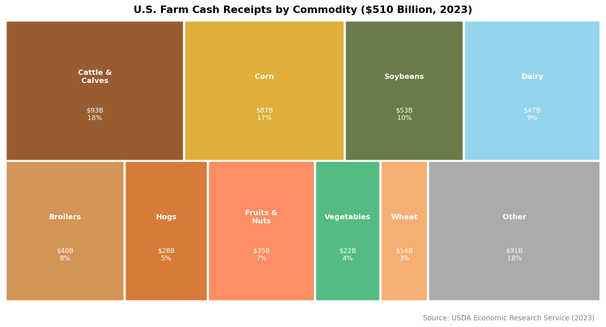
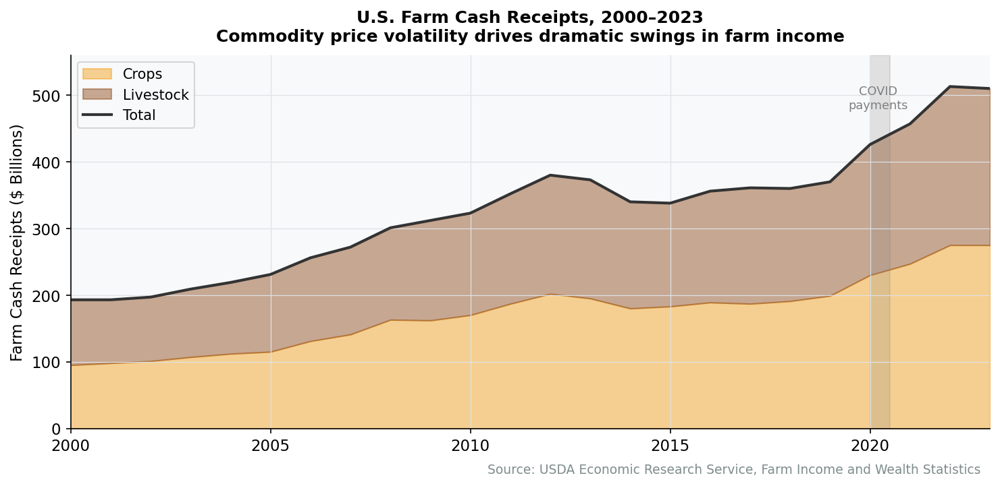
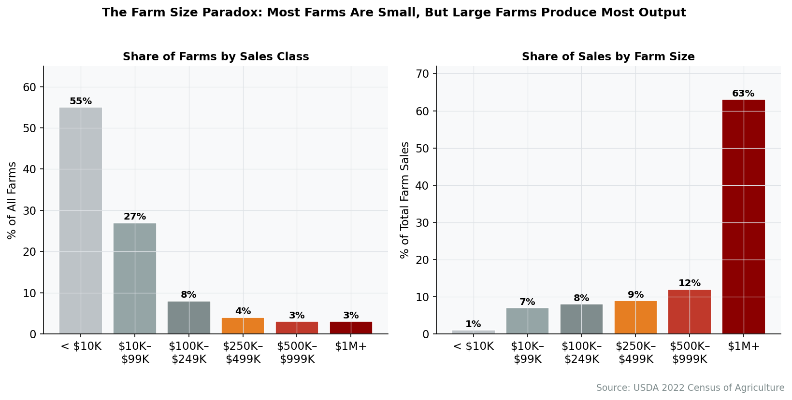
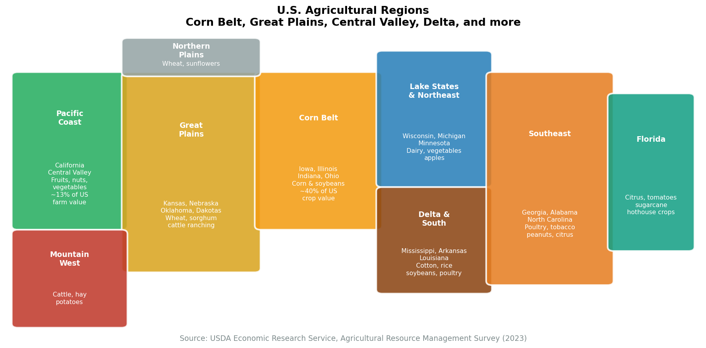

# Chapter 16. Agriculture and Food Production

Drive across Iowa in July and you will see corn in every direction---millions of acres of it, planted in rows so precise they look machined, tended by GPS-guided tractors that steer themselves to sub-inch accuracy. You will not see many people. A single farm operator, working 2,000 acres alone with $1 million in equipment, can produce enough corn to feed 2,500 people for a year. American agriculture feeds roughly 330 million Americans and exports enough to feed hundreds of millions more. It does this with fewer than 2.6 million farm workers---less than 2% of the labor force. No other sector in the economy has achieved such an extraordinary ratio of output to labor. And no other sector so thoroughly contradicts its own popular image: the romantic small family farm persists in the national imagination, but the reality is an industrial system dominated by large operations, multinational corporations, and commodity markets that set prices in Chicago and move grain across oceans.

The paradox of American agriculture is abundance and invisibility. The sector contributes barely 1% of GDP directly, yet it anchors a food system worth over $1.3 trillion---spanning processing plants, trucking fleets, grocery chains, and restaurant kitchens. It shapes the landscape of entire states, dominates the politics of rural America, and consumes more land than any other human activity on the continent. Agriculture is the foundation on which the rest of the economy was built. Understanding how it works today---who grows what, where, and under what economic pressures---reveals a system that is simultaneously one of America's greatest achievements and one of its most concentrated industries.

## Overview


**The Farm Economy vs. the Food Economy**

Agriculture's direct GDP contribution (~1%, roughly $200 billion) vastly understates its economic footprint. The broader food and agriculture system---including food processing, packaging, transportation, wholesale and retail distribution, and food service---accounts for roughly 5% of GDP and over $1.3 trillion in economic activity. About 21 million Americans work somewhere in this chain, even though fewer than 2.6 million work on farms.


### Size and Scope

- **Farm-level GDP contribution (2023)**: roughly $200 billion (crops ~$140B, livestock ~$60B in net value added)
- **Broader food system output**: roughly $1.3 trillion
- **Farm cash receipts (2023)**: roughly $510 billion (crops ~$275B, livestock ~$235B)
- **Farm employment**: roughly 2.6 million (farm operators and hired workers)
- **Broader food system employment**: roughly 21 million
- **Number of farms**: roughly 2 million (USDA definition: any place that produced or sold $1,000+ of agricultural products)
- **Total farmland**: roughly 895 million acres (about 39% of U.S. land area)
- **Agricultural exports (2023)**: roughly $170 billion

Farm cash receipts---the gross revenue farmers receive for crops and livestock---totaled roughly $510 billion in 2023. But net farm income, what remains after paying for inputs like seed, fertilizer, fuel, labor, and equipment, was roughly $155 billion. The difference reflects the capital- and input-intensive nature of modern farming: for every dollar of crop revenue, farmers spend 70-80 cents on inputs.

### Key Subsectors

| Subsector | Cash Receipts (2023) | Share | Key States |
|-----------|---------------------|-------|------------|
| Cattle and calves | $93 billion | 18% | TX, KS, NE |
| Corn | $87 billion | 17% | IA, IL, NE |
| Soybeans | $53 billion | 10% | IL, IA, MN |
| Dairy | $47 billion | 9% | CA, WI, ID |
| Broilers (chicken) | $40 billion | 8% | GA, AR, AL |
| Hogs | $28 billion | 5% | IA, MN, NC |
| Wheat | $14 billion | 3% | KS, ND, MT |
| Fruits and nuts | $35 billion | 7% | CA, FL, WA |
| Vegetables | $22 billion | 4% | CA, AZ, FL |
| Cotton | $8 billion | 2% | TX, GA, MS |
| Other | $83 billion | 17% | Various |

*Source: USDA Economic Research Service, Farm Income and Wealth Statistics, 2023*

<figure>

<figcaption>Figure 16.1: U.S. farm cash receipts by commodity. Cattle, corn, and soybeans dominate, but the sector is remarkably diverse. Source: USDA ERS (2023)</figcaption>
</figure>

<figure>

<figcaption>Figure 16.2: Total farm cash receipts, 2000-2023. Receipts surged after 2020 due to commodity price spikes, then partially retreated. Source: USDA ERS</figcaption>
</figure>

## How the Industry Works

### Revenue Streams: Where Does the Money Come From?

Farm revenue flows through several channels, each with its own pricing logic.

**Commodity crops (corn, soybeans, wheat, cotton)**

Most row crops are commodities---interchangeable units priced on futures exchanges. The Chicago Board of Trade sets benchmark prices for corn, soybeans, and wheat; farmers are price-takers. A corn farmer in Iowa has virtually no ability to charge a premium for her corn over her neighbor's. Revenue depends on two things: yield per acre (driven by weather, seed genetics, and farming practices) and the commodity price (driven by global supply and demand).

Farmers manage price risk through futures contracts and crop insurance. The federal crop insurance program, subsidized by the government, covers roughly 90% of major crop acreage. In a bad year, crop insurance payments can exceed $20 billion.

**Livestock**

Cattle, hogs, and poultry follow different models. Cattle ranchers typically sell calves to feedlots, which fatten them on corn for 4-6 months before selling to packers. Hog operations are increasingly vertically integrated, with large companies like Smithfield owning animals from birth to slaughter. Poultry is the most integrated: companies like Tyson and Perdue own the birds and the processing plants; contract growers simply provide the labor and the chicken houses.

**Specialty crops (fruits, vegetables, nuts)**

Higher-value crops command premium prices but require more labor, more specialized knowledge, and more capital per acre. California's Central Valley produces the vast majority of U.S. almonds, pistachios, strawberries, and lettuce. These crops depend heavily on irrigation and seasonal labor.

**Government payments**

Federal payments to farmers totaled roughly $15-20 billion annually in recent years (excluding the anomalous COVID-era payments of $45+ billion in 2020). These include commodity price support programs, conservation payments, and disaster assistance. Government payments represent roughly 3-4% of gross farm income in a normal year but can be much higher for specific crops and regions.

### Cost Structure: Where Does the Money Go?

Farm production expenses totaled roughly $430 billion in 2023. The major cost categories:

| Cost Category | Amount | Share |
|---------------|--------|-------|
| Feed | $75 billion | 17% |
| Farm services (custom work, labor) | $55 billion | 13% |
| Fertilizer and chemicals | $50 billion | 12% |
| Interest and rent | $45 billion | 10% |
| Seed | $30 billion | 7% |
| Fuel and oil | $22 billion | 5% |
| Livestock purchases | $40 billion | 9% |
| Equipment and repairs | $35 billion | 8% |
| Other | $78 billion | 19% |

*Source: USDA ERS, Farm Income and Wealth Statistics, 2023*

Land is the largest capital asset. U.S. farmland was worth roughly $3.5 trillion in 2023, with per-acre values ranging from under $1,000 in parts of the arid West to over $15,000 in prime Iowa cropland. Cash rents for Iowa farmland average $250-300 per acre; a 2,000-acre corn-soybean operation might pay $500,000 or more in annual rent alone.


**The Input Cost Squeeze**

Farmers face a persistent structural problem: the prices they pay for inputs (fertilizer, seed, equipment, land) tend to rise steadily, while the prices they receive for commodities fluctuate unpredictably. In the long run, commodity prices have been roughly flat in real terms, meaning farmers must constantly increase productivity just to stay even. This "cost-price squeeze" is the fundamental economic force driving farm consolidation.


### The Farm Bill

The Farm Bill, renewed approximately every five years, is the single most important piece of agricultural legislation. The most recent version (2018) authorized roughly $430 billion in spending over five years, but the vast majority---roughly 75-80%---goes to nutrition programs (primarily SNAP, formerly food stamps), not to farm subsidies. The agricultural title covers commodity programs, crop insurance, conservation, trade promotion, and rural development.

The Farm Bill's commodity programs provide a safety net through two main mechanisms: Price Loss Coverage (PLC), which pays farmers when commodity prices fall below reference levels, and Agriculture Risk Coverage (ARC), which pays when revenue falls below historical averages. Farmers choose between the two for each crop on each farm.

### Vertical Integration in Meat Processing

The meat industry has become strikingly vertical. In poultry, the integrator model is nearly universal: a company like Tyson owns the hatcheries, feed mills, and processing plants. Contract growers---independent farmers who raise the birds---invest $500,000-$1 million in chicken houses but own neither the birds nor the feed. They are paid per pound of weight gain, with bonuses and penalties based on performance relative to other growers. The grower bears the capital risk; the integrator controls the margins.

Hog production has followed a similar path. Smithfield Foods (owned by China's WH Group since 2013) controls operations from genetics to grocery shelf. In beef, vertical integration is less complete---cow-calf ranching remains mostly independent---but the packing segment is extraordinarily concentrated.

## Industry Structure

### Farm Size Distribution

The USDA counts roughly 2 million farms, but this number is misleading. The vast majority of farms are small, and most agricultural output comes from a small number of large operations.

| Farm Size (Annual Sales) | Number of Farms | Share of Farms | Share of Output |
|--------------------------|-----------------|----------------|-----------------|
| Less than $10,000 | 1,100,000 | 55% | 1% |
| $10,000 - $249,999 | 550,000 | 27% | 8% |
| $250,000 - $499,999 | 120,000 | 6% | 7% |
| $500,000 - $999,999 | 100,000 | 5% | 11% |
| $1 million+ | 130,000 | 7% | 73% |

*Source: USDA Census of Agriculture, 2022*

<figure>

<figcaption>Figure 16.3: The 7% of U.S. farms with annual sales above $1 million produce 73% of all agricultural output. Most farms are small, part-time operations. Source: USDA Census of Agriculture (2022)</figcaption>
</figure>

The 1.1 million farms with sales under $10,000 are mostly rural residences with some agricultural activity---hobby farms, horse properties, small timber tracts. Their operators typically earn most of their income from off-farm jobs. The 130,000 farms with sales above $1 million are the commercial core: these are sophisticated businesses managing thousands of acres or thousands of head of livestock.

### Major Agribusiness Firms

Agriculture is flanked by highly concentrated industries on both sides---the firms that sell inputs to farmers and the firms that buy and process what farmers grow.

**Grain Trading and Processing**

| Company | Revenue | Headquarters | Key Business |
|---------|---------|--------------|-------------|
| Cargill | $160 billion | Wayzata, MN | Grain trading, meat, food ingredients |
| Archer Daniels Midland (ADM) | $94 billion | Chicago, IL | Grain processing, oilseeds, ethanol |
| Bunge | $56 billion | St. Louis, MO | Grain trading, oilseed processing |
| Louis Dreyfus | $50 billion | Rotterdam (US ops) | Grain, oilseeds, sugar |

*Source: Company filings and estimates, FY 2023*

These four firms---known as the "ABCD" traders (ADM, Bunge, Cargill, Louis Dreyfus)---dominate global grain flows. They buy from millions of farmers, store grain in elevators spanning the Midwest, and sell to buyers worldwide.

**Meat Processing**

| Company | Revenue | Headquarters | Key Business |
|---------|---------|--------------|-------------|
| JBS USA | $53 billion (US) | Greeley, CO (Brazilian parent) | Beef, pork, poultry |
| Tyson Foods | $53 billion | Springdale, AR | Chicken, beef, pork |
| Cargill Protein | ~$20 billion | Wichita, KS | Beef, poultry |
| Smithfield Foods | ~$15 billion | Smithfield, VA | Pork (owned by WH Group) |
| Hormel Foods | $12 billion | Austin, MN | Branded meats |

*Source: Company filings, FY 2023*


**The Meatpacking Bottleneck**

Four companies---Tyson, JBS, Cargill, and National Beef---control over 80% of U.S. beef slaughter. Similar concentration exists in pork (roughly 70% by top four) and poultry (roughly 54% by top four). This concentration gives packers outsized bargaining power over both the ranchers who sell them cattle and the consumers who buy the finished product. During the 2020-2021 period, meatpacker margins surged while cattle ranchers saw little benefit from rising retail prices.


**Farm Inputs**

| Company | Revenue | Headquarters | Key Business |
|---------|---------|--------------|-------------|
| Deere & Company | $55 billion | Moline, IL | Farm equipment, precision ag |
| AGCO Corporation | $14 billion | Duluth, GA | Farm equipment (Massey Ferguson, Fendt) |
| Corteva Agriscience | $17 billion | Indianapolis, IN | Seeds, crop protection |
| Bayer Crop Science | $25 billion (global) | St. Louis, MO (US ops) | Seeds (Monsanto), herbicides |
| Nutrien | $29 billion | Saskatoon (major US ops) | Fertilizer, retail |
| CF Industries | $6 billion | Deerfield, IL | Nitrogen fertilizer |

*Source: Company filings, FY 2023*

The seed and chemical market was transformed by a wave of megamergers: Dow and DuPont merged, then spun off Corteva; Bayer acquired Monsanto for $63 billion (2018); ChemChina acquired Syngenta. Three companies now control over 60% of the global commercial seed market.

## Geographic Distribution

American agriculture is organized by geography as rigidly as any sector in the economy. Climate, soil, water, and topography dictate what grows where, creating distinct agricultural regions that have persisted for over a century.

<figure>

<figcaption>Figure 16.4: Major U.S. agricultural regions. Each region specializes in commodities suited to its climate, soil, and water resources. Source: USDA ERS</figcaption>
</figure>

### The Corn Belt (Iowa, Illinois, Indiana, Ohio, southern Minnesota, eastern Nebraska)

The heart of American agriculture. Deep, black prairie soils and reliable summer rainfall make this the most productive cropland on Earth. Iowa alone produces more corn than most countries. The Corn Belt produces roughly 60% of U.S. corn and 55% of U.S. soybeans, typically in annual rotation (corn one year, soybeans the next). Farmland here is the most expensive in the country---$10,000-$15,000 per acre---and is intensively managed.

### The Great Plains (Kansas, the Dakotas, Montana, Oklahoma, western Nebraska, western Texas)

Drier than the Corn Belt, the Great Plains specialize in wheat (Kansas is the top wheat state), grain sorghum, and cattle. The western Plains are dominated by ranching---vast ranches running cattle on grassland too dry to farm. Eastern portions, particularly where the Ogallala Aquifer allows irrigation, grow corn and cotton. The Ogallala, which underlies portions of eight states, is being depleted faster than it recharges, threatening the long-term viability of irrigated agriculture in the region.

### California's Central Valley

The most productive agricultural region in the country by dollar value. The Central Valley---a 450-mile trough between the Sierra Nevada and the Coast Ranges---produces over 250 crops, including nearly all U.S.-grown almonds, pistachios, walnuts, processing tomatoes, and table grapes. The valley relies almost entirely on irrigation, drawing from a complex system of federal and state water projects. Chronic water scarcity and recurring drought are existential threats: in drought years, hundreds of thousands of acres are fallowed.

### The Southeast (Georgia, Arkansas, Alabama, Mississippi, North Carolina)

The South leads in poultry production---Georgia is the number-one broiler state. Arkansas and Alabama rank second and third. The region also produces cotton, peanuts, tobacco (declining), and timber. North Carolina is the second-largest hog state (after Iowa), with large-scale confined hog operations concentrated in the eastern part of the state.

### The Delta (Mississippi Delta, Arkansas, Louisiana)

The alluvial floodplain of the Mississippi River produces rice, cotton, soybeans, and catfish (Mississippi leads U.S. catfish production). The Delta's flat topography and heavy clay soils are well-suited to rice paddies, making Arkansas the top rice-producing state.

### Texas

Texas leads the nation in cattle, cotton, and total farm cash receipts. The state's agricultural geography is diverse: cattle ranching across much of the state, cotton in the Panhandle and South Plains (irrigated from the Ogallala), citrus in the Rio Grande Valley, and rice along the Gulf Coast.

## The Workforce

### Farm Operators

Of the roughly 3.4 million farm operators counted by the USDA (many farms have multiple operators), the average age is 58---and rising. Fewer young people enter farming, partly because the capital requirements are enormous: a viable commercial row-crop operation in the Corn Belt requires $2-5 million in land and equipment.

Most small-farm operators work off-farm jobs. Among farms with sales under $250,000, roughly 75% of household income comes from non-farm sources. Farming, for the majority of America's farm operators, is a supplementary activity, not a primary occupation.

### Hired Farm Workers

Roughly 1.1 million workers are hired for farm labor, including roughly 250,000 workers on H-2A temporary agricultural visas (a number that has roughly tripled since 2015). The H-2A program allows employers to bring foreign workers for seasonal agricultural jobs when they cannot find sufficient domestic labor.

Hired farm workers are disproportionately Hispanic (roughly 75%) and foreign-born (roughly 60%). Many work seasonally, following harvest cycles from south to north. Wages for field workers average $15-18 per hour, though piece-rate workers picking high-value crops can earn more. Farm labor is physically demanding, often performed in extreme heat, and carries higher injury rates than most occupations.


**The H-2A Visa Program**

The H-2A temporary agricultural worker program has become the primary legal channel for seasonal farm labor. Employers must demonstrate that domestic workers are unavailable and must provide housing, transportation, and wages at or above the "adverse effect wage rate" (ranging from roughly $14 to $19/hour depending on the state). H-2A usage surged from roughly 80,000 certified positions in 2015 to over 370,000 in 2023, reflecting both tightening labor markets and increased enforcement against unauthorized workers.


### Meatpacking Workers

Meatpacking plants employ roughly 500,000 workers in some of the most physically demanding and dangerous jobs in the economy. The industry relies heavily on immigrant labor---plants in towns like Lexington, Nebraska; Marshalltown, Iowa; and Gainesville, Georgia have transformed the demographics of rural communities. Meatpacking wages average $16-20 per hour, and the work involves standing for long shifts performing repetitive cutting motions in cold, wet environments. Injury rates, while improved from the 1990s, remain well above the manufacturing average.

### Key Occupations

| Occupation | Employment | Median Wage |
|------------|------------|-------------|
| Farmers, ranchers, farm managers | 970,000 | Varies widely |
| Farmworkers and laborers (crops) | 570,000 | $33,000 |
| Farmworkers (livestock) | 260,000 | $32,000 |
| Agricultural equipment operators | 50,000 | $36,000 |
| Meat, poultry, fish cutters | 500,000 | $35,000 |
| Food batchmakers, processing | 200,000 | $37,000 |
| Agricultural inspectors | 20,000 | $46,000 |

*Source: Bureau of Labor Statistics, Occupational Employment and Wage Statistics, 2023*

## Regulation and Policy

### Key Regulatory Agencies

**USDA (United States Department of Agriculture)**

The primary agency governing agriculture. The USDA has over 100,000 employees and a budget exceeding $200 billion (mostly nutrition programs). Key sub-agencies include:
- **Farm Service Agency (FSA)**: Administers commodity programs, crop insurance, and farm loans
- **Natural Resources Conservation Service (NRCS)**: Conservation programs and technical assistance
- **Agricultural Marketing Service (AMS)**: Marketing orders, grading, organic certification
- **Animal and Plant Health Inspection Service (APHIS)**: Animal disease, plant pests, agricultural imports
- **Food Safety and Inspection Service (FSIS)**: Meat and poultry inspection

**EPA (Environmental Protection Agency)**

Regulates pesticide registration and use, agricultural water discharges, and air emissions from livestock operations. The EPA's regulation of atrazine, glyphosate, and other widely used herbicides directly affects farming practices and costs.

**FDA (Food and Drug Administration)**

Regulates food safety for all products except meat and poultry (which fall under USDA/FSIS). The Food Safety Modernization Act (2011) shifted FDA's approach from responding to contamination to preventing it.

### The Farm Bill: Structure and Spending

The Farm Bill is less a single policy than a massive legislative package bundling disparate programs. Its major titles:

| Title | Spending (5-year est.) | Share |
|-------|----------------------|-------|
| Nutrition (SNAP) | $340 billion | 76% |
| Crop insurance | $47 billion | 11% |
| Commodity programs | $20 billion | 5% |
| Conservation | $28 billion | 6% |
| Trade | $4 billion | 1% |
| Other (rural dev, research, etc.) | $5 billion | 1% |

*Source: Congressional Budget Office, 2018 Farm Bill baseline*


**Why Nutrition Dominates the Farm Bill**

The political alliance between farm-state legislators (who want commodity and crop insurance programs) and urban legislators (who want nutrition assistance) has sustained the Farm Bill for decades. Neither group has enough votes alone to pass its priorities. By bundling SNAP with farm subsidies, the coalition assembles a majority. This is why the Farm Bill---nominally about agriculture---is primarily a nutrition spending bill.


### Agricultural Subsidies and Their Distribution

Federal agricultural subsidies---including commodity payments, crop insurance premium subsidies, and conservation payments---flow disproportionately to large operations. The top 10% of farm subsidy recipients receive roughly 70% of all payments. Subsidies concentrate in the Corn Belt and Great Plains, where commodity crops dominate. Fruit and vegetable growers---the producers of what nutritionists want Americans to eat more of---receive relatively little federal support.

## Trade Associations and Lobbying

### Major Trade Associations

| Association | Members | Focus |
|-------------|---------|-------|
| American Farm Bureau Federation | 5.5 million member families | Broad agricultural policy |
| National Cattlemen's Beef Association | 175,000 cattlemen | Beef industry interests |
| National Corn Growers Association | 300,000 corn farmers | Corn policy, ethanol |
| American Soybean Association | 500,000 soybean farmers | Soybean trade, biodiesel |
| National Pork Producers Council | 60,000 pork producers | Pork industry regulation |
| National Milk Producers Federation | Dairy cooperatives | Dairy pricing, trade |
| International Dairy Foods Association | Dairy processors | Dairy regulation |

*Source: Association websites and public filings, 2024*

### Political Influence

The farm lobby wields political power disproportionate to agriculture's share of the economy. Several factors explain this:

**Geographic advantage.** Farm states are overrepresented in the Senate. Wyoming (population 580,000) and California (population 39 million) each get two senators, giving rural interests outsized legislative influence. The Senate Agriculture Committee is dominated by members from farm states.

**Commodity checkoff programs.** Mandatory assessments on commodity sales (e.g., $1 per head of cattle sold) fund promotion and research boards like the National Dairy Promotion Board and the Beef Checkoff. These programs generate hundreds of millions in annual revenue for commodity promotion.

**Ethanol mandate.** The Renewable Fuel Standard requires blending roughly 15 billion gallons of corn ethanol into the gasoline supply annually, consuming roughly 35-40% of the U.S. corn crop. This mandate is fiercely defended by corn-state legislators, as it provides a guaranteed demand floor for corn.

Agricultural lobbying spending totals roughly $160 million annually at the federal level, with the American Farm Bureau, crop-specific groups, and individual agribusiness firms among the top spenders.

## Recent Trends

### 1. Precision Agriculture and Farm Technology

Modern farming is increasingly a technology business. GPS-guided auto-steer tractors are standard on commercial farms. Variable-rate technology adjusts seed and fertilizer application acre by acre based on soil data and yield maps. Drones monitor crop health. Sensors track soil moisture in real time.

John Deere has positioned itself as an agricultural technology company as much as an equipment manufacturer. Its precision agriculture platform collects data from millions of acres, creating a digital ecosystem that competitors struggle to match. The data raises questions about who owns farm data and whether equipment manufacturers' control over software gives them excessive power over farmers---a conflict that has fueled the "right to repair" movement.

### 2. Consolidation of Farmland

The number of farms has declined from 6.8 million in 1935 to roughly 2 million today, while average farm size has more than tripled. This consolidation continues: mid-size farms (sales of $250,000 to $999,999) are being squeezed out, with acreage flowing to the largest operations. Institutional investors, including pension funds, REITs, and family offices, have entered farmland markets, driving up prices and changing the ownership structure of rural America. Bill Gates has become the largest private farmland owner in the country, with roughly 270,000 acres.

### 3. Climate Change and Agricultural Adaptation

Climate change is already reshaping American agriculture. Growing seasons have lengthened in northern states, allowing corn production to push into areas previously too cold. But heat stress, drought, and extreme weather events impose mounting costs: prevented planting claims, crop insurance payouts, and livestock losses have all trended upward. The Ogallala Aquifer's depletion compounds the problem in the Great Plains. Farmers are adapting through drought-tolerant seed varieties, cover crops, no-till farming, and shifting crop mixes, but the pace of climate change may outrun adaptation in some regions.

### 4. Alternative Proteins and Lab-Grown Meat

Plant-based meat companies (Beyond Meat, Impossible Foods) and cultivated meat startups have attracted billions in investment, though consumer adoption has plateaued after initial enthusiasm. Plant-based meat represents less than 1.5% of retail meat sales by volume. Cultivated (lab-grown) meat received its first USDA approvals in 2023 but remains far from commercial scale. The traditional meat industry has responded with both defensive lobbying (state-level labeling laws restricting use of the word "meat" for plant-based products) and its own product development.

### 5. Rising Input Costs and Farm Financial Stress

Fertilizer prices spiked sharply in 2022 following the Russia-Ukraine war (Russia and Belarus are major fertilizer exporters), and while they have retreated, they remain elevated relative to pre-2020 levels. Equipment costs, land rents, and interest rates have also risen. Meanwhile, commodity prices fell from their 2022 peaks. The result is a cost-price squeeze that has reduced net farm income from its 2022 record and placed financial pressure on operations that expanded during the boom years.

## Firm Profiles

### Cargill

> **Quick Facts**
> - Headquarters: Wayzata, Minnesota
> - Founded: 1865
> - Revenue: $160 billion (FY 2023)
> - Employees: roughly 160,000
> - Ownership: Private (Cargill and MacMillan families)

Cargill is the largest private company in the United States by revenue---and one of the most powerful firms most Americans have never heard of. Founded by William Cargill in 1865 as a single grain warehouse in Conover, Iowa, the company has grown into a global colossus that trades, processes, and transports agricultural commodities across 70 countries.

Cargill's business spans the agricultural supply chain: it buys grain from farmers at country elevators across the Midwest, transports it by barge, rail, and ship, processes it into animal feed, corn sweeteners, ethanol, and cooking oils, and sells the finished products to food manufacturers and livestock operations worldwide. The company is also a major meat processor (the third-largest U.S. beef packer) and a significant player in financial trading of agricultural commodities.

Cargill's private ownership is central to its strategy. Freed from quarterly earnings pressure, the company can take long-term positions, absorb cyclical losses, and invest counter-cyclically. The Cargill and MacMillan families, descendants of the founder, own roughly 88% of the company. This structure has sustained the business through 160 years of commodity booms and busts. But it also limits transparency: Cargill discloses far less than publicly traded peers, and its environmental and labor practices face growing scrutiny from activists and policymakers.

### John Deere (Deere & Company)

> **Quick Facts**
> - Headquarters: Moline, Illinois
> - Founded: 1837
> - Revenue: $55 billion (FY 2023)
> - Employees: roughly 83,000
> - Market Cap: roughly $105 billion

John Deere is synonymous with American farming. The company's green-and-yellow tractors are as iconic as the landscape they work, and Deere commands roughly 60% of the U.S. large agricultural equipment market---a dominance that approaches monopoly in some categories.

Deere's competitive advantage rests on three pillars. First, a dealer network of roughly 2,000 locations that provides financing, parts, and service---a relationship infrastructure no competitor can easily replicate. Second, product quality and brand loyalty built over nearly two centuries. Third, and increasingly important, a precision agriculture technology platform that collects and analyzes data from Deere equipment operating on millions of acres.

The technology strategy is both Deere's greatest growth opportunity and its most contentious feature. The company's digital ecosystem---sensors, software, GPS guidance, and data analytics---promises to make farming more efficient. But farmers complain that software locks on Deere equipment prevent independent repair, force reliance on expensive dealer service, and raise questions about data ownership. The "right to repair" movement, which has won legislative victories in several states, targets Deere more than any other company. In 2023, Deere signed a memorandum of understanding with the American Farm Bureau Federation committing to expand access to repair tools and software, though critics argue the concessions are insufficient.

### Tyson Foods

> **Quick Facts**
> - Headquarters: Springdale, Arkansas
> - Founded: 1935
> - Revenue: $53 billion (FY 2023)
> - Employees: roughly 142,000
> - Market Cap: roughly $18 billion

Tyson Foods is the largest U.S. meat and poultry company, processing roughly one in five pounds of all chicken, beef, and pork produced in the country. The company traces its origins to John W. Tyson, who began hauling chickens from Arkansas to markets in the Midwest during the Depression.

Tyson's scale is staggering: the company slaughters roughly 35 million chickens, 125,000 cattle, and 415,000 hogs per week. Its operations span the supply chain from animal feed mills and hatcheries to processing plants and branded consumer products (Tyson, Jimmy Dean, Hillshire Farm, Ball Park).

The poultry segment, Tyson's original business, operates on the integrator model: Tyson owns the birds, supplies the feed, and processes the meat, while roughly 3,700 contract growers provide the labor and facilities. This model keeps capital requirements off Tyson's balance sheet while maintaining control over quality and volume.

Tyson has faced recurring controversies: antitrust investigations into price-fixing (the company paid over $220 million to settle chicken price-fixing claims in 2021), workplace safety issues (particularly during the COVID-19 pandemic, when meatpacking plants became major infection sites), environmental complaints about water pollution from poultry operations, and labor practices at its processing plants. The company has invested in automation to reduce labor dependence and improve working conditions, but the nature of meat processing makes full automation elusive.

## Key Takeaways

1. **American agriculture is extraordinarily productive but economically small.** Fewer than 2% of workers farm, and agriculture's direct GDP share is roughly 1%---but the broader food system employing 21 million people and generating over $1.3 trillion depends on what those farms produce.

2. **Most farms are small; most production comes from large farms.** The 7% of farms with annual sales above $1 million produce 73% of output. The "average farm" is a statistical fiction that obscures a deeply bifurcated industry.

3. **Agriculture is flanked by concentrated industries.** Farmers operate in a competitive commodity market, but the firms that sell them inputs (seeds, chemicals, equipment) and the firms that buy their output (grain traders, meat packers) are highly concentrated, giving those intermediaries disproportionate market power.

4. **Geography dictates what grows where.** The Corn Belt, Great Plains, Central Valley, and Southeast each specialize based on climate, soil, and water---a pattern that has persisted for generations and will be disrupted by climate change.

5. **The Farm Bill is mostly a nutrition bill.** Three-quarters of Farm Bill spending goes to SNAP and other nutrition programs, not farm subsidies. The political coalition that sustains this arrangement---urban legislators backing nutrition, rural legislators backing farm programs---has held for decades.

6. **Technology is transforming farming faster than the public realizes.** Precision agriculture, GPS-guided equipment, data analytics, and genetic technology have made farming a high-tech industry---and have raised new questions about data ownership, equipment repair, and the relationship between farmers and technology companies.

7. **The agricultural workforce depends heavily on immigrant labor.** From field crops to meatpacking, immigrant workers---both authorized and unauthorized---perform much of the physical labor in American food production. The H-2A visa program has grown dramatically but remains contentious.

## Data Sources and Further Reading

### Key Data Sources

- **USDA Economic Research Service (ERS)**: Farm income, food spending, trade data, and rural economics. The authoritative source for agricultural economics.
- **USDA National Agricultural Statistics Service (NASS)**: Crop production, acreage, livestock inventories, prices, and the Census of Agriculture (conducted every five years).
- **Bureau of Labor Statistics**: Agricultural employment and wages data through the Occupational Employment and Wage Statistics and Quarterly Census of Employment and Wages.
- **USDA Foreign Agricultural Service**: Agricultural trade data, export forecasts, and international market analysis.
- **Congressional Budget Office**: Farm Bill cost estimates and baseline projections.

### Further Reading

- Wendell Berry, *The Unsettling of America: Culture and Agriculture* (1977) --- The classic critique of industrial agriculture and its effects on rural communities
- Michael Pollan, *The Omnivore's Dilemma* (2006) --- Traces the American food chain from Iowa cornfields to the dinner table
- Christopher Leonard, *The Meat Racket* (2014) --- Investigative account of the poultry integrator model and its effects on contract farmers
- Ted Genoways, *The Chain: Farm, Factory, and the Fate of Our Food* (2014) --- Inside the meatpacking industry and the human costs of consolidation
- Nathan Rosenberg, *Inside the California Food Revolution* (2017) --- The economic and agricultural transformation of the Central Valley

---

*Chapter 16 | Agriculture and Food Production*
*The American Economy: A Structural Geography*
*Draft v1 --- February 2026*
