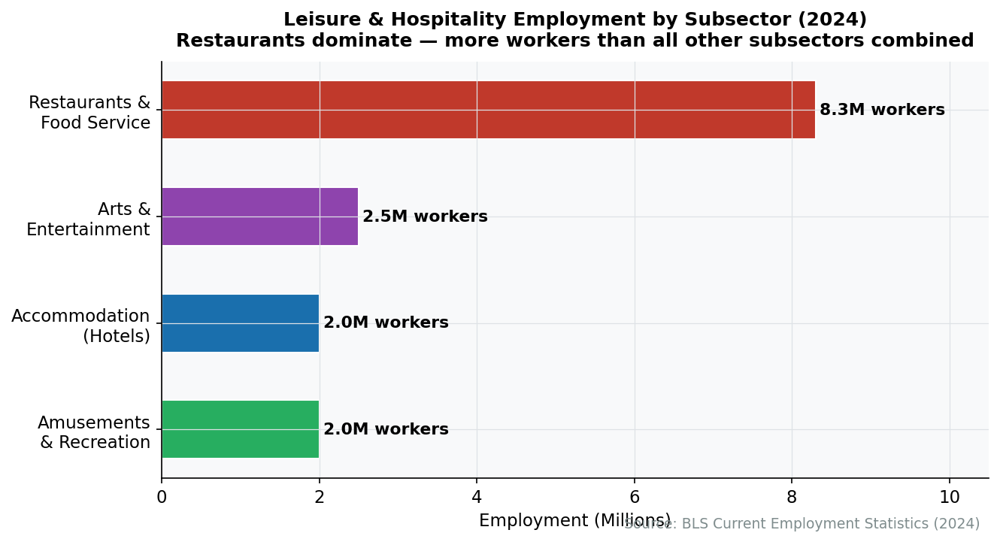
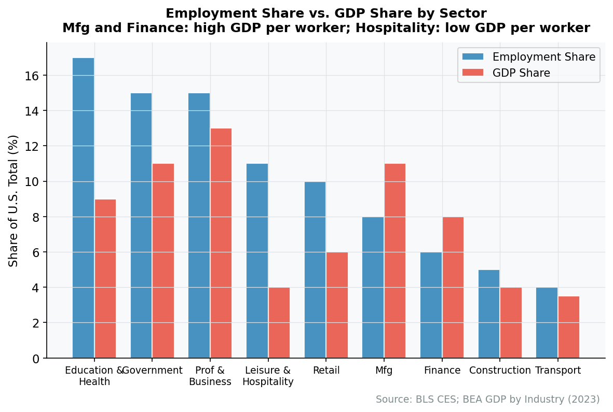
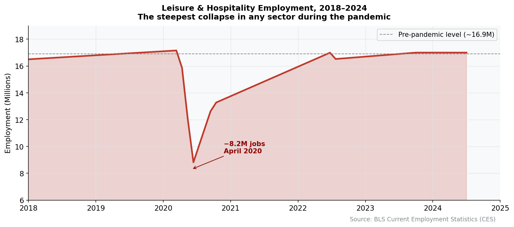
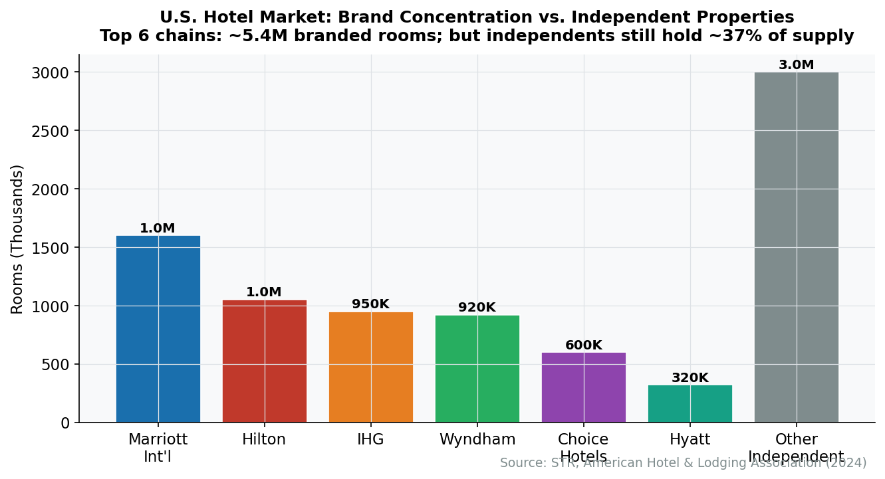
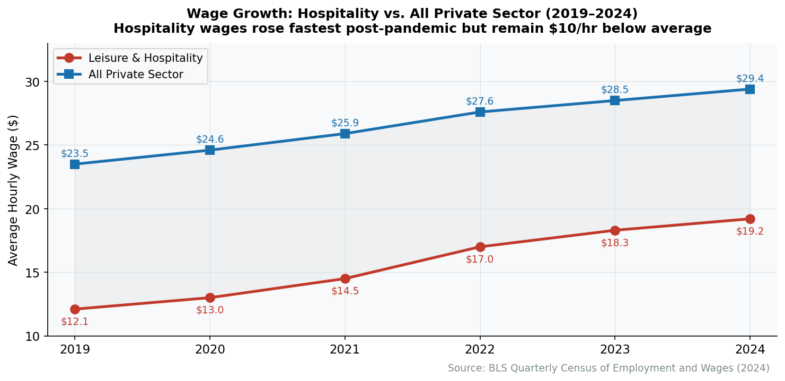

# Chapter 17: Leisure and Hospitality

In April 2020, the leisure and hospitality sector lost 8.2 million jobs in a single month---more than any other sector lost during the entire Great Recession. Restaurants went dark. Hotels emptied. Theme parks locked their gates. The pandemic revealed what economists had long known but rarely said plainly: this is the most fragile major sector in the American economy. It is built on discretionary spending, physical presence, and human labor that cannot be performed remotely. When the world shut down, leisure and hospitality was the first casualty and the last to recover.

The sector's structural position is equally striking in normal times. Leisure and hospitality employs 11% of all nonfarm workers in the United States but produces only about 4% of GDP---the largest gap between employment share and output share in the entire economy. That gap tells you almost everything about how this industry works: millions of workers, modest wages, thin margins, and an economic contribution that flows less through value-added per worker than through sheer volume of people cooking, cleaning, serving, and entertaining.

## Overview


**The Low-Productivity Paradox**

Leisure and hospitality employs more Americans than construction, finance, or information technology. Yet its output per worker is among the lowest of any major sector. The reason is structural: a hotel room must be cleaned by hand, a meal must be prepared to order, a concert must be performed live. These services resist the automation and scaling that drive productivity in manufacturing or technology. The result is an industry that runs on labor volume rather than labor efficiency.


### Size and Scope

- **GDP contribution**: Approximately $1.1 trillion (~4% of GDP)
- **Employment**: 16.8 million workers (11% of nonfarm employment)
- **Establishments**: Over 1 million restaurants, ~55,000 hotels, plus tens of thousands of entertainment venues, amusement parks, and recreation facilities
- **Annual consumer spending on food away from home**: $1.1 trillion (2023)
- **Annual hotel revenue**: ~$220 billion
- **Annual gaming revenue**: ~$67 billion (commercial casinos)

The sector's employment footprint is enormous relative to its economic output. For comparison, the information sector produces about the same share of GDP with one-fifth the workforce. Leisure and hospitality is, in essence, the inverse of technology: labor-intensive, low-margin, and deeply tied to physical place.

### Key Subsectors

| Subsector | Employment | Establishments | Annual Revenue |
|-----------|-----------|----------------|----------------|
| Restaurants and food services | 12.4 million | 1,000,000+ | $1.1 trillion |
| Hotels and accommodation | 1.9 million | 55,000+ | $220 billion |
| Arts, entertainment, and recreation | 2.5 million | 130,000+ | $170 billion |
| Gambling and casinos | 700,000 | 1,000+ | $67 billion |
| Amusement parks and attractions | 200,000 | 3,000+ | $28 billion |

*Source: Bureau of Labor Statistics, National Restaurant Association, American Hotel & Lodging Association, American Gaming Association (2023)*

<figure>

<figcaption>Figure 17.1: Leisure and hospitality employment by subsector. Restaurants dominate, accounting for nearly three-quarters of all jobs in the sector. Source: BLS (2023)</figcaption>
</figure>

Restaurants are the gravitational center. With over 12 million workers, food service alone employs more people than the entire manufacturing sector. Hotels, arts and entertainment, and gaming fill out the rest, but the economics of this industry are overwhelmingly the economics of restaurants.

<figure>

<figcaption>Figure 17.2: Employment share vs. GDP share across major sectors. Leisure and hospitality has the largest gap---11% of workers producing 4% of output. Source: BLS and BEA (2023)</figcaption>
</figure>

## How the Industry Works

### Restaurant Economics

The restaurant business is a margin trap. The typical full-service restaurant operates on a cost structure that leaves almost nothing for profit:

- **Food costs**: 28-35% of revenue (the "food cost ratio")
- **Labor costs**: 28-35% of revenue (including wages, benefits, payroll taxes)
- **Occupancy costs**: 6-10% (rent, utilities, insurance)
- **Other operating costs**: 15-20% (supplies, marketing, repairs, technology)
- **Profit margin**: 3-9% in a good year; many restaurants operate at a loss

This means a restaurant generating $1 million in annual revenue might clear $50,000 in profit---before the owner pays themselves. The failure rate is legendary: about 60% of restaurants close within their first year, and 80% within five years. Independent restaurants face even steeper odds than chains.


**The "90% Fail" Myth**

The often-cited claim that 90% of restaurants fail in the first year is false. Actual first-year closure rates run closer to 60%, and many closures reflect planned exits or ownership transfers rather than bankruptcy. But the underlying reality is harsh enough: restaurants are among the most difficult businesses to sustain. Thin margins, intense competition, and high fixed costs create a sector where even good operators frequently lose money.


Fast food and fast-casual chains achieve better margins (8-15%) through standardization, volume purchasing, and lower labor costs per transaction. A McDonald's franchise generates average annual sales of about $3.7 million per location, with franchisee profit margins around 15-20% before debt service and franchise fees.

### Hotel Economics

Hotels operate on a different economic logic. The key metric is **RevPAR**---revenue per available room---which combines occupancy rate and average daily rate (ADR) into a single number.

- **Average US hotel occupancy**: ~63% (2023)
- **Average daily rate (ADR)**: ~$155
- **Average RevPAR**: ~$98

Hotel costs are heavily front-loaded in real estate and construction. A typical limited-service hotel costs $80,000-$120,000 per room to build; a luxury property can run $500,000+ per room. Once built, the marginal cost of filling an empty room is minimal---housekeeping, linens, utilities. This creates powerful incentives to fill rooms even at discounted rates, since empty rooms generate zero revenue against fixed costs.

The industry has converged on three business models:

1. **Franchise model** (dominant): The hotel brand (Marriott, Hilton) licenses its name, reservation system, and standards to a property owner who handles operations. The brand collects franchise fees (4-6% of revenue) with minimal capital at risk.
2. **Management contracts**: The brand manages the property for a fee but does not own it. Common for upscale properties.
3. **Owner-operated**: The brand both owns and operates the property. Increasingly rare among major chains, which prefer "asset-light" models.

### The Franchise Model

Franchising is the structural backbone of both the restaurant and hotel industries. In food service, about 36% of all restaurants are franchised---but franchised locations account for a disproportionate share of revenue because they skew toward large chains.

The franchise model works because it solves two problems simultaneously. The franchisee gets a proven brand, operating system, and supply chain. The franchisor gets rapid expansion without deploying capital. McDonald's earns most of its revenue not from selling hamburgers but from collecting rent and franchise fees. Marriott does not own most of the buildings bearing its name.


**The Real Estate Insight**

McDonald's is often described as a real estate company that happens to sell hamburgers. The corporation owns or leases the land and buildings for most of its franchise locations, then subleases them to franchisees at a markup. This structure gives McDonald's both a steady rental income stream and leverage over franchisees who cannot easily walk away from a location. The company's real estate portfolio is worth an estimated $40+ billion.


### Entertainment and Recreation Economics

The entertainment segment is more diverse and less standardized. Live events (concerts, sports, theater) operate on a "perishable inventory" model similar to hotels: an unsold seat for tonight's show cannot be sold tomorrow. This drives aggressive dynamic pricing---the same concert ticket might cost $50 or $500 depending on when you buy it and where you sit.

Theme parks operate on a "gate plus capture" model: charge admission, then capture additional spending on food, merchandise, and premium experiences inside the park. Disney's domestic theme parks generate $8-9 billion annually, with per-capita guest spending exceeding $200 per visit.

Casinos invert the model entirely. Gaming revenue is the draw, but the real money increasingly comes from non-gaming amenities---hotels, restaurants, entertainment, conventions. Las Vegas Strip casinos now derive about 65% of revenue from non-gaming sources, up from 40% two decades ago.

### Seasonality and Cyclicality

Leisure and hospitality is the most cyclical major sector. Consumer spending on restaurants, hotels, and entertainment is discretionary---the first thing cut in a recession and the last to recover. Hotel RevPAR fell 47% during the 2008-2009 recession and took four years to recover. The pandemic was worse: RevPAR fell 47% in a single quarter.

Seasonality compounds the problem. Ski resorts operate five months a year. Beach hotels see 60-70% of annual revenue between Memorial Day and Labor Day. Even urban restaurants face predictable seasonal swings, with December peaks and January troughs. This unevenness forces operators to staff up temporarily and manage cash flow across lean months.

<figure>

<figcaption>Figure 17.3: Leisure and hospitality employment through recessions. The sector consistently suffers deeper losses and slower recoveries than the overall economy. The COVID-19 shock dwarfed all prior downturns. Source: BLS (2000-2024)</figcaption>
</figure>

## Industry Structure

The leisure and hospitality sector is simultaneously one of the most concentrated and most fragmented industries in America. A handful of global corporations dominate hotels, fast food, and live entertainment. Yet independent restaurants---single-location, owner-operated businesses---still account for close to 60% of all restaurant establishments and about 50% of restaurant revenue. No other major industry has this degree of structural dualism.

### Restaurants

**Fast food and fast casual**: The segment is dominated by a small number of enormous chains.

| Company | US Locations | US System Sales | Headquarters |
|---------|-------------|----------------|--------------|
| McDonald's | 13,400 | $53 billion | Chicago, IL |
| Starbucks | 16,300 | $29 billion | Seattle, WA |
| Chick-fil-A | 3,000 | $22 billion | Atlanta, GA |
| Taco Bell (Yum! Brands) | 8,200 | $15 billion | Irvine, CA |
| Wendy's | 5,700 | $12 billion | Dublin, OH |
| Chipotle | 3,500 | $10 billion | Newport Beach, CA |

*Source: Company filings, Technomic (2023)*

Chick-fil-A is the outlier. With fewer than 3,000 locations (compared to McDonald's 13,400), it generates $22 billion in US sales---an average of over $7 million per restaurant, nearly double McDonald's per-unit volume. It achieves this while being closed on Sundays. The company's tightly controlled franchise model (operators do not own their locations and can operate only one) and fanatical operational standards produce extraordinary unit economics.

**Casual dining**: Companies like **Darden Restaurants** (Olive Garden, LongHorn Steakhouse; $11 billion revenue) and **Brinker International** (Chili's, Maggiano's; $4.4 billion revenue) dominate the sit-down chain segment. But casual dining has struggled for two decades, squeezed between fast-casual chains offering similar quality at lower prices and fine dining offering a superior experience.

**Independent restaurants**: Some 600,000 independent restaurants operate across the country, from neighborhood diners to Michelin-starred establishments. They are the lifeblood of local food culture but face structural disadvantages in purchasing power, technology, and brand recognition compared to chains.

### Hotels

The global hotel industry is dominated by five companies that together control over 40% of US rooms:

| Company | US Hotels | US Rooms | Revenue | Model |
|---------|-----------|----------|---------|-------|
| Marriott International | 5,900 | 800,000 | $23.7 billion | Franchise/management |
| Hilton Worldwide | 5,600 | 660,000 | $10.2 billion | Franchise/management |
| IHG (Holiday Inn, Crowne Plaza) | 3,900 | 460,000 | $4.3 billion | Franchise/management |
| Wyndham (Super 8, Days Inn) | 5,600 | 410,000 | $1.4 billion | Franchise |
| Hyatt Hotels | 730 | 130,000 | $6.7 billion | Franchise/management |

*Source: Company 10-K filings, STR (2023)*

All five have converged on an "asset-light" franchise model. Marriott owns very few of the buildings carrying its name; it collects franchise fees, management fees, and loyalty program revenue. This model generates high returns on capital and insulates the brand from the capital intensity and real estate risk of hotel ownership. The actual hotels are typically owned by real estate investment trusts (REITs) like Host Hotels, Park Hotels, or private equity firms.

### Entertainment

Live entertainment is increasingly consolidated. **Live Nation Entertainment**, which merged with Ticketmaster in 2010, controls approximately 70% of major concert venue ticketing and manages over 500 artists. This vertical integration---artist management, venue operation, and ticketing---gives Live Nation extraordinary market power and has drawn antitrust scrutiny from the Department of Justice.

**Disney** dominates the theme park segment, operating Walt Disney World (Orlando), Disneyland (Anaheim), and parks in Paris, Tokyo, Shanghai, and Hong Kong. Its domestic parks alone generate $8-9 billion in annual revenue. **Universal Parks** (owned by Comcast/NBCUniversal), **Six Flags/Cedar Fair** (merged in 2024), and **SeaWorld** compete but at much smaller scale.

The casino industry is controlled by a handful of operators: **MGM Resorts**, **Caesars Entertainment**, and **Las Vegas Sands** dominate Las Vegas and Macau. The expansion of legal sports betting (now live in 38 states) has created a parallel digital gambling market dominated by **FanDuel** (owned by Flutter Entertainment) and **DraftKings**.

## Geographic Distribution

Leisure and hospitality is one of the most geographically uneven sectors in the economy. While every town has restaurants, the higher-value segments---hotels, entertainment, gaming---concentrate intensely in specific places.

### Tourism Destinations

A small number of cities account for a wildly disproportionate share of hotel room revenue and tourism employment:

- **Las Vegas**: 150,000+ hotel rooms, $15 billion in annual gaming revenue, tourism as the dominant industry. The city is, in economic terms, a single-industry town dressed up as a playground.
- **Orlando**: 130,000+ hotel rooms, driven by Disney World, Universal, and SeaWorld. Tourism supports about 1 in 3 jobs in the metro area.
- **New York City**: The nation's most valuable hotel market by RevPAR, plus the densest restaurant market in the country (some 27,000 restaurants).
- **Honolulu**: Tourism accounts for around 20% of Hawaii's GDP---the highest tourism dependence of any state.

### Convention Cities

A second tier of hospitality concentration exists in convention and conference destinations. Cities like Las Vegas, Orlando, Chicago, San Diego, and Nashville have invested heavily in convention center capacity, generating tens of billions in associated hotel, restaurant, and entertainment spending. Chicago's McCormick Place, the largest convention center in North America, drives an estimated $2 billion in annual economic impact.

### Seasonal Geographies

Many hospitality markets are radically seasonal:

- **Ski towns** (Aspen, Park City, Vail): Packed December through March, quiet in shoulder seasons, with a secondary summer hiking season increasingly important.
- **Beach towns** (Myrtle Beach, Cape Cod, the Outer Banks): 60-70% of annual revenue concentrated in June through August.
- **National park gateways** (Springdale near Zion, Tusayan near Grand Canyon): Economies entirely dependent on park visitation, which has surged post-pandemic to record levels.

These seasonal economies face acute labor challenges---they need workers for four months, but workers need jobs for twelve.

<figure>

<figcaption>Figure 17.4: Hotel room concentration by metro area. Las Vegas, Orlando, and New York dominate, with room inventories far exceeding other cities. Source: STR (2023)</figcaption>
</figure>

## The Workforce

### The Largest Low-Wage Employer

Leisure and hospitality is the largest low-wage employer in the American economy. The median hourly wage across the sector is approximately $16.60---the lowest of any major industry and about 60% of the all-industry median. Nearly half of all workers earning at or below the federal minimum wage work in food service.

| Occupation | Employment | Median Hourly Wage |
|------------|-----------|-------------------|
| Fast food and counter workers | 3.9 million | $13.50 |
| Waiters and waitresses | 2.4 million | $14.20* |
| Cooks, restaurant | 1.4 million | $15.80 |
| Bartenders | 690,000 | $14.50* |
| Hotel desk clerks | 260,000 | $14.70 |
| Maids and housekeeping | 840,000 | $14.90 |
| Food service managers | 430,000 | $30.80 |
| Chefs and head cooks | 160,000 | $28.40 |
| Gaming dealers | 80,000 | $13.00* |

*\* Tipped occupations; reported wages exclude tips. Actual compensation is higher but variable.*

*Source: Bureau of Labor Statistics, Occupational Employment and Wage Statistics (May 2023)*

### The Tipped Wage System

The federal tipped minimum wage has been frozen at $2.13 per hour since 1991---over three decades without an increase. Employers are legally required to make up the difference if tips do not bring total compensation to the regular minimum wage ($7.25 federal), but enforcement is uneven. Seven states (California, Oregon, Washington, Nevada, Minnesota, Montana, Alaska) require full minimum wage before tips. The result is dramatic geographic variation in server compensation.


**The Tipped Wage Misconception**

Many people assume that restaurant servers are universally low-paid. In reality, compensation varies enormously. A server at a busy upscale restaurant in Manhattan or San Francisco can earn $60,000-$80,000 or more annually with tips. A server at a rural Denny's might earn $22,000. The tipped wage system creates a bimodal distribution: some tipped workers earn well above the median, while others---especially those in low-traffic locations---earn poverty-level wages with extreme income volatility.


### Demographics and Turnover

The leisure and hospitality workforce is younger, more diverse, and less formally educated than the overall labor force:

- **Age**: Median age of 31 (vs. 42 for all workers). Nearly 30% of workers are under 25.
- **Education**: Over 40% have a high school diploma or less.
- **Immigration**: Foreign-born workers make up about 25% of the hospitality workforce---and a much higher share in gateway cities.
- **Turnover**: Annual turnover in restaurants runs approximately 75%, among the highest of any industry. Hotels average 60-70%. This churn imposes enormous recruitment and training costs.

The pandemic permanently altered labor supply dynamics. When 8 million hospitality workers were laid off in spring 2020, many found employment in warehousing, delivery, healthcare, and other sectors---and did not return. The resulting labor shortage forced the fastest wage increases in the sector's history: average hourly earnings in leisure and hospitality rose over 25% between 2020 and 2023, far outpacing economy-wide wage growth.

<figure>

<figcaption>Figure 17.5: Average hourly earnings growth in leisure and hospitality vs. all private-sector workers, 2019-2024. Hospitality wages surged post-pandemic as labor shortages forced employers to compete for workers. Source: BLS Current Employment Statistics</figcaption>
</figure>

## Regulation and Policy

### Wage and Hour

The Department of Labor's Wage and Hour Division enforces the Fair Labor Standards Act (FLSA), which sets the federal minimum wage ($7.25/hour), the tipped minimum wage ($2.13/hour), and overtime rules. But real regulation happens at the state and local level. As of 2024, 30 states and dozens of cities have minimum wages above the federal floor, with significant implications for restaurant labor costs. California's $20/hour minimum for fast food workers (effective April 2024) represents the most aggressive experiment in hospitality wage regulation.

### State and Local Regulation

Hospitality businesses face a dense web of state and local rules:

- **Liquor licensing**: State-by-state systems that range from relatively open (Texas) to highly restrictive (Pennsylvania, Utah). License scarcity in some markets creates a secondary market where liquor licenses trade for hundreds of thousands of dollars.
- **Health inspections**: Local health departments inspect restaurants, typically 1-3 times per year, with letter grades publicly posted in some jurisdictions (notably New York City).
- **Zoning**: Local zoning laws govern where hotels, restaurants, and entertainment venues can operate, often with contentious community approval processes.
- **Short-term rental regulation**: Cities including New York, Los Angeles, and Barcelona have enacted restrictions on Airbnb and similar platforms to protect hotel markets and housing supply.

### Gaming Regulation

Casino gambling is regulated at the state level through gaming commissions that license operators, approve games, and monitor compliance. Nevada's Gaming Control Board is the model, but each of the 44 states with some form of legal gambling maintains its own regulatory apparatus. The rapid expansion of online sports betting (legalized state by state following the Supreme Court's 2018 *Murphy v. NCAA* decision) has created a new regulatory frontier.

### Health and Safety

The FDA Food Code provides a model framework for food safety that most states adopt in some form. Fire codes, building codes, and occupancy limits govern entertainment venues. After the 2003 Station nightclub fire in Rhode Island killed 100 people, states significantly tightened regulations on indoor pyrotechnics and venue capacity.

### Tourism Promotion

Destination marketing organizations (DMOs), often funded through hotel occupancy taxes, promote tourism at the city, regional, and state level. The combined spending on tourism promotion by state and local governments exceeds $2 billion annually. Brand USA, the national tourism marketing entity created in 2010, promotes inbound international travel.

## Trade Associations and Lobbying

| Association | Members/Focus | Key Issues |
|-------------|---------------|------------|
| National Restaurant Association | 500,000 restaurant businesses | Minimum wage, tip credit, labor regulation |
| American Hotel & Lodging Association (AHLA) | Hotels and lodging | Short-term rental regulation, labor, tourism promotion |
| American Gaming Association (AGA) | Casino operators | Sports betting legalization, gaming regulation |
| IAAPA (International Association of Amusement Parks) | Theme parks, attractions | Safety standards, seasonal worker visas |
| National Travel & Tourism Office | Federal agency | International visitation data, Brand USA |

*Source: Association websites (2024)*

The National Restaurant Association---sometimes called "the other NRA"---is one of the most influential trade associations in Washington. Its primary lobbying priorities include preserving the tip credit (which allows employers to count tips toward minimum wage obligations), opposing minimum wage increases, and expanding seasonal and immigrant worker visa programs (particularly H-2B visas). The restaurant industry is heavily dependent on immigrant labor, making immigration policy a perennial lobbying focus.

The American Hotel & Lodging Association has focused increasingly on regulating short-term rental platforms. Hotels argue that Airbnb and similar platforms operate as de facto hotels without meeting the same regulatory, tax, and safety requirements. The lobbying has produced tangible results: New York City's Local Law 18 (2023) effectively banned most short-term rentals, removing an estimated 15,000 Airbnb listings from the market.

## Recent Trends

### 1. The Post-COVID Labor Recalibration

The pandemic triggered the most significant labor market reset in the sector's modern history. When hospitality shed 8.2 million jobs between February and April 2020, workers discovered alternative employment in logistics, healthcare, and gig work. Many did not return. The sector did not recover its pre-pandemic employment level until mid-2023, and many operators report that hiring remains more difficult and expensive than before. Average wages rose around 25% in three years---a structural shift, not a temporary bump.

### 2. Ghost Kitchens and Delivery Platforms

The pandemic accelerated the rise of delivery-only "ghost kitchens"---commercial cooking spaces that prepare food exclusively for delivery apps. Companies like **CloudKitchens** (backed by former Uber CEO Travis Kalanick) and **Kitchen United** operate shared facilities where multiple restaurant brands cook under one roof. Meanwhile, third-party delivery platforms---**DoorDash** (56% US market share), **Uber Eats** (27%), and **Grubhub** (13%)---have become a permanent feature of the restaurant industry, though their 15-30% commission fees squeeze already-thin restaurant margins.


**The Delivery Platform Dilemma**

Third-party delivery creates a painful paradox for restaurants. Refusing to list on DoorDash or Uber Eats means losing access to a growing share of customer demand. But accepting their 15-30% commissions on orders can turn profitable menu items into money-losers. Many restaurants respond by raising delivery prices 15-20% above dine-in prices, effectively passing the commission to the customer. Others create "virtual brands"---delivery-only menu concepts operated from existing kitchens---to capture incremental revenue without cannibalizing dine-in traffic. The platforms, meanwhile, have yet to consistently turn a profit themselves. DoorDash first achieved annual profitability in 2023 after years of losses.


### 3. Technology Adoption

The sector has historically been a technology laggard. That changed abruptly. Pandemic-era necessity drove rapid adoption of:

- **Mobile ordering and payment**: Now standard at most chains. Starbucks generates over 30% of US transactions through its app.
- **Self-service kiosks**: Deployed widely by McDonald's, Panera, and Wawa, reducing labor needs at the point of sale.
- **Dynamic pricing**: Hotels have used revenue management software for decades; restaurants are now experimenting with surge pricing for peak hours.
- **Kitchen automation**: Robotic cooking systems from companies like **Miso Robotics** (Flippy, an automated fry cook) are in early deployment, though widespread adoption remains years away.

### 4. The Experience Economy

Consumers---particularly younger generations---are shifting spending from goods to experiences. This benefits live entertainment, experiential dining, immersive attractions, and travel. Spending on experiences has grown faster than spending on physical goods since 2015, a trend that accelerated post-pandemic. Live Nation's 2023 concert attendance set an all-time record. Disney's domestic park revenue has surpassed pre-pandemic levels despite lower attendance, driven by aggressive per-guest monetization through premium add-ons like Genie+ and Lightning Lane.

### 5. Short-Term Rental Disruption

Airbnb has fundamentally altered the accommodation market since its founding in 2008. The platform now lists over 1.5 million active properties in the United States, ranging from spare bedrooms to entire luxury homes. In many vacation markets, Airbnb supply exceeds traditional hotel supply. This has compressed hotel pricing power in leisure destinations while expanding overall accommodation capacity. The hotel industry's regulatory counterattack has had mixed success: strict in New York City, largely ineffective in most other markets.

## Firm Profiles

### Marriott International

> **Quick Facts**
> - **Headquarters:** Bethesda, Maryland
> - **Founded:** 1927 (as a root beer stand by J. Willard Marriott)
> - **Revenue:** $23.7 billion (2023)
> - **Properties:** 8,800+ worldwide (~5,900 in the US)
> - **Rooms:** 1.6 million worldwide (~800,000 in the US)
> - **Employees:** ~400,000 (mostly at managed properties)
> - **Loyalty members:** 200+ million (Marriott Bonvoy)

Marriott is the world's largest hotel company, and its evolution illustrates the industry's defining structural shift. For decades, Marriott built and operated hotels. Today, it owns almost none of them. The company's transformation to an "asset-light" model---collecting franchise fees, management fees, and loyalty program revenue rather than owning buildings---has made it more a brand-and-technology platform than a traditional hotelier.

The 2016 acquisition of Starwood Hotels ($13.6 billion) was the pivotal deal, combining Marriott's scale in conventional business travel (Courtyard, Fairfield, Residence Inn) with Starwood's lifestyle brands (W Hotels, Westin, St. Regis). The merged company operates 30 distinct brands spanning every price point from budget (Fairfield Inn, ~$100/night) to ultra-luxury (Ritz-Carlton, $500+/night).

Marriott Bonvoy, the company's loyalty program with over 200 million members, is arguably its most valuable asset. Loyalty members book directly (avoiding online travel agency commissions), stay more frequently, and pay higher rates. The program's co-branded credit card partnerships with American Express and Chase generate billions in annual fee revenue.

### McDonald's

> **Quick Facts**
> - **Headquarters:** Chicago, Illinois
> - **Founded:** 1955 (Ray Kroc's first franchise; original McDonald brothers' restaurant, 1940)
> - **Revenue:** $25.5 billion (2023)
> - **US locations:** ~13,400
> - **Global locations:** ~40,000 in 100+ countries
> - **Employees (corporate):** ~150,000 (millions more at franchise locations)
> - **Daily customers worldwide:** ~69 million

McDonald's is less a restaurant company than a franchising-and-real-estate machine that happens to sell hamburgers. Approximately 95% of McDonald's locations are operated by independent franchisees. McDonald's owns or leases the underlying real estate for most of these locations, then subleases to franchisees at rents typically set as a percentage of sales (often 8-12%). This structure means McDonald's earns money whether a given restaurant is packed or empty---the franchisee bears the operating risk.

The company's scale is staggering. McDonald's purchases about 3% of all potatoes grown in the United States and is one of the nation's largest buyers of beef, chicken, pork, lettuce, and tomatoes. Its supply chain operations are a logistical achievement comparable to military provisioning: standardized products delivered to 40,000 locations daily across more than 100 countries.

Strategically, McDonald's has invested heavily in digital ordering, drive-through optimization, and delivery partnerships. Its mobile app has become one of the most-downloaded food apps in the country, and drive-through sales---always important---now account for around 70% of US revenue. The company has also piloted automated order-taking using artificial intelligence at drive-through windows, aiming to reduce labor costs and improve speed.

### Live Nation Entertainment

> **Quick Facts**
> - **Headquarters:** Beverly Hills, California
> - **Founded:** 2010 (merger of Live Nation and Ticketmaster)
> - **Revenue:** $22.7 billion (2023)
> - **Concerts promoted annually:** ~50,000
> - **Fans attending events:** ~145 million (2023)
> - **Venues owned/operated:** 350+
> - **Employees:** ~65,000

Live Nation Entertainment is the undisputed colossus of live events. The 2010 merger of Live Nation (the largest concert promoter) and Ticketmaster (the dominant ticketing platform) created a vertically integrated company that controls artist management, concert promotion, venue operations, and ticket sales. This integration has made Live Nation the most powerful company in the live entertainment business---and one of the most controversial.

The Ticketmaster platform processes hundreds of millions of tickets annually. Its dominance became a national controversy in November 2022, when the presale for Taylor Swift's Eras Tour crashed the system, leaving millions of fans unable to purchase tickets. The incident triggered Congressional hearings and a Department of Justice antitrust lawsuit filed in May 2024, alleging that Live Nation/Ticketmaster maintained an illegal monopoly over live event ticketing.

Despite the controversy, Live Nation's financial performance has been extraordinary. The post-pandemic boom in live events drove record revenues and attendance in 2023. The company's model is built on multiple revenue streams: ticketing fees, venue concessions, sponsorships, and artist management commissions. In an era when recorded music is nearly free (streaming pays artists fractions of a cent per play), live performance has become the primary way musicians earn money---and Live Nation sits at the center of that economy.

## Key Takeaways

1. **Leisure and hospitality employs 11% of American workers but generates only 4% of GDP**---the largest gap between employment share and output share of any major sector, reflecting the industry's labor intensity and low productivity per worker.

2. **The restaurant industry is the sector's center of gravity**, with over 12 million workers and $1.1 trillion in annual revenue, yet average profit margins of just 3-9% make it one of the most difficult industries to sustain.

3. **Franchising is the dominant business model** in both restaurants and hotels, allowing brands like McDonald's and Marriott to scale rapidly while shifting capital risk and operating burden to franchisees and property owners.

4. **The sector is structurally fragile**, with extreme sensitivity to recessions, pandemics, and seasonal variation. The COVID-19 pandemic erased 8.2 million jobs in a single month, exposing the industry's dependence on physical presence and discretionary spending.

5. **The workforce is young, diverse, and poorly paid**. Median hourly wages are the lowest of any major sector, the tipped minimum wage has not increased since 1991, and annual turnover exceeds 70% in restaurants.

6. **Geographic concentration is intense**: Las Vegas, Orlando, New York, and Honolulu capture a disproportionate share of hotel revenue and tourism employment, while seasonal destinations face boom-and-bust labor cycles.

7. **Technology and delivery platforms are reshaping the sector**, from ghost kitchens and mobile ordering to dynamic pricing and automated service---though the fundamental labor intensity of hospitality limits the pace of transformation.

## Data Sources and Further Reading

### Key Data Sources

- **Bureau of Labor Statistics (BLS)**: Employment and wage data for leisure and hospitality by subsector and occupation (NAICS 71-72).
- **National Restaurant Association**: Annual *State of the Restaurant Industry* report with sales forecasts, workforce data, and trend analysis.
- **STR (Smith Travel Research)**: The authoritative source for hotel performance data (occupancy, ADR, RevPAR) by market and segment.
- **American Gaming Association**: Annual *State of the States* report covering commercial casino revenue by state.
- **Bureau of Economic Analysis (BEA)**: GDP contribution by industry, including accommodation and food services.

### Further Reading

- Kerry Segrave, *Tipping: An American Social History of Gratuities* (2009)---A thorough history of how tipping became embedded in American dining culture and labor markets.
- Eric Schlosser, *Fast Food Nation: The Dark Side of the All-American Meal* (2001)---The classic investigation of how the fast food industry reshaped American agriculture, labor, and diet.
- Dean Baquet and Julia Moskin, "The Restaurant Industry Was Devastated by Covid-19. It's Not Going Back to Normal," *New York Times* (2021)---Reported examination of the pandemic's structural impact on restaurants.
- Marriott International, *10-K Annual Report* (2023)---A detailed view of the asset-light hotel franchise model from the industry's largest company.
- U.S. Department of Justice, *Complaint: United States v. Live Nation Entertainment* (2024)---The federal antitrust case laying out the government's theory of Ticketmaster's monopoly power in live event ticketing.

## Exercises

### Review Questions

1. Leisure and hospitality employs 11% of American workers but produces only 4% of GDP---the largest gap between employment share and output share in the economy. The chapter calls this the "low-productivity paradox." Explain why this gap exists, drawing on the chapter's argument that hotel rooms must be cleaned by hand, meals prepared to order, and concerts performed live. Why do these services resist the automation and scaling that drive productivity gains in manufacturing or technology? Is this gap likely to narrow or persist?

2. The chapter states that McDonald's is "less a restaurant company than a franchising-and-real-estate machine that happens to sell hamburgers," noting that McDonald's owns or leases the land and buildings for most franchise locations, then subleases to franchisees at rents set as a percentage of sales. Explain the economic logic: how does this structure create a different risk profile than actually operating restaurants? Why does McDonald's earn money "whether a given restaurant is packed or empty"?

3. Average US hotel occupancy is about 63%, with an average daily rate of $155, yielding RevPAR of about $98. The chapter notes that the marginal cost of filling an empty room is minimal---just housekeeping, linens, and utilities against high fixed costs. Using these economics, explain why hotels engage in aggressive discounting during low-demand periods. How does this "perishable inventory" problem compare to the similar challenge faced by airlines and live entertainment venues?

4. The federal tipped minimum wage has been frozen at $2.13/hour since 1991, while seven states (including California, Oregon, and Washington) require full minimum wage before tips. The chapter describes a "bimodal distribution" where some servers at upscale restaurants earn $60,000-80,000+ while others at rural locations earn poverty-level wages with extreme income volatility. Using the chapter's framework, evaluate the economic arguments for and against eliminating the tip credit. What does California's experience with a full minimum wage before tips suggest about employment effects?

5. Third-party delivery platforms (DoorDash at 56% market share, Uber Eats at 27%, Grubhub at 13%) charge restaurants 15-30% commissions on orders, potentially turning profitable menu items into money-losers. Yet the chapter notes that DoorDash itself did not achieve annual profitability until 2023 after years of losses. Analyze who in the delivery value chain captures economic value: the platform, the restaurant, the delivery driver, or the consumer. What does this value distribution suggest about the long-term sustainability of the current model?

6. The pandemic caused the sector to lose 8.2 million jobs in a single month (April 2020), and many displaced workers found employment in warehousing, delivery, and healthcare and did not return. The resulting labor shortage forced average hourly earnings up about 25% between 2020 and 2023---far outpacing economy-wide wage growth. Using supply-and-demand analysis of the hospitality labor market, explain why this wage increase appears to be a permanent structural shift rather than a temporary cyclical adjustment. What changed about workers' outside options?

7. Live Nation/Ticketmaster controls approximately 70% of major concert venue ticketing and manages over 500 artists, operates 350+ venues, and promotes some 50,000 concerts annually. The Taylor Swift Eras Tour presale crash in November 2022 triggered Congressional hearings and a DOJ antitrust lawsuit filed in May 2024. Using the concept of vertical integration, explain how Live Nation's simultaneous control of artist management, concert promotion, venue operations, and ticket sales creates market power that a standalone ticketing company would not possess. What specific competitive harms does this integration enable?

### Data Exercises

8. Using the BLS Current Employment Statistics (https://www.bls.gov/ces/), download monthly employment data for the Leisure and Hospitality supersector from January 2019 to the present. Create a chart showing the pandemic employment collapse and recovery trajectory. On what date did the sector recover its February 2020 employment level? Compare the pace of hospitality's recovery to overall nonfarm payroll recovery. Calculate how many months the hospitality recovery lagged the broader economy.

9. Using the American Gaming Association's annual *State of the States* report (https://www.americangaming.org/resources/state-of-the-states/), download commercial casino and sports betting revenue data by state for the most recent year available. Create a ranked bar chart of the top 10 states by total gaming revenue. Then calculate what share of total gaming revenue now comes from sports betting versus traditional casino games. How has the legalization wave following the 2018 *Murphy v. NCAA* decision changed the industry's geographic and revenue profile?

10. Using BLS data, download average hourly earnings for the Leisure and Hospitality supersector (FRED series CES7000000003) and for all private-sector workers (CES0500000003) from January 2019 to the present. Calculate the ratio of hospitality wages to all-sector wages over this period. Has the gap between hospitality and all-sector wages narrowed since the pandemic, as the chapter's discussion of post-COVID wage increases suggests? Plot the ratio over time and identify the inflection point.

### Deeper Investigation

11. The chapter describes California's $20/hour minimum wage for fast food workers (effective April 2024) as "the most aggressive experiment in hospitality wage regulation." Using BLS monthly employment data for the food services sector (NAICS 722) in California versus comparison states with lower minimum wages (Texas, Florida, Georgia), investigate the early effects of this policy since its implementation. Has fast food employment in California declined relative to these comparison states? Using data from restaurant industry sources and company earnings reports, assess whether menu prices have risen, whether chains have closed locations or reduced hours, and whether automation (self-service kiosks, automated cooking) has accelerated. Compare your findings to the predictions of the standard competitive labor market model (which predicts job losses) and the alternative monopsony model (which predicts minimal disemployment). What does the California experiment reveal about the structure of the fast food labor market?
