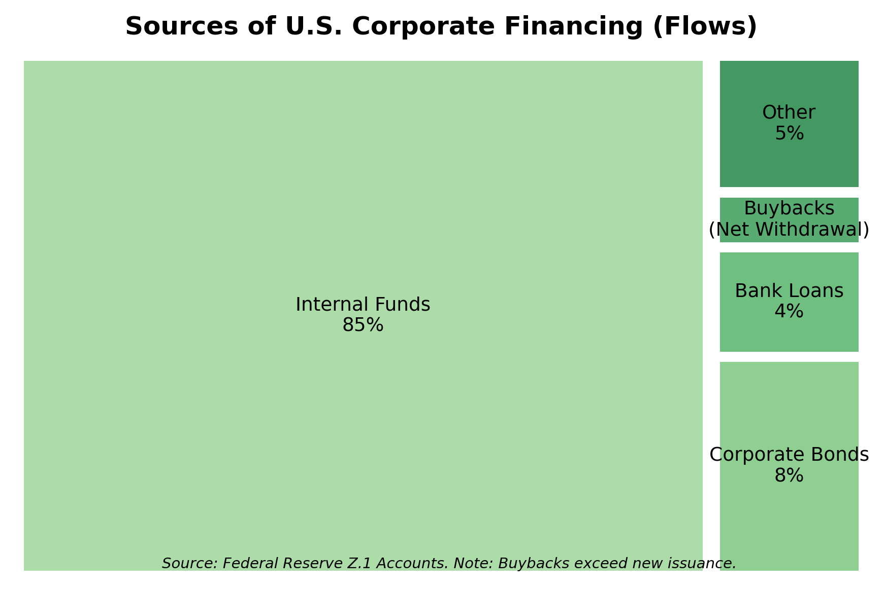
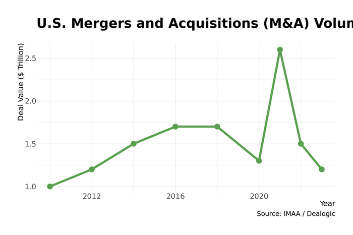

# Chapter 18: Corporate Finance in Practice

How do American corporations finance themselves? The textbook answer—firms raise capital by issuing stocks and bonds—is mostly wrong. In practice, corporations finance investment overwhelmingly from internal funds: retained earnings and depreciation allowances. When they do access external markets, they strongly prefer debt to equity. And for the past decade, large corporations have been net *returners* of capital to shareholders through buybacks and dividends, not net raisers.

This chapter examines how corporate finance actually works: the pecking order of funding sources, the practitioners who execute deals, the governance structures that shape decisions, and the recent trends reshaping American corporations.

## The Pecking Order in Practice

### How Corporations Actually Finance Investment

The Federal Reserve's Financial Accounts (Z.1) reveal the true picture of corporate financing:

**Table 18.1: Sources of Corporate Funds (2023)**

| Source | Amount | Share |
|--------|--------|-------|
| Internal funds (retained earnings + depreciation) | $3.0 trillion | 76% |
| Net debt issuance | $0.9 trillion | 24% |
| Net equity issuance | -$0.8 trillion | Negative |

*Figure 18.1: How corporations finance investment. Internal funds dominate; net equity issuance is negative as buybacks exceed new issues. Source: Federal Reserve Z.1*

The negative equity figure means corporations bought back more stock than they issued—a pattern that has persisted for most of the past two decades. American corporations are not tapping equity markets for expansion capital; they're returning equity capital to shareholders.

This pattern confirms the **pecking order theory** of corporate finance: firms prefer internal funds first, then debt, then equity as a last resort. The reasons are straightforward:

- **Internal funds have no transaction costs**: No underwriting fees, no disclosure requirements, no market timing risk
- **Debt is tax-advantaged**: Interest payments are deductible; dividends are not
- **Equity issuance signals weakness**: Markets often interpret stock offerings as a sign that management believes shares are overvalued

### Capital Structure by Industry

Different industries have systematically different capital structures, reflecting their asset bases and cash flow patterns.

**Table 18.2: Typical Capital Structure by Industry**

| Industry | Debt/Capital | Characteristics |
|----------|--------------|-----------------|
| Utilities | 50-60% | Regulated returns, stable cash flows |
| Telecoms | 40-50% | Heavy infrastructure, predictable revenue |
| Real estate (REITs) | 40-50% | Tangible collateral, REIT tax rules |
| Manufacturing | 25-35% | Cyclical, some tangible assets |
| Retail | 25-35% | Lease obligations (off-balance sheet) |
| Technology | 5-15% | High margins, intangible assets |
| Pharma/Biotech | 10-20% | R&D-intensive, uncertain cash flows |

Technology companies carry minimal debt despite having the financial capacity for more. Their intangible assets (software, patents, brand) make poor collateral, and their high profit margins generate abundant internal funds. Apple typically borrows at the tightest spreads in the market—but historically chose to maintain minimal debt until it discovered that issuing bonds to fund buybacks was more tax-efficient than repatriating overseas cash. (For technology firms, "internal funds" are often boosted by stock-based compensation: by paying employees in equity rather than cash, companies preserve liquidity, though this creates dilution that buybacks must later offset.)

### The Rise of Corporate Cash Piles

Large corporations—especially technology firms—accumulated enormous cash balances in the 2010s:

| Company | Peak Cash Holdings | Year |
|---------|-------------------|------|
| Apple | $285 billion | 2017 |
| Microsoft | $136 billion | 2020 |
| Alphabet | $140 billion | 2023 |
| Amazon | $86 billion | 2022 |
| Berkshire Hathaway | $325 billion | 2024 |

Several forces drove cash accumulation:

- **Overseas earnings**: Before the 2017 tax reform, repatriating foreign profits triggered a 35% tax. Firms held cash abroad.
- **Precautionary motives**: The 2008 crisis demonstrated that even healthy firms can face sudden liquidity crunches
- **Lack of investment opportunities**: The "investment drought" puzzle—high profits but weak capital spending
- **M&A optionality**: Cash on hand enables quick deal execution

The 2017 Tax Cuts and Jobs Act eliminated the repatriation penalty, triggering a one-time wave of cash returning to the U.S. Much of it funded buybacks rather than investment.

## The Corporate Bond Market

### Investment Grade Issuers

The corporate bond market totals roughly $10 trillion outstanding, dominated by large investment-grade issuers.

**Who Borrows Most:**

The largest corporate bond issuers are no longer industrial giants—they're technology companies and banks:

| Company | Bonds Outstanding | Credit Rating |
|---------|-------------------|---------------|
| Apple | $100+ billion | AA+ |
| Microsoft | $80+ billion | AAA |
| Amazon | $60+ billion | AA |
| JPMorgan Chase | $200+ billion | A+ |
| Bank of America | $180+ billion | A |
| AT&T | $140+ billion | BBB+ |
| Verizon | $120+ billion | BBB+ |

**The AAA Club:**

Only two American corporations maintain AAA credit ratings: **Microsoft** and **Johnson & Johnson**. The club has shrunk from dozens in the 1980s as companies embraced leverage, pursued acquisitions, and prioritized shareholder returns over balance sheet strength.

The loss of a AAA rating rarely matters operationally—borrowing costs for AA companies are only marginally higher—but it symbolizes the shift toward financial optimization and away from fortress balance sheets.

**The BBB Cliff:**

The largest segment of the investment-grade market is now rated BBB (the lowest investment-grade tier). This creates systemic risk: in a recession, BBB companies downgraded to junk ("fallen angels") may face forced selling from investment-grade-only funds, potentially flooding the high-yield market and widening spreads.

### High-Yield (Junk) Bonds

Below investment grade, the high-yield market serves:

- **Leveraged buyout targets**: PE-owned companies with debt loads that preclude investment-grade ratings
- **Growth companies**: Firms with strong prospects but unproven track records
- **Fallen angels**: Former investment-grade issuers that have deteriorated
- **Distressed issuers**: Companies in financial difficulty

High-yield issuers pay significantly more—spreads of 300-500 basis points over Treasuries in normal times, widening to 1,000+ in stress periods.

## Investment Banking and Deal-Making

### The M&A Market

Mergers and acquisitions represent the highest-profile activity in corporate finance. The U.S. M&A market totaled roughly $2 trillion in announced deals in 2024, representing about 54% of global activity.

**Deal Activity by Type:**

| Category | Share of Value | Characteristics |
|----------|----------------|-----------------|
| Strategic (corporate) | 55% | Synergy-driven, stock or cash |
| Private equity buyouts | 30% | Leverage, operational improvement |
| Financial sponsors (other) | 10% | Infrastructure, real assets |
| SPAC/de-SPAC | 5% | Down from 20%+ in 2021 |

*Figure 18.2: U.S. M&A activity has been cyclical, with peaks in 2000, 2007, and 2021 corresponding to bull markets and cheap financing. Source: Refinitiv*

**The Largest Deals (Recent History):**

| Deal | Value | Year |
|------|-------|------|
| Microsoft-Activision | $69 billion | 2023 |
| Broadcom-VMware | $61 billion | 2023 |
| Exxon-Pioneer | $60 billion | 2024 |
| Chevron-Hess | $53 billion | 2024 |
| Capital One-Discover | $35 billion | 2024 |

### The Advisory Business

Investment banks advise on M&A transactions, typically earning fees of 0.5-1% of deal value for large transactions (higher percentages for smaller deals).

**Top M&A Advisors by Deal Value (2024):**

| Bank | Market Position | Specialty |
|------|-----------------|-----------|
| Goldman Sachs | #1 large-cap | Marquee deals, hostile defense |
| Morgan Stanley | #2 large-cap | Tech, healthcare |
| JPMorgan | #3 large-cap | Cross-border, financing |
| Centerview Partners | Top boutique | Complex situations |
| Lazard | Top boutique | Restructuring, activism defense |

**Mid-Market Specialists:**

| Bank | Position | Focus |
|------|----------|-------|
| Houlihan Lokey | #1 by volume | Middle market, restructuring |
| Jefferies | #2 by volume | Healthcare, tech |
| William Blair | Regional leader | Private companies |
| Harris Williams | PE specialist | PE portfolio exits |

The boutique advisory firms (Centerview, Evercore, Lazard, Moelis, PJT Partners) have gained share from bulge-bracket banks by offering senior banker attention and avoiding conflicts of interest.

### The Legal Architecture

Law firms are essential to deal execution, handling due diligence, contract negotiation, regulatory filings, and litigation risk.

**Top M&A Law Firms:**

| Firm | Specialty | Notable |
|------|-----------|---------|
| Kirkland & Ellis | PE, private M&A | Largest by revenue |
| Wachtell, Lipton | Public company M&A | Invented poison pill |
| Skadden, Arps | Public M&A | Global reach |
| Simpson Thacher | PE, financing | Leveraged buyouts |
| Paul, Weiss | PE, complex deals | High-stakes litigation |

Wachtell, Lipton, Rosen & Katz occupies a unique position: a small partnership (roughly 250 lawyers) that handles the most complex and contentious public company transactions, charging premium rates and generating the highest revenue per partner in the industry.

## Private Equity's Role

Private equity firms have become central actors in corporate America. (See also Chapter 17 for PE as an investment category.)

### How PE Changes Corporate Finance

PE ownership transforms corporate finance in several ways:

**Higher leverage**: PE-owned companies typically carry 5-7x EBITDA in debt, versus 2-3x for public companies. This amplifies returns but increases bankruptcy risk.

**Governance intensity**: PE boards meet monthly rather than quarterly, with partners deeply involved in operations.

**Short investment horizon**: PE firms aim to exit within 3-7 years, creating pressure for rapid improvement.

**Management incentives**: Executives receive significant equity stakes, aligning their interests with owners.

**Table 18.3: Public vs. PE-Owned Capital Structure**

| Metric | Public Company | PE-Owned |
|--------|----------------|----------|
| Debt/EBITDA | 2-3x | 5-7x |
| Equity cushion | 50-70% | 20-40% |
| Board meetings | Quarterly | Monthly |
| CEO equity stake | 0.1-0.5% | 3-10% |

### Dividend Recapitalizations

A controversial PE practice: after improving a company's performance (or simply waiting for conditions to improve), PE firms sometimes have the company issue debt specifically to pay a dividend to owners. This extracts value before exit, but also increases leverage and risk for remaining stakeholders.

Critics argue dividend recaps transfer risk to employees and creditors while PE extracts cash. Defenders note the practice is legal, and PE firms maintain ownership stakes so their interests remain aligned with company performance.

## Corporate Governance

### Board Composition and Function

American corporate boards have evolved significantly in recent decades.

**Size and Structure:**

| Characteristic | 2000 | 2024 |
|----------------|------|------|
| Average board size (S&P 500) | 12 | 11 |
| Independent directors | 65% | 85% |
| CEO also chairman | 75% | 45% |
| Women directors | 12% | 34% |
| Racial/ethnic minority directors | 10% | 26% |

**Key Committees:**

- **Audit Committee**: Financial oversight, internal controls, external auditor relationship (must be all independent)
- **Compensation Committee**: Executive pay, performance metrics, equity grants
- **Nominating/Governance Committee**: Board composition, succession planning
- **Risk Committee**: Enterprise risk management (common at financial firms)

### Executive Compensation

CEO pay has grown dramatically relative to average worker compensation.

**Table 18.4: CEO-to-Worker Pay Ratio (S&P 500)**

| Year | Ratio | Average CEO Pay |
|------|-------|-----------------|
| 1990 | 71:1 | $3.5 million |
| 2000 | 293:1 | $14.2 million |
| 2010 | 221:1 | $10.1 million |
| 2020 | 264:1 | $13.9 million |
| 2024 | 285:1 | $18.9 million |

**Compensation Structure:**

Modern CEO pay consists primarily of equity-linked compensation:

| Component | Share | Form |
|-----------|-------|------|
| Base salary | 8-12% | Cash |
| Annual bonus | 15-20% | Cash, tied to annual targets |
| Performance shares | 40-50% | Stock vesting over 3 years, tied to TSR/EPS |
| Stock options | 15-25% | Right to buy stock at fixed price |
| Perquisites | 2-5% | Jet, security, etc. |

**Total Shareholder Return (TSR)** has become the dominant performance metric—stock price appreciation plus dividends, often measured relative to peers. This ties CEO wealth directly to stock performance, for better or worse.

**Say on Pay**: Since 2011, public companies must hold non-binding shareholder votes on executive compensation. Companies failing to receive majority support face pressure to revise pay packages, but failures are rare (less than 3% of companies annually).

### Activist Investors

Activist investors acquire stakes in public companies and push for changes—board seats, strategic shifts, operational improvements, or capital returns.

**Major Activists:**

| Firm | Founder | Style | 2024 Campaigns |
|------|---------|-------|----------------|
| Elliott Management | Paul Singer | Operational, aggressive | 14 |
| Starboard Value | Jeff Smith | Margin improvement | 8 |
| Trian Partners | Nelson Peltz | Strategic, board seats | 5 |
| Icahn Enterprises | Carl Icahn | Confrontational | 3 |
| Third Point | Dan Loeb | Media-savvy | 4 |

**Notable 2024 Campaigns:**

- **Southwest Airlines**: Elliott won six board seats after attacking operational failures and demanding management change
- **Starbucks**: Elliott and Starboard pressure contributed to CEO change, with Brian Niccol hired from Chipotle
- **Disney**: Trian lost the proxy fight but forced focus on succession planning and cost discipline

**Activist Tactics:**

1. **Accumulate stake**: Build position (often using derivatives to avoid disclosure until 5% threshold)
2. **Engage privately**: Present analysis and demands to management
3. **Go public**: If private engagement fails, release letter and presentation
4. **Proxy fight**: Nominate alternative directors for shareholder vote
5. **Settlement**: Often results in board seats, strategic review, or buybacks

### ESG and Stakeholder Capitalism

Environmental, Social, and Governance (ESG) factors rose to prominence in the late 2010s, with major investors incorporating ESG metrics into investment decisions.

**The Backlash:**

ESG has become politically contested. Republican-led states have restricted state pension fund investments with ESG-focused managers. "Anti-ESG" funds have launched (though with minimal assets). Companies increasingly practice **"greenhushing"**—continuing sustainability work while avoiding ESG terminology in public communications.

**The Practical Reality:**

Despite political controversy, most large companies continue ESG-related activities:

- Climate risk disclosure (required by SEC, EU regulations, California law)
- Diversity reporting (investor and customer pressure)
- Supply chain auditing (reputational risk management)
- Board oversight of sustainability (governance best practice)

The terminology is shifting from "ESG" to "sustainability" or simply "risk management," but the underlying work continues.

## Capital Allocation Decisions

### The CFO's Perspective

Chief Financial Officers face a constant capital allocation question: what to do with cash generated by operations?

**The Decision Tree:**

1. **Maintain liquidity buffer**: Keep 1-3 months of operating expenses in cash
2. **Fund organic investment**: Capital expenditures, R&D, working capital
3. **Pursue M&A**: Acquisitions for growth or synergies
4. **Return capital**: Buybacks, dividends, or debt paydown

**Table 18.5: S&P 500 Capital Allocation (2023)**

| Use of Funds | Amount | Share |
|--------------|--------|-------|
| Capital expenditures | $850 billion | 35% |
| R&D spending | $400 billion | 17% |
| Dividends | $590 billion | 24% |
| Share buybacks | $795 billion | 33% |
| M&A (net) | Variable | — |
| Debt paydown | Variable | — |

*Note: Percentages exceed 100% as some uses are funded by debt issuance.*

### Buybacks vs. Dividends

Why do companies prefer buybacks over dividends?

**Tax efficiency**: Shareholders who don't sell pay no tax on buybacks. Dividends are taxed when paid.

**Flexibility**: Markets punish dividend cuts severely. Buybacks can be reduced or suspended without stigma.

**EPS management**: Reducing share count boosts earnings per share mechanically, even without earnings growth.

**Offsetting dilution**: Stock-based compensation continuously issues new shares; buybacks offset this dilution.

**Signal strength**: A dividend signals confidence in *stable* future earnings. A buyback signals belief that shares are *undervalued*.

Critics argue buybacks represent short-termism—returning cash rather than investing in growth. The 2022 Inflation Reduction Act imposed a 1% excise tax on buybacks, the first U.S. tax specifically targeting repurchases. Early evidence suggests minimal impact on buyback volumes.

## The Geography of Corporate Finance

### Corporate Headquarters Concentration

Fortune 500 headquarters cluster in a few metropolitan areas:

**Table 18.6: Fortune 500 Headquarters by Metro (2024)**

| Metro Area | Fortune 500 HQs | Major Companies |
|------------|-----------------|-----------------|
| New York | 45 | JPMorgan, Verizon, Pfizer |
| Houston | 24 | Exxon, ConocoPhillips, Sysco |
| Chicago | 22 | Boeing (moving), McDonald's, Abbott |
| Dallas-Fort Worth | 21 | ExxonMobil (Irving), AT&T, Southwest |
| San Francisco Bay | 20 | Apple, Alphabet, Chevron |
| Atlanta | 17 | Home Depot, UPS, Coca-Cola |
| Minneapolis | 16 | Target, UnitedHealth, 3M |

**Recent Shifts:**

Several companies relocated headquarters in the 2020s, typically from high-tax coastal states to Texas and Florida:

- **Tesla**: Palo Alto → Austin
- **Oracle**: Redwood City → Austin
- **Caterpillar**: Chicago → Dallas area
- **Boeing**: Chicago → Arlington, VA
- **Citadel**: Chicago → Miami

Tax considerations, executive preferences, and workforce availability drive relocation decisions.

### Financial Centers

Corporate finance advisory work concentrates in New York, with secondary hubs:

- **New York**: Investment banks, law firms, PE headquarters
- **San Francisco**: Tech-focused banking, VC
- **Boston**: Asset management, biotech deals
- **Chicago**: Derivatives, Midwest corporate clients
- **Houston**: Energy finance
- **Los Angeles**: Entertainment finance

## Recent Trends

### The Rise of Private Credit

Traditional bank lending to corporations has declined as a share of financing, replaced by direct lending from non-bank investors—insurance companies, pension funds, and specialized credit funds. This shift accelerated after 2008 as tighter banking regulations (Basel III capital requirements, and the proposed "Basel III Endgame" rules) made holding corporate loans more expensive for traditional banks, clearing the path for private lenders.

Private credit assets under management have grown from roughly $500 billion in 2015 to over $1.7 trillion in 2024. Major players include:

| Firm | Private Credit AUM | Parent/Affiliate |
|------|-------------------|------------------|
| Ares Management | $240 billion | Standalone |
| Apollo | $400+ billion | Alternative manager |
| Blackstone Credit | $300+ billion | Blackstone |
| Blue Owl | $150 billion | Standalone |
| KKR Credit | $100+ billion | KKR |

Private credit offers borrowers flexibility (looser covenants, faster execution) and lenders higher yields than public markets. But the rapid growth raises concerns about credit quality in untested conditions.

### The Resilience of Conglomerates

Conventional wisdom holds that conglomerates—diversified corporations operating in multiple unrelated businesses—are outdated. The "conglomerate discount" (market values diversified firms below the sum of their parts) has been documented since the 1990s.

Yet some conglomerates persist and thrive:

**Berkshire Hathaway**: Warren Buffett's holding company owns insurance (GEICO, Gen Re), railroads (BNSF), utilities (Berkshire Hathaway Energy), manufacturing (Precision Castparts), and retail (See's Candies), plus massive equity portfolios.

**Danaher**: A diversified industrial company that has created enormous value through disciplined M&A and the "Danaher Business System" of operational improvement.

**3M**: The classic diversified manufacturer (though struggling in recent years with litigation and portfolio questions).

The surviving conglomerates typically share characteristics: disciplined capital allocation, decentralized operations, and a culture of continuous improvement.

### Corporate Simplification

The opposite trend is also underway: corporations spinning off divisions to create "pure-play" companies.

**Recent Breakups:**

| Parent | Spinoff | Year | Rationale |
|--------|---------|------|-----------|
| Johnson & Johnson | Kenvue (consumer) | 2023 | Separate pharma/consumer valuations |
| GE | Vernova, Aerospace | 2023-24 | End of conglomerate model |
| 3M | Solventum (healthcare) | 2024 | Focus remaining business |
| Kellanova | WK Kellogg (cereal) | 2023 | Snacks vs. cereal strategies |

The theory: focused companies can be valued more precisely, managed more effectively, and compensated more appropriately. The sum of the parts exceeds the whole.

### AI and Corporate Finance

Artificial intelligence is beginning to transform corporate finance functions:

- **FP&A**: AI-driven forecasting and scenario analysis
- **Due diligence**: Automated document review in M&A
- **Credit analysis**: Machine learning credit scoring
- **Fraud detection**: Pattern recognition in transactions
- **Investor relations**: AI analysis of earnings call sentiment

CFOs are also grappling with AI's impact on their businesses more broadly—both the opportunity (productivity gains) and threat (disruption risk).

## Firm Profiles

### Berkshire Hathaway

Berkshire Hathaway, led by Warren Buffett since 1965, represents a unique model of corporate finance: a holding company that allocates capital across wholly-owned businesses, public equity investments, and fixed income.

Buffett's approach inverts conventional corporate finance:

- **No dividends**: Berkshire has never paid a dividend, preferring to retain and reinvest earnings
- **Minimal debt**: Operating companies may carry debt, but the holding company maintains massive liquidity
- **Decentralized operations**: Subsidiary CEOs run their businesses with minimal headquarters interference
- **Long-term ownership**: Berkshire rarely sells businesses, creating loyalty and reducing transaction friction

The company's insurance operations (GEICO, General Re, Berkshire Hathaway Reinsurance) generate "float"—premiums collected before claims are paid—that Buffett invests. This essentially creates low-cost or negative-cost leverage.

At 94 (in 2024), Buffett remains active, though succession planning has advanced with Greg Abel designated as heir apparent.

**Key Statistics (2024):**
- Market capitalization: $900+ billion
- Cash and equivalents: $325 billion
- Major equity holdings: Apple ($180B), Bank of America, Coca-Cola, American Express
- Employees (subsidiaries): 400,000+
- Operating earnings: $40+ billion

### Elliott Management

Elliott Management, founded by Paul Singer in 1977, has become the world's most active and feared activist investor. The firm manages roughly $65 billion and pursues both corporate activism and distressed debt investing.

Elliott's approach is distinctive:

- **Deep research**: Campaigns built on extensive operational analysis, not just financial engineering
- **Patient capital**: Willing to pursue multi-year campaigns
- **Aggressive tactics**: Litigation, media campaigns, regulatory complaints
- **Global reach**: Active in U.S., Europe, Asia, and emerging markets

The firm's sovereign debt battles—notably against Argentina, holding out for full payment while other creditors settled—demonstrated willingness to pursue extreme positions.

Recent corporate campaigns have targeted operational underperformance: Southwest Airlines (won six board seats), Salesforce (board seats, cost cuts), and AT&T (strategic refocus).

**Key Statistics:**
- AUM: $65 billion
- Founded: 1977
- Campaigns (2024): 14
- Average holding period: 2-3 years
- Headquarters: West Palm Beach (relocated from NYC)

### Johnson & Johnson

Johnson & Johnson exemplifies the evolution of large-company corporate finance. One of only two remaining AAA-rated companies, J&J maintains the most conservative balance sheet among major corporations—a strategic choice that comes with trade-offs.

The company's 2023 decision to spin off its consumer health business (Kenvue, maker of Tylenol, Band-Aid, and Listerine) reflected the ongoing trend toward corporate simplification. The remaining J&J focuses on pharmaceuticals and medical devices.

J&J has also deployed a controversial corporate finance technique: the "Texas Two-Step." Facing billions in talc powder litigation, J&J created a subsidiary, transferred the liabilities to it, and placed that subsidiary into bankruptcy. Courts have scrutinized but not definitively resolved the legality of this approach.

**Key Statistics (2024):**
- Market capitalization: $380 billion
- Credit rating: AAA
- Revenue: $85 billion
- R&D spending: $15 billion
- Dividend: $4.96/share (62 consecutive years of increases)
- Employees: 130,000

## Conclusion

Corporate finance in America is less about raising capital than about allocating it. Large corporations generate far more cash than they invest, returning the surplus to shareholders through buybacks and dividends. The equity market, rather than funding corporate expansion, extracts capital from the corporate sector.

This pattern reflects several forces: mature companies with limited growth opportunities, shareholder pressure for returns, tax incentives favoring buybacks, and executive compensation tied to stock prices. Whether it represents efficient capital allocation or short-term value extraction remains contested.

The infrastructure of corporate finance—investment banks, law firms, PE firms, activist investors—has developed to facilitate transactions rather than capital formation. M&A advisory, activist campaigns, and leveraged buyouts all generate fees for intermediaries and returns for sophisticated investors, but their contribution to economic growth is less clear.

For the American economy, corporate finance practices shape investment patterns, employment decisions, and wealth distribution. The shift toward financial optimization and shareholder primacy—celebrated by some as disciplined capital allocation, criticized by others as extractive short-termism—is one of the defining features of contemporary American capitalism.

## Data Sources and Further Reading

### Data Sources

- **Federal Reserve Z.1**: Financial Accounts (corporate financing flows)
- **SEC EDGAR**: Corporate filings, proxy statements, executive compensation
- **S&P Global**: Capital IQ for M&A data
- **Refinitiv**: Deal data, league tables
- **Equilar/ISS**: Executive compensation and governance data
- **Company filings**: 10-K, 8-K, proxy statements

### Further Reading

- **Jensen, Michael.** "Agency Costs of Free Cash Flow" (1986)—foundational on buybacks and leverage
- **Shleifer & Vishny.** "A Survey of Corporate Governance" (1997)—comprehensive overview
- **Kaplan, Steven.** "The Effects of Management Buyouts on Operating Performance and Value" (1989)—PE's impact
- **Gutierrez & Philippon.** "Investment-less Growth" (2017)—the corporate investment puzzle
- **Admati & Hellwig.** *The Bankers' New Clothes* (2013)—critique of leverage
- **Appelbaum & Batt.** *Private Equity at Work* (2014)—critical examination
