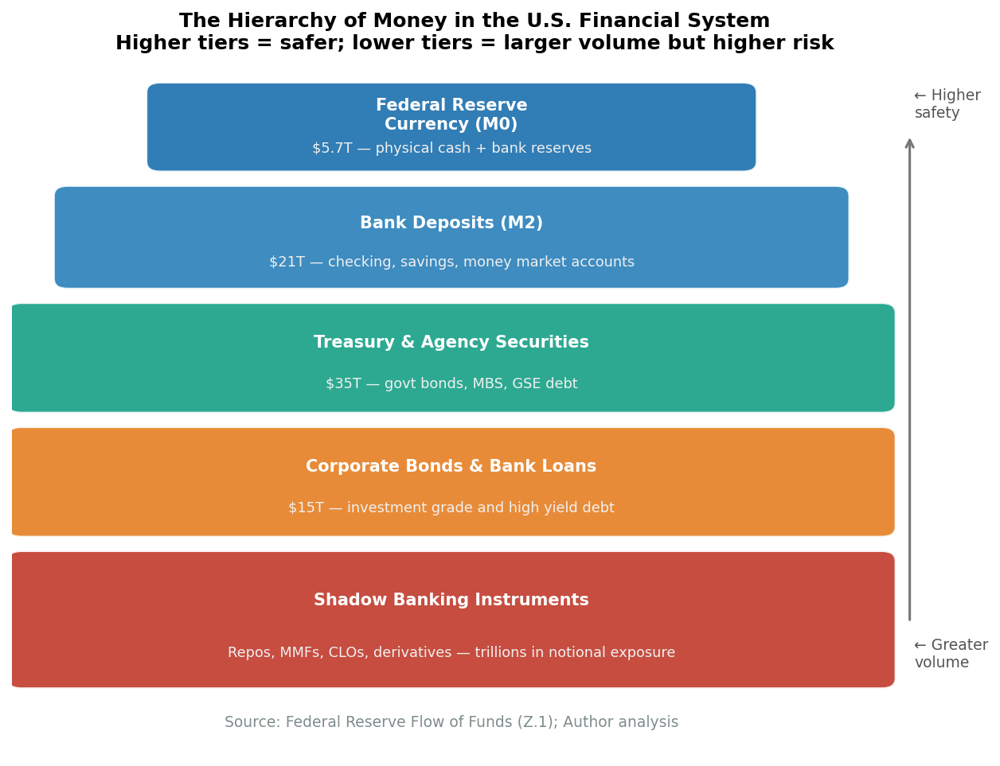
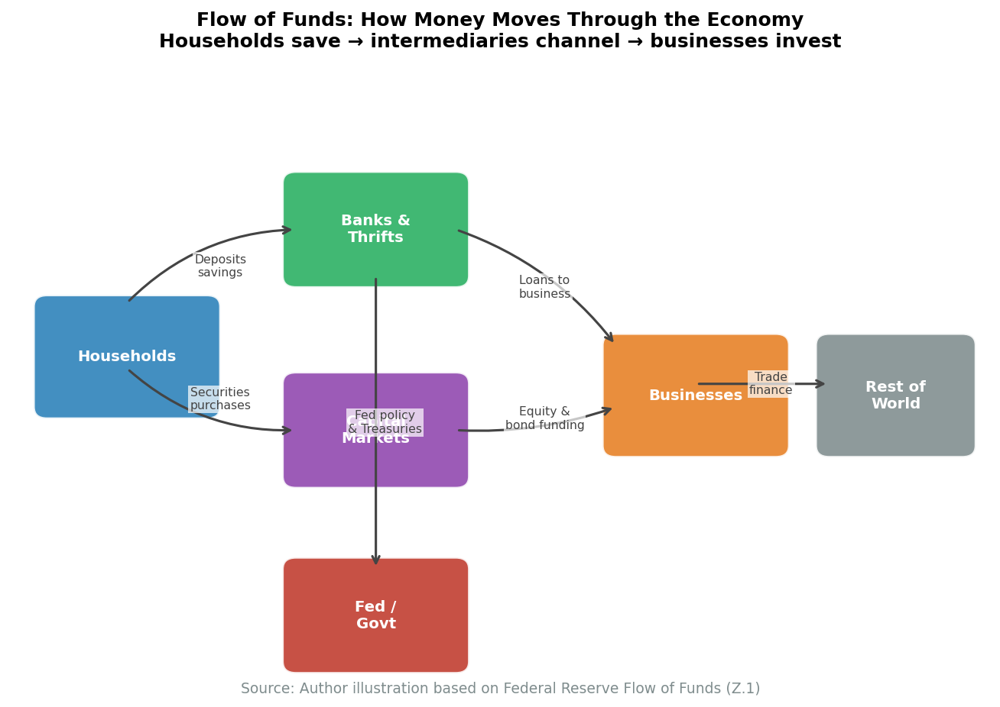

# Chapter 18: How American Finance Works

Most economic textbooks treat finance as a "veil"—a neutral mechanism for moving funds from savers to borrowers that doesn't much affect real outcomes. The 2008 financial crisis shattered this comforting illusion. Finance has plumbing, and the plumbing matters. Who holds what assets, how they're funded, what constraints they face, and how they connect to each other—these institutional details shape credit availability, amplify economic shocks, and occasionally bring the system to near-collapse.

This chapter examines how American finance actually works: the hierarchy of money, how banks create it, how payments flow through the system, the parallel universe of "shadow banking," and the Federal Reserve's role as both operator and backstop. Understanding this plumbing is essential for making sense of everything from monetary policy to financial crises to the everyday mechanics of commerce.

## The Hierarchy of Money


**Key Concept: The Hierarchy of Money**

Not all money is equal. Money exists in layers, with each level a *promise to pay* the level above. Currency (physical dollars) sits at the top. Bank deposits are promises to pay currency. Shadow money is promises to pay deposits. In a crisis, this hierarchy reveals itself as lower-level promises get tested.


<figure>

<figcaption>Figure 18.1: The hierarchy of money. Currency sits at the top; reserves, deposits, and shadow money form progressively lower levels, each a promise to pay the level above. In a crisis, lower-level money gets tested against higher-level money. Source: Author illustration based on Mehrling</figcaption>
</figure>

The first insight is that not all money is equal. Money exists in a hierarchy, with each level a promise to pay the level above.

**Level 1: Currency (Federal Reserve Notes)**

At the top sits currency—physical dollars issued by the Federal Reserve. If you hold a $100 bill, no one owes you anything. It is money, full stop. But currency is a tiny fraction of the monetary system:

| Form | Amount (2024) |
|------|---------------|
| Currency in circulation | roughly $2.3 trillion |
| Of which: held domestically | roughly $1.1 trillion |
| Of which: held abroad | roughly $1.2 trillion |

*Source: Federal Reserve Statistical Releases H.4.1, H.6, and Z.1 Financial Accounts, 2024*

Most dollars aren't physical. They're entries on balance sheets.

**Level 2: Reserves (Bank Deposits at the Fed)**

Banks don't settle with each other using currency. They settle using reserves—deposits at the Federal Reserve. When JPMorgan owes Bank of America $1 billion, JPMorgan's reserve account at the Fed is debited and BofA's is credited. No trucks of cash move.

| Period | Reserve Balances |
|--------|------------------|
| Pre-2008 | roughly $10-50 billion |
| Post-QE (2014) | roughly $2.5 trillion |
| Post-COVID (2022) | roughly $3.5 trillion |
| Current | roughly $3.2 trillion |

*Source: Federal Reserve Statistical Releases H.4.1, H.6, and Z.1 Financial Accounts, 2024*

The explosion of reserves after 2008 reflects quantitative easing—the Fed buying assets and paying with newly created reserves.

**Level 3: Deposits (Bank Liabilities to the Public)**

What households and firms call "money" is mostly bank deposits—entries on bank balance sheets representing the bank's promise to pay currency or transfer reserves on demand.

| Type | Amount (2024) |
|------|---------------|
| Checkable deposits | roughly $5 trillion |
| Savings deposits | roughly $12 trillion |
| Small time deposits | roughly $0.5 trillion |
| **Total** | roughly $17.5 trillion |

*Source: Federal Reserve Statistical Releases H.4.1, H.6, and Z.1 Financial Accounts, 2024*

Deposits are promises to pay currency/reserves. They're not currency itself. This distinction matters in a crisis: if everyone tries to convert deposits to currency simultaneously, there isn't enough.

**Level 4: Shadow Money (Private Promises)**

Below bank deposits sits a vast layer of money-like claims issued by non-banks:

| Instrument | Amount | Issuer |
|------------|--------|--------|
| Money market fund shares | roughly $6.4 trillion | Asset managers |
| Repo | roughly $4.5 trillion | Dealers, hedge funds |
| Commercial paper | roughly $1.2 trillion | Corporations |

*Source: Federal Reserve Statistical Releases H.4.1, H.6, and Z.1 Financial Accounts, 2024*

These instruments function as money for their holders—they're liquid, perceived as safe, and used for transactions. But they're promises to pay bank deposits, which are promises to pay reserves, which are promises to pay currency. In normal times, the hierarchy is invisible. In a crisis, it reveals itself. Lower-level money gets tested against higher-level money, and the promises that can't be kept break.

<figure>

<figcaption>Figure 18.2: The flow of funds: how savings become investment. Money flows from sources (households, corporations, government, rest of world) through financial intermediaries (banks, shadow banks, capital markets) to ultimate uses (mortgages, business loans, consumer credit). The Fed sits at the bottom, providing reserves that lubricate the entire system. Source: Federal Reserve Z.1 Financial Accounts</figcaption>
</figure>

## How Banks Actually Work

The most important thing to understand about money: banks create it when they lend.

**The Textbook Story (Wrong)**

Traditional textbooks tell a money multiplier story: the central bank creates reserves, banks lend out a fraction, those loans become deposits at other banks, those banks lend out a fraction, and so on. This implies the central bank controls the money supply through reserve requirements, with banks as passive conduits.

This is backwards.


**The Textbook Is Wrong**

The traditional "money multiplier" story—where banks lend out existing deposits—is backwards. In reality, loans create deposits. When a bank makes a loan, it simultaneously creates a matching deposit by keystroke. The Bank of England confirmed this in 2014: "Whenever a bank makes a loan, it simultaneously creates a matching deposit in the borrower's bank account, thereby creating new money."


**The Reality: Loans Create Deposits**

When a bank makes a loan, it doesn't lend out existing deposits. It creates a new deposit:

| Bank Balance Sheet (After Loan) | |
|---------------------------------|--|
| **Assets** | **Liabilities** |
| +$100,000 Loan | +$100,000 Deposit |

The borrower now has $100,000 in their account that didn't exist before. The bank created it by keystroke. The Bank of England stated this clearly in 2014: "Whenever a bank makes a loan, it simultaneously creates a matching deposit in the borrower's bank account, thereby creating new money."

**What About Reserves?**

If banks create money by lending, what role do reserves play? Reserves are for settlement, not lending. When the borrower spends their deposit—paying someone at another bank—the lending bank needs reserves to settle the payment. But banks can always borrow reserves from other banks (federal funds market) or from the Fed (discount window).

The sequence is:
1. Bank identifies profitable loan opportunity
2. Bank makes loan, creating deposit
3. Bank seeks reserves for settlement afterward
4. Fed supplies reserves to keep fed funds at target

This is *endogenous money*: the money supply responds to demand for credit, not to central bank reserve injections. The Fed sets the price of money (interest rate), not the quantity.

### A Simplified Bank Balance Sheet

| Assets | % | Liabilities | % |
|--------|---|-------------|---|
| Cash and reserves | 10% | Deposits | 80% |
| Securities (Treasuries, MBS) | 25% | Wholesale funding | 10% |
| Loans | 60% | Equity capital | 10% |
| Other | 5% | |

**Assets**: What the bank owns or is owed. Reserves are highly liquid but earn little. Securities are moderately liquid and can be sold or pledged as collateral. Loans are illiquid but higher-yielding.

**Liabilities**: What the bank owes. Deposits are cheap but can be withdrawn (run risk). Wholesale funding is more expensive and more flighty. Equity capital is the buffer that absorbs losses before depositors are affected.

**Net Interest Margin**: Banks make money on the spread between asset yields and funding costs. This margin has compressed over time—from 4%+ in the 1990s to around 3% in the 2020s—reflecting lower rates, competition, and regulation requiring more low-yield liquid assets.

### Maturity Transformation: The Core Function and Core Risk

The essential function of banking is *maturity transformation*: borrowing short (deposits withdrawable on demand) and lending long (30-year mortgages, multi-year business loans). This is socially valuable—it funds long-term investment while providing liquidity to savers.

But it's also inherently dangerous. Banks promise more liquidity than they have. If all depositors withdraw simultaneously, the bank cannot pay without fire-selling long-term assets at a loss. This isn't a flaw in poorly-run banks; it's the essence of banking.

Diamond and Dybvig (1983) showed that bank runs can be self-fulfilling equilibria: if you think others will withdraw, you should withdraw first. If everyone thinks this, everyone withdraws. The bank fails even if it was fundamentally solvent.

This is why we have:
- **Deposit insurance (FDIC)**: Guarantees deposits up to $250,000, removing the incentive to run
- **Lender of last resort (Fed)**: Lends to solvent but illiquid banks against good collateral
- **Capital requirements**: Force banks to hold an equity buffer against losses
- **Liquidity requirements**: Force banks to hold liquid assets that can meet withdrawals

## The Payments System

Money exists to be spent. The payments system is the infrastructure through which money moves—the plumbing of the financial system.

### Fedwire: The Backbone

Fedwire is the Federal Reserve's real-time gross settlement (RTGS) system. Every payment settles individually, in real time, in central bank money.

| Metric | Value |
|--------|-------|
| Daily payments | roughly $4 trillion |
| Daily transactions | roughly 500,000 |
| Average payment | roughly $8 million |
| Operating hours | 22 hours/day |

Fedwire handles wholesale payments: bank-to-bank transfers, Treasury securities settlement, large corporate transactions. Once a Fedwire payment settles, it cannot be reversed—the recipient has final, unconditional money.

Banks often need to make payments before receiving offsetting inflows. The Fed extends intraday credit (overdrafts) to keep payments flowing, with daily peaks exceeding $500 billion.

### CHIPS: Private Large-Value Clearing

The Clearing House Interbank Payments System (CHIPS) is a private alternative owned by large banks:

| Metric | Value |
|--------|-------|
| Daily payments | roughly $1.8 trillion |
| Daily transactions | roughly 400,000 |
| Primary use | Cross-border dollar payments, FX settlement |

Unlike Fedwire, CHIPS uses *netting*: payments accumulate during the day, and only net balances settle (in reserves via Fedwire) at day's end. This economizes on reserves—$1.8 trillion in gross payments might net to $50 billion in actual reserve movements.

### SWIFT: Messaging, Not Money

A common confusion: SWIFT is not a payment system. SWIFT (Society for Worldwide Interbank Financial Telecommunication) is a messaging network—it tells banks what to do but doesn't move money.

| System | Function | What Moves |
|--------|----------|------------|
| SWIFT | Messaging | Information |
| Fedwire | Settlement | Reserves |
| CHIPS | Clearing + Settlement | Net reserve balances |

When Russia was excluded from SWIFT in 2022, it couldn't receive payment instructions through the standard network—but the underlying dollar clearing infrastructure remained unchanged. The real chokepoint is access to Fedwire and correspondent banking relationships, not the messaging layer.

### ACH: Retail Payments

The Automated Clearing House (ACH) handles smaller, less time-sensitive payments:
- Payroll direct deposits
- Bill payments
- Government benefits (Social Security, IRS refunds)
- Consumer transfers (Venmo and Zelle use ACH rails)

| Metric | Value |
|--------|-------|
| Annual volume | roughly $80 trillion |
| Annual transactions | roughly 30 billion |
| Average payment | roughly $2,600 |

ACH is slow by design—payments traditionally took 1-2 business days to settle. The Fed's FedNow (launched 2023) brings real-time retail payments to the US, finally catching up with systems in the UK, India, and elsewhere.

## Shadow Banking


**The 2008 Crisis Was a Shadow Bank Run**

The financial crisis of 2008 was not primarily about subprime mortgages—it was about the wholesale funding that financed those mortgages. Money market funds, repo markets, and commercial paper all experienced the same panic dynamics as classic bank runs, but without deposit insurance or lender-of-last-resort access. When the run started, trillions fled in weeks.


Shadow banking is credit intermediation outside the traditional banking system. It grew enormously before 2008, shrank during the crisis, and has resumed growing since. Understanding it is essential because the 2008 crisis was fundamentally a shadow bank run.

### What Is Shadow Banking?

Pozsar et al. (2010) defined shadow banking as "credit intermediation involving entities and activities outside the regular banking system." The key characteristics:

| Traditional Banking | Shadow Banking |
|--------------------|----------------|
| Deposit insurance (FDIC) | No equivalent |
| Discount window access | No lender of last resort (before 2008) |
| Reserve requirements | None |
| Regulatory capital standards | Limited or none |
| Regular examination | Minimal oversight |

Shadow banks perform the same economic function as banks—maturity transformation, credit transformation, liquidity creation—but without the regulatory infrastructure that makes traditional banking stable.

### The Shadow Banking Ecosystem

**Money Market Funds (roughly $6.4 trillion)**

MMFs invest in short-term paper, repo, and government securities while offering investors checking-like features and instant withdrawal. The defining feature is their stable net asset value—they promise to maintain a $1 share price. This makes them function like bank deposits for corporate treasurers and wealthy individuals, but without FDIC insurance. When the Reserve Primary Fund "broke the buck" in September 2008 (NAV fell below $1 after Lehman losses), investors ran—$300 billion fled prime MMFs in a week.

**The Repo Market (roughly $4.5 trillion)**

A repurchase agreement (repo) is effectively a short-term collateralized loan:

1. Borrower sells a security with an agreement to repurchase it tomorrow at a slightly higher price
2. The difference is the interest rate (the "repo rate")
3. The security serves as collateral, with a "haircut" (discount to market value) providing buffer

Repo funds the securities holdings of broker-dealers, hedge funds, and other institutions. When haircuts spike—as they did in 2008—the effect is equivalent to a massive margin call across the entire system.

| Collateral Type | Typical Haircut (2006) | Haircut (Crisis Peak 2008) |
|-----------------|------------------------|---------------------------|
| Treasury bonds | 2% | 2% |
| Agency MBS | 2-4% | 5-10% |
| AAA ABS/CDO | 3-5% | 50-100% (or no bid) |

A haircut increase from 5% to 50% means an institution needs 10x more equity to hold the same position. This forced massive deleveraging.

**Securitization**

Securitization pools loans—mortgages, auto loans, credit cards, student loans—and issues securities against the pool. Senior tranches, rated AAA, offer yields above Treasuries with supposed safety; junior tranches absorb losses first. Before 2008, the market assumed that diversification made senior tranches truly safe. When housing prices fell nationally and default correlations approached 100%, AAA tranches that were supposed to be "money good" suffered 30-50% losses.

### Why Shadow Banking Grew

**Regulatory arbitrage**: Banks faced capital requirements; shadow banks didn't. Banks faced reserve requirements; shadow banks didn't. Moving activity off-balance-sheet reduced apparent risk while maintaining economic exposure.

**Yield-seeking**: Corporate treasurers and pension funds wanted higher returns than bank deposits offered. MMFs delivered slightly higher yields with perceived deposit-like safety. Structured products promised AAA-rated returns above Treasury yields.

**Government policy**: The GSEs (Fannie Mae, Freddie Mac) subsidized mortgage securitization through their implicit government guarantee. Accounting rules permitted off-balance-sheet treatment of sponsored vehicles.

### The 2008 Run on Shadow Banking

The 2008 crisis was a run on shadow banking—the same dynamics as a classic bank run, but in wholesale funding markets.

**Phase 1 - ABCP Market Freeze (August 2007)**: Asset-backed commercial paper outstanding fell from $1.2 trillion to under $800 billion in months. Banks had to bring SIV assets back onto their balance sheets.

**Phase 2 - Bear Stearns Repo Run (March 2008)**: Repo counterparties refused to roll over financing. Without overnight funding, Bear faced insolvency within days. The Fed arranged JPMorgan's acquisition.

**Phase 3 - General Panic (September 2008)**: Lehman's bankruptcy triggered complete breakdown. Money market funds broke the buck. Repo funding for non-banks essentially ceased. The commercial paper market froze.

Only emergency Fed interventions—an alphabet soup of facilities (CPFF, TALF, AMLF, PDCF)—restored functioning. The Fed effectively became lender of last resort for the entire shadow banking system.

## The Federal Reserve's Operational Framework

The Fed controls short-term interest rates, serves as lender of last resort, and operates the core payments infrastructure. Understanding how it actually works has changed dramatically since 2008.

### From Corridor to Floor

**The Pre-2008 Corridor System**

Before 2008, reserves were scarce (roughly $15-50 billion). The Fed operated a corridor system:

- **Ceiling**: Discount rate (Fed won't lend above this)
- **Target**: Fed funds rate (where trading happens)
- **Floor**: Zero (can't go negative)

Banks actively traded reserves in the federal funds market. Daily volume exceeded $150 billion. The Fed adjusted reserve supply through open market operations to keep the rate near target.

**The Post-2008 Floor System**

Quantitative easing flooded the system with reserves. With $3+ trillion in reserves, banks don't need to borrow from each other. The federal funds market shrank.

| | Pre-2008 | Post-2008 |
|--|----------|-----------|
| Reserve balances | $15-50 billion | $2-4 trillion |
| Fed funds volume | $150+ billion/day | $50-80 billion/day |
| System | Corridor (scarce reserves) | Floor (abundant reserves) |

The Fed now uses a floor system:

- **IORB (Interest on Reserve Balances)**: The Fed pays banks interest on reserves, setting a floor
- **ON RRP (Overnight Reverse Repo)**: The Fed offers money market funds overnight lending against Treasuries at a rate just below IORB

The Fed controls short-term rates by setting administered rates (IORB, ON RRP), not by adjusting reserve supply.

### Why the Fed Funds Rate Trades Below IORB

In theory, banks should borrow in fed funds at any rate below IORB, deposit at the Fed, and earn risk-free profit. But banks face balance sheet costs:

- **Supplementary Leverage Ratio (SLR)**: Large banks must hold capital against reserves—"risk-free" assets still consume capital
- **FDIC Assessment Fees**: Expanding balance sheets increases insurance costs
- **G-SIB Surcharges**: The largest banks face additional charges tied to size

The result: a persistent 5-15 basis point wedge between the effective fed funds rate and IORB. The ON RRP rate effectively sets the floor for money market rates.

### Lender of Last Resort

The Fed's most critical function is lender of last resort—providing liquidity to solvent institutions that can't fund themselves in the market. The classic formulation is Bagehot's rule: lend freely, against good collateral, at a penalty rate.

In 2008, the Fed extended this function far beyond traditional banks—to investment banks (PDCF), money market funds (AMLF), and eventually to corporations (CPFF). In March 2020, the Fed moved even faster, reviving 2008 facilities within weeks and adding new ones for corporate bonds.

This expansion raises hard questions. If the Fed backstops shadow banking during every crisis, shadow banks operate with an implicit guarantee—but without the regulation that accompanies explicit insurance. The moral hazard implications remain unresolved.

## The Credit Channel: How Finance Affects the Real Economy

How does finance affect the real economy? Through the *credit channel*—the availability and cost of credit to firms and households.

### The Financial Accelerator

The financial accelerator (Bernanke, Gertler, Gilchrist) describes how financial frictions amplify economic shocks:

1. Asset prices fall → borrower net worth declines
2. Lower net worth → higher agency costs → lenders demand higher premiums
3. Credit contracts → investment and consumption fall
4. Economic activity slows → asset prices fall further

The mechanism creates a vicious feedback loop. Small shocks get amplified through the financial system into larger economic downturns.

**Evidence**: Credit spreads—the yield difference between corporate bonds and Treasuries—are strongly countercyclical. In booms, spreads are tight (credit easy). In recessions, spreads blow out (credit tight). The Gilchrist-Zakrajsek "excess bond premium" predicts output declines beyond what asset prices alone predict.

### Procyclical Lending

Bank lending is strongly procyclical. The Fed's Senior Loan Officer Survey shows:

| Measure | Boom | Recession |
|---------|------|-----------|
| Standards tightening | -20% (easing) | +60% (tightening) |
| Demand increasing | +30% | -40% |
| Spreads | Narrow | Wide |

In booms, banks compete by easing terms: lower down payments, fewer covenants, lower spreads. In recessions, banks tighten dramatically: raising standards, cutting credit lines, demanding more collateral.

This is individually rational but collectively harmful—credit contraction deepens recessions.

### Credit Rationing

A key insight from Stiglitz and Weiss: credit markets don't clear like commodity markets. Banks may ration credit—denying loans entirely—rather than raise rates.

Why? If banks raise rates to clear excess demand, they attract only the riskiest borrowers (adverse selection) and encourage gambling (moral hazard). Bank profits peak at an interior interest rate. Beyond that rate, expected repayment falls.

This means credit *availability* matters as much as credit *cost*. Monetary policy that lowers rates may not help if banks won't lend.

## Monetary Policy Transmission: The 2022-2023 Tightening Cycle

The Federal Reserve's rapid rate increases from 2022 to 2023 provide a vivid case study of how monetary policy transmits through the financial system to the real economy—and how that transmission can create unexpected stresses.

### The Shock: 525 Basis Points in 16 Months

Beginning in March 2022, the Fed raised the federal funds rate from near zero to 5.25-5.50%—the fastest tightening cycle in 40 years. The goal was to combat inflation that had reached 9%, the highest since 1981. But the transmission of this shock through the economy revealed both expected channels and unanticipated vulnerabilities.

<figure>

<figcaption>Figure 18.2: The 30-year fixed mortgage rate doubled from 3% to over 7% in just 18 months, the most rapid increase since the Volcker disinflation of 1981-82. Source: FRED</figcaption>
</figure>

### The Primary Transmission Channel: Mortgage Rates

The most visible transmission occurred through mortgage rates. The 30-year fixed mortgage rate—the benchmark for American homebuyers—doubled from roughly 3% in late 2021 to over 7% by late 2022. This translated directly into housing affordability:

- **Payment shock**: A $400,000 mortgage at 3% requires monthly payments of $1,686. At 7%, the same loan costs $2,661—a 58% increase.
- **Purchasing power collapse**: A family that could afford a $500,000 home at 3% rates could afford only $330,000 at 7% rates, holding monthly payments constant.
- **Transaction freeze**: Existing homeowners locked into 3% mortgages refused to sell, since moving meant taking on a 7% mortgage. Existing home sales fell 35% from 2021 to 2023.

<figure>

<figcaption>Figure 18.3: Housing starts fell sharply as mortgage rates rose, demonstrating the Fed's primary transmission mechanism to the real economy. Source: Census Bureau</figcaption>
</figure>

Housing starts declined by roughly 20% as builders faced both higher financing costs and reduced buyer demand. Construction employment, which had boomed during the pandemic housing surge, contracted modestly.

### The Secondary Channel: Asset Prices and Bank Balance Sheets

The rate increases transmitted through asset prices in ways that exposed unexpected vulnerabilities.

**Bond Math**: When interest rates rise, bond prices fall. A 30-year Treasury yielding 1.5% loses roughly 40% of its market value when rates rise to 4.5%. This is mechanical: the fixed coupons become less valuable relative to new market rates.

**Bank Portfolios**: During the 2020-2021 period of near-zero rates, banks bought long-duration bonds—Treasuries and agency mortgage-backed securities—to earn some yield on their swelling deposits. When rates rose, these securities lost substantial market value. By early 2023, US banks held roughly $620 billion in unrealized losses on their securities portfolios.

**Accounting Treatment**: Banks could avoid realizing these losses by classifying securities as "held-to-maturity" (HTM). Under HTM accounting, securities are carried at purchase price, not market value. On paper, banks appeared well-capitalized. In economic reality, many had lost substantial equity.

### Silicon Valley Bank: When the Channel Breaks

The transmission mechanism from monetary policy to bank balance sheets produced the most significant bank failures since 2008.

Silicon Valley Bank exemplified the vulnerability:
- **Asset side**: Heavy investment in long-duration MBS and Treasuries, now worth $15 billion less than purchase price
- **Liability side**: Concentrated deposits from tech startups and venture capital—94% uninsured, highly networked, capable of moving funds instantly
- **Trigger**: When SVB announced it needed to raise capital to offset securities losses, depositors fled—$42 billion in a single day

The Fed had raised rates to slow inflation by tightening financial conditions. It succeeded—but the tightening also created a pathway for bank runs. The rate increases that made mortgages expensive also made bank bond portfolios worth less, creating fragility that manifested in the fastest bank run in American history.

### Geographic and Sectoral Variation

The monetary policy shock affected different regions and sectors unevenly:

**Rate-Sensitive Sectors**: Housing, automobiles (which depend on financing), and commercial real estate bore the brunt. Office building transactions essentially froze as buyers and sellers couldn't agree on values appropriate to the new rate environment.

**Cash-Rich Tech**: Companies like Apple and Google, sitting on billions in cash, faced minimal impact. Venture-backed startups that depended on equity financing saw their funding environment collapse.

**Regional Banks**: Banks concentrated in commercial real estate lending (Signature Bank, First Republic) faced particular stress. Unlike diversified money-center banks, they lacked offsetting businesses and deposit stability.

**Sunbelt Housing Markets**: Markets that had boomed during low-rate pandemic migration—Austin, Phoenix, Boise—saw the sharpest affordability declines as rates rose.

### Policy Response: Extending the Safety Net

The Fed responded to the banking stress it had inadvertently triggered by creating the Bank Term Funding Program (BTFP), which allowed banks to borrow against securities at par value rather than market value. This effectively papered over the unrealized losses, preventing fire sales that could have cascaded through the banking system.

The episode illustrated a recurring pattern in monetary policy transmission: rate changes designed to affect one target (inflation, via spending) also affect other parts of the financial system in ways that can threaten stability. The Fed was simultaneously tightening policy to fight inflation and easing through emergency lending facilities to prevent bank failures—a contradiction that underscored the complexity of monetary transmission.

### Lessons for Understanding Monetary Transmission

The 2022-2023 tightening demonstrates several principles:

- **Transmission channels multiply**: Monetary policy works through mortgage rates, asset prices, bank balance sheets, and credit availability—all simultaneously
- **Lags vary by channel**: Mortgage rates respond immediately; housing starts respond over months; full employment effects take 1-2 years
- **Vulnerabilities accumulate in low-rate periods**: The duration mismatch that sank SVB was built during years of near-zero rates
- **Distribution matters**: The same rate increase helps savers (higher deposit rates) while hurting borrowers (higher mortgage costs)

## The Regulatory Architecture

Bank regulation aims to prevent failures, protect depositors, and ensure credit availability while managing moral hazard.

### Capital Requirements

Basel III requires banks to hold capital buffers against losses:

| Requirement | Minimum | With Buffers |
|-------------|---------|--------------|
| Common Equity Tier 1 (CET1) | 4.5% | 7.0%+ |
| Total Capital | 8.0% | 10.5%+ |
| Leverage Ratio | 3.0% | 5.0% (US) |

Different assets require different amounts of capital. Cash and Treasuries carry 0% risk weight. Residential mortgages carry 50%. Corporate loans carry 100%. This encourages banks to hold "safe" assets—though March 2023 revealed that long-duration Treasuries and agency MBS can sink a bank through interest rate risk even with zero credit risk.

The largest banks (G-SIBs) face additional surcharges of 1-3.5% based on size, interconnectedness, and complexity.

### Liquidity Requirements

Post-2008 regulation added liquidity requirements. The Liquidity Coverage Ratio (LCR) requires banks to hold high-quality liquid assets—Treasuries, reserves, high-grade bonds—sufficient to cover 30 days of net cash outflows in stress. The Net Stable Funding Ratio (NSFR) addresses longer-term funding mismatches.

### Stress Testing

Annual stress tests assess whether banks can survive hypothetical crises. The Fed's Comprehensive Capital Analysis and Review (CCAR) subjects large banks to severe scenarios: recession, market crashes, unemployment spikes. Banks that fail face restrictions on dividends and stock buybacks.

### The Regulatory Alphabet

| Agency | Jurisdiction |
|--------|--------------|
| Federal Reserve | Bank holding companies, state member banks, systemic supervision |
| OCC | National banks |
| FDIC | Deposit insurance, state nonmember banks |
| SEC | Securities firms, investment funds |
| CFPB | Consumer financial products |
| State regulators | Insurance companies, state-chartered banks |

This fragmented structure reflects historical accidents more than rational design. The 2008 crisis exposed gaps—no one supervised AIG's Financial Products unit adequately—but consolidation has proven politically impossible.

## March 2023: Runs in the Modern Era

The failures of Silicon Valley Bank, Signature Bank, and First Republic demonstrated that run risk remains—and revealed new dynamics.

**SVB's Problem**: The bank invested heavily in long-duration securities when rates were near zero. When rates rose sharply in 2022-23, these securities lost substantial market value. But because SVB classified them as "held-to-maturity," the $15 billion in unrealized losses didn't appear in regulatory capital. On paper, well-capitalized. In reality, one forced sale away from insolvency.

**The Run**: SVB's depositors were concentrated among tech startups—sophisticated, well-networked, with deposits far exceeding the $250,000 FDIC insurance limit (94% uninsured). When word spread that SVB needed capital, $42 billion fled in a single day. Social media and digital banking compressed what might have taken weeks into hours—the fastest bank run in history.

**Lessons**:
1. Uninsured depositors run; insured depositors don't need to
2. "Safe" assets can sink banks through duration mismatch
3. HTM accounting can hide interest rate risk
4. Social media accelerates coordination

Despite the $250,000 insurance limit, regulators guaranteed all SVB deposits to prevent contagion—effectively extending unlimited insurance during stress. The implicit guarantee expanded again.

## Recent Trends

**Private Credit Boom**: As banks face tighter regulation, private credit funds (roughly $1.7 trillion) have grown rapidly, lending to middle-market companies that banks won't serve. This moves risk outside the regulated system—potentially safer for banks, but raising questions about where losses will land in a downturn.

**Fintech**: Digital-only banks (Chime, Revolut), payments platforms (PayPal, Square), and buy-now-pay-later providers (Affirm, Klarna) compete with traditional banks. Many operate outside traditional bank regulation, raising questions about consumer protection and systemic risk.

**Stablecoins**: Crypto tokens pegged to the dollar (Tether, USDC) function as money-like claims outside the banking system. They promise instant redemption at $1 but aren't backed by FDIC insurance or Fed access. In essence, they're unregulated money market funds—the same structure that broke during the 2008 crisis.

**Central Bank Digital Currencies**: The Fed is studying a potential digital dollar (CBDC) that would give the public direct access to central bank money—currently available only to banks. This could disintermediate the banking system or simply provide a safer form of digital cash.

---

## Firm Profile: Fedwire and CHIPS

> **Quick Facts**
> - **Operator (Fedwire):** Federal Reserve Banks
> - **Operator (CHIPS):** The Clearing House (owned by major banks)
> - **Daily Fedwire Volume:** $4+ trillion across 500,000 transactions
> - **Daily CHIPS Volume:** $1.8 trillion across 400,000 transactions

Fedwire and CHIPS are the two large-value payment systems that settle virtually all wholesale dollar transactions in the United States. Together they move over $5 trillion daily—more than the annual GDP of Japan—with almost no public awareness of their existence.

Fedwire, operated by the Federal Reserve since 1918, is a real-time gross settlement (RTGS) system. Every payment settles individually and immediately in central bank money. When a Fedwire payment completes, the recipient has final, irrevocable funds—there is no counterparty risk. The system operates 22 hours per day, closing only briefly for maintenance. Major banks make thousands of Fedwire payments daily for securities settlement, interbank transfers, and large commercial transactions.

CHIPS (Clearing House Interbank Payments System), owned by a consortium of large banks, handles primarily cross-border dollar payments and foreign exchange settlement. Unlike Fedwire's gross settlement, CHIPS uses multilateral netting: payments accumulate during the day, offsetting credits and debits, with only net balances settling in reserves at day's end. This economizes on liquidity—$1.8 trillion in gross payments might net to $50 billion in actual reserve movements. The two systems complement each other: CHIPS handles routine high-volume flows efficiently, while Fedwire provides the ultimate settlement layer and handles time-critical payments.

---

## Firm Profile: JPMorgan Chase

**Headquarters**: New York, NY
**Total Assets**: $3.9 trillion (2024)
**Employees**: roughly 310,000
**Market Cap**: roughly $600 billion

JPMorgan Chase is the largest US bank by assets, formed through the 2000 merger of Chase Manhattan and J.P. Morgan & Co. (itself the successor to the House of Morgan, the most powerful financial institution of the early 20th century). The 2008 acquisition of Bear Stearns (arranged by the Fed) and Washington Mutual (in FDIC receivership) expanded its footprint further.

The bank operates across four major segments: Consumer & Community Banking (deposits, mortgages, credit cards, auto lending), Commercial Banking (middle-market lending), Corporate & Investment Bank (trading, M&A advisory, securities underwriting), and Asset & Wealth Management. Its investment bank consistently ranks #1 globally in fees.

Under CEO Jamie Dimon (since 2005), JPMorgan navigated the 2008 crisis better than peers—a combination of conservative risk management and opportunistic acquisitions. The bank paid $13 billion in 2013 settlements related to mortgage practices but remained solidly profitable throughout. Its dominance makes it definitionally systemically important: whatever happens to JPMorgan affects the entire financial system.

---

## Firm Profile: The Federal Reserve System

**Headquarters**: Washington, DC (Board of Governors)
**Regional Banks**: 12 (Boston, New York, Philadelphia, Cleveland, Richmond, Atlanta, Chicago, St. Louis, Minneapolis, Kansas City, Dallas, San Francisco)
**Balance Sheet**: roughly $7.5 trillion (2024)
**Employees**: roughly 24,000

The Federal Reserve System is the central bank of the United States, created by the Federal Reserve Act of 1913 after the Panic of 1907 demonstrated the need for a lender of last resort. Its unusual structure—a public board in Washington governing quasi-private regional Reserve Banks owned by member banks—reflects political compromises between centralization and regional autonomy.

The Fed has three main functions: monetary policy (setting interest rates via the Federal Open Market Committee), bank supervision (examining banks for safety and soundness), and payments system operation (running Fedwire, providing currency, serving as the banks' bank).

The Fed's balance sheet exploded from under $1 trillion before 2008 to over $8 trillion after COVID-era quantitative easing. It now holds more than 20% of outstanding Treasury securities and a substantial portion of agency MBS. This transformation from a small institution that occasionally intervened to a dominant holder of financial assets is the most significant change in American finance in a century.

---

## Firm Profile: BlackRock

**Headquarters**: New York, NY
**Assets Under Management**: roughly $10 trillion (2024)
**Employees**: roughly 20,000
**Market Cap**: roughly $120 billion

BlackRock is the world's largest asset manager, having grown from a small bond manager founded in 1988 to a colossus that manages more money than the GDP of every country except the US and China. Its 2009 acquisition of Barclays Global Investors (including the iShares ETF platform) made it the dominant player in both active and passive investing.

The firm operates through three main channels: institutional (pension funds, insurance companies, sovereign wealth funds), retail (mutual funds and ETFs sold to individuals), and technology (the Aladdin risk management platform used by many other institutions). iShares is the largest ETF provider globally, with over $3 trillion in assets across hundreds of funds tracking every conceivable market segment.

BlackRock's scale creates both influence and scrutiny. Its holdings make it a top-five shareholder in most large US companies, raising questions about common ownership and corporate governance. CEO Larry Fink's annual letters on ESG issues drew both praise and criticism. The firm has become a target for politicians on both left (too powerful, extractive) and right (too "woke" on climate). Its Aladdin platform, used to manage over $20 trillion in assets across the industry, makes it critical infrastructure for global finance.

---

## Data Sources and Further Reading

### Government Sources

- **Federal Reserve H.4.1 Release**: Fed balance sheet, reserves
- **Federal Reserve H.6 Release**: Money stock measures (M1, M2)
- **Federal Reserve Z.1 Release**: Flow of Funds accounts (comprehensive financial positions)
- **FDIC Quarterly Banking Profile**: Bank balance sheet aggregates, profitability
- **OFR Financial Stability Reports**: Shadow banking, systemic risk metrics

### Academic References

- Diamond & Dybvig (1983), "Bank Runs, Deposit Insurance, and Liquidity" (JPE): Why maturity transformation is inherently unstable
- Gorton & Metrick (2012), "Securitized Banking and the Run on Repo" (JFE): The 2008 crisis as shadow bank run
- Pozsar et al. (2010), "Shadow Banking" (FRBNY Staff Report): Definitive mapping of the system
- Mehrling (2011), *The New Lombard Street*: The Fed as dealer of last resort
- McLeay, Radia & Thomas (2014), "Money Creation in the Modern Economy" (Bank of England QB): How banks actually create money

### Industry Sources

- Investment Company Institute: Mutual fund and ETF statistics
- SIFMA: Securities markets data, repo statistics
- BIS Quarterly Review: Global banking and shadow banking trends

---

## Exercises

### Review Questions

1. The chapter describes money as existing in a hierarchy, with each level a "promise to pay" the level above. Explain how this hierarchy became visible during the 2008 financial crisis. Specifically, trace what happened when money market fund shares (Level 4) were tested against bank deposits (Level 3)—what broke, and how did the Federal Reserve's interventions restore the hierarchy?

2. The traditional "money multiplier" model says banks lend out existing deposits, and the central bank controls the money supply through reserve requirements. The chapter argues this is backwards. Explain the endogenous money view: in what order do loans, deposits, and reserves actually appear? Why does the Fed set the *price* of money (the interest rate) rather than the *quantity*?

3. Fedwire settles payments in real-time gross settlement (RTGS), while CHIPS uses multilateral netting. Explain why $1.8 trillion in gross CHIPS payments might net to only $50 billion in actual reserve movements. What are the trade-offs between the two approaches in terms of liquidity efficiency and counterparty risk? Why might a bank prefer one system over the other for a given transaction?

4. The chapter describes how repo market haircuts on AAA asset-backed securities rose from 3-5% to 50-100% during the 2008 crisis. Explain why a haircut increase of this magnitude functions as a massive margin call across the entire financial system. How does this mechanism connect the shadow banking system to the real economy through forced deleveraging?

5. Before 2008, the Fed operated a "corridor" system with roughly $15-50 billion in reserves. After quantitative easing, reserves exceeded $3 trillion, and the Fed shifted to a "floor" system using IORB and the ON RRP facility. Explain why the effective federal funds rate trades 5-15 basis points *below* IORB, even though arbitrage should close the gap. What specific balance sheet costs—the Supplementary Leverage Ratio, FDIC assessment fees, and G-SIB surcharges—prevent banks from exploiting this spread?

6. Silicon Valley Bank's depositors withdrew $42 billion in a single day—the fastest bank run in American history. Drawing on the chapter's discussion of SVB's asset composition (long-duration MBS and Treasuries), liability structure (94% uninsured deposits from networked tech firms), and the role of social media, explain the structural features that made SVB uniquely vulnerable. Why did the run happen in hours rather than days?

7. The chapter notes that the Fed responded to the March 2023 banking stress by creating the Bank Term Funding Program (BTFP), which allowed banks to borrow against securities at par value rather than market value. Explain the tension in this response: the Fed was simultaneously *tightening* monetary policy to fight inflation and *easing* through emergency lending facilities to prevent bank failures. What does this episode reveal about the limits of using a single tool (interest rates) to achieve multiple objectives?

### Data Exercises

1. **Tracking the Hierarchy of Money.** Using the Federal Reserve's H.6 Money Stock release (https://www.federalreserve.gov/releases/h6/current/) and the Z.1 Financial Accounts (https://www.federalreserve.gov/releases/z1/), compare the current levels of M1 (currency + checkable deposits), M2 (M1 + savings + small time deposits), and money market fund assets. Then pull reserve balances from the H.4.1 release (https://www.federalreserve.gov/releases/h41/current/). Construct a table showing each level of the money hierarchy and its current size. How has the ratio of reserves to deposits changed since 2007? What does this tell you about the shift from a scarce-reserves to an abundant-reserves regime?

2. **Measuring Procyclical Lending.** Download the Federal Reserve's Senior Loan Officer Opinion Survey (SLOOS) data from FRED (series DRTSCILM for tightening standards on C&I loans, and DRTSSP for spreads). Plot the net percentage of banks tightening standards over the past 20 years. Identify the periods when standards tightened most sharply and compare them to NBER recession dates. Then pull the Gilchrist-Zakrajsek excess bond premium from the Federal Reserve's website (https://www.federalreserve.gov/econres/notes/feds-notes/updating-the-recession-risk-and-the-excess-bond-premium-20161006.html). Does the excess bond premium lead recessions, as the chapter claims? By how many quarters?

3. **The SVB Balance Sheet.** Access SVB Financial Group's final 10-K filing on the SEC's EDGAR system (https://www.sec.gov/cgi-bin/browse-edgar?action=getcompany&CIK=0000719739). Examine the breakdown of SVB's securities portfolio between "available-for-sale" (AFS) and "held-to-maturity" (HTM) classifications. What was the fair market value of HTM securities versus their carrying value? Calculate the unrealized losses as a percentage of SVB's total equity capital. How did the accounting treatment of HTM securities mask the bank's true economic condition?

### Deeper Investigation

**The Expanding Safety Net.** The chapter traces how the Federal Reserve's lender-of-last-resort function has expanded in each successive crisis: from traditional banks (pre-2008) to investment banks, money market funds, and the commercial paper market (2008) to corporate bond markets and the BTFP (2020-2023). Research this expansion in detail, drawing on the Fed's own facility documentation and academic analyses by Mehrling (2011), Gorton and Metrick (2012), and others. Write a research paper addressing: What are the boundaries of the Fed's backstop today? Has each crisis permanently expanded the set of institutions and markets that receive implicit government support? What are the moral hazard consequences of this expansion for shadow banking—if private credit funds and stablecoins expect Fed support during the next crisis, how does that affect their risk-taking today? Propose a framework for deciding which institutions deserve backstop access and what regulatory obligations should accompany it.
