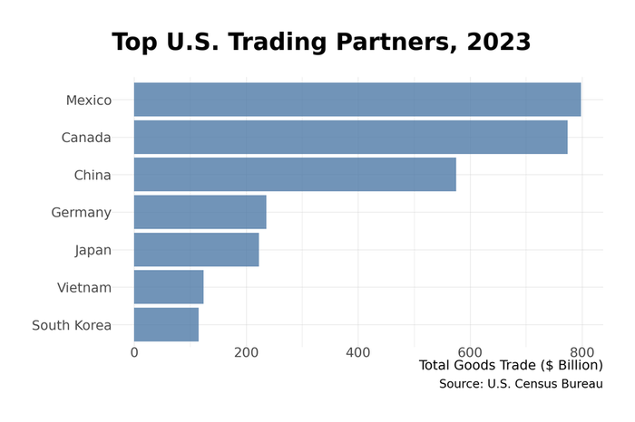
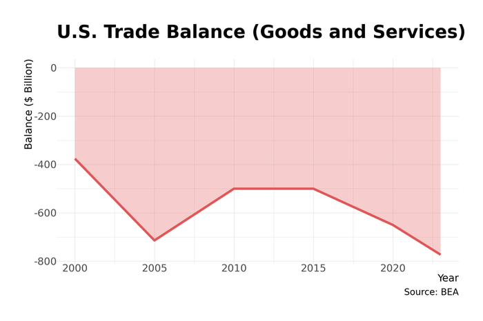

# Chapter 19: America's Trading Relationships

The United States remains the world's largest consumer market and a pivot point for global commerce. Yet America's relationship with the trading system it largely built has undergone a profound transformation. The post-Cold War consensus on free trade—that openness benefits all parties and that markets should determine production location—has fractured. In its place has emerged a world of managed trade, industrial policy, and economic statecraft where tariffs serve strategic as much as economic purposes.

This chapter examines America's trading relationships: the scale and composition of trade flows, the institutional architecture that governs them, and the dramatic policy shifts of recent years.

## The Scale of American Trade

The United States trades roughly $5 trillion in goods annually—more than any other nation.

**Table 19.1: U.S. Goods Trade (2024)**

| Measure | Value |
|---------|-------|
| Total exports | $2.1 trillion |
| Total imports | $3.3 trillion |
| Trade deficit | $1.2 trillion |
| Total trade volume | $5.4 trillion |

The persistent trade deficit—America imports far more than it exports—reflects the economy's role as global consumer of last resort and the dollar's status as reserve currency. The deficit is financed by foreign purchases of American assets: Treasury bonds, corporate securities, and real estate.

### Top Trading Partners

America's largest trading relationships have shifted significantly, with North American neighbors gaining share as China's position has declined.

**Table 19.2: Top U.S. Trading Partners (Goods, 2024)**

| Rank | Partner | Total Trade | Trade Balance |
|------|---------|-------------|---------------|
| 1 | European Union | $980 billion | -$236 billion |
| 2 | Mexico | $840 billion | -$172 billion |
| 3 | Canada | $762 billion | -$68 billion |
| 4 | China | $582 billion | -$295 billion |
| 5 | Japan | $228 billion | -$62 billion |
| 6 | South Korea | $185 billion | -$44 billion |
| 7 | United Kingdom | $147 billion | +$12 billion |
| 8 | Germany | $185 billion | -$85 billion |
| 9 | Vietnam | $165 billion | -$124 billion |
| 10 | Taiwan | $128 billion | -$48 billion |

*Figure 19.1: Top U.S. trading partners. Mexico surpassed China as America's largest trading partner in 2023, reflecting nearshoring trends and tariff effects. Source: Census Bureau*

Mexico surpassed China as America's largest single-country trading partner in 2023—a milestone reflecting both the "nearshoring" trend and the cumulative effect of tariffs on Chinese goods. Vietnam has emerged as a major beneficiary of supply chain diversification, its trade with the U.S. growing from $50 billion in 2015 to $165 billion in 2024.

### Services Trade: The Surplus

While goods trade shows a persistent deficit, services trade runs a surplus. The United States exports more services—financial, professional, intellectual property, travel—than it imports.

**Table 19.3: U.S. Services Trade (2024)**

| Category | Exports | Imports | Balance |
|----------|---------|---------|---------|
| Financial services | $150 billion | $45 billion | +$105 billion |
| Intellectual property | $130 billion | $55 billion | +$75 billion |
| Travel | $195 billion | $180 billion | +$15 billion |
| Transport | $105 billion | $145 billion | -$40 billion |
| Business services | $220 billion | $140 billion | +$80 billion |
| **Total services** | **$920 billion** | **$680 billion** | **+$240 billion** |

*Figure 19.2: U.S. trade balance. The persistent goods deficit (imports > exports) is partially offset by a services surplus. Source: BEA*

The services surplus partially offsets the goods deficit. American dominance in finance, technology, entertainment, and professional services generates enormous foreign earnings—though these are invisible in the shipping containers that dominate trade imagery.

## What America Trades

### Major Exports

The shale revolution transformed America's export profile. Energy products—crude oil, refined petroleum, natural gas—have become the largest export category.

**Table 19.4: Top U.S. Exports (2024)**

| Category | Value | Key Products |
|----------|-------|--------------|
| Mineral fuels | $320 billion | Crude oil, LNG, refined products |
| Machinery | $252 billion | Industrial equipment, turbines |
| Electrical equipment | $214 billion | Semiconductors, power equipment |
| Vehicles | $144 billion | Cars, trucks, parts |
| Aircraft | $134 billion | Commercial jets, engines |
| Pharmaceuticals | $98 billion | Medicines, vaccines |
| Medical instruments | $65 billion | Diagnostic equipment |
| Plastics | $72 billion | Polymers, articles |
| Organic chemicals | $58 billion | Petrochemicals |
| Cereals | $42 billion | Corn, wheat, soybeans |

America exports capital goods (machines that make things), transportation equipment, and commodities (energy, agricultural products). The country runs surpluses in aerospace, agriculture, and energy.

### Major Imports

Consumer goods dominate imports, reflecting America's role as the world's largest consumer market.

**Table 19.5: Top U.S. Imports (2024)**

| Category | Value | Key Products |
|----------|-------|--------------|
| Machinery & computers | $531 billion | Laptops, servers, equipment |
| Electrical equipment | $486 billion | Phones, chips, batteries |
| Vehicles | $391 billion | Cars, trucks, parts |
| Mineral fuels | $251 billion | Crude oil (heavy grades) |
| Pharmaceuticals | $213 billion | Medicines, API |
| Furniture | $85 billion | Household items |
| Apparel | $92 billion | Clothing, textiles |
| Toys & games | $48 billion | Consumer products |
| Footwear | $32 billion | Shoes |
| Iron & steel | $42 billion | Metal products |

The import profile reveals America's manufacturing gaps. Consumer electronics, apparel, and furniture are overwhelmingly imported. Even in vehicles, where domestic production is substantial, America imports roughly $400 billion worth—a category dominated by parts moving back and forth across the USMCA borders.

## Trade Agreements

### The Multilateral System

The United States was the architect of the post-World War II trading system: the General Agreement on Tariffs and Trades (GATT), the World Trade Organization (WTO), and successive rounds of tariff reductions that brought global average tariffs from 40%+ to single digits.

That system has frayed. The WTO's Doha Round (launched 2001) never concluded. The Appellate Body—the WTO's court of appeals—has been non-functional since 2019 because the United States blocked new judge appointments, citing concerns about judicial overreach. The U.S. hasn't withdrawn from the WTO but has rendered key dispute settlement mechanisms inoperative.

### Regional Agreements

**USMCA (United States-Mexico-Canada Agreement)**

USMCA replaced NAFTA in 2020. Key provisions:

- **Automotive rules of origin**: 75% of vehicle content must be North American (up from 62.5% under NAFTA)
- **Labor value content**: 40-45% of vehicles must be produced by workers earning at least $16/hour
- **Rapid Response Mechanism**: Allows investigations of specific factories for labor rights violations
- **Sunset clause**: Agreement must be reviewed every six years, expires after 16 years unless renewed
- **Digital trade**: New chapter on cross-border data flows, prohibition of data localization

The tightened automotive rules were designed to reshore production from Mexico to the United States and raise Mexican wages. Early evidence suggests mixed results: Mexican auto employment has remained strong, while some production has returned to the U.S.

**Bilateral and Strategic Frameworks**

The United States has free trade agreements with 20 countries, including Australia, South Korea, Singapore, and several Latin American nations. But the trend has shifted from comprehensive FTAs toward narrower frameworks:

- **Indo-Pacific Economic Framework (IPEF)**: Not a traditional market-access agreement—no tariff reductions—but a framework for supply chain coordination, digital trade standards, and anti-corruption measures among 14 Asia-Pacific nations
- **Critical minerals agreements**: Targeted deals allowing partner countries (Japan, EU, UK) to qualify for Inflation Reduction Act EV tax credit requirements without full FTAs
- **U.S.-UK Trade Agreement (2025)**: Post-Brexit deal focusing on services, digital trade, and regulatory recognition

### The Tariff Turn

From the late 1940s through 2016, American trade policy moved consistently toward lower tariffs and greater openness. That trajectory reversed sharply.

**Table 19.6: Average U.S. Tariff Rates**

| Period | Trade-Weighted Average | Note |
|--------|------------------------|------|
| 1930 (Smoot-Hawley) | 45%+ | Historic high |
| 1950 | 13% | Post-GATT reduction |
| 1980 | 5.6% | Tokyo Round complete |
| 2000 | 4.0% | Uruguay Round |
| 2017 | 1.5% | Pre-tariff war |
| 2025 | 3-5% | Section 301/232 on targeted goods |

*Note: The overall average remains low because most imports face no special tariffs. However, tariffs on Chinese goods average 19%, and specific categories (EVs, steel) face rates of 25-100%.*

**Section 301 Tariffs (China)**

The Trade Act of 1974's Section 301 authorizes the president to impose tariffs in response to unfair trade practices. Beginning in 2018, the U.S. imposed escalating tariffs on Chinese goods, eventually covering over $350 billion in imports.

Key tariff rates (as of 2025):
- Electric vehicles: 100%
- Semiconductors: 50%
- Solar cells/modules: 50%
- Steel and aluminum products: 25%
- Batteries: 25%
- Many consumer goods: 7.5-25%

The Biden administration maintained and in some cases increased Trump-era tariffs, particularly on strategic goods. The policy rationale shifted from deficit reduction to industrial policy and national security.

**Section 232 Tariffs (National Security)**

Section 232 of the Trade Expansion Act of 1962 authorizes tariffs on national security grounds. The U.S. imposed 25% tariffs on steel and 10% on aluminum in 2018, subsequently raising steel tariffs to 50% for some sources.

These tariffs apply globally, including to allies. Europe, Canada, and other partners received temporary exemptions, then quotas, in ongoing negotiations that have never fully resolved.

**De Minimis Closure (2025)**

Until 2025, packages valued under $800 entered the U.S. duty-free under the "de minimis" exemption. E-commerce platforms—particularly Shein and Temu, shipping directly from Chinese factories—exploited this rule to avoid tariffs entirely. In August 2025, the exemption was terminated, bringing direct-from-China e-commerce under the tariff regime.

## Trade Enforcement Agencies

American trade policy is administered by multiple agencies with overlapping and sometimes conflicting mandates.

### Office of the U.S. Trade Representative (USTR)

USTR is the president's principal trade advisor and negotiator. Located in the Executive Office of the President, USTR negotiates trade agreements, represents the U.S. in WTO disputes, and develops trade policy.

Recent USTR priorities have shifted from "market opening" toward "worker-centric trade policy"—emphasizing labor standards, domestic manufacturing, and skepticism of agreements that primarily benefit corporations.

### Department of Commerce

**Bureau of Industry and Security (BIS)** administers export controls—arguably the most powerful trade tool of the 2020s. BIS maintains the Entity List (companies prohibited from receiving U.S. technology), controls semiconductor equipment exports, and enforces technology transfer restrictions. In practice, BIS now determines which foreign companies can access American technology.

**International Trade Administration (ITA)** investigates dumping (selling below cost) and foreign subsidies. When combined with injury findings from the ITC, these investigations lead to antidumping and countervailing duties on specific products.

### U.S. International Trade Commission (USITC)

An independent, quasi-judicial agency, the USITC conducts injury determinations in trade remedy cases and produces analytical studies on trade impacts. Its investigations determine whether domestic industries are harmed by imports—the prerequisite for imposing antidumping duties.

### Customs and Border Protection (CBP)

CBP enforces trade laws at the border: collecting duties, inspecting cargo, and enforcing product standards. Since 2022, CBP has also enforced the **Uyghur Forced Labor Prevention Act (UFLPA)**, detaining shipments suspected of involving forced labor in Xinjiang. This has become a significant trade barrier for goods with any connection to Chinese cotton, polysilicon, or other Xinjiang-linked supply chains.

## The New Trade Policy

### From Free Trade to Managed Trade

The intellectual framework for American trade policy has shifted fundamentally. The old consensus held that:

- Trade is positive-sum: all parties benefit from specialization
- Market outcomes are presumptively efficient
- Government should reduce barriers and let comparative advantage determine production

The new framework emphasizes:

- Trade has distributional consequences that markets don't correct
- Some production (semiconductors, pharmaceuticals, defense) is "strategic" and shouldn't be offshored
- Geopolitical rivals (China) shouldn't control critical supply chains
- "Efficiency" must be balanced against "resilience"

### Economic Statecraft

Trade policy has fused with foreign policy. Export controls on semiconductors and manufacturing equipment aim to slow China's technological development. Tariffs serve as bargaining leverage. Investment screening (CFIUS) blocks foreign acquisitions of sensitive companies.

The Treasury Department's Office of Foreign Assets Control (OFAC) administers sanctions that function as trade barriers. Russian entities, Chinese technology companies, and Iranian oil exporters face financial exclusion that effectively blocks trade.

### Industrial Policy Linkages

Domestic industrial policy now explicitly discriminates based on supply chain geography. The Inflation Reduction Act's EV tax credits require:

- Battery components manufactured in North America
- Critical minerals sourced from the U.S. or FTA partners
- No components from "Foreign Entities of Concern" (primarily Chinese companies)

The CHIPS Act similarly restricts recipients from expanding advanced manufacturing in China. Trade compliance has become a prerequisite for domestic subsidies.

## The Political Economy of Trade

### Regional Interests

Trade politics vary dramatically by region:

- **Farm Belt**: Agricultural exports (soybeans, corn, pork) depend on foreign markets, particularly China. Farm states have mixed feelings about tariffs that invite retaliation.
- **Rust Belt**: Manufacturing communities support tariffs on steel, aluminum, and Chinese goods. Union members are skeptical of trade agreements.
- **Port cities**: Import-dependent regions (Los Angeles, Seattle, Houston) have economies tied to trade flows.
- **Border regions**: Communities along the Mexican border depend on cross-border commerce.

### Interest Groups

Trade policy attracts intense lobbying from competing interests:

**Pro-liberalization:**
- U.S. Chamber of Commerce: Generally opposes broad tariffs, supports "rules-based" trade
- Business Roundtable: Major corporations prefer stable, open markets
- National Retail Federation: Retailers oppose tariffs (import costs) and supported de minimis
- Agriculture groups: Farm exports require open markets

**Pro-protection:**
- AFL-CIO and industrial unions: Support tariffs, strict labor standards
- United Steelworkers: Strong backers of Section 232
- National Association of Manufacturers: Mixed; supports anti-dumping enforcement
- Semiconductor Industry Association: Supports domestic subsidies but worries about export controls cutting off China market

### The Partisan Realignment

Trade policy has scrambled traditional partisan alignments. Republicans, historically the free-trade party, have become more protectionist under populist influence. Democrats, historically skeptical of trade agreements, now include both union-aligned protectionists and cosmopolitan free-traders.

The bipartisan consensus: skepticism of China. Both parties support tariffs on Chinese goods, export controls on technology, and restrictions on Chinese investment. The disagreement is over how far to extend those policies and whether allies should face similar treatment.

## Firm Profiles

### Walmart

Walmart is America's largest importer, bringing in roughly $400 billion in merchandise annually—more than most countries' total imports. The company's supply chain extends to thousands of factories in China, Vietnam, Bangladesh, and Mexico.

Walmart pioneered the model of using purchasing power to drive down supplier costs, passing savings to consumers. The company's logistics innovations—cross-docking, satellite-linked inventory management, "everyday low prices" enabled by everyday low costs—reshaped American retail.

Trade policy directly affects Walmart's business model. Section 301 tariffs increased costs on Chinese-sourced goods, forcing supplier shifts and some price increases. The company has invested heavily in supply chain diversification, expanding sourcing from India, Vietnam, and Central America.

**Key Statistics (2024):**
- U.S. revenue: $430 billion
- Imports: roughly $400 billion
- Suppliers: 100,000+ globally
- U.S. stores: 4,700+
- Employees: 1.6 million (U.S.)

### Boeing

Boeing exemplifies American aerospace's global reach. The company exports roughly $70 billion annually—more than any other U.S. manufacturer—making it the country's largest exporter by company.

But Boeing also depends on a global supply chain. Major components come from Japan (fuselage sections), France (aircraft systems), and dozens of other countries. The 787 Dreamliner's "global sourcing" strategy—originally designed to reduce costs and spread risk—backfired during production, creating coordination problems that delayed deliveries for years.

Trade policy affects Boeing through export financing (Ex-Im Bank support), technology transfer restrictions (limits on selling to China), and tariff retaliation (European tariffs in the Airbus-Boeing subsidy dispute).

**Key Statistics (2024):**
- Revenue: $78 billion
- Exports: roughly $70 billion
- Commercial aircraft delivered: 528
- Defense revenue: $25 billion
- Employees: 170,000

### TSMC Arizona

Taiwan Semiconductor Manufacturing Company—the world's most advanced chipmaker—is building America's largest semiconductor manufacturing complex in Phoenix, Arizona. The project illustrates both the promise and challenges of reshoring strategic manufacturing.

TSMC announced the Arizona investment in 2020, with a $12 billion first phase producing 5-nanometer chips. Subsequent expansions have pushed total investment to $65 billion across three fabs, including cutting-edge 2-nanometer production planned for 2028.

The project has faced substantial challenges:

- **Labor**: Taiwan's semiconductor workforce culture (long hours, technical expertise) differs from American norms. TSMC initially brought Taiwanese workers for training, creating friction with local unions.
- **Cost**: Building in Arizona costs 4-5x more than Taiwan due to labor, materials, and infrastructure
- **Subsidies**: The project received $6.6 billion in CHIPS Act grants plus substantial tax incentives
- **Timeline**: Production start has slipped multiple times

TSMC Arizona represents the most ambitious attempt to reshore advanced semiconductor manufacturing—a test case for whether America can rebuild manufacturing capacity in strategic industries.

**Key Statistics:**
- Total investment: $65 billion
- CHIPS Act grants: $6.6 billion
- Jobs (projected): 6,000 direct, 20,000+ indirect
- First production: 2025 (Phase 1)
- Technology: 4nm, 3nm, 2nm (phased)

## Conclusion

American trade policy has entered a new era. The half-century movement toward lower barriers and greater openness has reversed. Tariffs have risen to levels not seen since the 1930s. Export controls restrict technology flows to rivals. Industrial policy openly discriminates based on supply chain geography.

The new framework prioritizes resilience over efficiency, security over cost minimization, and domestic production over global optimization. Whether this represents wise adaptation to geopolitical realities or costly retreat from the gains of trade remains fiercely contested.

What's clear is that trade is no longer just economics. It has become a tool of statecraft, an instrument of industrial policy, and a fault line in domestic politics. For businesses, navigating this landscape requires attention to policy as much as markets—and the assumption that rules will continue changing.

## Data Sources and Further Reading

### Data Sources

- **Census Bureau**: Trade statistics (USA Trade Online)
- **Bureau of Economic Analysis**: Services trade, balance of payments
- **USTR**: Trade agreement texts, annual reports
- **USITC**: Trade remedy investigations, data tools
- **WTO**: Tariff profiles, trade statistics

### Further Reading

- **Irwin, Douglas.** *Clashing over Commerce* (2017)—comprehensive U.S. trade policy history
- **Autor, Dorn & Hanson.** "The China Shock" (2016)—trade's impact on American manufacturing
- **Bown, Chad.** Trade policy analysis at Peterson Institute
- **Baldwin, Richard.** *The Great Convergence* (2016)—how global value chains changed trade
- **Klein, Matthew & Pettis, Michael.** *Trade Wars Are Class Wars* (2020)—macroeconomic view of imbalances
