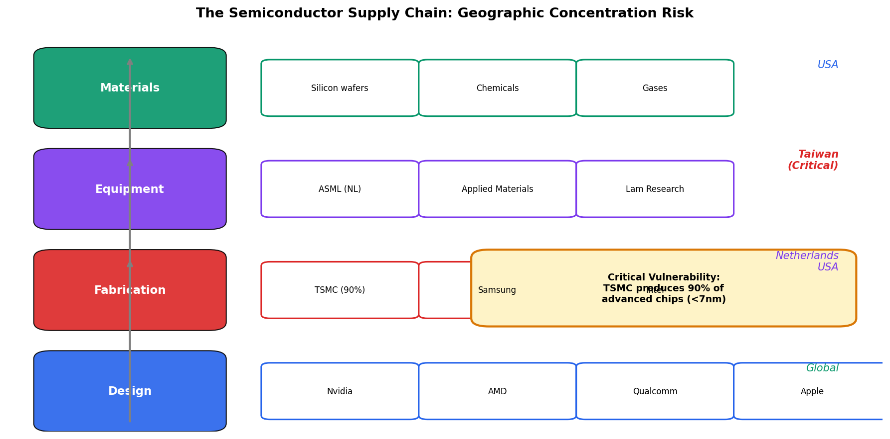
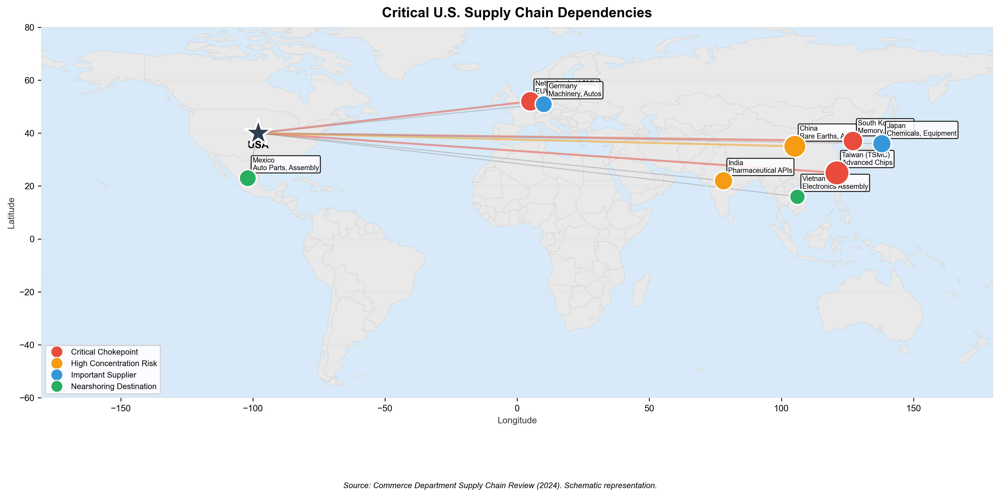
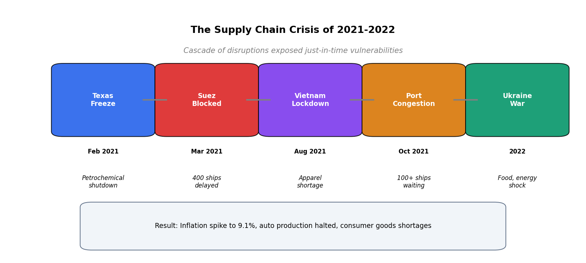

# Chapter 20: Global Supply Chains

Global supply chains are the circulatory system of the modern American economy. While trade statistics focus on finished products crossing borders, the reality of 21st-century commerce is more complex: products cross borders multiple times at different stages of production. A smartphone designed in California contains chips fabricated in Taiwan from equipment made in the Netherlands, assembled in China with batteries from South Korea, and shipped through logistics networks spanning multiple continents.

This chapter examines how American companies organize international production: the physical infrastructure of global trade, the architecture of specific supply chains, the vulnerabilities exposed by recent crises, and the ongoing reorganization toward resilience.

## The Structure of Modern Trade

### Intermediate Goods and Value Chains

Most trade today involves intermediate goods—components used to make other products—rather than finished consumer items.

**Table 20.1: Composition of U.S. Goods Imports (2024)**

| Category | Share | Examples |
|----------|-------|----------|
| Intermediate goods | 45% | Components, parts, materials |
| Capital goods | 25% | Machinery, equipment |
| Consumer goods | 22% | Finished products |
| Automotive | 8% | Vehicles and parts |

A semiconductor is an intermediate good when it goes into a smartphone, a capital good when it goes into factory equipment, and a consumer good when it's sold as a replacement chip. These categories overlap and blur.

### Intra-Firm Trade

A defining feature of globalization is that much trade happens *within* single corporations. In 2023, **related-party trade**—transactions between a U.S. company and its foreign affiliates or parent—accounted for 43% of U.S. goods trade ($2.2 trillion).

This means nearly half of "international trade" is companies shipping goods to themselves across borders. When Ford moves engines from a Mexican plant to a Michigan assembly line, it shows up as a U.S. import from Mexico—but it's internal logistics, not arm's-length commerce.

Intra-firm trade has several implications:

- **Transfer pricing**: Multinational corporations can allocate profits to low-tax jurisdictions by adjusting internal prices
- **Supply chain control**: Companies can coordinate production across borders more tightly than with external suppliers
- **Trade policy sensitivity**: Tariffs on intra-firm trade are effectively taxes on companies' own operations

### The Geography of Production

Production has fragmented across borders following a pattern economists call "global value chains" or "trade in tasks." Different stages of production locate where conditions are most favorable:

| Stage | Location Drivers | Typical Geography |
|-------|------------------|-------------------|
| R&D and design | Talent, IP protection | U.S., Europe, Japan |
| High-value manufacturing | Capital, precision | Germany, Japan, U.S. |
| Component fabrication | Scale, infrastructure | Taiwan, Korea, China |
| Assembly | Labor cost, logistics | China, Vietnam, Mexico |
| Distribution | Market access | Regional hubs |

This fragmentation created efficiency gains—each stage locates optimally—but also vulnerabilities. Disruption at any link ripples through the entire chain.

## Major Trade Corridors

The physical movement of goods relies on specific high-volume corridors connecting the U.S. to global production networks.

### The Transpacific Corridor

**Gateway**: The San Pedro Bay Complex (Ports of Los Angeles and Long Beach) handles 30-40% of all U.S. containerized imports. These twin ports process over 17 million TEUs (twenty-foot equivalent units) annually, dominated by trade with Asia.

**Inland Distribution**: Goods move east via the Alameda Corridor rail link to massive intermodal yards and warehouses in the Inland Empire (Ontario, Riverside, San Bernardino). From there, Union Pacific and BNSF rail lines carry containers to Chicago, Dallas, and Memphis for further distribution.

The LA/Long Beach complex is vulnerable to congestion, labor disputes, and natural disasters—all of which have caused significant disruptions.

### The USMCA Corridor

**Gateway**: Laredo, Texas, is the busiest land port in the Western Hemisphere. Roughly 16,000 trucks cross the World Trade Bridge daily, carrying auto parts, produce, and manufactured goods between Mexico and the U.S.

**The I-35 Corridor**: Often called the "NAFTA Superhighway," I-35 connects Laredo northward through San Antonio, Austin, and Dallas, continuing to Kansas City, Minneapolis, and ultimately Duluth. This corridor carries much of North American automotive supply chain traffic.

Other major land crossings include El Paso-Juarez (second largest), Detroit-Windsor (automotive), and Buffalo-Niagara (general cargo to Canada).

### The Transatlantic Corridor

**Gateway**: The Port of New York and New Jersey is the largest on the East Coast, handling European trade plus Asian cargo routed through the Suez Canal. The port complex spans multiple terminals across Newark, Elizabeth, and Staten Island.

**The I-95 Corridor**: The densely populated Northeast Corridor receives European imports plus transshipped Asian goods. Savannah has grown rapidly as an alternative East Coast gateway, with direct rail connections to Atlanta and the Southeast.

### Domestic Logistics Hubs

**Chicago**: The only city where all six Class I railroads converge, Chicago functions as America's primary freight sorting center. Intermodal yards in suburban Chicago (Joliet, Rochelle) transfer containers between rail and truck for final delivery.

**Memphis**: Home to the FedEx SuperHub, Memphis International Airport is North America's busiest cargo airport. FedEx processes 180+ aircraft nightly, sorting packages for next-day delivery nationwide.

**Louisville**: UPS Worldport, the largest automated package handling facility in the world, processes 2 million packages daily.

## Semiconductor Supply Chains

<figure>

<figcaption>Figure 20.1: The iPhone supply chain spans dozens of countries. Components designed in the U.S. are manufactured across Asia, assembled in China, and shipped worldwide. Source: Author compilation from company data</figcaption>
</figure>

No industry better illustrates the complexity and vulnerability of global supply chains than semiconductors.

### The Geographic Fragmentation

Semiconductor production has fragmented by function:

**Table 20.2: Semiconductor Value Chain Geography**

| Stage | U.S. Share | Dominant Players |
|-------|------------|------------------|
| Design (EDA tools) | 85% | Synopsys, Cadence, Mentor |
| Design (chips) | 50% | NVIDIA, Qualcomm, AMD, Apple |
| Equipment | 40% | Applied Materials, Lam, ASML (NL) |
| Fabrication (leading edge) | 0% | TSMC (Taiwan), Samsung (Korea) |
| Fabrication (mature) | 12% | GlobalFoundries, Intel, TI |
| Assembly/test/packaging | 3% | ASE, Amkor (mostly in Asia) |

The United States dominates chip design and manufacturing equipment but has almost no leading-edge fabrication capacity. The most advanced chips—powering AI systems, smartphones, and advanced computing—come from a single company (TSMC) in a single location (Taiwan).

<figure>

<figcaption>Figure 20.1: The semiconductor supply chain's geographic concentration risk. TSMC in Taiwan produces 90% of the world's most advanced chips. ASML in the Netherlands is the sole supplier of critical EUV lithography equipment. Source: Author analysis</figcaption>
</figure>

### The Chokepoints

**ASML and EUV Lithography**: The most advanced chips require Extreme Ultraviolet (EUV) lithography machines, manufactured exclusively by ASML in the Netherlands. These $200 million machines, containing 100,000+ components from hundreds of suppliers, are the most complex manufacturing equipment ever built. No EUV machine, no leading-edge chips.

**TSMC**: Taiwan Semiconductor Manufacturing Company fabricates over 90% of the world's most advanced logic chips. Apple, NVIDIA, AMD, Qualcomm, and most other leading chip designers depend on TSMC. The concentration creates geopolitical risk—Taiwan sits 100 miles from mainland China—and business risk (a single earthquake or pandemic could halt global electronics production).

**Neon and Specialty Gases**: Semiconductor manufacturing requires ultra-pure specialty gases. Ukraine supplied roughly half of the world's semiconductor-grade neon before Russia's 2022 invasion disrupted production.

### The CHIPS Act Response

The CHIPS and Science Act (2022) committed $52 billion to rebuild domestic semiconductor manufacturing:

- **TSMC Arizona**: $65 billion investment across three fabs, producing down to 2nm chips
- **Intel Ohio**: $20 billion "Silicon Heartland" campus near Columbus
- **Samsung Taylor**: $17 billion fab in Texas
- **Micron New York**: $100 billion memory fab investment over 20 years

Whether these investments can restore U.S. competitiveness remains uncertain. Building costs are 4-5x higher than Asia. The workforce barely exists. And the subsidies, while large, are small relative to what Asian governments have provided for decades.

<figure>

<figcaption>Figure 20.2: Critical U.S. supply chain dependencies. Red markers indicate single-point-of-failure chokepoints (TSMC, ASML); orange indicates high concentration risk (China for rare earths and pharmaceutical precursors); green indicates nearshoring destinations (Mexico, Vietnam). Source: Commerce Department Supply Chain Review (2024)</figcaption>
</figure>

## Automotive Supply Chains

The North American automotive industry functions as a single integrated production network, with components crossing borders multiple times before a vehicle is completed.

### The USMCA Rules

The United States-Mexico-Canada Agreement tightened regional content requirements:

**Table 20.3: USMCA Automotive Content Requirements**

| Requirement | Level | Purpose |
|-------------|-------|---------|
| Regional value content | 75% | Must be North American |
| Labor value content | 40-45% | Must be produced at $16+/hour |
| Core parts | 75% | Engines, transmissions, etc. |
| Steel/aluminum | 70% | Must be "melted and poured" in region |

These rules aim to prevent vehicles from qualifying for duty-free treatment based on minimal regional processing. The labor value content requirement specifically targets the wage gap between Mexico and the U.S./Canada, incentivizing either higher Mexican wages or more U.S. production.

### The EV Transition

Electric vehicles are reorganizing automotive supply chains. The key battleground is batteries.

**Battery Supply Chain Control:**

| Stage | China Share | Alternative Sources |
|-------|-------------|---------------------|
| Lithium refining | 65% | Chile, Australia |
| Cobalt refining | 75% | DRC (mining), Finland |
| Cathode production | 70% | Korea, Japan |
| Anode production | 85% | Japan, limited |
| Cell manufacturing | 75% | Korea, U.S. (growing) |

China dominates battery supply chains more thoroughly than any other country dominates any other critical technology. The Inflation Reduction Act attempts to break this dominance through sourcing requirements for EV tax credits:

- By 2027: 80% of critical minerals from U.S. or FTA partners
- By 2029: 100% of battery components manufactured in North America
- No components from "Foreign Entities of Concern" (Chinese companies)

These requirements are forcing automakers to build North American battery supply chains rapidly—or forfeit billions in tax credits.

### The "Battery Belt"

A corridor of battery and EV manufacturing investment stretches from Michigan through Ohio, Kentucky, Tennessee, and Georgia:

| Project | Location | Investment |
|---------|----------|------------|
| Ford BlueOval City | Tennessee | $5.6 billion |
| Ford BlueOval SK | Kentucky | $5.8 billion |
| GM-LG Ultium | Ohio, Tennessee | $7 billion |
| Toyota | North Carolina | $13.9 billion |
| Hyundai | Georgia | $7.6 billion |
| BMW | South Carolina | $1.7 billion |
| Rivian | Georgia | $5 billion |

This "Battery Belt" represents the largest manufacturing investment wave in decades, driven by IRA subsidies and proximity to existing automotive assembly plants.

## Pharmaceutical Supply Chains

Pharmaceutical manufacturing has concentrated in ways that create national security vulnerabilities.

### The Dependency

**Table 20.4: Pharmaceutical Supply Chain Geography**

| Category | China/India Share | Risk Level |
|----------|-------------------|------------|
| Generic drugs | 70-80% | High |
| Active pharmaceutical ingredients | 70%+ | Critical |
| Antibiotics (inputs) | 90%+ | Critical |
| Key starting materials | 80%+ | High |

The United States imports the vast majority of its generic medicines from India. But India itself imports 70%+ of its active pharmaceutical ingredients (APIs) from China. The ultimate dependency is on Chinese chemical manufacturing.

**Critical Vulnerabilities:**

- **Antibiotics**: China manufactures nearly 90% of global inputs for penicillin and related antibiotics
- **Blood pressure medications**: Most APIs from China/India
- **Diabetes drugs**: Concentrated sourcing
- **Chemotherapy drugs**: Periodic shortages from supply disruptions

### Quality and Security Concerns

The concentration creates multiple risks:

**Quality control**: FDA inspects only a fraction of foreign manufacturing facilities. Several scandals—contaminated heparin (2008), carcinogenic impurities in blood pressure drugs (2018-2019)—revealed quality problems at overseas plants.

**Geopolitical leverage**: China has not weaponized pharmaceutical supply chains, but the capability exists. During COVID-19, export restrictions on PPE and medical supplies demonstrated willingness to use supply chain position strategically.

**Pandemic vulnerability**: COVID-19 created severe shortages of medications, PPE, and medical equipment as global supply chains buckled under simultaneous demand spikes.

### Reshoring Efforts

The federal government has initiated pharmaceutical supply chain diversification:

- **Essential Medicines List**: Identification of drugs requiring domestic or allied sourcing
- **API manufacturing incentives**: Subsidies for domestic ingredient production
- **Strategic reserves**: Stockpiling critical medications
- **Advanced manufacturing**: Supporting continuous manufacturing technology that could make U.S. production competitive

Progress has been slow. Pharmaceutical manufacturing is capital-intensive, heavily regulated, and subject to fierce price competition. Without sustained policy support, economics favor continued offshoring.

## The 2021-22 Supply Chain Crisis

The COVID-19 pandemic exposed fragilities across global supply chains, creating disruptions that took years to resolve.

<figure>

<figcaption>Figure 20.2: The cascade of supply chain disruptions in 2021-22. Sequential shocks—the Texas freeze, Suez blockage, Vietnam lockdowns, port congestion, and Ukraine war—created compounding disruptions that drove inflation to 9.1%. Source: Author analysis</figcaption>
</figure>

### The Demand Shock

The pandemic fundamentally altered consumption patterns. As services spending (travel, dining, entertainment) collapsed, goods spending exploded. Americans bought home office equipment, exercise bikes, home improvement materials, and consumer electronics at unprecedented rates.

This demand surge hit supply chains configured for normal patterns. Factories, shipping networks, and distribution systems couldn't adapt quickly.

### The Bottlenecks

**Port Congestion**: At the crisis peak in late 2021, over 100 container ships anchored off Los Angeles/Long Beach, waiting weeks to berth. The ports operated 24/7 but couldn't clear the backlog. Chassis (the trailers that carry containers) were in short supply. Warehouses were full. Truck drivers were unavailable.

**Shipping Costs**: Container shipping rates from China to the U.S. West Coast rose from roughly $2,000 pre-pandemic to over $20,000 at the peak—a 10x increase that rippled through the prices of everything from furniture to toys.

**Semiconductor Shortage**: Multiple factors converged:
- A drought in Taiwan reduced water supply for chip fabs
- A Texas freeze shut down chemical plants and chip factories
- Fire at a Japanese auto chip plant removed capacity
- Crypto mining absorbed chip production
- Auto demand recovered faster than expected

The result: automakers parked tens of thousands of unfinished vehicles, waiting for chips. Ford, GM, Toyota, and others lost billions in production.

**Table 20.5: Supply Chain Crisis Metrics**

| Metric | Pre-Crisis | Peak Crisis | Resolution |
|--------|------------|-------------|------------|
| LA/LB ship queue | 0-5 | 109 (Jan 2022) | 0 (late 2022) |
| Shanghai-LA container rate | $2,000 | $20,586 | $2,000 (2023) |
| Auto production lost | — | 10+ million units | Recovered 2023 |
| Inflation impact | — | 1-2 pp | Faded 2023 |

### Lessons and Responses

The crisis forced corporate reevaluation of supply chain strategy:

**From efficiency to resilience**: The "just-in-time" model that minimized inventory and maximized efficiency proved fragile. Companies are rebuilding buffer stocks and diversifying suppliers.

**From optimization to optionality**: Rather than single-source lowest-cost suppliers, companies are building redundancy—multiple suppliers in multiple regions.

**From offshore to nearshore**: Geographic concentration (especially in China) creates risk. Mexico, Southeast Asia, and even domestic production are receiving increased investment.

## Reshoring and Nearshoring

### The Mexico Boom

Mexico surpassed China as America's largest goods supplier in 2023. This reflects:

**Nearshoring advantages**:
- Shorter shipping times (days vs. weeks)
- Time zone alignment for coordination
- USMCA duty-free access
- Lower tariff and geopolitical risk
- Growing infrastructure and workforce

**Investment surge**: Foreign direct investment in Mexico reached record levels as companies diversified from China. Nuevo León (Monterrey) and Bajío region have become manufacturing hubs for electronics, appliances, and automotive.

**Limitations**: Mexico has infrastructure constraints (energy, water, ports), security concerns in some regions, and workforce availability challenges. It cannot simply absorb all production leaving China.

### The Manufacturing Construction Boom

U.S. manufacturing construction spending has doubled since 2021, reaching $225 billion annually—the largest investment wave since World War II.

**Key drivers**:
- CHIPS Act semiconductor subsidies
- IRA electric vehicle and battery incentives
- Supply chain security concerns
- Reshoring of strategic production

**Major projects**:
- Semiconductor fabs (Arizona, Ohio, Texas, New York)
- Battery plants (Tennessee, Kentucky, Georgia, North Carolina)
- EV assembly (multiple states)
- Pharmaceutical manufacturing (various)

### "China Plus One"

Most companies are not abandoning China entirely. The market is too large (1.4 billion consumers), the supply base too developed, and existing investments too substantial.

Instead, the dominant strategy is "China Plus One": maintaining China operations while adding capacity elsewhere. Vietnam, India, Indonesia, and Mexico are primary beneficiaries.

**Table 20.6: Alternative Manufacturing Destinations**

| Country | Strengths | Limitations |
|---------|-----------|-------------|
| Vietnam | Low cost, proximity to China | Infrastructure, scale |
| India | Scale, English, democracy | Bureaucracy, infrastructure |
| Indonesia | Scale, resources | Infrastructure, logistics |
| Mexico | Proximity, USMCA | Security, capacity |
| Thailand | Quality, infrastructure | Cost rising |

## Firm Profiles

### Taiwan Semiconductor Manufacturing Company (TSMC)

> **Quick Facts**
> - **Headquarters:** Hsinchu, Taiwan
> - **Revenue:** $69 billion (2023)
> - **Global Foundry Market Share:** 60%+ (90%+ at leading edge)
> - **Employees:** 73,000

TSMC is the most important company most Americans have never heard of. The Taiwanese semiconductor foundry manufactures over 90% of the world's most advanced logic chips—the processors powering iPhones, NVIDIA AI systems, AMD computers, and Qualcomm devices. No other company can fabricate chips at the cutting edge (below 7 nanometers), making TSMC an irreplaceable node in global technology supply chains.

Morris Chang founded TSMC in 1987 with a revolutionary business model: pure-play foundry manufacturing. Rather than designing and selling its own chips (like Intel), TSMC would manufacture chips designed by others. This allowed "fabless" companies—firms without factories—to compete in semiconductors. NVIDIA, Qualcomm, AMD, and eventually Apple built their businesses on TSMC's manufacturing capability.

TSMC's dominance stems from relentless process improvement. The company invests $30+ billion annually in capital expenditure, staying ahead of Samsung (its only potential competitor at advanced nodes) in yield, reliability, and capacity. The firm's workforce culture—demanding hours, precision engineering, deep process expertise—is difficult to replicate elsewhere, as the Arizona fab construction has demonstrated. TSMC's Taiwan location creates geopolitical risk that policymakers increasingly view as unacceptable: the company sits 100 miles from mainland China, and a Taiwan conflict would devastate global electronics production. The CHIPS Act subsidies for U.S. fabs aim partly to reduce this concentration, though TSMC's Arizona operations will produce a small fraction of its Taiwan output.

---

### Flexport

Flexport represents a new model of freight forwarding, combining digital technology with physical logistics to provide end-to-end supply chain visibility.

Founded in 2013 by Ryan Petersen, Flexport built a software platform tracking shipments across ocean, air, truck, and rail—providing the kind of real-time visibility that previously required manual tracking across dozens of systems.

The company gained prominence during the 2021-22 supply chain crisis when Petersen's Twitter threads explaining port congestion went viral. Flexport's data showed shippers what was actually happening in ways traditional freight forwarders couldn't.

Flexport has expanded beyond software into physical operations: chartering aircraft, operating warehouses, and managing end-to-end logistics. The company raised over $2 billion in venture capital before the 2022 downturn forced significant layoffs.

**Key Statistics:**
- Revenue: $4+ billion (2022 peak)
- Freight under management: $19 billion
- Employees: 4,000+ (post-layoffs)
- Customers: 10,000+ shippers
- Technology: 700+ engineers

### Maersk

A.P. Moller-Maersk, the Danish shipping conglomerate, operates the world's largest container shipping fleet and has transformed into an integrated logistics company.

Maersk ships carry roughly 17% of global container trade. The company's vessels—including the world's largest container ships, carrying 24,000+ TEUs—form the backbone of transpacific and transatlantic trade.

Post-2016, Maersk pursued vertical integration, acquiring logistics companies to offer end-to-end supply chain services rather than just ocean shipping. The strategy aims to capture more value and reduce cyclicality.

The 2021-22 boom generated record profits ($31 billion in 2022) as shipping rates soared. The subsequent normalization has pressured margins, though Maersk remains dominant.

**Key Statistics (2023):**
- Revenue: $51 billion
- Container fleet: 700+ vessels
- TEU capacity: 4.3 million
- Employees: 100,000+
- Ports/terminals: 65+

### Apple Supply Chain

Apple operates perhaps the world's most sophisticated consumer electronics supply chain, coordinating thousands of suppliers across dozens of countries to produce hundreds of millions of devices annually.

**The Network:**
- 200+ major suppliers
- Facilities in 50+ countries
- Roughly 2 million workers in supplier facilities
- Annual procurement: $75+ billion

**Geographic Distribution:**
- Design: Cupertino, California
- Chips: TSMC (Taiwan), Samsung (Korea)
- Displays: Samsung, LG (Korea), BOE (China)
- Assembly: Foxconn, Pegatron, Luxshare (China, India, Vietnam)
- Final logistics: Global distribution centers

Apple's supply chain strategy emphasizes control, quality, and secrecy. The company often finances supplier factories, maintains engineers on-site, and enforces strict production standards. Supplier relationships are long-term but demanding.

**Diversification Efforts:**
Since 2020, Apple has aggressively diversified from China:
- India: iPhone assembly (10%+ of production)
- Vietnam: AirPods, MacBooks
- U.S.: Mac Pro assembly (Texas)

The diversification is real but limited. Most iPhone production remains in China, and critical components still flow through Chinese suppliers.

**Key Statistics (Supply Chain, 2024):**
- Products shipped: 500+ million units
- Supply chain workers: 2+ million
- Countries with suppliers: 50+
- India iPhone production: 14% and growing
- R&D spending: $30 billion

## Conclusion

Global supply chains represent both American economic strength and vulnerability. The efficiency gains from global specialization—each stage of production in its optimal location—created wealth and lowered prices for consumers. But that same fragmentation created fragilities that became apparent when pandemic, geopolitics, and climate disrupted flows.

The response has been partial decoupling. Semiconductors, batteries, pharmaceuticals, and other strategic sectors are being reshored or nearshored, backed by unprecedented government subsidies. Mexico and Southeast Asia are gaining share at China's expense. Companies are trading efficiency for resilience.

Yet complete decoupling is neither possible nor desirable. Global supply chains remain the most efficient way to produce complex products. American consumers benefit from lower prices; American companies benefit from global markets. The challenge is finding the right balance—maintaining the benefits of integration while reducing the risks of excessive dependence on any single country or chokepoint.

The supply chain of the future will be more regional, more redundant, and more expensive than the pre-2020 model. Whether it will also be more resilient remains to be tested.

## Data Sources and Further Reading

### Data Sources

- **Census Bureau**: Trade statistics, related-party trade
- **Bureau of Transportation Statistics**: Freight data, port statistics
- **Semiconductor Industry Association**: Chip industry data
- **International Trade Administration**: Supply chain reports
- **Federal Reserve**: Industrial production, capacity data

### Further Reading

- **Baldwin, Richard.** *The Great Convergence* (2016)—how supply chains changed globalization
- **Shih, Willy.** Harvard Business Review articles on manufacturing and supply chains
- **Miller, Chris.** *Chip War* (2022)—semiconductor supply chain history
- **Levinson, Marc.** *The Box* (2006)—containerization revolution
- **Dingel, Jonathan.** International trade course materials (econ35101)
