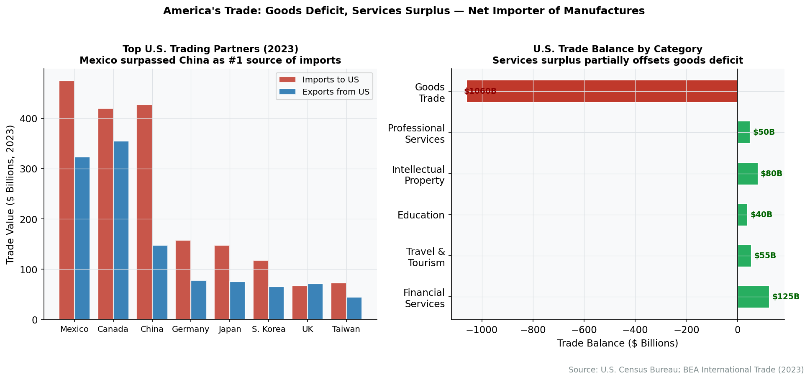
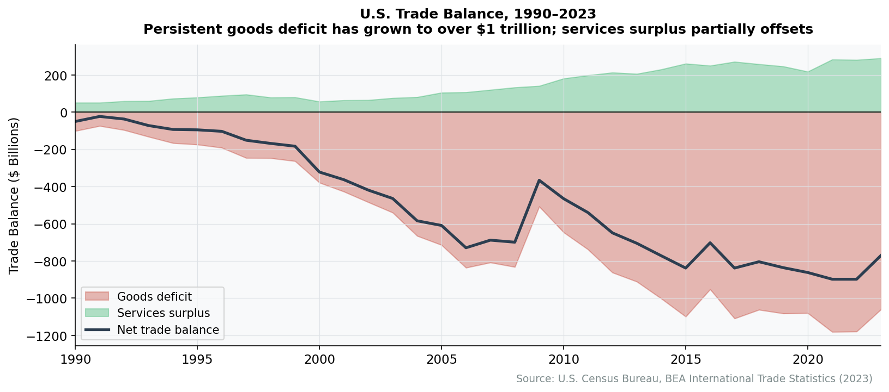

# Chapter 21: America's Trading Relationships

In 1994, the United States championed NAFTA and pushed China toward WTO membership, betting that free trade would spread prosperity and anchor geopolitical stability. Thirty years later, American tariffs on Chinese goods average 19%—higher than the Smoot-Hawley rates of the 1930s that economics textbooks cite as a cautionary tale. The United States now actively discourages semiconductor investment in China, restricts technology exports, and subsidizes domestic manufacturing. The country that built the postwar trading system is now busily dismantling parts of it.

This chapter examines what remains: $5 trillion in annual goods trade, relationships with 200 trading partners, an institutional architecture of treaties and enforcement mechanisms, and the policy shifts reshaping all of it.

## The Scale of American Trade


**The Trade Deficit Paradox**

America's persistent trade deficit—importing $1.2 trillion more than it exports—reflects its role as global consumer of last resort. The deficit is financed by foreign purchases of American assets: Treasury bonds, stocks, and real estate. In effect, the world lends to America so America can buy from the world. The dollar's reserve currency status makes this sustainable.


The United States trades roughly $5 trillion in goods annually—more than any other nation.

**Table 21.1: U.S. Goods Trade (2024)**

| Measure | Value |
|---------|-------|
| Total exports | $2.1 trillion |
| Total imports | $3.3 trillion |
| Trade deficit | $1.2 trillion |
| Total trade volume | $5.4 trillion |

*Source: Census Bureau, USA Trade Online, 2024*

The persistent trade deficit—America imports far more than it exports—reflects the economy's role as global consumer of last resort and the dollar's status as reserve currency. The deficit is financed by foreign purchases of American assets: Treasury bonds, corporate securities, and real estate.

### Top Trading Partners

America's largest trading relationships have shifted significantly, with North American neighbors gaining share as China's position has declined.

**Table 21.2: Top U.S. Trading Partners (Goods, 2024)**

| Rank | Partner | Total Trade | Trade Balance |
|------|---------|-------------|---------------|
| 1 | European Union | $980 billion | -$236 billion |
| 2 | Mexico | $840 billion | -$172 billion |
| 3 | Canada | $762 billion | -$68 billion |
| 4 | China | $582 billion | -$295 billion |
| 5 | Japan | $228 billion | -$62 billion |
| 6 | South Korea | $185 billion | -$44 billion |
| 7 | United Kingdom | $147 billion | +$12 billion |
| 8 | Germany | $185 billion | -$85 billion |
| 9 | Vietnam | $165 billion | -$124 billion |
| 10 | Taiwan | $128 billion | -$48 billion |

*Source: Census Bureau, Foreign Trade Statistics, 2024*

<figure>

<figcaption>Figure 21.1: Top U.S. trading partners. Mexico surpassed China as America's largest trading partner in 2023, reflecting nearshoring trends and tariff effects. Source: Census Bureau</figcaption>
</figure>

Mexico surpassed China as America's largest single-country trading partner in 2023—a milestone reflecting both the "nearshoring" trend and the cumulative effect of tariffs on Chinese goods. Vietnam has emerged as a major beneficiary of supply chain diversification, its trade with the U.S. growing from $50 billion in 2015 to $165 billion in 2024.

### Services Trade: The Surplus

While goods trade shows a persistent deficit, services trade runs a surplus. The United States exports more services—financial, professional, intellectual property, travel—than it imports.

**Table 21.3: U.S. Services Trade (2024)**

| Category | Exports | Imports | Balance |
|----------|---------|---------|---------|
| Financial services | $150 billion | $45 billion | +$105 billion |
| Intellectual property | $130 billion | $55 billion | +$75 billion |
| Travel | $195 billion | $180 billion | +$15 billion |
| Transport | $105 billion | $145 billion | -$40 billion |
| Business services | $220 billion | $140 billion | +$80 billion |
| **Total services** | **$920 billion** | **$680 billion** | **+$240 billion** |

*Source: Bureau of Economic Analysis, International Services, 2024*

<figure>

<figcaption>Figure 21.2: U.S. trade balance. The persistent goods deficit (imports > exports) is partially offset by a services surplus. Source: BEA</figcaption>
</figure>

The services surplus partially offsets the goods deficit. American dominance in finance, technology, entertainment, and professional services generates enormous foreign earnings—though these are invisible in the shipping containers that dominate trade imagery.

## What America Trades

### Major Exports

The shale revolution transformed America's export profile. Energy products—crude oil, refined petroleum, natural gas—have become the largest export category.

**Table 21.4: Top U.S. Exports (2024)**

| Category | Value | Key Products |
|----------|-------|--------------|
| Mineral fuels | $320 billion | Crude oil, LNG, refined products |
| Machinery | $252 billion | Industrial equipment, turbines |
| Electrical equipment | $214 billion | Semiconductors, power equipment |
| Vehicles | $144 billion | Cars, trucks, parts |
| Aircraft | $134 billion | Commercial jets, engines |
| Pharmaceuticals | $98 billion | Medicines, vaccines |
| Medical instruments | $65 billion | Diagnostic equipment |
| Plastics | $72 billion | Polymers, articles |
| Organic chemicals | $58 billion | Petrochemicals |
| Cereals | $42 billion | Corn, wheat, soybeans |

*Source: Census Bureau, USA Trade Online, 2024*

America exports capital goods (machines that make things), transportation equipment, and commodities (energy, agricultural products). The country runs surpluses in aerospace, agriculture, and energy.

### Major Imports

Consumer goods dominate imports, reflecting America's role as the world's largest consumer market.

**Table 21.5: Top U.S. Imports (2024)**

| Category | Value | Key Products |
|----------|-------|--------------|
| Machinery & computers | $531 billion | Laptops, servers, equipment |
| Electrical equipment | $486 billion | Phones, chips, batteries |
| Vehicles | $391 billion | Cars, trucks, parts |
| Mineral fuels | $251 billion | Crude oil (heavy grades) |
| Pharmaceuticals | $213 billion | Medicines, API |
| Furniture | $85 billion | Household items |
| Apparel | $92 billion | Clothing, textiles |
| Toys & games | $48 billion | Consumer products |
| Footwear | $32 billion | Shoes |
| Iron & steel | $42 billion | Metal products |

*Source: Census Bureau, USA Trade Online, 2024*

The import profile reveals America's manufacturing gaps. Consumer electronics, apparel, and furniture are overwhelmingly imported. Even in vehicles, where domestic production is substantial, America imports roughly $400 billion worth—a category dominated by parts moving back and forth across the USMCA borders.

## Trade Agreements

### The Multilateral System

The United States was the architect of the post-World War II trading system: the General Agreement on Tariffs and Trades (GATT), the World Trade Organization (WTO), and successive rounds of tariff reductions that brought global average tariffs from 40%+ to single digits.

That system has frayed. The WTO's Doha Round (launched 2001) never concluded. The Appellate Body—the WTO's court of appeals—has been non-functional since 2019 because the United States blocked new judge appointments, citing concerns about judicial overreach. The U.S. hasn't withdrawn from the WTO but has rendered key dispute settlement mechanisms inoperative.

### Regional Agreements

**USMCA (United States-Mexico-Canada Agreement)**

USMCA replaced NAFTA in 2020. Key provisions:

- **Automotive rules of origin**: 75% of vehicle content must be North American (up from 62.5% under NAFTA)
- **Labor value content**: 40-45% of vehicles must be produced by workers earning at least $16/hour
- **Rapid Response Mechanism**: Allows investigations of specific factories for labor rights violations
- **Sunset clause**: Agreement must be reviewed every six years, expires after 16 years unless renewed
- **Digital trade**: New chapter on cross-border data flows, prohibition of data localization

The tightened automotive rules were designed to reshore production from Mexico to the United States and raise Mexican wages. Early evidence suggests mixed results: Mexican auto employment has remained strong, while some production has returned to the U.S.

**Bilateral and Strategic Frameworks**

The United States has free trade agreements with 20 countries, including Australia, South Korea, Singapore, and several Latin American nations. But the trend has shifted from comprehensive FTAs toward narrower frameworks:

- **Indo-Pacific Economic Framework (IPEF)**: Not a traditional market-access agreement—no tariff reductions—but a framework for supply chain coordination, digital trade standards, and anti-corruption measures among 14 Asia-Pacific nations
- **Critical minerals agreements**: Targeted deals allowing partner countries (Japan, EU, UK) to qualify for Inflation Reduction Act EV tax credit requirements without full FTAs
- **U.S.-UK Trade Agreement (2025)**: Post-Brexit deal focusing on services, digital trade, and regulatory recognition

### The Tariff Turn

From the late 1940s through 2016, American trade policy moved consistently toward lower tariffs and greater openness. That trajectory reversed sharply.

**Table 21.6: Average U.S. Tariff Rates**

| Period | Trade-Weighted Average | Note |
|--------|------------------------|------|
| 1930 (Smoot-Hawley) | 45%+ | Historic high |
| 1950 | 13% | Post-GATT reduction |
| 1980 | 5.6% | Tokyo Round complete |
| 2000 | 4.0% | Uruguay Round |
| 2017 | 1.5% | Pre-tariff war |
| 2025 | 3-5% | Section 301/232 on targeted goods |

*Source: USITC, Tariff Database; World Bank WITS, 2024*

*Note: The overall average remains low because most imports face no special tariffs. However, tariffs on Chinese goods average 19%, and specific categories (EVs, steel) face rates of 25-100%.*

**Section 301 Tariffs (China)**

The Trade Act of 1974's Section 301 authorizes the president to impose tariffs in response to unfair trade practices. Beginning in 2018, the U.S. imposed escalating tariffs on Chinese goods, eventually covering over $350 billion in imports.

Key tariff rates (as of 2025):
- Electric vehicles: 100%
- Semiconductors: 50%
- Solar cells/modules: 50%
- Steel and aluminum products: 25%
- Batteries: 25%
- Many consumer goods: 7.5-25%

The Biden administration maintained and in some cases increased Trump-era tariffs, particularly on strategic goods. The policy rationale shifted from deficit reduction to industrial policy and national security.

**Section 232 Tariffs (National Security)**

Section 232 of the Trade Expansion Act of 1962 authorizes tariffs on national security grounds. The U.S. imposed 25% tariffs on steel and 10% on aluminum in 2018, subsequently raising steel tariffs to 50% for some sources.

These tariffs apply globally, including to allies. Europe, Canada, and other partners received temporary exemptions, then quotas, in ongoing negotiations that have never fully resolved.

**De Minimis Closure (2025)**

Until 2025, packages valued under $800 entered the U.S. duty-free under the "de minimis" exemption. E-commerce platforms—particularly Shein and Temu, shipping directly from Chinese factories—exploited this rule to avoid tariffs entirely. In August 2025, the exemption was terminated, bringing direct-from-China e-commerce under the tariff regime.

## Trade Enforcement Agencies

American trade policy is administered by multiple agencies with overlapping and sometimes conflicting mandates.

### Office of the U.S. Trade Representative (USTR)

USTR is the president's principal trade advisor and negotiator. Located in the Executive Office of the President, USTR negotiates trade agreements, represents the U.S. in WTO disputes, and develops trade policy.

Recent USTR priorities have shifted from "market opening" toward "worker-centric trade policy"—emphasizing labor standards, domestic manufacturing, and skepticism of agreements that primarily benefit corporations.

### Department of Commerce

**Bureau of Industry and Security (BIS)** administers export controls—arguably the most powerful trade tool of the 2020s. BIS maintains the Entity List (companies prohibited from receiving U.S. technology), controls semiconductor equipment exports, and enforces technology transfer restrictions. In practice, BIS now determines which foreign companies can access American technology.

**International Trade Administration (ITA)** investigates dumping (selling below cost) and foreign subsidies. When combined with injury findings from the ITC, these investigations lead to antidumping and countervailing duties on specific products.

### U.S. International Trade Commission (USITC)

An independent, quasi-judicial agency, the USITC conducts injury determinations in trade remedy cases and produces analytical studies on trade impacts. Its investigations determine whether domestic industries are harmed by imports—the prerequisite for imposing antidumping duties.

### Customs and Border Protection (CBP)

CBP enforces trade laws at the border: collecting duties, inspecting cargo, and enforcing product standards. Since 2022, CBP has also enforced the **Uyghur Forced Labor Prevention Act (UFLPA)**, detaining shipments suspected of involving forced labor in Xinjiang. This has become a significant trade barrier for goods with any connection to Chinese cotton, polysilicon, or other Xinjiang-linked supply chains.

## The New Trade Policy

### From Free Trade to Managed Trade

The intellectual framework for American trade policy has shifted fundamentally. The old consensus held that:

- Trade is positive-sum: all parties benefit from specialization
- Market outcomes are presumptively efficient
- Government should reduce barriers and let comparative advantage determine production

The new framework emphasizes:

- Trade has distributional consequences that markets don't correct
- Some production (semiconductors, pharmaceuticals, defense) is "strategic" and shouldn't be offshored
- Geopolitical rivals (China) shouldn't control critical supply chains
- "Efficiency" must be balanced against "resilience"

### Economic Statecraft

Trade policy has fused with foreign policy. Export controls on semiconductors and manufacturing equipment aim to slow China's technological development. Tariffs serve as bargaining leverage. Investment screening (CFIUS) blocks foreign acquisitions of sensitive companies.

The Treasury Department's Office of Foreign Assets Control (OFAC) administers sanctions that function as trade barriers. Russian entities, Chinese technology companies, and Iranian oil exporters face financial exclusion that effectively blocks trade.

### Industrial Policy Linkages

Domestic industrial policy now explicitly discriminates based on supply chain geography. The Inflation Reduction Act's EV tax credits require:

- Battery components manufactured in North America
- Critical minerals sourced from the U.S. or FTA partners
- No components from "Foreign Entities of Concern" (primarily Chinese companies)

The CHIPS Act similarly restricts recipients from expanding advanced manufacturing in China. Trade compliance has become a prerequisite for domestic subsidies.


**Deep Dive: How U.S. Economic Institutions Compare to Trading Partners**

Trade debates often focus on tariffs and exchange rates, but the deeper structural differences between the U.S. and its trading partners lie in labor law, corporate taxation, and social insurance. These institutional differences shape production costs, firm behavior, and the political feasibility of trade liberalization. A workforce with universal healthcare and generous unemployment benefits can absorb trade shocks that would devastate workers dependent on employer-provided coverage and minimal safety nets.

**Labor Laws**

The United States is the only advanced economy that maintains "at-will" employment as the default rule—employers can terminate workers for any non-discriminatory reason, with no notice period and no statutory severance. Germany requires 1–7 months of notice depending on tenure, plus works council consultation. Japan's courts have developed a "doctrine of abusive dismissal" that makes layoffs of regular employees extremely difficult in practice. The U.K. mandates 1–12 weeks of statutory notice and provides redundancy pay after two years of service.

Union density reinforces these differences. Roughly 10% of American workers belong to unions (6% in the private sector). In Germany, collective bargaining agreements cover about 52% of workers through sectoral agreements, even at non-union firms. Japan's enterprise unions cover roughly 16% of workers but exert influence through the "spring offensive" (shunto) wage negotiations. The U.K. sits at about 23% union density, down from its postwar peak but still double the U.S. rate.

On minimum wages, the U.S. federal floor of $7.25/hour has not increased since 2009—the longest stretch without adjustment in the minimum wage's history. Most states set higher floors, but significant regional variation persists. Germany introduced a national minimum wage only in 2015 (now €12.82/hour). Japan sets prefectural minimums averaging roughly ¥1,050/hour (~$7.50). The U.K.'s National Living Wage stands at £12.21/hour (~$15.50).

**Corporate Tax Structures**

The Tax Cuts and Jobs Act (TCJA) of 2017 cut the U.S. federal corporate rate from 35% to 21%, dropping America from the highest statutory rate in the OECD to slightly below average. Combined with state taxes (averaging 4–5%), the effective U.S. rate is roughly 25–26%. Germany's combined federal/trade tax rate is about 30%. Japan's effective rate is approximately 30%. The U.K. raised its rate to 25% in 2023 after years at 19%.

The TCJA also shifted the U.S. to a modified territorial system for overseas profits, exempting most foreign earnings from domestic tax—aligning with the approach long used by the U.K. and Japan. Germany operates a similar participation exemption. However, the U.S. introduced GILTI (Global Intangible Low-Taxed Income), a minimum tax on foreign earnings designed to discourage profit shifting to tax havens. The OECD's Pillar Two framework (15% global minimum tax), agreed in 2021 and being implemented unevenly, partially converges these regimes.

On R&D incentives, the U.S. offers a federal research tax credit (roughly 6–8% of qualifying expenses), but it ranks below many peers in generosity. The U.K.'s R&D tax relief provides up to 27% for qualifying SME expenditures. Japan and Germany offer direct R&D tax credits alongside government co-investment in applied research through institutions like Fraunhofer and AIST.

**Social Insurance**

The most consequential institutional difference is healthcare. The U.S. is the only OECD nation where health insurance is primarily employer-provided, adding $10,000–$25,000 per employee in annual costs depending on plan generosity. Germany, Japan, and the U.K. all provide universal coverage funded through taxes or social insurance contributions—costs that fall on the general budget rather than individual employers' balance sheets. This difference directly affects labor mobility, firm formation, and the ability of workers to weather job transitions caused by trade displacement.

Unemployment insurance in the U.S. typically replaces 30–40% of prior wages for a maximum of 26 weeks (varying by state). Germany's Arbeitslosengeld replaces 60–67% for up to 12 months, with longer durations for older workers. Japan provides 50–80% replacement for 3–11 months. The U.K.'s Universal Credit is less generous in replacement rate but has no fixed duration. The gap matters for trade adjustment: German workers displaced by Chinese competition had a stronger safety net than their American counterparts in the Rust Belt.

Retirement systems diverge similarly. The U.S. relies heavily on employer-sponsored 401(k) plans (defined contribution), shifting investment risk to workers. Germany's three-pillar system includes a pay-as-you-go state pension replacing roughly 48% of earnings. Japan combines a flat-rate National Pension with an earnings-related Employees' Pension. The U.K. blends a state pension with auto-enrolled workplace pensions. In each peer country, the state pension provides a higher baseline than Social Security's roughly 40% replacement rate for median earners.

**Table: Institutional Comparison—U.S. vs. Key Trading Partners**

| Dimension | United States | Germany | Japan | United Kingdom |
|-----------|--------------|---------|-------|----------------|
| **Employment protection** | At-will (minimal) | Strong; 1–7 months notice, works councils | Very strong; abusive dismissal doctrine | Moderate; 1–12 weeks notice, redundancy pay |
| **Union density** | 10% (6% private) | 16% (52% covered by bargaining) | 16% | 23% |
| **Minimum wage** | $7.25 federal (varies by state) | €12.82/hr (~$14.25) | ~¥1,050/hr (~$7.50) | £12.21/hr (~$15.50) |
| **Corporate tax rate (combined)** | ~25–26% (21% federal + state) | ~30% | ~30% | 25% |
| **Overseas profit treatment** | Territorial + GILTI minimum | Participation exemption | Territorial exemption | Territorial exemption |
| **R&D tax incentive** | 6–8% credit | Direct grants + tax allowance | Tax credit + co-investment | Up to 27% relief (SMEs) |
| **Healthcare** | Employer-provided (no universal system) | Universal (statutory insurance) | Universal (social insurance) | Universal (NHS, tax-funded) |
| **Unemployment replacement** | 30–40%, up to 26 weeks | 60–67%, up to 12 months | 50–80%, 3–11 months | Lower rate, no fixed duration |
| **Retirement system** | Social Security + 401(k) | State pension (~48%) + occupational | National + Employees' Pension | State pension + auto-enroll workplace |

*Sources: OECD Employment Outlook 2024; OECD Tax Database; OECD Social Expenditure Database; national statistical agencies*

These institutional gaps explain why trade adjustment is harder in the United States than in peer economies. An American autoworker displaced by imports may simultaneously lose wages, health insurance, and retirement contributions. A German autoworker in the same situation retains healthcare, receives more generous unemployment benefits for a longer period, and keeps accruing state pension credits. The political backlash against trade in the U.S. is partly a backlash against the absence of institutional buffers that other advanced economies take for granted.


## The Political Economy of Trade

### Regional Interests

Trade politics vary dramatically by region:

- **Farm Belt**: Agricultural exports (soybeans, corn, pork) depend on foreign markets, particularly China. Farm states have mixed feelings about tariffs that invite retaliation.
- **Rust Belt**: Manufacturing communities support tariffs on steel, aluminum, and Chinese goods. Union members are skeptical of trade agreements.
- **Port cities**: Import-dependent regions (Los Angeles, Seattle, Houston) have economies tied to trade flows.
- **Border regions**: Communities along the Mexican border depend on cross-border commerce.

### Interest Groups

Trade policy attracts intense lobbying from competing interests:

**Pro-liberalization:**
- U.S. Chamber of Commerce: Generally opposes broad tariffs, supports "rules-based" trade
- Business Roundtable: Major corporations prefer stable, open markets
- National Retail Federation: Retailers oppose tariffs (import costs) and supported de minimis
- Agriculture groups: Farm exports require open markets

**Pro-protection:**
- AFL-CIO and industrial unions: Support tariffs, strict labor standards
- United Steelworkers: Strong backers of Section 232
- National Association of Manufacturers: Mixed; supports anti-dumping enforcement
- Semiconductor Industry Association: Supports domestic subsidies but worries about export controls cutting off China market

### The Partisan Realignment

Trade policy has scrambled traditional partisan alignments. Republicans, historically the free-trade party, have become more protectionist under populist influence. Democrats, historically skeptical of trade agreements, now include both union-aligned protectionists and cosmopolitan free-traders.

The bipartisan consensus: skepticism of China. Both parties support tariffs on Chinese goods, export controls on technology, and restrictions on Chinese investment. The disagreement is over how far to extend those policies and whether allies should face similar treatment.

## Firm Profiles

### Port of Los Angeles and Long Beach

> **Quick Facts**
> - **Location:** San Pedro Bay, California
> - **Combined Annual Volume:** 17+ million TEUs
> - **U.S. Import Share:** 30-40% of containerized imports
> - **Economic Impact:** $450+ billion in trade value annually

The twin ports of Los Angeles and Long Beach—collectively the San Pedro Bay Complex—form America's primary gateway to Asia and the largest container port complex in the Western Hemisphere. Together they handle more cargo than all other West Coast ports combined and serve as the entry point for goods from China, Vietnam, Japan, South Korea, and Taiwan.

The ports operate as separate entities—Los Angeles is a city department, Long Beach a city enterprise—but function as a single integrated complex sharing the same bay, similar infrastructure, and common challenges. The Port of Los Angeles handles slightly more volume (roughly 9.5 million TEUs annually), while Long Beach operates the most automated terminals. Major terminal operators include APM Terminals (Maersk), SSA Marine, and Yang Ming.

The 2021-22 supply chain crisis exposed the complex's vulnerabilities. At the peak, over 100 container ships anchored offshore waiting weeks to berth. The ports lacked surge capacity, chassis were in short supply, warehouses were full, and trucker availability was limited. The backlog took months to clear. Since then, both ports have invested in automation, extended operating hours, and coordinated with railroads to improve throughput. But fundamental constraints remain: the ports are surrounded by dense urban development, and expansion faces environmental and community opposition. The Panama Canal expansion has shifted some cargo to Gulf and East Coast ports, beginning a long-term diversification of American trade infrastructure away from total dependence on San Pedro Bay.

---

### Office of the U.S. Trade Representative (USTR)

> **Quick Facts**
> - **Headquarters:** Washington, DC (Executive Office of the President)
> - **Agency Type:** Cabinet-level Executive Office
> - **Staff:** ~250 employees
> - **Role:** Principal trade negotiator and policy advisor

The Office of the U.S. Trade Representative is the federal agency responsible for developing and coordinating American trade policy. The U.S. Trade Representative—a Cabinet-level position—serves as the president's principal advisor on trade and as the chief U.S. negotiator for international trade agreements.

Created in 1962 and elevated to Cabinet status in 1974, USTR emerged from Congressional frustration with the State Department's handling of trade negotiations, which lawmakers felt prioritized diplomatic relationships over American commercial interests. USTR's location in the Executive Office of the President (rather than as an independent department) gives it direct access to presidential decision-making while maintaining arms-length separation from agencies with competing interests.

USTR's small staff punches far above its weight. The agency negotiates bilateral and multilateral trade agreements, represents the United States in World Trade Organization disputes, administers Section 301 (unfair trade practices) investigations, and coordinates the interagency trade policy process. Recent USTR priorities have shifted from traditional "market opening" toward what the agency calls "worker-centered trade policy"—emphasizing labor standards, environmental provisions, and skepticism of agreements that benefit corporations without delivering gains to workers. Under both Trump and Biden administrations, USTR maintained tariffs on Chinese goods and pursued aggressive use of Section 301 authority. The agency's pivot from free-trade orthodoxy to managed trade reflects the broader transformation of American trade policy.

---

### Walmart

Walmart is America's largest importer, bringing in roughly $400 billion in merchandise annually—more than most countries' total imports. The company's supply chain extends to thousands of factories in China, Vietnam, Bangladesh, and Mexico.

Walmart pioneered the model of using purchasing power to drive down supplier costs, passing savings to consumers. The company's logistics innovations—cross-docking, satellite-linked inventory management, "everyday low prices" enabled by everyday low costs—reshaped American retail.

Trade policy directly affects Walmart's business model. Section 301 tariffs increased costs on Chinese-sourced goods, forcing supplier shifts and some price increases. The company has invested heavily in supply chain diversification, expanding sourcing from India, Vietnam, and Central America.

**Key Statistics (2024):**
- U.S. revenue: $430 billion
- Imports: roughly $400 billion
- Suppliers: 100,000+ globally
- U.S. stores: 4,700+
- Employees: 1.6 million (U.S.)

### Boeing

Boeing exemplifies American aerospace's global reach. The company exports roughly $70 billion annually—more than any other U.S. manufacturer—making it the country's largest exporter by company.

But Boeing also depends on a global supply chain. Major components come from Japan (fuselage sections), France (aircraft systems), and dozens of other countries. The 787 Dreamliner's "global sourcing" strategy—originally designed to reduce costs and spread risk—backfired during production, creating coordination problems that delayed deliveries for years.

Trade policy affects Boeing through export financing (Ex-Im Bank support), technology transfer restrictions (limits on selling to China), and tariff retaliation (European tariffs in the Airbus-Boeing subsidy dispute).

**Key Statistics (2024):**
- Revenue: $78 billion
- Exports: roughly $70 billion
- Commercial aircraft delivered: 528
- Defense revenue: $25 billion
- Employees: 170,000

### TSMC Arizona

Taiwan Semiconductor Manufacturing Company—the world's most advanced chipmaker—is building America's largest semiconductor manufacturing complex in Phoenix, Arizona. The project illustrates both the promise and challenges of reshoring strategic manufacturing.

TSMC announced the Arizona investment in 2020, with a $12 billion first phase producing 5-nanometer chips. Subsequent expansions have pushed total investment to $65 billion across three fabs, including cutting-edge 2-nanometer production planned for 2028.

The project has faced substantial challenges:

- **Labor**: Taiwan's semiconductor workforce culture (long hours, technical expertise) differs from American norms. TSMC initially brought Taiwanese workers for training, creating friction with local unions.
- **Cost**: Building in Arizona costs 4-5x more than Taiwan due to labor, materials, and infrastructure
- **Subsidies**: The project received $6.6 billion in CHIPS Act grants plus substantial tax incentives
- **Timeline**: Production start has slipped multiple times

TSMC Arizona represents the most ambitious attempt to reshore advanced semiconductor manufacturing—a test case for whether America can rebuild manufacturing capacity in strategic industries.

**Key Statistics:**
- Total investment: $65 billion
- CHIPS Act grants: $6.6 billion
- Jobs (projected): 6,000 direct, 20,000+ indirect
- First production: 2025 (Phase 1)
- Technology: 4nm, 3nm, 2nm (phased)

## Conclusion

American trade policy has entered a new era. The half-century movement toward lower barriers and greater openness has reversed. Tariffs have risen to levels not seen since the 1930s. Export controls restrict technology flows to rivals. Industrial policy openly discriminates based on supply chain geography.

The new framework prioritizes resilience over efficiency, security over cost minimization, and domestic production over global optimization. Whether this represents wise adaptation to geopolitical realities or costly retreat from the gains of trade remains fiercely contested.

What's clear is that trade is no longer just economics. It has become a tool of statecraft, an instrument of industrial policy, and a fault line in domestic politics. For businesses, navigating this landscape requires attention to policy as much as markets—and the assumption that rules will continue changing.

## Data Sources and Further Reading

### Data Sources

- **Census Bureau**: Trade statistics (USA Trade Online)
- **Bureau of Economic Analysis**: Services trade, balance of payments
- **USTR**: Trade agreement texts, annual reports
- **USITC**: Trade remedy investigations, data tools
- **WTO**: Tariff profiles, trade statistics

### Further Reading

- **Irwin, Douglas.** *Clashing over Commerce* (2017)—comprehensive U.S. trade policy history
- **Autor, Dorn & Hanson.** "The China Shock" (2016)—trade's impact on American manufacturing
- **Bown, Chad.** Trade policy analysis at Peterson Institute
- **Baldwin, Richard.** *The Great Convergence* (2016)—how global value chains changed trade
- **Klein, Matthew & Pettis, Michael.** *Trade Wars Are Class Wars* (2020)—macroeconomic view of imbalances

## Exercises

### Review Questions

1. The United States runs a persistent goods trade deficit of roughly $1.2 trillion per year, yet this deficit is described as "financed by foreign purchases of American assets." Explain the mechanism by which the trade deficit and capital inflows are connected. Why does the dollar's reserve currency status make this arrangement sustainable in ways it would not be for most other countries?

2. Mexico surpassed China as America's largest single-country trading partner in 2023. Identify at least three factors discussed in this chapter that contributed to this shift. How do Section 301 tariffs, USMCA provisions, and the nearshoring trend each play a role?

3. While the United States runs a large goods trade deficit, it runs a $240 billion surplus in services trade. Using Table 21.3, identify the two largest categories contributing to this surplus. Why are services exports less visible in public debate about trade than goods exports, and what does this imbalance in attention mean for trade policy design?

4. USMCA raised the regional value content requirement for automobiles from 62.5% to 75% and introduced a labor value content requirement of $16 per hour. Explain the economic logic behind each provision. Who benefits and who bears the costs of these stricter rules of origin?

5. The chapter describes a shift from "free trade" to "managed trade" as the dominant intellectual framework for American trade policy. Compare the two frameworks across three dimensions: how each views the distributional consequences of trade, the role of "strategic" industries, and the appropriate balance between efficiency and resilience.

6. Section 301, Section 232, and the de minimis exemption closure represent three distinct trade policy instruments. For each, identify the legal authority, the stated policy rationale, and at least one specific sector or product category affected. How do these instruments differ in scope and purpose?

7. The chapter profiles four firms or institutions with very different relationships to trade: the Port of Los Angeles/Long Beach, USTR, Walmart, and Boeing. For any two of these, explain how a 25% across-the-board tariff on all imports would affect their operations, revenues, and strategic decisions differently.

### Data Exercises

1. Using the USTR's National Trade Estimate Report (available at https://ustr.gov/about-us/policy-offices/press-office/reports-and-publications) and the Census Bureau's USA Trade Online database (https://usatrade.census.gov/), construct a profile of U.S. trade with Vietnam for the most recent available year. Report total exports, total imports, the bilateral trade balance, and the top three product categories in each direction. Compare the current figures to the $50 billion total trade figure cited for 2015 in this chapter. What does the growth trajectory suggest about Vietnam's role in the "China Plus One" strategy?

2. Using the FRED database, retrieve the series "BOPGSTB" (U.S. Trade Balance on Goods and Services) for the period 2000 to present. Plot the quarterly data and identify the periods of widening and narrowing deficits. Annotate your chart with at least three major policy or economic events discussed in this chapter (e.g., China's WTO accession effects, the 2018 tariff escalation, the 2021-22 supply chain crisis). How do these events correlate with movements in the trade balance?

3. The USITC maintains a Tariff Database and the DataWeb tool (https://dataweb.usitc.gov/) that allows users to look up applied tariff rates by product. Select three product categories mentioned in this chapter's discussion of Section 301 tariffs---electric vehicles (HTS 8703.80), semiconductors (HTS 8541/8542), and steel (HTS 7206-7229)---and find the current applied tariff rates for imports from China versus imports from a U.S. FTA partner (e.g., South Korea). Summarize the tariff differential and discuss what incentives this creates for supply chain decisions.

### Deeper Investigation

1. The chapter describes a "partisan realignment" on trade, in which Republicans have become more protectionist and Democrats are internally divided. Select one specific trade policy action taken since 2017---such as the Section 301 tariffs on China, the USMCA renegotiation, or the de minimis closure---and trace its political history across administrations. Which interest groups supported and opposed it? How did the policy's stated rationale shift between administrations even as the policy itself persisted? What does this continuity suggest about whether the "new trade policy" represents a durable structural shift or a temporary political alignment?
