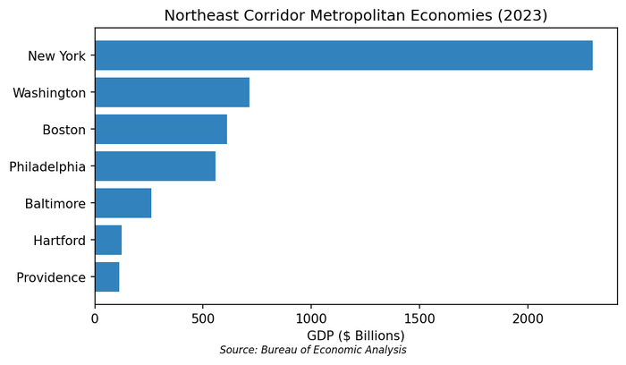

# 21. The Northeast Corridor

The Acela train leaves Penn Station in New York at 6:00 AM, and by 8:30 it has deposited passengers at Union Station in Washington. In between, the train passes through Newark, Philadelphia, Wilmington, and Baltimore---a continuous metropolitan fabric housing 50 million people generating over $4 trillion in annual output. If the Northeast Corridor were a country, it would rank among the world's five largest economies.

## A Unified Economic Region

The Northeast Corridor---stretching from Boston to Washington---functions less as a collection of separate cities than as a single economic mega-region. Economists increasingly view it through the lens of agglomeration: four major metros so tightly integrated by rail, road, and digital infrastructure that they operate as a unified labor market for elite professional services.

The corridor's economic dominance reflects centuries of path dependence. Colonial-era port cities became industrial centers, which became financial capitals, which became knowledge hubs. Each transition built on existing infrastructure, institutions, and human capital. The result is an economic density that would be nearly impossible to replicate elsewhere---a fact that explains both the corridor's resilience and its persistent cost disadvantages.

The six states that comprise the corridor's core---Massachusetts, Connecticut, New York, New Jersey, Pennsylvania, and Maryland---plus the District of Columbia together generated $4.8 trillion in GDP in 2023, roughly 18% of the national total. Per capita income across these states averaged $77,000, well above the national figure of $70,000. But these averages mask enormous variation: Connecticut and Massachusetts lead at roughly $90,000 per capita, while Pennsylvania trails at $68,000.

**Combined Regional Statistics (2024)**

| Metro Area | GDP | Population | Economic Identity |
|------------|-----|------------|-------------------|
| New York-Newark | $2.16 trillion | 19.5 million | Global finance and media capital |
| Washington, D.C. | $715 billion | 6.3 million | Federal government and defense |
| Boston-Cambridge | $641 billion | 4.9 million | Biotech and higher education |
| Philadelphia | $558 billion | 6.2 million | Healthcare, logistics, pharma |

*Figure 21.1: GDP of Northeast Corridor metros (2023). New York dominates at $2.3 trillion, but the combined corridor economy exceeds $4 trillion. Source: BEA*


**Interactive Map:** Explore America's top 20 metro economies below. Click markers for details, filter by region, and compare metros by GDP, population, or GDP per capita.


<iframe src="https://raw.githack.com/laurencehw/the-american-economy/main/book/_interactive/regional-map.html" width="100%" height="850" frameborder="0" style="border-radius: 8px; box-shadow: 0 2px 8px rgba(0,0,0,0.1);"></iframe>

Together, the corridor accounts for roughly 17% of U.S. GDP on less than 2% of its land area. This concentration of economic output in such a small geographic footprint is unmatched anywhere in the world outside of city-states like Singapore. The density creates both extraordinary productivity and extraordinary vulnerability: the corridor's economic output depends on infrastructure that was largely built a century ago.

## The Four Pillars

Each major corridor city has developed a distinct economic specialization, creating complementarity rather than pure competition.

### Boston: The Knowledge Refinery

Boston's economy runs on ideas. The city's concentration of elite research universities---Harvard, MIT, Boston University, Tufts, Northeastern---generates a continuous stream of basic research that nearby firms commercialize. This is the "knowledge refinery" model: universities produce science, venture capital provides fuel, and startups convert discoveries into products.

The epicenter is Kendall Square in Cambridge, arguably the world's densest cluster of innovation. Within a few blocks of MIT sit the research headquarters of Novartis, Pfizer, Sanofi, and Takeda, alongside hundreds of biotechnology startups. When Moderna developed its COVID-19 vaccine using mRNA technology, the entire value chain---from basic research to manufacturing---drew on this ecosystem.

The numbers reflect this concentration: Massachusetts received $4.2 billion in NIH funding in 2023, second only to California despite having one-fifth the population. The state's 1,200+ life sciences companies employ roughly 100,000 workers directly, with average wages exceeding $130,000---among the highest of any industry cluster in the country.

Boston's economy has also diversified beyond biotech. The city has emerged as a robotics hub, with companies like Boston Dynamics (now owned by Hyundai) and iRobot headquartered in the region. Financial services remain substantial: Fidelity Investments manages $4.5 trillion in assets from its headquarters in Boston, while State Street provides custody services for $40 trillion in assets globally.

The University of Massachusetts system, with campuses in Boston, Amherst, and elsewhere, provides a second tier of research and workforce development that complements the elite private institutions. This layered educational infrastructure produces graduates at multiple skill levels, feeding both the research labs and the broader economy.

**Key Industries:**
- Biotechnology and life sciences
- Higher education
- Asset management (Fidelity, State Street)
- Robotics and hardware

**Major Employers:** Mass General Brigham (healthcare system), Harvard University, Fidelity Investments, Vertex Pharmaceuticals, Biogen

### New York: The Capital Allocator

New York is where the world's capital gets allocated. Wall Street remains the center of global finance: the equity markets, the bond markets, the commodity markets, the foreign exchange markets. JPMorgan Chase, Goldman Sachs, Morgan Stanley, and Citigroup all call the city home, as do thousands of hedge funds, private equity firms, and asset managers.

The scale is staggering. The New York Stock Exchange and NASDAQ together list companies worth over $50 trillion. The municipal bond market---largely headquartered in New York---handles $4 trillion in outstanding debt. The city's banks hold roughly $3 trillion in deposits. BlackRock, the world's largest asset manager with $10 trillion under management, operates from midtown Manhattan.

But New York has become much more than finance. The city's technology sector grew 64% between 2014 and 2024, outpacing even financial services. This isn't the generic tech of Silicon Valley---it's tech applied to New York's traditional strengths. Fintech dominates: Square's Cash App, Bloomberg, Stripe's East Coast operations. Media and advertising technology cluster around Madison Avenue's legacy. E-commerce logistics serves the region's dense consumer population.

The healthcare sector has grown to rival finance in employment. Mount Sinai, NYU Langone, NewYork-Presbyterian, and Northwell Health together employ over 200,000 workers in the metropolitan area. These systems have also become research powerhouses, attracting billions in NIH funding and spinning off biomedical startups.

New York's creative industries remain globally dominant. The city produces roughly 40% of American advertising revenue, despite the shift to digital. Film and television production has boomed since the state implemented generous tax credits---the Steiner Studios complex in Brooklyn is now the largest studio facility outside Hollywood. Publishing houses still cluster in Manhattan, even as the industry consolidates.

The metropolitan area's GDP of $2.16 trillion in 2023 makes it larger than the national economies of Brazil, Italy, or Canada. If the New York metro area were a country, it would rank among the world's ten largest economies.

**Key Industries:**
- Financial services (capital markets, asset management)
- Media and entertainment
- Professional services (law, accounting, consulting)
- Technology (particularly fintech and ad-tech)

**Major Employers:** JPMorgan Chase, Citigroup, Verizon, Northwell Health, Mount Sinai Health System, NBCUniversal, Pfizer

### Philadelphia: The Specialized Producer

Philadelphia has found success by developing deep expertise in specific niches. The city's universities---Penn, Temple, Drexel, Jefferson---provide research talent, while lower costs than Boston or New York attract firms seeking value. Philadelphia's median rent of roughly $1,900 per month is nearly half Boston's, making it increasingly attractive for mid-career professionals and cost-conscious companies.

The standout is cell and gene therapy. The University of Pennsylvania's pioneering work on CAR-T cancer treatments sparked an industry cluster that now hosts roughly 10% of the world's companies in this niche. Nearby, Chester County has emerged as a pharmaceutical manufacturing hub, while the broader region's logistics infrastructure supports distribution along the entire corridor.

The pharmaceutical connection runs deep. The Philadelphia region was once the center of American drug manufacturing---SmithKline Beecham, Wyeth, and Merck all had major operations here. Consolidation has reduced the big pharma presence, but contract manufacturing and specialized production remain strong. The region produces roughly 15% of all prescription drugs manufactured in the United States.

Comcast's headquarters in Philadelphia anchors the city's media presence. The company's $200 billion market cap makes it one of the largest media conglomerates globally. Vanguard, headquartered in nearby Malvern, manages over $8 trillion in assets, making the Philadelphia suburbs a quiet giant in asset management.

The port of Philadelphia and South Jersey handle substantial cargo, though dwarfed by New York-Newark. More importantly, the region's location midway along the corridor makes it a natural logistics hub. Amazon, UPS, and FedEx all maintain major distribution facilities serving the dense northeastern consumer market.

**Key Industries:**
- Healthcare and "eds-and-meds"
- Pharmaceutical manufacturing
- Cell and gene therapy
- Logistics and distribution
- Telecommunications (Comcast headquarters)

**Major Employers:** Penn Medicine, Children's Hospital of Philadelphia (CHOP), Comcast, Vanguard, Independence Blue Cross

### Washington: The Regulator and Contractor

Washington's economy is built on a peculiar foundation: the federal government consumes roughly 30% of the region's GDP directly, and much of the remainder exists to serve, influence, or extract value from government activity. Defense contractors, lobbying firms, think tanks, government relations practices, and federal-adjacent consultancies create an economy that is remarkably recession-proof but structurally dependent on political decisions.

The privatization of government has been the dominant trend for four decades. The "Beltway Bandits"---defense and IT contractors headquartered in suburban Virginia and Maryland---now rival the federal workforce in size. Lockheed Martin, General Dynamics, Booz Allen Hamilton, and Leidos employ hundreds of thousands across the region.

The geography of federal contracting has created distinct clusters. Tysons Corner and Reston in Virginia host defense and IT contractors. Bethesda has become the biomedical research capital, anchored by the NIH campus and its $45 billion annual budget. The "Data Center Alley" in Loudoun County, Virginia, houses roughly 70% of the world's internet traffic, drawn initially by proximity to federal agencies and now sustained by its own network effects.

Amazon's decision to locate its second headquarters in Arlington, Virginia---just across the Potomac from D.C.---validated the region's emergence as a tech hub. The company has committed to 25,000 jobs at average salaries exceeding $150,000. The HQ2 campus, centered on the revitalized National Landing neighborhood, has attracted complementary tech employers.

The region's knowledge economy also includes one of the nation's densest concentrations of think tanks and policy research organizations. The Brookings Institution, American Enterprise Institute, Center for Strategic and International Studies, and dozens of others employ thousands of researchers producing analysis that shapes policy. The lobbying industry---roughly $4 billion annually in registered lobbying alone---represents another dimension of the influence economy.

Washington's resilience during recessions reflects its federal foundation. The metropolitan area barely felt the 2008-2009 financial crisis and recovered faster than any major market. Even COVID-19's impact was muted by the shift to remote work among the region's heavily white-collar workforce.

**Key Industries:**
- Federal government
- Defense contracting
- Lobbying and public affairs
- Cybersecurity
- Healthcare (major hospital systems)

**Major Employers:** Federal government (largest by far), Lockheed Martin, General Dynamics, Booz Allen Hamilton, Capital One, Marriott International, Amazon (HQ2 in Arlington)

## The Acela Economy

The physical infrastructure that unites the corridor creates economic possibilities unavailable in more dispersed regions. The corridor handles 2,200 trains per day---Amtrak intercity services, commuter rail from New Jersey Transit, SEPTA, MARC, and Metro-North, plus freight---making it the most intensively used rail corridor in North America.

### Labor Market Integration

The corridor's rail and shuttle connections allow a "super-thick" labor market to function across metropolitan boundaries. A lawyer living in Philadelphia can litigate cases in New York. A consultant based in Washington can service clients in Boston. A Boston-based venture capitalist can attend board meetings in New York and be home for dinner.

This integration is asymmetric: New York serves as the hub, drawing workers from all directions. The 6:00 AM Acela from Washington and the 6:15 AM from Boston are filled with professionals commuting to New York for client meetings, depositions, and deal closings. The evening trains reverse the flow.

Amtrak's Northeast Corridor carried 12.5 million passengers in 2023, roughly half the railroad's total ridership despite representing just one of its many routes. The Acela premium service---which cuts the New York-Washington trip to under three hours---competes directly with airline shuttles and often wins on reliability and door-to-door time.

The labor market integration extends beyond the trains. The regional airlines---American's shuttle, Delta's shuttle, JetBlue---connect the corridor's airports with hourly frequency. For same-day business trips, professionals can board a 6:00 AM flight in Boston, conduct meetings in Washington, and be home by dinner. This connectivity enables firms to maintain clients across the entire corridor without establishing multiple offices.

### Knowledge Spillovers

The corridor links the highest concentration of elite universities in the world: Harvard, MIT, Yale, Columbia, Princeton, Penn, Georgetown, Johns Hopkins, NYU, Boston University. These institutions produce research that flows across the region, train students who populate its firms, and provide consulting expertise to its industries.

Faculty at MIT collaborate with colleagues at Columbia. Penn Medical School works with Boston's research hospitals. Princeton's economists advise Washington policymakers. The density of these connections---enabled by geographic proximity---creates knowledge spillovers unavailable in more dispersed university systems.

### Infrastructure Vulnerability

The corridor's dependence on its infrastructure spine creates acute vulnerability. Estimates suggest that a shutdown of the Northeast Corridor rail line would cost the economy roughly $100 million per day in lost productivity. When Amtrak closes for maintenance or severe weather disrupts service, the effects ripple through the professional services economy.

The infrastructure itself shows its age. Penn Station in New York operates far beyond designed capacity---650,000 daily passengers through a station designed for 200,000. The tunnels under the Hudson River, built in 1910, are deteriorating; Hurricane Sandy flooded them with saltwater in 2012, accelerating corrosion. A single-track failure in these tunnels can cascade into delays affecting the entire corridor.

The Gateway Project---a $16 billion initiative to add new tunnels and rebuild Penn Station---secured full federal funding in 2024 after more than a decade of political disputes, with major construction now underway. The project will add two new tubes under the Hudson, allowing the original tunnels to be rehabilitated. Completion is expected in the early 2030s, though mega-project delays are common.

The corridor's bridges present similar challenges. The 113-year-old Portal Bridge over the Hackensack River in New Jersey is a notorious chokepoint; it swings open for marine traffic and frequently gets stuck. A replacement bridge, also part of the Gateway program, is under construction. The Susquehanna River Bridge near Baltimore, built in 1906, limits speeds to 30 mph on a critical stretch.

Even the airports face capacity constraints. LaGuardia Airport finally completed a multibillion-dollar reconstruction in 2024, but runway limitations cap throughput. Newark, JFK, and Reagan National all operate at or near capacity during peak hours. The region's airspace is among the most congested in the world, with delays at New York-area airports rippling through the national aviation system.

## Housing and Talent Competition

The corridor's success has created its greatest challenge: housing costs that increasingly threaten its economic model. The fundamental problem is simple: the corridor's economy has grown far faster than its housing stock. Between 2010 and 2023, the four major metros added roughly 1.5 million jobs but only 800,000 housing units.

### The Affordability Crisis

All four corridor metros rank among the nation's most expensive housing markets. Strict zoning, limited new construction, and intense demand from high-wage workers have pushed prices to levels that exclude middle-class families. The crisis is most acute in Boston and New York, where median rents exceed $3,400 per month---requiring an income of roughly $140,000 just to meet standard affordability guidelines.

**Housing Cost Comparison (2024)**

| Metro | Median Rent | Median Home Price |
|-------|-------------|-------------------|
| Boston | $3,495/month | $720,000 |
| New York | $3,489/month | $680,000 |
| Washington, D.C. | $2,195/month | $575,000 |
| Philadelphia | $1,895/month | $365,000 |

The Boston-New York convergence is particularly striking. Historically, Boston offered a modest cost advantage---enough to attract firms and workers priced out of New York. With that differential eliminated, Boston risks losing mid-career talent to lower-cost alternatives.

### The Missing Middle

The corridor's housing market increasingly resembles an hourglass: luxury apartments for the wealthy, subsidized housing for the poor, and almost nothing for the middle class. Teachers, nurses, police officers, and junior professionals face impossible choices between hour-long commutes and unsustainable housing costs.

The result is demographic distortion. The corridor's cities attract young graduates willing to crowd into small apartments and wealthy professionals who can afford premium housing. But when families form and children arrive, middle-class households flee to the exurbs or leave the region entirely.

Population data tells the story. New York State's population peaked in 2020 at 20.1 million and has since declined to 19.9 million, despite continued international immigration. The state lost domestic migrants to Florida, Texas, and the Carolinas throughout the early 2020s. Massachusetts grew modestly---from 6.9 million in 2019 to 7.1 million in 2024---but this growth came almost entirely from international immigration, masking substantial domestic out-migration.

### The Zoning Problem

The corridor's housing shortage stems largely from local land-use policies that make new construction difficult or impossible. Boston's suburbs---Cambridge, Brookline, Newton---have barely added housing in decades despite skyrocketing demand. New York City builds more than its suburbs but still falls far short of demand. Philadelphia and Washington have somewhat more elastic housing supplies, which helps explain their lower prices.

Recent reform efforts show mixed results. Massachusetts passed a zoning reform law in 2021 requiring communities near transit to allow multifamily housing, but implementation has been slow. New York's attempts at statewide zoning reform have repeatedly failed in the legislature. The political economy is brutal: existing homeowners benefit from scarcity and use their political power to maintain it.

## Recent Trends

### The Office Bifurcation

The post-pandemic office market has split into two tracks. Premium "Class A" space in new buildings---One Vanderbilt in New York, Seaport developments in Boston---commands record rents above $200 per square foot. Older "Class B" buildings face vacancy crises, particularly in Washington where federal workers have been slower to return to offices than private sector employees.

### Biotech Real Estate Cycle

After a hyper-growth phase fueled by COVID vaccine success and SPAC-funded startups, Boston's laboratory real estate market has experienced a sharp correction. Vacancy rates in life sciences space surpassed 25% by late 2024, creating a "tenant's market" for the first time in a generation. This may paradoxically strengthen the ecosystem by making space available to early-stage startups previously priced out of Kendall Square.

### The Tech-Finance Convergence

The distinction between New York's technology and financial sectors has blurred nearly to the point of meaninglessness. JPMorgan Chase employs 60,000 technologists globally; Goldman Sachs describes itself as a technology company. The growth of fintech, crypto-finance, and AI-applied-to-trading has merged the industries physically and organizationally. New York increasingly competes directly with San Francisco for technical talent.

The AI boom has accelerated this trend. New York's AI startups raised $8 billion in venture funding in 2023, second only to the Bay Area. The city's strength lies in applied AI---using machine learning for trading strategies, risk management, legal document review, advertising optimization---rather than foundational model development. This fits the corridor's broader pattern: adapting frontier technologies to established industries rather than creating entirely new ones.

### The Remote Work Adjustment

The pandemic's shift to remote work initially threatened the corridor's economic model, which depends on face-to-face interaction in dense urban environments. Office vacancy rates spiked to historic highs---20% in Manhattan, 22% in Washington---as employers adopted hybrid policies.

By 2024, the adjustment had partially stabilized. Most professional services firms settled on hybrid arrangements requiring two to three days in the office. This preserved the corridor's role in spontaneous collaboration and client entertainment while reducing the premium on daily commuting. The trains are fuller on Tuesdays, Wednesdays, and Thursdays; Mondays and Fridays remain quiet.

The long-term implications remain unclear. Some firms have used hybrid work to reduce their footprint and costs. Others have used it to hire talent from outside the corridor who commute only occasionally. The net effect appears to be a modest reduction in the corridor's magnetic pull rather than a fundamental disruption.

## Regional Profiles

### Mass General Brigham

> **Quick Facts**
> - Headquarters: Boston, MA
> - Type: Integrated academic healthcare system
> - Revenue: $18 billion (2023)
> - Employees: 85,000

Mass General Brigham---formed from the merger of Massachusetts General Hospital and Brigham and Women's Hospital---is the largest private employer in New England and the research engine driving Boston's life sciences economy. Its affiliated hospitals conduct more NIH-funded research than any healthcare system in the country.

The system's scale creates a virtuous cycle. Research grants attract top scientists. Scientists generate discoveries. Discoveries spawn spinoff companies. Companies recruit talent from the hospitals. The talent generates more research. This cycle has made the Boston area the global center of biotechnology---a position that would have been impossible to predict when the Kendall Square cluster began forming in the 1970s.

### JPMorgan Chase

> **Quick Facts**
> - Headquarters: New York, NY
> - Revenue: $158 billion (2024)
> - Employees: 313,000 worldwide; roughly 60,000 in NYC metro
> - Market cap: $700 billion

JPMorgan Chase is not just the largest bank in the United States---it is increasingly the dominant player across multiple segments of American finance. Under CEO Jamie Dimon, the bank has grown its market share in investment banking, commercial lending, asset management, and consumer banking while most competitors have retrenched.

The bank's New York presence anchors the city's financial district. Its headquarters occupies a full block of Park Avenue; a new 60-story tower is under construction at 270 Park Avenue. But JPMorgan also exemplifies the corridor's integration: substantial operations in Delaware (credit cards), New Jersey (operations centers), and a major presence in Washington (government relations and treasury services).

### The Washington Metro

> **Quick Facts**
> - Type: Regional transit system
> - Ridership: 600,000 daily (2024)
> - Stations: 98
> - System length: 128 miles

Unlike New York or Boston, Washington was designed for the automobile. But the Metro system, opened in 1976, has reshaped the region's economic geography. The corridor's major employers---from the Pentagon to the NIH campus in Bethesda to Amazon's HQ2 in Arlington---cluster around Metro stations.

The system's challenges mirror the corridor's infrastructure woes: aging equipment, deferred maintenance, and funding disputes between jurisdictions (D.C., Maryland, and Virginia). A 2015 safety crisis led to system-wide shutdowns for repairs. But the Metro remains essential: the region's traffic congestion without transit would cripple its economy.

### Comcast

> **Quick Facts**
> - Headquarters: Philadelphia, PA
> - Revenue: $121 billion (2023)
> - Employees: 186,000
> - Market cap: $160 billion

Comcast is Philadelphia's largest private employer and one of the corridor's most important corporate anchors. The company operates the nation's largest cable television provider (Xfinity), NBCUniversal's entertainment empire, and a growing theme park division.

The company's Philadelphia presence includes two signature towers that dominate the city skyline. But Comcast's footprint extends across the corridor: NBCUniversal operates from 30 Rockefeller Center in New York, and the company's broadband network serves customers from Maine to Virginia.

Comcast exemplifies the corridor's pattern of consolidation. Through decades of acquisitions---AT&T Broadband in 2002, NBCUniversal in 2011, Sky in 2018---the company has assembled a vertically integrated media and telecommunications giant. The combination of content creation, distribution, and direct customer relationships gives Comcast leverage across the entire value chain.

## Data Sources and Further Reading

### Key Data Sources

- **BEA Regional Accounts**: GDP by metropolitan area
- **BLS Quarterly Census of Employment and Wages**: Employment by metro
- **Amtrak**: Corridor ridership and economic impact studies
- **Regional Federal Reserve Banks**: Economic surveys (New York Fed, Boston Fed, Philadelphia Fed)

### Further Reading

- Glaeser, Edward. *Triumph of the City* (2011) - Agglomeration and urban economies
- Goldsmith, Stephen and Susan Crawford. *The Responsive City* (2014) - Urban technology and governance
- Regional Plan Association reports on Northeast megaregion
- CBRE and JLL real estate market reports

---

**Word count:** roughly 4,300 words

*Note: This chapter focuses on economic structure and geography. For treatment of specific industries (financial services, healthcare, technology), see the relevant sector chapters in Part II.*
