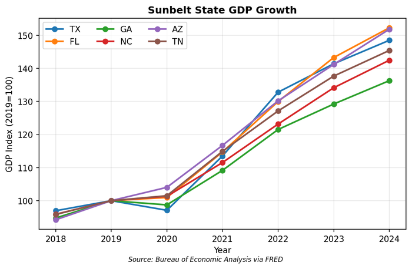

# 22. The Sunbelt

In 2024, Chevron announced it was moving its corporate headquarters from the San Francisco Bay Area to Houston. The company joins an exodus: Toyota to Texas, Caterpillar to Texas, Boeing to Virginia, Oracle to Texas, Tesla to Texas, Citadel to Miami. Something fundamental is shifting in American economic geography, and the beneficiary has a name: the Sunbelt.

## The Great Shift

The Sunbelt---stretching from the Carolinas through Georgia, Florida, Texas, Arizona, and Nevada---has captured the lion's share of American growth for two decades. This is not simply population movement; it represents a structural reallocation of economic activity from the Northeast and Midwest to the South and Southwest.

The shift accelerated after 2020. Remote work untethered millions of knowledge workers from expensive coastal metros; lower taxes and warmer weather suddenly became accessible without career sacrifice. Corporate relocations followed, drawn by the same cost arbitrage plus the desire to locate near migrating talent. The Sunbelt absorbed the resulting influx with a mixture of triumphalism and infrastructure strain.

The numbers are stark. Between 2019 and 2024, Texas added 2.3 million residents---growing from 29 million to 31.3 million. Florida added 1.9 million, growing from 21.5 million to 23.4 million. Together, these two states absorbed more population than the bottom 30 states combined. Meanwhile, New York lost 250,000 residents, Illinois lost 270,000, and California essentially flatlined despite substantial international immigration.

**Growth Differentials (2023-2024)**

| Region | Population Growth | GDP Growth |
|--------|-------------------|------------|
| Sunbelt states | 1.1% annually | 3.2% |
| Non-Sunbelt | 0.1% annually | 1.8% |

<figure>

<figcaption>Figure 22.1: Sunbelt state GDP growth since 2019, indexed to 100. All Sunbelt states have outpaced national growth, with Texas and Florida leading. Source: BEA</figcaption>
</figure>

The South alone accounted for 87% of U.S. population growth in 2023. Texas and Florida added nearly 800,000 residents between them in a single year---equivalent to adding a city the size of Seattle.

The Sunbelt's projected growth over the next decade exceeds 7%, adding roughly 11 million people. The rest of the country is projected to grow by 0.3%.

### The Economic Composition

The Sunbelt economy is more diverse than stereotypes suggest. Texas alone had a GDP of $2.3 trillion in 2023---larger than Italy's national economy. Florida's $1.4 trillion economy would rank as the world's 15th largest if it were a separate country. Georgia's $781 billion economy exceeds that of Switzerland.

Energy remains central to Texas---the state produces 43% of U.S. crude oil and 25% of natural gas---but healthcare, technology, manufacturing, and professional services have grown to match it. Florida's economy tilts toward tourism, real estate, and financial services, but aerospace and biomedical manufacturing have gained ground. Georgia's economy balances logistics, media production, and a growing technology sector.

The Sunbelt's per capita income tells a different story than total output. Texas ($67,500), Florida ($70,000), Georgia ($60,000), and Arizona ($63,000) all trail the national average of $70,000. The region's economic growth has been extensive---more people, more jobs---rather than intensive growth in productivity per worker. This creates a different economic character than the high-productivity coastal metros.

## Key Metropolitan Economies

The Sunbelt's growth concentrates in a handful of metropolitan areas, each developing distinct economic specializations.

### Houston: The Energy Capital

Houston is to global energy what New York is to global finance: the command center. The city hosts the headquarters of most major oil and gas companies operating in the Western Hemisphere, along with the engineering firms, oilfield service companies, and legal practices that serve them.

**Key Statistics:**
- Metropolitan GDP: $700 billion (2023)
- Fortune 500 headquarters: 22
- Employment in energy sector: 230,000 direct

When Chevron relocated its headquarters in 2024, Houston completed a decades-long consolidation. Every major integrated oil company with significant U.S. operations---ExxonMobil, Chevron, Phillips 66, ConocoPhillips, Occidental---is now headquartered in the Houston metropolitan area.

But Houston is also diversifying. The Texas Medical Center, the world's largest medical complex, employs 120,000 people across 60 institutions. The city has become a center for energy transition technologies: hydrogen production, carbon capture, and renewable project development. The same engineering talent that managed offshore drilling platforms now designs wind farms and solar installations.

Houston's port complex---the nation's largest by foreign tonnage---handles 45% of U.S. petrochemical exports and serves as the gateway for goods bound for Mexico. The ship channel's ongoing widening project, when completed in 2026, will allow post-Panamax vessels to access the port directly, reducing transshipment costs.

The city's sprawl is legendary---the metropolitan area covers 10,000 square miles, larger than New Jersey---but this sprawl enables affordable housing that coastal metros cannot match. A median home price of $340,000 in 2024, while substantially higher than pre-pandemic levels, remains far below comparable coastal markets.

### Dallas-Fort Worth: The Boardroom of the South

If Houston is the energy capital, Dallas is the corporate capital. The metropolitan area hosts more than 20 Fortune 500 headquarters, ranging from AT&T and American Airlines to Texas Instruments and Kimberly-Clark.

**Key Statistics:**
- Metropolitan GDP: $745 billion (2023)
- Fortune 500 headquarters: 23
- Population: 7.8 million (4th largest U.S. metro)

Dallas has positioned itself as the low-regulation, low-tax alternative to New York for corporate headquarters. When Charles Schwab moved from San Francisco, when Caterpillar left Illinois, when Toyota relocated from California---they chose Dallas. The city offers executive-friendly costs, a central time zone, and the nation's most connected hub airport (DFW).

The financial services sector has grown particularly rapidly. Schwab, Fidelity, and multiple regional banks have expanded Texas operations, creating a secondary financial hub that competes with Charlotte.

Dallas's logistics infrastructure supports its corporate economy. DFW Airport handles more domestic passengers than any hub except Atlanta; American Airlines' fortress hub enables same-day business travel to nearly anywhere in the country. The extensive freight rail network---including the massive Alliance Global Logistics Hub in north Fort Worth---makes Dallas a natural distribution center for goods flowing from Pacific ports to eastern markets.

The metroplex's corporate tax base creates a different fiscal dynamic than most Texas metros. Property taxes fund schools and local governments, but the concentration of corporate headquarters generates substantial franchise taxes at the state level. The result is relatively well-funded infrastructure and education by Texas standards.

### Austin: Silicon Hills Under Strain

Austin's emergence as a technology center represents one of the most successful economic development stories in American history. A college town with a state government and a guitar scene has become a major technology hub, home to Dell, Apple's largest office outside California, Tesla's headquarters, Oracle's headquarters, and thousands of startups.

**Key Statistics:**
- Metropolitan GDP: $180 billion
- Tech employment: 200,000+
- Population growth 2010-2024: 45%

But Austin also illustrates the limits of growth without infrastructure investment. Traffic congestion has worsened dramatically; housing costs have quintupled since 2010; the city's electric grid strains under extreme temperatures. The creative culture that attracted early tech workers has been transformed by corporate density.

The question facing Austin is whether it can mature into a genuine first-tier technology center or whether infrastructure constraints will cap its potential.

The University of Texas at Austin provides a continuous pipeline of engineering talent; Samsung's Austin semiconductor fab and Applied Materials' major presence reflect the region's strength in hardware. But Austin lacks the deep venture capital ecosystem of the Bay Area and Boston---most Austin startups ultimately raise money from coastal investors.

The music and creative culture that made Austin famous increasingly feels like a residual brand rather than a living reality. Rising rents have displaced the small venues that incubated musicians; tech workers have priced out artists. The "Live Music Capital of the World" slogan rings hollow to many longtime residents watching the transformation.

### Miami: Wall Street South

Miami's reinvention as a financial center has been remarkably rapid. When Citadel, the hedge fund managing $60 billion in assets, relocated from Chicago to Miami in 2022, it signaled that the city had arrived as a serious destination for elite finance.

**Key Statistics:**
- Metropolitan GDP: $400 billion
- International banking assets: $260 billion
- Daily international flights: 200+

Miami has always been the gateway to Latin America---half of U.S. trade with South America flows through its ports and airport. But the pandemic-era migration of wealthy New Yorkers and financial professionals has created something new: a concentration of hedge funds, family offices, and wealth management firms that rivals Greenwich, Connecticut.

The city's lack of state income tax, combined with its climate and cultural amenities, has made it particularly attractive to high-net-worth individuals. Critics argue that Miami is building a "wealth management economy" rather than a diversified metropolitan base---but for now, the formula is working.

Miami also faces unique climate vulnerabilities. Sea level rise threatens low-lying neighborhoods; hurricane risk requires expensive insurance; saltwater intrusion endangers the aquifer that supplies drinking water. The real estate boom has proceeded despite these risks, but climate insurance costs are rising rapidly, and some areas may become effectively uninsurable.

The city's role as the gateway to Latin America continues to drive trade and banking. Miami International Airport handles more international freight than any U.S. airport except JFK; Brightline's high-speed rail connection to Orlando (completed in 2023) has enhanced intercity connectivity within Florida.

### Atlanta: The Logistics and Media Hub

Atlanta's economy rests on two pillars: moving things and making things (where "things" increasingly means content).

**Key Statistics:**
- Metropolitan GDP: $450 billion
- Hartsfield-Jackson airport: World's busiest by passenger traffic
- Fortune 500 headquarters: 16

As a logistics hub, Atlanta is unmatched in the Southeast. Hartsfield-Jackson handles 93 million passengers annually; UPS operates one of its primary hubs nearby; the interstate highway system converges on the city. Any company serving the southeastern United States needs Atlanta presence.

The media transformation has been equally striking. Georgia's generous film tax credits have made Atlanta the "Hollywood of the South." Major studios operate production facilities; the Marvel Cinematic Universe films largely in and around the city. This has created an ecosystem of production services, talent development, and creative industries that reinforces itself.

Georgia Tech's "Tech Square" innovation district is attempting to replicate what MIT's Kendall Square did for Boston: create a dense cluster of research, startups, and corporate R&D that generates knowledge spillovers.

Atlanta's large Black middle class distinguishes it demographically from other Sunbelt metros. Historically Black colleges and universities---Morehouse, Spelman, Clark Atlanta---anchor a distinctive educational ecosystem. Corporate headquarters like Coca-Cola, Home Depot, and Delta Air Lines have made diversity commitments that shape hiring patterns. The result is a metropolitan economy that looks different from Houston or Phoenix in racial composition and economic opportunity distribution.

The region's rapid suburban growth has created governance challenges. The 10-county metropolitan area spans multiple school districts, transit authorities, and municipal governments with competing priorities. MARTA, the regional transit system, operates primarily within Fulton and DeKalb counties; suburban counties have resisted expansion, limiting connectivity.

### Phoenix: Silicon Desert

Phoenix has emerged as the epicenter of America's semiconductor reshoring effort. TSMC's Arizona fabs represent $65 billion in investment---the largest foreign direct investment in American history. Intel is expanding its facilities. The CHIPS Act has directed billions more toward Arizona projects.

**Key Statistics:**
- Metropolitan GDP: $280 billion
- Semiconductor investment announced: $100 billion+
- Population growth 2010-2024: 25%

Phoenix also serves as a massive retirement and healthcare destination. The population skews older than other Sunbelt metros; healthcare systems are among the largest employers.

The city's water constraints present an existential challenge. The Colorado River, which supplies Phoenix, is in crisis. Groundwater depletion in suburban developments has led to construction moratoriums. The long-term viability of continued growth depends on solving the water problem.

The semiconductor investments create both opportunity and risk. TSMC's fabs require enormous quantities of ultra-pure water---roughly 10 million gallons per day per fab. Arizona has worked to secure water rights and recycling infrastructure, but the fundamental tension between industrial water demand and a drought-stressed region remains unresolved.

Phoenix's housing market experienced one of the most extreme boom-bust-recovery cycles of the 2020s. Home prices roughly doubled between 2019 and 2022, then declined 15% as rising interest rates cooled demand. By 2024, prices had stabilized but remained unaffordable for many workers at the new semiconductor facilities.

### Charlotte: Banking Center

Charlotte's improbable rise as America's second-largest banking center---after New York---reflects the consolidation of regional banking over four decades. NationsBank's merger with Bank of America, First Union's evolution into Wachovia and then Wells Fargo's acquisition, Truist's formation from BB&T and SunTrust: Charlotte captured the headquarters each time.

**Key Statistics:**
- Metropolitan GDP: $230 billion
- Bank of America employees in region: 15,000
- Financial services employment: 100,000+

The concentration of banking headquarters has created a broader financial services ecosystem: fintech startups, corporate law practices, consulting firms. Honeywell's relocation of its headquarters from New Jersey in 2019 signaled that Charlotte could attract major non-financial corporations as well.

## Cost Advantages and Their Limits

For decades, the Sunbelt offered a distinctive arbitrage: coastal-quality wages with heartland costs. That advantage is eroding.

### The Housing Surge

Between 2020 and 2024, home prices in Austin increased 60%. Phoenix, Tampa, and Dallas saw increases of 40-50%. The "affordability advantage" that drew middle-class families from California and New York has diminished significantly.

**Housing Price Growth 2020-2024**

| Metro | Price Increase |
|-------|---------------|
| Austin | 60% |
| Phoenix | 48% |
| Tampa | 45% |
| Dallas | 40% |
| National average | 30% |

Rents tell a similar story. Sunbelt rents increased 24% from 2020 to 2024, compared to just 7% in coastal markets. The convergence isn't complete---Texas and Florida remain cheaper than California and New York---but the gap has narrowed dramatically.

### The Tax Wedge

The "zero income tax" advantage remains the primary attractor for high-earning households. Texas, Florida, Tennessee, and Nevada impose no state income tax; for a household earning $500,000, relocating from California or New York effectively provides a 10-13% raise.

This wedge explains the particular concentration of wealth management and hedge funds in Miami and the corporate headquarters in Texas. High-income individuals and capital-gains-dependent executives benefit most from tax arbitrage.

### Business Environment

Beyond taxes, Sunbelt states offer lighter regulation, faster permitting, and "right-to-work" labor laws that limit union power. Land costs remain far below coastal metros. For manufacturing and logistics operations requiring large facilities, these factors create genuine cost advantages.

## Infrastructure Challenges

The Sunbelt's growth has outpaced its infrastructure investment, creating vulnerabilities that threaten the growth model. The region's low-tax philosophy generates less revenue per capita for infrastructure; the rapid growth strains existing systems; and the car-dependent development pattern requires expensive highway expansion rather than more efficient transit alternatives.

### Climate and Extreme Weather

Climate change creates asymmetric risks across the Sunbelt. Texas faces both freezing events (like February 2021) and intensifying heat waves. Florida confronts accelerating sea level rise, hurricane intensification, and flooding that already affects inland communities. Arizona and Nevada experience extreme heat that makes outdoor work dangerous and strains electrical systems during peak demand.

Insurance markets have begun to price these risks. Florida's property insurance market has entered crisis: major carriers have withdrawn, Citizens (the state insurer of last resort) has grown to 1.3 million policies, and premiums have tripled in five years. Similar dynamics are emerging in coastal Texas and Louisiana. The long-term growth model assumes continued migration, but climate costs may eventually discourage it.

### Water Scarcity

The Colorado River system serves 40 million people across the Southwest---including Phoenix, Las Vegas, and Southern California. The system is in crisis. Lake Mead, the largest reservoir in the United States, has dropped to levels not seen since it was first filled in the 1930s.

Arizona and Nevada face mandatory water cutbacks under "Level 1 Shortage" conditions. Agricultural users have lost much of their allocation; urban restrictions are tightening. The long-term math is unforgiving: the region is using more water than nature provides.

Phoenix has responded with water recycling and efficiency measures, but these provide marginal improvements to a structural deficit. Construction moratoriums in suburban developments reflect the underlying constraint: at some point, the water runs out.

### Power Grid Instability

The Texas electricity grid, ERCOT, operates in isolation from the rest of the country---a deliberate regulatory choice that avoids federal oversight but also prevents the grid from importing power during emergencies.

The February 2021 freeze exposed this vulnerability catastrophically: hundreds of Texans died as the grid collapsed. Extreme heat events strain the system in summer. AI data centers and cryptocurrency miners, attracted by cheap Texas power, consume gigawatts that compete with residential growth.

The grid is improving---new generation is being added, weatherization requirements have tightened---but the fundamental isolation remains. When the Texas grid fails, there's no backstop.

### Traffic Without Transit

Sunbelt cities were built for automobiles. Austin and Nashville grew into major metros with small-town road networks and virtually no mass transit. The result is congestion that rivals or exceeds coastal cities, without the transit alternatives that allow workers to bypass highways.

Houston and Dallas have invested in light rail systems, but these serve a fraction of travel needs. The Sunbelt's suburban form makes transit inherently difficult: low density means few riders per station, making service economically marginal.

Florida's Brightline represents an exception: privately financed intercity passenger rail connecting Miami, Fort Lauderdale, West Palm Beach, and (since 2023) Orlando. The service has exceeded ridership expectations, suggesting demand for alternatives to highway travel. Extensions to Tampa and potentially Jacksonville are under consideration.

## Labor and Workforce

The Sunbelt's rapid growth creates persistent labor shortages across multiple sectors. Construction workers, healthcare professionals, and skilled tradespeople command premium wages. The 2024 unemployment rates---3.5% in Texas, 3.1% in Florida, 3.3% in Georgia---indicate tight labor markets despite substantial in-migration.

### The Education Pipeline

Sunbelt states vary dramatically in educational attainment. Texas has invested heavily in its flagship universities (UT-Austin, Texas A&M) and community college system, producing engineering and technical graduates at scale. Florida's state university system, led by the University of Florida and Florida State, has grown substantially. Georgia Tech ranks among the nation's top engineering schools.

But K-12 education presents challenges. Teacher pay in Texas, Florida, and Georgia lags national averages; public school funding in low-tax states constrains resources. The result is a workforce pipeline that produces adequate quantities but sometimes struggles with quality. Companies relocating to the Sunbelt often import management talent from higher-cost regions while hiring operational staff locally.

### Immigration

The Sunbelt economy depends heavily on immigrant labor. Texas employs roughly 2 million unauthorized workers; Florida employs over 800,000. These workers concentrate in construction, agriculture, hospitality, and food processing---precisely the sectors where labor shortages are most acute.

The political tension is obvious: state governments pursue restrictive immigration policies while their economies depend on immigrant labor. The construction boom funding new semiconductor plants and battery factories requires workers that domestic labor markets cannot fully supply.

## The Battery Belt

The most significant structural development in the Sunbelt economy is the emergence of a "Battery Belt"---a corridor of advanced manufacturing stretching from Michigan through Ohio, Kentucky, Tennessee, Georgia, and Texas.

**Major Projects:**
- Ford BlueOval City (Tennessee): $5.6 billion EV and battery complex
- Hyundai Metaplant (Georgia): $7.6 billion EV facility
- TSMC (Arizona): $65 billion semiconductor fabs
- Samsung (Texas): $40 billion semiconductor fab
- Texas Instruments (Texas): $30 billion chip plants

The CHIPS Act, Inflation Reduction Act, and other industrial policy measures have directed tens of billions in subsidies toward these projects. Combined with state incentives, the result is a manufacturing boom unprecedented since World War II.

This represents true reshoring: manufacturing capacity returning from Asia to North America. The Sunbelt is capturing the majority of this investment, combining lower costs with proximity to final consumers.

## Political Economy

The Sunbelt's economic model intersects with distinctive political dynamics that create tensions at the state and metropolitan level.

### Red States, Blue Cities

The Sunbelt's economic engines---Austin, Atlanta, Miami, Charlotte---are politically distinct from the state legislatures that govern them. This creates conflicts over zoning, housing policy, social issues, and local control.

Texas has preempted Austin's attempts to regulate short-term rentals, mandate paid sick leave, and establish local minimum wages. Georgia has intervened in Atlanta's governance. Florida has overridden Miami-Dade's COVID policies. The pattern repeats across the region: metropolitan areas that vote Democratic governed by state capitals that vote Republican.

### Business and Politics

States like Florida and Texas have waded into cultural politics in ways that complicate business recruitment. Disney's conflict with Florida over "Don't Say Gay" legislation, and subsequent retaliation affecting the company's special tax district, demonstrated the risks. Tech companies recruiting diverse workforces navigate carefully around restrictive abortion laws.

Laws restricting state pension funds from ESG (Environmental, Social, Governance) investing create tension with Wall Street firms that the same states are courting. The political economy is complex: business-friendly tax and regulatory policy combined with social legislation that some businesses view as hindering talent recruitment.

## Regional Profiles

### Tesla

> **Quick Facts**
> - Headquarters: Austin, TX (relocated from Palo Alto in 2021)
> - Revenue: $97 billion (2024)
> - Employees: 140,000 worldwide
> - Austin facility: "Giga Texas" battery and vehicle manufacturing

Tesla's relocation to Texas encapsulates the Sunbelt story. Elon Musk cited California's high costs, regulatory burden, and COVID policies. Texas offered land for a massive factory, no corporate income tax, and a generally permissive regulatory environment.

Giga Texas, on the outskirts of Austin, is one of the largest manufacturing facilities in the country: 10 million square feet producing Model Y vehicles and battery cells. The facility employs over 20,000 workers, making Tesla one of the Austin area's largest private employers.

The relocation also brought Tesla's legal domicile, shifting shareholder lawsuits from California to Texas courts. The full ecosystem migration---headquarters, manufacturing, and legal incorporation---represents the comprehensive arbitrage Sunbelt states offer.

### Citadel

> **Quick Facts**
> - Headquarters: Miami, FL (relocated from Chicago in 2022)
> - Assets under management: $60 billion
> - Founder: Ken Griffin
> - Employees: 2,900

Citadel's move from Chicago to Miami in 2022 marked a turning point in the financial industry's geography. Ken Griffin, Citadel's billionaire founder, cited Chicago's crime, taxes, and political environment. Florida offered no income tax, a more favorable regulatory stance, and lifestyle amenities.

The relocation brought not just Citadel's hedge fund but also Citadel Securities, the market-making arm that executes roughly 25% of all U.S. equity trades. Supporting staff, technology infrastructure, and related businesses followed. Griffin's personal philanthropy and civic engagement have increasingly focused on Miami.

The move accelerated Miami's transformation into a hedge fund and wealth management hub, attracting other firms seeking similar advantages.

### Hyundai Motor Group

> **Quick Facts**
> - Headquarters: Seoul, South Korea
> - Georgia investment: $7.6 billion (Metaplant America)
> - Location: Bryan County, Georgia (near Savannah)
> - Projected employment: 8,500 direct jobs

Hyundai's Metaplant America represents the new industrial policy in action. The $7.6 billion investment will produce electric vehicles and batteries on a 2,900-acre site near Savannah. Georgia provided roughly $2 billion in incentives; the Inflation Reduction Act's EV tax credits require North American production.

The project illustrates the Sunbelt's advantages for manufacturing: available land, lower costs, proximity to the Port of Savannah (America's fastest-growing container port), and state governments competing aggressively for investment.

When fully operational, the plant will be one of the largest manufacturing facilities in the Southeast and the centerpiece of an EV supply chain clustering in the region.

## Data Sources and Further Reading

### Key Data Sources

- **BEA Regional Accounts**: State and metro GDP
- **Census Bureau**: Population estimates and migration flows
- **Bureau of Labor Statistics**: State and metro employment
- **Federal Reserve Banks**: Dallas, Atlanta, and Kansas City district reports

### Further Reading

- Moretti, Enrico. *The New Geography of Jobs* (2012)
- Case, Anne and Angus Deaton. *Deaths of Despair* (2020) - For contrast with declining regions
- Texas Comptroller reports on state economy
- Florida Office of Economic and Demographic Research

---

**Word count:** roughly 4,600 words

*Note: For industry-specific analysis of energy, manufacturing, and technology, see the relevant chapters in Part II.*
