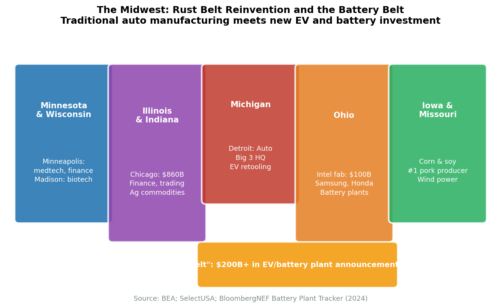
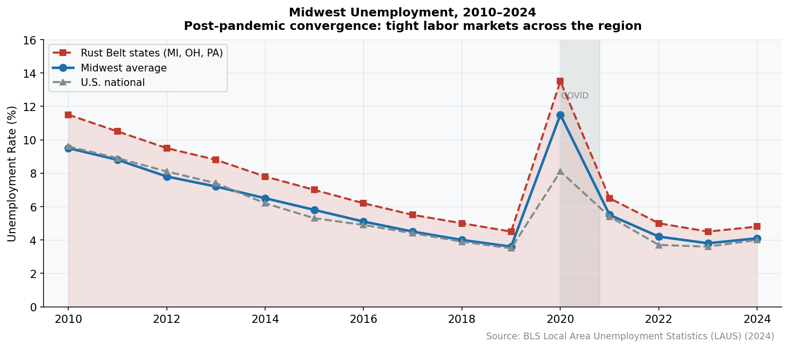

# Chapter 25: The Midwest

Drive west from Pittsburgh and the landscape tells a story of industrial might and industrial decline. Steel mills, now mostly silent, line the rivers. Factory towns bear names like Youngstown, Akron, Flint---places that once defined American manufacturing and now struggle to define their futures. But continue west to Columbus, Indianapolis, or Minneapolis, and the story changes. Cranes dot skylines. New factories rise. The Midwest is reinventing itself.

## The Industrial Heartland

The Midwest---here defined as the Great Lakes states of Ohio, Michigan, Indiana, Wisconsin, Illinois, and Minnesota---remains America's manufacturing core. Despite decades of job losses, the region produces more industrial output than ever. The paradox is productivity: the same volume of goods requires far fewer workers.

The region's industrial legacy shapes everything else. The Great Lakes provided water for steel mills and transportation for raw materials. The railroads converged on Chicago. The highway system, built to serve factories, created the infrastructure that now supports logistics. Even as manufacturing employment has collapsed from its 1979 peak, the physical infrastructure remains---and is being repurposed for a new industrial era.

Population tells the story of transition. Illinois has declined from 12.8 million in 2019 to 12.7 million in 2024---a modest loss that nonetheless signals stagnation in what was once America's most dynamic industrial region. Ohio has stabilized at 11.9 million after decades of decline. Michigan, at 10.1 million, has finally stopped shrinking. The hemorrhaging has slowed, but growth remains elusive.

**Regional Economic Overview (2024)**

| State | GDP | Manufacturing Share | Population Trend |
|-------|-----|---------------------|------------------|
| Illinois | $1.05 trillion | 11% | Stable/declining |
| Ohio | $800 billion | 16% | Stable |
| Michigan | $620 billion | 20% | Stable |
| Indiana | $450 billion | 28% | Growing |
| Minnesota | $440 billion | 12% | Growing |
| Wisconsin | $400 billion | 18% | Stable |

*Source: Bureau of Economic Analysis, Regional GDP; Bureau of Labor Statistics, 2024*

<figure>

<figcaption>Figure 25.1: The Midwest and Battery Belt corridor. Major industrial investments from the CHIPS Act and IRA have directed over $50 billion into manufacturing across Michigan, Ohio, Indiana, Kentucky, and Tennessee since 2022. Source: Company announcements, state economic development</figcaption>
</figure>

<figure>

<figcaption>Figure 25.2: Midwest state unemployment rates have converged post-pandemic. The regional labor market remains tight despite manufacturing automation. Source: BLS</figcaption>
</figure>

The region's challenge is structural: manufacturing output grows through automation while manufacturing employment shrinks. Ohio ranks third nationally in manufacturing jobs (687,000), but that figure has fallen by half since 1979.

## Metropolitan Economies

### Chicago: The Midwest's Global City

Chicago stands apart from its regional neighbors. With a GDP of $886 billion, it is the only Midwestern metropolitan area with true global status---a world financial center, transportation hub, and corporate headquarters cluster that competes directly with New York and Los Angeles.

**Economic Pillars:**

**Finance and Trading:** The Chicago Mercantile Exchange (CME Group) and Cboe Global Markets make Chicago the world capital of derivatives trading. Futures and options contracts for agriculture, currencies, interest rates, and equity indices trade here first. The city's financial technology sector builds on this foundation.

**Transportation and Logistics:** Every major railroad crosses Chicago. The city handles more freight than any metropolitan area in the country. O'Hare Airport ranks among the world's busiest. The I-80/I-55 corridor has become a vast logistics zone, with warehouses stretching across the exurbs serving the entire Midwest.

**Corporate Headquarters:** McDonald's, Boeing (until 2022), United Airlines, Abbott Laboratories, Caterpillar (until 2022), Walgreens, Kraft Heinz---Chicago has historically concentrated Fortune 500 headquarters. Recent departures to Texas have raised concerns about the city's business environment.

**Universities:** The University of Chicago and Northwestern produce research and talent that feed the metropolitan economy. The Illinois Medical District anchors healthcare employment.

Chicago's core challenge is population loss: the metro area has declined slightly since 2010, driven by domestic out-migration that international immigration only partially offsets. Illinois's fiscal challenges, high property taxes, and cold winters make the cost-benefit calculation increasingly unfavorable for mobile professionals.

The city's crime concerns, particularly violent crime in certain neighborhoods, have become a business recruitment issue. When Citadel relocated its headquarters to Miami, CEO Ken Griffin cited safety as a factor. Boeing's 2022 decision to move its headquarters to Virginia followed years of executive complaints about Chicago's business environment.

Yet Chicago retains assets no other Midwestern city can match. Its cultural institutions---the Art Institute, the Chicago Symphony, the architecture---rival New York's. Its restaurant scene is world-class. Its lakefront provides recreational amenities unusual for a major city. For residents who accept the trade-offs, Chicago offers genuine urban life at a fraction of coastal costs.

The Loop's office market has struggled post-pandemic, with vacancy rates exceeding 20% by late 2024. The hybrid work shift hit Chicago hard: employees accustomed to commuting from distant suburbs found little reason to maintain five-day office presence. The city is experimenting with office-to-residential conversions and downtown activation strategies.

### Detroit: Reinventing Mobility

Detroit's identity remains inseparable from automobiles, but the content of that identity is transforming. The region that perfected the internal combustion engine is now betting on electric vehicles.

**Key Statistics:**
- Metropolitan GDP: $280 billion
- Automotive employment: 200,000+
- Major employers: Ford, General Motors, Stellantis

General Motors' Factory ZERO in Hamtramck, Ford's investments in Michigan, and the battery plants clustering nearby represent tens of billions in capital expenditure. The goal is to make Michigan the center of EV manufacturing just as it was the center of gasoline vehicles.

But the workforce implications are disruptive. Electric vehicles require fewer workers to assemble---no transmissions, fewer parts, simpler systems. The United Auto Workers' 2023 strike targeted exactly this transition: how to protect jobs and wages as the technology changes.

Detroit's broader metropolitan economy has diversified around healthcare (Henry Ford Health, Beaumont) and technology (a small but growing startup scene around mobility and automation). But the city proper remains troubled: population has fallen by 60% since 1950, and large swaths of former residential neighborhoods have been demolished.

The distinction between Detroit the city (population 620,000) and metropolitan Detroit (4.4 million) is crucial. The suburbs---Oakland County, Macomb County, parts of Wayne County---retain substantial wealth and economic activity. The auto industry's technical and engineering functions cluster in towns like Dearborn, Auburn Hills, and Troy. The city proper struggles with a weak tax base, underperforming schools, and infrastructure decay.

Recent years have brought genuine revitalization to downtown and selected neighborhoods. Quicken Loans (now Rocket Mortgage) founder Dan Gilbert has invested billions in downtown real estate. Tech startups have clustered near Wayne State University. But the revival remains geographically confined, and the city's population continues to decline slowly.

### Minneapolis-St. Paul: The Corporate Fortress

The Twin Cities present an anomaly: a metropolitan area of 3.7 million people in the upper Midwest with an extraordinary concentration of corporate headquarters. Target, UnitedHealth Group, 3M, General Mills, Best Buy, U.S. Bank---the Fortune 500 density per capita rivals New York.

**Key Statistics:**
- Metropolitan GDP: $280 billion
- Fortune 500 headquarters: 17
- Major sectors: Retail, healthcare, manufacturing

This "corporate fortress" provides unusual economic stability. The headquarters economy generates high-wage jobs in management, finance, and professional services. The companies' historical commitment to their hometown---unusual in an era of corporate mobility---has sustained civic institutions and philanthropic activity.

The Twin Cities also lead in healthcare and medical device manufacturing. Medtronic, the world's largest medical device company, is headquartered in the suburbs. The Mayo Clinic lies 90 minutes south in Rochester.

Minnesota's economic model creates a distinctive dynamic: higher taxes fund better public services and education, which attract employers seeking skilled workers. The state consistently ranks near the top in educational attainment, health outcomes, and quality of life. The trade-off is cost: Minnesota is the most expensive Midwestern state, and businesses cite taxes as a recruitment challenge.

The region's Nordic heritage and progressive politics create a civic culture that differs from the rest of the Midwest. Corporate philanthropy rates are among the nation's highest. Public transit, though limited, exceeds regional peers. The university system maintains strong ties to the business community.

### Columbus: The Silicon Heartland

Columbus is the Rust Belt's growth story. While Cleveland and Detroit lost population, Columbus grew faster than almost any metropolitan area in the region.

**Key Statistics:**
- Metropolitan GDP: $182 billion (2023)
- Population growth 2010-2024: 18%
- Key development: Intel chip fabs ($20 billion investment)

The city benefits from Ohio State University's 67,000 students, a young demographic profile, and relative affordability. But Intel's decision to build two massive chip fabrication plants in suburban Licking County has transformed Columbus's trajectory. Though initial timelines targeting 2025 have slipped---production is now expected to ramp up later in the decade---the construction and supplier clustering are already reshaping the regional economy.

The "Silicon Heartland" branding reflects broader ambition: federal CHIPS Act funding has directed billions toward Ohio, and a cluster of suppliers, research centers, and related industries is forming around the Intel anchors.

Columbus has also become a test market for tech companies. The metropolitan area's demographic profile---near the national median in income, education, and diversity---makes it representative of the broader American consumer. Companies from Amazon to Uber pilot products in Columbus before national rollout.

The city's governance structure, unified under strong mayoral control, enables faster decision-making than fragmented metros. Columbus absorbed its suburbs through aggressive annexation; the result is a municipal government that captures suburban tax base rather than losing it.

### Cleveland and Pittsburgh: Eds and Meds

Cleveland and Pittsburgh represent the most successful version of post-industrial reinvention: the "eds and meds" model, where research universities and teaching hospitals replace factories as economic anchors.

**Cleveland:** The Cleveland Clinic is now the region's largest employer, having grown into a globally recognized healthcare system. Its research in cardiac care and various medical specialties attracts patients worldwide. Case Western Reserve University and the surrounding University Circle form a cultural and research district.

**Pittsburgh:** Carnegie Mellon University's robotics and artificial intelligence programs have made Pittsburgh a genuine technology center. Self-driving vehicle companies (Uber's advanced research, Aurora, Argo AI before its closure) chose Pittsburgh specifically for CMU access. The University of Pittsburgh Medical Center (UPMC) employs over 90,000 people across Western Pennsylvania.

Both cities have stabilized after decades of decline, though neither has returned to population growth. The healthcare and education sectors provide employment floors that manufacturing once provided---but they require different skills and pay different wages.

Pittsburgh's transformation is particularly striking. A city that lost 200,000 manufacturing jobs has reinvented itself around robotics, artificial intelligence, and life sciences. Google, Apple, Facebook, and Uber all maintain Pittsburgh offices; Carnegie Mellon's computer science graduates command Silicon Valley-level salaries.

The "eds and meds" model has limits. Universities and hospitals don't generate the supplier networks that manufacturing did. Their employment tends toward bimodal distribution: well-paid professionals and low-wage service workers, with limited middle-skill opportunities. The working-class path to prosperity that manufacturing once provided---high school diploma to union factory job to middle-class life---no longer exists.

### Indianapolis: Crossroads and Life Sciences

Indianapolis's identity as "the crossroads of America" reflects its location at the intersection of major interstates. FedEx operates a major hub there; logistics companies have clustered to serve the national market from a central location.

**Key Statistics:**
- Metropolitan GDP: $180 billion
- Life sciences employment: 75,000+
- Flagship: Eli Lilly (headquartered in Indianapolis)

Eli Lilly, one of the world's largest pharmaceutical companies, anchors an extensive life sciences cluster. Roche Diagnostics, Anthem (now Elevance Health), and numerous medical device companies employ tens of thousands in the region. Indiana University's medical school and research facilities feed this ecosystem.

The city's moderate costs---substantially below Chicago, Columbus, or the Twin Cities---provide competitive advantage for employers seeking Midwest location without Midwest's highest expenses.

## The Manufacturing Revival

The "Rust Belt to recovery" narrative has shifted from hope to reality---at least in selected locations. Federal industrial policy has directed enormous investment into the region.

**Major Industrial Policy Investments:**

| Company | Location | Investment | Product |
|---------|----------|------------|---------|
| Intel | Columbus, OH | $20 billion | Semiconductor fabs |
| Honda/LG | Fayette County, OH | $3.5 billion | EV battery plant |
| Ford | Marshall, MI | $3.5 billion | Battery plant |
| Samsung SDI/Stellantis | Kokomo, IN | $3.1 billion | EV batteries |
| Gotion | Big Rapids, MI | $2.3 billion | EV batteries |

*Source: Bureau of Economic Analysis; Company Announcements; State Economic Development Offices, 2024*

Combined with state incentives, the CHIPS Act and Inflation Reduction Act have funneled over $50 billion in clean energy and semiconductor investments into the region since 2022.

This represents genuine re-industrialization---but of a different character than the old manufacturing. The new factories are heavily automated, requiring chemical engineers and robotics technicians rather than assembly line workers. Employment per dollar of output is far lower than at the plants these investments replace.

### The Battery Belt

A new industrial corridor is forming: the "Battery Belt" running from Michigan through Ohio, Indiana, and Kentucky. Every major automaker is building EV battery capacity in this corridor, attracted by existing supply chains, workforce skills, and proximity to vehicle assembly plants.

The corridor represents a strategic bet: that electrification will revitalize Midwestern manufacturing rather than destroy it. The UAW's concern is that battery plants employ fewer workers than engine plants, and many are joint ventures with Korean battery makers less accommodating of union organizing.

The 2023 UAW strike, which targeted Ford, GM, and Stellantis simultaneously, won substantial wage increases (25% over four years) and extended union representation to battery plant workers. This victory demonstrated that the EV transition need not mean the end of union manufacturing---but the fundamental tension between automation and employment remains.

## Workforce and Skills

The Midwest's industrial legacy created a distinctive skills base: generations of workers trained in precision manufacturing, quality control, and industrial maintenance. These skills transfer to new industries---a machinist can adapt to semiconductor equipment maintenance---but the transition requires retraining and often relocation.

Community colleges have emerged as critical infrastructure. Programs at institutions like Lorain County Community College (Ohio) and Ivy Tech (Indiana) provide accelerated training in semiconductor technician skills, robotics maintenance, and industrial automation. Federal and state funding supports these programs, but scaling remains challenging.

The demographic pressure is acute. Skilled manufacturing workers are aging out; many will retire in the next decade. Younger workers, educated to expect white-collar careers, show limited interest in factory work. The solution requires making manufacturing jobs attractive again---which the new industrial plants, with wages often exceeding $30 per hour plus benefits, are beginning to accomplish.

## The Farm Economy

The Midwest's agricultural economy remains globally significant---the "Corn Belt" produces the feedstocks for American food and fuel---but it has become economically marginal for rural communities.

**2025 Agricultural Outlook:**
- Net farm income: Projected to rebound 37-40% from 2024 lows
- Driver of recovery: Livestock (cattle, poultry) and government payments
- Challenge: Row crops (corn, soybeans) face low prices and high costs

The region illustrates agriculture's productivity paradox: output reaches record levels while the farm population continues to decline. Fewer, larger farms operated by fewer workers produce more than ever before. The result is that small towns and rural counties throughout the Corn Belt continue losing population even as their agricultural output grows.

Ethanol production ties the region's agriculture to energy markets. Iowa alone has 43 ethanol plants; Illinois, Nebraska, and Minnesota host dozens more. These facilities consume about 40% of the nation's corn crop, making farm incomes sensitive to renewable fuel mandates and oil prices. The Renewable Fuel Standard, which mandates ethanol blending in gasoline, provides price support that shapes planting decisions across millions of acres.

Corporate agriculture has transformed the business model. Family farms persist as operators, but financing, seed, fertilizer, and marketing often flow through integrated supply chains controlled by companies like ADM, Cargill, and Bunge. Farmers operate with substantial debt and narrow margins, vulnerable to commodity price swings and interest rate changes.

## Demographics and Talent

The Midwest's demographic trajectory presents its greatest long-term challenge. The region is aging; young people continue leaving for the coasts and the Sunbelt; without international immigration, populations would decline outright.

**Net Domestic Migration (2020-2024)**

| State | Net Migration |
|-------|---------------|
| Illinois | -340,000 |
| Michigan | -80,000 |
| Ohio | -50,000 |
| Minnesota | -40,000 |
| Indiana | +25,000 |
| Wisconsin | -30,000 |

*Source: Census Bureau, Population Estimates and Migration Flows, 2024*

International immigration offsets much of this loss, but the "brain drain" of college-educated professionals remains acute. Graduates of the region's excellent universities---Michigan, Ohio State, Northwestern, Wisconsin---frequently relocate to Chicago, the coasts, or the Sunbelt upon graduation.

**Exceptions:** Columbus, Indianapolis, and Madison (Wisconsin) have succeeded in retaining young professionals, offering the combination of urban amenities, moderate costs, and job opportunities that attracts graduates. Wisconsin has shown improved talent retention in recent years through aggressive efforts to keep state university graduates.

## Regional Profiles

### CME Group

> **Quick Facts**
> - Headquarters: Chicago, IL
> - Revenue: $5.6 billion (2024)
> - Employees: 4,300
> - Daily trading volume: $13 billion in notional value

CME Group, formed from the merger of the Chicago Mercantile Exchange and the Chicago Board of Trade, is the world's largest derivatives exchange. Futures and options on interest rates, stock indices, currencies, energy, metals, and agricultural commodities trade on its platforms.

The company's origins trace to the 19th-century grain markets---farmers and merchants seeking to manage price risk created standardized futures contracts. That innovation became the foundation for modern financial risk management.

Today, CME Group operates electronically, but Chicago remains its headquarters and its regulatory domicile. The concentration of trading expertise, clearinghouse operations, and financial talent keeps the derivatives industry rooted in the Midwest even as other financial activities have dispersed.

### Cleveland Clinic

> **Quick Facts**
> - Headquarters: Cleveland, OH
> - Revenue: $14.8 billion (2024)
> - Employees: 77,000
> - Patients (annual): 12 million+ visits

Cleveland Clinic exemplifies the transformation of Rust Belt cities into healthcare centers. Founded in 1921, the clinic has grown into one of the world's most prestigious medical institutions, consistently ranked among America's top hospitals.

The organization has become Cleveland's economic anchor. Its main campus employs tens of thousands; its purchasing power supports local suppliers; its construction projects provide years of work. Medical tourism---patients traveling from across the country and around the world for specialized care---brings outside money into the regional economy.

The model has limits: healthcare employment doesn't scale the way manufacturing once did, and the jobs cluster at the extremes of the wage distribution (physicians and executives at the top, service workers at the bottom). But for Cleveland, the clinic provides economic stability that the steel industry no longer can.

### Intel (Ohio Fabs)

> **Quick Facts**
> - Parent company: Intel Corporation (Santa Clara, CA)
> - Ohio investment: $20 billion (phase one)
> - Location: Licking County, near Columbus
> - Projected employment: 3,000 direct, 10,000+ construction

Intel's Ohio project represents the largest single private investment in the state's history. Two chip fabrication plants, with potential expansion to eight, will produce advanced semiconductors using Intel's latest manufacturing processes.

The project is industrial policy in action. The CHIPS Act provides billions in subsidies; Ohio contributed $2 billion in incentives. The goal is strategic: reduce American dependence on Taiwanese chip production and establish domestic capability for the most advanced semiconductors.

For Ohio, the investment anchors broader ambitions. The state is recruiting semiconductor suppliers, research centers, and related businesses. Ohio State University is expanding engineering programs. A semiconductor cluster is forming that could define the regional economy for decades---much as automobiles once defined Detroit.

### Analytical Connections

The Midwest's economy is where the book's analytical frameworks encounter their sharpest real-world tests. The input-output model (Chapter 2) reveals why automotive manufacturing anchors the region so powerfully: a single vehicle assembly plant generates a multiplier chain through thousands of supplier firms producing seats, electronics, stampings, glass, and tires, many clustered within a day's trucking distance. The manufacturing supply chain analysis of Chapters 9 and 22 documents this structure in detail---the Detroit-centered automotive I-O network has upstream linkages extending through Ohio (Honda suppliers, steel), Indiana (transmissions, electrical components), and Wisconsin (engines, castings). When a plant closes, the multiplier operates in reverse, propagating job losses through the supply chain at a ratio of about three to five indirect jobs lost for every direct assembly position eliminated.


**The China Shock**
Economists use "China shock" to describe the sudden surge in Chinese manufacturing imports to the U.S. following China's WTO accession in 2001. Research by Autor, Dorn, and Hanson showed that the effects were devastatingly concentrated: communities whose industries competed directly with Chinese exports experienced persistent job losses, depressed wages, rising disability claims, and declining life expectancy---effects that lasted well over a decade. The standard economic prediction that displaced workers would quickly find new jobs in other sectors or regions proved wrong. The China shock demonstrated that trade adjustment is far slower and more painful than textbook models suggest, particularly for communities with limited economic diversity.


The China shock of the 2000s provides the Midwest's clearest case study of the shock transmission framework developed in Chapter 32. When Chinese manufacturing imports surged after WTO accession in 2001, the impact was not uniform---it concentrated in counties with industries directly competing with Chinese production. Autor, Dorn, and Hanson's research, cited in the Further Reading, documented how trade-exposed Midwest communities experienced persistent employment losses, depressed wages, and rising transfer dependency that persisted for over a decade. The shock propagated through labor market channels (displaced workers competing for remaining jobs) and geographic channels (reduced spending by unemployed workers depressing local service employment). Meanwhile, the rural Midwest's agricultural economy (Chapter 16) operates on a separate logic: commodity markets link Corn Belt farmers directly to global demand, making farm incomes sensitive to Chinese soybean purchases, Brazilian harvests, and renewable fuel mandates rather than to the manufacturing dynamics that drive metropolitan employment.

## Data Sources and Further Reading

### Key Data Sources

- **BEA Regional Accounts**: State and metro GDP
- **Federal Reserve Bank of Chicago**: Midwest Economy Index, agricultural reports
- **Federal Reserve Bank of Cleveland**: Regional economic analysis
- **Ohio Department of Development**: Intel project tracking

### Further Reading

- Longworth, Richard. *Caught in the Middle* (2008) - Midwest economic transformation
- Russo, John and Sherry Lee Linkon. *Steeltown USA* (2002) - Youngstown case study
- Autor, Dorn, and Hanson. "The China Syndrome" (2016) - Manufacturing job losses
- Brookings Institution Midwest reports

---

*Note: For detailed treatment of manufacturing, automotive, and agriculture, see the relevant chapters in Part II.*

## Exercises

### Review Questions

1. The chapter identifies a central paradox of the Midwest economy: "the region produces more industrial output than ever" while manufacturing employment has "collapsed from its 1979 peak." Using Indiana's 28% manufacturing share of GDP and Ohio's 687,000 manufacturing jobs (down by half since 1979) as examples, explain how automation and productivity growth can increase output while reducing employment. What does this mean for communities whose identities and social structures were built around factory work?

2. Chicago is described as "the only Midwestern metropolitan area with true global status," yet the chapter documents population loss, corporate headquarters departures (Caterpillar, Boeing, Citadel), and office vacancy rates exceeding 20%. Evaluate whether Chicago's assets---CME Group's derivatives exchange, the freight rail convergence, world-class universities, and cultural institutions---are sufficient to sustain its position, or whether the departures signal a structural decline. What factors distinguish Chicago's challenges from those of smaller Rust Belt cities like Cleveland or Detroit?

3. Detroit is "betting on electric vehicles," with General Motors' Factory ZERO and Ford's Michigan investments representing tens of billions in capital expenditure. But the chapter warns that EVs "require fewer workers to assemble---no transmissions, fewer parts, simpler systems." Analyze the workforce implications of the EV transition for the Detroit region. How did the 2023 UAW strike address this tension, and is the union's strategy of extending representation to battery plant workers likely to preserve middle-class manufacturing employment?

4. The "eds and meds" model adopted by Cleveland (Cleveland Clinic) and Pittsburgh (Carnegie Mellon, UPMC) represents "the most successful version of post-industrial reinvention." But the chapter identifies limits: healthcare and education "don't generate the supplier networks that manufacturing did" and create a "bimodal distribution" of wages. Compare the "eds and meds" model to manufacturing as an economic base. What is lost when a city's anchor employer shifts from a factory to a hospital?

5. Columbus is described as the "Rust Belt's growth story," with 18% population growth since 2010 and Intel's $20 billion chip fabrication investment. What combination of factors---Ohio State University, demographic representativeness, unified governance through annexation, and CHIPS Act funding---explains Columbus's divergence from Cleveland, Detroit, and other Midwest metros? Is the "Silicon Heartland" branding likely to attract a self-sustaining semiconductor cluster, or does it depend on continued federal subsidies?

6. The chapter describes a "Battery Belt" forming from Michigan through Ohio, Indiana, and Kentucky, where every major automaker is building EV battery capacity. Using the Major Industrial Policy Investments table, calculate the total investment and explain the strategic logic: why is this corridor attracting battery plants rather than the Sunbelt or the coasts? What role do existing automotive supply chains, workforce skills, and proximity to vehicle assembly plants play?

7. Illinois lost 340,000 residents to net domestic migration between 2020 and 2024, while Indiana gained 25,000. The chapter attributes the Midwest's "brain drain" to college-educated professionals relocating to the coasts and the Sunbelt after graduating from the region's "excellent universities." What policies or conditions have allowed Columbus, Indianapolis, and Madison to retain young professionals where other Midwest cities have failed?

### Data Exercises

1. Using BEA Regional GDP data (https://www.bea.gov/data/gdp/gdp-state), download annual GDP for the six Midwest states discussed in this chapter (Illinois, Ohio, Michigan, Indiana, Minnesota, Wisconsin) from 2010 to the most recent year. Calculate each state's manufacturing share of GDP using the NAICS sector breakdowns. Which states have seen manufacturing's share grow versus shrink? Plot the results alongside the national manufacturing share (FRED series "VAPGDPMA" or equivalent). Does the data support the chapter's claim that the Midwest "remains America's manufacturing core"?

2. The Federal Reserve Bank of Chicago publishes the Midwest Economy Index (available via FRED series "CFNAIMA3"). Retrieve this monthly index from 2015 to present and plot it alongside the national CFNAI. Identify periods when the Midwest economy outperformed and underperformed the nation. How does the index behave during the pandemic recession and the subsequent recovery? Does the manufacturing investment boom described in this chapter appear in the data yet?

3. Using the Census Bureau's population estimates and migration flow data (https://www.census.gov/topics/population/migration.html), construct a table showing net domestic migration for each of the six Midwest states for the most recent five years. Which states are losing population, which are gaining, and which are stable? Compare these flows to the chapter's net migration table. For one state that is losing population, identify the top three destination states. What does the migration pattern reveal about the Midwest's competitive position?

### Deeper Investigation

1. Intel's $20 billion investment in semiconductor fabrication near Columbus, Ohio, is described as "the largest single private investment in the state's history" and a test case for whether CHIPS Act industrial policy can create a self-sustaining technology cluster in the Midwest. Investigate the historical precedents for cluster formation around a single anchor investment. Did the original semiconductor cluster in Silicon Valley, the automotive cluster in Detroit, or the biotech cluster in Boston begin with a comparable catalytic investment? What supporting conditions---university research, supplier ecosystems, venture capital, workforce training---were necessary for the cluster to become self-sustaining? Using Ohio State University's engineering program expansion plans, the Ohio Department of Development's project tracking, and Semiconductor Industry Association data, assess whether the "Silicon Heartland" has the preconditions for success or whether Intel's fabs risk becoming an isolated outpost of advanced manufacturing in a region that otherwise lacks the supporting ecosystem.
