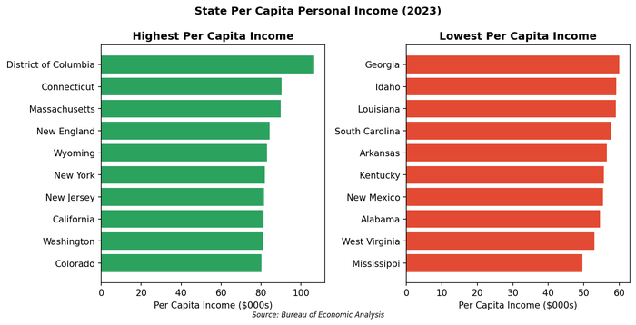

# 25. Rural America

Drive an hour beyond any major metropolitan area and the American economy changes character. The density that generates agglomeration economies in cities dissipates into landscapes where the nearest hospital might be sixty miles away, where broadband internet remains uncertain, and where the largest employers are often the local school district and the county government. This is rural America: 14% of the population spread across 72% of the land, increasingly disconnected from the metropolitan economy that dominates national statistics.

## Defining Rural

The definition of "rural" matters because policy flows from it.

**Alternative Definitions:**

The Census Bureau uses a residual definition: anything not "urban" is rural. Urban areas require population density above certain thresholds; everything else defaults to rural status.

The Office of Management and Budget (OMB) uses a county-based classification that most economic analysis follows:
- **Metropolitan counties**: Contains an urban core of 50,000+ population
- **Micropolitan counties**: Contains an urban cluster of 10,000-49,999
- **Noncore counties**: No urban cluster of 10,000+

By the OMB definition, roughly 46 million Americans---14% of the population---live in nonmetropolitan counties. These populations spread across 72% of the nation's land area, at densities that make many urban economic activities unfeasible.

The distinction matters economically. Urban economies benefit from agglomeration: the density of workers, employers, and infrastructure that enables specialization, reduces transaction costs, and generates knowledge spillovers. Rural economies operate without these advantages. A worker in a rural county may have one or two realistic employers; a business may have one or two realistic suppliers. The "thickness" of urban markets is unavailable.

The geographic distribution of rural America is uneven. The Great Plains and Mountain West are overwhelmingly rural by land area but contain relatively few people. The Upper Midwest, Appalachia, and the Deep South combine rural landscapes with meaningful population. The Northeast and West Coast have few rural counties because their land areas are small.

## The Rural Economies

Rural America is not one economy but several, each with distinct dynamics.

### Agriculture

Agriculture remains the iconic rural industry, though it employs fewer people each decade.

**Key Statistics:**
- Farm employment: 2.6 million (1.7% of U.S. employment)
- Farm share of rural employment: 6%
- Farms in the U.S.: 2 million (declining)
- Agricultural output: $500+ billion annually

The paradox is productivity. American agriculture produces record output with fewer workers than ever before. A single operator with modern equipment can farm thousands of acres. The combines harvesting Kansas wheat or Iowa corn represent millions of dollars in capital substituting for the labor that once filled rural towns.

The result is economic marginalization. Counties dependent on agriculture lose population even as agricultural output grows. The consolidation into larger farms---capital-intensive, often corporate-owned---generates wealth that accrues to landowners and equipment suppliers, not to small-town main streets.

**Agricultural Outlook (2024-2025):**
Net farm income is projected to rebound 37-40% from 2024 lows, driven primarily by livestock (cattle, poultry) and government payments exceeding $40 billion. Row crop farmers (corn, soybeans) face compressed margins from low commodity prices and high input costs---the perpetual squeeze between global markets and local costs.

The scale of modern agriculture creates a distinctive rural landscape. Farmhouses separated by miles, grain elevators visible for ten miles, equipment worth more than most houses---the economics require vast operations. A corn farm generating adequate income might span 3,000 acres, well beyond what a single family could work a generation ago. Custom operators, seasonal labor, and hired managers fill the gap.

Corporate involvement in agriculture takes multiple forms. Direct ownership of farmland is less common than the mythology suggests, but contract farming---where processors specify practices and guarantee purchases---dominates poultry, hogs, and increasingly cattle. Farmers become managers of assets owned by integrators, bearing production risk while following corporate specifications.

### Energy Production

Energy extraction creates the highest-wage rural jobs, but with extreme volatility.

**Major Producing Regions:**
- **Permian Basin (Texas/New Mexico)**: The world's most productive oil field
- **Bakken (North Dakota)**: Shale oil
- **Marcellus/Utica (Pennsylvania/Ohio/West Virginia)**: Shale gas
- **Powder River Basin (Wyoming)**: Coal (declining)
- **Great Plains "Wind Belt"**: Wind energy

Fossil fuel extraction brings economic booms---Midland, Texas has among the highest median incomes in the country---but also busts when commodity prices fall. The 2014-2016 oil price collapse emptied boom towns; the 2020 pandemic crash repeated the cycle. Workers migrate in and out, straining local services during booms and leaving behind debts and vacancies during busts.

Renewable energy represents a growing share of rural land use. Wind farms now dot the Great Plains from Texas to Minnesota. The economics are straightforward: wind is strongest where population is sparsest. Landowners receive lease payments (typically $5,000-$10,000 per turbine annually) that supplement farm income and reduce agricultural risk.

Solar development has expanded into rural areas as well. Utility-scale solar farms---thousands of acres of panels---increasingly compete with agricultural use for land, particularly in the Sun Belt. The economics favor relatively poor agricultural land: if an acre generates $200 in farm income but $800 in solar lease payments, the transition is compelling. Concerns about farmland loss and community character have prompted some counties to restrict solar development.

Battery storage facilities, essential for grid integration of renewable energy, add another dimension. These industrial installations in rural settings bring construction jobs, property taxes, and ongoing employment---modest but meaningful for small communities.

### Mining and Extraction

Coal mining's decline has devastated Appalachian and Wyoming communities.

**Coal Industry Collapse:**
- U.S. coal production: Down 50% since 2008
- Coal mining employment: 42,000 (down from 90,000 in 2012)
- Counties affected: Eastern Kentucky, southern West Virginia, southwest Virginia, northeast Wyoming

The transition has been brutal. Coal counties typically lack the educational infrastructure, physical infrastructure, and population density to attract replacement industries. Younger residents leave; those who remain face limited options.

Emerging "critical minerals" mining offers some new opportunity. Lithium deposits in Nevada and North Carolina, copper in Arizona, rare earth elements in Wyoming attract investment driven by electrification demand. But these projects are capital-intensive and contentious---environmental concerns limit development.

### Recreation and Tourism

The "amenity economy" represents rural success stories.

**High-Growth Rural Counties:**
Counties with natural amenities---mountains, lakes, national parks, ski resorts---consistently outperform other rural areas on population growth and income. The Intermountain West (Colorado, Utah, Montana) has seen particularly strong growth as remote workers seek outdoor access.

**Examples:**
- Teton County, Wyoming (Jackson Hole): Median household income exceeds $130,000
- Summit County, Colorado (Breckenridge): Strong real estate, tourism economy
- Flathead County, Montana (Kalispell): Gateway to Glacier National Park

The model is fragile. These economies depend on wealthy visitors and second-home owners; they often push out working-class residents who can't afford housing. The local workforce commutes long distances or lives in mobile homes invisible to tourists. One bad ski season or wildfire can crater revenues.

## The Rural-Urban Divide

The divergence between rural and metropolitan America has accelerated across multiple dimensions.

### Economic Divergence

Since the 2008 financial crisis, metropolitan areas have captured over 90% of net new job growth. Rural recovery has been slower and less complete.

**Key Metrics (2024):**

| Measure | Rural | Urban |
|---------|-------|-------|
| Median household income | $66,000 | $86,000 |
| College degree attainment | 22% | 35% |
| Labor force participation | 57% | 63% |
| GDP growth (2015-2024) | 1.8% annually | 2.4% annually |

*Figure 25.1: Per capita income by state (2023). The highest-income states exceed the lowest by more than $40,000 per person. Source: BEA*

The income gap understates the divide. Rural costs are lower, but the gap in opportunity---the availability of high-paying jobs, the chance for advancement---is wider than the income statistics suggest.

### The Brain Drain

The fundamental demographic challenge is simple: young people leave. Graduates of rural high schools move to cities for college and rarely return. Those with the most education and ambition are most likely to go.

The result is population aging and skill depletion. Rural counties increasingly skew older; working-age adults with college degrees are scarce. Employers seeking skilled workers face thin labor pools.

This pattern is self-reinforcing. The absence of skilled workers deters employers; the absence of employers drives young people away. Breaking the cycle requires interventions at multiple points simultaneously.

Some rural communities have had success with "grow your own" workforce strategies: scholarships requiring recipients to return home, loan forgiveness programs for professionals serving rural areas, and aggressive recruitment of hometown graduates. But these programs operate at the margins; the fundamental economic forces favor concentration.

The educational pipeline presents particular challenges. Rural schools, often excellent despite limited resources, prepare students for higher education. But the higher education itself occurs in cities: state universities, community colleges, technical schools are metropolitan institutions. Once students relocate for education, the return rate is low. This geographic mismatch between where rural students grow up and where they must go to acquire marketable skills creates structural brain drain.

### Deaths of Despair

Economist Anne Case and Angus Deaton documented a phenomenon concentrated in rural America: rising mortality among middle-aged white adults without college degrees, driven by suicide, drug overdose, and alcoholic liver disease.

The pattern reflects economic dislocation: the loss of manufacturing and mining jobs that provided identity and income without requiring educational credentials. The opioid epidemic hit hardest in rural areas, beginning with prescription painkillers and evolving through heroin and fentanyl. Recovery is slow.

The geography of despair overlaps with the geography of economic decline but isn't identical. Some struggling rural areas have avoided the worst mortality trends; some relatively prosperous areas have high rates. Social cohesion, community institutions, healthcare access, and cultural factors all matter. But the general pattern is clear: where economic hope diminishes, health outcomes worsen.

Treatment resources are particularly scarce in rural areas. Addiction medicine specialists, mental health professionals, and rehabilitation facilities cluster in metropolitan areas. Rural residents may need to travel hours for treatment---if they can access it at all. Telehealth has expanded access but cannot substitute for in-person care in many cases.

## Infrastructure Gaps

Rural infrastructure deficits compound economic challenges.

### Healthcare Access

Rural hospital closures have accelerated, with more than 150 facilities closing or converting to outpatient-only status since 2010.

**Drivers of Closure:**
- Low patient volumes (insufficient scale)
- Adverse payer mix (high Medicaid/Medicare, low private insurance)
- Workforce shortages (inability to recruit physicians and nurses)
- Distance (long travel times deter utilization)

The consequences are severe. Over half of rural counties lack hospital obstetric services, forcing pregnant women to travel long distances for delivery---associated with increased maternal and infant mortality. Emergency response times stretch to an hour or more. Chronic disease management suffers without accessible primary care.

"Critical access hospitals"---small facilities receiving enhanced Medicare reimbursement---provide a partial safety net, but many operate on thin margins with aging equipment and exhausted staff.

### Broadband

The digital divide is a rural divide.

**Connectivity Statistics (2024):**
- Urban areas with 100+ Mbps access: 98%
- Rural areas with 100+ Mbps access: 72%
- Rural areas with reliable service (real-world measures): 70-80%

FCC maps historically overstated coverage; actual access often falls short. The "last mile" problem is severe: running fiber to dispersed homes is expensive, and the revenue doesn't cover costs without subsidy.

Federal programs---the BEAD infrastructure program, Rural Digital Opportunity Fund---are investing billions to close the gap. Starlink and other satellite services offer alternatives where fiber is impractical. Progress is real but incremental, with coverage improving several percentage points annually.

But broadband alone doesn't solve the rural economic challenge. Telecommuting requires not just connectivity but skills and job opportunities in the first place.

### Physical Infrastructure

Rural counties maintain disproportionate road miles relative to their tax base. The federal highway system serves metropolitan traffic; local roads that connect farms to markets and residents to services often suffer from deferred maintenance.

Thousands of bridges classified as "structurally deficient" serve low-traffic rural routes. Water systems aging past their design lives serve small towns unable to afford replacement. The infrastructure gap is not visible from the interstate but shapes daily life for rural residents.

## Federal Transfers

The rural economy increasingly depends on federal transfer payments.

**Transfer Dependency:**
In the most rural "noncore" counties, transfer payments (Social Security, Medicare, Medicaid, veterans' benefits, disability) constitute 30-40% of total personal income. This shields communities from economic fluctuations but reflects the absence of self-sustaining economic activity.

**The Farm Bill:**
Federal agricultural policy flows primarily through the quinquennial Farm Bill, which combines farm subsidies, nutrition programs (SNAP), crop insurance, and conservation programs. Subsidy payments disproportionately benefit large producers of specific commodities (corn, cotton, soybeans, wheat, rice)---often corporate operations rather than family farms.

The politics of the Farm Bill links rural agricultural interests with urban nutrition programs in an alliance that ensures bipartisan support. The result is durable but also resistant to reform.

## The Political Economy of Rural America

Rural communities punch above their weight politically. The Senate allocates two seats per state regardless of population; rural states like Wyoming (population 580,000) have the same representation as California (39 million). The Electoral College slightly favors smaller states. State legislatures often over-represent rural areas.

This political power does not translate straightforwardly into economic policy favorable to rural areas. Rural voters tend conservative; conservative economic policy tends toward limited government intervention. The tension between "leave us alone" politics and "help us out" economic needs creates contradictions. Federal agricultural programs, healthcare subsidies, and infrastructure investments that rural economies depend upon sometimes conflict with the ideology of rural representatives.

Immigration policy illustrates the contradiction acutely. Many rural economies---meatpacking plants, dairy farms, construction in resort towns---depend on immigrant labor, often unauthorized. Restrictive immigration enforcement threatens these labor supplies even as rural voters support such enforcement politically.

The geographic sorting of American politics has intensified the divide. Rural areas vote overwhelmingly Republican; urban areas vote overwhelmingly Democratic. The cultural differences that accompany this sorting---on guns, religion, social issues---have become as salient as economic differences. Rural resentment of metropolitan elites combines economic grievance with cultural alienation.

## Success Stories

Amid the general challenges, some rural communities have found formulas that work.

### Destination Economies

Communities with natural or cultural amenities attract tourism dollars and, increasingly, remote workers.

**Examples:**
- **Bend, Oregon**: Transformed from timber town to outdoor recreation destination
- **Bozeman, Montana**: Growth pole for Greater Yellowstone region
- **Asheville, North Carolina**: Arts, food, and mountain tourism

These communities attract wealth but also face pressures: housing costs rise, long-term residents are displaced, service workers cannot afford to live where they work. Success can undermine itself.

### Niche Manufacturing

Small towns with specialized manufacturing capabilities can thrive if they find their niche.

**Examples:**
- Precision machining clusters serving aerospace or medical devices
- Food processing tied to regional agricultural production
- Recreational vehicle and manufactured housing production

The common thread is specialization: skills and supply chains that cannot easily be replicated elsewhere. These niches are fragile---dependent on a few customers or a specific technology---but they provide middle-class employment outside metropolitan areas.

### Zoom Towns

The pandemic's remote-work experiment created a new category: "Zoom towns" where remote workers relocated seeking affordable housing, natural amenities, or connection to family.

**Characteristics:**
- Often high-amenity locations (mountains, beaches, college towns)
- Influx of high-income remote workers
- Rapid housing price appreciation
- Strain on local services and affordability

The phenomenon's durability remains uncertain. Some remote workers have returned to metropolitan areas; others have embedded in new communities. The lasting impact likely concentrates in places that offer genuine lifestyle advantages---not struggling towns hoping that broadband alone will attract telecommuters.

## Recent Trends

### The Rural Rebound

Between 2020 and 2024, nonmetropolitan counties experienced a population rebound driven by net migration of over 650,000 people---sufficient to offset natural decrease (more deaths than births) and break a decade-long pattern of losses. Domestic migration accounts for roughly 70% of this gain; international immigration accounts for the remainder.

**Caveats:**
- Growth concentrates in the South and amenity-rich Mountain West
- Great Plains and Corn Belt counties continue losing population
- The rebound follows a historic low point; many counties remain below 2010 populations

Whether this represents a durable shift or a pandemic anomaly will become clear over the coming decade.

### Energy Community Investments

The Inflation Reduction Act specifically targets "energy communities"---areas with closed coal mines, retired coal plants, or significant fossil fuel employment---for clean energy investment. Tax credits for solar, wind, and battery projects are enhanced when built in these areas.

The policy explicitly aims to replace fossil fuel employment with clean energy jobs in the same communities. Results are early but visible: battery plants in coal country, solar installations on retired mine lands.

### The Farm Income Squeeze

Despite the projected 2025 rebound in net farm income, the underlying pressures on mid-sized farms continue. Input costs (fertilizer, fuel, equipment) remain elevated; commodity prices reflect global competition; land values have appreciated faster than farming can justify as investment return.

The result is continued consolidation: large operations absorbing smaller neighbors, family farms maintained as part-time enterprises while operators work off-farm jobs.

## Regional Profiles

### The Ogallala Region

> **Quick Facts**
> - Location: High Plains from South Dakota to Texas
> - Water source: Ogallala Aquifer
> - Primary economy: Irrigated agriculture, feedlots
> - Population trend: Declining

The Ogallala Aquifer, one of the world's largest underground water reserves, enabled the transformation of semi-arid High Plains into productive farmland. Center-pivot irrigation systems dot the landscape from the air; corn and cattle feed operations prosper in what was once short-grass prairie.

But the aquifer is depleting. In some areas, the water table has dropped over 100 feet. Recharge is negligible on human timescales. Current extraction rates are unsustainable over decades.

The economic implications are existential. As wells go dry, irrigated agriculture becomes impossible. The communities built on irrigation face reversion to dryland farming or abandonment. The time horizon is visible: some Kansas and Texas areas are already transitioning; others have a generation before constraints bite.

### Appalachian Coal Country

> **Quick Facts**
> - States: Eastern Kentucky, southern West Virginia, southwest Virginia
> - Historic economy: Coal mining
> - Current challenges: Post-coal transition
> - Population trend: Declining

Appalachian coal country represents the most visible example of structural economic decline. The coal that powered American industrialization and electricity generation came disproportionately from these mountains. The industry's collapse---driven by cheap natural gas, environmental regulation, and automation---has left communities without economic purpose.

Median incomes in coal counties run 40-50% below national averages. Drug overdose rates are among the nation's highest. Working-age population has declined as those who can leave do.

Recovery efforts focus on tourism (the Appalachian Trail, outdoor recreation), healthcare (hospitals as anchor employers), and technology (call centers, data processing). Progress is incremental at best. The infrastructure of extraction---rail lines, electrical substations, industrial skills---doesn't easily convert to post-industrial uses.

### The Wind Belt

> **Quick Facts**
> - Location: Great Plains from Texas to Minnesota
> - Primary development: Utility-scale wind energy
> - Economic impact: Land lease payments, property taxes
> - Population trend: Stable to declining

The Great Plains have some of the best wind resources in the world: steady, strong, and located where land is cheap and transmission is (relatively) available. Wind turbines now dominate the landscape in much of Kansas, Oklahoma, and Iowa.

For rural landowners, turbine lease payments provide income diversification. A single turbine might generate $8,000-$10,000 annually for the landowner---significant supplemental income that continues regardless of crop prices or weather. Counties collect property taxes on improvements that would otherwise not exist.

The employment impact is more limited. Construction provides temporary jobs; ongoing operations require only a handful of technicians per wind farm. But in counties with few economic options, even modest employment and tax revenue matter.

## Data Sources and Further Reading

### Key Data Sources

- **USDA Economic Research Service**: Rural economy data, Atlas of Rural and Small-Town America
- **Census Bureau**: American Community Survey, population estimates
- **Bureau of Economic Analysis**: Regional GDP
- **USDA NASS**: Agricultural statistics

### Further Reading

- Carr, Patrick and Maria Kefalas. *Hollowing Out the Middle* (2009) - Brain drain dynamics
- Case, Anne and Angus Deaton. *Deaths of Despair* (2020) - Rural mortality crisis
- Wuthnow, Robert. *The Left Behind* (2018) - Rural-urban cultural divide
- USDA Rural Development reports

---

**Word count:** roughly 4,200 words

*Note: For detailed treatment of agriculture, energy, and healthcare, see the relevant sector chapters in Part II.*
