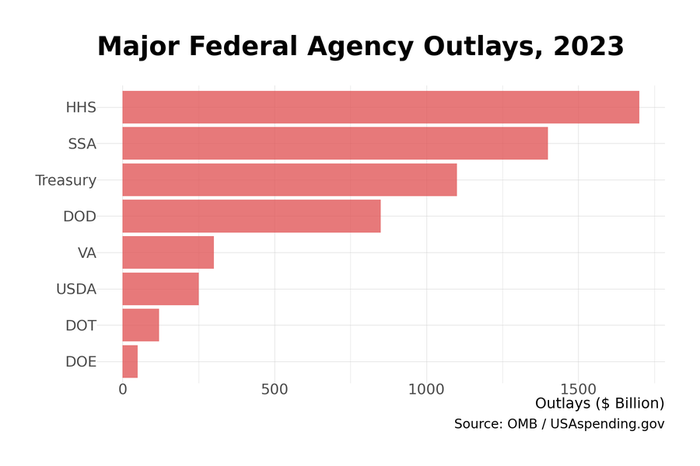

# 26. Federal Economic Governance

When markets crash, when inflation spikes, when unemployment rises, Americans look to Washington for answers. But "Washington" is not a single actor---it is a sprawling apparatus of agencies, councils, and commissions, each with distinct authorities, constituencies, and institutional cultures. Understanding how economic policy actually gets made requires mapping this institutional landscape.

## The Policy-Making Core

Economic policy emerges from the interaction of a handful of key institutions, coordinated (imperfectly) by the White House.

### The Troika

Three agencies form the core of executive branch economic policy-making:

**The Treasury Department** is the primary economic agency, managing federal finances, collecting taxes, enforcing sanctions, and serving as diplomat for the U.S. dollar. The Secretary of the Treasury speaks for the administration on economic matters, negotiates with Congress on fiscal policy, and represents the United States at international economic summits.

Treasury houses several key policy offices:
- **Office of Economic Policy**: Macroeconomic analysis and revenue estimation
- **Office of Tax Policy**: Develops tax legislation and international tax treaties
- **Office of International Affairs**: Manages relations with IMF, World Bank, and currency policy
- **Office of Financial Stability**: Created after 2008, monitors systemic risk

With roughly 100,000 employees (80,000+ at the IRS), Treasury is by far the largest economic agency.

**The Office of Management and Budget (OMB)** is the implementation and enforcement arm. OMB constructs the President's Budget, oversees agency management, and clears regulations before they take effect. The Office of Information and Regulatory Affairs (OIRA) within OMB serves as the "gatekeeper" that reviews significant regulations for cost-benefit compliance---a chokepoint that gives OMB enormous influence over the regulatory state.

**The Council of Economic Advisers (CEA)** serves as the president's internal think tank, providing objective empirical analysis rather than political advocacy. The CEA produces the annual *Economic Report of the President* and brings academic economic expertise into policy deliberations. Three members (one Chair) are supported by a rotating staff of economists, typically drawn from university faculties on temporary appointments.

### The National Economic Council

The **National Economic Council (NEC)**, created by President Clinton in 1993, coordinates economic policy across agencies. The NEC Director serves as an "honest broker," managing the flow of options to the president rather than advocating for particular positions.

Unlike the CEA's analytical focus, the NEC is process-oriented: convening meetings, resolving interagency disputes, and ensuring the president receives clear choices. The NEC's influence depends heavily on the director's relationship with the president and willingness to enforce coordination.

## The Independent Fed

The **Federal Reserve** operates outside the executive branch's policy apparatus, conducting monetary policy independently of political direction. The Fed Chair---currently Jerome Powell, whose term extends through May 2026---is arguably the most influential individual economic actor in the country.

The Fed's independence is institutional rather than constitutional: Congress could theoretically restructure or eliminate it. But the norm of Fed independence has become deeply entrenched since the Volcker era, and presidents generally avoid public criticism of monetary policy decisions.

The Fed also serves as the primary regulator of bank holding companies and an important supervisor of large banks, giving it regulatory authority that extends well beyond monetary policy.

## Data and Statistics

Economic governance requires data, and the federal statistical system provides it.

**The Bureau of Economic Analysis (BEA)**, housed within the Commerce Department, produces the GDP statistics, trade data, and regional economic accounts that measure the economy. With roughly 370 staff, BEA punches far above its weight---its quarterly GDP releases move markets and shape policy debates worldwide.

**The Census Bureau**, also within Commerce, conducts the decennial census and produces continuous economic statistics: the Economic Census, the Survey of Manufacturers, retail sales data, and housing statistics. With 12,000 employees, Census operates the surveys that underpin most economic measurement.

**The Bureau of Labor Statistics (BLS)**, within the Labor Department, produces employment statistics (the monthly jobs report), inflation measures (CPI), productivity data, and wage statistics. The monthly employment situation release is the most market-moving regular data publication.

These agencies operate with unusual independence for executive branch entities, protected by statistical integrity policies that limit political interference with data collection and publication.

## Regulatory Agencies

Beyond the policy-making core, a constellation of regulatory agencies shapes economic activity through rule-making and enforcement.

### Financial Regulators

*Figure 26.1: Key financial regulatory agency budgets. The FDIC, funded by bank premiums, dwarfs the SEC and other agencies that rely on congressional appropriations. Source: Agency budget documents*

**Key Financial Regulatory Agencies (2025)**

| Agency | Focus | Budget | Staff |
|--------|-------|--------|-------|
| FDIC | Bank deposit insurance and resolution | $3.0 billion | 6,900 |
| SEC | Securities markets and investor protection | $2.6 billion | 5,600 |
| OCC | National bank supervision | $1.4 billion | 3,600 |
| CFPB | Consumer financial protection | $750 million | 1,700 |
| CFTC | Derivatives and futures markets | $400 million | 550 |

The **Securities and Exchange Commission (SEC)** regulates securities markets, requiring disclosure from public companies and policing fraud. The SEC's jurisdiction has expanded as capital markets have grown, though its budget has not kept pace---leading to persistent complaints about under-enforcement.

The **Commodity Futures Trading Commission (CFTC)** regulates derivatives markets with a staff roughly one-tenth the size of the SEC's. The CFTC's jurisdiction over cryptocurrency remains contested, with ongoing "turf wars" between SEC and CFTC over which agency should regulate digital assets.

The **Federal Deposit Insurance Corporation (FDIC)** insures deposits and resolves failed banks. Funded by bank premiums rather than congressional appropriations, the FDIC maintains unusual independence. Its resolution authority proved critical during the March 2023 bank stress, when it seized Silicon Valley Bank and Signature Bank over a single weekend.

The **Office of the Comptroller of the Currency (OCC)**, an independent bureau within Treasury, supervises national banks. The **Consumer Financial Protection Bureau (CFPB)**, created after 2008, regulates consumer financial products with funding from Federal Reserve transfers that insulate it from congressional appropriations pressure.

### Other Economic Regulators

The **Federal Trade Commission (FTC)** enforces antitrust law and consumer protection statutes, sharing antitrust authority with the Justice Department's Antitrust Division. The FTC's current leadership has pursued an aggressive enforcement agenda against technology platforms and expanded merger scrutiny.

The **Occupational Safety and Health Administration (OSHA)**, within the Labor Department, sets workplace safety standards. With roughly 2,200 employees covering millions of workplaces, OSHA relies heavily on employer self-compliance and targeted enforcement.

The **Environmental Protection Agency (EPA)**, while not primarily an economic agency, shapes economic activity through environmental regulations affecting energy, manufacturing, transportation, and agriculture.

## The Budget Process

Federal spending flows through an elaborate process that divides into mandatory and discretionary categories.

### Mandatory vs. Discretionary

**Mandatory spending** (roughly 60-65% of the budget) occurs automatically based on eligibility laws. Social Security, Medicare, Medicaid, and interest on the debt require no annual appropriation---spending continues unless Congress changes the underlying statutes. This category grows on autopilot as the population ages and healthcare costs rise.

**Discretionary spending** (roughly 30-35%) requires annual appropriations. Defense spending (roughly $895 billion in FY 2025) and non-defense discretionary ($711 billion) must be enacted each year through the appropriations process.

**Net interest** has grown dramatically as debt has accumulated and interest rates have risen, now rivaling defense spending at over $800 billion annually.

### The Appropriations Cycle

The budget process follows a predictable (if frequently delayed) calendar:

1. **President's Budget (February)**: The administration's proposal, constructed by OMB with agency input
2. **Budget Resolution (April target)**: Congress sets aggregate spending limits
3. **Appropriations (May-September)**: Twelve subcommittees write actual spending bills
4. **Fiscal Year Begins (October 1)**: New appropriations take effect

In practice, this process rarely functions as designed. Congress routinely misses deadlines, funding the government through continuing resolutions that extend prior-year spending levels. Government shutdowns---when funding lapses entirely---have become periodic political weapons.

## The Scorekeepers

Two legislative agencies exercise enormous influence by determining the official cost of legislation.

**The Congressional Budget Office (CBO)** produces the "baseline"---projections of spending and revenue under current law---and "scores" that estimate the cost of proposed legislation. CBO's roughly 275 staff (mostly PhD economists) operate with scrupulous nonpartisanship; their estimates often determine whether legislation is politically viable.

**The Joint Committee on Taxation (JCT)** serves as the official revenue estimator for tax legislation. Its small, elite staff of lawyers and economists calculates how tax changes would affect federal revenue---determinations that shape what tax bills can pass under budget reconciliation rules.

**The Government Accountability Office (GAO)**, with 3,400 staff, serves as the "congressional watchdog," auditing spending and evaluating program performance. GAO reports often surface waste, fraud, and management failures that drive oversight hearings.

## Recent Institutional Developments

### Industrial Policy Coordination

The CHIPS Act and Inflation Reduction Act have created a new institutional challenge: implementing industrial policy at scale. This requires coordination across agencies accustomed to operating independently.

The Commerce Department's new CHIPS Program Office manages $52 billion in semiconductor incentives, evaluating applications and negotiating with companies. Treasury administers the IRA's tax credits for clean energy. The National Economic Council coordinates with the National Security Council on strategic investment decisions.

This represents a significant departure from the market-neutral posture that characterized federal economic policy for decades. The government is now explicitly picking winners---or at least picking sectors---requiring institutional capacities that had atrophied.

### IRS Transformation

The Inflation Reduction Act provided $80 billion for IRS modernization and enforcement, the largest investment in the agency in decades. The agency has focused on technology upgrades (paperless processing, unified APIs) and increased audits of high-wealth taxpayers.

Implementation has been uneven. A "strategic pause" in 2025 reprioritized technology projects amid budget uncertainty. Political controversy over enforcement priorities continues.

### Regulatory Jurisdiction Disputes

The rapid growth of cryptocurrency and digital assets has exposed jurisdictional gaps and overlaps in the regulatory structure. The SEC claims most crypto tokens are securities requiring registration; the CFTC argues many are commodities subject to its oversight; state regulators assert their own authority.

Legislative clarity remains pending, leaving market participants uncertain about which rules apply and which agency enforces them.

## Institutional Profiles

### The Congressional Budget Office

> **Quick Facts**
> - Established: 1974
> - Staff: roughly 275
> - Director: Phillip Swagel (since 2019)
> - Location: Ford House Office Building, Capitol Hill

CBO was created by the Congressional Budget Act of 1974, part of Congress's reassertion of power over the budget process after conflicts with the Nixon administration. The agency provides Congress with independent analysis, free from executive branch spin.

CBO's influence derives from its official status as scorekeeper. A CBO estimate that a bill costs more than expected can kill legislation; a favorable score can make passage possible. This power creates incentives for gaming---designing provisions to minimize official costs even when real-world effects may differ.

The agency has maintained its nonpartisan reputation through multiple administrations, with directors appointed by agreement between House and Senate leadership. Staff turnover is relatively low for government, creating institutional memory and analytical consistency.

### The Federal Reserve Board

> **Quick Facts**
> - Established: 1913
> - Board staff: roughly 3,000
> - System staff (including regional banks): roughly 23,000
> - Chair: Jerome Powell (appointed 2018, reappointed 2022)

The Federal Reserve's institutional design reflects early-20th-century compromises between those who wanted a central bank and those who feared concentrated financial power. The result---a hybrid of public and private governance, with 12 regional Reserve Banks owned by member banks but supervised by the presidentially appointed Board of Governors---is unlike any other central bank.

The Fed's independence has evolved over time. Before the 1951 Treasury-Fed Accord, the Fed accommodated Treasury's financing needs. The Volcker era (1979-1987) established the modern norm of independent monetary policy focused on price stability, even at the cost of recession.

Today's Fed faces expanded responsibilities: monetary policy, bank supervision, financial stability oversight, and payment system operation. The March 2023 bank failures renewed debates about whether these functions should be consolidated or separated.

### The Securities and Exchange Commission

> **Quick Facts**
> - Established: 1934
> - Staff: roughly 5,600
> - Chair: Gary Gensler (appointed 2021)
> - Budget: $2.6 billion

The SEC was created during the New Deal to restore confidence in securities markets after the 1929 crash. Its core mission---requiring disclosure so investors can make informed decisions---has remained constant even as markets have transformed.

The agency operates through five divisions: Corporation Finance (disclosure), Trading and Markets (market structure), Investment Management (funds), Enforcement (violations), and Economic and Risk Analysis (data). Recent priorities have included climate disclosure requirements, cryptocurrency enforcement, and market structure reforms.

The SEC's effectiveness is perpetually debated. Critics argue its disclosure-based approach fails to prevent fraud; defenders note the agency operates with limited resources against a vast, sophisticated industry. Enforcement actions, while numerous, often result in settlements that neither admit nor deny wrongdoing.

## Data Sources and Further Reading

### Key Data Sources

- **OMB Budget Documents**: President's budget, historical tables
- **CBO Publications**: Budget projections, cost estimates, research
- **GAO Reports**: Audits and program evaluations
- **Federal Reserve**: Monetary policy statements, supervision reports

### Further Reading

- Kettl, Donald. *Deficit Politics* (2020) - Budget process and fiscal policy
- Irwin, Neil. *The Alchemists* (2013) - Central bank history
- Meltzer, Allan. *A History of the Federal Reserve* (2003-2010) - Definitive Fed history
- Brookings Institution governance reports

---

**Word count:** roughly 2,200 words

*Note: For treatment of specific policy areas (taxation, monetary policy, financial regulation), see relevant chapters in Parts II and III.*
