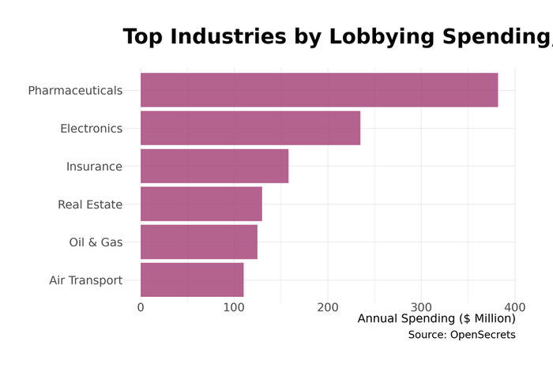

# 27. Trade Associations and Business Organization

Walk down K Street in Washington and you pass the headquarters of organized business: the trade associations, lobbying firms, and policy shops where industries coordinate their interests and communicate with government. The U.S. Chamber of Commerce occupies a full block across from the White House. The American Petroleum Institute sits nearby. PhRMA, the pharmaceutical trade group, is a short walk away. This is where the American economy organizes itself politically—part of a broader ecosystem that includes labor unions, consumer advocates, environmental groups, and other interests competing to shape policy.

## The Business of Influence

Trade associations exist to solve a collective action problem. Individual firms have interests in common---favorable tax treatment, light regulation, access to markets---but each firm would prefer to free-ride on others' political efforts. Associations pool resources, coordinate strategy, and speak with a unified voice that commands attention.

<figure>

<figcaption>Figure 27.1: Federal lobbying spending has tripled since 2000. Industry groups, trade associations, and corporations compete for political influence. Source: OpenSecrets</figcaption>
</figure>

The scale is enormous. Total federal lobbying spending exceeded $4.5 billion in 2024. But lobbying registration captures only direct advocacy; the broader "influence industry"---including public relations, grassroots mobilization, and think tank funding---employs over 100,000 people in the Washington area alone.

## The Big Four Business Associations

Four organizations dominate cross-sector business representation, each with distinct membership, strategy, and ideological orientation.

### U.S. Chamber of Commerce

The Chamber is the world's largest business organization, claiming to represent 3 million businesses through its network of state and local affiliates. Direct corporate membership is smaller but includes most Fortune 500 companies.

**Key Statistics:**
- Revenue: $226 million (2024)
- Lobbying spending: $70-80 million annually (consistently #1 or #2)
- Focus: Tax policy, deregulation, legal reform, trade

The Chamber's influence derives from its scale and staying power. While individual companies engage on specific issues, the Chamber maintains permanent capacity across the entire policy landscape. Its positions skew reliably pro-business and generally Republican, though it has occasionally broken with the GOP on immigration and trade.

### National Association of Manufacturers (NAM)

NAM represents the industrial sector, with 14,000 member companies (roughly 85% small and medium enterprises). Its focus on manufacturing gives it particular credibility on trade, energy, and labor policy.

**Key Statistics:**
- Revenue: $62 million (2024)
- Membership: 14,000 companies
- Focus: Tax cuts, regulatory rollback, energy independence

NAM's strength is grassroots mobilization. Factory owners in congressional districts carry political weight that Washington lobbyists cannot match. When NAM activates its members, legislators notice.

### Business Roundtable

The Business Roundtable takes a different approach: exclusive membership limited to CEOs of leading companies. With roughly 200 members, it offers high-level access rather than grassroots scale.

**Key Statistics:**
- Membership: roughly 200 CEOs
- Lobbying spending: $24 million (first nine months of 2024---a record)
- Focus: Corporate governance, trade, workforce development

The Roundtable's 2019 "Statement on the Purpose of a Corporation"---moving slightly away from pure shareholder primacy toward stakeholder considerations---generated headlines but limited policy impact. The organization remains focused on traditional C-suite priorities.

### National Federation of Independent Business (NFIB)

NFIB represents small business with a heavily Republican ideological orientation. Its "Key Vote" alerts---signaling that a vote will affect endorsement decisions---are feared by legislators in competitive districts.

NFIB has increasingly turned to litigation, filing lawsuits challenging regulations affecting small business. Its legal challenges to the Affordable Care Act, OSHA mandates, and other policies have reached the Supreme Court.

## Industry-Specific Associations

While the Big Four represent business generally, industry-specific associations often outspend them on issues affecting their sectors.

**Major Industry Associations (2024)**

| Association | Industry | Lobbying Spending | Membership |
|-------------|----------|-------------------|------------|
| NAR | Real estate | $86 million | 1.49 million |
| PhRMA | Pharmaceuticals | $30 million | 37 companies |
| AMA | Physicians | $25 million | Physicians |
| AHIP | Health insurers | $9 million | 100+ payers |
| API | Oil and gas | $8-10 million | 600 companies |
| ABA | Lawyers | $3 million | 400,000 |
| NAHB | Home builders | $3-4 million | 140,000 |

### The National Association of Realtors

NAR is the "sleeping giant" of the lobbying world. With 1.49 million members---real estate agents in virtually every congressional district---and $86 million in annual lobbying spending, NAR wields unmatched political influence on housing policy.

NAR's priorities include protecting the mortgage interest deduction, maintaining favorable capital gains treatment for home sales, and opposing policies that might reduce transaction volumes. The association's political action committee is consistently among the largest, contributing to candidates of both parties.

The 2024 antitrust settlement requiring changes to NAR's commission practices may reshape the organization, but its political apparatus remains formidable.

### PhRMA

The Pharmaceutical Research and Manufacturers of America represents brand-name drug companies. PhRMA's $30 million in disclosed lobbying is supplemented by advertising campaigns, support for patient advocacy groups, and funding for policy research.

PhRMA's core mission is maintaining the pricing environment that funds pharmaceutical R&D. The industry argues that high U.S. prices subsidize the risky, expensive research that produces new treatments, and that price controls would reduce innovation. Critics counter that prices exceed what innovation requires, that much basic research is publicly funded, and that other countries with lower prices still produce pharmaceutical breakthroughs. When Congress debates Medicare negotiation, importation, or reference pricing, both sides mobilize. The Inflation Reduction Act's Medicare negotiation provisions represented the first major change to pharmaceutical pricing policy in decades.

### The American Medical Association

The AMA represents physicians, though its membership has declined from near-universal to roughly one-third of practicing doctors. The association's primary policy focus is maintaining adequate Medicare reimbursement rates and advocating on scope-of-practice issues.

The AMA also plays significant roles in medical education (accrediting medical schools), specialty board certification, and clinical guidelines. The organization argues these functions protect patient safety and maintain professional standards. Critics contend that some activities---particularly restrictions on medical school capacity and scope-of-practice limitations on nurse practitioners---restrict competition and contribute to physician shortages and high healthcare costs. As with most professional associations, the line between quality assurance and occupational protection is contested.

## How Trade Associations Function

### Lobbying and Information Provision

Direct lobbying---meeting with legislators and staff, testifying at hearings, providing information and analysis---remains the core function. Associations maintain permanent lobbying operations, supplemented by contract lobbyists hired for specific campaigns.

Much of this work involves genuine information provision. Legislators writing laws for complex industries---pharmaceuticals, energy, financial services---often lack the technical expertise to anticipate how rules will work in practice. Trade associations aggregate knowledge from thousands of member companies, identifying implementation problems, unintended consequences, and practical alternatives that regulators might not consider. A congressional staffer drafting legislation on drilling safety standards benefits from hearing from engineers who actually operate drilling equipment.

This informational role is why lobbying persists despite public skepticism. Associations provide what political scientists call "legislative subsidy"---research, bill language, talking points, and technical analysis that understaffed congressional offices need. A lobbyist who provides genuinely useful information gets meetings; one who wastes time or misleads does not get invited back. The challenge for policymakers is weighing industry expertise, which is real, against industry interests, which inevitably color that expertise.

### Standards and Self-Regulation

Many associations set industry standards that carry quasi-regulatory force. The American Petroleum Institute's standards for drilling equipment, the National Fire Protection Association's electrical codes, and the American National Standards Institute's certification processes shape industry practice without government mandate.

These standards often provide genuine public benefits. The NFPA's National Electrical Code has prevented countless fires and electrocutions since 1897. API's equipment standards improve safety on oil rigs. Underwriters Laboratories' product certification helps consumers identify safe appliances. Industry practitioners often understand risks and best practices better than government regulators, and voluntary standards can adapt more quickly than legislation.

Self-regulation also serves industry interests: it can preempt potentially stricter government rules, signal responsibility to skeptical publics, and create compliance frameworks that established firms navigate more easily than newcomers. The balance between public benefit and industry advantage varies by sector and standard. Building codes genuinely save lives; some professional licensing requirements may primarily restrict competition.

### Research and Analysis

Associations produce research on their industries---economic impact studies, regulatory cost analyses, workforce surveys, and technical reports. This research serves advocacy purposes but also fills genuine information gaps. Government statistical agencies cannot track every industry in detail; trade association data on employment, production, and business conditions often provides the best available picture of specific sectors.

The challenge is that industry-funded research inevitably reflects funder perspectives. Studies on regulatory costs rarely emphasize regulatory benefits; economic impact analyses tend toward optimistic assumptions. Think tanks receiving association funding may produce rigorous work, but their research agendas and conclusions often align with funder interests. Policymakers and journalists must weigh industry expertise against industry incentives---taking the data seriously while reading the framing critically.

This "knowledge production" function has grown as policy debates have become more technical. Associations that can provide credible data and analysis shape how issues are understood, which matters as much as direct advocacy.

### Legal Challenges

Litigation has become an increasingly important tool. Business associations file lawsuits challenging regulations, seeking to invalidate rules in court rather than through the legislative process. The Supreme Court's increasing skepticism of agency authority has made this strategy more promising.

NFIB's challenges to the ACA and vaccine mandates, the Chamber's challenges to environmental regulations, and tech industry challenges to content moderation rules all reflect this litigation-first approach.

## Political Spending

### The Money Flow

Business political spending takes multiple forms, each with different rules and disclosure requirements:

**Political Action Committees (PACs)** collect voluntary contributions from employees and shareholders, contributing directly to candidates. Contributions are capped ($5,000 per candidate per election) and fully disclosed.

**Super PACs** accept unlimited contributions but cannot coordinate with candidates. They fund independent expenditure campaigns---typically advertising.

**501(c)(4) organizations** (social welfare groups) can engage in political activity without disclosing donors, creating "dark money" that has exploded in recent cycles. An estimated $1.9 billion in undisclosed spending shaped the 2024 election.

**501(c)(6) organizations** (trade associations themselves) can lobby without limit and engage in some political activity, with partial disclosure requirements.

### Undisclosed Political Spending

The shift from transparent PAC contributions to spending through organizations that need not disclose donors represents a significant change in political organization. Spending through 501(c)(4) social welfare organizations and other vehicles that do not require donor disclosure grew substantially after the Supreme Court's *Citizens United* decision in 2010. An estimated $1.9 billion in undisclosed spending shaped the 2024 election cycle.

Trade associations have become one channel for this spending. A company contributing to a 501(c)(4) affiliated with an industry association can support political activity without the public association that direct corporate political engagement would bring. Defenders argue this protects companies from boycotts and harassment over political views; critics argue it undermines democratic accountability by hiding who funds political messages.

## The Policy Infrastructure

### Think Tanks

Think tanks provide the intellectual framework that makes lobbying effective. A policy proposal with academic imprimatur and detailed analysis commands more attention than naked advocacy.

**Major Think Tanks**

| Organization | Orientation | Budget (2024) |
|--------------|-------------|---------------|
| Heritage Foundation | Conservative | $134 million |
| Brookings Institution | Centrist/Liberal | $109 million |
| Cato Institute | Libertarian | $80 million |
| American Enterprise Institute | Conservative | $68 million |

Heritage has been particularly influential in staffing Republican administrations; "Project 2025" represented an ambitious attempt to pre-plan personnel and policy for a second Trump term. Brookings provides the establishment center-left counterpart, supplying officials and analysis to Democratic administrations.

The line between think tank and advocacy organization has blurred. Many policy shops receive substantial industry funding and produce research that reliably supports funder interests, while maintaining the form of independent scholarship.

### Geographic Concentration

The influence industry concentrates geographically. "K Street" remains shorthand for lobbying, though actual firms have dispersed to surrounding neighborhoods. "Think Tank Row" along Massachusetts Avenue NW hosts policy organizations.

The Washington suburbs---particularly Northern Virginia and suburban Maryland---house the operational infrastructure: the association headquarters, the PR firms, the data analytics shops. This geographic concentration facilitates the personal relationships that make influence effective.

## Association Profiles

### U.S. Chamber of Commerce

> **Quick Facts**
> - Headquarters: 1615 H Street NW, Washington (across from the White House)
> - Founded: 1912
> - Revenue: $226 million
> - Staff: roughly 500

The Chamber's location---directly across Lafayette Square from the White House---symbolizes its centrality to American business politics. The building itself, completed in 1925, was designed to project permanence and authority.

The organization operates through a federated structure, with state and local chambers affiliating nationally. This provides both grassroots reach and insulation---local chambers can diverge from national positions, and the national Chamber can claim to speak for "Main Street" while primarily serving Fortune 500 interests.

The Chamber's effectiveness has been questioned in recent years. Its positions on climate, immigration, and election integrity have created tensions with Republican politicians who are its natural allies. Some major companies have publicly distanced themselves from Chamber positions.

### National Association of Realtors

> **Quick Facts**
> - Headquarters: Chicago (association), Washington (lobbying)
> - Founded: 1908
> - Membership: 1.49 million
> - Revenue: $350+ million (dues and related)

NAR operates differently from most trade associations because membership is effectively required for practicing real estate agents. Agents must join local, state, and national associations to access the Multiple Listing Service (MLS) databases that are essential to their business.

This membership structure provides resources unavailable to voluntary associations. NAR's political action committee, RPAC, is funded through assessments included with dues, creating a political operation with scale that few organizations can match. The association argues this structure allows it to effectively represent agent interests; critics note that members have limited choice about their political contributions.

The 2024 antitrust settlement, requiring changes to commission disclosure and structure, threatens this model. If commission rates fall and agent numbers decline, NAR's membership---and political power---could shrink significantly.

### PhRMA

> **Quick Facts**
> - Headquarters: Washington, D.C.
> - Founded: 1958 (as PMA; renamed 1994)
> - Membership: 37 companies
> - Lobbying: $30+ million disclosed; total spending far higher

PhRMA represents the brand-name pharmaceutical industry with resources that reflect the stakes involved. U.S. drug prices---often multiples of prices in other developed countries---are central to the industry's business model and a persistent source of political controversy.

The association's strategy combines direct lobbying with broader communications. Patient advocacy groups (some receiving PhRMA funding) argue that price controls would delay access to new treatments; advertising campaigns emphasize the industry's role in developing vaccines, cancer treatments, and other breakthroughs. Industry-funded researchers produce studies on innovation economics, while critics commission competing analyses. The debate involves genuine complexity: pharmaceutical R&D is expensive and risky, but the relationship between prices and innovation is contested.

PhRMA has been largely successful at maintaining the pricing status quo, though the Inflation Reduction Act's Medicare negotiation provisions marked a significant policy shift.

## Data Sources and Further Reading

### Key Data Sources

- **OpenSecrets**: Lobbying disclosure, campaign finance
- **ProPublica Nonprofit Explorer**: Association financials
- **Senate Lobbying Disclosure Act Database**: Quarterly reports
- **FEC**: Campaign contribution data

### Further Reading

- Drutman, Lee. *The Business of America Is Lobbying* (2015) - comprehensive analysis of the growth of business lobbying
- Baumgartner, Frank et al. *Lobbying and Policy Change* (2009) - empirical study finding lobbying less decisive than commonly assumed
- Hacker, Jacob and Paul Pierson. *Winner-Take-All Politics* (2010) - argues business organization shifted policy rightward
- Vogel, David. *Fluctuating Fortunes* (1989) - historical account showing business political influence waxes and wanes
- Hall, Richard and Alan Deardorff. "Lobbying as Legislative Subsidy" (2006) - influential article on lobbying's informational role

---

**Word count:** roughly 2,200 words

*Note: For treatment of specific regulatory agencies and policy areas, see relevant chapters in Part II and Chapter 26.*
