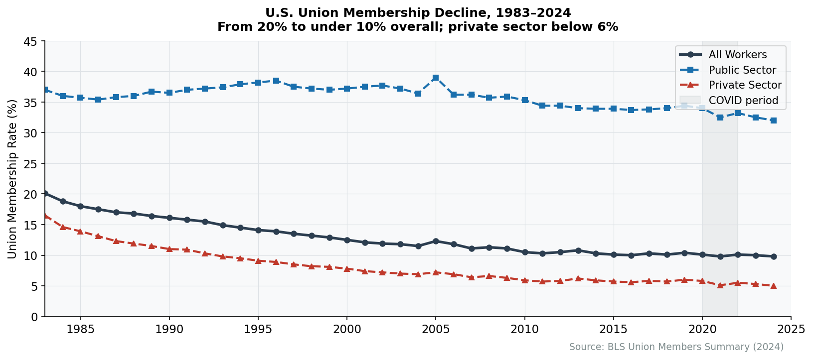
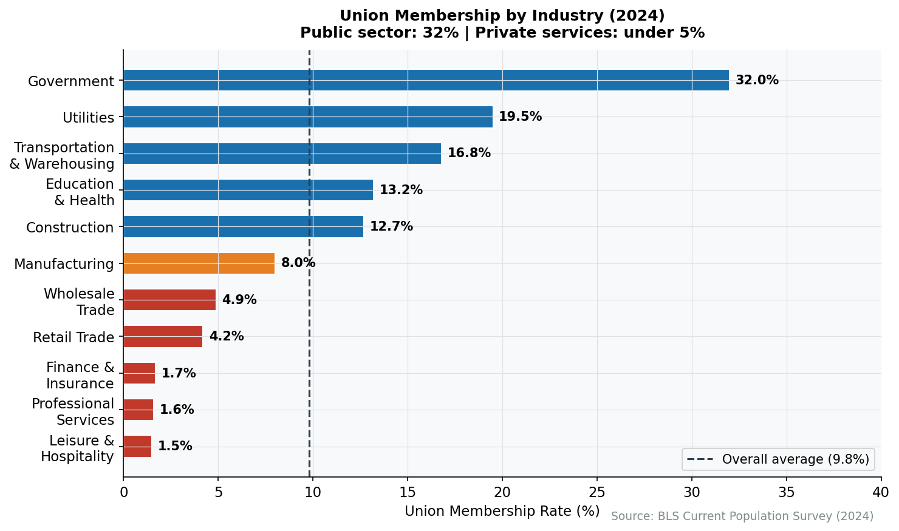

# 30. Labor Markets and the Workforce

In September 2023, the United Auto Workers launched a strike against all three Detroit automakers simultaneously---a first in the union's history. By November, they had won a 25% wage increase, restored cost-of-living adjustments lost in 2008, and eliminated the two-tier wage system that had divided their membership. The strike reminded Americans that organized labor, though diminished, retains the capacity to reshape industries.

## The State of Organized Labor

Union membership has declined for decades, from roughly 35% of private-sector workers in the 1950s to under 6% today. The total union membership rate---including public sector workers, where unions remain strong---stands at 9.9%, representing 14.3 million workers.

**Union Membership Trends**

| Year | Total Rate | Private Sector | Public Sector |
|------|-----------|----------------|---------------|
| 1983 | 20.1% | 16.8% | 36.7% |
| 2000 | 13.4% | 9.0% | 37.5% |
| 2024 | 9.9% | 5.9% | 32.2% |

*Source: Bureau of Labor Statistics, Union Members Summary, 2024*

<figure>

<figcaption>Figure 30.1: Union membership rate, 1983-2024. The long decline from 20% to 10% reflects deindustrialization, employer resistance, and legal changes favoring management. Source: BLS Union Members Summary</figcaption>
</figure>

<figure>

<figcaption>Figure 30.2: Union membership rate by industry (2024). Education and public administration remain heavily unionized; private-sector services like retail and finance have minimal union presence. Source: BLS</figcaption>
</figure>

The divergence between sectors tells the story. Public-sector workers---teachers, firefighters, government employees---maintain union representation at six times the private-sector rate. Private-sector decline reflects deindustrialization, employer resistance, and legal changes that have made organizing increasingly difficult.

## The Major Unions

### Teachers and Public Employees

The largest unions today represent public-sector workers.

**The National Education Association (NEA)**, with roughly 3 million members, is the largest union in the country. It represents public school teachers, administrators, and support staff. The NEA's political operation is formidable; its endorsement carries weight in Democratic primaries, and its members provide campaign volunteers.

**The American Federation of Teachers (AFT)**, with 1.7 million members, is the NEA's smaller counterpart, stronger in urban districts and representing nurses and higher education faculty alongside K-12 teachers.

**AFSCME** (American Federation of State, County and Municipal Employees) represents 1.6 million public-sector workers: clerical staff, corrections officers, social workers, and other government employees. Public-sector unions face different dynamics than private-sector counterparts; their employer is the government, making collective bargaining inherently political.

### Service and Healthcare Workers

**The Service Employees International Union (SEIU)**, with roughly 2 million members, represents the diverse low-wage service economy: hospital workers, janitors, security guards, home health aides. SEIU pioneered the "corporate campaign" strategy---pressuring employers through public relations, shareholder activism, and political action rather than traditional workplace organizing.

**The United Food and Commercial Workers (UFCW)**, with 1.3 million members, represents grocery workers, meatpackers, and retail employees. UFCW's contracts cover workers at Kroger, Albertsons, and other major grocery chains. The union has also organized cannabis dispensary workers as that industry has expanded.

### Industrial Unions

The traditional industrial unions---once the heart of the labor movement---have shrunk with the industries they represent but remain significant.

**The United Auto Workers (UAW)**, despite representing only 375,000 workers (down from over a million in the 1970s), demonstrated renewed militancy in its 2023 strike. The union has expanded beyond automotive manufacturing to represent graduate students at universities, diversifying its membership base.

**The United Steelworkers (USW)**, with 850,000 members, has similarly diversified, representing workers in steel, aluminum, tire and rubber, oil refining, and paper production.

**The International Brotherhood of Teamsters**, with 1.25 million members, represents logistics workers---truckers, warehouse employees, UPS drivers. The Teamsters' 2023 UPS contract, covering 340,000 workers, eliminated two-tier wage classifications and secured substantial wage increases.

### Building Trades

The construction unions maintain relatively high membership within their sector, benefiting from apprenticeship systems that control labor supply and infrastructure spending that creates demand.

**The International Brotherhood of Electrical Workers (IBEW)**, with 860,000 members, represents electricians in construction and utilities. **The United Brotherhood of Carpenters** represents 441,000 members in commercial and residential construction.

These unions operate through hiring halls that dispatch workers to jobs, giving unions control over labor supply that most private-sector unions have lost.

## Union Federations

### AFL-CIO

The **AFL-CIO** (American Federation of Labor and Congress of Industrial Organizations) serves as the primary federation of American unions, coordinating political action and providing services to affiliated unions. The federation itself does not bargain contracts; that remains the province of member unions.

The AFL-CIO's political operation mobilizes union members for elections, with door-knocking and voter contact that complements financial contributions. Union households remain significantly more likely to vote Democratic than non-union households in similar demographic categories.

### The Change to Win Episode

In 2005, several large unions---including SEIU and the Teamsters---split from the AFL-CIO to form **Change to Win**, arguing the federation was too focused on politics and too little on organizing new members.

The experiment largely failed. Change to Win never developed the capacity its founders envisioned. Most member unions drifted back toward the AFL-CIO---though the Teamsters left in 2022 to become independent rather than rejoin. SEIU's 2025 announcement that it would return to the federation effectively ended Change to Win as a significant entity.

## How Unions Function

### Collective Bargaining

The core union function is negotiating contracts with employers. The process follows a standard pattern:

1. **Preparation**: The union surveys members about priorities, analyzes the employer's financial position, and drafts proposals.

2. **Negotiation**: Representatives of union and management meet, exchanging proposals and counterproposals. The National Labor Relations Act requires both sides to bargain "in good faith," though what this means is contested.

3. **Tentative Agreement**: When negotiators reach a deal, they present a "tentative agreement" (TA) to union leadership.

4. **Ratification**: Members vote to accept or reject the contract. Rejection sends negotiators back to the table.

Contracts typically cover wages, benefits, work rules, grievance procedures, and job security provisions. Most run three to five years, with periodic reopeners on specific issues.

### The Strike

When bargaining fails, unions can strike---withdrawing labor to pressure employers. Strikes are relatively rare (most contracts settle without work stoppages) but remain labor's ultimate weapon.

**Economic strikes**---walkouts over wages and conditions---allow employers to hire permanent replacement workers, though few do so for skilled labor. **Unfair labor practice strikes**---protesting illegal employer conduct---provide stronger legal protections; employers cannot permanently replace ULP strikers.

Strikes impose costs on both sides. Workers forgo wages (union strike funds provide partial support); employers lose production and risk customer defection. The mutual pain creates incentives for settlement.

### The Legal Framework

The **National Labor Relations Board (NLRB)** administers federal labor law for most private-sector workers. The Board conducts union representation elections, investigates unfair labor practices, and adjudicates disputes.

The NLRB's composition---five members appointed by the president---means its decisions shift with administrations. Democratic boards have generally expanded worker organizing rights; Republican boards have restricted them. This policy instability creates uncertainty for both unions and employers.

**Right-to-work laws** in 26 states prohibit union security agreements---provisions requiring workers to pay union dues as a condition of employment. In right-to-work states, unions must represent all workers in a bargaining unit but cannot compel non-members to contribute. This creates free-rider problems that weaken union finances.

Michigan's 2024 repeal of its right-to-work law---the first such repeal in decades---signaled potential change, but most right-to-work states show no signs of following.

## Recent Labor Actions

### The UAW Stand Up Strike (2023)

The UAW's strike against General Motors, Ford, and Stellantis employed a novel strategy: rather than striking all plants at once, the union "stood up" targeted facilities sequentially, keeping employers uncertain about which plants would be hit next.

**Key Outcomes:**
- 25% wage increase over the contract term
- Cost-of-living adjustments restored (eliminated in 2008 concessions)
- Two-tier wage system eliminated (new hires reach top pay in three years)
- Right to strike over future plant closures
- Battery plant workers brought under the master agreement

The strike demonstrated that industrial unions could still win significant gains when conditions were favorable: tight labor markets, strong consumer demand, and record corporate profits.

### UPS Teamsters (2023)

The Teamsters' UPS contract---the largest private-sector collective bargaining agreement, covering 340,000 workers---settled without a strike after the union authorized a walkout.

**Key Outcomes:**
- $7.50/hour wage increase over five years
- Minimum $21/hour for part-time workers
- Air conditioning in new vehicles; heat shields in existing trucks
- Elimination of the "22.4" two-tier driver classification

The threat of a strike during peak summer shipping season gave the Teamsters leverage; UPS could not afford a work stoppage that would redirect packages to FedEx and Amazon.

### New Organizing

Beyond traditional strongholds, unions have attempted to organize workers in sectors with little union history.

**Starbucks Workers United** has organized over 500 stores since 2021, representing roughly 11,000 workers. But no first contract has been reached; Starbucks has contested elections, challenged certification, and bargained slowly. The gap between winning an election and achieving a contract illustrates the limits of current labor law.

**Amazon Labor Union** won a surprise victory at Staten Island's JFK8 warehouse in 2022. Amazon has refused to bargain, challenging the election results through legal proceedings. In 2024, ALU affiliated with the Teamsters, seeking resources and leverage to force Amazon to the table.

These campaigns have generated publicity and worker interest but limited concrete gains. Organizing without achieving contracts leaves workers without representation.

## Alt-Labor and Worker Centers

Outside the traditional union framework, **worker centers** organize low-wage and immigrant workers who face barriers to formal unionization.

Worker centers are typically nonprofit organizations---legally distinct from unions---that provide services, conduct advocacy, and pressure employers without negotiating contracts. Because they are not "labor organizations" under the NLRA, they can engage in tactics (like secondary boycotts) prohibited for unions.

**Examples include:**
- **Restaurant Opportunities Centers (ROC-United)**: Restaurant worker advocacy
- **NDLON (National Day Laborer Organizing Network)**: Day laborer rights
- **Fight for $15**: Minimum wage campaign (SEIU-backed)

Worker centers fill gaps in the labor movement but cannot substitute for the economic leverage that comes from representing workers in collective bargaining.

## The Gig Economy and Worker Misclassification

A structural challenge facing organized labor extends beyond declining unionization: the growing share of workers classified as independent contractors rather than employees. This "gig economy" or "1099 economy" has permeated virtually every sector of the American economy.

**Scale and Scope**

Estimates vary, but roughly 36% of American workers participate in some form of gig work, though only 10-15% rely on it as primary income. The phenomenon extends far beyond the ride-share and delivery apps that dominate public perception:

- **Transportation**: Uber and Lyft drivers (roughly 2 million), DoorDash and Instacart delivery workers
- **Healthcare**: Travel nurses (agencies provide "gig-like" flexibility), home health aides, locum tenens physicians
- **Construction**: Day laborers, specialty subcontractors who cycle between jobs
- **Professional Services**: Consultants, freelance accountants, contract lawyers
- **Education**: Adjunct faculty (now 70%+ of college instructors), substitute teachers
- **Media and Tech**: Freelance journalists, contract software developers, content moderators

**Why Classification Matters**

Independent contractors lack access to:
- Minimum wage and overtime protections (Fair Labor Standards Act)
- Unemployment insurance
- Workers' compensation
- Employer-provided health insurance and retirement contributions
- The right to organize under the NLRA

For employers, 1099 classification can reduce labor costs by 20-30%---eliminating payroll taxes, benefits, and legal obligations. This creates powerful incentives to structure work as "independent contracting" even when the functional reality resembles employment.

**Legal Battles**

The definition of "employee" versus "contractor" has become a central labor policy battleground. California's AB5 (2019) attempted to reclassify gig workers as employees, but ride-share companies spent $200 million on Proposition 22 (2020) to exempt themselves, creating a special category of "app-based workers" with some benefits but not employee status.

The federal standard remains contested. The Biden administration's Department of Labor issued a rule tightening independent contractor classification; its durability under subsequent administrations is uncertain. The PRO Act, supported by unions, would codify the stricter "ABC test" for contractor status under federal labor law.

**Implications for Organizing**

Gig work poses fundamental challenges for traditional unionism. Workers are dispersed, often work for multiple platforms simultaneously, and lack a stable workplace where organizing can occur. Some unions have adapted: SEIU has organized home care workers classified as contractors; the Teamsters have affiliated with the Amazon Labor Union. But the 1099 model structurally undermines the assumptions of New Deal labor law, which presumed stable employment relationships at fixed locations.

The growth of gig work represents not just a legal classification issue but a broader restructuring of the employment relationship---shifting risk from employers to workers while reducing the leverage that comes from collective action.

## Political Activity

Unions remain significant political actors, though their influence has declined with membership.

**Political Spending**: Unions spent an estimated $280 million or more in the 2024 election cycle, overwhelmingly supporting Democratic candidates. But union political influence extends beyond spending; the mobilization of union members for door-knocking and voter contact provides campaign resources that money cannot directly buy.

**Policy Priorities**: Union political agendas include raising the minimum wage, strengthening labor law (the PRO Act), protecting public-sector bargaining rights, and opposing trade agreements that threaten union jobs. Unions also advocate on broader issues---healthcare, retirement security, education funding---that affect their members.

**Declining Leverage**: As membership has shrunk, so has political influence. Unions remain important within the Democratic coalition but cannot command the policy outcomes they once did. The failure of labor law reform in multiple Democratic administrations---despite union support being essential to Democratic electoral success---illustrates the limits.

## Union Profiles

### United Auto Workers

> **Quick Facts**
> - Founded: 1935
> - Membership: 375,000
> - President: Shawn Fain (elected 2023)
> - Headquarters: Detroit, MI

The UAW's history parallels American industrial history. The union emerged from the sit-down strikes of the 1930s, built the middle class through the postwar decades, and declined with deindustrialization from the 1970s onward.

The 2023 strike represented a turning point. Under President Shawn Fain---elected on a reform slate after a corruption scandal tarnished previous leadership---the union adopted a more confrontational posture than it had shown in decades. The "Stand Up" strategy, the simultaneous targeting of all three automakers, and the explicit framing of the strike as class conflict marked a departure from the collaborative approach that had characterized recent UAW bargaining.

The union's expansion into higher education---representing graduate student workers at NYU, Columbia, the University of California system, and elsewhere---diversifies its base beyond the shrinking automotive sector.

### Service Employees International Union

> **Quick Facts**
> - Founded: 1921
> - Membership: 2 million
> - President: April Verrett (elected 2024)
> - Headquarters: Washington, D.C.

SEIU transformed from a small janitorial union into one of labor's largest and most innovative organizations. Its "Justice for Janitors" campaigns of the 1990s pioneered corporate campaign tactics that targeted building owners rather than cleaning contractors, winning contracts in Los Angeles, Washington, and other cities.

The union's membership reflects the service economy: hospital workers, home care aides, janitors, security guards. These are often low-wage workers in sectors with high turnover, making traditional organizing difficult. SEIU has emphasized political action---including the Fight for $15 minimum wage campaign---as a complement to workplace organizing.

SEIU's 2005 departure from the AFL-CIO to found Change to Win reflected frustration with the labor movement's direction. The union's 2025 return to the federation suggests that era of experimentation has ended.

### International Brotherhood of Teamsters

> **Quick Facts**
> - Founded: 1903
> - Membership: 1.25 million
> - President: Sean O'Brien (elected 2021)
> - Headquarters: Washington, D.C.

The Teamsters' history includes both remarkable achievements and notorious corruption. The union organized long-haul trucking, built pension funds that provided retirement security, and wielded political influence that commanded respect. It also harbored organized crime connections that led to federal oversight lasting until 2020.

Today's Teamsters have moved beyond trucking to represent workers across logistics: UPS drivers, warehouse workers, airline ground crews, beverage distributors. The 2023 UPS contract demonstrated the union's continued capacity to win major gains when it chooses confrontation.

The union's political positioning is less predictably Democratic than other major unions. President O'Brien spoke at the 2024 Republican National Convention, reflecting the Teamsters' willingness to engage across party lines---and the reality that many Teamster members vote Republican.

## The Changing Nature of Work

The decline of unions is one part of a broader transformation in how Americans work. The employment relationship that defined the postwar era---a full-time job with one employer, predictable hours, employer-provided benefits, and the prospect of long tenure---has eroded from multiple directions simultaneously.

### Remote and Hybrid Work

The COVID-19 pandemic compressed a decade of gradual workplace change into a few months. Before March 2020, roughly 5% of full paid workdays in the United States were performed remotely. By mid-2020, that figure exceeded 60%. As of 2024, it has settled at roughly 25-30%---a fivefold increase from pre-pandemic levels that shows no signs of reverting.

The shift is not evenly distributed. Remote work concentrates among college-educated workers in knowledge-economy occupations: software development, finance, consulting, management, and professional services. Workers in healthcare, manufacturing, construction, retail, and food service---roughly two-thirds of the workforce---cannot do their jobs from home. The result is a new axis of labor market inequality: those whose work is "portable" and those whose work is not.


**The Geography of Remote Work**

Remote work has geographic consequences. Workers untethered from offices can relocate from high-cost cities to lower-cost areas, bidding up housing prices in places like Boise, Austin, and Asheville while reducing demand for office space in Manhattan and San Francisco. This "Zoom town" effect redistributes economic activity in ways that challenge traditional assumptions about where jobs are located. For the spatial economy discussed in Chapter 3, remote work represents a genuine structural shift.


For employers, remote work reduces real estate costs but complicates management, mentoring, and corporate culture. For workers, it offers flexibility but can blur boundaries between work and personal life, and eliminates the informal social interactions that build professional networks. The long-run productivity effects remain debated: Stanford economist Nicholas Bloom's research finds that fully remote work reduces productivity modestly (roughly 10%), while hybrid arrangements (three days in office, two remote) match or slightly exceed fully in-office productivity.

### From Employment to Contracting

Beyond the gig economy discussed earlier in this chapter, a subtler shift has moved millions of workers out of traditional employment relationships. Companies increasingly use staffing agencies, outsourcing arrangements, and contract structures to perform work that was once done by employees.

This shows up across industries. A hospital may employ its doctors and nurses but contract out janitorial, food service, and billing functions. A tech company may have a core of salaried engineers but rely on contract workers for testing, content moderation, and facilities management. A hotel chain may franchise its properties, distancing itself from the workers who clean rooms and serve guests.

The consequences are concrete. Contract and outsourced workers typically earn less than employees doing comparable work, receive fewer benefits, and lack access to employer-sponsored retirement plans and health insurance. Research by economists David Weil (author of *The Fissured Workplace*) and others documents how this "fissuring" of employment reduces wages for workers at the bottom of the labor market while insulating lead firms from legal responsibility.

### Noncompete Agreements

An estimated 30 million American workers---roughly one in five---are bound by noncompete agreements that restrict their ability to work for competitors or start competing businesses after leaving their current employer. These agreements, once limited to senior executives with access to genuine trade secrets, have proliferated to cover sandwich makers at Jimmy John's, warehouse workers, and entry-level employees with no access to proprietary information.


**The Noncompete Paradox**

Noncompete agreements constrain workers who often have no idea they signed one. Many are buried in onboarding paperwork or presented after a worker has already relocated for a job. A 2019 study found that only 10% of workers reported negotiating the terms of their noncompete. When workers cannot freely move to better-paying employers, the competitive pressure that forces employers to raise wages is suppressed---even for workers who never test the agreement's enforceability.


The economic effects are significant. Research by economists Evan Starr, J.J. Prescott, and Norman Bishara finds that noncompetes reduce worker mobility by 8-10% and suppress wages, particularly for low-wage workers. States that have restricted noncompetes---notably California, which has long refused to enforce them---show higher rates of entrepreneurship and innovation. Silicon Valley's dynamism is partly attributable to California's policy: engineers can leave one firm and join or start another without legal barriers.

In 2024, the Federal Trade Commission issued a rule banning most noncompete agreements nationwide, estimating that the ban would increase worker earnings by $300 billion annually and lead to the creation of 8,500 new businesses each year. The rule was challenged in court, and its legal status remains uncertain. Whether through FTC action, state legislation, or both, the trend is toward restricting agreements that limit worker mobility.

### The Gig Economy as a New Category

The gig economy, discussed in detail earlier in this chapter, represents the most visible manifestation of these broader trends. Platforms like Uber, DoorDash, Instacart, and TaskRabbit have created a category of work that does not fit neatly into the traditional employee/independent contractor distinction. Workers use a company's platform, serve the company's customers, and often follow the company's pricing and behavioral rules---yet are classified as independent contractors without the protections that accompany employment.

What makes the gig economy structurally significant is not just its current scale but what it reveals about the direction of the labor market: the shift of risk from firms to workers, the use of technology to manage labor without employing it, and the erosion of the regulatory framework built around the traditional employment relationship.

## Labor Market Power: Monopsony

Introductory economics courses teach that wages are set by supply and demand in competitive labor markets. In this model, if an employer offers below-market wages, workers simply leave for a competitor. The real world is more complicated.

### When Employers Set Wages

**Monopsony**---market power on the buyer's side of the labor market---occurs when workers have few alternative employers. The textbook example is a company town with a single employer, but the phenomenon is far more widespread than that extreme case suggests. A nurse in a rural area with one hospital, a meatpacker in a small town with one processing plant, or a teacher in a county with one school district all face monopsonistic conditions: their employer has significant power to set wages below what a competitive market would produce.

Recent research has documented how common this is. A landmark study by economists José Azar, Ioana Marinescu, and Marshall Steinbaum measured labor market concentration using job posting data and found that the average labor market in the United States is "highly concentrated" by the standards antitrust authorities apply to product markets. In many local occupation-markets---say, registered nurses in a mid-sized metro area or software developers in a smaller city---a handful of employers account for most of the hiring.


**Measuring Monopsony**

Economists measure labor market concentration using the Herfindahl-Hirschman Index (HHI), the same tool antitrust regulators use to evaluate mergers in product markets. An HHI above 2,500 is considered "highly concentrated." Azar, Marinescu, and Steinbaum found that the average labor market (defined by occupation and commuting zone) has an HHI above 3,100---well into the range where market power is a concern. This does not mean workers are trapped, but it does mean employers often face less competition for workers than textbook models assume.


### Tools of Employer Power

Monopsony is not just about market structure. Employers actively use legal and contractual tools to suppress competition for their workers:

- **Noncompete agreements** (discussed above) directly prevent workers from taking their skills to a competitor, reducing the competitive pressure that would otherwise force employers to raise wages.

- **No-poach agreements** between franchisees---common in fast food, hotels, and other franchise systems---prevent workers at one location from being hired by another location of the same chain, even though the locations are technically separate employers. The Department of Justice has prosecuted several no-poach arrangements as antitrust violations.

- **Wage-fixing agreements**, in which employers collude to set wages, are per se illegal under antitrust law. A prominent case involved major Silicon Valley firms (Apple, Google, Intel, Adobe) agreeing not to recruit each other's engineers---suppressing wages for some of the most highly compensated workers in the economy.

- **Information asymmetry**: Many employers prohibit or discourage workers from discussing their pay, despite the fact that the National Labor Relations Act protects this right. When workers do not know what their colleagues or competitors' employees earn, they cannot effectively negotiate.

### Why Monopsony Matters for Policy

The monopsony framework helps explain a puzzle that has long divided economists: why moderate increases in the minimum wage do not always reduce employment, as the competitive model predicts they should.

In the classic competitive labor market, a minimum wage above the market-clearing level should cause employers to hire fewer workers. But a series of studies beginning with David Card and Alan Krueger's influential 1994 research on New Jersey fast food restaurants found that moderate minimum wage increases had little or no negative effect on employment. This finding has been replicated across many settings and is now the dominant empirical result in the literature, though it remains contested.

Monopsony offers a straightforward explanation: if employers are already paying below the competitive wage because they have market power, a minimum wage increase can raise pay without reducing employment---up to the point where the minimum exceeds the competitive wage. In monopsonistic markets, minimum wages can simultaneously raise wages and increase employment by pulling the market closer to the competitive outcome.

This does not mean any minimum wage at any level is costless. Very high minimum wages (relative to local market conditions) can reduce employment. But the monopsony framework explains why the employment effects of moderate increases have been consistently smaller than the competitive model predicts.

## Immigration and the Labor Market

The American labor force includes roughly 29 million foreign-born workers---about 18% of total employment. Immigrants are not uniformly distributed across the economy; they concentrate in specific sectors and occupations where their presence shapes labor market conditions in ways that vary significantly by industry and skill level.

### Scale and Distribution

Foreign-born workers are overrepresented at both ends of the skill spectrum. They account for a disproportionate share of workers with less than a high school education (agriculture, construction labor, food preparation) and also a disproportionate share of workers with advanced degrees (medicine, engineering, computer science, academic research).

**Foreign-Born Workers by Industry (2024)**

| Industry | Foreign-Born Share |
|----------|-------------------|
| Agriculture | ~40% |
| Construction | ~30% |
| Accommodation & Food Services | ~28% |
| Professional, Scientific, Technical | ~20% |
| Healthcare | ~18% |
| Manufacturing | ~20% |

*Source: Bureau of Labor Statistics, Foreign-Born Workers: Labor Force Characteristics, 2024*

This bimodal distribution means that immigration's labor market effects are complex and vary enormously depending on which segment of the workforce is being discussed.

### The Visa System

Two major visa programs channel foreign workers into specific sectors:

**The H-1B program** admits roughly 85,000 new workers annually (plus unlimited additional visas for university and research institution employees) in "specialty occupations" requiring at least a bachelor's degree. In practice, the program is dominated by the technology sector: the top H-1B sponsors include Amazon, Google, Microsoft, Meta, and---most controversially---IT staffing firms (Infosys, Tata Consultancy Services, Wipro) that provide contract technology workers to other companies. Critics argue that the staffing firm model displaces American tech workers rather than filling genuine shortages; defenders note that the demand for H-1B visas far exceeds supply, suggesting real employer need.

**The H-2A program** provides temporary agricultural visas with no annual cap. Usage has grown dramatically---from roughly 79,000 workers certified in 2013 to over 370,000 in 2023---as domestic agricultural labor has become increasingly scarce. The program connects directly to the farm labor dynamics discussed in Chapter 16: as enforcement has reduced the supply of unauthorized workers and domestic workers continue to exit agriculture, H-2A has become the industry's primary mechanism for securing labor. Employers must provide housing, transportation, and pay the "adverse effect wage rate" set by the Department of Labor, which typically exceeds local minimum wages.


**The H-2A Surge**

The rapid growth in H-2A visa usage reflects a structural shift in agricultural labor markets. As the unauthorized immigrant population has stabilized and younger unauthorized immigrants increasingly bypass agriculture for better-paying urban work, farmers have turned to the legal guest-worker system despite its higher costs and bureaucratic requirements. The trend suggests that American agriculture's dependence on foreign labor is not diminishing but rather shifting from informal to formal channels.


### Unauthorized Workers

An estimated 7-8 million unauthorized immigrants participate in the U.S. labor force, concentrated in agriculture (where they may account for 40-50% of field workers), construction, food processing, food service, and domestic work (housecleaning, landscaping, childcare). These workers lack legal employment authorization, leaving them vulnerable to exploitation: below-minimum-wage pay, unsafe working conditions, and wage theft, with limited recourse because reporting violations risks deportation.

For employers, unauthorized workers represent a low-cost, compliant labor supply. For the broader labor market, the effects depend on the specific occupation and region. In sectors where unauthorized workers concentrate, their presence increases labor supply and may suppress wages for competing native-born workers---primarily other workers without a high school diploma. For the economy as a whole, however, the effects are more nuanced.

### What the Evidence Shows

The economic research on immigration's labor market effects is extensive and, on the central questions, reasonably convergent:

- **For most native workers, immigrants are complements rather than substitutes.** Immigrant workers tend to specialize in different tasks than native-born workers with similar education levels. An immigrant construction worker may specialize in manual tasks while a native-born worker in the same industry moves into supervisory, communication-intensive, or equipment-operating roles. This complementarity means that immigration can raise rather than lower wages for many native workers.

- **Negative wage effects concentrate among workers most similar to new immigrants**---primarily native-born workers without a high school diploma and earlier waves of immigrants. Even here, the effects are modest: Harvard economist George Borjas, the scholar most associated with finding negative immigration effects, estimates wage reductions of 3-8% for this group over a multi-decade period.

- **High-skilled immigration has broadly positive effects** on innovation, entrepreneurship, and productivity. Immigrants or their children founded roughly 45% of Fortune 500 companies. Foreign-born researchers are disproportionately represented among patent holders and Nobel laureates.

- **Fiscal effects are mixed**: immigrants (especially unauthorized immigrants) pay less in taxes on average than native-born workers but also consume fewer government services. Over a lifetime, the fiscal impact of an immigrant depends heavily on education level and age at arrival.


**The Political Economy of Immigration**

Immigration policy sits at the intersection of labor economics, national security, cultural identity, and partisan politics---making dispassionate policy analysis nearly impossible in the public arena. The economic evidence suggests that immigration's net effects are positive for the economy as a whole but that specific groups of native workers bear real costs. Sound policy would address those costs directly (through wage supplements, retraining, or adjustment assistance) rather than treating immigration as either uniformly beneficial or uniformly harmful.


## Childcare, Eldercare, and Labor Force Participation

Labor supply is not determined solely by wages and working conditions. It is also shaped by the infrastructure---or lack of infrastructure---that enables people to work in the first place. In the United States, the most significant constraint on labor supply is the cost and availability of care: for children and, increasingly, for aging parents.

### The Female Labor Force Participation Plateau

American women's labor force participation rose steadily from the 1960s through the late 1990s, tracking a global trend in developed economies. Then it stopped. The female labor force participation rate plateaued at roughly 57% in the early 2000s and has barely budged since, even as other wealthy nations continued to see gains.

The United States now ranks below most peer nations in female labor force participation. Canada, the United Kingdom, Germany, France, Australia, and the Scandinavian countries all have higher rates. The divergence is not explained by differences in education, cultural attitudes, or economic development. It is explained, in significant part, by policy: the United States is an outlier among wealthy nations in its lack of public investment in childcare and parental leave.

### The Childcare Cliff

The cost of formal childcare in the United States averages $10,000 to $15,000 per year per child, with wide geographic variation: infant care in Massachusetts averages over $20,000 annually, exceeding the cost of in-state tuition at public universities. For a family with two young children, childcare can rival rent or mortgage payments as the largest household expense.


**The Childcare Math**

Consider a family where one parent earns $40,000 per year---close to the median individual income. If that parent has two children in full-time care at a combined cost of $25,000, the after-tax gain from working may be marginal after accounting for transportation, professional clothing, and other work-related expenses. For many families, the "rational" economic choice is for one parent to leave the workforce entirely. That parent is overwhelmingly the mother. The result is not a preference-driven choice but an infrastructure failure that pushes workers out of the labor force.


The supply side is equally troubled. Childcare workers earn a median wage of roughly $14 per hour---less than warehouse workers, retail cashiers, or fast food employees. Low pay drives chronic staffing shortages; childcare centers report vacancy rates of 10-15%, limiting the number of children they can serve. The fundamental problem is that childcare is expensive for families yet underpays its workers, with no margin remaining in between. Unlike K-12 education, which is publicly funded, early childhood care operates largely as a private market that fails on both sides: unaffordable for consumers and unsustainable for providers.

### The Eldercare Burden

As the American population ages---adults over 65 will grow from 58 million today to roughly 82 million by 2050---the demand for eldercare is rising. An estimated 53 million Americans provide unpaid care for an aging or disabled family member, spending an average of 24 hours per week on caregiving tasks. Many of these caregivers are working-age adults, predominantly women, who reduce their hours, decline promotions, or exit the labor force to care for aging parents.

Paid eldercare faces the same structural problems as childcare: the work is physically demanding, emotionally taxing, and poorly compensated. Home health aides---the fastest-growing occupation in the economy---earn a median wage of roughly $15 per hour with few benefits. Nursing home care costs $90,000-$110,000 per year; assisted living averages $55,000-$65,000. Medicare does not cover long-term care, and Medicaid covers it only for those who have exhausted their assets. The result is a system that forces families to choose between financial ruin and inadequate care.

### Care Infrastructure as Labor Market Policy

The connection between care infrastructure and labor supply is not speculative. International evidence is clear: countries that invest in subsidized childcare and parental leave have higher female labor force participation rates.

**Female Labor Force Participation in Selected Countries (2023)**

| Country | Rate | Public Childcare Spending (% of GDP) |
|---------|------|--------------------------------------|
| Sweden | 68% | 1.6% |
| France | 62% | 1.3% |
| Germany | 61% | 1.0% |
| Canada | 61% | 0.6% |
| United Kingdom | 60% | 0.6% |
| United States | 57% | 0.3% |
| Japan | 54% | 0.9% |

*Sources: OECD Labour Force Statistics; OECD Family Database, Public spending on early childhood education and care*

The pattern is stark. The United States spends roughly half the OECD average on early childhood education and care as a share of GDP, and its female labor force participation rate reflects this underinvestment. The gap represents not just a social concern but a macroeconomic one: if American women participated in the labor force at the same rate as women in Canada or Germany, the economy would gain roughly 5 million additional workers---a significant boost to output, tax revenue, and economic growth at a time when labor shortages constrain multiple sectors.


**Why Care Policy Is Economic Policy**

It is tempting to categorize childcare and eldercare as "social" issues distinct from "economic" policy. The data does not support this distinction. Care infrastructure determines labor supply, which determines output, which determines growth. Countries that treat care as public infrastructure---comparable to roads, broadband, or education---consistently achieve higher labor force participation and faster economic growth than countries that treat it as a private family responsibility. The United States' position as an outlier in care investment is also an outlier in the share of working-age adults who actually work.


## Key Takeaways

1. **Unions are diminished but not irrelevant**: Union membership has fallen from 35% of private-sector workers in the 1950s to under 6% today, yet recent actions by the UAW, Teamsters, and Starbucks Workers United show that organized labor retains the capacity to win significant gains and inspire new organizing---particularly when tight labor markets shift bargaining power toward workers.

2. **The employment relationship is fragmenting**: The postwar model of full-time employment with a single employer is giving way to gig work, independent contracting, and outsourcing arrangements that shift risk and cost from firms to workers. Remote work, accelerated by the pandemic, has further loosened the ties between workers and workplaces.

3. **Employer market power suppresses wages**: Monopsony---the concentration of hiring power among a small number of employers---is widespread in American labor markets. Noncompete agreements, no-poach deals, and wage-fixing reinforce this power. The monopsony framework helps explain why minimum wage increases have not produced the job losses predicted by competitive models.

4. **Immigration shapes specific sectors profoundly**: Foreign-born workers account for 18% of the labor force, concentrated at both the high-skill and low-skill ends. The economic evidence indicates that immigrants complement rather than substitute for most native workers, though workers most similar to new immigrants may experience modest wage effects.

5. **Care infrastructure constrains labor supply**: The United States' low public investment in childcare and eldercare helps explain why female labor force participation has plateaued below peer nations. Addressing care infrastructure is not just social policy---it is labor market and macroeconomic policy.

## Data Sources and Further Reading

### Key Data Sources

- **Bureau of Labor Statistics**: Union membership data, foreign-born worker characteristics, labor force participation
- **NLRB**: Election results, unfair labor practice charges
- **Department of Labor (OLMS)**: Union financial disclosures
- **OpenSecrets**: Union political spending
- **OECD**: International labor force participation and family policy comparisons
- **Census Bureau**: American Community Survey, childcare cost data

### Further Reading

- Lichtenstein, Nelson. *State of the Union* (2002) - Labor history
- Rosenfeld, Jake. *What Unions No Longer Do* (2014) - Union decline
- McCartin, Joseph. *Collision Course* (2011) - Air traffic controllers strike
- Greenhouse, Steven. *Beaten Down, Worked Up* (2019) - Contemporary labor
- Weil, David. *The Fissured Workplace* (2014) - Employment restructuring and outsourcing
- Manning, Alan. *Monopsony in Motion* (2003) - Employer market power
- Card, David, and Alan Krueger. *Myth and Measurement* (1995) - Minimum wages and employment
- Bloom, Nicholas. "How Working from Home Works Out," Stanford Institute for Economic Policy Research (2020) - Remote work productivity

---

**Word count:** roughly 5,800 words

*Note: For treatment of specific industries and their labor markets, see relevant sector chapters in Part II.*

## Exercises

### Review Questions

1. Union membership in the private sector has fallen from 16.8% in 1983 to 5.9% in 2024, while public-sector unionization has remained above 32%. Identify and explain at least three structural factors that account for this divergence. Why are public-sector workers easier to organize and harder to replace than their private-sector counterparts?

2. The UAW's 2023 "Stand Up Strike" employed a novel sequential targeting strategy rather than striking all plants simultaneously. Explain the tactical logic of this approach: how did uncertainty about which plants would be struck next give the union leverage? Why were tight labor markets, strong consumer demand, and record corporate profits essential preconditions for the strike's success? Could this strategy succeed in a recession?

3. The chapter describes the Starbucks Workers United campaign as having organized over 500 stores but reached no first contract. Explain why there is a "gap between winning an election and achieving a contract" under current labor law. What specific employer tactics---contesting elections, challenging certification, slow bargaining---exploit weaknesses in the NLRA framework? How does the Amazon Labor Union's experience reinforce this pattern?

4. Distinguish between economic strikes and unfair labor practice (ULP) strikes in terms of legal protections for workers. Why does the employer's right to hire permanent replacement workers in economic strikes dramatically alter the balance of power in collective bargaining? How does this legal framework compare to labor law in other developed nations where permanent replacement is prohibited?

5. Explain why worker classification as "independent contractor" versus "employee" has become a central labor policy battleground. What specific protections (minimum wage, overtime, unemployment insurance, NLRA organizing rights) are lost when workers are classified as 1099 contractors? Why did ride-share companies spend $200 million on California's Proposition 22, and what does the resulting special category of "app-based workers" reveal about the political economy of classification?

6. The chapter describes "alt-labor" organizations such as worker centers (ROC-United, NDLON, Fight for $15) as filling gaps in the labor movement. How do worker centers differ legally from unions under the NLRA? What tactics can they employ that unions cannot (such as secondary boycotts), and what core union functions (collective bargaining, contract enforcement) can they not perform? Evaluate whether worker centers represent a viable long-term alternative to traditional unionism or a supplement to it.

7. The Teamsters' political positioning is described as "less predictably Democratic" than other major unions, with President O'Brien speaking at the 2024 Republican National Convention. What does this bipartisan engagement reveal about the political tensions within the labor movement? How does the reality that "many Teamster members vote Republican" complicate the assumption that unions are uniformly aligned with one party? What policy areas might create cross-partisan appeal for organized labor?

8. The chapter describes monopsony---employer market power---as widespread in American labor markets. Explain the concept of monopsony using the example of a nurse in a rural area with one hospital. How does the Azar, Marinescu, and Steinbaum research on labor market concentration (using the Herfindahl-Hirschman Index) demonstrate that monopsony is not limited to company towns? How do noncompete agreements, no-poach agreements, and wage-fixing reinforce employer power even in markets that appear competitive? Why does monopsony provide a coherent explanation for Card and Krueger's finding that moderate minimum wage increases do not reduce employment?

9. The chapter notes that roughly 30% of full paid workdays are now performed remotely, compared to 5% before the pandemic. Analyze the distributional consequences of this shift: which workers benefit from remote work, and which are excluded? How does the concentration of remote work among college-educated, knowledge-economy workers create a new axis of labor market inequality? What are the geographic implications (the "Zoom town" effect) for housing costs, tax bases, and economic activity in both origin and destination cities?

10. The United States spends roughly 0.3% of GDP on early childhood education and care, compared to 1.0-1.6% in countries like Germany, France, and Sweden. Using the data presented in the chapter, explain how this underinvestment constrains female labor force participation. Why does the chapter characterize the "childcare cliff" as an infrastructure failure rather than a matter of personal preference? What is the macroeconomic cost---in terms of forgone workers, output, and tax revenue---of the participation gap between the U.S. and peer nations?

11. Foreign-born workers account for roughly 18% of the American labor force but are concentrated at both the high-skill and low-skill ends of the spectrum. Explain why this bimodal distribution means that immigration's labor market effects vary enormously by sector and skill level. How does the concept of "complements rather than substitutes" apply to understanding immigration's effects on native workers? Why might restricting immigration worsen labor shortages in sectors like agriculture, construction, and healthcare without meaningfully raising wages for native-born workers in other sectors?

### Data Exercises

1. **Union Wage Premium by Industry.** Using the BLS Union Members Summary (https://www.bls.gov/news.release/union2.toc.htm) and the Current Population Survey data available through FRED, compare median weekly earnings for union and non-union workers across at least five industries (e.g., construction, manufacturing, healthcare, retail, transportation). Calculate the "union wage premium" (percentage difference) for each industry. Then retrieve the FRED series for real median weekly earnings (LES1252881600Q) and plot the long-run trend. Write a one-page analysis discussing whether the declining union membership rate documented in the chapter has coincided with stagnation in median real wages, and what other factors might explain the correlation (or lack thereof).

2. **Mapping Right-to-Work and Union Density.** Using BLS data on union membership rates by state (https://www.bls.gov/news.release/union2.t05.htm), create a table comparing union membership rates in right-to-work states versus non-right-to-work states. Then retrieve state-level median household income data from the Census Bureau's American Community Survey (https://data.census.gov). Calculate the average union membership rate and median household income for each group. Does the data support or complicate the argument that right-to-work laws weaken unions and reduce worker earnings? Discuss confounding factors (regional cost of living, industry mix, state demographics) that would need to be controlled for in a rigorous analysis.

3. **Gig Economy Scale and Growth.** The chapter notes that "roughly 36% of American workers participate in some form of gig work." Using BLS data on contingent and alternative employment arrangements (https://www.bls.gov/cps/contingent-and-alternative-arrangements-faqs.htm) and FRED series for the number of unincorporated self-employed workers (LNS12032192), track how non-traditional employment has changed over the past two decades. Supplement with data from the Census Bureau's Nonemployer Statistics (https://www.census.gov/programs-surveys/nonemployer-statistics.html), which counts businesses with no paid employees. Write a brief report (500--750 words) evaluating whether official statistics adequately capture the gig economy or whether measurement gaps make it difficult to assess the true scale of independent contracting.

4. **Childcare Costs and Labor Force Participation by State.** Using data from the Department of Labor's National Database of Childcare Prices (https://www.dol.gov/agencies/wb/topics/childcare) and BLS state-level labor force participation data for women ages 25-54, create a scatterplot comparing average childcare costs (as a percentage of median household income) to female prime-age labor force participation across all 50 states. Is there a negative relationship? Identify outliers and discuss what other state-level factors (cost of living, availability of informal care, industry mix) might explain deviations from the trend. Write a one-page analysis (500--750 words) evaluating the strength of the relationship.

### Deeper Investigation

1. The chapter describes Michigan's 2024 repeal of its right-to-work law as "the first such repeal in decades." Research the political and economic context of this repeal: What political conditions made it possible? What arguments did proponents and opponents make? Drawing on BLS union membership data, economic performance indicators from FRED (state employment growth, wage growth, GDP growth), and academic research on right-to-work laws' effects, evaluate the likely economic impact of the repeal on Michigan's labor market. Compare Michigan's experience with that of states that recently enacted right-to-work legislation (e.g., Indiana in 2012, Wisconsin in 2015). Does the available evidence support clear conclusions about the economic effects of right-to-work laws, or does the research remain contested? Write a research paper (1,500--2,000 words) that engages with evidence on both sides.

2. The chapter discusses monopsony and its implications for minimum wage policy. The Card and Krueger research on New Jersey fast food restaurants (1994) is one of the most influential---and contested---findings in labor economics. Research this debate in depth: What did Card and Krueger find, and what was their methodology? How did David Neumark and William Wascher challenge the findings? What has subsequent research (including Cengiz, Dube, Lindner, and Zipperer's 2019 study using "bunching" estimators) concluded? Write a research paper (1,500--2,000 words) evaluating the current state of the minimum wage employment debate, paying particular attention to how the monopsony framework has changed economists' priors about the expected effects.

3. California has refused to enforce noncompete agreements since the 19th century, while most other states have historically permitted them. Research the economic consequences of this policy divergence. Drawing on academic research (particularly work by Evan Starr, Matt Marx, and On Amir), compare rates of worker mobility, entrepreneurship, and innovation in California versus states with strong noncompete enforcement. How did California's policy contribute to Silicon Valley's development? What do the experiences of states that have recently restricted noncompetes (such as Washington, Oregon, and Illinois) suggest about the broader economic effects? Write a research paper (1,500--2,000 words) evaluating whether the FTC's proposed ban on noncompetes is supported by the available evidence.
