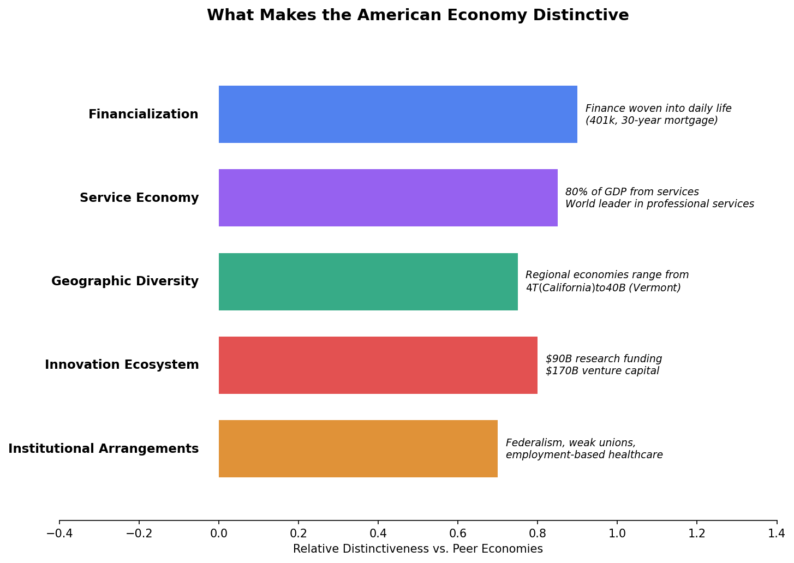
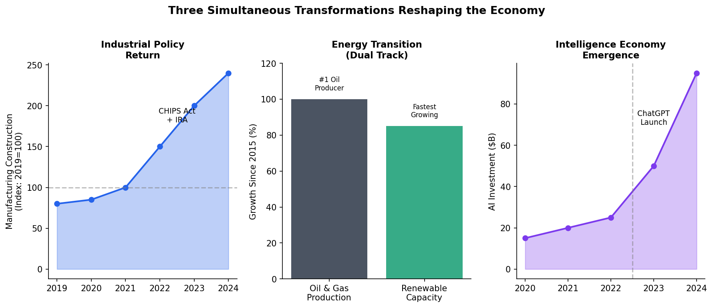
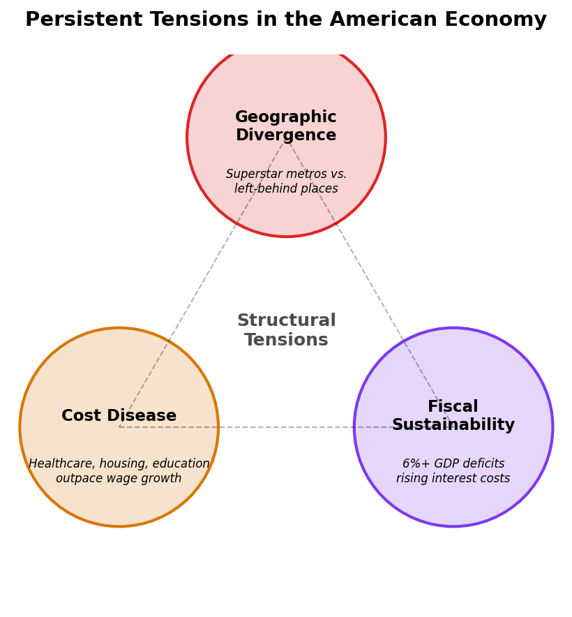

# 29. The American Economy in Perspective

Standing at the vantage point of 2026, the American economy embodies contradictions that would puzzle a time traveler from even the recent past. We achieved the "soft landing" that economists deemed improbable---taming post-pandemic inflation without destroying the labor market---yet national sentiment remains anxious. We see a manufacturing construction boom of historic proportions in a country that has supposedly deindustrialized. We witness the world's most aggressive pivot toward green energy in a nation that is simultaneously the world's largest oil producer. We observe a stock market powered by artificial intelligence reaching unprecedented heights while downtown office towers---the cathedrals of the service economy---stand a quarter empty, artifacts of a work culture that may never fully return.

To conclude this survey of the American economy, we must move beyond the sectoral and regional analyses of the preceding chapters to view the system as a whole. What emerges is not a story of inevitable decline or triumphant exceptionalism, but a portrait of a distinct and dynamic organism---an economy uniquely capable of reinvention and uniquely tolerant of the disruption that reinvention leaves in its wake.

## The View from 2026

The statistical portrait of the United States in the mid-2020s is, by historical standards, remarkable. With a Gross Domestic Product exceeding $29 trillion, the American economy has not just recovered from the COVID-19 shock; it has left other developed economies behind. While Europe struggled with energy shocks and China grappled with property deflation and demographic pressure, the United States powered forward, driven by its perennial engine: the American consumer.

Yet the view from Main Street differs from the view in macroeconomic data. The "vibecession" of 2023-2024 revealed a persistent gap between aggregate statistics and lived experience: households care less about the rate of change than the level of prices. That eggs no longer cost $5 a dozen is small comfort when the memory of $2 eggs remains fresh. The rapid increase in interest rates---from near-zero to over 5%---has created a bifurcated society. For the two-thirds of American households who own homes, many locked in at 3% mortgages, the new rate environment is an abstraction. For the young family trying to buy their first home, it is a crushing barrier that has effectively doubled the cost of shelter.

This "lock-in" effect is the defining microeconomic distortion of our time. It has frozen housing markets, reduced labor mobility (why move for a better job if it means trading a 3% mortgage for a 7% one?), and deepened generational divides. It reminds us that macroeconomic aggregates often obscure as much as they reveal.

## Distinctive Features

Throughout this book, we have encountered features that make the American economy structurally distinct from its peers. These are not merely differences of degree.

<figure>

<figcaption>Figure 29.1: What makes the American economy distinctive. Finance is woven into daily life; services dominate; geographic diversity creates regional economies; innovation infrastructure remains the global standard. Source: Author analysis</figcaption>
</figure>

### The Financialization of Daily Life

No other developed nation has woven finance so deeply into the fabric of ordinary existence. The 30-year fixed-rate mortgage is an American anomaly---a government-subsidized transfer of interest rate risk from households to the financial system that effectively turns homeowners into leveraged real estate investors. The 401(k) retirement system, having largely replaced defined-benefit pensions, forces middle-class workers to become amateur asset managers. The depth of American capital markets---$50 trillion in equity market capitalization, $50 trillion in bond markets---allows the federal government to sustain deficits that would destabilize other nations, backed by the dollar's role as the world's reserve currency. Finance in America is not merely a sector; it is the operating system.

### The Scale of the Service Economy

Public discourse laments the decline of manufacturing while overlooking that the United States is the world's service economy superpower. At nearly 80% of GDP, the service sector---professional services, healthcare, finance, technology, entertainment---has no peer. We export legal structures, management consulting, blockbuster films, and software platforms. The United States runs persistent trade deficits in goods but substantial surpluses in services. The highest value-added products in the global economy are often not physical objects but algorithms, patents, brands, and expertise.

### Geographic Diversity

As the regional chapters demonstrated, the United States contains multitudes. The San Francisco Bay Area, with its $1.3 trillion economy concentrated in technology, bears little resemblance to the Houston metro area, built on energy and healthcare. The Northeast Corridor's density-dependent service economy operates by different rules than the resource economies of rural America. This diversity provides resilience---regional shocks rarely become national crises---but also creates the political tensions of an economy that distributes its gains unevenly across space.

### Institutional Arrangements

American economic institutions differ markedly from those of peer nations. Federalism fragments regulation across fifty states, creating both laboratories of democracy and regulatory arbitrage opportunities. Weak labor unions mean workers bargain individually rather than collectively in most private-sector employment. The absence of universal healthcare ties insurance to employment, creating job lock and entrepreneurship barriers. Zoning authority rests with thousands of local governments, enabling wealthy communities to restrict housing supply and capture appreciation gains. These institutional choices---not natural laws---shape who benefits from economic growth.

### The Innovation Ecosystem

The United States maintains an innovation infrastructure that remains the global standard. Research universities receive over $90 billion annually in research funding. Venture capital investment---though highly cyclical---reached $170 billion in 2024 despite a post-2021 pullback. Immigration policy, for all its dysfunction, continues to attract global talent; over 40% of Fortune 500 companies were founded by immigrants or their children. The combination of deep capital markets, tolerance for failure, and university-industry linkages creates conditions for new firm formation that other nations struggle to replicate.

## Ongoing Transformations

Three simultaneous transformations are reshaping the economic landscape.

<figure>

<figcaption>Figure 29.2: Three simultaneous transformations: the return of industrial policy (CHIPS Act, IRA), the dual-track energy transition, and the emergence of the AI-driven intelligence economy. Source: Author analysis</figcaption>
</figure>

### The Return of Industrial Policy

The era of market neutrality ended with the CHIPS and Science Act, the Inflation Reduction Act, and the Infrastructure Investment and Jobs Act. Collectively, these laws direct hundreds of billions in federal spending and tax credits toward specific industries: semiconductors, electric vehicles, batteries, clean energy, and critical minerals. The invisible hand has been joined by the visible thumb of industrial policy.

The results are already visible in construction data. Manufacturing construction spending tripled from 2021 to 2024, reaching historic levels. The "Battery Belt" across the Southeast---plants in Georgia, Kentucky, Tennessee, and South Carolina---represents billions in investment. Intel's Ohio campus, TSMC's Arizona fabs, and Samsung's Texas expansion anchor a semiconductor archipelago in the desert Southwest.

This is not a restoration of mid-century mass manufacturing employment. Modern semiconductor fabs employ hundreds, not thousands, of workers per facility. The factories being built are cathedrals of automation. But they represent a reanchoring of strategic supply chains---a recognition that efficiency and resilience can conflict, and that the United States had optimized too heavily for the former.

### The Energy Transition

The United States is attempting something no nation has accomplished: leading the transition to renewable energy while remaining the world's largest producer of oil and natural gas. We are simultaneously drilling in the Permian Basin and erecting wind turbines across the Great Plains. The Permian produced over 6 million barrels per day in 2024; Texas generated more electricity from wind than any other state.

This dual-track approach---pragmatic, perhaps hypocritical, but effective---has insulated the United States from energy security crises. While European manufacturers faced existential energy cost pressures after Russia's invasion of Ukraine, American industrial users enjoyed natural gas prices a fraction of European levels. This energy cost advantage has begun to attract European heavy industry across the Atlantic.

The energy transition will reshape regional economies. The Gulf Coast petrochemical complex faces long-term questions, even as it captures short-term gains from cheap feedstock. The renewable energy buildout creates new economic bases in the Great Plains, the desert Southwest, and offshore Atlantic waters. The transition is also a massive industrial policy exercise, with the IRA's tax credits directing private investment toward favored technologies.

### The Intelligence Economy

The integration of large language models and other AI systems into the workforce represents the next great discontinuity. Unlike previous waves of automation that primarily replaced physical labor, this wave targets cognitive tasks---the paralegal review, the code review, the draft memo, the customer service response.

Early evidence suggests counterintuitive effects. AI may compress wage premiums for mid-level knowledge work while supercharging the productivity of elite practitioners who can leverage these tools effectively. If the twentieth century was the era of the "college premium," the twenty-first may become the era of the "adaptation premium"---returns to those who can most effectively integrate AI into their work.

The geographic implications remain uncertain. If AI enables more remote work on complex tasks, it could accelerate the geographic dispersion of knowledge work beyond expensive metros. Or it could further concentrate returns among those with the skills to direct AI systems, likely clustered in existing tech hubs. The Silicon Valley firms building these systems---and capturing their economic rents---have added trillions in market capitalization since 2023.

## Persistent Tensions

For all its dynamism, the American economy faces structural tensions that are not resolving.

<figure>

<figcaption>Figure 29.3: Three interconnected structural tensions: geographic divergence between superstar metros and left-behind places; cost disease in healthcare, housing, and education; and fiscal sustainability concerns as deficits persist at 6%+ of GDP. Source: Author analysis</figcaption>
</figure>

### Geographic Divergence

The divergence between superstar metros and left-behind places has become the primary axis of economic---and political---polarization. Five states account for roughly 40% of national GDP. A handful of metropolitan areas capture the vast majority of venture capital investment. The economic logic of agglomeration, which pulls talent and capital toward dense, educated metros, clashes with the political logic of the Senate and Electoral College, which amplify the voice of less populous states and regions.

This divergence has human costs. Life expectancy, educational attainment, and economic mobility vary dramatically across regions. Deaths of despair---from opioids, alcohol, and suicide---concentrated in regions that lost manufacturing employment in the 1990s and 2000s. The phrase "two Americas" has become cliche, but the data support it.

### The Cost Disease

In sectors exposed to global competition---electronics, apparel, manufactured goods---prices have fallen in real terms for decades. In locally consumed services---healthcare, housing, education, childcare---prices have soared. This asymmetry, which economists call "cost disease," means that middle-class wages purchase more televisions than ever but less security.

Healthcare costs, at 18% of GDP, exceed those of any other developed nation without producing superior outcomes. Housing costs in productive metros consume ever-larger shares of household budgets, rationing access to opportunity. Childcare costs approach college tuition in major cities. The inability to control costs in these sectors has transformed the experience of middle-class life even as aggregate statistics show rising real incomes.

### Fiscal Sustainability

We conclude with the arithmetic that cannot be avoided indefinitely: the federal debt. The United States is running deficits exceeding 6% of GDP---levels associated historically with wartime, not peacetime expansion. We have relied on the world's demand for dollar-denominated safe assets to fund defense, healthcare, and tax cuts simultaneously.

Interest costs on the federal debt have already exceeded defense spending and are rising rapidly as post-pandemic debt is refinanced at higher rates. At some point---whether in five years or twenty---the crowding-out effects of debt service will force choices that the political system has successfully avoided. Medicare, Social Security, defense spending, and tax policy cannot all remain on their current trajectories.

## Conclusion

To study the American economy is to be disabused of simple optimism and simple pessimism alike. It is a system that is at once rapacious and generative, innovative and calcified, fragile and resilient.

The homeless encampments in wealthy coastal cities, the hollowed-out towns of the Rust Belt, and the fragility of supply chains revealed by the pandemic make a compelling case that something is broken. Yet the fusion energy startups in Massachusetts, the battery gigafactories in Georgia, and the extraordinary productive capacity of American workers and firms make an equally compelling case that the capacity for reinvention remains intact.

What distinguishes the American economy is not that it solves problems cleanly but that it solves them at all---often problems that it created for itself. The resolution is typically messy, unequal, and incomplete. The losers from economic transformation receive inadequate compensation. The gains concentrate geographically and demographically. The political system struggles to translate economic change into policy response.

Yet the machine keeps running. The question for the coming decades is not whether the American economy will grow---it almost certainly will---but whether its gains can be shared more broadly across people and places, or whether the tensions documented in this book will eventually overwhelm its capacity for adaptation.

That question cannot be answered by economic analysis alone. It depends on political choices, institutional reforms, and social solidarities that lie beyond the scope of GDP statistics. Economics can illuminate the trade-offs; it cannot make the choices. Those remain the work of democratic politics in an unfinished republic.

---

**Word count:** approximately 2,200 words
