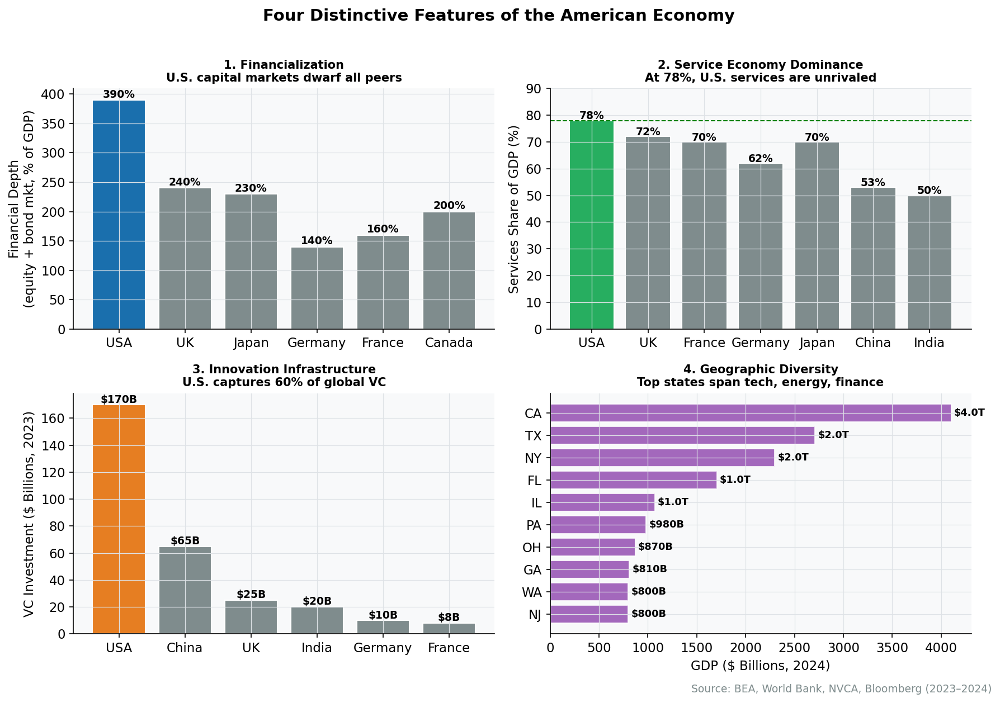
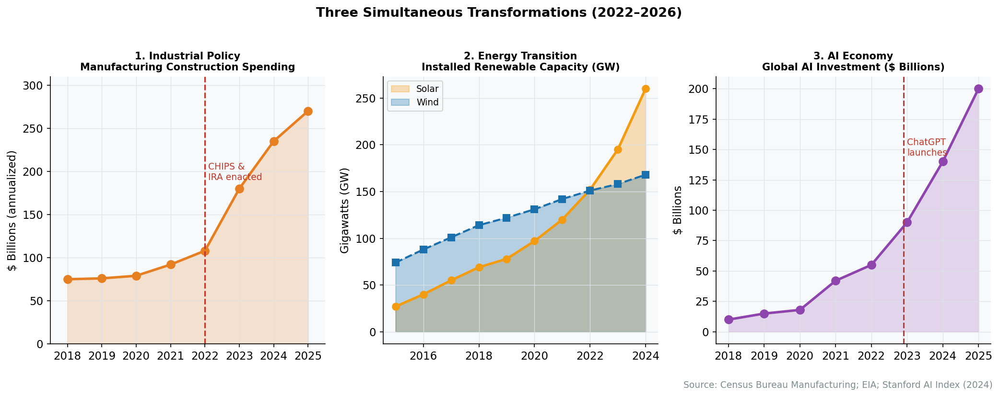
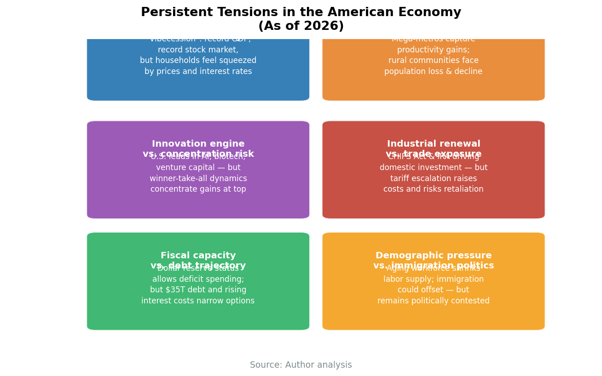

# Chapter 31: The American Economy in Perspective

Standing at the vantage point of 2026, the American economy embodies contradictions that would puzzle a time traveler from even the recent past. We achieved the "soft landing" that economists deemed improbable---taming post-pandemic inflation without destroying the labor market---yet national sentiment remains anxious. We see a manufacturing construction boom of historic proportions in a country that has supposedly deindustrialized. We witness the world's most aggressive pivot toward green energy in a nation that is simultaneously the world's largest oil producer. We observe a stock market powered by artificial intelligence reaching unprecedented heights while downtown office towers---the cathedrals of the service economy---stand a quarter empty, artifacts of a work culture that may never fully return.

To conclude this survey of the American economy, we must move beyond the sectoral and regional analyses of the preceding chapters to view the system as a whole. What emerges is not a story of inevitable decline or triumphant exceptionalism, but a portrait of a distinct and dynamic organism---an economy uniquely capable of reinvention and uniquely tolerant of the disruption that reinvention leaves in its wake.

## The View from 2026

The statistical portrait of the United States in the mid-2020s is, by historical standards, remarkable. With a Gross Domestic Product exceeding $29 trillion, the American economy has not just recovered from the COVID-19 shock; it has left other developed economies behind. While Europe struggled with energy shocks and China grappled with property deflation and demographic pressure, the United States powered forward, driven by its perennial engine: the American consumer.

Yet the view from Main Street differs from the view in macroeconomic data. The "vibecession" of 2023-2024 revealed a persistent gap between aggregate statistics and lived experience: households care less about the rate of change than the level of prices. That eggs no longer cost $5 a dozen is small comfort when the memory of $2 eggs remains fresh. The rapid increase in interest rates---from near-zero to over 5%---has created a bifurcated society. For the two-thirds of American households who own homes, many locked in at 3% mortgages, the new rate environment is an abstraction. For the young family trying to buy their first home, it is a crushing barrier that has effectively doubled the cost of shelter.

This "lock-in" effect is the defining microeconomic distortion of our time. It has frozen housing markets, reduced labor mobility (why move for a better job if it means trading a 3% mortgage for a 7% one?), and deepened generational divides. It reminds us that macroeconomic aggregates often obscure as much as they reveal.

## Distinctive Features

Throughout this book, we have encountered features that make the American economy structurally distinct from its peers. These are not merely differences of degree.


**What Makes the American Economy Distinctive**
- **Financialization**: The 30-year fixed mortgage, 401(k) retirement system, and $50 trillion equity market embed finance into daily life to a degree unmatched in any peer economy.
- **Service economy dominance**: At nearly 80% of GDP, the U.S. service sector---professional services, healthcare, finance, technology, entertainment---has no parallel; the U.S. runs trade surpluses in services even as it runs deficits in goods.
- **Innovation infrastructure**: Research universities ($90B+ in annual funding), deep venture capital markets, high tolerance for failure, and immigrant entrepreneurship create conditions for new firm formation that other nations struggle to replicate.
- **Geographic diversity as resilience**: The economy contains multitudes---from the Bay Area's tech cluster to Houston's energy complex to rural agriculture---so that regional shocks rarely become national crises.


<figure>

<figcaption>Figure 31.1: What makes the American economy distinctive. Finance is woven into daily life; services dominate; geographic diversity creates regional economies; innovation infrastructure remains the global standard. Source: Author analysis</figcaption>
</figure>

### The Financialization of Daily Life

No other developed nation has woven finance so deeply into the fabric of ordinary existence (as examined in Chapters 18 and 19). The 30-year fixed-rate mortgage is an American anomaly---a government-subsidized transfer of interest rate risk from households to the financial system that effectively turns homeowners into leveraged real estate investors. The 401(k) retirement system, having largely replaced defined-benefit pensions, forces middle-class workers to become amateur asset managers. The depth of American capital markets---$50 trillion in equity market capitalization, $50 trillion in bond markets---allows the federal government to sustain deficits that would destabilize other nations, backed by the dollar's role as the world's reserve currency. Finance in America is not merely a sector; it is the operating system.

### The Scale of the Service Economy

Public discourse laments the decline of manufacturing while overlooking that the United States is the world's service economy superpower. At nearly 80% of GDP, the service sector---professional services, healthcare, finance, technology, entertainment---has no peer. We export legal structures, management consulting, blockbuster films, and software platforms. The United States runs persistent trade deficits in goods but substantial surpluses in services. The highest value-added products in the global economy are often not physical objects but algorithms, patents, brands, and expertise.

### Geographic Diversity

As the regional chapters demonstrated (see Chapter 3 for the analytical framework), the United States contains multitudes. The San Francisco Bay Area, with its $1.3 trillion economy concentrated in technology, bears little resemblance to the Houston metro area, built on energy and healthcare. The Northeast Corridor's density-dependent service economy operates by different rules than the resource economies of rural America. This diversity provides resilience---regional shocks rarely become national crises---but also creates the political tensions of an economy that distributes its gains unevenly across space.

### Institutional Arrangements

American economic institutions differ markedly from those of peer nations. Federalism fragments regulation across fifty states, creating both laboratories of democracy and regulatory arbitrage opportunities. Weak labor unions mean workers bargain individually rather than collectively in most private-sector employment. The absence of universal healthcare ties insurance to employment, creating job lock and entrepreneurship barriers. Zoning authority rests with thousands of local governments, enabling wealthy communities to restrict housing supply and capture appreciation gains. These institutional choices---not natural laws---shape who benefits from economic growth.

### How the U.S. Compares: A Structural Overview

The institutional differences catalogued above are easier to grasp in comparative perspective. The table below sets the United States against two other major economic blocs---the European Union and the leading economies of East Asia (principally Japan and South Korea)---across eight structural dimensions. The comparison is necessarily stylized; each bloc contains internal variation. But the broad patterns are instructive.

| Dimension | United States | European Union | East Asia (Japan/S. Korea) |
|-----------|--------------|----------------|---------------------------|
| **Role of government** | Limited direct intervention; regulation-light at the federal level; large fiscal footprint via defense, entitlements, and tax expenditures | Extensive regulatory state; active in consumer protection, environmental standards, and competition policy; fiscal policy constrained by Stability and Growth Pact | Developmental state tradition; government guides strategic sectors through planning agencies, directed credit, and public-private coordination |
| **Labor market regulation** | At-will employment in most states; minimal mandated benefits; low unionization (~6% private sector); high hire-and-fire flexibility | Strong worker protections; works councils and collective bargaining coverage often above 70%; generous mandated leave; dismissal procedures costly and slow | Lifetime employment norms eroding but still influential; enterprise unions in Japan; rigid dual labor markets separating regular and non-regular workers |
| **Healthcare model** | Employer-sponsored insurance dominant; public coverage via Medicare/Medicaid for elderly and low-income; 18% of GDP; no universal system | Universal coverage through single-payer (UK, Nordics) or multi-payer social insurance (Germany, France); 10--12% of GDP; negotiated pricing | Universal coverage via national health insurance (Japan) or single-payer (South Korea); 8--12% of GDP; aggressive cost controls and fee schedules |
| **Industrial policy approach** | Historically market-neutral; post-2022 shift toward targeted subsidies (CHIPS Act, IRA); defense-adjacent R&D as de facto industrial policy | Mixed; state aid rules limit national champions but allow regional development funds; Green Deal as continent-wide industrial strategy | Explicit and long-standing; MITI/METI tradition in Japan; Korean chaebol-government nexus; strategic targeting of export industries |
| **Trade policy orientation** | Open with selective protection; large structural trade deficit in goods; services surplus; dollar as reserve currency absorbs imbalances | Common external tariff; deep internal single market; emphasis on regulatory standards as trade tool; approximately balanced current account | Export-oriented growth model; persistent current account surpluses; currency management historically central; heavy reliance on external demand |
| **Social safety net** | Residualist model; means-tested programs; limited unemployment duration; no universal family policy; safety net expanded temporarily during COVID | Comprehensive welfare states; generous unemployment insurance; universal family benefits; pension systems facing demographic pressure | Firm-based welfare in Japan giving way to public programs; Korea rapidly expanding social spending from a low base; family as traditional safety net |
| **Innovation model** | University-driven basic research; deep venture capital markets; high tolerance for failure; immigration of global talent; winner-take-all dynamics | Public research institutions; Horizon Europe framework; strong in incremental industrial innovation; weaker in disruptive startups; fragmented capital markets | Corporate R&D dominance; incremental manufacturing process innovation; strong patent activity; weaker in software and platform businesses; limited venture ecosystem |
| **Corporate governance** | Shareholder primacy; quarterly earnings pressure; active market for corporate control; high executive compensation; deep equity culture | Stakeholder models; codetermination in Germany; weaker takeover markets; lower executive pay; greater emphasis on social license | Keiretsu and chaebol structures; cross-shareholding networks; relationship banking; long-term orientation but governance opacity; reform pressures mounting |

Several patterns emerge from this comparison. The most fundamental is the American economy's distinctive bargain: it trades equality and security for dynamism and flexibility. The United States tolerates levels of income inequality, labor market churn, and social risk that European and East Asian societies have historically found unacceptable. In return, it generates rates of new firm formation, disruptive innovation, and aggregate growth that its peers struggle to match. This is not an unambiguous win. The American model produces both the world's most valuable technology companies and the highest poverty rate among advanced economies. It attracts the globe's most ambitious talent and leaves tens of millions of its own citizens without adequate healthcare. The trade-off is real, and reasonable people disagree about whether the terms are worth it.

The European model inverts many of these priorities. Comprehensive social insurance, strong worker protections, and universal public services produce more egalitarian outcomes and higher measures of subjective well-being across much of the income distribution. But these protections come at a cost measured in slower GDP growth, lower rates of business formation, and a persistent difficulty in scaling technology firms. Europe has produced no equivalent of the American platform giants; its venture capital markets remain a fraction of American levels. The EU's regulatory state---exemplified by frameworks like GDPR and the AI Act---reflects a societal preference for precaution over experimentation, an orientation that protects consumers but can stifle the messy, rapid iteration that characterizes American innovation cycles.

East Asian economies offer a third template: the developmental state. Japan and South Korea achieved extraordinary postwar growth through aggressive government direction of credit and investment toward strategic export industries. This model produced globally dominant firms in automobiles, electronics, semiconductors, and shipbuilding. But it, too, carries costs. Both nations now face demographic crises more severe than America's, partly because the intense work cultures and high costs that accompanied rapid industrialization suppressed fertility rates. Japan's three decades of stagnation after its asset bubble collapsed illustrate the rigidity risks of a system built on consensus, cross-shareholding, and industrial incumbency. South Korea's chaebol-dominated economy generates impressive headline growth but concentrates wealth and opportunity in ways that fuel deep public frustration. Neither nation has replicated the American capacity for disruptive reinvention---the willingness to let entire industries die so that new ones can be born. What the comparison ultimately reveals is that there is no free lunch in institutional design: every model solves certain problems by creating others.

### The Innovation Ecosystem

The United States maintains an innovation infrastructure that remains the global standard. Research universities receive over $90 billion annually in research funding. Venture capital investment---though highly cyclical---reached $170 billion in 2024 despite a post-2021 pullback. Immigration policy, for all its dysfunction, continues to attract global talent; over 40% of Fortune 500 companies were founded by immigrants or their children. The combination of deep capital markets, tolerance for failure, and university-industry linkages creates conditions for new firm formation that other nations struggle to replicate.

## Ongoing Transformations

Three simultaneous transformations are reshaping the economic landscape.

<figure>

<figcaption>Figure 31.2: Three simultaneous transformations: the return of industrial policy (CHIPS Act, IRA), the dual-track energy transition, and the emergence of the AI-driven intelligence economy. Source: Author analysis</figcaption>
</figure>

### The Return of Industrial Policy

The era of market neutrality ended with the CHIPS and Science Act, the Inflation Reduction Act, and the Infrastructure Investment and Jobs Act. Collectively, these laws direct hundreds of billions in federal spending and tax credits toward specific industries: semiconductors, electric vehicles, batteries, clean energy, and critical minerals. The invisible hand has been joined by the visible thumb of industrial policy.

The results are already visible in construction data. Manufacturing construction spending tripled from 2021 to 2024, reaching historic levels. The "Battery Belt" across the Southeast---plants in Georgia, Kentucky, Tennessee, and South Carolina---represents billions in investment. Intel's Ohio campus, TSMC's Arizona fabs, and Samsung's Texas expansion anchor a semiconductor archipelago in the desert Southwest.

This is not a restoration of mid-century mass manufacturing employment. Modern semiconductor fabs employ hundreds, not thousands, of workers per facility. The factories being built are cathedrals of automation. But they represent a reanchoring of strategic supply chains---a recognition that efficiency and resilience can conflict, and that the United States had optimized too heavily for the former.

### The Energy Transition

The United States is attempting something no nation has accomplished: leading the transition to renewable energy while remaining the world's largest producer of oil and natural gas. We are simultaneously drilling in the Permian Basin and erecting wind turbines across the Great Plains. The Permian produced over 6 million barrels per day in 2024; Texas generated more electricity from wind than any other state.

This dual-track approach---pragmatic, perhaps hypocritical, but effective---has insulated the United States from energy security crises. While European manufacturers faced existential energy cost pressures after Russia's invasion of Ukraine, American industrial users enjoyed natural gas prices a fraction of European levels. This energy cost advantage has begun to attract European heavy industry across the Atlantic.

The energy transition will reshape regional economies. The Gulf Coast petrochemical complex faces long-term questions, even as it captures short-term gains from cheap feedstock. The renewable energy buildout creates new economic bases in the Great Plains, the desert Southwest, and offshore Atlantic waters. The transition is also a massive industrial policy exercise, with the IRA's tax credits directing private investment toward favored technologies.

### The Intelligence Economy

The integration of large language models and other AI systems into the workforce represents the next great discontinuity. Unlike previous waves of automation that primarily replaced physical labor, this wave targets cognitive tasks---the paralegal review, the code review, the draft memo, the customer service response.

Early evidence suggests counterintuitive effects. AI may compress wage premiums for mid-level knowledge work while supercharging the productivity of elite practitioners who can leverage these tools effectively. If the twentieth century was the era of the "college premium," the twenty-first may become the era of the "adaptation premium"---returns to those who can most effectively integrate AI into their work.

The geographic implications remain uncertain. If AI enables more remote work on complex tasks, it could accelerate the geographic dispersion of knowledge work beyond expensive metros. Or it could further concentrate returns among those with the skills to direct AI systems, likely clustered in existing tech hubs. The Silicon Valley firms building these systems---and capturing their economic rents---have added trillions in market capitalization since 2023.

## Persistent Tensions

For all its dynamism, the American economy faces structural tensions that are not resolving.

<figure>

<figcaption>Figure 31.3: Three interconnected structural tensions: geographic divergence between superstar metros and left-behind places; cost disease in healthcare, housing, and education; and fiscal sustainability concerns as deficits persist at 6%+ of GDP. Source: Author analysis</figcaption>
</figure>

### Geographic Divergence

The divergence between superstar metros and left-behind places has become the primary axis of economic---and political---polarization. Five states account for about 40% of national GDP. A handful of metropolitan areas capture the vast majority of venture capital investment. The economic logic of agglomeration, which pulls talent and capital toward dense, educated metros, clashes with the political logic of the Senate and Electoral College, which amplify the voice of less populous states and regions.

This divergence has human costs, as Chapter 32 documents through the lens of shock transmission and its lasting geographic effects. Life expectancy, educational attainment, and economic mobility vary dramatically across regions. Deaths of despair---from opioids, alcohol, and suicide---concentrated in regions that lost manufacturing employment in the 1990s and 2000s. The phrase "two Americas" has become cliche, but the data support it.

### The Cost Disease

In sectors exposed to global competition---electronics, apparel, manufactured goods---prices have fallen in real terms for decades. In locally consumed services---healthcare, housing, education, childcare---prices have soared. This asymmetry, which economists call "cost disease," means that middle-class wages purchase more televisions than ever but less security.

Healthcare costs, at 18% of GDP, exceed those of any other developed nation without producing superior outcomes. Housing costs in productive metros consume ever-larger shares of household budgets, rationing access to opportunity. Childcare costs approach college tuition in major cities. The inability to control costs in these sectors has transformed the experience of middle-class life even as aggregate statistics show rising real incomes.

### Fiscal Sustainability

We conclude with the arithmetic that cannot be avoided indefinitely: the federal debt. The United States is running deficits exceeding 6% of GDP---levels associated historically with wartime, not peacetime expansion. We have relied on the world's demand for dollar-denominated safe assets to fund defense, healthcare, and tax cuts simultaneously.

Interest costs on the federal debt have already exceeded defense spending and are rising rapidly as post-pandemic debt is refinanced at higher rates. At some point---whether in five years or twenty---the crowding-out effects of debt service will force choices that the political system has successfully avoided. Medicare, Social Security, defense spending, and tax policy cannot all remain on their current trajectories.

## Conclusion

To study the American economy is to be disabused of simple optimism and simple pessimism alike. It is a system that is at once rapacious and generative, innovative and calcified, fragile and resilient.

The homeless encampments in wealthy coastal cities, the hollowed-out towns of the Rust Belt, and the fragility of supply chains revealed by the pandemic make a compelling case that something is broken. Yet the fusion energy startups in Massachusetts, the battery gigafactories in Georgia, and the extraordinary productive capacity of American workers and firms make an equally compelling case that the capacity for reinvention remains intact.

What distinguishes the American economy is not that it solves problems cleanly but that it solves them at all---often problems that it created for itself. The resolution is typically messy, unequal, and incomplete. The losers from economic transformation receive inadequate compensation. The gains concentrate geographically and demographically. The political system struggles to translate economic change into policy response.

Yet the machine keeps running. The question for the coming decades is not whether the American economy will grow---it almost certainly will---but whether its gains can be shared more broadly across people and places, or whether the tensions documented in this book will eventually overwhelm its capacity for adaptation.

That question cannot be answered by economic analysis alone. It depends on political choices, institutional reforms, and social solidarities that lie beyond the scope of GDP statistics. Economics can illuminate the trade-offs; it cannot make the choices. Those remain the work of democratic politics in an unfinished republic.

## Exercises

### Review Questions

1. The chapter describes the "vibecession" of 2023--2024 as revealing a "persistent gap between aggregate statistics and lived experience." Explain why households may feel worse off even when GDP is growing and unemployment is low. How does the distinction between the *rate of change* and the *level* of prices help explain consumer dissatisfaction? What does this imply about the limitations of standard macroeconomic indicators as measures of well-being?

2. The 30-year fixed-rate mortgage is described as "an American anomaly" that effectively turns homeowners into "leveraged real estate investors." Explain why this instrument is rare in other developed nations (where adjustable-rate or shorter-term fixed mortgages dominate). How does the government-backed mortgage system---through Fannie Mae, Freddie Mac, and FHA---make the 30-year fixed rate possible? What are the advantages and disadvantages of this arrangement compared to the mortgage systems of countries like Canada (5-year terms), the UK (2--5 year fixes), or Germany (10-year fixes)?

3. The chapter identifies a "lock-in" effect from the gap between existing 3% mortgages and current 7% rates. Trace the consequences of this lock-in through multiple dimensions of the economy: housing market liquidity, labor mobility, generational equity, and local government tax revenue. Why does the chapter call this "the defining microeconomic distortion of our time"? Compare this to situations in other countries where adjustable-rate mortgages transmit monetary policy changes directly to household budgets.

4. The United States is described as simultaneously leading the energy transition and remaining the world's largest oil and gas producer. How has this "dual-track" approach provided the U.S. with competitive advantages over European nations that pursued a faster fossil fuel phase-out? What are the long-term risks of this strategy? Compare the U.S. approach to Germany's *Energiewende* or Norway's sovereign wealth fund model for managing petroleum revenues.

5. Explain the concept of "cost disease" as the chapter uses it. Why do prices fall in globally traded goods (electronics, apparel) but rise in locally consumed services (healthcare, housing, education, childcare)? How does this asymmetry affect the lived experience of middle-class households even as aggregate real incomes rise? Compare U.S. healthcare costs at 18% of GDP to those of peer nations (10--12% of GDP in most OECD countries) and discuss what structural factors---not just policy choices---account for the difference.

6. The chapter argues that American economic institutions "differ markedly" from those of peer nations---citing federalism, weak labor unions, employer-tied health insurance, and fragmented zoning authority. Select two of these institutional features and compare them to the arrangements in a European or East Asian peer economy. For each, evaluate whether the American arrangement produces superior dynamism, greater inequality, or both. Are these institutional differences "choices" that could be reversed, or are they path-dependent features that resist reform?

7. The chapter describes three simultaneous transformations: the return of industrial policy, the energy transition, and the emergence of the AI-driven "intelligence economy." For each transformation, identify one way it might reduce geographic divergence (by bringing investment to left-behind regions) and one way it might increase it (by further concentrating gains in already-prosperous areas). On balance, do you expect these transformations to narrow or widen the gap between "superstar metros" and "left-behind places"?

### Data Exercises

1. **Cross-Country Economic Comparison.** Using FRED and the OECD Data Explorer (https://data-explorer.oecd.org), compile the following indicators for the United States, Germany, Japan, the United Kingdom, and France: (a) GDP per capita in PPP terms, (b) the Gini coefficient for income inequality, (c) healthcare spending as a percentage of GDP, (d) life expectancy at birth, and (e) labor force participation rate. Present the data in a table and write a one-page analysis. Which countries outperform the U.S. on which metrics? Does the data support the chapter's claim that the American economy is "uniquely capable of reinvention and uniquely tolerant of the disruption that reinvention leaves in its wake"?

2. **Mapping Geographic Divergence.** Using BEA regional economic accounts (https://www.bea.gov/data/gdp/gdp-county-metro-and-other-areas) and Census Bureau data, compare GDP per capita, median household income, and population growth across (a) the five largest metropolitan areas and (b) five non-metropolitan or small-metro areas in regions the chapter identifies as "left behind" (e.g., Appalachia, the rural Great Plains, the Mississippi Delta). Calculate the ratio of top-metro to left-behind-area incomes. Then retrieve the FRED series for labor force participation rates by state or metro (where available) to examine whether labor market engagement also diverges. Write a brief report (500--750 words) assessing whether the "two Americas" framing is supported by the most recent data.

3. **Industrial Policy Investment Tracker.** Using data from the White House "Investing in America" tracker (https://www.whitehouse.gov/invest/) and Treasury Department reports on IRA tax credit uptake, compile a list of at least fifteen major manufacturing investments (semiconductor fabs, battery plants, clean energy facilities) announced since 2022. For each, record the location, investment amount, projected employment, and the federal incentive involved (CHIPS grant, IRA tax credit, etc.). Map these investments geographically. Are they concentrated in particular states or regions? Do the locations align with the chapter's description of the "Battery Belt" and "semiconductor archipelago"? Write an analysis (500--750 words) evaluating whether industrial policy is directing investment toward economically distressed areas or toward regions that were already growing.

### Deeper Investigation

1. The chapter states that the American economy's fiscal trajectory---deficits exceeding 6% of GDP, interest costs rivaling defense spending---"cannot be avoided indefinitely," yet the political system has "successfully avoided" making hard choices. Research the current state of federal fiscal sustainability. Using CBO long-term budget projections (https://www.cbo.gov/topics/long-term-budget-projections), FRED data on federal debt as a share of GDP (FYGFGDQ188S), and comparative data on sovereign debt from the IMF Fiscal Monitor, write a research paper (1,500--2,000 words) that addresses: (a) What makes the U.S. fiscal position different from that of other high-debt nations like Japan or Italy---particularly the dollar's reserve currency status? (b) At what point might rising debt service costs begin to crowd out other federal spending or raise borrowing costs? (c) What combination of spending cuts and revenue increases would stabilize the debt-to-GDP ratio, and why has neither party been willing to propose them? Engage with arguments from both deficit hawks and those who argue that sovereign debt in a reserve currency nation poses less risk than conventional analysis suggests.

---
