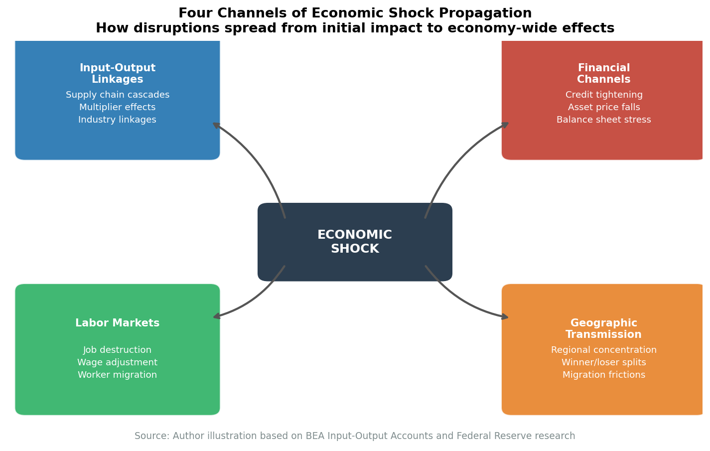
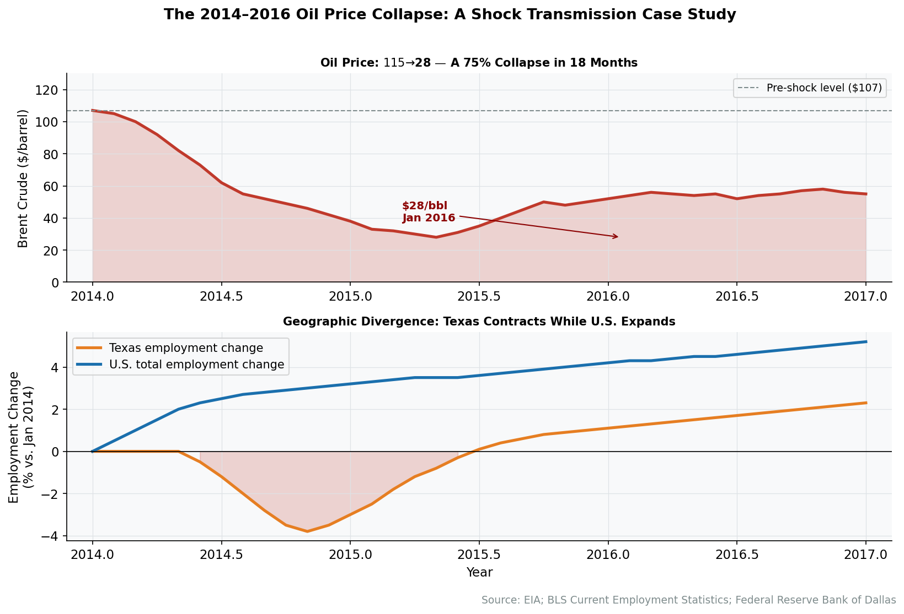

# Chapter 32: How Shocks Move Through the Economy

Throughout this book, we've examined the American economy's structure: its sectors, regions, institutions, and interconnections. But structure isn't static. Understanding how the economy is built matters most when something disrupts it. This chapter brings the structural analysis to life by tracing how economic shocks propagate—through input-output linkages, financial channels, labor markets, and geographic networks.

Economic shocks are perturbations that disrupt normal patterns of production, employment, or prices. They come in many forms: a collapse in oil prices devastates Texas while benefiting consumers elsewhere; a surge in Chinese imports eliminates manufacturing jobs in specific communities; a Federal Reserve rate increase ripples through mortgage markets, housing construction, and bank balance sheets. The economy's response to these shocks depends on its structure—which is why the preceding 31 chapters matter for understanding what happens when things change.

## The Propagation Framework

Economic shocks transmit through multiple channels simultaneously. Understanding these channels helps explain why some shocks spread broadly while others remain contained, why some communities recover quickly while others never do.

<figure>

<figcaption>Figure 32.1: The four primary channels through which economic shocks propagate: input-output linkages (supply chain cascades), financial channels (credit and balance sheets), labor markets (jobs, wages, migration), and geographic transmission (regional concentration). <a href="https://laurencehw.github.io/the-american-economy/book/_interactive/shock-propagation.html" target="_blank">View interactive version</a>. Source: Author illustration</figcaption>
</figure>

### Input-Output Linkages: The Production Network

The input-output framework introduced in Chapter 2 provides the foundation for understanding how shocks propagate through the production network. Every industry purchases inputs from other industries and sells its output to downstream buyers. A shock to one sector creates ripples throughout this network.

**Direct effects** are the immediate impact on the shocked sector itself. When oil prices collapse, oil production falls.

**Indirect effects** arise through supply chain linkages. Lower oil production means reduced demand for steel pipe, drilling services, and oilfield equipment. These suppliers cut their own production and employment, reducing their purchases from *their* suppliers in turn.

**Induced effects** occur when workers who lose income reduce their consumer spending. Laid-off oil workers buy fewer cars, eat out less, and delay home purchases. This affects sectors (retail, restaurants, housing) with no direct link to oil.

The combined impact—direct plus indirect plus induced—is the **multiplier effect**. An initial $1 shock to final demand can reduce GDP by $1.50 or $2.00 once all the propagation effects work through. The multiplier depends on the sector's position in the production network: shocks to highly connected sectors amplify more than shocks to peripheral ones.

### Geographic Transmission: Where Shocks Land

Shocks don't fall evenly across the country. Geographic concentration creates winners and losers:

- **Producing regions** bear concentrated pain when their key industry contracts. The Bakken oil field, Midwestern manufacturing towns, and Appalachian coal communities experienced localized depressions when their industries declined.
- **Consuming regions** may benefit from the same shock. Lower oil prices that devastated Texas transferred billions in purchasing power to consumers in oil-importing states.
- **Supply chain geography** determines secondary effects. Houston suffered during the oil collapse partly because so many oilfield service and equipment companies are headquartered there—the indirect effects concentrated where the suppliers cluster.

The structural features documented in Chapters 23-27 (regional economies) determine which communities face which exposures. Diversified metros like Houston absorb shocks better than specialized towns like Midland. Elastic housing markets like Texas adjust through prices; constrained markets like San Francisco adjust through quantities.

### Financial Transmission: Credit and Balance Sheets

Financial channels amplify shocks through leverage and interconnection:

- **Asset price changes** affect household and corporate balance sheets. The 2006-2012 housing crash destroyed $8 trillion in household wealth, contracting consumption far beyond what direct job losses would have caused.
- **Credit conditions** tighten during downturns as banks pull back lending, creating a vicious cycle: economic weakness leads to tighter credit, which deepens the weakness.
- **Financial institution stress** can cascade through the system. The 2008 crisis showed how losses at one institution—Lehman Brothers—could freeze credit markets globally.

The financial architecture described in Chapters 18-20 determines how these channels operate. Highly levered systems amplify shocks; well-capitalized systems absorb them.

### Labor Market Transmission: Jobs and Migration

Labor markets are where shocks become personal:

- **Job destruction** affects specific workers in specific places. The China shock didn't eliminate "manufacturing jobs" abstractly—it eliminated jobs at particular plants in particular towns.
- **Wage adjustments** spread pain or gain across workers in a sector or region. When an industry contracts, wages fall even for workers who keep their jobs.
- **Migration** is the traditional adjustment mechanism. Workers are supposed to leave declining regions for growing ones. In practice, migration has slowed dramatically, leaving communities stuck with mismatched labor markets.
- **Skills mismatch** creates persistent unemployment. A laid-off autoworker can't immediately become a software engineer, even if tech jobs are growing.

### Time Dynamics: Immediate, Adjustment, Long-Run

Shocks unfold over multiple time horizons:

**Immediate effects** (weeks to months): Prices adjust quickly. Employment adjusts slowly. Inventories buffer production for a time.

**Adjustment period** (1-3 years): Labor markets respond as workers are laid off or hired. Investment responds as companies expand or contract capacity. Migration begins, though slowly.

**Long-run effects** (5+ years): Some shocks leave permanent marks—"hysteresis" in the jargon. Communities that lose their economic base may never recover. Workers who exit the labor force may never return. The China shock's effects on manufacturing communities are still visible 20 years later.

## Case Study: The 2014-2016 Oil Price Collapse

Chapter 2 introduced this episode through the lens of input-output linkages---backward linkages to suppliers, forward linkages to consumers, and the resulting multiplier effects. Here we return to the same shock but trace it through *all four* transmission channels: production networks, geographic concentration, financial amplification, and labor market adjustment. The difference in scope shows why the I-O framework alone, while powerful, tells only part of the story.

<figure>

<figcaption>Figure 32.2: The 2014-2016 oil price collapse. Brent crude fell from $115 to $28 per barrel; the U.S. rig count collapsed 80% from 1,600 to 316. The shock devastated energy-producing regions while benefiting consumers elsewhere. Source: EIA, Baker Hughes</figcaption>
</figure>

### The Initial Shock

Brent crude oil prices fell from $115 per barrel in June 2014 to $28 per barrel in January 2016—a 76% decline. The proximate cause was OPEC's decision to defend market share rather than prices, flooding an already oversupplied market.

For the American economy, this was simultaneously a negative supply shock (devastating energy-producing regions) and a positive demand shock (benefiting consumers everywhere else). The net effect was roughly neutral for national GDP, but the geographic distribution was anything but neutral.

### First-Round Effects: The Energy Sector

The direct impact hit the oil and gas industry immediately:

**Employment**: The oil and gas extraction sector shed over 150,000 jobs between late 2014 and early 2016. Oilfield services lost even more—drillers, equipment operators, service technicians.

**Investment**: Active rig counts plummeted from 1,600 to 316—an 80% decline. Capital expenditures by exploration and production companies fell by more than half. Projects were cancelled, drilling programs suspended, expansion plans shelved.

**Corporate stress**: Over 100 North American oil and gas producers filed for bankruptcy in 2015-2016. High-yield energy bonds, which had funded much of the shale boom, suffered default rates exceeding 15%.

### Second-Round Effects: The Supply Chain

The shock propagated through input-output linkages to oil's suppliers:

**Steel pipe manufacturers**: Demand for drilling pipe collapsed. Steel mills in Arkansas and Texas cut production and laid off workers.

**Industrial equipment**: Caterpillar and other heavy equipment makers saw orders fall as mining and drilling investment contracted.

**Transportation**: Trucking companies serving the oil fields lost business. Railroads that had invested in crude-by-rail infrastructure saw volumes plummet.

**Professional services**: Engineering firms, environmental consultants, and legal practices with energy practices contracted.

**Real estate**: Houston office vacancy rates spiked as energy companies consolidated and cut space. Midland housing prices fell 20-30% as workers departed. Man-camps near drilling sites emptied.

### Third-Round Effects: Induced Spending

Laid-off energy workers cut their spending, creating induced effects:

**Retail**: Car dealerships in Midland reported sales falling by half. Restaurants near oil fields closed. Consumer spending in energy-producing metros visibly softened.

**Housing**: Beyond the direct real estate impact, reduced spending power depressed housing markets across Texas. The San Antonio and Austin markets, distant from drilling, still felt effects as the entire Texas economy slowed.

**Local services**: Doctors, dentists, lawyers, and other professionals serving energy workers saw reduced demand.

### Geographic Concentration

The shock's geographic distribution followed the production map:

**Permian Basin (West Texas/New Mexico)**: The epicenter. Midland unemployment jumped from 2.4% to 4.9%. Hotel occupancy collapsed. Restaurants closed. The local housing market crashed.

**Bakken (North Dakota)**: Williston, which had grown from 12,000 to 35,000 residents during the boom, contracted rapidly. Workers left as quickly as they had arrived. North Dakota's unemployment rate tripled.

**Eagle Ford (South Texas)**: Employment growth in the San Antonio-New Braunfels metro slowed dramatically. Smaller towns entirely dependent on oil suffered worse.

**Gulf Coast refining**: Refiners actually benefited from lower crude prices—their input costs fell while product prices held steadier. The Houston metro's diversification across the oil value chain provided some buffer.

### Financial Transmission

The shock propagated through financial channels:

**High-yield energy debt**: The "junk bond" market had funded much of the shale revolution. As companies defaulted, investors fled the asset class. Energy bond spreads widened to distressed levels, shutting weaker producers out of capital markets entirely.

**Regional bank exposure**: Banks concentrated in Texas and Oklahoma faced rising non-performing loans. Several smaller banks failed. Larger regional banks like Cullen/Frost increased loan loss reserves substantially.

**Private equity losses**: Firms that had invested in oil and gas during the boom faced writedowns. Some positions went to zero.

### Consumer Benefits

For the 95% of Americans who don't work in energy, the oil collapse was good news:

**Gasoline prices**: The national average fell from nearly $4/gallon to below $2. For a household driving 30,000 miles annually in a 25-mpg vehicle, this represented savings of $2,400 per year—a meaningful boost to purchasing power.

**Transportation costs**: Airlines, trucking companies, and other transport-intensive businesses saw lower fuel costs. Some passed savings to consumers; others captured improved margins.

**Chemicals and plastics**: Industries using petroleum as feedstock benefited from lower input costs.

### Adjustment and Recovery

By 2018, the industry had adjusted:

**Productivity gains**: Surviving producers learned to operate profitably at $50 oil instead of $80. Breakeven costs in the Permian fell dramatically through better technology, improved completion techniques, and aggressive cost-cutting.

**Consolidation**: Weaker producers were acquired or liquidated. The industry emerged more concentrated and better capitalized.

**Capital discipline**: Investors who had funded growth-at-any-cost demanded returns. Companies shifted from maximizing production to maximizing cash flow.

**Structural employment loss**: Even as production recovered to record levels by 2019, employment didn't fully return. The industry had learned to produce more oil with fewer workers—a permanent productivity improvement that looked like a permanent job loss to the workers who never got called back.

## Comparative Analysis: Other Major Shocks

The oil shock illustrates the transmission framework, but other shocks activate different channels with different effects.

### The China Shock (2000-2010)

The China shock—the surge in imports following China's WTO accession—transmitted primarily through product market competition, with devastating effects on specific communities.

**Transmission mechanism**: Unlike oil, where prices adjusted to balance supply and demand, the China shock worked through quantities. American factories lost market share to Chinese imports. Plants that couldn't match Chinese costs closed. Workers lost jobs.

**Geographic concentration**: The shock devastated communities specialized in the goods China produced: furniture in North Carolina, textiles across the Southeast, electronics assembly in multiple states. Research by Autor, Dorn, and Hanson documented that commuting zones with greater import exposure experienced larger employment losses, higher disability enrollment, and elevated mortality.

**Labor market response**: Displaced manufacturing workers largely didn't find equivalent employment elsewhere. The standard economic adjustment mechanisms—wage flexibility, geographic mobility, sectoral reallocation—failed to absorb workers at anything like the rate they were displaced. Many left the labor force entirely.

**Long-run effects**: Twenty years later, the affected communities still show the scars. Manufacturing employment never recovered. The skills and social capital embedded in factory work didn't transfer to other sectors. The China shock contributed to political realignment as affected voters shifted toward protectionist candidates.

### The Housing Bust (2006-2012)

The housing bust transmitted primarily through balance sheets—the wealth effect on households and the asset quality shock to financial institutions.

**Wealth destruction**: American homeowners lost roughly $8 trillion in home equity between 2006 and 2009. For households whose homes represented their primary asset, this wealth destruction was catastrophic.

**Consumption collapse**: Mian and Sufi documented that zip codes with larger house price declines experienced larger drops in consumer spending. Households that felt poorer spent less—on cars, appliances, restaurants, and everything else.

**Financial contagion**: The housing bust became a financial crisis because mortgages had been securitized and distributed throughout the financial system. When housing prices fell and defaults rose, the securities backed by those mortgages fell in value. Banks holding these securities faced insolvency. The uncertainty about who held how much toxic paper froze interbank lending, transmitting a housing shock into a credit crisis affecting the entire economy.

**Geographic variation**: The "Sand States" (Arizona, California, Florida, Nevada) experienced the largest price declines—50-60% in some markets. Texas, which never had a boom, never had a bust. Supply-constrained coastal markets fell less and recovered faster.

### The 2022-2023 Monetary Policy Tightening

The Fed's rate increases transmitted through multiple channels simultaneously, demonstrating both intended and unintended effects of monetary policy.

**Mortgage rates**: The 30-year fixed rate doubled from 3% to 7%, crushing housing affordability and freezing the existing home market as locked-in borrowers refused to sell.

**Asset prices**: Rising rates mechanically reduce bond prices. Banks holding long-duration securities saw billions in unrealized losses, creating the fragility that ultimately sank Silicon Valley Bank.

**Credit conditions**: Banks tightened lending standards, particularly for commercial real estate and small business. The intended credit channel worked—but perhaps too abruptly.

**Sectoral variation**: Interest-rate-sensitive sectors (housing, autos) contracted sharply. Tech startups dependent on equity financing saw their funding environment collapse. Cash-rich companies faced minimal impact.

## Policy Responses and Their Transmission

Government responses to shocks themselves propagate through the economy. Understanding this transmission is essential for evaluating policy.

### Fiscal Policy: The CHIPS Act and IRA

The CHIPS and Science Act ($52.7 billion for semiconductors) and Inflation Reduction Act (roughly $370 billion for clean energy) represent deliberate positive shocks to specific sectors.

**Direct effects**: Semiconductor fabs are under construction in Arizona, Ohio, and Texas. Battery plants are rising across the "Battery Belt" from Georgia to Michigan.

**Geographic transmission**: These investments concentrate in specific regions—often politically targeted. The industrial policy explicitly aims to bring manufacturing to communities that lost it.

**Supply chain development**: The investments aim to catalyze domestic supply chains. Intel's Ohio fab requires suppliers; suppliers need their own suppliers. The multiplier logic works in reverse—positive shocks should propagate through input-output linkages just as negative ones do.

**Limits**: Whether policy-driven investment achieves the same multipliers as market-driven investment remains debated. Government-directed capital may flow to politically favored rather than economically efficient locations.

### Monetary Policy: The Fed Response

The Federal Reserve's response to shocks works through the financial transmission channels:

**Interest rate adjustments**: Lower rates stimulate borrowing and spending; higher rates cool them. But the transmission is imperfect—credit rationing means banks may not lend even when rates fall.

**Quantitative easing**: Asset purchases inject reserves into the banking system and lower long-term yields. The wealth effect from higher asset prices was the primary transmission mechanism.

**Emergency facilities**: During crises, the Fed becomes lender of last resort not just for banks but for the entire financial system. The 2008 and 2020 interventions prevented financial collapse from transmitting into complete economic shutdown.

### Trade Policy: Tariffs

Tariffs on Chinese goods, imposed starting in 2018, represent deliberate supply shocks intended to benefit domestic producers:

**Direct effects**: Higher prices for imported goods; some reshoring of production.

**Downstream transmission**: Tariffs on intermediate goods (steel, aluminum, components) raise costs for downstream manufacturers. The tariffs on Chinese steel may cost more jobs in steel-using industries than they save in steel-producing ones.

**Consumer effects**: Higher prices for tariffed goods effectively act as a tax on consumption. The incidence falls disproportionately on lower-income households who spend more of their income on goods.

## What Structure Tells Us About Vulnerability

The preceding chapters documented the American economy's structure. What does that structure tell us about vulnerability to future shocks?

### Concentrated Industries = Concentrated Risk

Industries with geographic concentration create communities whose fates rise and fall with a single sector:

- **Energy**: The Permian Basin, North Dakota, and Wyoming depend heavily on oil and gas. Price volatility directly translates to economic volatility.
- **Automotive**: Michigan and Ohio remain exposed to automotive disruption, whether from EV transition, trade policy, or demand shocks.
- **Tech**: The Bay Area's concentration in technology creates enormous wealth when tech booms and significant vulnerability when it busts.
- **Agriculture**: Rural communities dependent on commodity prices face boom-bust cycles tied to global markets and weather.

### Supply Chain Fragility

The 2021-2022 supply chain crisis revealed vulnerabilities in global production networks:

- **Single points of failure**: Concentration of semiconductor production in Taiwan, pharmaceutical ingredients in China, and container shipping through a few major ports creates systemic risk.
- **Just-in-time inventory**: Optimizing for efficiency left no buffer for disruption. The system that worked brilliantly in normal times failed spectacularly under stress.
- **Logistics bottlenecks**: The LA/Long Beach port complex handles 40% of containerized imports. When it congested, the entire country felt the effects.

### Financial Leverage

Leverage amplifies shocks. The 2008 crisis demonstrated how levered positions unwind catastrophically. The March 2023 bank stress showed that even "safe" assets can destabilize institutions through duration mismatch:

- **Household leverage**: Mortgage debt exposes households to housing price declines and interest rate increases.
- **Corporate leverage**: Private credit and leveraged loans have grown rapidly. A recession would test this exposure.
- **Bank leverage**: Capital requirements have increased since 2008, but SVB showed that regulatory frameworks don't capture all risks.

### Low-Diversity Metros

Metropolitan areas with concentrated industry bases are more vulnerable than diversified ones:

- **High vulnerability**: Midland (oil), Flint (autos), Atlantic City (gaming) face existential risk from single-sector decline.
- **Lower vulnerability**: New York, Los Angeles, and Chicago have diversified economies where no single sector dominates.
- **Moderate vulnerability**: Houston illustrates the middle case—heavily tilted toward energy but diversified enough within the sector to partially buffer shocks.

### Policy Can Redirect But Not Eliminate Shocks

Policy can shift who bears the burden of shocks but rarely eliminates the burden entirely:

- **Trade protection** shifts costs from domestic producers to domestic consumers and foreign exporters.
- **Bailouts** shift costs from current stakeholders to future taxpayers.
- **Monetary policy** shifts costs across time (higher inflation now vs. slower growth later).

The question is never whether to eliminate shocks but how to allocate their costs—across sectors, regions, income groups, and generations.

## Conclusion: Structure as Destiny

Understanding the American economy's structure—its sectors, geography, institutions, and linkages—provides the foundation for understanding how it responds to shocks. The input-output linkages determine which industries feel indirect effects. The geographic distribution determines which communities bear concentrated pain or gain. The financial architecture determines whether shocks amplify or dampen as they propagate. The labor market structure determines whether workers adjust smoothly or suffer prolonged displacement.

The shocks examined in this chapter—oil prices, Chinese imports, housing busts, monetary tightening—are not anomalies. They are the normal way an economy evolves. The question is not whether shocks will occur but how the economy's structure will shape their transmission and ultimate impact.

This returns us to the book's central premise: the American economy is not an abstraction of supply and demand curves but a concrete structure of industries, firms, workers, and institutions, located in specific places and connected through specific channels. That structure matters—for understanding how the economy works, and for understanding what happens when something changes.

---

## Data Sources and Further Reading

### Academic Sources

- Autor, David H., David Dorn, and Gordon H. Hanson. "The China Shock: Learning from Labor-Market Adjustment to Large Changes in Trade." *Annual Review of Economics* 8 (2016): 205-240.
- Mian, Atif, and Amir Sufi. *House of Debt: How They (and You) Caused the Great Recession, and How We Can Prevent It from Happening Again*. University of Chicago Press, 2014.
- Bernanke, Ben, and Mark Gertler. "Inside the Black Box: The Credit Channel of Monetary Policy Transmission." *Journal of Economic Perspectives* 9, no. 4 (1995): 27-48.
- Hamilton, James D. "Causes and Consequences of the Oil Shock of 2007-08." *Brookings Papers on Economic Activity* (2009): 215-283.

### Government Sources

- Bureau of Economic Analysis, Input-Output Accounts
- Bureau of Labor Statistics, Current Employment Statistics
- Federal Reserve, Senior Loan Officer Survey
- Energy Information Administration, Short-Term Energy Outlook

### Policy Analysis

- Federal Reserve Bank regional research on local economic shocks
- Brookings Institution, "The Geography of Prosperity"
- Economic Innovation Group, "Distressed Communities Index"

## Exercises

### Review Questions

1. The chapter identifies four primary channels of shock transmission: input-output linkages, geographic transmission, financial transmission, and labor market transmission. For each channel, provide a one-sentence definition and a concrete example from the chapter. Then explain why understanding all four channels simultaneously is necessary---that is, why analyzing only one channel in isolation would produce a misleading picture of how a shock propagates.

2. Distinguish among direct effects, indirect effects, and induced effects in the input-output framework. Using the 2014--2016 oil price collapse as the example, trace each type of effect: the direct employment losses in oil and gas extraction, the indirect impact on steel pipe manufacturers and oilfield equipment companies, and the induced spending reductions by laid-off energy workers. Why is the combined "multiplier effect" larger for highly connected sectors than for peripheral ones?

3. The chapter describes the 2014--2016 oil price collapse as "simultaneously a negative supply shock (devastating energy-producing regions) and a positive demand shock (benefiting consumers everywhere else)." Explain this duality. Why was the net effect roughly neutral for national GDP even though the geographic distribution was "anything but neutral"? What does this case reveal about the limitations of aggregate national statistics for understanding the real impact of economic shocks?

4. Compare the transmission mechanisms of the China shock (2000--2010) and the housing bust (2006--2012). The chapter argues that the China shock transmitted primarily through "product market competition" and "quantities," while the housing bust transmitted through "balance sheets" and "wealth effects." Explain this distinction. Why did the China shock produce persistent, geographically concentrated damage to specific communities, while the housing bust produced a broader but in some ways more recoverable national recession?

5. The chapter introduces the concept of "hysteresis"---the idea that some shocks leave permanent marks. Using the China shock example, explain why the "standard economic adjustment mechanisms---wage flexibility, geographic mobility, sectoral reallocation---failed to absorb workers at anything like the rate they were displaced." What structural features of the American economy (housing lock-in, skills mismatch, declining geographic mobility) contribute to hysteresis? Why is this concept important for policy---that is, why does hysteresis change the cost-benefit analysis of allowing versus preventing economic disruptions?

6. The chapter argues that "policy can shift who bears the burden of shocks but rarely eliminates the burden entirely," citing trade protection, bailouts, and monetary policy as examples. For each of these three policy tools, identify who gains and who loses when the policy is deployed. Why does the chapter frame the fundamental question as "not whether to eliminate shocks but how to allocate their costs---across sectors, regions, income groups, and generations"?

7. The section on vulnerability identifies concentrated industries, supply chain fragility, financial leverage, and low-diversity metros as key sources of economic risk. Using the framework developed in the chapter, assess the vulnerability of a single metropolitan area of your choice. What is its dominant industry? How geographically concentrated is that industry? What supply chain dependencies exist? How leveraged are households and firms? Based on this analysis, what type of shock would pose the greatest threat to this metro, and through which channels would the damage propagate?

### Data Exercises

1. **Tracing an Oil Shock Through the Data.** Using FRED, retrieve the following series for the period 2013--2019: West Texas Intermediate crude oil price (DCOILWTICO), total nonfarm employment in Texas (TXNA), the unemployment rate in Midland, TX (MIDL448URN), and U.S. real personal consumption expenditures (PCEC96). Plot all four series on a common timeline. Identify the lag between the oil price decline (beginning mid-2014) and the employment response in Texas and Midland. Then compare the timing of the consumer spending response nationally. Write a one-page analysis using the chapter's propagation framework to explain the sequence: Why do prices move first, employment second, and induced consumption effects last? How does the Midland-specific data illustrate the concept of geographic concentration of shocks?

2. **Input-Output Multipliers.** Download the most recent BEA Input-Output "Use" table (available at https://www.bea.gov/industry/input-output-accounts-data) for the U.S. economy. Identify the top five industries that purchase the most from the "Oil and gas extraction" sector (NAICS 211). Then identify the top five industries that sell the most to oil and gas extraction. Using this data, explain why the oil price collapse's indirect effects were concentrated in specific downstream and upstream industries. Compare the interconnectedness of oil and gas to that of a less connected sector (e.g., "Performing arts and spectator sports"). Which sector would produce a larger multiplier if shocked, and why?

3. **Housing Bust Geographic Variation.** Using FRED, retrieve the S&P/Case-Shiller home price indices for four metro areas: Las Vegas (LVXRSA), Phoenix (PHXRSA), Dallas (DAXRSA), and San Francisco (SFXRSA). Plot all four from 2004 to 2015. Calculate the peak-to-trough decline for each metro. Then retrieve unemployment rate data for the same four metros over the same period. Write a brief analysis (500--750 words) explaining why the "Sand States" experienced larger price declines, why Texas "never had a boom" so "never had a bust," and how the chapter's framework of financial transmission (leverage, wealth effects) explains the variation. Discuss whether supply-constrained markets like San Francisco "fell less and recovered faster" as the chapter claims.

### Deeper Investigation

1. The chapter examines shocks that have already occurred---the oil collapse, the China shock, the housing bust, monetary tightening. Apply the chapter's four-channel propagation framework to a shock that is currently unfolding or may occur in the near future. Choose one of the following: (a) a major disruption to semiconductor supply chains (e.g., a Taiwan Strait crisis), (b) the rapid displacement of knowledge workers by AI systems, or (c) a sharp correction in commercial real estate values as remote work permanently reduces office demand. For your chosen shock, write a research paper (1,500--2,000 words) that traces its likely propagation through each of the four channels: input-output linkages (which industries would be directly and indirectly affected?), geographic transmission (which regions or metro areas are most exposed?), financial transmission (what balance sheet and credit effects would occur?), and labor market transmission (which workers would be displaced and what adjustment mechanisms would or would not operate?). Use specific data from BEA, BLS, FRED, and Census sources to support your analysis. Conclude by evaluating what policy responses could mitigate the damage and through which channels those policies would operate.

---

*Chapter 32 | How Shocks Move Through the Economy*
*The American Economy: A Structural Geography*
*Draft v1 --- January 2026*
